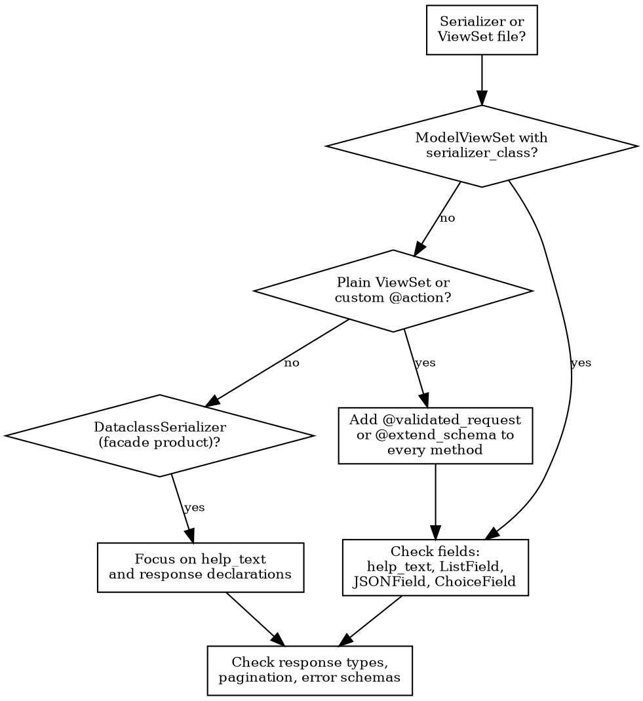

# Improving DRF Endpoints

## Overview

Serializer fields are the source of truth for PostHog's entire type pipeline:

```text
Django serializer → drf-spectacular → OpenAPI JSON → Orval → Zod schemas → MCP tools
```

Every `help_text`, every field type, every `@extend_schema` annotation flows downstream.
A missing `help_text` means an agent guessing at parameters.
A bare `ListField()` means `z.unknown()` in the generated Zod schema.
Getting the serializer right means every consumer — frontend types, MCP tools, API docs — gets correct types and descriptions automatically.

## When to use

- Editing or reviewing any file that defines a `Serializer` or `ViewSet`
- Fixing OpenAPI spec warnings or generated type issues
- Preparing an endpoint for MCP tool exposure
- Code review of API changes

## Audit checklist

### Triage: check the generated output first

Before diving into Python, look at the committed generated types to see what's broken.
Find the generated files for the endpoint's product:

- Core API: `frontend/src/generated/core/`
- Product APIs: `products/<product>/frontend/generated/`

Each has two files:

- **`api.schemas.ts`** — TypeScript interfaces derived from serializers. Search for the serializer name and look for `unknown` types (bare `ListField`/`JSONField`), missing JSDoc descriptions (missing `help_text`), or overly generic `Record<string, unknown>` shapes.
- **`api.ts`** — API client functions. Check if the endpoint's operation exists at all — if missing, the viewset method likely lacks `@extend_schema`.

This tells you exactly which fields and endpoints to prioritize.

### Serializer fields

Work through this list for every serializer and viewset you touch.

1. **Every field has `help_text`** — describes purpose, format, constraints, valid values
2. **No bare `ListField()` or `DictField()`** — always specify `child=` with a typed serializer or field
3. **No bare `JSONField()`** — create a custom field class with `@extend_schema_field(TypedSchema)`
4. **`SerializerMethodField` has `@extend_schema_field`** on its `get_*` method
5. **`ChoiceField` has explicit `choices=`** with all valid values listed
6. **Read vs write serializers are separate** when input shape differs from output
7. **Every success response is backed by a serializer** — returning raw dicts or untyped lists means no generated types downstream

See [serializer-fields.md](references/serializer-fields.md) for patterns and examples.

### Viewset and action annotations

8. **Every custom `@action` has `@extend_schema` or `@validated_request`** — without it, drf-spectacular discovers zero parameters
9. **Plain `ViewSet` methods have schema annotations** — `ModelViewSet` with `serializer_class` is auto-discovered; plain `ViewSet` is not
10. **`@extend_schema` is on the actual method** (`get`, `post`, `create`, `list`), not on a helper or the class itself
11. **Error responses are typed** — use `OpenApiResponse(response=ErrorSerializer)`, not `OpenApiTypes.OBJECT`
12. **List endpoints declare pagination** — reset with `pagination_class=None` on custom actions that don't paginate
13. **Prefer `@validated_request`** over manual `serializer.is_valid()` + `@extend_schema` — it handles both in one decorator
14. **ViewSets outside `products/` need `@extend_schema(tags=["<product>"])`** — ViewSets in `products/<name>/backend/` are auto-tagged via module path, but ViewSets in `posthog/api/` or `ee/` are not. Without the tag, the MCP scaffold and frontend type generator can't route the endpoint to the right product

**Streaming endpoints:** For SSE or streaming responses, use `@extend_schema(request=InputSerializer, responses={(200, "text/event-stream"): OpenApiTypes.STR})` to document the request schema even though the response can't be fully typed.

See [viewset-annotations.md](references/viewset-annotations.md) for patterns and examples.

### Facade products (DataclassSerializer)

For products using the facade pattern (e.g., `visual_review`) with `DataclassSerializer` wrapping frozen dataclasses from `contracts.py`:

- Field types are auto-derived from the dataclass — fewer typing issues by design
- Focus on **`help_text`** (dataclass fields don't carry it; add it on the serializer field overrides)
- **`@validated_request`** is already the standard pattern — verify response serializers are declared
- `@extend_schema` tags and descriptions still need to be set on viewset methods

## Decision flowchart



## Quick reference

See [quick-reference-table.md](references/quick-reference-table.md) for a scannable "I see X, do Y" lookup.

See [common-anti-patterns.md](references/common-anti-patterns.md) for before/after code pairs.

## Canonical examples in the codebase

- **JSONField + @extend_schema_field:** `posthog/api/alert.py`
- **@validated_request:** `products/tasks/backend/api.py`
- **help_text + typed responses:** `products/llm_analytics/backend/api/evaluation_summary.py`
- **Facade product:** `products/visual_review/backend/presentation/views.py`

## Related

- **Downstream:** After fixing serializers, use the `implementing-mcp-tools` skill to scaffold MCP tools
- **Pipeline docs:** `docs/published/handbook/engineering/type-system.md`
- **Mixins:** `posthog/api/mixins.py` (`@validated_request` source)
- **drf-spectacular config:** `posthog/settings/web.py` (`SPECTACULAR_SETTINGS`)
