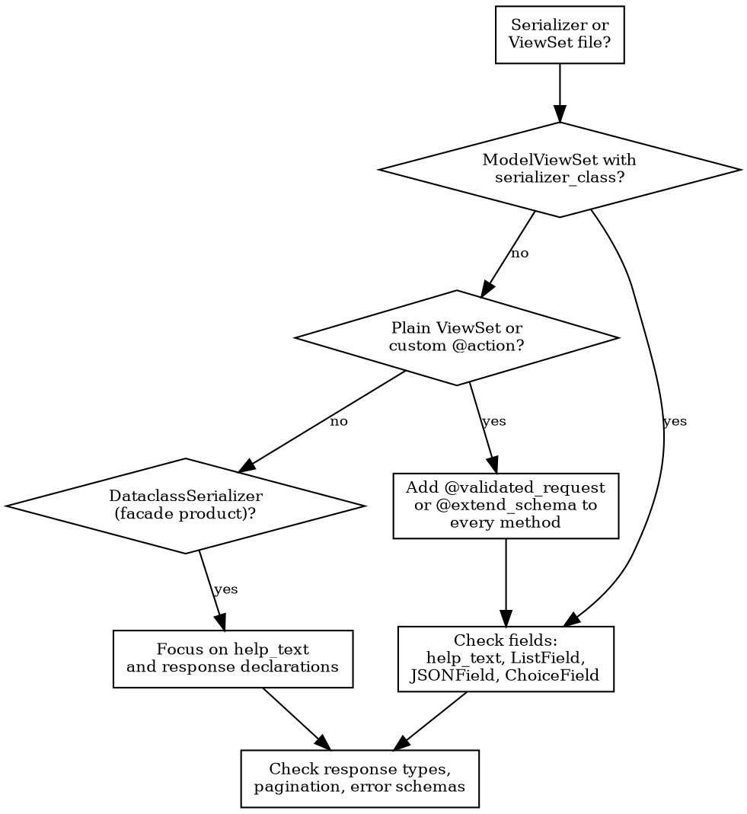

# Improving DRF Endpoints

## Overview

Serializer fields are the source of truth for PostHog's entire type pipeline:

```text
Django serializer → drf-spectacular → OpenAPI JSON → Orval → Zod schemas → MCP tools
```

Every `help_text`, every field type, every `@extend_schema` annotation flows downstream.
A missing `help_text` means an agent guessing at parameters.
A bare `ListField()` means `z.unknown()` in the generated Zod schema.
Getting the serializer right means every consumer — frontend types, MCP tools, API docs — gets correct types and descriptions automatically.

## When to use

- Editing or reviewing any file that defines a `Serializer` or `ViewSet`
- Fixing OpenAPI spec warnings or generated type issues
- Preparing an endpoint for MCP tool exposure
- Code review of API changes

## Audit checklist

### Triage: check the generated output first

Before diving into Python, look at the committed generated types to see what's broken.
Find the generated files for the endpoint's product:

- Core API: `frontend/src/generated/core/`
- Product APIs: `products/<product>/frontend/generated/`

Each has two files:

- **`api.schemas.ts`** — TypeScript interfaces derived from serializers. Search for the serializer name and look for `unknown` types (bare `ListField`/`JSONField`), missing JSDoc descriptions (missing `help_text`), or overly generic `Record<string, unknown>` shapes.
- **`api.ts`** — API client functions. Check if the endpoint's operation exists at all — if missing, the viewset method likely lacks `@extend_schema`.

This tells you exactly which fields and endpoints to prioritize.

### Serializer fields

Work through this list for every serializer and viewset you touch.

1. **Every field has `help_text`** — describes purpose, format, constraints, valid values
2. **No bare `ListField()` or `DictField()`** — always specify `child=` with a typed serializer or field
3. **No bare `JSONField()`** — create a custom field class with `@extend_schema_field(TypedSchema)`
4. **`SerializerMethodField` has `@extend_schema_field`** on its `get_*` method
5. **`ChoiceField` has explicit `choices=`** with all valid values listed
6. **Avoid collision-prone enum field names** — `format`, `type`, `status`, `kind`, `level`, `mode`, `state`, `platform`, `provider` clash with existing choices and fail CI under `--fail-on-warn`; pick a specific name or add an `ENUM_NAME_OVERRIDES` entry up front (see [serializer-fields.md](references/serializer-fields.md#choicefield--explicit-choices))
7. **Read vs write serializers are separate** when input shape differs from output
8. **Every success response is backed by a serializer** — returning raw dicts or untyped lists means no generated types downstream

See [serializer-fields.md](references/serializer-fields.md) for patterns and examples.

### Viewset and action annotations

9. **Every custom `@action` has `@extend_schema` or `@validated_request`** — without it, drf-spectacular discovers zero parameters
10. **Plain `ViewSet` methods have schema annotations** — `ModelViewSet` with `serializer_class` is auto-discovered; plain `ViewSet` is not
11. **`@extend_schema` is on the actual method** (`get`, `post`, `create`, `list`), not on a helper or the class itself
12. **Error responses are typed** — use `OpenApiResponse(response=ErrorSerializer)`, not `OpenApiTypes.OBJECT`
13. **List endpoints declare pagination** — reset with `pagination_class=None` on custom actions that don't paginate
14. **Prefer `@validated_request`** over manual `serializer.is_valid()` + `@extend_schema` — it handles both in one decorator
15. **ViewSets outside `products/` need `@extend_schema(extensions={"x-product": "<product>"})`** — ViewSets in `products/<name>/backend/` are auto-attributed via module path; ViewSets in `posthog/api/` or `ee/` aren't and must declare attribution explicitly via the `x-product` extension. Accepts a plain string (`"product_analytics"`) or `ProductKey.X` enum (kebab values are normalized). Don't use `tags=["<product>"]` to influence codegen routing — `tags` is for Swagger UI display only. Without `x-product`, the MCP scaffold and frontend type generator can't route the endpoint to the right product
16. **`partial_update` `request=` override must be a superset of runtime write fields** — `extend_schema(request=CustomSerializer)` replaces drf-spectacular's inference from `serializer_class`; omitted fields disappear from OpenAPI, frontend types, and MCP tool schemas even when the runtime serializer still accepts them. After changing the override, run `hogli build:openapi` and verify generated MCP tool schemas still expose every OpenAPI body field

**Streaming endpoints:** For SSE or streaming responses, use `@extend_schema(request=InputSerializer, responses={(200, "text/event-stream"): OpenApiTypes.STR})` to document the request schema even though the response can't be fully typed.

See [viewset-annotations.md](references/viewset-annotations.md) for patterns and examples.

### URL routing — where to register new team-nested endpoints

PostHog briefly split projects and environments as separate concepts then rolled
the split back. **`/api/projects/:team_id/...` is the canonical path** for any
team-nested endpoint. `/api/environments/:team_id/...` is a backward-compat alias
preserved only for clients that integrated against it during the split.

For a **new** team-nested endpoint, register it under `routers.projects`. Routes
live in each product's own `products/<name>/backend/routes.py`, in a
`register_routes(routers)` function:

```python
# products/<name>/backend/routes.py
from posthog.api.routing import RouterRegistry


def register_routes(routers: RouterRegistry) -> None:
    routers.projects.register(r"my_thing", MyThingViewSet, "project_my_thing", ["team_id"])
```

Product routes are **auto-discovered** — `posthog/api/__init__.py` iterates
`INSTALLED_APPS` and calls `register_routes(routers)` on every `products.*` app
that has a `routes.py`. Adding a product needs no edit to core: create
`products/<name>/backend/routes.py` and make sure the product is in
`PRODUCTS_APPS` (`posthog/settings/web.py`). Only core, non-product viewsets still
register directly in `__init__.py`.

**Why core discovers and calls the product (not the product calling core).** Core
registers the four parents (`root` + `projects`/`environments`/`organizations`)
first, then runs the discovery loop. Products only nest onto those parents and
never onto each other, so discovery order is irrelevant. The registration is kept
eager (it runs when `posthog.api` is first imported, i.e. on the first request) and
deliberately _not_ moved into `AppConfig.ready()`: `ready()` runs inside
`django.setup()` in every process, and registering a route imports its viewset, so
that would pull the whole API into `setup()` everywhere — regressing the laziness
that keeps the API out of Celery workers and management commands. See the
`RouterRegistry` docstring and the discovery loop in `posthog/api/__init__.py` for
the full reasoning.

Do **not** register new endpoints under `environments_router`. Do **not** use the
dual-route helper (`routers.register_legacy_dual_route`, or
`register_legacy_dual_route_team_nested_viewset` in `__init__.py`) — it exists only
for endpoints already exposed on both `/api/projects/` and `/api/environments/`
before the rollback.

If existing clients need `/api/environments/...` too, the OpenAPI postprocess
hook at `posthog.api.documentation.preprocess_exclude_path_format` auto-marks
the env-side path as `deprecated: true` whenever both routes exist.

### Facade products (DataclassSerializer)

For products using the facade pattern (e.g., `visual_review`) with `DataclassSerializer` wrapping frozen dataclasses from `contracts.py`:

- Field types are auto-derived from the dataclass — fewer typing issues by design
- Focus on **`help_text`** (dataclass fields don't carry it; add it on the serializer field overrides)
- **`@validated_request`** is already the standard pattern — verify response serializers are declared
- `@extend_schema` tags and descriptions still need to be set on viewset methods

## Decision flowchart



## Quick reference

See [quick-reference-table.md](references/quick-reference-table.md) for a scannable "I see X, do Y" lookup.

See [common-anti-patterns.md](references/common-anti-patterns.md) for before/after code pairs.

## Canonical examples in the codebase

- **JSONField + @extend_schema_field:** `posthog/api/alert.py`
- **@validated_request:** `products/tasks/backend/api.py`
- **help_text + typed responses:** `products/llm_analytics/backend/api/evaluation_summary.py`
- **Facade product:** `products/visual_review/backend/presentation/views.py`

## Related

- **Downstream:** After fixing serializers, use the `implementing-mcp-tools` skill to scaffold MCP tools
- **Pipeline docs:** `docs/published/handbook/engineering/type-system.md`
- **Mixins:** `posthog/api/mixins.py` (`@validated_request` source)
- **drf-spectacular config:** `posthog/settings/web.py` (`SPECTACULAR_SETTINGS`)
- **Enum collision diagnostic:** `python manage.py find_enum_collisions` — finds unresolved collisions and suggests overrides
