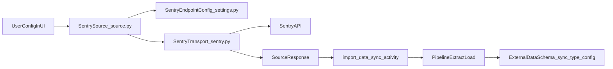

# Sentry source implementation plan

## Scope and decisions

- Build **v1 with bearer token auth only** (no OAuth yet).
- Sync **minimal org-level datasets**:
  - `projects` via Sentry projects API.
  - `issues` via Sentry organization issues API.
- Keep the existing source as initially unreleased during development, then remove `unreleasedSource` when QA passes.
- Add a reusable **AI implementation skill** for future Data warehouse sources (no existing source-specific AI skill found).

## Progress update

- Completed:
  - v1 source architecture (`source.py`, `settings.py`, `sentry.py`) for `projects` + `issues`.
  - source config generation and schema build.
  - source and transport tests for current scope.
  - reusable AI skill at [posthog/.agents/skills/implementing-warehouse-sources/SKILL.md](posthog/.agents/skills/implementing-warehouse-sources/SKILL.md).
- Remaining from v1:
  - add Sentry icon asset at [frontend/public/services/sentry.png](frontend/public/services/sentry.png).
  - final release toggle (`unreleasedSource`) after full QA.

## Expanded scope: comprehensive Sentry ingestion

- Goal: fetch all **practical read/list datasets** available via Sentry API docs, while excluding write/mutate endpoints.
- Practical definition:
  - include endpoints that return tabular/list data and can be synced repeatedly.
  - exclude bulk mutate, delete, update, create, and one-off debug endpoints.
- Keep token auth for now; OAuth remains a later enhancement.

## Existing guidance audit

- There is **no dedicated AI guide/skill/rule** today for implementing warehouse sources in `.agents`, `.claude`, or `.cursor/rules`.
- The only concrete implementation guide currently available is [posthog/temporal/data_imports/sources/README.md](posthog/temporal/data_imports/sources/README.md), plus practical examples in existing sources like [posthog/temporal/data_imports/sources/klaviyo/source.py](posthog/temporal/data_imports/sources/klaviyo/source.py) and [posthog/temporal/data_imports/sources/github/source.py](posthog/temporal/data_imports/sources/github/source.py).
- Recommendation: encode this workflow as a **skill** (not only a rule), because skills are task-oriented and can carry step-by-step implementation playbooks with checklists and references.

## Why sources are split this way (mental model)

- `**source.py` defines product-facing behavior: form fields, credential validation, schemas shown in UI, and handoff into the pipeline runtime.
- `**settings.py` is the declarative dataset catalog: endpoint paths, incremental fields, partition key choices, and defaults.
- `**sentry.py` is transport/extraction logic: auth headers, pagination, request params, response flattening, and `SourceResponse` creation.
- This split keeps connector behavior explicit and testable, and makes adding new endpoints mostly a `settings.py` change.

## Files to implement/update

- Update [posthog/temporal/data_imports/sources/sentry/source.py](posthog/temporal/data_imports/sources/sentry/source.py)
- Add [posthog/temporal/data_imports/sources/sentry/settings.py](posthog/temporal/data_imports/sources/sentry/settings.py)
- Add [posthog/temporal/data_imports/sources/sentry/sentry.py](posthog/temporal/data_imports/sources/sentry/sentry.py)
- Add tests:
  - [posthog/temporal/data_imports/sources/sentry/tests/test_sentry_source.py](posthog/temporal/data_imports/sources/sentry/tests/test_sentry_source.py)
  - [posthog/temporal/data_imports/sources/sentry/tests/test_sentry.py](posthog/temporal/data_imports/sources/sentry/tests/test_sentry.py)
- Generated/config assets:
  - [posthog/temporal/data_imports/sources/generated_configs.py](posthog/temporal/data_imports/sources/generated_configs.py) (generated)
  - [frontend/public/services/sentry.png](frontend/public/services/sentry.png) (new icon)

## Implementation steps

### 1) Define Sentry dataset contract in `settings.py`

- Create `SentryEndpointConfig` dataclass (mirroring Github/Klaviyo pattern).
- Define endpoint map with:
  - `projects`: `/api/0/organizations/{organization_slug}/projects/`
  - `issues`: `/api/0/organizations/{organization_slug}/issues/`
- Define incremental metadata:
  - `issues` supports incremental (candidate fields: `lastSeen`, optionally `firstSeen` if API behavior requires).
  - `projects` starts as full refresh (no incremental fields) unless stable `updated` field is confirmed.
- Define partition choices:
  - `issues` partition by datetime field used for incremental (`lastSeen`) with weekly partition format.
  - `projects` can use no partition key initially (small table) or created field if confirmed in payload.
- Export `ENDPOINTS` and `INCREMENTAL_FIELDS` for source schema wiring.

### 2) Implement transport + extraction in `sentry.py`

- Add `validate_credentials(token, organization_slug, base_url)`:
  - Probe `GET /api/0/organizations/{organization_slug}/projects/`.
  - Map common errors to friendly messages (401 invalid token, 403 missing scope, 404 org not found).
- Implement Sentry Link-header paginator:
  - Parse `Link` header entries for `rel="next"` and `results="true"`.
  - Reuse full next URL and clear request params when following cursor URL.
- Implement endpoint resource builder:
  - Inject org slug in path.
  - Add incremental query parameters for `issues` (exact param key finalized after response-contract verification).
  - Use merge/upsert disposition for incremental runs; replace for non-incremental.
- Add lightweight row mapping/normalization only where needed (avoid over-flattening initially).
- Return `SourceResponse` with primary keys and partition settings.

### 3) Implement source contract in `source.py`

- Replace placeholder fields with required configuration:
  - `auth_token` (password input)
  - `organization_slug` (text)
  - `api_base_url` (optional text, default `https://sentry.io`, allows `https://us.sentry.io` / `https://de.sentry.io`)
- Add user-facing caption/docs guidance for generating internal integration tokens and required scopes.
- Implement `get_schemas()` from `ENDPOINTS`/`INCREMENTAL_FIELDS`.
- Implement `validate_credentials()` delegating to `sentry.validate_credentials`.
- Implement `source_for_pipeline()` delegating to `sentry_source(...)` with `SourceInputs` incremental values.
- Add `get_non_retryable_errors()` for auth/permission failures so Temporal does not waste retries.

### 4) Generate typed config and schema artifacts

- Run `pnpm run generate:source-configs` to materialize `SentrySourceConfig` fields in generated configs.
- Run `pnpm run schema:build` so frontend schema types and menus stay in sync.
- Add `frontend/public/services/sentry.png` and keep `iconPath` aligned.

### 5) Add tests (required for first production source)

- `test_sentry_source.py`:
  - source type, source config fields, schema list.
  - credential validation success/failure mapping.
  - `source_for_pipeline()` forwards incremental/runtime args correctly.
- `test_sentry.py`:
  - paginator parses Link header correctly.
  - endpoint resource generation for incremental vs full-refresh write disposition.
  - credential validator status handling (200/401/403/404).
  - any mapper logic behavior.
- Use parameterized tests for status-code and pagination cases.

### 6) QA checklist before enabling release

- Create source in Data warehouse UI; verify form renders and validates.
- Test `projects` initial sync and rerun behavior.
- Test `issues` incremental sync by re-running job after adding new issues in Sentry.
- Verify non-retryable errors surface user-friendly copy.
- Remove `unreleasedSource=True` only after these checks pass.

### 7) Create reusable AI skill for warehouse sources

- Add a new skill at [posthog/.agents/skills/implementing-warehouse-sources/SKILL.md](posthog/.agents/skills/implementing-warehouse-sources/SKILL.md) (source of truth for skills in this repo).
- Skill scope:
  - when to use (new source creation, major source refactor, adding incremental support);
  - mandatory implementation checklist (fields, `settings.py`, transport file, `SourceResponse`, non-retryable errors, tests);
  - required generation commands (`generate:source-configs`, `schema:build`);
  - validation checklist (manual QA + common failure modes).
- Include references section with concrete templates:
  - [posthog/temporal/data_imports/sources/source.template](posthog/temporal/data_imports/sources/source.template)
  - [posthog/temporal/data_imports/sources/README.md](posthog/temporal/data_imports/sources/README.md)
  - [posthog/temporal/data_imports/sources/klaviyo/settings.py](posthog/temporal/data_imports/sources/klaviyo/settings.py)
  - [posthog/temporal/data_imports/sources/github/github.py](posthog/temporal/data_imports/sources/github/github.py)
- Keep the skill focused and under ~500 lines; use the `writing-skills` guidance when authoring.
- Optionally add a lightweight cursor rule later only for routing (use implementing-warehouse-sources skill when editing `posthog/temporal/data_imports/sources/`) after skill adoption.

### 8) Build full Sentry endpoint inventory and ingestion map

- Parse Sentry API docs and create a source-internal inventory of:
  - endpoint path and scope requirements,
  - grain (organization/project/issue/event),
  - pagination style and limits,
  - incremental candidate fields,
  - primary key and parent key expectations.
- Define inclusion rules for v2:
  - include list/retrieve datasets that can form stable warehouse tables,
  - defer non-tabular or mutation-focused endpoints.

### 9) Add organization-level datasets

- Extend `SENTRY_ENDPOINTS` with additional org datasets (read/list only), such as:
  - organization teams/members-style resources,
  - org-wide releases views where available,
  - org-wide issue variants already in Events & Issues docs.
- For each dataset define:
  - primary key,
  - incremental field support and default,
  - partition key/mode,
  - sort mode and query params.

### 10) Add project-level datasets

- Add project-scoped resources that are list/read oriented, including:
  - project issues,
  - project error events,
  - project users,
  - project service hooks/client keys and similar read endpoints.
- Introduce parent identifiers (`project_id`, `project_slug`, `organization_slug`) consistently into output rows.
- Ensure fan-out traversal from project list is bounded and resumable-safe.

### 11) Add issue fan-out datasets

- Add issue child resources:
  - issue events,
  - issue hashes,
  - issue tag values.
- Define strategy:
  - parent table (`issues`) drives fan-out,
  - child primary keys use composite keys where required (`issue_id + event_id`, etc.),
  - protect runtime with configurable page caps and deterministic pagination ordering.

### 12) Add releases and observability dataset groups

- Add additional read/list datasets from sections like Releases and monitors/alerts where:
  - list endpoints exist,
  - response shape is table-friendly,
  - pagination or cursor semantics are usable.
- Partition larger time-based tables by datetime fields when present.

### 13) Reliability and scale hardening

- Add per-endpoint resilience controls:
  - rate-limit handling and retry behavior tuned for Sentry API.
  - endpoint-level concurrency limits for fan-out resources.
  - optional per-dataset toggles in config if large orgs need staged rollout.
- Add clear non-retryable mappings for auth/scope/resource-not-found failures.

### 14) Comprehensive testing and QA expansion

- Expand unit tests to cover each endpoint family:
  - paginator parsing across mixed Link header variants,
  - incremental query assembly and time filtering,
  - parent-child fan-out correctness and key stability.
- Add integration-ish smoke tests using mocked Sentry payload fixtures for all dataset families.
- Manual QA checklist for a real Sentry org:
  - first load for every dataset family,
  - incremental reruns,
  - data shape consistency across reruns,
  - error messaging for bad token/scope.

### 15) Release finalization

- Add icon asset, validate source card rendering.
- Update docs for supported Sentry datasets and required scopes.
- Remove `unreleasedSource=True` after full QA pass.

## Data flow (how all pieces connect)

## Notes specific to Sentry API behavior

- Auth should use `Authorization: Bearer <token>`.
- Pagination must follow Sentry `Link` headers with `cursor` semantics.
- Keep `api_base_url` configurable for US/DE region hosts.
- Start with token auth only; OAuth can be added later as a separate extension once base connector is stable.

## Out-of-scope for v1

- OAuth flow integration for Sentry.
- Per-project fan-out datasets (issue events per issue, tags) that materially increase API volume and state complexity.
- Historical backfill optimization beyond baseline incremental cursor support.

## Candidate Sentry dataset families for v2/v3

- Organization scope:
  - projects
  - organization issues variants
  - teams and members style endpoints where documented as list/read
  - organization release views where available
- Project scope:
  - project issues
  - project error events
  - project users
  - project service hooks and client keys (read/list)
- Issue scope:
  - issue events
  - issue hashes
  - issue tag values
- Additional API sections to evaluate for read/list datasets:
  - Releases
  - Environments
  - Teams
  - Users
  - Dashboards
  - Monitors & alerts
  - Explore / Discover & performance endpoints where stable for warehousing
