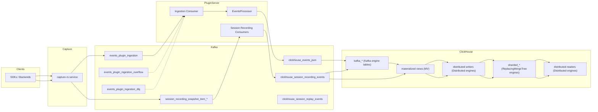
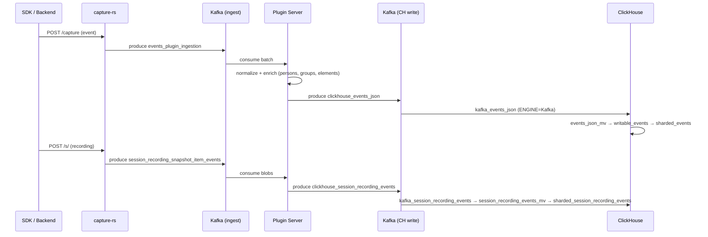

## Ingestion Architecture (Kafka → Plugin Server → ClickHouse)

This document explains how events flow from Kafka into ClickHouse and how the app participates in the pipeline. It focuses on the in-cluster ingestion path (events, session recordings, and selected side-channels).

### High-level flow



Key ideas:
- Capture produces analytics events to `events_plugin_ingestion`, which the plugin server consumes.
- After enrichment, the plugin server produces normalized rows to `clickhouse_events_json`.
- ClickHouse reads Kafka topics via Kafka-engine tables, fans them into `writable_*` Distributed writer tables using MVs, which write into `sharded_*` MergeTree tables. Read queries typically go through `events` (Distributed).
- Session recordings are ingested via dedicated topics and tables.

---

## Components and responsibilities

- capture-rs
  - Accepts `/capture`, `/batch`, etc., validates, normalizes, and publishes to Kafka topics:
    - Analytics: `events_plugin_ingestion` (overflow + DLQ variants)
    - Session recording: `session_recording_snapshot_item_events` (fan-in toward replay and blob ingestion)

- plugin-server (TypeScript)
  - Consumes analytics from `events_plugin_ingestion[*]`.
  - Normalizes event timestamps, enriches with person/group data, shapes payloads.
  - Produces ClickHouse-ready rows to `clickhouse_events_json` (config key `CLICKHOUSE_JSON_EVENTS_KAFKA_TOPIC`).
  - Dedicated consumers for session recordings (blob/replay paths), producing to ClickHouse topics like `clickhouse_session_recording_events` and `clickhouse_session_replay_events`.

- ClickHouse (SQL)
  - Kafka engine tables (`kafka_*`) read the Kafka topics.
  - Materialized views (`*_mv`) transform/insert into `writable_*` Distributed tables.
  - Distributed writers route to `sharded_*` MergeTree tables (actual storage).
  - Distributed readers (e.g., `events`) are used by queries.

---

## Kafka topics (selected)

- Ingestion (from capture → plugin-server):
  - `events_plugin_ingestion`, `events_plugin_ingestion_overflow`, `events_plugin_ingestion_dlq`
- ClickHouse write topics (from plugin-server → ClickHouse):
  - `clickhouse_events_json`
  - `clickhouse_session_recording_events`
  - `clickhouse_session_replay_events`
- Side-channels:
  - `clickhouse_performance_events`, `clickhouse_heatmap_events`, etc.

Paths defined in [`plugin-server/src/config/kafka-topics.ts`](plugin-server/src/config/kafka-topics.ts) and defaulted in [`plugin-server/src/config/config.ts`](plugin-server/src/config/config.ts).

```ts
// plugin-server/src/config/kafka-topics.ts (12-20)
export const KAFKA_EVENTS_PLUGIN_INGESTION = `${prefix}events_plugin_ingestion${suffix}`
export const KAFKA_EVENTS_PLUGIN_INGESTION_DLQ = `${prefix}events_plugin_ingestion_dlq${suffix}`
export const KAFKA_EVENTS_PLUGIN_INGESTION_OVERFLOW = `${prefix}events_plugin_ingestion_overflow${suffix}`
export const KAFKA_EVENTS_PLUGIN_INGESTION_HISTORICAL = `${prefix}events_plugin_ingestion_historical${suffix}`
```

```ts
// plugin-server/src/config/config.ts (104-111)
KAFKA_PARTITIONS_CONSUMED_CONCURRENTLY: 1,
CLICKHOUSE_JSON_EVENTS_KAFKA_TOPIC: KAFKA_EVENTS_JSON,
CLICKHOUSE_HEATMAPS_KAFKA_TOPIC: KAFKA_CLICKHOUSE_HEATMAP_EVENTS,
PERSON_INFO_CACHE_TTL: 5 * 60,
KAFKA_HEALTHCHECK_SECONDS: 20,
```

---

## Plugin-server ingestion to ClickHouse

After processing an event, plugin-server emits a single JSON row per event to the ClickHouse topic (see [`plugin-server/src/worker/ingestion/process-event.ts`](plugin-server/src/worker/ingestion/process-event.ts)):

```ts
// plugin-server/src/worker/ingestion/process-event.ts (263-272)
return this.kafkaProducer
    .produce({
        topic: this.hub.CLICKHOUSE_JSON_EVENTS_KAFKA_TOPIC,
        key: rawEvent.uuid,
        value: Buffer.from(JSON.stringify(rawEvent)),
        headers: {
            'kafka-consumer-breadcrumbs': JSON.stringify(breadcrumbs),
        },
    })
```

The `rawEvent` fields match the ClickHouse schema (uuid, event, properties, timestamps, person/group columns, etc.).

Timestamp normalization considers `now` (server time at capture), `sent_at` and `timestamp` for skew handling (see [`plugin-server/src/worker/ingestion/timestamps.ts`](plugin-server/src/worker/ingestion/timestamps.ts)):

```ts
// plugin-server/src/worker/ingestion/timestamps.ts (12-20)
export function parseEventTimestamp(data: PluginEvent, callback?: IngestionWarningCallback): DateTime {
    const now = DateTime.fromISO(data['now']).toUTC() // now is set by the capture endpoint and assumed valid
    ...
}
```

Overflow handling (hot keys) can re-route traffic to overflow topics and coordinate via Redis; session recordings implement consumer-side overflow with a Redis ZSET managed by `OverflowManager`.

---

## ClickHouse pipeline (events)

### 1) Kafka-engine table reads from `clickhouse_events_json`

File: [`posthog/models/event/sql.py`](posthog/models/event/sql.py)

```python
# posthog/models/event/sql.py (169-182)
def KAFKA_EVENTS_TABLE_JSON_SQL():
    return (
        EVENTS_TABLE_BASE_SQL
        + """
    SETTINGS kafka_skip_broken_messages = 100
"""
    ).format(
        table_name="kafka_events_json",
        on_cluster_clause=ON_CLUSTER_CLAUSE(),
        engine=kafka_engine(topic=KAFKA_EVENTS_JSON),
        extra_fields="",
        materialized_columns="",
        indexes="",
    )
```

`kafka_engine(topic=...)` expands to ClickHouse `ENGINE = Kafka(...)` using `settings.KAFKA_HOSTS_FOR_CLICKHOUSE` (see [`posthog/clickhouse/kafka_engine.py`](posthog/clickhouse/kafka_engine.py)):

```python
# posthog/clickhouse/kafka_engine.py (41-45)
def kafka_engine(topic: str, kafka_host: str | None = None, group="group1", serialization="JSONEachRow") -> str:
    if kafka_host is None:
        kafka_host = ",".join(settings.KAFKA_HOSTS_FOR_CLICKHOUSE)
    return KAFKA_ENGINE.format(topic=topic, kafka_host=kafka_host, group=group, serialization=serialization)
```

### 2) MV fan-in to distributed writer (`writable_events`)

File: [`posthog/models/event/sql.py`](posthog/models/event/sql.py)

```sql
-- posthog/models/event/sql.py (185-227)
CREATE MATERIALIZED VIEW IF NOT EXISTS events_json_mv ON CLUSTER '{cluster}'
TO {database}.{target_table}
AS SELECT
uuid,
event,
properties,
timestamp,
team_id,
distinct_id,
elements_chain,
created_at,
person_id,
person_created_at,
person_properties,
group0_properties,
group1_properties,
group2_properties,
group3_properties,
group4_properties,
group0_created_at,
group1_created_at,
group2_created_at,
group3_created_at,
group4_created_at,
person_mode,
_timestamp,
_offset,
arrayMap(
    i -> _headers.value[i],
    arrayFilter(
        i -> _headers.name[i] = 'kafka-consumer-breadcrumbs',
        arrayEnumerate(_headers.name)
    )
) as consumer_breadcrumbs
FROM {database}.kafka_events_json
```

### 3) Distributed writer routes to sharded MergeTree

File: [`posthog/models/event/sql.py`](posthog/models/event/sql.py)

```python
# posthog/models/event/sql.py (325-333)
def WRITABLE_EVENTS_TABLE_SQL():
    return EVENTS_TABLE_BASE_SQL.format(
        table_name="writable_events",
        on_cluster_clause=ON_CLUSTER_CLAUSE(),
        engine=Distributed(data_table=EVENTS_DATA_TABLE(), sharding_key="sipHash64(distinct_id)"),
        extra_fields=KAFKA_COLUMNS + KAFKA_CONSUMER_BREADCRUMBS_COLUMN,
        materialized_columns="",
        indexes="",
    )
```

```python
# posthog/models/event/sql.py (124-148)
def EVENTS_TABLE_SQL():
    return (
        EVENTS_TABLE_BASE_SQL
        + """PARTITION BY toYYYYMM(timestamp)
ORDER BY (team_id, toDate(timestamp), event, cityHash64(distinct_id), cityHash64(uuid))
{sample_by}
{storage_policy}
"""
    ).format(
        table_name=EVENTS_DATA_TABLE(),
        on_cluster_clause=ON_CLUSTER_CLAUSE(),
        engine=EVENTS_DATA_TABLE_ENGINE(),
        extra_fields=KAFKA_COLUMNS + INSERTED_AT_COLUMN + KAFKA_CONSUMER_BREADCRUMBS_COLUMN,
        materialized_columns=EVENTS_TABLE_MATERIALIZED_COLUMNS,
        indexes=f"""
    , {index_by_kafka_timestamp(EVENTS_DATA_TABLE())}
    """,
        sample_by="SAMPLE BY cityHash64(distinct_id)",
        storage_policy=STORAGE_POLICY(),
    )
```

### 4) Query via Distributed reader (cluster-aware)

File: [`posthog/models/event/sql.py`](posthog/models/event/sql.py)

```python
# posthog/models/event/sql.py (339-347)
def DISTRIBUTED_EVENTS_TABLE_SQL(on_cluster=True):
    return EVENTS_TABLE_BASE_SQL.format(
        table_name="events",
        on_cluster_clause=ON_CLUSTER_CLAUSE(on_cluster),
        engine=Distributed(data_table=EVENTS_DATA_TABLE(), sharding_key="sipHash64(distinct_id)"),
        extra_fields=KAFKA_COLUMNS + INSERTED_AT_COLUMN + KAFKA_CONSUMER_BREADCRUMBS_COLUMN,
        materialized_columns=EVENTS_TABLE_PROXY_MATERIALIZED_COLUMNS,
        indexes="",
    )
```

#### Optional: recent-events side channel

For low-latency windows, a second Kafka consumer writes into `events_recent` (7-day TTL) via `kafka_events_recent_json` and `events_recent_json_mv`.

---

## ClickHouse pipeline (session recordings)

```mermaid
flowchart LR
    KR1["session_recording_snapshot_item_events"] --> SRCons["Session Recording Consumer"]
    SRCons --> KR2["clickhouse_session_recording_events"]
    KR2 --> CHk["kafka_session_recording_events"]
    CHk --> MV["session_recording_events_mv"]
    MV --> W["writable_session_recording_events"]
    W --> S["sharded_session_recording_events"]
    S --> D["session_recording_events"]
```



Selected DDL (file: [`posthog/session_recordings/sql/session_recording_event_sql.py`](posthog/session_recordings/sql/session_recording_event_sql.py)):

```python
# posthog/session_recordings/sql/session_recording_event_sql.py (103-110)
KAFKA_SESSION_RECORDING_EVENTS_TABLE_SQL = lambda on_cluster=True: SESSION_RECORDING_EVENTS_TABLE_BASE_SQL.format(
    table_name="kafka_session_recording_events",
    on_cluster_clause=ON_CLUSTER_CLAUSE(on_cluster),
    engine=kafka_engine(topic=KAFKA_CLICKHOUSE_SESSION_RECORDING_EVENTS),
    materialized_columns="",
    extra_fields="",
)
```

```sql
-- posthog/session_recordings/sql/session_recording_event_sql.py (111-132)
CREATE MATERIALIZED VIEW IF NOT EXISTS session_recording_events_mv {on_cluster_clause}
TO {database}.{target_table}
AS SELECT
uuid,
timestamp,
team_id,
distinct_id,
session_id,
window_id,
snapshot_data,
created_at,
_timestamp,
_offset
FROM {database}.kafka_session_recording_events
```

Tables include materialized feature columns (e.g., `has_full_snapshot`, `click_count`) for performant replay analytics.

---

## Mermaid: End-to-end sequence



---

## Operational notes

- Kafka → ClickHouse uses CH Kafka engine + MVs. Poison pills are guarded by `kafka_skip_broken_messages = 100` on Kafka tables.
- Ingestion breadcrumbs are preserved via Kafka headers and stored as `consumer_breadcrumbs` for debugging lineage.
- Overflow handling (analytics + replay) may route hot keys to overflow topics and coordinate via Redis to protect partitions.
- Batch imports feed the same ingestion pipeline via a distinct historical topic; the plugin server can read/route accordingly.

---

## Pointers

- Plugin-server config (topics, consumers): [`plugin-server/src/config/config.ts`](plugin-server/src/config/config.ts), [`plugin-server/src/config/kafka-topics.ts`](plugin-server/src/config/kafka-topics.ts)
- Event processing and emission: [`plugin-server/src/worker/ingestion/process-event.ts`](plugin-server/src/worker/ingestion/process-event.ts), [`plugin-server/src/worker/ingestion/timestamps.ts`](plugin-server/src/worker/ingestion/timestamps.ts)
- Session recordings consumer: [`plugin-server/src/main/ingestion-queues/session-recording/session-recordings-consumer.ts`](plugin-server/src/main/ingestion-queues/session-recording/session-recordings-consumer.ts)
- ClickHouse schema orchestration: [`posthog/clickhouse/schema.py`](posthog/clickhouse/schema.py)
- Events ClickHouse DDL: [`posthog/models/event/sql.py`](posthog/models/event/sql.py)
- Session recording ClickHouse DDL: [`posthog/session_recordings/sql/session_recording_event_sql.py`](posthog/session_recordings/sql/session_recording_event_sql.py)


