# OpenTelemetry Gen AI Integration - Technical Architecture

**Detailed architectural design for OTEL-based Gen AI ingestion in PostHog**

Date: November 13, 2025

This document provides medium-level architectural details and diagrams for the OpenTelemetry Gen AI integration. For high-level overview and implementation plan, see [OTEL_GENAI_RESEARCH.md](./OTEL_GENAI_RESEARCH.md).

---

## Table of Contents

1. [System Architecture](#system-architecture)
2. [Data Flow](#data-flow)
3. [Component Details](#component-details)
4. [Authentication & Security](#authentication--security)
5. [Message Transformation Pipeline](#message-transformation-pipeline)
6. [Deployment Architecture](#deployment-architecture)
7. [Integration Patterns](#integration-patterns)

---

## System Architecture

### High-Level System Diagram

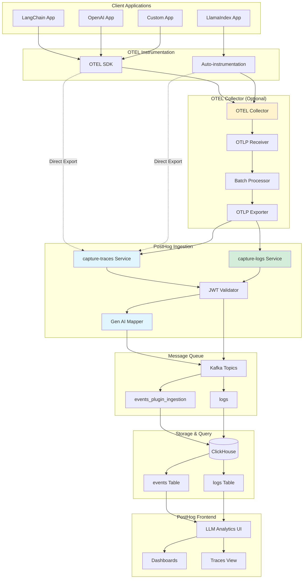

### Component Interaction Sequence

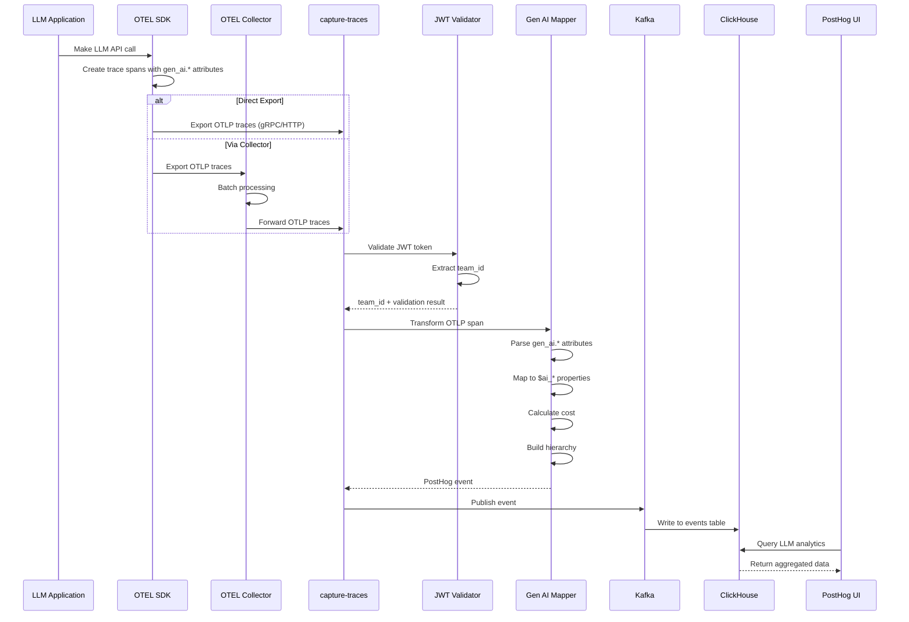

---

## Data Flow

### OTLP Trace to PostHog Event Flow

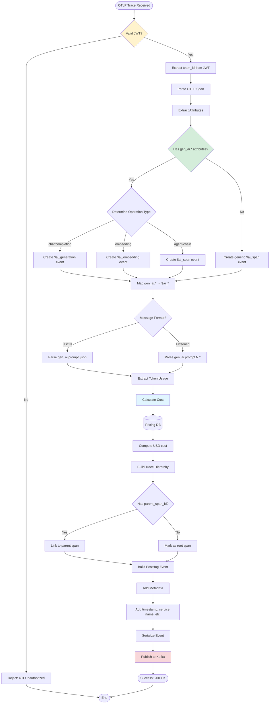

### Attribute Mapping Pipeline

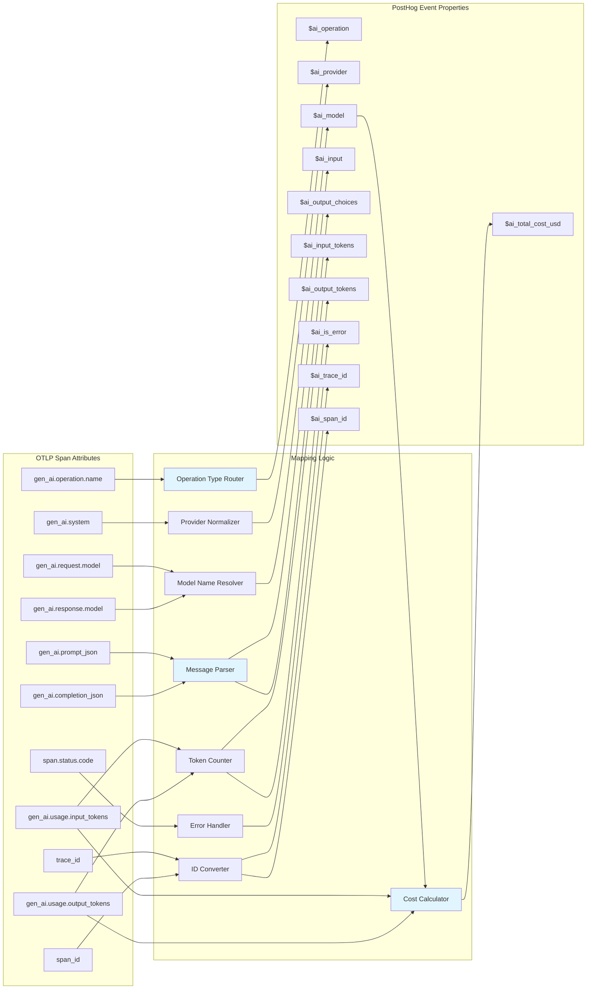

---

## Component Details

### capture-traces Service Architecture

```mermaid
graph TB
    subgraph "capture-traces Service"
        subgraph "HTTP Server Layer"
            HTTPServer[Axum HTTP Server]
            GRPCServer[Tonic gRPC Server]
            HealthEndpoint[Health Check]
            MetricsEndpoint[Prometheus Metrics]
        end

        subgraph "Request Processing"
            OTLPDecoder[OTLP Decoder]
            RateLimiter[Rate Limiter]
            AuthMiddleware[Auth Middleware]
        end

        subgraph "Core Logic"
            SpanParser[Span Parser]
            GenAIMapper[Gen AI Attribute Mapper]
            CostCalculator[Cost Calculator]
            HierarchyBuilder[Hierarchy Builder]
        end

        subgraph "Data Access"
            PricingCache[Pricing Cache]
            TeamCache[Team ID Cache]
        end

        subgraph "Output"
            EventSerializer[Event Serializer]
            KafkaProducer[Kafka Producer]
            ErrorHandler[Error Handler]
        end
    end

    HTTPServer --> OTLPDecoder
    GRPCServer --> OTLPDecoder

    OTLPDecoder --> RateLimiter
    RateLimiter --> AuthMiddleware

    AuthMiddleware --> SpanParser
    SpanParser --> GenAIMapper

    GenAIMapper --> CostCalculator
    GenAIMapper --> HierarchyBuilder

    CostCalculator --> PricingCache
    AuthMiddleware --> TeamCache

    CostCalculator --> EventSerializer
    HierarchyBuilder --> EventSerializer

    EventSerializer --> KafkaProducer

    KafkaProducer --> ErrorHandler

    HealthEndpoint -.-> HTTPServer
    MetricsEndpoint -.-> HTTPServer

    style GenAIMapper fill:#e1f5ff
    style CostCalculator fill:#e1f5ff
    style KafkaProducer fill:#f8d7da
```

### Gen AI Mapper Module

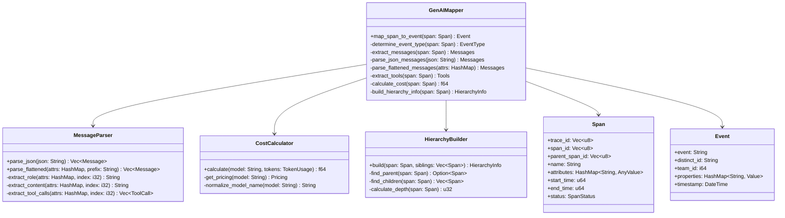

---

## Authentication & Security

### JWT Authentication Flow

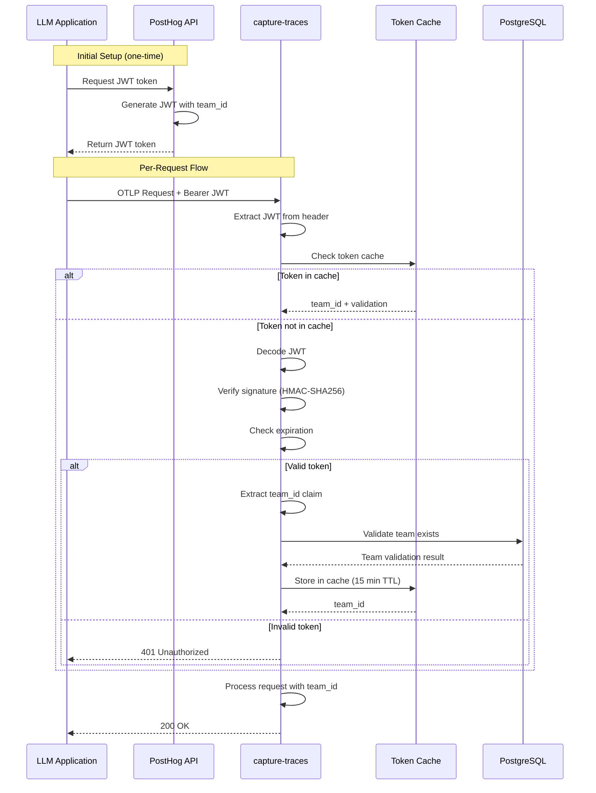

### Security Layers

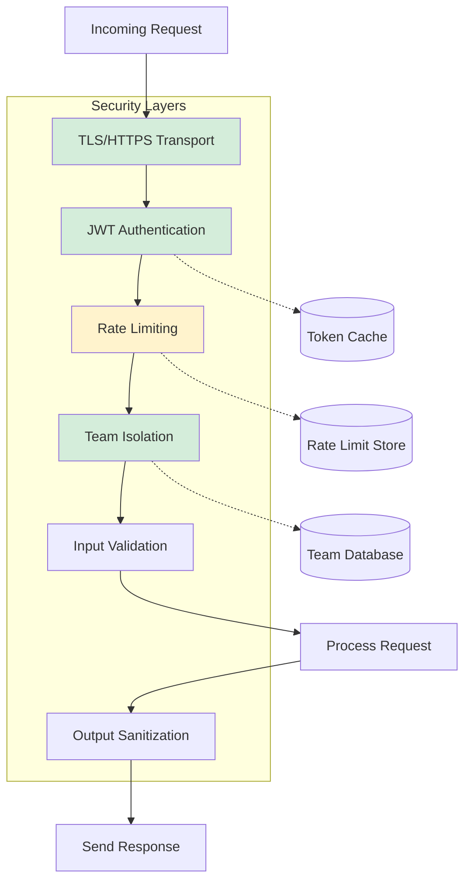

---

## Message Transformation Pipeline

### Prompt Message Extraction

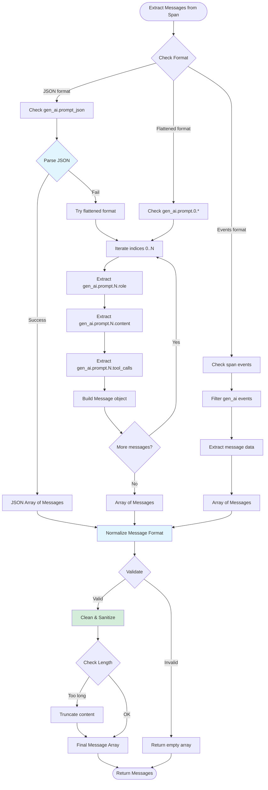

### Cost Calculation Pipeline

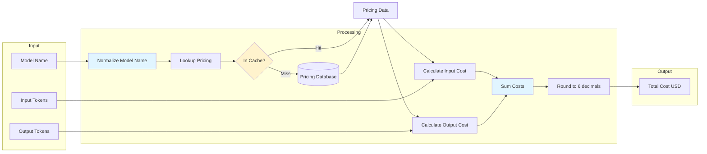

---

## Deployment Architecture

### Development Environment

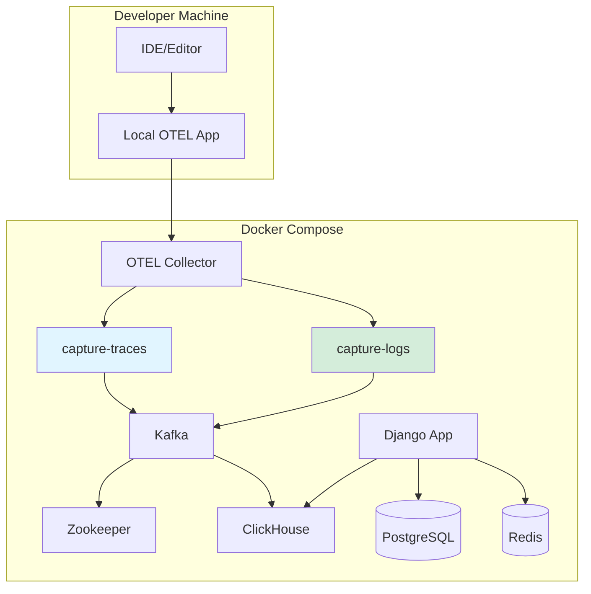

### Production Deployment (Kubernetes)

```mermaid
graph TB
    subgraph "Internet"
        Client[Client Applications]
        LB[Load Balancer]
    end

    subgraph "Kubernetes Cluster"
        subgraph "Ingress"
            Ingress[Nginx Ingress]
        end

        subgraph "OTEL Services"
            CTDeploy[capture-traces Deployment]
            CT1[Pod 1]
            CT2[Pod 2]
            CT3[Pod 3]
            CTHPA[HPA: 2-10 replicas]

            CLDeploy[capture-logs Deployment]
            CL1[Pod 1]
            CL2[Pod 2]
        end

        subgraph "Message Queue"
            KafkaCluster[Kafka StatefulSet]
            K1[Broker 1]
            K2[Broker 2]
            K3[Broker 3]
        end

        subgraph "Storage"
            CHCluster[ClickHouse Cluster]
            CH1[Node 1]
            CH2[Node 2]
            CH3[Node 3]
        end

        subgraph "Config & Secrets"
            ConfigMap[ConfigMap]
            Secrets[Secrets]
        end

        subgraph "Monitoring"
            Prometheus[Prometheus]
            Grafana[Grafana]
        end
    end

    Client --> LB
    LB --> Ingress

    Ingress --> CTDeploy
    CTDeploy --> CT1
    CTDeploy --> CT2
    CTDeploy --> CT3
    CTHPA -.Scale.-> CTDeploy

    Ingress --> CLDeploy
    CLDeploy --> CL1
    CLDeploy --> CL2

    CT1 --> KafkaCluster
    CT2 --> KafkaCluster
    CT3 --> KafkaCluster

    KafkaCluster --> K1
    KafkaCluster --> K2
    KafkaCluster --> K3

    K1 --> CHCluster
    K2 --> CHCluster
    K3 --> CHCluster

    CHCluster --> CH1
    CHCluster --> CH2
    CHCluster --> CH3

    ConfigMap --> CTDeploy
    ConfigMap --> CLDeploy
    Secrets --> CTDeploy
    Secrets --> CLDeploy

    CT1 -.Metrics.-> Prometheus
    CT2 -.Metrics.-> Prometheus
    CT3 -.Metrics.-> Prometheus

    Prometheus --> Grafana

    style CTDeploy fill:#e1f5ff
    style CTHPA fill:#fff3cd
    style KafkaCluster fill:#f8d7da
```

### Scalability Model

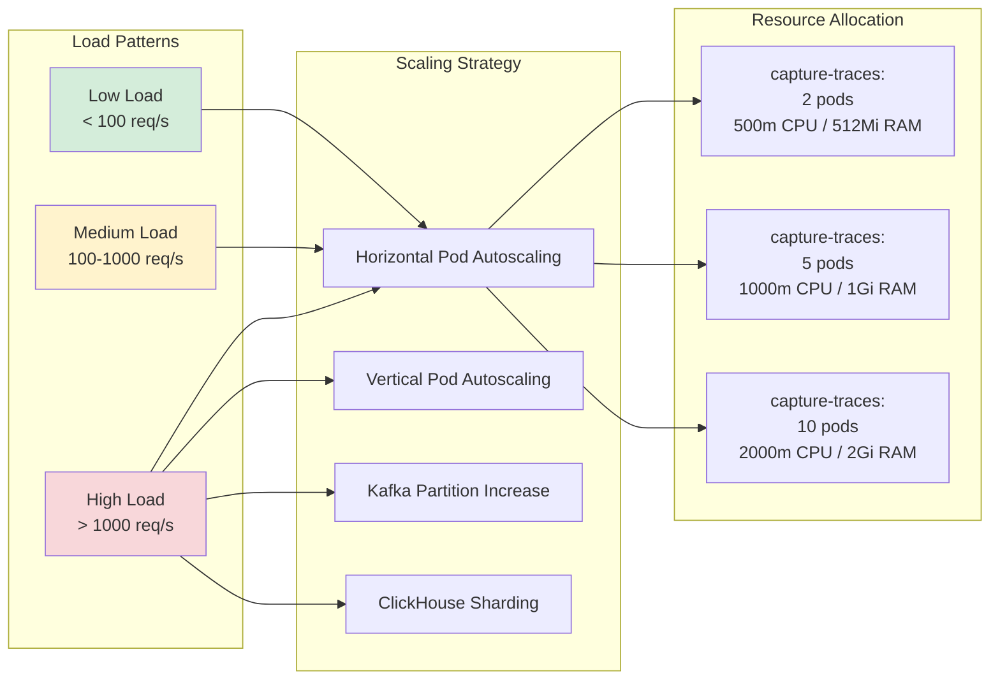

---

## Integration Patterns

### Pattern 1: Direct Export (Simplest)

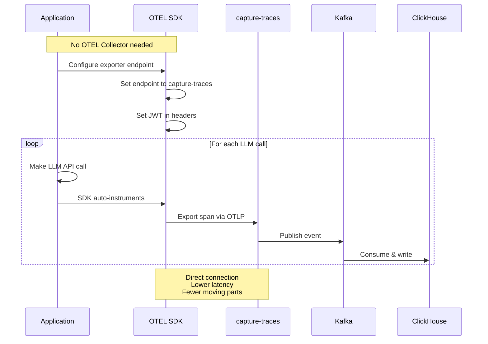

### Pattern 2: Collector-Based (Recommended for Production)

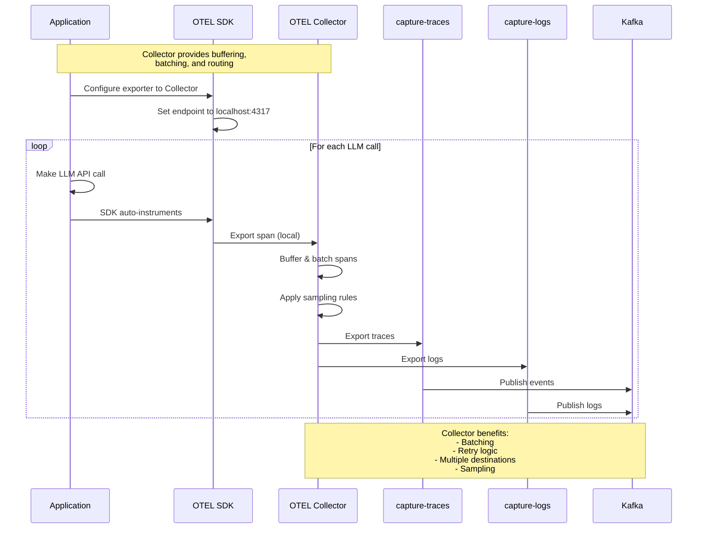

### Pattern 3: Multi-Service Tracing

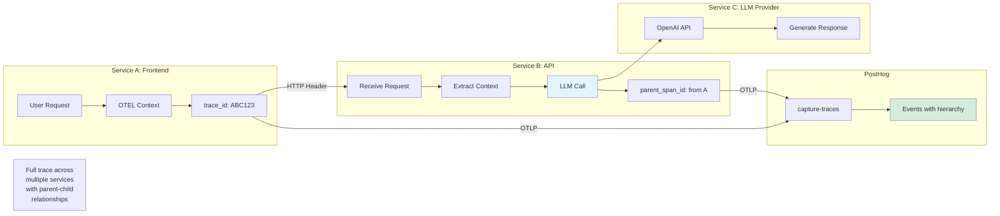

### Pattern 4: Framework-Specific Auto-Instrumentation

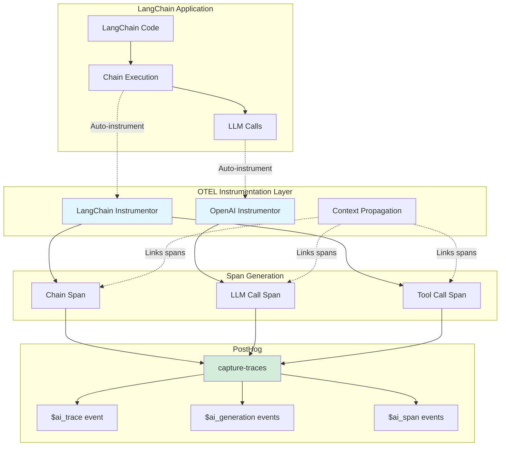

---

## Performance Considerations

### Request Processing Pipeline

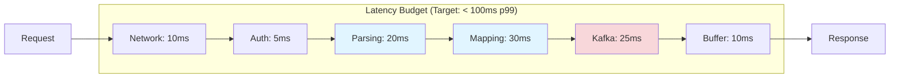

### Optimization Strategies

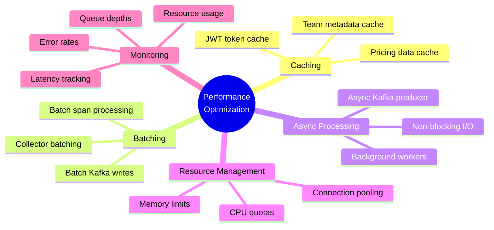

---

## Error Handling

### Error Propagation Flow

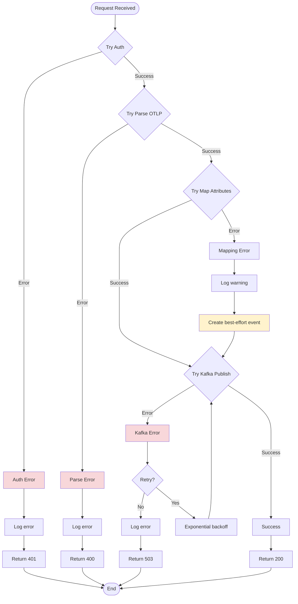

---

## Monitoring & Observability

### Metrics Collection

```mermaid
graph TB
    subgraph "capture-traces Service"
        App[Application Logic]
    end

    subgraph "Prometheus Metrics"
        M1[http_requests_total]
        M2[http_request_duration_seconds]
        M3[otlp_spans_received_total]
        M4[otlp_spans_processed_total]
        M5[otlp_spans_dropped_total]
        M6[genai_events_created_total]
        M7[kafka_publish_duration_seconds]
        M8[cost_calculation_duration_seconds]
        M9[auth_cache_hit_total]
        M10[auth_cache_miss_total]
    end

    subgraph "Prometheus"
        Prom[Prometheus Server]
        Scrape[Metrics Scraper]
    end

    subgraph "Visualization"
        Grafana[Grafana Dashboards]
        Alerts[Alertmanager]
    end

    App --> M1
    App --> M2
    App --> M3
    App --> M4
    App --> M5
    App --> M6
    App --> M7
    App --> M8
    App --> M9
    App --> M10

    Scrape --> M1
    Scrape --> M2
    Scrape --> M3
    Scrape --> M4
    Scrape --> M5
    Scrape --> M6
    Scrape --> M7
    Scrape --> M8
    Scrape --> M9
    Scrape --> M10

    Scrape --> Prom
    Prom --> Grafana
    Prom --> Alerts

    style M6 fill:#e1f5ff
    style M8 fill:#e1f5ff
```

### Health Check System

```mermaid
sequenceDiagram
    participant K8s as Kubernetes
    participant CT as capture-traces
    participant Kafka as Kafka
    participant Cache as Redis

    Note over K8s,CT: Liveness Probe (every 10s)
    K8s->>CT: GET /_liveness
    CT->>CT: Check process alive
    CT-->>K8s: 200 OK or Timeout

    Note over K8s,CT: Readiness Probe (every 5s)
    K8s->>CT: GET /_readiness
    CT->>Kafka: Check connection
    Kafka-->>CT: Connected
    CT->>Cache: Check connection
    Cache-->>CT: Connected
    CT-->>K8s: 200 OK

    Note over K8s,CT: If readiness fails
    CT-->>K8s: 503 Service Unavailable
    K8s->>K8s: Remove from load balancer
    K8s->>K8s: Wait for recovery
```

---

## Appendix: Configuration Examples

### capture-traces Environment Variables

```yaml
# Service Configuration
HOST: "0.0.0.0"
PORT: "4318"
GRPC_PORT: "4317"
SERVICE_NAME: "capture-traces"

# Authentication
JWT_SECRET: "${JWT_SECRET}"
JWT_ALGORITHM: "HS256"
TOKEN_CACHE_TTL_SECONDS: "900"  # 15 minutes

# Kafka Configuration
KAFKA_HOSTS: "kafka:9092"
KAFKA_TOPIC: "events_plugin_ingestion"
KAFKA_COMPRESSION: "snappy"
KAFKA_BATCH_SIZE: "100"
KAFKA_LINGER_MS: "100"

# Performance
MAX_CONCURRENT_REQUESTS: "1000"
REQUEST_TIMEOUT_MS: "30000"
WORKER_THREADS: "4"

# Rate Limiting
RATE_LIMIT_PER_SECOND: "1000"
RATE_LIMIT_BURST: "2000"

# Caching
PRICING_CACHE_TTL_SECONDS: "3600"  # 1 hour
TEAM_CACHE_TTL_SECONDS: "300"      # 5 minutes

# Monitoring
PROMETHEUS_PORT: "9090"
LOG_LEVEL: "info"
LOG_FORMAT: "json"

# Feature Flags
ENABLE_COST_CALCULATION: "true"
ENABLE_HIERARCHY_BUILDING: "true"
ENABLE_MESSAGE_TRUNCATION: "true"
MAX_MESSAGE_LENGTH: "100000"
```

---

**Document Version**: 1.0
**Last Updated**: November 13, 2025
**Related Documents**: [OTEL_GENAI_RESEARCH.md](./OTEL_GENAI_RESEARCH.md)
