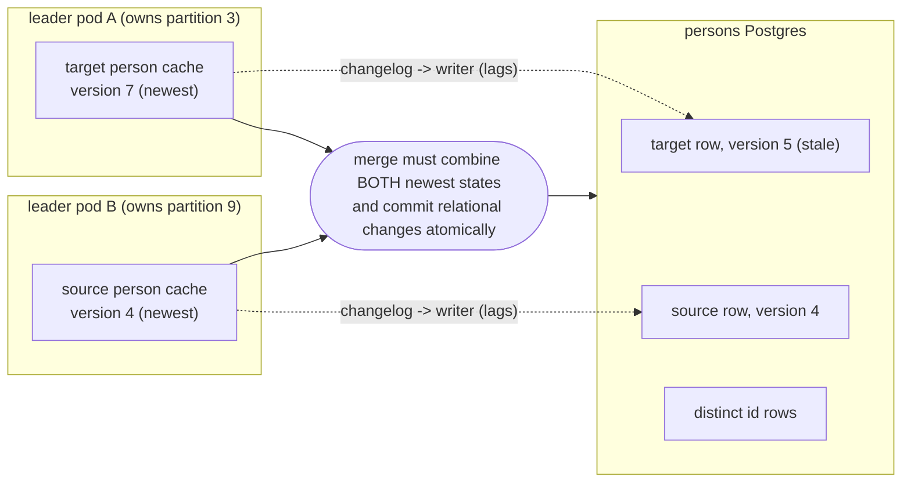
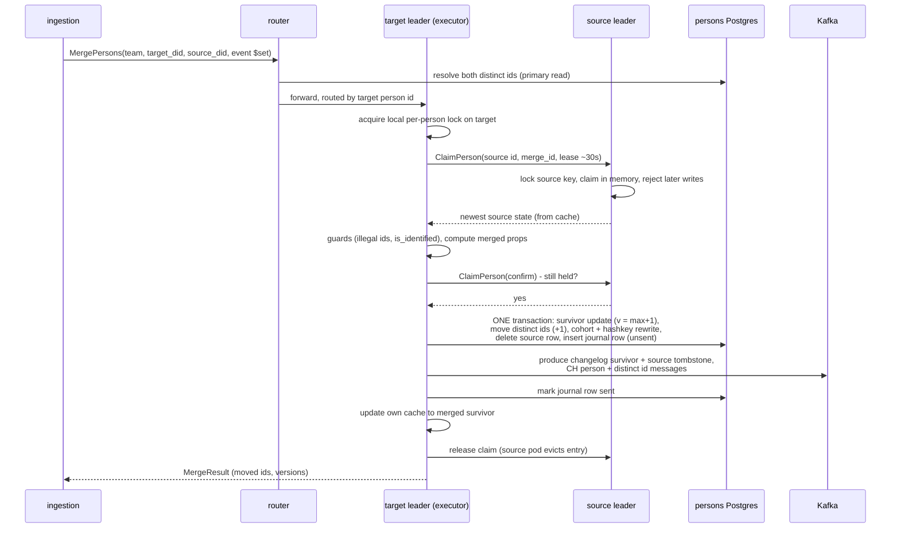
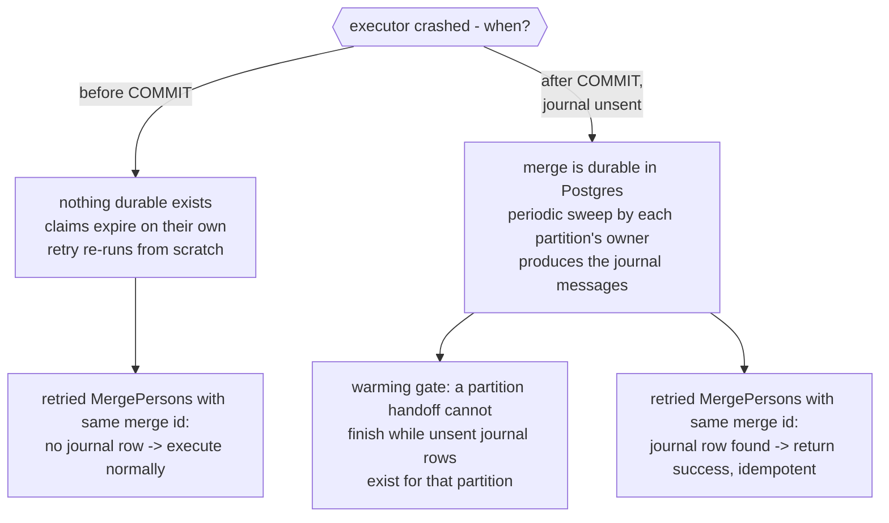

# PersonHog merge: in-leader claim-and-commit design

Status: draft for review, 2026-07-08.
Companion to `PERSONHOG_INGESTION_REQUIREMENTS.md` (resolves D1 for merges, and D4).
Covers merge case 3 only (both distinct ids resolve to different existing persons).
Cases 1, 2, and 4 (one person, same person, no persons) never span two persons and are handled by the get-or-create and add-distinct-id paths.

---

## 1. The problem

Ingestion must merge two persons through personhog instead of writing to Postgres directly.
A merge takes the person behind the event's `distinct_id` (the **target**, who survives) and the person behind `$anon_distinct_id` or `alias` (the **source**, who is deleted), and moves everything from source to target.

Four facts make this hard:

1. **A merge spans two partitions.**
   The leader shards persons by `murmur2(team_id:person_id)`.
   The target and source almost always live on different partitions, usually on different pods.
   Each pod is the single writer for its own persons and knows nothing about the other's.

2. **The leader cache is ahead of Postgres.**
   The leader applies updates to its in-memory cache and a Kafka changelog first; the writer copies the changelog into Postgres later.
   So the newest person state exists only in the owning pod's cache.
   Any merge that reads person properties from Postgres can silently lose updates that have not been written back yet.

3. **The merge itself must be atomic.**
   Moving distinct ids, rewriting cohort membership and feature flag hash key overrides, and deleting the source row must succeed or fail together.
   These are multi-table relational writes, which the changelog-and-writer path cannot express.

4. **Crashes must not corrupt state.**
   Today a crash between the Postgres commit and the Kafka produce loses ClickHouse messages.
   The new design must be at least as safe, and should be better.

## 2. Acceptance criteria

The solution is valid only if all of these hold.

- **AC1 Correct survivor state.**
  Merged properties are computed from the newest state of both persons, including cache-only updates not yet in Postgres.
  Target wins property conflicts, then the event's own `$set`/`$set_once` apply on top.
  Survivor gets `is_identified = true`, `created_at = min(both)`, `version = max(both) + 1`.
- **AC2 Atomic commit.**
  Survivor update, distinct id moves, cohort membership rewrite, hash key override rewrite, and source row delete commit in one Postgres transaction.
  (This is stronger than today, where the survivor update is outside the transaction.)
- **AC3 No lost acknowledged writes.**
  Any write for which a client received OK is either reflected in the merge result or still applied after it.
- **AC4 No resurrection.**
  After the merge, the deleted source person cannot permanently reappear in Postgres, in any leader cache, or in ClickHouse.
  Short-lived transient states are allowed only if they provably converge and are documented.
- **AC5 No deadlocks, typed conflicts.**
  Concurrent merges touching the same persons always terminate.
  Conflicts come back as typed outcomes so ingestion can emit today's warnings and fall back to plain property processing (the event is never lost).
- **AC6 Crash safety.**
  A crash at any step either leaves no visible change or the merge completes during recovery.
  ClickHouse-bound messages are never lost once the transaction commits.
- **AC7 Bounded blocking.**
  A person blocked for merging becomes writable again within a bounded time (lease expiry) even if the merge coordinator dies.
- **AC8 ClickHouse contract unchanged.**
  Distinct id rows are version-bumped only when their mapping changes, `version > 0` still drives the override MV, and the source tombstone uses `version + 100`.
- **AC9 Routable by distinct id.**
  The RPC accepts distinct ids (that is what the event carries) and works when the two persons live on different partitions.
- **AC10 Single-writer preserved.**
  The merge serializes with ordinary property updates for the survivor; no second component ever mutates a person the leader owns without the leader knowing.

## 3. Design

### 3.1 Shape

Everything runs inside the existing leader pods.
There is no orchestration service, no persisted saga, and no relay process.
`MergePersons` is a new RPC on the leader, executed start to finish by the pod that owns the **target** person's partition (the **executor**).
The executor is the survivor's cache owner, so it holds the newest survivor state and the local per-person lock: AC1 and AC10 fall out of the placement.

The design persists exactly one thing: a **merge journal row**, written inside the commit transaction itself.
Before the commit nothing durable exists anywhere, so a crash before commit is an automatic, clean abort.
After the commit the journal row is the recovery record: it carries the Kafka messages still to be produced and proves the source person is dead.

New pieces:

| Piece               | What it is                                                                                                                                                                                                                                        |
| ------------------- | ------------------------------------------------------------------------------------------------------------------------------------------------------------------------------------------------------------------------------------------------- |
| `MergePersons` RPC  | On the leader. Router resolves both distinct ids to person ids (Postgres primary read) and routes by the target person.                                                                                                                           |
| `ClaimPerson` RPC   | Leader-to-leader (via the router). The source owner marks the person "merging, writes rejected" **in memory only**, with a lease deadline, and returns its newest cached state. A second mode, `confirm`, re-checks that the claim is still held. |
| Merge journal table | One row per **committed** merge in the persons Postgres: merge id, both person ids, both Kafka partitions, the emission payloads, per-partition sent flags. Indexed by partition and by source person id.                                         |
| Journal draining    | Done by the leaders themselves: the executor produces immediately after commit; every leader periodically sweeps unsent rows for partitions it owns; partition warming may not complete while unsent rows for that partition exist.               |
| Changelog tombstone | A new record type in `personhog_updates`; the writer deletes the row instead of upserting. Also needed independently for person deletes (R5).                                                                                                     |

### 3.2 Happy path

Ordinary updates for the **target** during the merge just wait on the executor's local per-person lock (the merge holds it for two claim round trips plus one transaction, tens of milliseconds).
Updates for the **source** are rejected with a typed `PERSON_MERGING` error; the client retries briefly and re-resolves the distinct id, which after commit points at the survivor.
This is the same recovery loop ingestion already runs for `NoRowsUpdatedError` today.

### 3.3 The commit transaction

All in one Postgres transaction on the persons primary, executed by the executor:

1. Update the survivor row: merged properties, `created_at = min`, `is_identified = true`, `version = max(target_cache, source_cache) + 1`.
2. Move the source's distinct id rows to the survivor, `version = version + 1`, locked `FOR UPDATE ... ORDER BY id` (same as today).
3. Rewrite `posthog_cohortpeople` and delete+reinsert `posthog_featureflaghashkeyoverride` (same CTE as today).
4. Delete the source person row.
5. Insert the journal row, containing the changelog survivor record, the source tombstone (`source_version + 100`), and the ClickHouse person and distinct id messages, all marked unsent.

The COMMIT is issued only if the confirm round trip succeeded and the claim lease has enough time left (deadline minus a safety margin).
Otherwise the executor rolls back and aborts; since nothing was persisted before this transaction, aborting costs nothing.

### 3.4 Claims

- A claim is set by the source owner under its own per-person lock, so it serializes cleanly with in-flight updates: everything accepted before the claim is in the returned state; everything after is rejected.
- Claims are **in-memory leases** with a deadline (order of 30 seconds). They cost no storage and vanish on their own: if the executor dies, the source person is writable again within one lease (AC7). No cleanup job exists because there is nothing to clean up.
- Claim conflicts are compare-and-set, never blocking. If the person is already claimed, or is currently the target of a merge executing on that pod, `ClaimPerson` returns a typed conflict and the merge aborts. Crossed merges (A into B and B into A at once) both fail fast with a conflict instead of deadlocking; callers retry or degrade (AC5).
- Because claims live only in memory, a source pod restart or partition handoff silently forgets them. The **confirm** call immediately before COMMIT is what makes this safe: the (current) source owner only answers "yes" for a claim it actually holds for a partition it still owns, so a forgotten claim turns into an abort, not a wrong merge. Section 4.2 (W7) walks through why the remaining gap between confirm and COMMIT cannot admit a conflicting write.

### 3.5 After the crash: recovery rules

Recovery is passive; no component replays a state machine.

The merge id is derived from the event uuid, so client retries after an RPC timeout are idempotent: the journal row is the single source of truth for "did it happen".
Journal rows are garbage collected after a retention period longer than any plausible writer lag (for example 24 hours); until then they also serve as the zombie shield (W5 below).
If the executor survives but the post-commit produce fails, it marks nothing, evicts its own target cache entry (the next read reloads the post-merge row from Postgres, which is now the newest state), and leaves the row for the sweep.

## 4. Consistency analysis

### 4.1 Why "cache ahead of Postgres" is handled

For the **survivor**: the executor is the survivor's cache owner.
Its cache is by definition the newest state, and it holds the local lock, so no update can sneak in mid-merge.
The stale Postgres row is never read for properties; it is only overwritten.

For the **source**: the claim response carries the source owner's cached state, which is greater than or equal to anything in Postgres or in flight to the writer.
Property merging uses that state, never the Postgres row.

For the **version guard**: the survivor's new version is `max of both cached versions + 1`, so it is strictly larger than any changelog message the writer has yet to apply.
When the writer later applies those older buffered survivor messages, its `WHERE version > existing` guard discards them.
Nothing is lost: their content was already in the executor's cache and therefore inside the merged properties (AC3).

### 4.2 Failure windows

| #   | Window                                                                                                            | What could go wrong                                                                                                              | Why it converges                                                                                                                                                                                                                                                                                                                                                                                                                               |
| --- | ----------------------------------------------------------------------------------------------------------------- | -------------------------------------------------------------------------------------------------------------------------------- | ---------------------------------------------------------------------------------------------------------------------------------------------------------------------------------------------------------------------------------------------------------------------------------------------------------------------------------------------------------------------------------------------------------------------------------------------- |
| W1  | Claim set, executor dies before COMMIT                                                                            | Source writes blocked                                                                                                            | Lease expires, claim vanishes, nothing was persisted anywhere (AC7)                                                                                                                                                                                                                                                                                                                                                                            |
| W2  | COMMIT succeeds, executor dies before producing                                                                   | Lost ClickHouse and changelog messages (today's bug)                                                                             | Messages are in the journal row, inside the same transaction; the partition owners' sweep produces them (AC6)                                                                                                                                                                                                                                                                                                                                  |
| W3  | COMMIT succeeds, executor dies before updating its own cache                                                      | Target cache older than Postgres; later updates would be version-discarded by the writer                                         | Pod death drops the cache; warming waits for the journal drain, then reads the survivor record from the changelog (AC6, AC3)                                                                                                                                                                                                                                                                                                                   |
| W4  | Writer still has pre-merge source messages queued when the transaction deletes the source row                     | Writer upserts re-create the deleted row in Postgres (a zombie)                                                                  | The tombstone sits later on the same Kafka partition; the writer deletes the row again. Transient, bounded by writer lag (AC4)                                                                                                                                                                                                                                                                                                                 |
| W5  | During W4, the source pod gets a read for the source person, cache-misses, and loads the zombie row from Postgres | Zombie enters a leader cache and could accept writes again, permanently                                                          | The Postgres load path also checks the journal: a committed merge that deleted this person makes the load return NOT_FOUND instead of caching the zombie (AC4)                                                                                                                                                                                                                                                                                 |
| W6  | Client update addressed to the source person id arrives after the merge                                           | Write against a dead person                                                                                                      | Claim-rejected or NOT_FOUND, typed error, client re-resolves the distinct id to the survivor (AC3)                                                                                                                                                                                                                                                                                                                                             |
| W7  | Source pod restarts between claim and COMMIT                                                                      | The claim is forgotten; a write slips in on pre-merge source state and is then destroyed by the commit, though the client got OK | The confirm call right before COMMIT fails (the restarted or new owner holds no claim), so the executor aborts. For a write to slip in between a successful confirm and the COMMIT milliseconds later, the source partition would have to complete a full four-phase handoff (freeze, drain, warm to the changelog watermark) inside that gap, which takes seconds at minimum. The warming gate additionally blocks the post-commit case (AC3) |

W5 is why journal rows are kept after completion and only garbage collected after the retention period.
The check is on the cold-load path only, so steady-state traffic never pays for it.

### 4.3 What readers can see mid-merge

The commit is atomic, so Postgres readers see either the full old state or the full new state, never a half-merge.
The only documented transient is W4 (a zombie source row in Postgres for up to writer-lag seconds, invisible through personhog because of W5's shield).
ClickHouse ordering is unchanged: the tombstone at `+100` outranks any straggling low-version source message, exactly as today.

## 5. How the design meets the acceptance criteria

| AC   | Met by                                                                                                                                     |
| ---- | ------------------------------------------------------------------------------------------------------------------------------------------ |
| AC1  | Executor owns the survivor cache; claim returns the source owner's cache; merge computed from both (4.1)                                   |
| AC2  | Section 3.3: one transaction, survivor update included (stronger than today)                                                               |
| AC3  | Version-max rule (4.1), claim serialization plus confirm-before-COMMIT (3.4, W7), re-resolve loop (W6)                                     |
| AC4  | Changelog tombstone, W4 convergence, W5 zombie shield via the journal                                                                      |
| AC5  | Non-blocking CAS claims with typed conflicts; guards return typed skip outcomes mapped to today's warnings                                 |
| AC6  | Journal row written inside the commit transaction (W2), warming waits for journal drain (W3), idempotent retry by merge id                 |
| AC7  | Claims are self-expiring in-memory leases; COMMIT is gated on remaining lease; no durable fence can ever be orphaned                       |
| AC8  | Same version rules as today: `+1` moves, `+100` tombstone, override MV untouched; messages built inside the transaction from the same data |
| AC9  | Router resolves distinct ids on the Postgres primary (synchronously written, so never stale) and routes by the target person id            |
| AC10 | Merge runs under the executor's existing per-person lock; the source is only ever touched via its own owner (claim RPC)                    |

## 6. Prerequisites and companion work

- Changelog tombstone record type plus writer delete handling (shared with person deletes, R5).
- A Postgres write path in the leader (primary pool). Today the leader only reads.
- Typed routing for `MergePersons` and `ClaimPerson` in the router (it is currently a byte proxy for most RPCs).
- The merge journal table, the per-leader sweep loop, and the warming journal-drain gate in the handoff protocol.
- Ingestion client: map typed outcomes to existing warnings, add the `PERSON_MERGING` retry path, keep the move-limit error for LIMIT/ASYNC modes.

## 7. Out of scope and open questions

- Merge cases 1, 2, 4 and personless `is_merged` flips: covered by the get-or-create and claim RPC designs, not this doc.
- Get-or-create partition routing (needs the uuid re-key decision; merges do not, because both persons already exist and are resolved before routing).
- Whether the journal also becomes the general ClickHouse emission path for non-merge updates (D3). This design decides it for merge records only; extending it is compatible.
- Lease length, sweep interval, and journal retention values: need writer-lag and merge-latency measurements from production.
- Multi-source merges: today's ingestion only ever merges one source per event. Proposal: keep the RPC single-source and batch at the client if ever needed.
- Cohort data in ClickHouse on merge (D5): unchanged, still Postgres-only, matching today.
