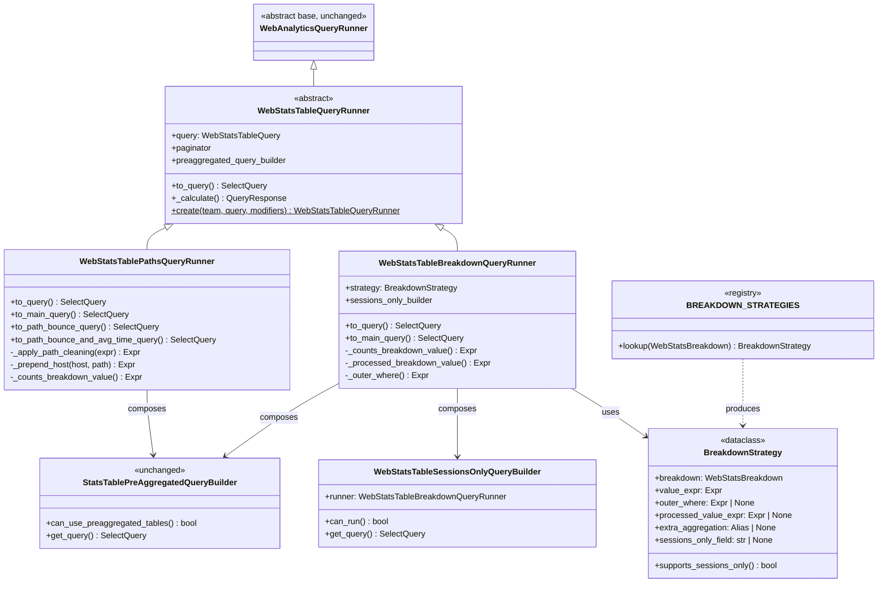

# web_stats_table runner refactor — design sketch

Status: design discussion — not yet scheduled, not yet started.

## Goals

1. Kill the `match self.query.breakdownBy` ladder that runs through
   `_counts_breakdown_value`, `_processed_breakdown_value`,
   `outer_where_breakdown`, `_include_extra_aggregation_value`, and
   `_extra_aggregation_value` in `stats_table.py`.
2. Isolate Paths-family behavior (path cleaning, host concat, alternate
   `to_path_bounce_query` / `to_path_bounce_and_avg_time_query` inner queries,
   `includeAvgTimeOnPage`) from the plain "group-by-a-column" breakdowns.
3. Let the sessions-only fast path be driven off declarative per-breakdown
   metadata rather than its own hard-coded allow-list in
   `stats_table_sessions_only.py`.

## Non-goals

- Splitting the runner for web_overview / web_trends (different shape,
  different concerns). If this works for stats_table, we can revisit others
  later.
- Rewriting the pre-aggregated path. `StatsTablePreAggregatedQueryBuilder`
  composes cleanly with either subclass and does not need to move.

## Shape

Two-axis split:

- **Runner subclass** picks between fundamentally different query shapes
  (paths has a different inner query than simple breakdowns). Inheritance.
- **`BreakdownStrategy`** parameterizes the per-column quirks within the
  "simple breakdown" family (which column, which post-processing, which
  outer-where guard). Composition.

## Class diagram



## Who owns what breakdown

| Subclass                            | Breakdowns                                                                                                                                                                                                                                                 |
| ----------------------------------- | ---------------------------------------------------------------------------------------------------------------------------------------------------------------------------------------------------------------------------------------------------------- |
| `WebStatsTablePathsQueryRunner`     | `PAGE`, `INITIAL_PAGE`, `EXIT_PAGE`, `EXIT_CLICK`, `PREVIOUS_PAGE`, `SCREEN_NAME`                                                                                                                                                                          |
| `WebStatsTableBreakdownQueryRunner` | `INITIAL_CHANNEL_TYPE`, `INITIAL_REFERRING_DOMAIN`, `INITIAL_REFERRING_URL`, `INITIAL_UTM_*`, `INITIAL_UTM_SOURCE_MEDIUM_CAMPAIGN`, `BROWSER`, `OS`, `VIEWPORT`, `DEVICE_TYPE`, `COUNTRY`, `REGION`, `CITY`, `TIMEZONE`, `LANGUAGE`, `FRUSTRATION_METRICS` |

Split rule: if the breakdown needs path cleaning, host concatenation,
`includeAvgTimeOnPage`, or the bounce-only alternate inner query, it goes in
Paths. Everything else is a "simple" breakdown.

## BreakdownStrategy examples

```python
STRATEGIES: dict[WebStatsBreakdown, BreakdownStrategy] = {
    WebStatsBreakdown.INITIAL_CHANNEL_TYPE: BreakdownStrategy(
        value_expr=ast.Field(chain=["session", "$channel_type"]),
        sessions_only_field="$channel_type",
    ),
    WebStatsBreakdown.INITIAL_UTM_SOURCE: BreakdownStrategy(
        value_expr=ast.Field(chain=["session", "$entry_utm_source"]),
        outer_where=None,  # explicitly show NULL
        sessions_only_field="$entry_utm_source",
    ),
    WebStatsBreakdown.REGION: BreakdownStrategy(
        value_expr=...,
        outer_where=parse_expr(
            "tupleElement(`context.columns.breakdown_value`, 2) IS NOT NULL"
        ),
        sessions_only_field=None,  # event-scope, no fast path
    ),
    WebStatsBreakdown.LANGUAGE: BreakdownStrategy(
        value_expr=ast.Field(chain=["events", "properties", "$browser_language"]),
        processed_value_expr=parse_expr(
            "arrayElement(splitByChar('-', assumeNotNull(breakdown_value), 2), 1)"
        ),
        extra_aggregation=parse_expr(
            "arrayElement(topK(1)(arrayElement(splitByChar('-', "
            "assumeNotNull(breakdown_value), 2), 2)), 1) "
            "AS `context.columns.aggregation_value`"
        ),
        sessions_only_field=None,
    ),
    # ... one entry per non-Paths breakdown
}
```

The strategy replaces four separate `match` statements with one lookup.

## Dispatcher

`WebStatsTableQueryRunner.create(...)` classmethod:

```python
@classmethod
def create(cls, *, team, query, **kwargs) -> "WebStatsTableQueryRunner":
    if query.breakdownBy in PATHS_BREAKDOWNS:
        return WebStatsTablePathsQueryRunner(team=team, query=query, **kwargs)
    return WebStatsTableBreakdownQueryRunner(
        team=team, query=query, strategy=STRATEGIES[query.breakdownBy], **kwargs
    )
```

Callers that currently do `WebStatsTableQueryRunner(team=..., query=...)`
keep working if we make the base class's `__init__` dispatch via
`__new__` — but the cleaner migration is to audit and swap call sites to
`.create(...)`. Grep shows the main constructor is in the viewset handler and
tests; not a wide blast radius.

## Sessions-only hookup

`WebStatsTableSessionsOnlyQueryBuilder.can_run` today does:

```python
if self.runner.query.breakdownBy not in _SUPPORTED_BREAKDOWNS:
    return False
```

After the refactor:

```python
if not self.runner.strategy.supports_sessions_only():
    return False
```

And the query builder pulls `self.runner.strategy.sessions_only_field`
instead of looking up `_SUPPORTED_BREAKDOWNS`. Adding a new sessions-only
breakdown becomes "set `sessions_only_field=` on its strategy entry."

## Migration plan (rough)

1. **PR A — extract BreakdownStrategy, keep one runner class.** Introduce
   `strategies.py`, define `BreakdownStrategy` and the registry, rewrite the
   four `match` ladders in today's runner to look up the strategy. No
   behavior change, no subclass split yet.
2. **PR B — split Paths into its own subclass.** Move
   `to_path_bounce_query`, `to_path_bounce_and_avg_time_query`,
   `_apply_path_cleaning`, `_prepend_host`, and the Paths-family cases out of
   the base into `WebStatsTablePathsQueryRunner`. Introduce
   `WebStatsTableBreakdownQueryRunner` for the remaining cases. Add the
   `.create()` factory. Base becomes abstract / thin.
3. **PR C — retarget sessions-only at the strategy.** Drop
   `_SUPPORTED_BREAKDOWNS` in favor of `strategy.supports_sessions_only()`.
4. **(optional) PR D — file layout.** Turn `stats_table.py` into a
   `stats_table/` package.

Each step keeps the runner output identical and can ship independently behind
no feature flag — purely internal shape changes.

## Risks / open questions

- **`__init__` compatibility.** Callers that construct `WebStatsTableQueryRunner`
  directly (including test fixtures) would still get a concrete class. We'd
  either (a) audit and migrate to `.create(...)`, or (b) keep the base name
  as a factory façade via `__new__`. (a) is cleaner.
- **Shared helpers.** `_period_comparison_tuple`, `_current_period_aggregate`,
  `_previous_period_aggregate`, `_event_properties`, `_test_account_filters`
  live on the base. They're needed by both subclasses — fine.
- **`outer_where_breakdown` vs. strategy.** REGION/CITY/VIEWPORT need a
  NOT-NULL guard on the breakdown tuple. That's data-shape-specific, fits
  cleanly on the strategy.
- **`usedPreAggregatedTables` / `usedSessionsOnly` flags.** The base keeps
  these; subclasses set them the same way they do today. No response-shape
  change.
- **Pre-aggregated builder.** `StatsTablePreAggregatedQueryBuilder` already
  contains its own dispatch on breakdownBy. Out of scope for this refactor;
  either subclass can compose it unchanged. Could be revisited in a later
  pass.

## Out of scope (for now)

- Consolidating pre-agg and joined-path dispatch into a single strategy
  object. Different problem — those are "which data source" strategies,
  not "which column."
- Refactoring `stats_table_queries.py` HogQL strings. They already work;
  only touch if PR B reveals a dead query.
