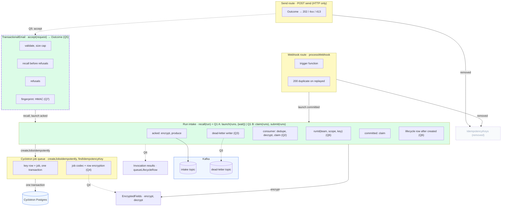

```mermaid
flowchart TB
  classDef new fill:#dcfce7
  classDef changed fill:#fef9c3
  classDef removed fill:#f8fafc,stroke-dasharray:4 4,color:#94a3b8
  classDef suggested stroke:#7c3aed,stroke-dasharray:6 4,stroke-width:2px
  classDef fork stroke:#7c3aed,stroke-dasharray:2 3,stroke-width:2px
  classDef ext fill:#eff6ff,stroke:#2563eb
  subgraph Send["Send route · POST send (HTTP only)"]
    S1["Outcome → 202 / 4xx / 413"]
  end
  Keys["IdempotencyKeys (removed)"]
  subgraph Tx["TransactionalEmail · accept(request) → Outcome  (Q5)"]
    T1[validate, size cap]
    T2[recall before refusals]
    T3[refusals]
    T4["fingerprint: HMAC (Q7)"]
  end
  subgraph Hook["Webhook route · processWebhook"]
    H1[trigger function]
    H2[200 duplicate on replayed]
  end
  subgraph Intake["Run intake · recall(run) + Q1 A: launch(runs, {wait}) | Q1 B: claim(runs), submit(runs)"]
    I1[acked: encrypt, produce]
    I2["dead-letter writer (Q3)"]
    I3["consumer: dedupe, decrypt, claim (Q2)"]
    I4["runId(team, scope, key) (Q6)"]
    I5[committed: claim]
    I6["lifecycle row after created (Q6)"]
  end
  subgraph Kafka
    K1[(intake topic)]
    K2[(dead-letter topic)]
  end
  subgraph Queue["Cyclotron job queue · createJobsIdempotently, findIdempotencyKey"]
    Q1[key row + job, one transaction]
    Q2["job codec + row encryption (Q4)"]
  end
  Crypto["EncryptedFields · encrypt, decrypt"]
  Results["Invocation results · queueLifecycleRow"]
  PG[(Cyclotron Postgres)]
  Send -. "Q5: accept" .-> Tx
  Send -- removed --> Keys
  Hook -- removed --> Keys
  Tx -- "recall, launch acked" --> Intake
  Hook -- "launch committed" --> Intake
  I1 --> K1
  I2 -. Q3 .-> K2
  Intake -- createJobsIdempotently --> Queue
  Intake -- encrypt --> Crypto
  Intake -. Q6 .-> Results
  Q2 -. Q4 .-> Crypto
  Queue -- one transaction --> PG
  class Send,Hook,Queue changed
  class Tx,Intake new
  class Tx suggested
  class Keys removed
  class Kafka,PG ext
```
