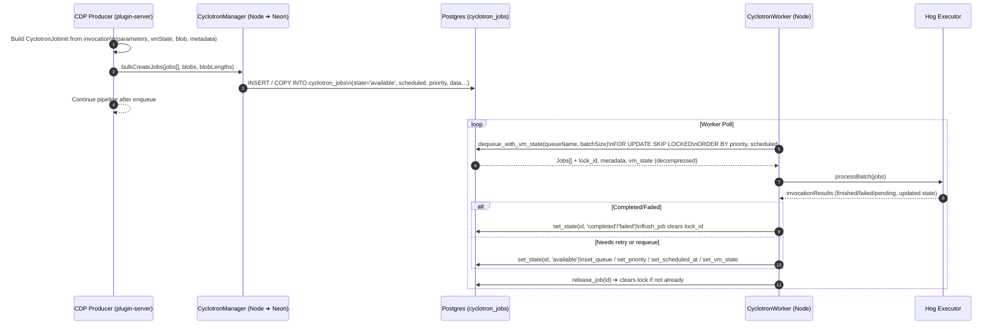
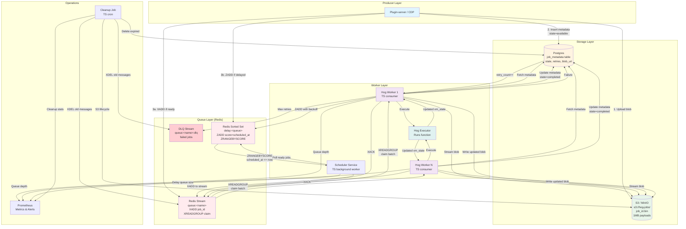
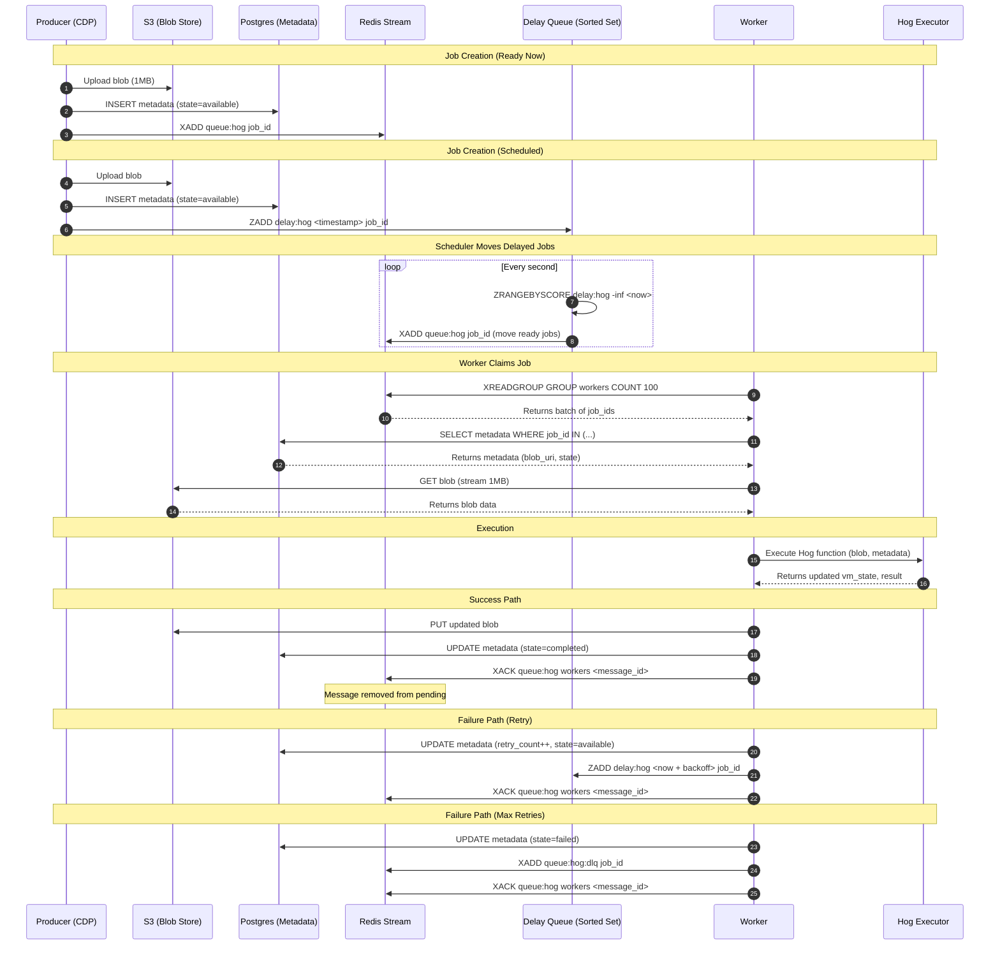

# Cyclotron Job Queue Overview

Cyclotron is PostHog’s bespoke job queuing framework for Customer Data Platform (CDP) workloads. It marries a Postgres-backed queue (written in Rust) with Node bindings that plug directly into the plugin-server. This document captures how it works, how data flows through it, and what guarantees consumers rely on.

> **Why this exists**: The CDP needs to persist Hog function invocations (full VM state, HTTP payloads, metadata) and run them asynchronously with ordering, scheduling, retries, and health tracking.

---

## Component Map

| Layer | Location | Role |
| --- | --- | --- |
| Rust core | `rust/cyclotron-core` | Defines queue schema, SQL operations (insert, bulk insert, dequeue with `FOR UPDATE SKIP LOCKED`, flush/update, heartbeat, janitor cleanup), and exposes `QueueManager` + `Worker`. |
| Neon bridge | `rust/cyclotron-node/src/lib.rs` | Creates a shared Tokio runtime in the Node process, exposes async Neon functions (`createJob`, `bulkCreateJobs`, `dequeueJobs`, `setState`, `setVmState`, etc.). |
| TS wrappers | `rust/cyclotron-node/src/*.ts`, published as `@posthog/cyclotron` | Provides `CyclotronManager` (producer API) and `CyclotronWorker` (consumer loop) with typed configs, serialization helpers, and buffer management for blobs. |
| Plugin-server integration | `plugin-server/src/cdp/services/job-queue/job-queue-postgres.ts` + `cdp/consumers/*` | Wraps Cyclotron in a higher-level `CyclotronJobQueue` abstraction that can route jobs between Postgres, Kafka, and delay queues. Converts Hog invocations to Cyclotron jobs and vice versa, handles state updates, and feeds `CdpCyclotronWorker`. |

---

## Data Model (Postgres `cyclotron_jobs`)

| Field | Purpose |
| --- | --- |
| `id uuid` | Job identifier (UUID v7 if not supplied). Workers require this to update state. |
| `team_id int` / `function_id uuid?` | Multitenancy and Hog function routing. |
| `queue_name text` | Logical queue (e.g. `hog`, `hogoverflow`). |
| `state JobState` | `available`, `running`, `completed`, `failed`, `paused`. |
| `priority smallint` | Lower number = higher priority; used in ordering. |
| `scheduled timestamptz` | Delays availability until `scheduled <= now`. |
| `vm_state bytea?` | Serialized Hog VM snapshot (optionally compressed before insert). |
| `parameters bytea?` | JSON-ish invocation parameters (fetch/email). |
| `blob bytea?` | Binary payload (HTTP body, attachments). |
| `metadata bytea?` | Arbitrary metadata for retries / context. |
| `lock_id uuid?` / `last_heartbeat timestamptz?` | Worker lease token + heartbeat, must match on updates. |
| `transition_count`, `janitor_touch_count`, `last_transition` | Auditing for state changes and cleanup heuristics. |

---

## Data Flow (Producer ➜ Queue ➜ Consumer)



Key behaviors:

1. **Chunked bulk inserts** (`chunk()` in `job-queue-postgres.ts`) mitigate WAL contention. The CDP side batches invocations, then calls Lodash’s `chunk()` to cut the list into smaller slices (size set by `CDP_CYCLOTRON_INSERT_MAX_BATCH_SIZE`). Each slice becomes its own `bulkCreateJobs` call instead of one monster INSERT. Smaller transactions mean:
   - Fewer rows per Postgres transaction, so the WAL (write-ahead log) writer doesn’t get hammered by a single huge append.
   - WAL flushes happen more frequently with fewer page locks, so replicas can keep up.

   **WAL contention?** Postgres records every insert/update in `pg_wal` before committing. When we try to insert hundreds of large rows in one statement, the WAL writer thread becomes the bottleneck: it must serialize lots of data, fsync it, and keep the WAL buffers pinned. Readers then queue behind WAL flushes, and checkpoint/replication lag skyrockets. Chunking spreads that WAL load across many smaller transactions, so we trade per-call throughput for overall system stability.
2. Workers optionally skip fetching `vm_state` for lightweight polling (`dequeue_jobs` vs `dequeue_with_vm_state`).
3. `lock_id` ties every update to the worker that currently owns the job; invalid locks raise `QueueError`.
4. Heartbeats (`setHeartbeat`) keep track of stuck workers; janitor can reclaim long-dead locks.

---

## State Transitions

```
AVAILABLE --(dequeue)--> RUNNING --(completion)--> COMPLETED
         \                               \
          \                               -> FAILED
           \--(pause/overflow)--> PAUSED  \
            \                              -> back to AVAILABLE (retry / reschedule)

- dequeue: assigns lock_id, sets last_heartbeat/transition.
- flush back to AVAILABLE: sets new queue/priority/schedule, clears lock.
- completion/failure: clears lock + heartbeat, janitor later deletes rows.
```

---

## How CDP Uses Cyclotron

1. **Routing:** `CyclotronJobQueue` decides whether to push an invocation to Postgres (Cyclotron), Kafka, or the delay queue. Postgres is chosen for scheduled jobs, for teams routed to Cyclotron, or when `producerForceScheduledToPostgres` is on.
2. **Production:** `queueInvocations()` converts a `CyclotronJobInvocation` into `CyclotronJobInit`:
   - Splits fetch jobs into `parameters` (headers/method/etc.) and `blob` (body).
   - Preserves invocation IDs if they’re UUIDs.
   - Serializes Hog VM state, metadata, and scheduling metadata.
3. **Consumption:** `CyclotronJobQueuePostgres.startAsConsumer()` spins up a `CyclotronWorker` that continuously polls Cyclotron for the configured queue name and batches results into `consumeBatch`.
4. **Execution:** `CdpCyclotronWorker` loads Hog functions, executes them, and calls back into the queue (`queueInvocationResults`) to set state and release jobs.
5. **Requeue/Releases:** When a job is migrated back to Kafka (`releaseInvocations`), Cyclotron marks it `completed` and releases the lock to avoid reprocessing.

---

## Operational Concerns

- **Sharding:** Manager accepts `shards: CyclotronPoolConfig[]`, `shardDepthLimit`, and `shardDepthCheckIntervalSeconds`. Each shard is just a separate Postgres connection pool; there’s no automatic data sharding, so manual routing is required.
- **Compression:** `shouldCompressVmState` toggles transparent compression/decompression of the `vm_state` blob to keep rows smaller.
- **Bulk Copy:** `shouldUseBulkJobCopy` switches to the `COPY ... FROM STDIN` path for faster inserts when the DB allows it.
- **Health:** `CyclotronWorker.isHealthy()` checks that it is consuming and heartbeat hasn’t exceeded `heartbeatTimeoutMs`. `CyclotronJobQueue.isHealthy()` surfaces this to PostHog’s health endpoints.
- **Janitor:** `rust/cyclotron-core/src/ops/janitor.rs` (not shown above) aggregates and deletes completed/failed jobs after they age out, preventing the table from growing without bound.

---

## Pain Points Today

| Problem | Symptom | Root cause |
| --- | --- | --- |
| Disk blow-ups | Tens/hundreds of millions of invocations fill disks + WAL within short period of time; replicas lag. | Each row stores vm state, parameters, metadata, blob, and is updated repeatedly. Postgres retains old tuples until autovacuum frees them, so churn equals disk usage. |
| **Dead letter queue explosion** | Disk fills up rapidly, PlanetScale turns DB read-only. Scaling up disk immediately fills again. | Dead letter queue (`_cyclotron_dead_letter`) accumulates failed jobs that never get cleaned up. With millions of jobs, even small payloads (4.5 KB) = massive disk usage. No automatic cleanup. |

**Actual observed job sizes** (from production data):
- Total payload: **~4.5 KB per job** (not 1MB as sometimes assumed)
  - `vm_state`: ~2.7 KB (59% of payload, largest field)
  - `blob`: ~1.6 KB (35% of payload)
  - `parameters`: ~155 bytes
  - `metadata`: ~120 bytes
- At 162M (current invocations in US) jobs: **~730 GB total** (not 162 TB)
- Even at this smaller size, the volume (162M rows) + update churn + TOAST overhead still causes disk/WAL pressure

**Real-world impact** (from dev environment when routing all traffic to Postgres):
- **BackupRetentionPeriodStorageUsed**: Doubled from ~6.69 GB to ~13.4 GB in ~3 weeks
- **CommitThroughput**: Spikes to 2.56k commits/second (high write volume)
- **DatabaseConnections**: Active connections (2-4) indicating continuous load
- **DiskQueueDepth**: Occasional I/O queuing (0-4) during high activity
- **CPUUtilization**: Low (<1%) - not CPU-bound, but disk/WAL-bound
- **BufferCacheHitRatio**: Perfect (101%) - memory is fine, problem is disk growth

This confirms the disk blow-up problem: even at ~4.5 KB per job, routing everything to Postgres causes rapid backup storage growth and write pressure.

### Critical Incident: Dead Letter Queue Disk Explosion

**What happened** (dev environment on PlanetScale):
1. Dead letter queue (`_cyclotron_dead_letter`) accumulated millions of failed jobs
2. Disk filled up completely → PlanetScale turned DB **read-only** (unrecoverable state)
3. Scaled up disk → **immediately filled again** (autovacuum couldn't keep up)
4. Database effectively unusable until manual intervention

**When jobs move to dead letter queue**:
- Jobs are moved to `_cyclotron_dead_letter` when they're **"poison pills"** (stalled jobs reset by janitor too many times)
- The `dead_letter()` function sets job `state = 'available'` and `queue_name = '_cyclotron_dead_letter'`
- Jobs in DLQ are still "available" (can be re-run if moved back), not "failed" or "completed"

**Root cause**:
- **Dead letter jobs never get cleaned up automatically**
- Janitor's `delete_completed_and_failed_jobs()` only deletes jobs WHERE `state IN ('failed', 'completed')`
- DLQ jobs have `state = 'available'`, so they're **excluded from cleanup**
- With millions of jobs at ~4.5 KB each, even small payloads = massive disk usage
- PlanetScale's read-only protection kicks in at 100% disk → **no recovery path**

**Immediate solutions**:
- **`pg_squeeze`**: Reclaim space from dead tuples without full VACUUM (less disruptive)
- **Manual cleanup**: Delete dead letter jobs older than retention period
- **Emergency**: Drop partitions or truncate dead letter queue if needed

**Prevention** (must implement):
1. **Automatic dead letter cleanup**: Janitor should also clean `_cyclotron_dead_letter` queue
2. **Disk usage alerts**: Monitor `BackupRetentionPeriodStorageUsed` and alert before 80%
3. **Dead letter retention policy**: Auto-delete dead letter jobs after X days (e.g., 7 days)
4. **Separate dead letter table**: Move dead letters to separate table with TTL/partitioning
5. **S3 offload for dead letters**: Serialize dead letter jobs to S3, keep only metadata in Postgres

**Why the simplified architecture helps**:
- **Delayed jobs in S3**: Reduces Postgres disk usage for long-lived jobs
- **Separate `cyclotron_delayed_jobs` table**: Easier to monitor and clean up
- **Dead letter handling**: Can serialize dead letters to S3 immediately, keep only job_id in Postgres

**Should we offload `vm_state` to S3 too?**

`vm_state` is the largest field (59% of payload), but it has different access patterns than `blob`:

| Field | Read pattern | Write pattern | S3 offload impact |
| --- | --- | --- | --- |
| `blob` | Read once per job (immutable HTTP body) | Rarely updated | ✅ Low risk: mostly read-only, S3 GET once per job |
| `vm_state` | Read once per execution (Hog VM snapshot) | **Updated on retries** (state transitions) | ⚠️ Higher risk: mutable, S3 GET + PUT on retries |

**Tradeoffs of offloading `vm_state`:**

**Pros:**
- Removes **59% of payload** from Postgres (largest field)
- Combined with blob offload: **~94% of payload** moves to S3
- Reduces WAL by ~59% per job
- Makes vacuum much faster (smaller TOAST chunks)

**Cons:**
- **Latency hit**: Every dequeue = S3 GET (~10-50ms), every retry = S3 PUT (~10-50ms)
- **More S3 operations**: Retries require S3 PUT (more cost, more failure points)
- **Complexity**: Need to handle S3 errors, eventual consistency, versioning
- **Critical path**: `vm_state` is needed for Hog execution—S3 failures block job processing

**Recommendation:**

- **Offload `blob` to S3**: ✅ Yes—it's mostly read-only, reduces 35% of payload, low risk
- **Offload `vm_state` to S3**: ⚠️ **Maybe**—depends on retry frequency:
  - If retries are rare (<10% of jobs): Worth it—you get 59% WAL reduction with minimal S3 PUT overhead
  - If retries are common (>20% of jobs): Probably not—S3 PUT latency + cost adds up quickly
  - **Hybrid approach**: Keep `vm_state` in Postgres for active jobs, move to S3 only for long-delayed retries (>1 hour)

**Better alternative**: If you're already moving to Redis Streams + Postgres + S3, offload **both** `blob` and `vm_state` to S3. The Redis Streams architecture already assumes S3 for payloads, and you get the full benefit (~94% payload reduction) with the same complexity.
| Backpressure / queue depth | Queue depth spikes, throughput collapses, shard “depth limit” alarms fire. | Depth is `count(state='available')`. As depth grows, `ORDER BY priority, scheduled FOR UPDATE SKIP LOCKED` scans more heap pages, slowing workers, which increases depth further (feedback loop). |
| Cleanup pressure | Janitor deletes fall behind, causing vacuum storms or needing manual intervention. | Single massive table with large bytea columns. Deletes don’t reclaim disk promptly, so we bounce between heap bloat and autovacuum thrash. |

### Queue depth / backpressure explained

1. We measure queue depth per shard/queue by counting `state='available'` rows.
2. Producers consult depth before inserting. If depth exceeds `shardDepthLimit`, they block or reroute. That measurement itself is slow when the table is huge, so throttling lags reality.
3. Workers poll with `FOR UPDATE SKIP LOCKED LIMIT batch`. Deep queues mean each poll touches many pages before locking enough rows, so dequeue latency increases, which further increases depth.

Net effect: depth is a *lagging* signal, and Postgres IO saturation appears as “backpressure.”

### Cleanup reality

- Janitor deletes `completed/failed` rows older than the retention window, but deletes + autovacuum can’t keep up with >100M/day churn.
- Large blobs remain on disk until vacuum finishes, so even after deletion, disk pressure persists for hours.
- When janitor falls behind, we resort to manual partition drops or VACUUM FULL, which block writers.

---

## Replacement Requirements (if Cyclotron is swapped out)

Any new system needs to meet the following, otherwise Hog/CDP behavior breaks:

1. **Job lifecycle semantics**
   - States (`available`, `running`, `completed`, `failed`, `paused`), per-job scheduling, priority ordering.
   - Exclusive leases with heartbeats and enforced lock IDs on updates.
2. **Payload guarantees**
   - Support for large `vm_state`, `parameters`, `metadata`, `blob`, with ability to set/unset each independently.
   - Option to fetch jobs *without* the heavy VM state for lightweight polling.
3. **Batch APIs**
   - High-throughput bulk enqueue (thousands of jobs per call) and configurable dequeue batch sizes.
4. **Routing hooks**
   - Ability to coexist with Kafka/delay backends and track `queueSource` for each job.
5. **Observability and cleanup**
   - Transition counters, janitor/retention hooks, shard-depth metrics, and health endpoints analogous to the existing worker checks.

---

## Rethinking the Architecture

Goals:

- Consolidate the queue + worker orchestration into **TypeScript**, so it lives alongside the plugin-server and Hog executors.
- Pick technologies that match the workload (log-based transport, external state store) instead of forcing everything through Postgres.
- Decide whether to adopt an off-the-shelf system or build a thin TS service over existing infra.

### Core Requirements (Simplified Architecture)

**Current pain point**: Kafka routing (Warpstream) makes retries, offset commits, and job lifecycle management difficult.

**Current flow** (destinations/fetch requests):
```
MSK (clickhouse_events_json)
  ↓ consumes
cdp-events-consumer (@plugin-server/src/cdp/consumers/cdp-events.consumer.ts)
  ↓ queueInvocations() → routes based on producerMapping config
Warpstream (cdp_cyclotron_hog) ← Most jobs go here
  ↓ consumes
cdp-cyclotron-hog-consumer (@plugin-server/src/cdp/consumers/cdp-cyclotron-worker.consumer.ts)
  ↓ executes fetch calls & reports metrics/logs
Kafka (MSK) - metrics/logs
```

**Problems with Kafka routing**:
- Retries require republishing → message duplication
- Offset commits are all-or-nothing per batch → can't commit partial batches
- No native delay/scheduling → complex delay topic patterns
- Routing complexity (`producerMapping`, `producerTeamMapping`, `producerForceScheduledToPostgres`)

**Desired architecture** (simplified):

1. **Default path (immediate jobs)**: Queue everything to **Postgres** as the "pure job"
   ```
   MSK (clickhouse_events_json)
     ↓ consumes
   cdp-events-consumer
     ↓ queueInvocations() → always Postgres (no routing logic)
   Postgres (cyclotron_jobs)
     ↓ dequeue
   cdp-cyclotron-worker
     ↓ executes directly from Postgres (no blob serialization)
   Kafka (MSK) - metrics/logs
   ```
   - Execute directly from Postgres (no blob serialization)
   - Simple retries (just update state in Postgres)
   - No routing logic needed (`producerMapping` configs removed)

2. **Delayed jobs only**: When `queueScheduledAt > now + threshold` (e.g., >10 seconds):
   ```
   MSK (clickhouse_events_json)
     ↓ consumes
   cdp-events-consumer
     ↓ queueInvocations() → detects delay → serialize to S3
   S3 (blob storage)
     ↓
   Postgres (cyclotron_delayed_jobs) ← Separate table
     ↓ polls (separate consumer)
   cdp-cyclotron-delayed-worker
     ↓ when scheduled_at <= now, deserialize from S3
   Postgres (cyclotron_jobs) ← Move to main table OR execute directly
   ```
   - Serialize full job state (vm_state, blob, metadata, parameters) to **S3**
   - Store in **separate Postgres table**: `cyclotron_delayed_jobs` (job_id, scheduled_at, blob_uri, team_id, queue_name, priority)
   - **Separate consumer**: `cdp-cyclotron-delayed-worker` polls `cyclotron_delayed_jobs` (can run at different scale/interval)
   - When `scheduled_at <= now`, deserialize from S3 and either:
     - Move to main `cyclotron_jobs` table (for normal execution), OR
     - Execute directly (if delayed worker handles execution)

**Why this works**:
- **Most jobs are immediate** → No blob overhead for the common case
- **Only delayed jobs** need blob storage → Minimal S3 operations
- **Postgres handles retries** → No Kafka offset commit issues
- **Clean separation**: Different tables (`cyclotron_jobs` vs `cyclotron_delayed_jobs`) and consumers (`cdp-cyclotron-worker` vs `cdp-cyclotron-delayed-worker`)
- **Independent scaling**: Immediate and delayed workers can scale independently
- **Simpler mental model** → Two clear paths: immediate (Postgres) vs delayed (S3 + separate table)
- **Removes routing complexity** → No more `producerMapping` configs, team routing, percentage splits

**Tradeoffs**:
- Delayed jobs have S3 GET/PUT overhead (acceptable since they're delayed anyway)
- Need to decide "delay threshold" (e.g., >10 seconds = serialize to blob?)
- Blob cleanup for delayed jobs (S3 lifecycle policies)
- Still need Postgres queue depth/backpressure handling (but simpler than Kafka)

### Technology options worth evaluating

| Option | Upside | Gaps / concerns |
| --- | --- | --- |
| Redis Streams + Postgres + S3 | Designed for job queues: consumer groups, true dequeue (`XACK`), message claiming (`XCLAIM`), no message duplication for retries. Delay scheduling via sorted sets. Already in our stack. | Need to handle Redis durability (AOF/RDB persistence, replication). Memory-bound for very long retention (but can use Redis-on-Flash or spill to Postgres for old jobs). |
| Graphile Worker | TS-native, PG-backed queue with LISTEN/NOTIFY, retries, crontab, job keys ([docs](https://worker.graphile.org/docs)). Great for self-hosted or lower-volume queues, removes our custom Rust layer. | Still Postgres-centric; at our current scale it would hit the same disk/backpressure ceilings unless we partition heavily and offload blobs. 

### Why move to TypeScript?

- Most of the surrounding logic (routing, Hog execution, monitoring) already runs in TS; keeping the queue layer in Rust/Neon splits ownership.
- TS rewrite removes the Neon/OnceCell runtime, making lifecycle management simpler and enabling hot reloads/tests with existing tooling.
- We can still delegate heavy lifting (compression, encryption) to Rust modules, but the orchestration logic + APIs remain in one language.

### What Cyclotron provides today (must be preserved)

1. **Reliable transport** for Hog invocations, including scheduling, priority, overflow routing, and per-team queues.
2. **Durable state** (vm state, metadata, blob) that can be mutated between retries.
3. **Backpressure hooks** (depth metrics, shard limits) to protect downstream systems.
4. **Operational visibility** (health checks, janitor stats, metrics).

Separating concerns suggests a new architecture:

- **Transport**: Redis Streams (designed for job queues, has consumer groups, can actually claim/dequeue messages, better delay semantics than Kafka).
- **VM state + payload storage**: S3 for large blobs, Postgres for metadata (state, retries, scheduling).
- **Scheduler/delay layer**: Redis sorted sets or Postgres-based delay queue.
- **Controller/metrics**: TypeScript that mirrors today's `CyclotronJobQueue` API so consumers don't know the difference.

**Why not Kafka?** Kafka is designed for event streaming, not job queues. It creates problems:
- Retries require republishing messages → massive duplication
- No native delay/scheduling → wide delay windows, complex delay topic patterns
- Can't actually "dequeue" messages → only consume and commit offsets, no way to remove
- Offset management becomes a nightmare for job lifecycle

### Suggested next steps

1. Quantify requirements: peak enqueue/dequeue rate, payload sizes, retention windows, per-team isolation.
2. Prototype a TS implementation using Redis Streams + Postgres + S3 that implements the same `CyclotronJobQueue` interface—start with shadow traffic.
3. Design a dual-write migration plan (write to Postgres + new backend) to validate parity before cutover.
4. Define a cleanup/retention story independent of the queue (TTL in Redis/S3, aggregated metrics in ClickHouse) so disk blow-ups disappear.

---

## Architecture Options

### Option A: Postgres + S3 Only (Simpler Stack)

**Can it work?** Yes, but requires careful design to avoid the same problems Cyclotron has today.

**Key design principle:** Separate the **hot queue table** from **metadata table**.

#### Schema Design

```sql
-- Hot queue: minimal rows, only for ready jobs
CREATE TABLE ready_queue (
    job_id UUID PRIMARY KEY,
    queue_name TEXT NOT NULL,
    priority SMALLINT NOT NULL,
    scheduled_at TIMESTAMPTZ NOT NULL,
    created_at TIMESTAMPTZ NOT NULL DEFAULT NOW()
);

CREATE INDEX idx_ready_queue_dequeue 
    ON ready_queue(queue_name, priority, scheduled_at) 
    WHERE scheduled_at <= NOW();

-- Metadata: full job state (partitioned by team_id or time)
CREATE TABLE job_metadata (
    job_id UUID PRIMARY KEY,
    team_id INT NOT NULL,
    function_id UUID,
    queue_name TEXT NOT NULL,
    state TEXT NOT NULL, -- available, running, completed, failed
    blob_uri TEXT, -- s3://hog-jobs/<job_id>.bin
    retry_count INT DEFAULT 0,
    lock_id UUID,
    heartbeat_at TIMESTAMPTZ,
    expires_at TIMESTAMPTZ,
    created_at TIMESTAMPTZ NOT NULL DEFAULT NOW(),
    updated_at TIMESTAMPTZ NOT NULL DEFAULT NOW()
) PARTITION BY HASH(team_id); -- or RANGE(created_at)

-- Delay queue: for scheduled jobs
CREATE TABLE delay_queue (
    job_id UUID PRIMARY KEY,
    queue_name TEXT NOT NULL,
    scheduled_at TIMESTAMPTZ NOT NULL,
    priority SMALLINT NOT NULL
);

CREATE INDEX idx_delay_queue_ready 
    ON delay_queue(scheduled_at) 
    WHERE scheduled_at <= NOW();
```

#### How It Works

1. **Enqueue**: Write blob to S3, insert metadata row, insert into `ready_queue` (or `delay_queue` if scheduled).
2. **Dequeue**: `DELETE FROM ready_queue WHERE job_id IN (SELECT job_id FROM ready_queue WHERE queue_name = $1 AND scheduled_at <= NOW() ORDER BY priority, scheduled_at LIMIT $2 FOR UPDATE SKIP LOCKED) RETURNING job_id`. Then fetch metadata + blob.
3. **Update**: Update `job_metadata` state, write updated blob to S3. If retry, re-insert into `ready_queue` or `delay_queue`.
4. **Scheduler**: Background worker moves jobs from `delay_queue` to `ready_queue` when `scheduled_at <= NOW()`.
5. **Cleanup**: Delete from `ready_queue` when done, delete metadata rows past `expires_at`, S3 lifecycle handles blobs.

#### Pros

- ✅ **Simpler stack**: One less system (no Redis)
- ✅ **Transactional**: Can atomically update metadata + queue in one transaction
- ✅ **Familiar**: Your team already knows Postgres
- ✅ **Durable**: Postgres ACID guarantees
- ✅ **No message duplication**: Retries just update metadata and re-insert into queue

#### Cons

- ⚠️ **Still hitting Postgres hard**: Even with a lightweight `ready_queue`, you're doing millions of INSERT/DELETE operations
- ⚠️ **Vacuum pressure**: High churn on `ready_queue` means aggressive vacuum needed
- ⚠️ **Lock contention**: `FOR UPDATE SKIP LOCKED` works, but at 162M jobs, you need many partitions
- ⚠️ **Backpressure**: Queue depth = `SELECT COUNT(*) FROM ready_queue` which gets expensive
- ⚠️ **Scaling**: Need to partition `ready_queue` by queue_name or team_id, which adds complexity

#### When This Works

- If you can **partition aggressively** (e.g., separate `ready_queue` table per queue/team)
- If you can **tune Postgres** for high churn (frequent vacuum, proper autovacuum settings)
- If **enqueue/dequeue rate** is moderate (<100k ops/sec per partition)
- If you're okay with **ongoing maintenance** (partition management, vacuum tuning)

**Verdict**: Can work, but you're still fighting Postgres's strengths. Better than current Cyclotron (blobs in S3 helps), but Redis Streams is purpose-built for this.

---

### Option B: Redis Streams + Postgres + S3 (Recommended)

**Why add Redis?** It's purpose-built for high-throughput job queues and removes the hot table problem from Postgres.

**AWS ElastiCache compatibility**: ✅ **Yes, ElastiCache for Redis fully supports Redis Streams**. 

- **Redis Streams** was introduced in Redis 5.0, and ElastiCache supports Redis 5.0.6+ (and all newer versions).
- All required commands work: `XADD`, `XREADGROUP`, `XACK`, `XCLAIM`, `XLEN`, `XPENDING`, `XDEL`, `XTRIM`.
- **Cluster mode vs non-cluster**: 
  - **Non-cluster mode** (single node or replication group): All Streams commands work as expected.
  - **Cluster mode**: Streams work, but you need to ensure related keys (stream + consumer group) hash to the same slot, or use hash tags: `{queue:hog}` instead of `queue:hog` to force colocation.
- **Memory considerations**: ElastiCache has configurable memory limits. For 162M jobs, you'll want:
  - Use `MAXLEN` on streams to auto-trim old messages (e.g., `XADD ... MAXLEN ~ 1000000` keeps ~1M messages)
  - Or rely on Postgres metadata + S3 blobs, keeping only active job IDs in Redis
  - Monitor `used_memory` and set up eviction policies if needed
- **Durability**: Enable **AOF (Append Only File)** persistence in ElastiCache for durability. Replication groups provide additional redundancy.
- **Failover**: ElastiCache automatic failover works with Streams—consumer groups and pending messages persist across failovers.

**Why Redis Streams instead of Kafka?** Kafka is designed for event streaming, not job queues. It creates fundamental problems:
- **Massive duplication**: Retries require republishing messages, creating exponential message growth.
- **Wide delay windows**: No native delay/scheduling—you need complex delay topic patterns or external schedulers.
- **Can't actually dequeue**: Kafka only supports consume + commit offsets; there's no way to remove messages, leading to offset management nightmares.
- **Wrong abstraction**: Job queues need claim/ack semantics, not just stream consumption.

Redis Streams solves these by providing:
- **True dequeue**: `XACK` removes messages from pending lists.
- **Message claiming**: `XCLAIM` lets you reassign stuck messages to other workers.
- **No duplication**: Retries just update metadata and re-add to stream (or delay queue), not duplicate messages.
- **Built-in delay**: Redis sorted sets provide efficient delay scheduling without separate topics.

### Components & responsibilities

| Component | Technology | What it does |
| --- | --- | --- |
| **Invocation producer** | TypeScript (plugin-server) | Serializes Hog invocation metadata, uploads the 1 MB payload (vm state, blob) to S3, writes metadata row to Postgres, adds job ID to Redis Stream (or delay queue if scheduled in future). |
| **Metadata store** | Postgres table (partitioned) | Canonical source of truth for job state (`available/running/completed`), schedule, retries, lock/heartbeat, blob URI, checksum. Small rows (<1 KB) so churn is cheap. |
| **Payload store** | S3 / MinIO bucket | Stores immutable blobs (`s3://hog-jobs/<job_id>.bin`). Lifecycle rules clean up after retention; metadata holds pointer + retention timestamp. |
| **Transport** | Redis Streams (ElastiCache for Redis, one stream per queue/team) | Carries job IDs `{ job_id, team_id, queue, scheduled_at, attempt }`. Consumer groups provide ordering + horizontal scale; `XREADGROUP` actually claims messages (true dequeue). Use `MAXLEN` to auto-trim old messages. |
| **Delay/scheduler service** | Redis sorted set (ElastiCache, ZADD with score = scheduled_at) | Handles delayed jobs: `ZADD delay:<queue> <scheduled_timestamp> <job_id>`. Background worker polls with `ZRANGEBYSCORE` and moves ready jobs to the main stream. |
| **Workers** | TS processes (one per queue kind) | Use `XREADGROUP` to claim batches from Redis Streams, hydrate metadata + blob from Postgres/S3, execute Hog function, write updated vm state back to S3 + metadata, `XACK` to mark complete. |
| **Retry/DLQ handler** | Redis Streams + Postgres counters | On failure, increments retry count in Postgres. If under limit, adds to delay queue with exponential backoff. After max attempts, adds to `queue:dlq` stream. |
| **Cleanup + observability** | TS cron + Prometheus | Periodically deletes metadata rows older than retention, relies on S3 lifecycle to drop blobs, `XDEL` old messages from Redis Streams (or rely on `MAXLEN` trimming), exports metrics (stream length, retries, blob size) for alerting. |

### Why this split?

- **Redis Streams** is actually designed for job queues: consumer groups, message claiming (`XCLAIM`), true dequeue semantics (`XACK` removes from pending), built-in max length trimming. No message duplication for retries—just update metadata and re-add to stream.
- **Postgres** retains the transactional bits (state transitions, retries, audits) without holding blobs, so vacuum stays healthy.
- **S3** absorbs the TB-scale payloads cheaply and enforces retention via lifecycle rules.
- **TypeScript control plane** keeps all orchestration in the same language/runtime as the rest of the plugin-server, avoiding Neon bridges and Rust-only logic.

### End-to-end data flow

1. **Produce invocation**
   - Plugin-server receives a Hog invocation, serializes vm state + payload to `Buffer`.
   - Uploads blob to `s3://hog-jobs/<job_id>.bin` (tagged with retention days).
   - Inserts/updates Postgres metadata row with state `available`, schedule, blob URI.
   - If `scheduled_at` <= now, adds job ID to Redis Stream `queue:<queue_name>` via `XADD`. If scheduled in future, adds to delay sorted set `delay:<queue_name>` with score = `scheduled_at`.
2. **Scheduler service** (background worker)
   - Polls delay sorted sets with `ZRANGEBYSCORE delay:<queue> -inf <now>` to find ready jobs.
   - Moves ready job IDs from delay set to the main stream via `XADD queue:<queue> * job_id <job_id>`.
3. **Worker dequeue**
   - Worker uses `XREADGROUP GROUP <group> <consumer> COUNT <batch_size> STREAMS queue:<queue> >` to claim a batch of messages.
   - For each message, reads metadata from Postgres (ensuring state still `available`) and streams blob from S3.
4. **Execution**
   - Worker runs Hog function, producing new vm state / metadata / outgoing side effects.
5. **Update + ack**
   - Writes updated vm state back to S3 (new version or same key), updates Postgres metadata (state `completed`/`failed`/`available`, retries, next schedule, heartbeat).
   - Calls `XACK queue:<queue> <group> <message_id>` to mark message as processed (removes from pending list). If worker crashes, unacked messages can be claimed by other workers via `XCLAIM`.
6. **Retry / DLQ**
   - On failure, increments retry count in Postgres. If under limit, calculates backoff delay and adds job ID to delay sorted set with new `scheduled_at`. After max attempts, adds to `queue:<queue>:dlq` stream.
7. **Cleanup**
   - Daily job deletes metadata rows whose `expires_at` passed. S3 lifecycle automatically removes blobs beyond retention. Redis Streams auto-trim via `MAXLEN` or manual `XDEL` for old messages.

### How Scheduling Works (Redis Sorted Sets)

When you schedule a job for the future, here's exactly what happens:

#### 1. Enqueueing a Scheduled Job

```typescript
// Job scheduled for 1 hour from now
const scheduledAt = new Date(Date.now() + 3600000); // +1 hour
const timestamp = Math.floor(scheduledAt.getTime() / 1000); // Unix timestamp in seconds

// Store in delay queue: score = scheduled timestamp, value = job_id
await redis.zadd(`delay:${queueName}`, timestamp, jobId);

// Also store metadata in Postgres
await postgres.query(`
    INSERT INTO job_metadata (job_id, team_id, queue_name, state, scheduled_at, blob_uri)
    VALUES ($1, $2, $3, 'available', $4, $5)
`, [jobId, teamId, queueName, scheduledAt, blobUri]);
```

**Redis command**: `ZADD delay:hog 1735689600 job-123` (score = Unix timestamp, member = job_id)

#### 2. Scheduler Service (Background Worker)

A TypeScript background service runs continuously, polling all delay queues:

```typescript
async function schedulerLoop() {
    while (true) {
        const now = Math.floor(Date.now() / 1000); // Current Unix timestamp
        
        // Find all queues with delay sets
        const queues = await getActiveQueues(); // e.g., ['hog', 'hogoverflow']
        
        for (const queue of queues) {
            const delayKey = `delay:${queue}`;
            const streamKey = `queue:${queue}`;
            
            // Get all jobs whose scheduled_at <= now
            // ZRANGEBYSCORE returns jobs sorted by score (timestamp) ascending
            const readyJobs = await redis.zrangebyscore(
                delayKey,
                '-inf',           // Min score (negative infinity = all)
                now,              // Max score (current time)
                'LIMIT', 0, 100  // Batch size for efficiency
            );
            
            if (readyJobs.length === 0) continue;
            
            // Move each ready job to the main stream
            for (const jobId of readyJobs) {
                // Add to stream (ready for workers to consume)
                await redis.xadd(streamKey, '*', 'job_id', jobId);
                
                // Remove from delay queue (atomic operation)
                await redis.zrem(delayKey, jobId);
            }
        }
        
        // Poll every second (or configurable interval)
        await sleep(1000);
    }
}
```

**Redis commands used**:
- `ZRANGEBYSCORE delay:hog -inf 1735689600 LIMIT 0 100` - Get jobs ready now
- `XADD queue:hog * job_id job-123` - Add to main stream
- `ZREM delay:hog job-123` - Remove from delay queue

#### 3. Why Sorted Sets Work Well

- **Efficient range queries**: `ZRANGEBYSCORE` is O(log N + M) where N = total jobs, M = results. Very fast even with millions of scheduled jobs.
- **Automatic sorting**: Jobs are automatically sorted by timestamp (score), so you always process the earliest jobs first.
- **No polling overhead**: You can batch process 100+ jobs per query, minimizing Redis round trips.
- **Atomic operations**: `ZREM` after `XADD` ensures jobs aren't lost or duplicated.

#### 4. Handling Retries with Exponential Backoff

When a job fails and needs retry:

```typescript
async function scheduleRetry(jobId: string, queueName: string, attempt: number) {
    // Exponential backoff: 2^attempt seconds (1s, 2s, 4s, 8s, 16s, ...)
    const backoffSeconds = Math.min(Math.pow(2, attempt), 3600); // Cap at 1 hour
    const scheduledAt = new Date(Date.now() + backoffSeconds * 1000);
    const timestamp = Math.floor(scheduledAt.getTime() / 1000);
    
    // Add to delay queue with new scheduled time
    await redis.zadd(`delay:${queueName}`, timestamp, jobId);
    
    // Update metadata in Postgres
    await postgres.query(`
        UPDATE job_metadata 
        SET state = 'available', retry_count = $1, scheduled_at = $2
        WHERE job_id = $3
    `, [attempt + 1, scheduledAt, jobId]);
}
```

#### 5. Monitoring Delay Queue Depth

You can easily check how many jobs are scheduled:

```typescript
// Count jobs scheduled in the next hour
const oneHourFromNow = Math.floor((Date.now() + 3600000) / 1000);
const count = await redis.zcount(`delay:${queueName}`, '-inf', oneHourFromNow);

// Get next job to be scheduled
const nextJob = await redis.zrange(`delay:${queueName}`, 0, 0, 'WITHSCORES');
// Returns: ['job-123', '1735689600'] (job_id, timestamp)
```

**Redis commands**:
- `ZCOUNT delay:hog -inf 1735689600` - Count jobs scheduled before timestamp
- `ZRANGE delay:hog 0 0 WITHSCORES` - Get earliest scheduled job

#### 6. Edge Cases & Considerations

- **Clock skew**: Use Redis server time or ensure all services use NTP to avoid scheduling drift.
- **Scheduler crash**: If scheduler dies, jobs remain in delay queue. When it restarts, it picks up where it left off (no data loss).
- **High precision**: Sorted sets use integer scores. For sub-second precision, use milliseconds: `Math.floor(Date.now())` instead of seconds.
- **Memory**: Delay queues can grow large. Consider:
  - Separate delay queue per queue name (already doing this)
  - Monitor `ZCARD delay:*` to track size
  - Set TTL on delay queue keys if needed (though jobs should move quickly)

---

### How Dequeuing Works (Redis Streams Consumer Groups)

Workers use Redis Streams consumer groups to claim and process jobs. Here's the detailed flow:

#### 1. Setting Up Consumer Groups

**Yes, multiple pods can (and should) register to the same queue!** This is how you scale horizontally.

**Consumer Group** (one-time setup per queue, shared by all pods):

```typescript
// Create consumer group if it doesn't exist (idempotent - safe to call from any pod)
// '0' means start from the beginning of the stream
try {
    await redis.xgroup('CREATE', `queue:${queueName}`, 'workers', '0', 'MKSTREAM');
    // MKSTREAM creates the stream if it doesn't exist
} catch (error) {
    // BUSYGROUP error means group already exists - that's fine
    if (!error.message.includes('BUSYGROUP')) {
        throw error;
    }
}
```

**Redis command**: `XGROUP CREATE queue:hog workers 0 MKSTREAM`

**How multiple pods work together**:
- **One consumer group** (`workers`) per queue - created once, shared by all pods
- **Multiple consumers** (one per pod) - each pod registers automatically with a unique consumer ID
- **Automatic load balancing** - Redis distributes messages across all consumers in the group
- **No coordination needed** - each pod just calls `XREADGROUP` independently

**Example with 3 pods**:
```
Pod 1 (consumer: hog-worker-abc123) → XREADGROUP GROUP workers hog-worker-abc123 ...
Pod 2 (consumer: hog-worker-def456) → XREADGROUP GROUP workers hog-worker-def456 ...
Pod 3 (consumer: hog-worker-ghi789) → XREADGROUP GROUP workers hog-worker-ghi789 ...
```

All three pods read from the **same stream** (`queue:hog`) using the **same consumer group** (`workers`), but each has a **unique consumer ID** (pod name). Redis ensures each message is delivered to exactly one consumer.

**How Redis distributes messages**:
- When multiple pods call `XREADGROUP` simultaneously, Redis gives each pod different messages
- No two pods will get the same message (guaranteed by consumer groups)
- If one pod is slow, others can continue processing - no blocking
- Messages are distributed roughly evenly across active consumers
- When a pod scales up, it automatically starts receiving messages
- When a pod scales down, its pending messages can be reclaimed by others

#### 2. Dequeuing Jobs (Claiming Messages)

Each pod independently polls for jobs. **Multiple pods can run this simultaneously**:

```typescript
// Each pod gets a unique consumer ID (K8s sets HOSTNAME automatically)
const consumerId = process.env.HOSTNAME || `worker-${Date.now()}`;

async function workerLoop(queueName: string) {
    const streamKey = `queue:${queueName}`;
    const groupName = 'workers'; // Same group for all pods
    
    while (true) {
        try {
            // Claim a batch of messages
            // '>' means "give me messages I haven't seen yet"
            // COUNT limits batch size
            // Consumer is automatically registered on first call
            const messages = await redis.xreadgroup(
                'GROUP', groupName, consumerId, // Unique consumer ID per pod
                'COUNT', 100,  // Batch size
                'BLOCK', 1000, // Block for 1 second if no messages
                'STREAMS', streamKey, '>'
            );
            
            if (!messages || messages.length === 0) {
                // No messages available, continue polling
                continue;
            }
            
            // Process each message
            // messages format: [[streamKey, [[messageId, [field, value, ...]], ...]]]
            const streamData = messages[0][1]; // Get messages from first stream
            
            for (const [messageId, fields] of streamData) {
                // Extract job_id from message fields
                const jobId = fields[1]; // fields = ['job_id', 'job-123', ...]
                
                await processJob(jobId, messageId, streamKey, groupName);
            }
        } catch (error) {
            logger.error('Error in worker loop', error);
            await sleep(1000); // Back off on error
        }
    }
}
```

**Redis command**: `XREADGROUP GROUP workers worker-1 COUNT 100 BLOCK 1000 STREAMS queue:hog >`

**What happens**:
- Redis assigns messages to this consumer (`worker-1`)
- Messages move to "pending" state (not yet acknowledged)
- Other workers won't see these messages (they're claimed)
- If worker crashes, messages remain in pending and can be reclaimed

#### 3. Processing a Job

```typescript
async function processJob(jobId: string, messageId: string, streamKey: string, groupName: string) {
    try {
        // 1. Fetch metadata from Postgres
        const metadata = await postgres.query(`
            SELECT job_id, team_id, function_id, queue_name, state, blob_uri, retry_count
            FROM job_metadata
            WHERE job_id = $1 AND state = 'available'
        `, [jobId]);
        
        if (metadata.rows.length === 0) {
            // Job was cancelled or already processed, just ack and skip
            await redis.xack(streamKey, groupName, messageId);
            return;
        }
        
        // 2. Stream blob from S3
        const blob = await s3.getObject({
            Bucket: 'hog-jobs',
            Key: `${jobId}.bin`
        }).createReadStream();
        
        // 3. Execute Hog function
        const result = await hogExecutor.execute({
            jobId,
            blob,
            metadata: metadata.rows[0]
        });
        
        // 4. Update state based on result
        if (result.success) {
            // Write updated vm_state back to S3 if needed
            if (result.updatedVmState) {
                await s3.putObject({
                    Bucket: 'hog-jobs',
                    Key: `${jobId}.bin`,
                    Body: result.updatedVmState
                });
            }
            
            // Update metadata
            await postgres.query(`
                UPDATE job_metadata
                SET state = 'completed', updated_at = NOW()
                WHERE job_id = $1
            `, [jobId]);
            
            // Acknowledge message (removes from pending)
            await redis.xack(streamKey, groupName, messageId);
            
        } else if (result.retry) {
            // Schedule retry
            await scheduleRetry(jobId, metadata.rows[0].queue_name, metadata.rows[0].retry_count);
            await redis.xack(streamKey, groupName, messageId);
            
        } else {
            // Permanent failure - move to DLQ
            await postgres.query(`
                UPDATE job_metadata
                SET state = 'failed', updated_at = NOW()
                WHERE job_id = $1
            `, [jobId]);
            
            await redis.xadd(`${streamKey}:dlq`, '*', 'job_id', jobId);
            await redis.xack(streamKey, groupName, messageId);
        }
        
    } catch (error) {
        logger.error(`Error processing job ${jobId}`, error);
        // Don't ack - let it be reclaimed by another worker or timeout
        throw error;
    }
}
```

**Key points**:
- **XACK** removes message from pending list (job is done)
- If worker crashes before XACK, message stays in pending
- Other workers can claim pending messages via `XCLAIM` (see below)

#### 4. Handling Stuck Messages (XCLAIM)

If a worker crashes, its pending messages need to be reclaimed:

```typescript
async function reclaimStuckMessages(queueName: string, groupName: string) {
    const streamKey = `queue:${queueName}`;
    const minIdleTime = 60000; // 60 seconds - messages idle longer than this are "stuck"
    
    // Get pending messages for the consumer group
    const pending = await redis.xpending(streamKey, groupName, '-', '+', 100);
    
    // pending format: [[messageId, consumerId, idleTime, deliveryCount], ...]
    for (const [messageId, consumerId, idleTime] of pending) {
        if (idleTime > minIdleTime) {
            // Claim this message for our worker
            const claimed = await redis.xclaim(
                streamKey, groupName, 'worker-current',
                minIdleTime, // Minimum idle time to claim
                messageId
            );
            
            if (claimed && claimed.length > 0) {
                // Process the reclaimed message
                const [msgId, fields] = claimed[0];
                const jobId = fields[1];
                await processJob(jobId, msgId, streamKey, groupName);
            }
        }
    }
}
```

**Redis commands**:
- `XPENDING queue:hog workers - + 100` - List pending messages
- `XCLAIM queue:hog workers worker-2 60000 <message-id>` - Claim stuck message

#### 5. Monitoring Queue Health

```typescript
// Get queue depth (ready jobs)
const queueLength = await redis.xlen(`queue:${queueName}`);

// Get pending messages (being processed)
const pendingInfo = await redis.xpending(`queue:${queueName}`, 'workers', '-', '+', 1000);
const pendingCount = pendingInfo.length;

// Get consumer lag (messages not yet processed)
const groups = await redis.xinfo('GROUPS', `queue:${queueName}`);
// Returns info about consumer groups including lag

// Health check: if pending > threshold, workers might be stuck
if (pendingCount > 1000) {
    logger.warn(`High pending count: ${pendingCount}, may need to reclaim`);
}
```

**Redis commands**:
- `XLEN queue:hog` - Total messages in stream (O(1))
- `XPENDING queue:hog workers` - Count pending messages
- `XINFO GROUPS queue:hog` - Consumer group info including lag

---

### How Cleanup Works

**Important**: Cleanup does NOT happen automatically by default. You need to configure it, but once set up, it can run automatically via scheduled jobs and lifecycle policies.

#### What Happens Automatically vs What You Need to Configure

| Component | Automatic? | What You Need to Do |
| --- | --- | --- |
| **Redis Streams** | ❌ No | Messages stay in stream after XACK. Must track processed messages and trim only those older than retention period. |
| **Postgres metadata** | ❌ No | Completed/failed job rows stay forever. Run daily DELETE job (can be automated with cron). |
| **S3 blobs** | ✅ Yes (if configured) | Set up S3 lifecycle policy once → automatic deletion after retention period. |
| **Delay queues** | ❌ No | Jobs move to stream when ready, but cancelled/stuck jobs stay. Run periodic cleanup. |
| **DLQ** | ❌ No | Failed jobs accumulate. Run periodic `XTRIM` or manual cleanup. |

**Bottom line**: You need to set up cleanup, but you can make it fully automatic with:
1. **S3 lifecycle policies** (one-time setup, then automatic)
2. **Scheduled cleanup jobs** (daily cron jobs that run automatically)
3. **Trim only processed messages** (based on ACKed message IDs, not queue length)

---

Cleanup happens at multiple levels to prevent disk/storage blow-ups:

#### 1. Redis Stream Cleanup (Only Processed Messages)

**Critical**: Never use `MAXLEN` to trim based on queue length—this could delete unprocessed messages or keep processed ones. Only clean up messages that have been **ACKed (processed)**.

**The Right Way: Track Processed Messages and Trim by Age**

```typescript
async function trimProcessedStreamMessages() {
    const queues = await getActiveQueues();
    const retentionDays = 7;
    const retentionMs = retentionDays * 24 * 60 * 60 * 1000;
    const cutoffTimestamp = Date.now() - retentionMs;
    
    for (const queue of queues) {
        const streamKey = `queue:${queue}`;
        const groupName = 'workers';
        
        // Get the PEL (Pending Entry List) - these are messages that were read but not ACKed
        // We want to find the oldest ACKed message (not in PEL) that's older than retention
        const streamInfo = await redis.xinfo('STREAM', streamKey);
        const firstEntry = streamInfo[1]; // First message ID in stream
        
        if (!firstEntry) continue; // Empty stream
        
        // Get all pending messages (not yet ACKed - don't delete these!)
        const pending = await redis.xpending(streamKey, groupName, '-', '+', 10000);
        const pendingMessageIds = new Set(pending.map(([msgId]) => msgId));
        
        // Find the oldest message ID that:
        // 1. Is older than retention period
        // 2. Is NOT in pending (has been ACKed)
        // 3. Can be safely deleted
        
        // Message IDs are in format: <timestamp>-<sequence>
        // Parse first entry to get timestamp
        const [firstTimestamp] = firstEntry.split('-');
        const firstTimestampMs = parseInt(firstTimestamp);
        
        if (firstTimestampMs >= cutoffTimestamp) {
            // Oldest message is still within retention, nothing to trim
            continue;
        }
        
        // Find the highest message ID that's older than cutoff and not pending
        // We'll use MINID to trim everything up to (but not including) the oldest unprocessed message
        let trimUpToId: string | null = null;
        
        // Get a range of messages to find where to trim
        const messages = await redis.xrange(streamKey, firstEntry, '+', 'COUNT', 1000);
        
        for (const [msgId] of messages) {
            const [timestamp] = msgId.split('-');
            const timestampMs = parseInt(timestamp);
            
            if (timestampMs < cutoffTimestamp && !pendingMessageIds.has(msgId)) {
                // This message is old enough and has been ACKed - safe to trim up to here
                trimUpToId = msgId;
            } else {
                // Hit a message that's too new or still pending - stop here
                break;
            }
        }
        
        if (trimUpToId) {
            // Trim all messages up to (but not including) trimUpToId
            // MINID trims messages with ID < trimUpToId
            const trimmed = await redis.xtrim(streamKey, 'MINID', '=', trimUpToId);
            logger.info(`Trimmed ${trimmed} processed messages from ${streamKey}`);
        }
    }
}

// Run every hour
setInterval(trimProcessedStreamMessages, 3600000);
```

**Simpler Approach: Track Last Processed Message ID**

If the above is too complex, track the last processed message ID in Postgres:

```typescript
// When ACKing a message, also track it in Postgres
async function ackAndTrack(jobId: string, messageId: string, streamKey: string, groupName: string) {
    // ACK the message
    await redis.xack(streamKey, groupName, messageId);
    
    // Track that this message was processed (for cleanup)
    await postgres.query(`
        INSERT INTO processed_messages (stream_key, message_id, processed_at)
        VALUES ($1, $2, NOW())
        ON CONFLICT DO NOTHING
    `, [streamKey, messageId]);
}

// Cleanup: Find oldest processed message older than retention, trim up to it
async function trimProcessedStreamMessagesSimple() {
    const retentionDays = 7;
    const cutoffDate = new Date(Date.now() - retentionDays * 24 * 60 * 60 * 1000);
    
    // Get the oldest processed message ID that's older than retention
    const result = await postgres.query(`
        SELECT stream_key, MIN(message_id) as oldest_message_id
        FROM processed_messages
        WHERE processed_at < $1
        GROUP BY stream_key
    `, [cutoffDate]);
    
    for (const row of result.rows) {
        const { stream_key, oldest_message_id } = row;
        
        // Trim all messages up to (but not including) this one
        // This only deletes messages that have been processed
        const trimmed = await redis.xtrim(stream_key, 'MINID', '=', oldest_message_id);
        
        if (trimmed > 0) {
            // Clean up tracking table
            await postgres.query(`
                DELETE FROM processed_messages
                WHERE stream_key = $1 AND message_id < $2
            `, [stream_key, oldest_message_id]);
            
            logger.info(`Trimmed ${trimmed} processed messages from ${stream_key}`);
        }
    }
}
```

**Postgres schema for tracking**:

```sql
CREATE TABLE processed_messages (
    stream_key TEXT NOT NULL,
    message_id TEXT NOT NULL,
    processed_at TIMESTAMPTZ NOT NULL DEFAULT NOW(),
    PRIMARY KEY (stream_key, message_id)
);

CREATE INDEX idx_processed_messages_cleanup 
    ON processed_messages(processed_at, stream_key);
```

**Redis commands**:
- `XPENDING queue:hog workers` - Get pending (unprocessed) messages
- `XINFO STREAM queue:hog` - Get stream info including first/last message IDs
- `XRANGE queue:hog - + COUNT 1000` - Get range of messages
- `XTRIM queue:hog MINID = <message-id>` - Trim messages with ID < message-id (only processed ones)

**Key principle**: Only trim messages that have been **ACKed** and are older than retention. Never trim based on queue length—that's dangerous.

#### 2. Postgres Metadata Cleanup

```typescript
async function cleanupCompletedJobs() {
    // Delete metadata for completed/failed jobs older than retention period
    const retentionDays = 7;
    const cutoffDate = new Date(Date.now() - retentionDays * 24 * 60 * 60 * 1000);
    
    // Delete in batches to avoid long transactions
    let deleted = 0;
    let batchSize = 1000;
    
    while (true) {
        const result = await postgres.query(`
            DELETE FROM job_metadata
            WHERE id IN (
                SELECT id FROM job_metadata
                WHERE state IN ('completed', 'failed')
                AND updated_at < $1
                LIMIT $2
            )
        `, [cutoffDate, batchSize]);
        
        deleted += result.rowCount;
        
        if (result.rowCount < batchSize) {
            break; // No more rows to delete
        }
        
        // Small delay to avoid overwhelming DB
        await sleep(100);
    }
    
    logger.info(`Cleaned up ${deleted} completed job metadata rows`);
}

// Run daily
schedule.scheduleJob('0 2 * * *', cleanupCompletedJobs); // 2 AM daily
```

**Considerations**:
- Delete in batches to avoid long-running transactions
- Use `updated_at` index for fast lookups
- Consider partitioning by `created_at` for easier cleanup (drop old partitions)

#### 3. S3 Blob Cleanup (Lifecycle Policies)

**Option A: S3 Lifecycle Rules (recommended - automatic)**

Configure in AWS Console or Terraform:

```hcl
resource "aws_s3_bucket_lifecycle_configuration" "hog_jobs" {
  bucket = aws_s3_bucket.hog_jobs.id

  rule {
    id     = "delete-old-blobs"
    status = "Enabled"

    expiration {
      days = 7  # Delete blobs older than 7 days
    }

    # Optional: transition to cheaper storage first
    transition {
      days          = 1
      storage_class = "GLACIER"
    }
  }
}
```

**Option B: Manual cleanup (if using MinIO or need custom logic)**

```typescript
async function cleanupS3Blobs() {
    const retentionDays = 7;
    const cutoffDate = new Date(Date.now() - retentionDays * 24 * 60 * 60 * 1000);
    
    // Get list of blobs that should be deleted
    const expiredJobs = await postgres.query(`
        SELECT blob_uri FROM job_metadata
        WHERE state IN ('completed', 'failed')
        AND updated_at < $1
        AND blob_uri IS NOT NULL
    `, [cutoffDate]);
    
    // Delete blobs in parallel (but rate-limited)
    const deletePromises = expiredJobs.rows.map(row => {
        const key = row.blob_uri.replace('s3://hog-jobs/', '');
        return s3.deleteObject({
            Bucket: 'hog-jobs',
            Key: key
        }).promise();
    });
    
    // Batch deletes to avoid overwhelming S3
    const batchSize = 100;
    for (let i = 0; i < deletePromises.length; i += batchSize) {
        const batch = deletePromises.slice(i, i + batchSize);
        await Promise.all(batch);
        await sleep(100); // Rate limit
    }
    
    logger.info(`Deleted ${expiredJobs.rows.length} S3 blobs`);
}
```

#### 4. Delay Queue Cleanup

Delay queues should stay small (jobs move quickly), but clean up any stuck entries:

```typescript
async function cleanupDelayQueues() {
    const queues = await getActiveQueues();
    const maxAge = 30 * 24 * 60 * 60; // 30 days
    const cutoffTimestamp = Math.floor((Date.now() - maxAge * 1000) / 1000);
    
    for (const queue of queues) {
        const delayKey = `delay:${queue}`;
        
        // Remove jobs scheduled more than 30 days ago (likely stuck/cancelled)
        const removed = await redis.zremrangebyscore(
            delayKey,
            '-inf',
            cutoffTimestamp
        );
        
        if (removed > 0) {
            logger.warn(`Cleaned up ${removed} old entries from ${delayKey}`);
        }
    }
}

// Run weekly
schedule.scheduleJob('0 3 * * 0', cleanupDelayQueues); // Sunday 3 AM
```

**Redis command**: `ZREMRANGEBYSCORE delay:hog -inf 1735689600` - Remove old entries

#### 5. DLQ Cleanup

Dead letter queues need special handling - you might want to keep them longer for debugging:

```typescript
async function cleanupDLQ() {
    const queues = await getActiveQueues();
    const retentionDays = 30; // Keep DLQ entries longer
    const cutoffTimestamp = Date.now() - retentionDays * 24 * 60 * 60 * 1000;
    
    for (const queue of queues) {
        const dlqKey = `queue:${queue}:dlq`;
        
        // Trim to last 100k messages (DLQ should be small)
        await redis.xtrim(dlqKey, 'MAXLEN', '~', 100000);
        
        // Or trim by age
        const minId = `${cutoffTimestamp}-0`;
        await redis.xtrim(dlqKey, 'MINID', '~', minId);
    }
}

// Run weekly
schedule.scheduleJob('0 4 * * 0', cleanupDLQ);
```

#### 6. Cleanup Orchestration

Put it all together:

```typescript
// Main cleanup job runs daily
async function dailyCleanup() {
    logger.info('Starting daily cleanup');
    
    try {
        // 1. Clean Postgres metadata (fastest, do first)
        await cleanupCompletedJobs();
        
        // 2. Clean Redis streams - only processed messages (quick)
        await trimProcessedStreamMessages();
        
        // 3. Clean delay queues (quick)
        await cleanupDelayQueues();
        
        // 4. Clean S3 (slowest, do last - or rely on lifecycle)
        // await cleanupS3Blobs(); // Optional if using lifecycle rules
        
        logger.info('Daily cleanup completed');
    } catch (error) {
        logger.error('Cleanup failed', error);
        // Don't throw - cleanup failures shouldn't crash the service
    }
}

// Run at 2 AM daily (low traffic time) - AUTOMATIC AFTER SETUP
schedule.scheduleJob('0 2 * * *', dailyCleanup);
```

**This runs automatically every day** - you just need to set it up once when deploying the service.

#### 7. Minimum Setup Required

To make cleanup fully automatic, you need to configure:

1. **S3 Lifecycle Policy** (one-time, in AWS Console/Terraform):
   ```hcl
   # Delete blobs after 7 days - AUTOMATIC after setup
   expiration { days = 7 }
   ```

2. **Track Processed Messages** (in your worker code when ACKing):
   ```typescript
   // When ACKing, track the message ID for cleanup
   await ackAndTrack(jobId, messageId, streamKey, groupName);
   ```

3. **Daily Cleanup Job** (in your worker service, runs automatically):
   ```typescript
   // Set up once, runs daily at 2 AM automatically
   schedule.scheduleJob('0 2 * * *', dailyCleanup);
   ```

**That's it!** Once configured, cleanup runs automatically. You only need to:
- Monitor metrics to ensure it's working
- Adjust retention periods if needed
- Handle any cleanup failures (shouldn't affect job processing)

#### 8. Monitoring Cleanup

Track cleanup effectiveness:

```typescript
// Metrics to track
const metrics = {
    'cleanup.postgres.deleted': deletedCount,
    'cleanup.redis.streams.trimmed': trimmedCount,
    'cleanup.redis.delay.removed': delayRemovedCount,
    'cleanup.s3.deleted': s3DeletedCount,
    'queue.depth': await redis.xlen(`queue:${queueName}`),
    'delay.queue.depth': await redis.zcard(`delay:${queueName}`),
};

// Send to Prometheus
prometheus.recordMetrics(metrics);
```

**Key principle**: Cleanup should be **idempotent** and **non-blocking**. If cleanup fails, it shouldn't affect job processing, and running it multiple times should be safe.

### Diagram



### Job Lifecycle Sequence



---

## Architecture Comparison

| Aspect | Postgres + S3 Only | Redis Streams + Postgres + S3 |
| --- | --- | --- |
| **Stack complexity** | ✅ Simpler (one less system) | ✅ ElastiCache already in use (no new infra needed) |
| **Enqueue/dequeue throughput** | ⚠️ Limited by Postgres write capacity (~10-50k ops/sec per partition) | ✅ Redis handles millions of ops/sec |
| **Queue depth queries** | ⚠️ `COUNT(*)` on hot table is expensive | ✅ `XLEN` is O(1) |
| **Message duplication** | ✅ None (just re-insert into queue) | ✅ None (just re-add to stream) |
| **Delay/scheduling** | ⚠️ Separate `delay_queue` table + scheduler | ✅ Redis sorted sets (efficient) |
| **True dequeue** | ✅ `DELETE` removes from queue | ✅ `XACK` removes from pending |
| **Crash recovery** | ⚠️ Need to scan for stale locks | ✅ `XCLAIM` reassigns stuck messages |
| **Partitioning** | ⚠️ Must partition `ready_queue` manually | ✅ Streams are naturally shardable |
| **Vacuum pressure** | ⚠️ High churn on `ready_queue` | ✅ Redis auto-trims with `MAXLEN` |
| **Backpressure visibility** | ⚠️ Expensive `COUNT(*)` queries | ✅ `XLEN` + `XPENDING` are cheap |
| **Durability** | ✅ Postgres ACID | ✅ ElastiCache AOF + replication (highly durable) |
| **Operational overhead** | ⚠️ Partition management, vacuum tuning | ✅ Redis is simpler to operate |
| **Cost at scale** | ⚠️ Postgres compute for queue ops | ✅ Redis is cheaper for queue ops |

**Recommendation**: For 162M jobs (observed: ~4.5 KB per job 
 **Redis Streams + Postgres + S3** is the better choice because:
- Redis Streams is purpose-built for high-throughput job queues
- Removes the hot table problem from Postgres
- Better operational characteristics (no vacuum, cheap depth queries)
- **ElastiCache for Redis already in your stack**—fully supports Streams (Redis 5.0+), no new infrastructure needed
- Managed service reduces operational overhead (automatic failover, backups, monitoring)

**But** if you want to minimize infrastructure changes, **Postgres + S3** can work with:
- Aggressive partitioning (separate `ready_queue` per queue/team)
- Proper tuning (autovacuum, connection pooling)
- Acceptance of ongoing maintenance

---

## Legacy Cyclotron Stack (current)

```mermaid
graph LR
    subgraph Producers
        A[CDP Components]
        B[Hog Flows/Hog Functions]
    end
    subgraph Cyclotron Stack
        C[CyclotronJobQueuePostgres]
        D[CyclotronManager (Node)]
        E[Neon bridge]
        F[QueueManager (Rust)]
        G[(Postgres: cyclotron_jobs)]
        H[Worker (Rust)]
        I[CyclotronWorker (Node)]
    end
    subgraph Consumers
        J[CdpCyclotronWorker]
        K[Hog Executor Services]
    end

    A --> C
    B --> C
    C --> D --> E --> F --> G
    G --> H --> I --> J --> K
    J -->|Results/updates| I --> G
```

---

**Maintainers:** If you change Cyclotron internals (fields, states, routing), update this doc to keep downstream teams aligned. For potential redesigns (Kafka-based queues, Temporal, etc.), use the “Replacement Requirements” section as the contract we need to satisfy.