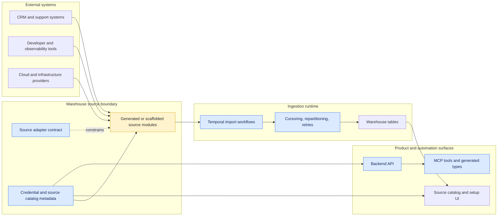
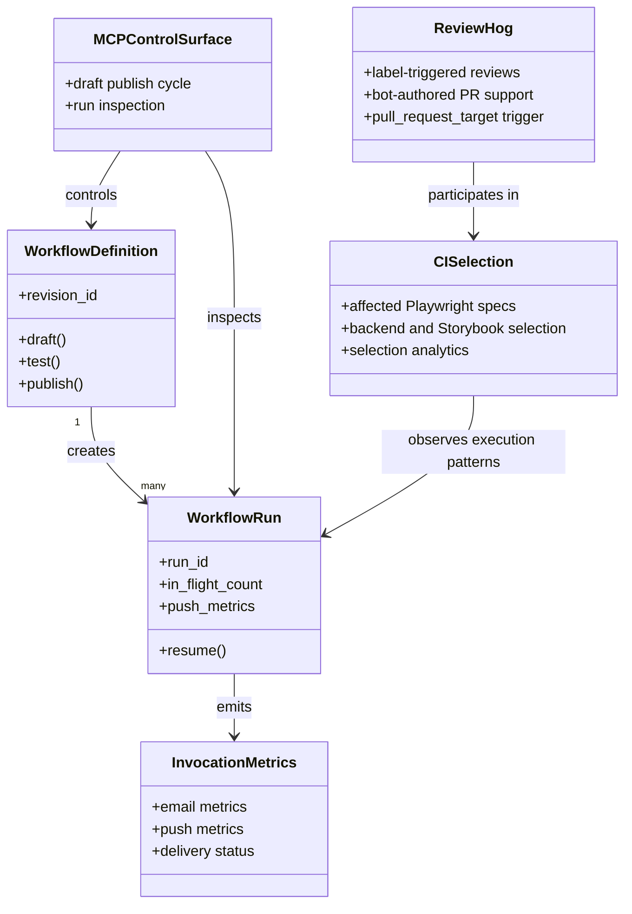
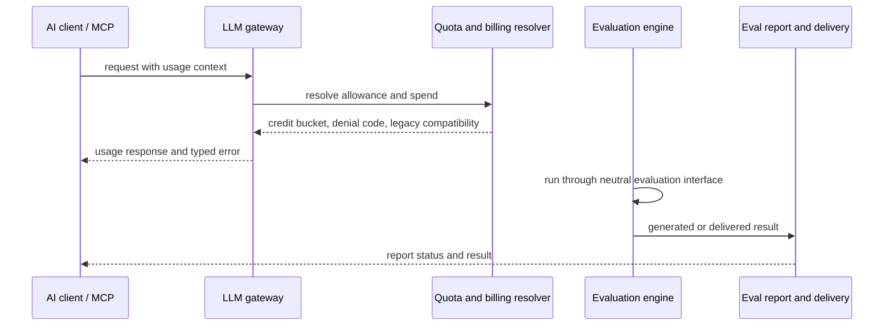
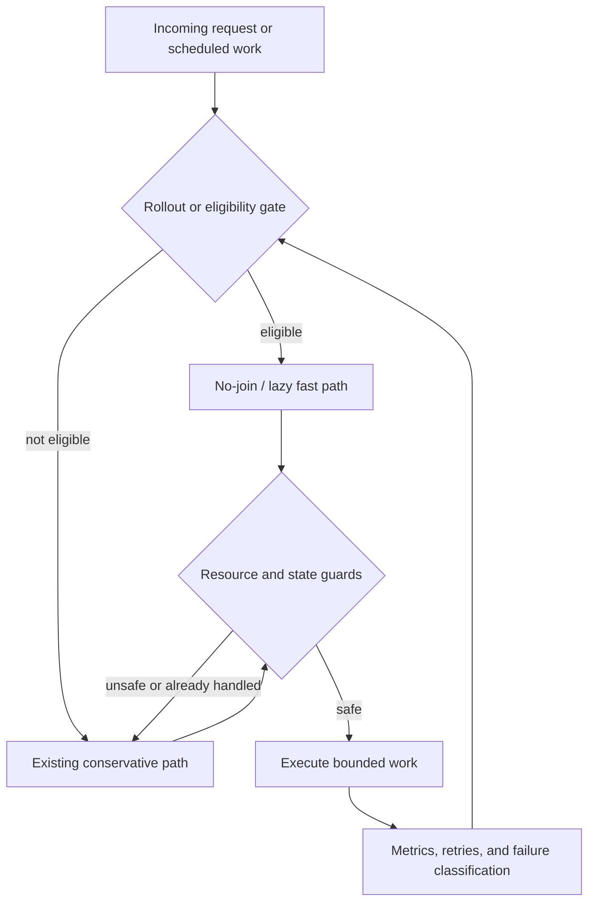
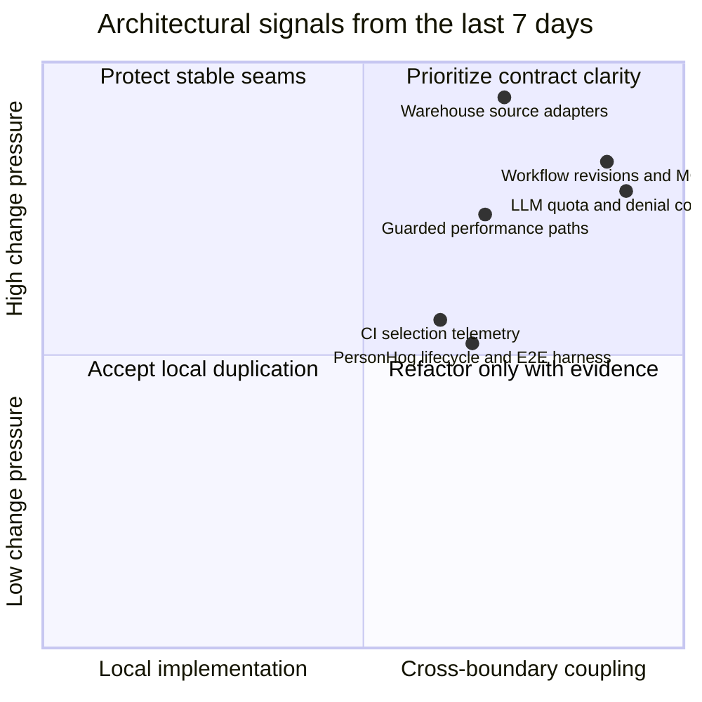

# Architecture changes in the last 7 days

**Window:** July 9–16, 2026 (UTC)
**Lens:** merged pull requests, summarized at system and architectural boundaries
**Source:** GitHub merge history for `PostHog/posthog`

This is intentionally not a changelog of methods or lines of code. It highlights changes that alter system boundaries, execution models, data movement, rollout strategy, or operational feedback loops.

> **Reading note:** the GitHub search result is capped at 1,000 pull requests in this window. The diagrams therefore focus on recurring architectural themes and representative pull requests, not an exhaustive inventory.

## Executive view

The dominant architectural movement is **scaling breadth through existing seams** rather than introducing many new product boundaries:

- Data warehouse source coverage is expanding rapidly through repeated adapter implementations and a large source-stub scaffold.
- Workflows, ReviewHog, CI, and MCP are converging into a more observable, revision-aware execution platform.
- AI and LLM changes are moving billing, evaluation, and delivery state into explicit contracts instead of implicit behavior.
- Performance work is increasingly rollout-controlled: no-join paths, repartition guards, concurrency bounds, and resource caps are being made safe to expand.

## 1. The largest expansion: warehouse adapters

**What changed:** the week contains a broad run of source additions, including a large scaffold for engineering and support sources, a batch release of implemented sources, and follow-on sources such as dbt, DeepSource, Customerly, Raygun, Prefect Cloud, Packagist, Kandji, Rapid7 InsightVM, XMatters, and Kong Konnect. Representative changes: [#71137](https://github.com/PostHog/posthog/pull/71137), [#70791](https://github.com/PostHog/posthog/pull/70791), [#71227](https://github.com/PostHog/posthog/pull/71227), and [#71242](https://github.com/PostHog/posthog/pull/71242).

**Complexity signal:** this is healthy duplication when each adapter is a thin implementation of a stable contract. It becomes architectural drag if source-specific behavior leaks into shared Temporal, credential, repartition, or UI code. The important seam to protect is the adapter contract, not the number of adapter files.

**Watch next:** keep source onboarding declarative or scaffold-driven where possible, and make divergence visible through contract tests. Avoid prematurely forcing every vendor into a single abstraction when pagination, rate limits, and incremental cursors genuinely differ.

## 2. Workflows are becoming a revisioned control plane

**What changed:** workflow revisions, draft/test/publish behavior, in-flight run visibility, push and email metrics, MCP exposure, and resumable reruns all moved closer to one explicit execution model. Representative changes: [#70823](https://github.com/PostHog/posthog/pull/70823), [#70860](https://github.com/PostHog/posthog/pull/70860), [#70796](https://github.com/PostHog/posthog/pull/70796), [#71078](https://github.com/PostHog/posthog/pull/71078), and [#70792](https://github.com/PostHog/posthog/pull/70792).

ReviewHog and CI changes extend the same trend: automation is moving from a single trigger into a staged, observable control flow. See [#71349](https://github.com/PostHog/posthog/pull/71349), [#71308](https://github.com/PostHog/posthog/pull/71308), and [#71304](https://github.com/PostHog/posthog/pull/71304).

**Complexity signal:** the system now has several state machines that can interact: workflow definition state, run state, delivery state, review state, and CI selection state. The risk is not repetition in individual handlers; it is ambiguous ownership of transitions and duplicated “is this runnable?” rules.

**Watch next:** define transition ownership and durable event contracts. Prefer one canonical run/revision model with projections for MCP, UI, and analytics instead of independently reconstructing state in each surface.

## 3. AI observability and LLM gateway contracts are becoming explicit

**What changed:** LLM usage responses now expose organization credit-bucket spend, billing denial codes, legacy-client compatibility, and subscription usage semantics. In parallel, the evaluation engine is being made swappable behind neutral interfaces and target-less reports gain an explicit generated state. Representative changes: [#71404](https://github.com/PostHog/posthog/pull/71404), [#71343](https://github.com/PostHog/posthog/pull/71343), [#71315](https://github.com/PostHog/posthog/pull/71315), [#70827](https://github.com/PostHog/posthog/pull/70827), and [#71243](https://github.com/PostHog/posthog/pull/71243).

**Complexity signal:** billing semantics cross the EE API, gateway service, generated MCP types, and client compatibility layer. That is justified coupling at a product boundary, but it creates a duplication smell when each layer invents its own names, defaults, or denial taxonomy.

**Watch next:** keep usage and denial schemas canonical, version them deliberately, and generate downstream types from the contract. Treat “legacy shim” code as a migration boundary with an exit condition, not a second permanent API.

## 4. Performance work is shifting toward guarded execution paths

**What changed:** Web Analytics no-join computation moved through percentage rollout and UUIDv7 eligibility checks; warehouse repartitioning gained guards against corruption-revive and repeated OOM work; symbol-set cleanup was paced and parallelized; session replay score exports were concurrency-bounded; and task streams were capped to contain Redis memory. Representative changes: [#70906](https://github.com/PostHog/posthog/pull/70906), [#71115](https://github.com/PostHog/posthog/pull/71115), [#71265](https://github.com/PostHog/posthog/pull/71265), [#71393](https://github.com/PostHog/posthog/pull/71393), [#71121](https://github.com/PostHog/posthog/pull/71121), and [#71302](https://github.com/PostHog/posthog/pull/71302).

**Complexity signal:** the repeated pattern is good engineering: introduce a faster path, gate it, bound its resources, and retain a safe fallback. Complexity rises when the same eligibility, retry, or “already completed” logic is reimplemented in multiple products.

**Watch next:** consolidate rollout and guard semantics at shared infrastructure boundaries where they are truly identical. Keep product-specific eligibility rules local when they encode different correctness constraints.

## Architectural risk summary

### Signals worth carrying forward

| Area | Signal | Interpretation | Suggested response |
| --- | --- | --- | --- |
| Warehouse sources | Many similar source modules and scaffolds | Likely healthy repetition at the vendor boundary; risk of drift in shared plumbing | Strengthen adapter contracts and contract tests before adding deeper abstraction |
| Workflows and ReviewHog | More states, triggers, and projections across systems | State-machine complexity is increasing | Make transitions and durable events explicit; avoid duplicated state reconstruction |
| LLM gateway | Usage, quota, denial, and compatibility semantics span services | Boundary contract is becoming a critical dependency | Keep one canonical schema and an explicit deprecation path |
| Performance paths | Rollouts, guards, retries, and caps recur across products | Good safety pattern, but policy duplication may emerge | Share generic guard/rollout infrastructure only where semantics match |
| CI and developer tooling | Test selection and execution are becoming measurable | Feedback loop is strengthening | Use the telemetry to remove unnecessary CI indirection, not to add more dashboards |
| PersonHog | Lifecycle ordering and an end-to-end harness are evolving together | Operational correctness is being formalized | Keep shutdown phases and harness scenarios aligned with a documented lifecycle |

## Bottom line

The week’s architectural story is **more capability through existing boundaries, with increasing pressure on those boundaries to stay explicit**. The highest-value follow-up is not a broad refactor. It is contract hygiene:

1. Keep warehouse adapters thin and testable.
2. Give workflow, review, and delivery state one clear transition model.
3. Canonicalize LLM usage and denial contracts.
4. Reuse safety mechanics for rollouts and resource bounds without erasing meaningful product differences.

That approach preserves the useful duplication that keeps vendor integrations and product behavior understandable while targeting duplication that would cause semantic drift.
