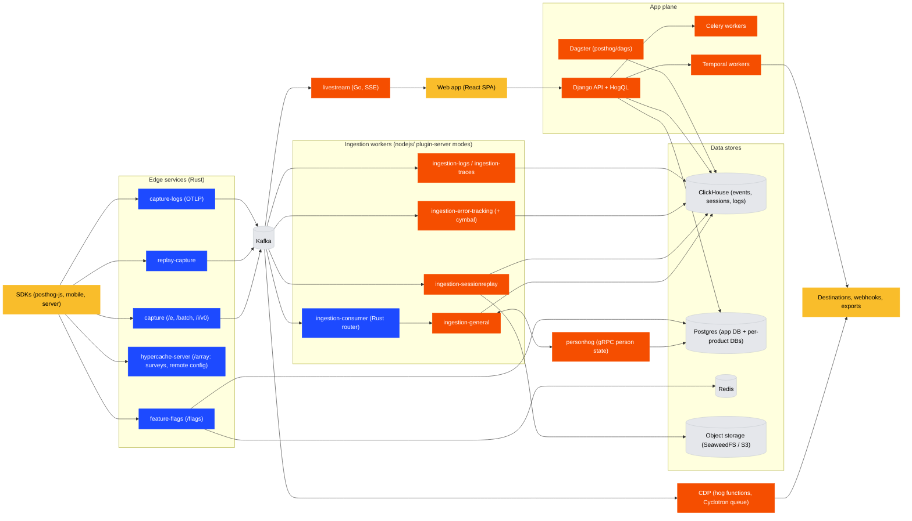

# Architecture overview

[Monorepo layout](monorepo-layout.md) covers where code lives in the repo.
This doc covers what actually runs and how data flows between services.
It is a map, not a spec: when in doubt, the compose files (`docker-compose.base.yml`, `docker-compose.dev.yml`) and `hogli.yaml` are the source of truth for what runs.

## The big picture

PostHog is three planes sharing a handful of data stores:

1. **Ingestion plane** (the hot path): SDKs write events through Rust edge services into Kafka, Node.js workers process them into ClickHouse.
2. **App plane**: the React SPA talks to the Django API, which compiles HogQL and queries ClickHouse and Postgres.
3. **Async plane**: Celery (short tasks), Temporal (durable workflows: batch exports, warehouse syncs, experiments), and Dagster (scheduled data jobs) do everything that is not a request.

## Event ingestion (hot path)

1. SDK sends events to the Rust `capture` service (in dev, a Caddy proxy routes `/e`, `/batch`, `/capture`, `/i/v0/*` to it).
2. `capture` validates, applies quota limiting, and produces to Kafka (`events_plugin_ingestion`, with overflow, historical, and DLQ topics).
3. The Rust `ingestion-consumer` reads Kafka and routes events to Node.js ingestion workers over HTTP, sticky by `token:distinct_id`.
4. `ingestion-general` (a `nodejs/` plugin-server mode) resolves persons and groups via the personhog gRPC services, runs the ingestion pipeline, and writes to ClickHouse.
5. `property-defs-rs` consumes the ClickHouse events topic and maintains property and event definitions in Postgres.

The same Rust `capture` binary runs in three modes: analytics capture, `replay-capture` (session recordings), and `capture-ai` (LLM events, which also writes blobs to object storage).

## Query path

Browser (Kea logics, typed queries from `~/queries/schema`)
→ Django REST API (`posthog/api/`, products register routes via `products/<name>/backend/routes.py`)
→ HogQL (`posthog/hogql/` parse, resolve, print; `posthog/hogql_queries/` query runners)
→ ClickHouse, with query results cached (`posthog/hogql_queries/query_cache*.py`).

Frontend API types are generated from Django serializers (drf-spectacular → OpenAPI → Orval), and MCP tool schemas are generated from the same OpenAPI spec.

## Session replay

SDK → `replay-capture` → Kafka → `ingestion-sessionreplay` (Node) → blobs in object storage (SeaweedFS, `SESSION_RECORDING_V2_S3_*`) plus metadata in ClickHouse.
A separate `recording-api` Node service serves playback.

## CDP and destinations

Hog functions (`products/cdp/`) execute inside the Node plugin-server, backed by Cyclotron, a Postgres-based durable job queue (Rust core with Node bindings, cleaned up by `cyclotron-janitor`).

## Async work: which queue to use

| System | Use for | Lives in |
| --- | --- | --- |
| Celery | Short, best-effort tasks (cache warming, emails, small computations) | `posthog/tasks/`, `products/*/backend/tasks/` |
| Temporal | Durable, multi-step, retryable workflows (batch exports, warehouse syncs, experiments, error tracking jobs). Payloads are capped around 2 MiB, so pass references, not data | `products/*/backend/temporal/`, worker via `manage.py start_temporal_worker` |
| Dagster | Scheduled data jobs against ClickHouse (backfills, deletions, materialized columns) | `posthog/dags/` |
| Kafka consumer | Per-event processing at ingestion scale | `nodejs/` (plugin-server modes) or a Rust service |

## Code to runtime mapping

| Directory | What it deploys |
| --- | --- |
| `posthog/` + `frontend/` + `products/` | The main image (`Dockerfile`): Django web, Celery workers, Temporal Django worker, static frontend |
| `nodejs/` | One image (`Dockerfile.node`), many services selected via `PLUGIN_SERVER_MODE` (ingestion, replay, error tracking, logs, traces, CDP, recording API) |
| `rust/` | One Cargo workspace (~60 crates), one parameterized Dockerfile per binary: capture, feature-flags, personhog, cymbal, cyclotron, kafka tooling, and more |
| `livestream/` | Go SSE service for the live events view |
| `services/` | Independently deployed services owned by no single product: MCP server, LLM gateway, agent proxy, OAuth proxy, Stripe app |
| `posthog/dags/` | Dagster Cloud code location (`dagster_cloud.yaml`) |

## Data stores

| Store | Role |
| --- | --- |
| Postgres | App state (Django), plus per-product databases via `products/db_routing.yaml`, person data (via personhog only), Cyclotron queues, Temporal state |
| ClickHouse | Events, sessions, logs, app metrics: everything analytical, queried through HogQL |
| Kafka | The ingestion bus between capture, workers, and ClickHouse |
| Redis | Caching, Celery broker, feature flag and remote config caches, rate limiting |
| SeaweedFS / S3 | Object storage: replay blobs, exports, source maps (MinIO is being phased out, do not add new dependencies on it) |
| Temporal (+ Elasticsearch) | Workflow orchestration and its visibility store |
| OpenSearch | LLM trace reverse index (`products/ai_observability`) |
| etcd | personhog writer coordination |
