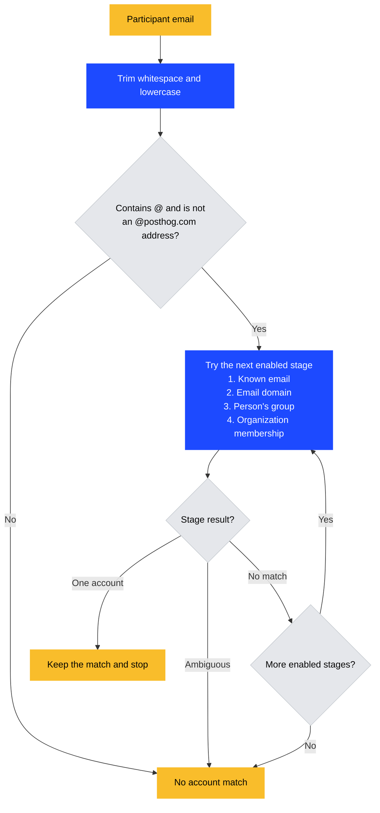

# Customer analytics email matching

The shared matcher checks each participant address in this order:

1. The account's `known_emails` property.
2. The account's `email_domains` property.
3. The person's associated group.
4. Organization membership, when the Gmail owner's staff-only account member search is enabled.

A known email overrides a domain assignment.
A unique domain assignment takes priority over person groups and organization membership, including ambiguous results from those later sources.
Direct email matching and calendar matching skip organization membership.

The first match wins for each address.
No match allows the next step.
An ambiguous result stops matching for that address.
For example, if two accounts claim a domain, the matcher does not use a person group to choose between them.
Use `known_emails` to assign individual addresses on shared domains.

## Matching flow

This flow runs independently for each participant address.
Skip person-group matching when no account group type is configured.
Skip organization membership unless one active Gmail owner passes the staff and feature-flag checks.

Ambiguity stops all later stages for that address.
A lookup error can fail the task instead of allowing fallback.

## Thread links

Each participant can match a different account.
When several participants match the same account, the thread keeps one link with the highest-priority source from the order above.
A recalculation replaces the thread's account links and removes stale links without deleting messages.

Deployment alone does not recalculate existing links.
After deployment, use `schedule_email_thread_link_recalculation(team_id)` from `products.customer_analytics.backend.facade.email_matching` to update an affected project.
Check that a unique domain assignment wins over a competing group or membership match, while a known email still overrides the domain.
Calendar rematching processes only meetings without an account; it does not replace existing assignments.

## Unchanged safeguards

Addresses are trimmed and lowercased before matching.
The exact `@posthog.com` suffix is excluded before all steps.
The person-group lookup uses the project's configured account group type.
The organization-membership step keeps its existing Gmail-owner gate and local-region lookup; it does not query EU membership data from the US.
