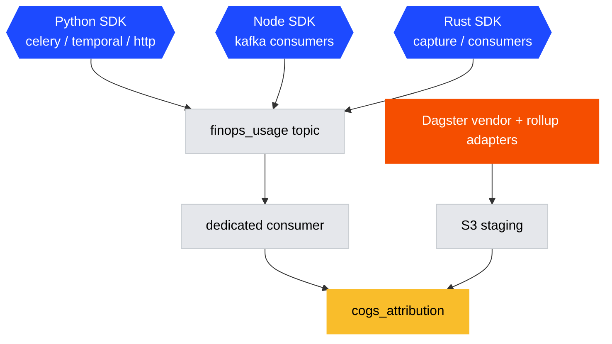

# FinOps attribution: implementation spec

Status: draft for discussion.
Companion to the [FinOps attribution pipeline RFC](https://github.com/PostHog/requests-for-comments-internal/pull/1210).

This document is a spec, not an implementation.
The RFC covers the "what" and the ClickHouse schema.
This covers the "how" inside the `posthog` monorepo, and it deliberately concentrates on the one part the RFC leaves open: **how in-product usage attribution gets emitted in a standardized way across a codebase that spans Python, Node, and Rust and runs work in Kafka consumers, Celery tasks, Temporal activities, Postgres, ClickHouse, and HTTP handlers.**

The goal is to make emitting a `finops.usage` record feel the same everywhere, so that adding attribution to a new chokepoint is a few lines against a shared helper rather than a bespoke integration each time.

## What this covers and what it doesn't

In scope:

- The standardized usage contract (one envelope, one taxonomy, shared across all languages).
- A small usage SDK per language, each with the same shape.
- How that SDK attaches to the **global instrumentation seams that already exist** in each subsystem, so coverage is close to automatic rather than opt-in per call site.
- The transport and the pipeline that lands records in `cogs_attribution`.

Out of scope (owned by the RFC or by follow-up specs):

- Vendor cost batch adapters (AWS CUR, Temporal, WarpStream, AI vendors).
  Those are Dagster jobs and are sketched only where they intersect the shared table.
- The final `cogs_attribution` column set.
  This spec assumes the RFC's schema and focuses on how rows get written.
- Revenue and margin views.

## The core idea: we already have this pattern, we just need to generalize it

PostHog already runs a mature, standardized attribution system for one cost source: ClickHouse queries.
It is `posthog/clickhouse/query_tagging.py`.
It is worth studying closely because the FinOps system is the same shape applied to more cost sources, and the RFC already credits it as the inspiration for the schema.

What `QueryTags` gets right, and what we should copy:

- **A single canonical taxonomy.**
  One `Product` enum and one `Feature` enum, shared by every call site.
  Nobody invents their own product strings.
- **Context propagation, not argument threading.**
  Tags live in a `contextvars.ContextVar` (`query_tags`) with copy-on-write updates.
  Code deep in a call stack can attribute work without every intermediate function passing a context object.
- **Constant tags stamped once.**
  `git_commit`, `container_hostname`, `service_name` are attached at context creation (`create_base_tags`), so every record self-describes where it came from.
- **Attach at the execution seam, not the call site.**
  Tags are serialized into `system.query_log.log_comment` inside `sync_execute` (`posthog/clickhouse/client/execute.py`).
  Individual queries don't emit anything, the one funnel every query passes through does.
- **Fallback inference.**
  `add_fallback_query_tags` derives product from scene, query kind, or query structure when a call site didn't set it explicitly, so coverage stays high without perfect discipline.
- **Enforcement.**
  In dev and test, `sync_execute` raises `UntaggedQueryError` when `product` or `feature` is missing.
  That is why ClickHouse attribution coverage is near total today.

The FinOps usage system is `QueryTags` generalized from "tag the ClickHouse query" to "emit a usage record for any unit of billable work."
Everything below is an application of these six properties to the other chokepoints.

## The standardized contract

One envelope, defined once per language from a shared definition, matching the RFC's `finops.usage` shape.
The fields below are the attribution key plus the measured quantity.
They map directly onto `cogs_attribution` columns so the pipeline is a projection, not a translation.

```text
finops.usage {
  # Attribution key (required)
  product           string   # canonical product enum, reuse query_tagging.Product
  team              string   # owning team, kebab-case
  billable_unit     string   # canonical billable-unit enum (see taxonomy below)
  quantity          float    # count of billable units (default 1)
  environment       string   # prod-us | prod-eu | dev

  # Customer attribution (required where the work is customer-facing)
  org_id            string   # PostHog organization UUID, "" when not customer-facing

  # Recommended
  customer_team_id  int      # PostHog team/project id
  feature           string   # sub-product, reuse query_tagging.Feature
  system            string   # dependency group: clickhouse, kafka, postgres, temporal, ...
  resource_id       string   # cluster / topic / namespace / api key for drill-down
  duration_ms       float    # wall-clock of the unit of work, for cost-proportional splits
  quantity_unit     string   # bytes, rows, events, api_calls, ms, invocations

  # Stamped automatically by the SDK (the "constant tags" analog)
  service           string   # OTEL_SERVICE_NAME / PLUGIN_SERVER_MODE / lifecycle name
  git_commit        string
  hostname          string
}
```

Two taxonomy decisions make this standardized rather than a free-for-all:

1. **Reuse `query_tagging.Product` and `query_tagging.Feature`.**
   They are already the canonical enums, already generated into the frontend type system, and ClickHouse cost is already tagged with them.
   A second product enum would guarantee the two cost sources never reconcile.
   The Node and Rust SDKs consume the same list (generated, see below), they do not hand-maintain a copy.

2. **`billable_unit` extends the existing quota taxonomy, it does not fork it.**
   Node already has `QuotaResource` in `nodejs/src/common/services/quota-limiting.service.ts` (`events`, `logs_mb_ingested`, `recordings`, ...).
   Billing already enforces quotas against these.
   FinOps `billable_unit` should be a superset of that enum, so "the unit we bill for" and "the unit we attribute cost to" are the same word.

## The standardized SDK

One small library per language. Same conceptual API everywhere:

```text
emit_usage(product, billable_unit, quantity, *, org_id=None, team_id=None,
           feature=None, system=None, resource_id=None, duration_ms=None)
```

Every implementation does the same three things: (1) fill the attribution key from an ambient context where possible, (2) stamp the constant fields (service, git_commit, hostname, environment), (3) buffer into a time-bucketed in-process aggregate and flush periodically to the transport.

**Aggregation is part of the standard, not an optimization.**
A Kafka consumer that processes a million messages must not emit a million usage events.
Every SDK aggregates in-process into buckets keyed by the full attribution tuple (`product`, `billable_unit`, `org_id`, `customer_team_id`, `resource_id`, time bucket) and flushes a summed row per bucket.
This is exactly how three existing systems already work, which is the point: we are unifying them, not adding a fourth.

| Language | Model this on                                                                   | What it already does                                                                                                                     |
| -------- | ------------------------------------------------------------------------------- | ---------------------------------------------------------------------------------------------------------------------------------------- |
| Node     | `AppMetricsAggregator` (`nodejs/src/common/services/app-metrics-aggregator.ts`) | dedupes rows by `(team_id, app_source, metric_kind, metric_name)`, `queue()` + `flush()` to a named Kafka output                         |
| Rust     | `BillingAggregator` (`rust/feature-flags/src/billing/aggregator.rs`)            | per-pod aggregation keyed by `(team_id, request_type, library, time_bucket)`, synchronous `record()` on the hot path, background flusher |
| Python   | `QueryTags` contextvar + `ph_scoped_capture` (`posthog/ph_client.py`)           | context propagation; forced-flush capture client that is safe inside short-lived workers                                                 |

### Python: `posthog/finops/`

Mirror `query_tagging` directly.
A `usage_context` contextvar holds an ambient `UsageContext` (product, feature, org_id, team_id, ...), a `tag_usage(**kwargs)` copy-on-write setter, and a `tags_usage_context()` context manager for scoping.
`emit_usage(...)` reads the ambient context to fill anything the caller didn't pass, buffers into a process-global aggregator, and a flush hook drains it.

Transport depends on where the code runs, and this is the one place the standard bends:

- In-request and long-lived processes: buffer and let a background flush push to the dedicated capture path.
- Short-lived workers (Celery task, Temporal activity): the aggregator must be drained synchronously before the process/worker can exit, using the `ph_scoped_capture()` forced-flush client.
  A bare `posthoganalytics.capture()` silently loses events when a Celery worker exits right after the task, which the `ph_client` docstring already warns about.
  The SDK hides this: callers always call `emit_usage(...)`, the SDK picks the drain strategy from the runtime.

### Node: `nodejs/src/common/services/finops-usage.ts`

A `UsageAggregator` class shaped like `AppMetricsAggregator`: `queue(record)` dedupes into a Map keyed by the attribution tuple, `flush()` serializes and calls `outputs.queueMessages(FINOPS_USAGE_OUTPUT, messages)`.
Add a `FINOPS_USAGE_OUTPUT` constant to `nodejs/src/common/outputs/index.ts` and register it in each pipeline's outputs registry.
Steps and consumers take `IngestionOutputs<FinopsUsageOutput>` as a dependency, exactly as they do for `INGESTION_WARNINGS_OUTPUT` today.
They never touch the raw `KafkaProducerWrapper`.

Service identity (`service`, `environment`) comes from `defaultConfig` (`PLUGIN_SERVER_MODE`, `CLOUD_DEPLOYMENT`, `OTEL_SERVICE_NAME`).
This is the same tuple `initSuperProperties()` already assembles in `nodejs/src/common/utils/posthog.ts`, so a shared "runtime identity" helper reused by both is the clean move rather than assembling it a fifth time.

### Rust: `rust/common/finops/`

A new crate, sibling to `common/metrics` and `common/kafka`.
A `UsageAggregator` modeled on `feature-flags::billing::BillingAggregator`: synchronous `record()` on the hot path into a lock-scoped bucket map, a background flusher task that serializes and produces onto the `finops_usage` topic via `common/kafka`'s `send_keyed_iter_to_kafka`.
Service identity reuses the `ServiceContext { service, pod, region }` pattern already in `rust/common/posthog/src/lib.rs`.

## Standardized chokepoint integration

This is the part that matters for "make it standardized."
The insight from `QueryTags` is: **do not instrument call sites, instrument the one seam every unit of work passes through.**
Every subsystem in the repo already has such a seam, put there for metrics or tracing.
We attach usage emission to that same seam.

| Chokepoint                   | Existing global seam                                                           | Where usage emission attaches                                                                                                         |
| ---------------------------- | ------------------------------------------------------------------------------ | ------------------------------------------------------------------------------------------------------------------------------------- |
| Node Kafka consumer          | the `eachBatch` callback passed to `createKafkaConsumer(...).connect(...)`     | fold into the `backgroundTask` the batch handler returns, next to where `logs-ingestion-consumer.ts` already calls `emitUsageMetrics` |
| Rust Kafka consumer          | `SingleTopicConsumer::recv_with` (`rust/common/kafka/src/kafka_consumer.rs`)   | per-consumed-message hook, or per-service decode loop where `team_id` is known                                                        |
| Rust capture (producer side) | `KafkaSinkBase::prepare_record` (`rust/capture/src/sinks/kafka.rs`)            | per-event, has topic + `DataType` + serialized byte size already                                                                      |
| Celery task                  | `task_postrun` signal (`posthog/celery.py`)                                    | reads `product`/`feature` off the ambient context, emits one record per task, 100% coverage with no per-task opt-in                   |
| Temporal activity            | interceptor in `ALL_INTERCEPTOR_CLASSES` (`posthog/temporal/common/worker.py`) | a `FinOpsUsageInterceptor` wrapping `execute_activity`, `task_queue = ALL_TASK_QUEUES`                                                |
| Postgres                     | `PostgresRouter.query(...)` tag (Node), Django connection wrapper (Python)     | per-query counter keyed by the existing `tag` string                                                                                  |
| ClickHouse                   | `sync_execute` `log_comment` (already done)                                    | no new emission, route the existing `query_log_archive` rollup into `cogs_attribution`                                                |
| HTTP request                 | `CHQueries` middleware (`posthog/middleware.py`)                               | emit on the `finally` boundary that already resets tags                                                                               |
| Dagster op/asset             | none today                                                                     | needs a new shared op hook, see gaps                                                                                                  |

### Kafka consumers allocating usage (the headline case)

Both Node and Rust consumers share one shape: a batch of messages arrives, gets processed, and the consumer already knows per-team quantities by the end of the batch.
The usage call slots in right there.

Node already has a fully worked example of exactly this in `nodejs/src/logs/logs-ingestion-consumer.ts`.
It builds a `UsageStatsByTeam` map during batch processing and calls `emitUsageMetrics(usageStats)` inside the `backgroundTask` returned from the batch handler, so emission never blocks offset commit:

```ts
public async processBatch(messages): Promise<{ backgroundTask?; messages }> {
    const usageStats = this.trackOutgoingTrafficAndBuildUsageStats(allowed, dropped)
    return {
        backgroundTask: (async () => {
            await this.processAndProduceLogMessages(allowed, usageStats)
            // today: bespoke app_metrics2 rows. under this spec: one shared call.
            for (const [teamId, stats] of usageStats) {
                usage.emitUsage({
                    product: Product.LOGS,
                    billableUnit: "logs_mb_ingested",
                    quantity: stats.bytesAllowed / 1_000_000,
                    teamId,
                    system: "kafka",
                    resourceId: this.topic,
                })
            }
            await usage.flush()
        })(),
        messages: allowed,
    }
}
```

The standardization move is to promote this pattern out of `LogsIngestionConsumer` into the shared `UsageAggregator`, so every other consumer (`ingestion-consumer.ts`, the CDP consumers, the metrics and error-tracking consumers) does the identical thing without reimplementing the buffering, the flush, and the offset-safe placement.

In Rust the same allocation happens either uniformly inside `SingleTopicConsumer::recv_with` (a byte-size and latency hook for every message on every consumer built on it) or, where per-team attribution is needed, at the decode point in the service loop where `team_id` is in hand, for example `property-defs-rs`'s producer loop right after `consumer.json_recv()` yields an `Event`.

For the capture producer side, `prepare_record` is the natural per-event point: it already has the topic, the `DataType` (which classifies analytics vs replay vs AI vs error-tracking, a natural `product`/`billable_unit` axis), and the serialized payload size for a byte-denominated quantity.

### Postgres usage

Node routes every query through `PostgresRouter.query(target, sql, values, tag)` in `nodejs/src/common/utils/db/postgres.ts`, which already tags each query with a string embedded as a SQL comment and wraps it in an OTel span keyed by that tag.
The standardized hook is a per-query usage increment keyed by the same `tag`, layered where `withSpan` already wraps the call, so we get Postgres attribution for free wherever the router is used.

The nuance to spell out: per CLAUDE.md, person and group tables must go through the personhog gRPC client, not the ORM, so a chunk of the heaviest Postgres load is already behind a different seam.
Postgres attribution therefore needs two hooks, one on `PostgresRouter` and one inside the personhog client, and they should emit into the same `system: "postgres"` bucket so the totals reconcile against the RDS bill regardless of which access path produced the load.

On the Python side there is no single query funnel as clean as `sync_execute`, but Django exposes `connection.execute_wrapper`, which is the equivalent seam: a wrapper installed once that sees every ORM query and can attribute by the ambient `usage_context`.

### Celery and Temporal

Both already stamp `QueryTags` globally, which means the product and feature attribution the usage SDK needs is often already set by the time the work finishes.

Celery has a global `task_prerun`/`task_postrun` signal pair in `posthog/celery.py` that fires for every task with no opt-in.
`task_prerun` already calls `tag_queries(kind="celery", id=task.name)`.
The usage emission attaches to `task_postrun`, which already computes task duration and calls `reset_query_tags()`.
It reads `product`/`feature` off the ambient context (set by the task body, or defaulted via a task-name to product registry that parallels `SCENE_TO_TAGS`) and emits one record for the task's wall-clock time.
This gives blanket coverage of every Celery task from a single place.

Temporal has an interceptor layer (`ALL_INTERCEPTOR_CLASSES` in `posthog/temporal/common/worker.py`).
Product teams already add per-product metrics interceptors there.
A `FinOpsUsageInterceptor` with `task_queue = ALL_TASK_QUEUES` wrapping `execute_activity` gives one usage record per activity execution, measured over the whole activity rather than only the ClickHouse queries inside it.
This is the seam the RFC means by "Temporal hooks," and it fixes the exact problem the RFC calls out about the earlier Prometheus-counter attempt in the Replay Vision split not scaling to high cardinality: a bucketed aggregate flushed to Kafka handles cardinality that Prometheus labels cannot.

### ClickHouse is already solved, just route it

ClickHouse cost attribution already exists end to end.
`sync_execute` stamps the full `QueryTags` into `log_comment`, and `posthog/clickhouse/query_log_archive.py` mirrors `system.query_log` into `query_log_archive` with curated `lc_*` columns (`lc_team_id`, `lc_product`, `lc_feature`, `lc_chargeable`), rolled up daily by team, product, and query kind and exported to S3 by a Dagster job.
This is the closest thing in the repo to the RFC's hypothetical `transform_clickhouse_query_load` (which does not exist yet).

So ClickHouse needs no new emission.
It needs a batch adapter, alongside the vendor adapters, that reads the daily `query_log_archive` rollup, multiplies by a CPU-and-IO cost coefficient derived from the cluster's cloud bill, and writes `cogs_attribution` rows with `allocation_method = 'direct'` (per-query attribution) or `'proxy_metric'` (CPU-share split of the cluster bill).
This is the model for every "we already have good usage data" source, including AI Gateway.

## Transport and the pipeline

Two write paths land in `cogs_attribution`, matching the RFC.

### Path 1: streaming `finops.usage` events

Follow the AI ingestion pipeline model (the [prior RFC](https://github.com/PostHog/requests-for-comments-internal/pull/1111), already built in code).
The reason the AI pipeline was split from main events applies here almost verbatim: FinOps usage is non-customer-facing, must never add head-of-line blocking to customer event ingestion, and has a completely different shape from analytics events.
So it gets its own lane:

- A dedicated Kafka topic (`finops_usage`), not the main analytics input topic.
- A dedicated consumer group that reads it and writes to ClickHouse.
- Its own scaling and lag characteristics, independent of customer ingestion.

Because the SDK aggregates in-process before producing, the event volume on this topic is per-bucket-per-pod-per-flush-interval, not per-unit-of-work.
That is orders of magnitude smaller than raw events and is what makes streaming attribution affordable.
This is the same durability tradeoff `BillingAggregator` and `AppMetricsAggregator` already accept: a pod crash loses at most one unflushed bucket window.

For low-frequency Python chokepoints (a Celery task completes, a Temporal activity finishes) the volume is low enough that emission can also go through the existing dogfood capture path via `ph_scoped_capture`, and a normal ingestion transform routes `finops.usage` into the same ClickHouse table.
The SDK abstracts which transport is used, callers don't choose.

### Path 2: batch vendor and rollup adapters

Scheduled Dagster jobs, one adapter per source, each: fetch, transform via a source-specific adapter, split attribution, write JSONL to S3 staging, and have ClickHouse ingest into `cogs_attribution`.
This is the RFC's vendor path plus the ClickHouse and AI Gateway rollups described above.
The repo already has the Dagster building blocks: multi-code-location `Definitions` under `posthog/dags/locations/`, a `ClickhouseClusterResource`, and the `INSERT INTO FUNCTION s3(...)` export idiom in `posthog/dags/export_query_log_archive_to_s3.py`.
`marketing_costs_preaggregated` (`posthog/clickhouse/preaggregation/marketing_costs_sql.py`) is the closest existing table, a sharded plus distributed batch-populated cost cache, and is the best template for the streaming-free parts of `cogs_attribution`.

### The table

`cogs_attribution` is net-new.
Define it following the repo's standard: a `sql.py` module, register its `*_TABLE_SQL` functions in `posthog/clickhouse/schema.py`, add a sequential migration under `posthog/clickhouse/migrations/` (via the `/clickhouse-migrations` skill), and use the engine builders in `posthog/clickhouse/table_engines.py` rather than hand-writing `Replicated*`.
The RFC proposes `ReplacingMergeTree` for idempotent re-runs, which fits the batch adapters.
The streaming path can write to the same table through a Kafka engine plus materialized view, following the `app_metrics2` pattern (`posthog/models/app_metrics2/sql.py`), or land in a staging table the batch job merges, depending on how strict the idempotency guarantee needs to be.
That is an open decision below.



## Attribution and allocation model

Every row carries an `allocation_method` so the coverage scorecard in the RFC can distinguish real attribution from filler:

- `direct`: the work names its own product (a Kafka consumer that only serves one product, a tagged ClickHouse query).
- `proxy_metric`: cost of a shared resource split by a measured usage ratio (split a cluster bill by per-product CPU share from `query_log_archive`).
- `volume_ratio`: split by a coarser volume ratio when no per-unit metric exists.
- `residual`: unallocated. The remainder of a vendor bill that no rule claimed.

The residual bucket is not a failure mode, it is a required output.
The RFC's success criteria are that attributed plus residual equals the actual bill, and that residual trends down over time.
The SDK and the batch adapters must always emit the residual explicitly rather than dropping unattributed cost, or the totals silently stop reconciling with the vendor invoice.

## Coverage and correctness enforcement

The reason ClickHouse attribution is near total is the `UntaggedQueryError` guard.
The FinOps system should borrow the same idea, scaled to each chokepoint:

- A dev/test assertion when `emit_usage` is called without a resolvable `product`, analogous to `UntaggedQueryError`.
  Loud in CI, non-fatal in prod (attribute to `residual`, never crash a consumer over attribution).
- A coverage scorecard view (in the RFC) that reports the residual share per source per month, so gaps are visible and can be driven down.
  This is the primary success metric.
- A reconciliation check per vendor: sum of `cogs_attribution` for a period must equal the ingested vendor bill for that period.
  A mismatch means an adapter dropped or double-counted, and should page.

## Suggested phasing

1. Land the `cogs_attribution` table and the ClickHouse and AI Gateway batch adapters.
   These use data that already exists (`query_log_archive`, AI cost columns), so they deliver a working coverage scorecard before any new emission code ships.
2. Land the vendor batch adapters (AWS CUR, Temporal, WarpStream).
   Now the table reconciles against real bills and residual is measurable.
3. Ship the Python SDK and wire the Celery and Temporal seams.
   These are low-volume and cover a large surface from two central hooks, so they are the cheapest streaming coverage to buy.
4. Ship the Node SDK and wire the Kafka consumer seam, starting by refactoring the existing `logs-ingestion-consumer` usage emission onto the shared helper (proving the abstraction against working code) then extending to the other consumers.
5. Ship the Rust SDK and wire the capture producer and consumer seams.
6. Add Postgres attribution (Node `PostgresRouter` plus personhog client, Python `execute_wrapper`).

Each phase is independently useful and independently reversible.

## Open decisions

- **Streaming idempotency.**
  Kafka-engine plus materialized view straight into `cogs_attribution` (like `app_metrics2`) is simplest but makes exactly-once harder to reason about against the batch adapters' `ReplacingMergeTree` re-runs.
  A staging table the batch job merges is stricter but adds a hop.
  Pick one before writing the table.
- **Dagster auto-hook.**
  Celery and Temporal have global seams. Dagster ops do not, they call `settings_with_log_comment(context)` by hand today.
  Either accept manual `emit_usage` calls in ops, or build a shared Dagster op hook.
  The latter is more work but keeps Dagster attribution as automatic as the others.
- **Taxonomy generation.**
  `Product` and `Feature` live in Python and are generated into the frontend types.
  The Node and Rust SDKs need the same enums.
  Decide whether to extend the existing codegen to emit a TS and a Rust copy, or to publish the enum as a small shared artifact both consume, so the three languages never drift.
- **Where the SDKs live.**
  Python under `posthog/finops/`. Node under `nodejs/src/common/services/`. Rust as a new `rust/common/finops` crate.
  If FinOps becomes a first-class product as the RFC envisions, these may later move under `products/finops/`.
