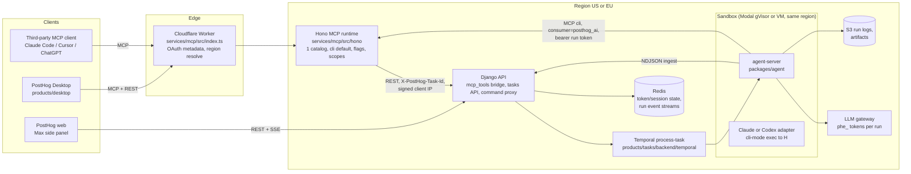
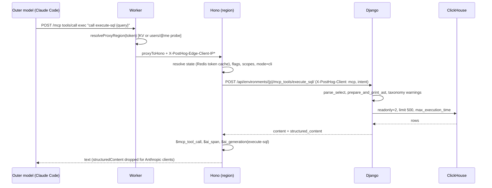
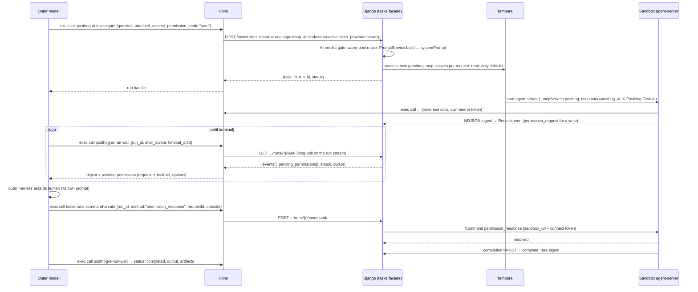
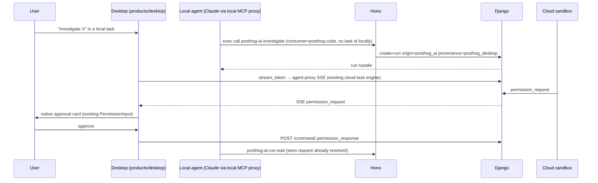

# MCP surface, PostHog AI harness, and Tasks sandbox: adversarial architecture review

Scope: `services/mcp/`, `products/posthog_ai/`, `products/tasks/`, `products/mcp_analytics/`, `packages/agent/`, `products/desktop/` at `posthog/posthog@81976f68` (2026-10-01).
Read-only review. Nothing in this document was run against production.

Evidence tags: **VERIFIED** = read in code or a test at the cited path. **INFERRED** = deduced from adjacent code, tests or config. **UNVERIFIED** = not located; the search is stated in the appendix.

## Correction to the starting map, before anything else

- **PostHog/code is no longer the client's source of truth.** The clone at `PostHog/code@a4c32df` (2026-08-01) carries a README banner: "This repository has migrated to the PostHog monorepo (`products/desktop`)". VERIFIED (`/home/user/code/README.md` lines 1-3). The agent framework now lives at `packages/agent/packages/{agent,agent-contracts,harness,git,enricher}` and the Desktop/web/mobile client at `products/desktop/` in this repo. VERIFIED (`packages/agent/packages/agent/package.json` name `@posthog/agent`, version `0.0.0-dev`; `products/desktop/product.yaml`). The sandbox image installs a pinned release tarball built from this repo: `AGENT_VERSION=2.4.252`, `AGENT_TARBALL_URL=https://github.com/PostHog/posthog/releases/download/agent-v${AGENT_VERSION}/...`. VERIFIED (`products/tasks/backend/sandbox/images/Dockerfile.sandbox-base` lines 164-178). Every client-side claim below cites the monorepo path; where a line was verified only in the stale clone it is tagged INFERRED and the monorepo symbol is named.
- `products/tasks/backend/temporal/process_task/mcp_harness.py` does not exist. VERIFIED (`ls` fails; `grep -rn mcp_harness products/ ee/ posthog/` is empty).
- There is no `mcp-analytics` feature flag. The typed `query-mcp-*` wrappers are ungated; only the two intent-cluster tools are gated, by `mcp-analytics-intent-routing`. VERIFIED (`products/mcp_analytics/mcp/tools.yaml` lines 28, 47; `frontend/src/lib/constants.tsx` line 415).
- The Tasks README's "`tasks` feature flag checked in `client.py`" is stale: `products/tasks/backend/temporal/client.py` evaluates only the ingest/stream rollout flags (lines 146, 197). What gates a cloud launch is Desktop access (`code_access_required_response`, `products/tasks/backend/presentation/views/api.py` `TaskViewSet.run`). VERIFIED.
- The `services/mcp/typescript/` shim has no consumer in this repo (`grep -rIl "mcp/typescript"` is empty; `README.md` line 443 still says "consumed by posthog-ai"). It is an older fork of `src/tools/posthogAiTools/` and is outside `tsconfig` `include`. VERIFIED.

---

## 1. Baseline

### 1.1 MCP server (`services/mcp/`)

**Runtime shape.** A Cloudflare Worker (`src/index.ts`) terminates OAuth metadata and reverse-proxies `/mcp` to a regional Hono runtime (`src/proxy.ts` `resolveProxyRegion` lines 69-84: KV cache, else `users/@me` probed against US and EU in parallel, US wins ties, default `us`). Hono is regional and throws in production without `POSTHOG_API_BASE_URL` (`src/hono/request-context.ts` lines 112-125). VERIFIED. The historical Durable Object is retired (`wrangler.jsonc` `deleted_classes: ["MCP"]`). VERIFIED.

**Tool count.** 1076 catalog tools = 59 hand-written definitions + 1024 generated − 7 overlaps (hand-written wins, `src/tools/mergeToolFactories.ts`). Counted with:

```sh
node -e 'const a=require("./schema/tool-definitions.json"), g=require("./schema/generated-tool-definitions.json");
  const A=Object.keys(a), G=Object.keys(g); const ov=A.filter(k=>G.includes(k));
  console.log(A.length, G.length, ov.length, new Set([...A,...G]).size)'
# 59 1024 7 1076
```

Cross-check: `schema/tool-definitions-all.json` has 1076 keys; the 67 `src/tools/generated/*.ts` factories export 1024 unique keys. VERIFIED. Largest generated modules: ai_observability 83, customer_analytics 73, signals 70, replay_vision 58, experiments 41, warehouse_sources 31, tasks 29. Synthetic (not in the catalog): `exec` and `render-ui`, built by `InstructionsBuilder.buildExecToolEntry` / `buildRenderUiToolEntry` (`src/hono/instructions.ts`) and advertised only in single-exec mode. VERIFIED.

What a `*`-scope token actually sees in tools mode after `filterToolEntries` (`src/tools/toolDefinitions.ts`): 718 with all flags off and no AI consent; 1026 with every flag on; 381 in read-only mode. INFERRED (re-implemented the filter in node against the JSON; not run through the server). 319 definitions carry `feature_flag` across 41 distinct keys; 757 are ungated. VERIFIED (JSON count).

**Codegen.** `hogli build:openapi` → `frontend/tmp/openapi.json` → Orval Zod (`src/generated/<product>/api.ts`) → `scripts/generate-tools.ts` reads 68 YAML sources (`services/mcp/definitions/*.yaml` and `products/*/mcp/*.yaml`, discovered by `scripts/lib/definitions.mjs`) and writes `src/tools/generated/<module>.ts`, `schema/generated-tool-definitions.json`, `schema/tool-definitions-all.json`. YAML needs `enabled: true` plus `scopes`/`annotations` (`scripts/yaml-config-schema.ts`). Confirmed actions expand to `-prepare`/`-execute` pairs. VERIFIED.

**Modes.** `McpMode = 'tools' | 'cli'` (`src/lib/utils.ts` line 82); parsed from `x-posthog-mcp-mode` or `?mode=` (`src/lib/request-properties.ts` line 117). `resolveMode` (`src/hono/request-state-resolver.ts` lines 69-79): `mode ?? (clientProfile.isToolsModeClient() ? 'tools' : 'cli')`. **Default is cli (single exec) for every client; only a `clientInfo.name` or User-Agent containing `cursor` auto-selects tools mode** (`src/lib/client-detection.ts` `TOOLS_MODE_CLIENT_NAME_FRAGMENTS = ['cursor']`, lines 123-124; `isToolsModeClient` lines 268-278). The `CODING_AGENT_CLIENT_NAME_FRAGMENTS` list does not pick the mode; it only drops `structuredContent` (`isCliModeEnabled`). VERIFIED. Pinned by `tests/hono/request-state-resolver.test.ts` lines 238-300 and `tests/unit/protocol-types.test.ts`. VERIFIED (names).

The exec grammar: verbs `help`, `learn`, `tools`, `search`, `info`, `schema`, `call` (+ `--json`, `--confirm`), search capped at 800 chars, batching rejected (`src/tools/exec.ts` `EXEC_VERBS` line 283, `createExecTool` line 1636+). VERIFIED. `src/cli/*` is the standalone `posthog-cli api` binary reusing `createExecTool`, not the MCP cli mode. VERIFIED.

**Scoping.** `?features=` matches the definition `feature` field; `?tools=` is an allowlist OR-ed with features; `always_available` tools (agent-feedback, the 3 tasks-context tools) bypass both. Order after that: read-only (`x-posthog-read-only`/`?readonly=`), AI consent (fails closed), flag gate, entitlement gate (fails open), scope match (`hasScope`, `src/lib/api.ts` lines 11-32: `*` matches everything except server-mint-only objects; `:write` implies `:read`), staff filter. Server-side exclusions (`request-state-resolver.ts` lines 208-213): `switch-organization` when an org is pinned; tasks-context tools unless consumer is `posthog-code` with a task id; **`tasks-run-create` and `tasks-create-and-run` whenever the token carries `internal_run:read`**, i.e. a sandbox can never start another cloud run. Caller denylist `x-posthog-exclude-tools` (max 32, regex-validated). VERIFIED.

**Flag evaluation.** Server-side, per request, for `initialize` / `server/discover` / `tools/list` / `tools/call` (`src/hono/dispatcher.ts` line 251 → `RequestStateResolver.resolve`). Keys = `getRequiredFeatureFlags()` + `mcp-gateway` (`src/lib/constants.ts` line 44) + `mcp-exec-skills` (`src/hono/constants.ts` line 4). Evaluation is posthog-node `getAllFlags(distinctId, {flagKeys, groups})` on the same analytics client; an error yields `{}` so enable-gated tools hide (fail closed) and `disable`-behaviour tools show. `isLocalApi()` forces every flag on. Overrides only under `NODE_ENV` development/test (`src/lib/posthog/flags.ts` lines 87-95). No flag result cache in MCP code. VERIFIED. Tests: `tests/unit/tool-filtering.test.ts` lines 906-1053.

**Protocol.** Dependencies: `@modelcontextprotocol/sdk` 1.29.0, `hono` 4.12.24, `@posthog/mcp-analytics` = `npm:@posthog/mcp@0.21.2` (`package.json`, `pnpm-lock.yaml`). The SDK's transport is not used: `StreamableMcpHandler` (`src/hono/streamable-handler.ts`) is POST-only (405 otherwise), rate-limits per token (480/min, 4800/hr, `src/hono/rate-limiter.ts` lines 27, 33) and hands the body to the hand-rolled `McpDispatcher`. VERIFIED. Two dialects: legacy (`initialize` mints a fresh `Mcp-Session-Id` per initialize, `dispatcher.ts` lines 243-268) and stateless `2026-07-28` (`src/lib/stateless-protocol.ts` `STATELESS_PROTOCOL_VERSION`, `MODERN_PROTOCOL_VERSIONS=['2026-07-28']`; `server/discover`; SEP-2243 `MCP-Protocol-Version`/`Mcp-Method`/`Mcp-Name` enforced with `-32020`/`-32022`; `initialize`/`ping` → method-not-found 404; `ttlMs` 60000 in production, 0 elsewhere). No `Mcp-Session-Id` is minted or echoed on the stateless dialect. VERIFIED. Capabilities advertise `listChanged: false` for tools, resources and prompts (`dispatcher.ts` lines 90-92); no `resources/subscribe`, no elicitation, no MCP Tasks (`grep -n "elicit|related-task|tasks/get|resources/subscribe|progressToken"` over the dispatcher, handler and stateless module returns only the `confirmed-action-runtime.ts` comment explaining why elicitation was not used). VERIFIED. Pinning tests: `tests/integration/mcp-protocol-suite.ts` `describe('MCP stateless protocol 2026-07-28')` from line 1686 ("answers server/discover with no prior handshake and no session minting", "serves a tool call with per-request \_meta and no handshake"); run in-process by `tests/hono/mcp-protocol.test.ts`. VERIFIED (names).

**"Session state in the region you connect to."** Protocol-stateless but not state-free. Redis holds: token cache `mcp:token:<userHash>:<key>` (7-day TTL; `userHash` = PBKDF2-SHA256/100k over the bearer token, `src/lib/utils.ts` `hash`) with `State` fields projectId, orgId, distinctId, region, apiKey (scopes, scoped_teams, scoped_orgs, is_impersonated), client identity, skills timestamps, and prefixed fetch caches (`src/tools/types.ts` lines 34-62; `src/hono/cache/RedisCache.ts`); session-scoped cache `mcp:session:<sha256(mcpSessionId)[:16]>` (24h) holding activeProjectId/activeOrgId/applied pins (`src/hono/request-context.ts` lines 88-103); session client context `mcp:s:<digest>:c` (24h, Lua merge). Worker KV: `<userHash>:distinct_id` and `<userHash>:region` (7 days, `src/proxy.ts`). VERIFIED.

**Auth.** Bearer `phx_` (personal API key), `pha_` (OAuth) or an ID-JAG JWT (`src/lib/auth-method.ts` `classifyAuthMethod`; `src/lib/auth-errors.ts` `validateBearerToken` lines 119-134). Missing token → 401 with `WWW-Authenticate: Bearer resource_metadata=…`. `?token=` only in dev/test. Scope resolution: PAT via `/api/personal_api_keys/@current` refreshed every 2 min, OAuth via `/oauth/introspect` (also caches `oauthClientId`) (`src/lib/StateManager.ts` `getApiKey` lines 106-135). Project selection: pins from `x-posthog-project-id`/`?project_id=` and org equivalents (`applyPinnedContext`, resolver lines 282-339); otherwise cached `projectId`, else `setDefaultOrganizationAndProject` from `users/@me` filtered by scoped teams/orgs (`StateManager.getProjectId` lines 306-317). `@current` appears only in public-link construction and the `project-settings-update` description. VERIFIED.

**Front-loaded context.** No taxonomy and no skills index are front-loaded; `read-data-schema` fetches taxonomy on demand via `/mcp_tools/read_taxonomy/`; skill names come from exec `learn skills`. Exec-mode `instructions` are capped at `MCP_INSTRUCTIONS_CHAR_BUDGET = 2048`; most guidance is in the exec `command` parameter description. Measured by re-running `formatPrompt` in node (`src/lib/instructions-formatter.ts`), chars/4 as tokens:

| Payload                                                                                                           | chars   | ~tokens  |
| ----------------------------------------------------------------------------------------------------------------- | ------- | -------- |
| `execute-sql` description (`formatExecuteSqlDescription`)                                                         | 39,895  | ~9,970   |
| of which `querying-posthog-data/references/guidelines.md` (copied to `shared/` by `scripts/copy-instructions.ts`) | 22,016  | ~5,500   |
| exec tool description, default blurb                                                                              | 2,037   | ~510     |
| exec tool description, skills-first (flag on)                                                                     | 768     | ~190     |
| exec command reference, non-Claude, excluding the variable query_tools/domains blocks                             | 28,845  | ~7,200   |
| tools-mode `instructions`, excluding domains/query_tools                                                          | 21,988  | ~5,500   |
| all 1,076 catalog descriptions combined                                                                           | 762,854 | ~190,700 |

INFERRED (measured outside the server; snapshot files under `tests/unit/__snapshots__/instructions/` agree within a few hundred bytes: `exec-command-reference-full` 31,357 bytes, `tools-instructions` 23,783). The `inputSchema` budget for claude.ai is pinned under 16,384 by `tests/unit/instructions-formatter-snapshot.test.ts`. VERIFIED (name).

**execute-sql path.** `tools/call` → `ToolExecutor.callTool` → Zod `ExecuteSQLSchema` (`src/schema/tool-inputs.ts` line 750: `query.min(1)`, `truncate` default true, `connectionId`, `sendRawQuery`) → `executeSqlHandler` (`src/tools/posthogAiTools/executeSql.ts`) → `invokeMcpTool` → `POST /api/environments/{projectId}/mcp_tools/execute_sql/` (not `/query/`) → `MCPToolsViewSet.invoke_tool` (`products/posthog_ai/backend/api/mcp_tools.py`, per-tool scope check `query:read`) → `ExecuteSQLMCPTool.execute` (`ee/hogai/tools/execute_sql/mcp_tool.py`, registered with `scopes=["query:read"]`) → `_validate_hogql_query` (`ee/hogai/chat_agent/sql/mixins.py` lines 162-195: `parse_select` so only a SELECT grammar parses, then `prepare_and_print_ast`) → `InsightContext.execute_and_format` → `AssistantQueryExecutor` → `process_query_dict(..., limit_context=LimitContext.POSTHOG_AI)`. VERIFIED. Guardrails: MCP side only `min(1)`, the 1 MB body cap and the per-token rate limit (no max length, no statement allowlist). Django side: `MAX_SELECT_POSTHOG_AI_LIMIT = 500` rows (`posthog/hogql/constants.py` line 47), `HogQLGlobalSettings.readonly = 2`, `max_execution_time = 60` (lines 188-189), raised to `HOGQL_INCREASED_MAX_EXECUTION_TIME` for `LimitContext.POSTHOG_AI` (`posthog/hogql/query.py` lines 373-375), `sync_execute(..., readonly=True)` (line 916). VERIFIED. `connectionId` queries skip local HogQL validation and defer to the runner; `sendRawQuery` sends vendor SQL verbatim to a direct connection (the arg docstring says "The connection is read-only and accepts a single statement"; the enforcement for that path is UNVERIFIED here). Definition: feature `sql`, no `feature_flag`, scopes `query:read` + `insight:read`, `readOnlyHint: true` (`schema/tool-definitions.json` `execute-sql`). VERIFIED. Description = `src/templates/execute-sql-prompt.md` with `{guidelines}` and `{schema_discovery}` sections, assembled per request (`InstructionsBuilder.formatExecuteSqlDescription`). VERIFIED. Online signal: `trackExecuteSqlGeneration` emits one `$ai_generation` per call with `$ai_output_choices` = the SQL and `$ai_trace_id` = MCP session uuid (`src/hono/analytics.ts` lines 241-279). VERIFIED. Offline evals: `products/posthog_ai/evals/sql/eval_sql.py` (scorers `AnswerQueryRan`, LLM-judged `SQLSchemaAlignment`, `SQLResultMessageAlignment` in `evals/sql/scorers.py`), `product_analytics/eval_sql_shaped_routing.py`, `eval_typed_runner_lock_in.py`. VERIFIED (files). None run in CI (`grep` over `.github/workflows` for `products/posthog_ai/evals` finds only `ci-replay-vision-evals.yml` `workflow_dispatch`). VERIFIED.

**Skills.** Sources: 154 product skill dirs under `products/*/skills/` (plus 1 loose `SKILL.md`), 4 under `products/posthog_ai/skills/` (`querying-posthog-data` 67 files, 48 `.j2`; `auditing-experiments-flags`; `writing-simplified-technical-english`; `checking-deploy-timing`). `.agents/skills` (110) are repo-dev skills and are not bundled. `hogli build:skills` / `hogli lint:skills` both run `python -m products.posthog_ai.scripts.build_skills [--lint]` (`hogli.yaml` lines 600, 854); Jinja2 `StrictUndefined` rendering (`scripts/build_skills/rendering.py`); linter checks text-only, duplicate/reserved names, parse-only Jinja, frontmatter, depth-1 reference links, and advisory near-miss MCP tool references (`tool_references.py`). CI: `.github/workflows/ci-agent-skills.yml` (lint ~198, build ~264, publishes GitHub release `agent-skills-latest`). VERIFIED. Served two ways: (a) baked into the sandbox image from `products/posthog_ai/dist/skills/` (`Dockerfile.sandbox-base` lines 179-186; `install-skills.sh`); (b) `SkillCatalogService` (`src/hono/skill-catalog-service.ts`) loads `skills.zip` from `DEFAULT_SKILL_ARCHIVE_URL` (release `agent-skills-latest`; overridable by `POSTHOG_MCP_SKILLS_URL`), shared via Redis, polled every 60 s, exposed only through exec `learn` (`src/tools/exec-learn.ts`) behind `mcp-exec-skills`, off for the `plugin` and `posthog-code` consumers; the sandbox gets `POSTHOG_CODE_DISABLE_BUNDLED_SKILLS=1` when that flag is on (`products/tasks/backend/temporal/process_task/utils.py` `mcp_exec_skills_env_vars`). `prompts/list` returns `[]` (`src/resources/index.ts` `getPromptsFromManifest`). Resources = the context-mill manifest zip + UI apps. The `skill-*` tools (12) are the user-authored skills store, codegen'd from `products/skills/mcp/tools.yaml`. VERIFIED. `references/guidelines.md` and `references/models-mcp.md` are static markdown (zero `{{`), not rendered templates. VERIFIED.

**Analytics.** One `PostHogMCP` singleton (`src/lib/posthog/client.ts`) keyed by `POSTHOG_ANALYTICS_API_KEY`/`POSTHOG_ANALYTICS_HOST` (`.env.example` lines 34-37; production values not in repo). Events land in that one project, never the caller's; the caller's org/project ride as groups and `$mcp_organization_id`/`$mcp_project_id` properties (`src/hono/analytics.ts` `buildBaseProperties` lines 27-90). Per tool call: `$mcp_tool_call` (`trackToolCall`), `$ai_span` (`trackToolSpan` lines 429-463, except gateway tools, uploads and non-metadata execute-sql), plus `$mcp_initialize`, `$mcp_tools_list`, `$mcp_auth_failed`. Properties include `$mcp_mode`, `$mcp_consumer`, `$mcp_scope_preset`, `$mcp_session_id`, `$mcp_conversation_id`, `$mcp_exec_verb`, `$mcp_exec_target_tool`. **`taskId` / `taskOriginProduct` are parsed (`request-properties.ts` lines 118-119) but never stamped on any event**; they are used only for tool exclusion/gateway gating and forwarded to Django as `X-PostHog-Task-Id` / `X-PostHog-Task-Origin` (`src/api/client.ts` lines 183-187, 277). VERIFIED. On the Django side the activity log **ignores the header** and records the task id from the OAuth token's own `sandbox_task_id` column (`posthog/auth.py` `_record_agent_attribution` lines 944-955; `posthog/models/oauth.py` line 540; test `posthog/test/activity_logging/test_activity_logging.py` `test_agent_write` lines 820-930 — the header is sent in every case and `job_id` is empty whenever the token is unbound). Two products do read the header: signals (`products/signals/backend/task_attribution.py` `resolve_task_id_from_header`: UUID + `task_exists(team)`), canvas (`products/canvas/backend/presentation/views.py` lines 397-410: must equal the token's `sandbox_task_id`). The comment in `src/api/client.ts` ("the API validates it against the token's team") is therefore true only for those two endpoints. VERIFIED.

### 1.2 Tasks / sandbox (`products/tasks/`)

**Creation → workflow.** `POST /api/projects/{id}/tasks/{task}/run/` (`presentation/views/api.py` `TaskViewSet.run` lines 1345-1410, scope `task:write`) checks, in order: the agent-run gate, visibility, the `pi-harness` gate, Desktop access, usage limit, then `tasks_facade.run_task` (`facade/api.py` line 8514) → `logic/services/workflow_dispatch.py` `enqueue_or_start_workflow` (line 493; outbox row when `tasks-workflow-dispatch-shadow/-async` are on) → `temporal/client.py` `execute_task_processing_workflow[_async]` (lines 258-458: workflow `process-task`, id `task-processing-{task}-{run}`, `ALLOW_DUPLICATE_FAILED_ONLY`, `RetryPolicy(maximum_attempts=3)`), after `_capture_run_feature_flags` (lines 163-248) stamps `sandbox_event_ingest_enabled`, `agent_proxy_keep_stream_open`, `overlap_clone_boot_enabled`, `use_modal_network_allowlist` into `TaskRun.state`. VERIFIED. `Task.repository` is `CharField(null=True, blank=True)` (`models.py` line 448); no-repo runs are pinned by `tests/test_api.py::test_run_endpoint_persists_user_integration_when_no_repo` (line 5160). VERIFIED.

**ProcessTaskWorkflow.run** (`temporal/process_task/workflow.py` lines 1287-1841; 40 activity calls, 36 `workflow.patched` sites). Order: `get_task_processing_context` (2 min, 3 attempts) → `update_task_run_status(in_progress)`, `emit_progress_activity`, `track_workflow_event` → `_get_sandbox_for_repository` (lines 2114-2402: `prepare_sandbox_for_repository`, `create_sandbox_for_repository` in `activities/provision_sandbox.py`; snapshot resume via `inject_fresh_tokens_on_resume`; `clone_repository_in_sandbox` per repo; `mark_repo_ready`; `checkout_branch_in_sandbox`; `materialize_context_layer_in_sandbox`) → optional `run_wizard` → `start_agent_server` or `await_agent_server_ready` (15 min, 3 attempts) → background tasks (`_spawn_event_relay`, `_deliver_pending_permission_responses`, `run_credential_refresh_loop`) → first message via `send_followup_to_sandbox` / `forward_pending_user_message` → main loop `_wait_for_event` (lines 932-1026) racing inactivity, `max_run_duration`, sandbox TTL lead, CI follow-up, self-driving quota → `finally`: `create_resume_snapshot`, `read_sandbox_logs`, `cleanup_sandbox`, `complete_run_stream` (lines 1796-1841). The README's monolithic `get_sandbox_for_repository` activity is registered but never executed. 14 signals including `complete_task`, `heartbeat`, `send_followup_message`, `send_steer_message`, `send_permission_response`. VERIFIED. `continue_as_new` behind `tasks-cloud-run-continue-as-new`; sandbox rotation behind `tasks-cloud-run-sandbox-rotation`. VERIFIED.

**Timeouts** (`temporal/constants.py`): inactivity 1 h user-origin, 30 min default, **10 min for `posthog_ai`** (line 57), 2 min loop/workflow, clamp 2 h; `WARM_IDLE_TIMEOUT` 10 min (line 115); in-flight turn idle 10 min. VERIFIED. The README's "2-hour inactivity timeout" is the clamp, not the default.

**Provisioning.** `logic/services/sandbox.py` `get_sandbox_class` (line 1039): `docker` when `SANDBOX_PROVIDER=docker`; hogland in DEBUG/TEST or by `tasks-hogland-sandbox`; otherwise Modal. Images `ghcr.io/posthog/posthog-sandbox-base` plus `-notebook`, `-vm`, `-streamlit`, `-autoresearch` (`modal_sandbox.py` lines 125-129); gVisor, or `vm_runtime` behind `tasks-modal-vm-sandbox` (line 1049). Region follows `CLOUD_DEPLOYMENT`: `{"EU": "eu-west", "US": "us-east"}`, default `us-east` (lines 297-312). Resume snapshots are directory snapshots (`create_resume_snapshot.py`); repo-snapshot creation is disabled (`workflow.py` line 1888 `TODO(tasks): Re-enable snapshot creation`). Warm pool: `logic/services/warm.py` `SandboxWarmer` with per-origin quota gates and caps (`POSTHOG_AI`: AI-credits check, 2 per user / 10 per org; `USER_CREATED`: 10/100 behind `tasks-prewarm-sandbox`; `posthog_ai` warming is ungated, `api.py` lines 270-282). VERIFIED. Boot latency is observed by `tasks_boot_total_latency` with buckets from 100 ms to 1 h (`temporal/metrics.py` lines 14-37); no target or measured p50 exists in the repo. VERIFIED (absence).

**Agent server boot.** `logic/services/agent_server_launcher.py` `_build_agent_server_command` (lines 308-418): `./node_modules/.bin/agent-server --port 8080 [--repositoryPath] --taskId --runId --mode --createPr [--mcpServers <json>] [--relayMcpServers] [--allowedDomains] --posthogExecPermissionRegex …`, wrapped in `agentsh exec` only when `allowed_domains is not None`. Env (`provision_sandbox.py` `_build_environment_variables` lines 538-619): `POSTHOG_PERSONAL_API_KEY` (the run's OAuth token), `POSTHOG_API_URL`, `POSTHOG_PROJECT_ID`, `POSTHOG_TASK_ID`, `POSTHOG_TASK_RUN_ID`, `JWT_PUBLIC_KEY`, `GITHUB_TOKEN`, `LLM_GATEWAY_URL` + gateway token. Health poll on `/health`. VERIFIED. `scripts/runAgent.mjs` and `runTaskCloud` no longer exist. VERIFIED (absence).

**How the agent reaches PostHog.** One HTTP MCP server named `posthog` built by `get_sandbox_ph_mcp_configs` (`temporal/process_task/utils.py` lines 814-869): URL = `SANDBOX_MCP_URL` else `MCP_SERVER_URL` (default `http://localhost:8787/mcp` in DEBUG, **empty otherwise**, `posthog/settings/data_stores.py` line 670 → returns `[]` and the run logs "No MCP configs were resolved"); headers `Authorization: Bearer <oauth>`, `x-posthog-project-id`, `x-posthog-mcp-version: 2`, `x-posthog-read-only` (= not `has_write_scopes`), `x-posthog-mcp-consumer` (`posthog_ai` | `slack` | `eval` | `posthog-code`, `_resolve_mcp_consumer` lines 741-762), `X-PostHog-Task-Id`, `X-PostHog-Task-Origin`, optional `x-posthog-exclude-tools`. **No `?mode=` and no `?features=`**, so the server resolves cli mode. VERIFIED. REST is used for plumbing (`append_log`, `set_output`, artifacts prepare/finalize, relay_message) with the token re-read per request from `/tmp/agent-oauth-env`; `POSTHOG_API_URL`/`POSTHOG_PROJECT_ID` from `/tmp/agent-env`; GitHub from `/tmp/agent-github-env` (`logic/services/agentsh.py` lines 19-22, 241-275). VERIFIED (backend side); agent-side reader `createSandboxPosthogClient` INFERRED from `PostHog/code` `signed-commit-artefacts.ts` lines 47-92, monorepo symbol not re-read.

**Credentials.** OAuth token minted per run by `temporal/oauth.py` `create_oauth_access_token_for_run` → `posthog/temporal/oauth.py` `_mint_oauth_access_token`: 6 h TTL (`TOKEN_EXPIRATION_SECONDS` line 304), `scoped_teams=[team_id]`, `sandbox_task_id` bound (lines 591-592), app `array` | `posthog_ai` | `signals` by origin (`_oauth_application_for_task`). Scope presets (`resolve_scopes` lines 414-467): `full` = `MCP_READ_SCOPES + MCP_WRITE_SCOPES + INTERNAL_SCOPES`; `read_only` = `MCP_READ_SCOPES + INTERNAL_SCOPES`; `INTERNAL_SCOPES = ["task:write", "llm_gateway:read", "internal_run:read"]` (lines 124-134). **So `read_only` still carries `task:write`.** Preset per run: `mcp_scopes_for_run_source` returns `full` for `None`/`manual`/`signal_report` and `read_only` for `agent` (`process_task/utils.py` lines 96-103); loops/scout-suggestions `read_only`; scouts `signals_scout_reports`; `loop:write` stripped from loop-fired runs; `llm_gateway:read` withheld for own-subscription runs. PostHog AI first-message dispatch passes `posthog_mcp_scopes="full"` (`products/posthog_ai/backend/message_routing.py` lines 326-333). VERIFIED. Rotation: `run_credential_refresh_loop` refreshes the GitHub credential (`ghs_` every 20 min, `ghu_` every 2 h, `sandbox_credentials.py` lines 46-60); the OAuth token is re-minted on snapshot resume and on follow-ups when identity changes (`send_followup_to_sandbox.py` `_refresh_sandbox_mcp` lines 719-761). No periodic re-mint for one sandbox living past 6 h was found. VERIFIED (search). Other tokens: RS256 connection JWT, 24 h, audience `posthog:sandbox_connection`; ingest token audience `posthog:sandbox_event_ingest` (`connection_token.py`); LLM gateway `phe_` token minted at `{SANDBOX_AI_GATEWAY_URL}/v1/tokens` with product pin, team, spend cap, TTL (`ai_gateway_token.py` `mint_scoped_token`, `_token_ttl_seconds` line 243). VERIFIED.

**Network policy.** `SandboxEnvironment.network_access_level` ∈ {trusted, full, custom}, **default `FULL`** with the comment "Default should be TRUSTED once we have an egress proxy in place" (`models.py` lines 3896-3910). No environment or FULL → `allowed_domains=None` → no agentsh, unrestricted egress (`get_task_processing_context.py` lines 1258-1294; `agent_server_launcher.py` lines 409-418). TRUSTED → `DEFAULT_TRUSTED_DOMAINS` (`constants.py` lines 269-420: posthog.com, GitHub/GitLab/Bitbucket, registries, npm/PyPI/mirrors; no anthropic/openai entry). Always appended: `INFRASTRUCTURE_DOMAINS = ["*.posthog.com", "api.anthropic.com", "gateway.{us,eu}.posthog.com", "ai-gateway.{us,eu}.posthog.com"]` (`agentsh.py` lines 41-48) plus hosts of `SANDBOX_API_URL`, `SANDBOX_LLM_GATEWAY_URL`, `SANDBOX_AI_GATEWAY_URL` and the MCP URL; `chatgpt.com` for Codex subscription runs. Enforcement: agentsh (syscall-level) always when restricted; Modal `outbound_domain_allowlist` only behind `tasks-modal-network-allowlist` (`modal_sandbox.py` lines 1051-1055). VERIFIED. **Answer to "is the PostHog API the only allowed destination by default": no; by default there is no restriction at all.**

**HITL.** Origin: the adapter's `canUseTool` (`packages/agent/packages/agent/src/adapters/claude/permissions/permission-handlers.ts` line 806; wired as the SDK option at `session/options.ts` line 805) → ACP `client.requestPermission` → `AgentServer.createCloudClient().requestPermission` (`packages/agent/packages/agent/src/server/agent-server.ts` lines 4946-5114). Decision order, VERIFIED in the monorepo:

1. Slack-origin question → `buildSlackQuestionRelayResponse` (lines 4974-4981; `question-relay.test.ts` line 302).
2. Tool on a relayed MCP server (`config.relayMcpServers`) → relay if `mode !== "background" && hasReachableClient()`, else `cancelled` ("Do NOT retry") (lines 4987-5019; `agent-server.test.ts` `describe("relayed MCP server tool permissions")` from line 2875, background case line 3060).
3. PostHog exec sub-tool matching the regex → relay whenever `mode !== "background"`, **with no reachability check** (lines 5021-5040; test lines 3176-3201 relays with no session and no stream); `allow_always` is filtered out for Codex (lines 3161-3200). Background mode auto-approves matches: `it.each` "keeps PostHog exec matches auto-approved in background mode from $modeSource" (lines 3218-3257).
4. Generic: relay when `mode !== "background" && (isPlanApproval || (isQuestion && hasReachableClient) || (needsDesktopApproval && session.hasDesktopConnected))` (lines 5051-5079). `shouldRelayPermissionToClient` (lines 788-798) is true for `default`, `read-only`, `plan`, and `auto` **only on Claude** ("auto mode relays an edit approval on codex: false / claude: true", lines 3130-3159). `hasReachableClient()` = `session.hasDesktopConnected || eventStreamSender !== null` (lines 781-786).
5. Unrelayable question → `cancelled` with "Do NOT pick an answer yourself … end your turn" (lines 5084-5096; `question-relay.test.ts` lines 346-376).
6. `shouldBlockPublishPermission` (`createPr === false` and Bash `git push`/`gh pr …`) → cancelled (lines 4888-4917, 5099).
7. **Otherwise auto-approve** the first `allow_once`/`allow_always`, else `options[0]` (lines 4965-4969, 5108-5113; `question-relay.test.ts` line 426).

Default permission mode when `runState.initial_permission_mode` is absent: `codex → "auto"`, **`claude → "bypassPermissions"`** (lines 2389-2394, comment "Claude keeps the historical auto-approved default when PostHog Desktop has not explicitly selected a mode"). No test pins this default (the `bypassPermissions` hits in `agent-server.test.ts` lines 5843, 6560 are fixtures). VERIFIED. Desktop-created cloud runs instead send `initialPermissionMode = executionMode ?? (codex ? "auto" : "plan")` (`products/desktop/packages/core/src/task-detail/taskCreationSaga.ts` lines 464-466; tests `taskCreationSaga.test.ts` lines 234, 589, 850) mapped through `resolveCloudInitialPermissionMode` (`packages/agent/packages/agent-contracts/src/execution-modes.ts` line 87). VERIFIED.

The backend passes `--posthogExecPermissionRegex '^posthog-connection-(call|forward)$'` (`products/tasks/backend/constants.py` line 261; `agent_server_launcher.py` line 749), which **replaces** the agent's default destructive-name regex `(^|-)(partial-update|update|patch|delete|destroy)(-|$)` (`packages/agent/packages/harness/src/extensions/posthog-mcp-policy/exec-permission.ts` lines 32-33; read by `server/bin.ts` lines 197, 271-274). So in the cloud only cross-project connection calls are relayed; `*-delete`/`*-update` sub-tools are governed by the token's scope preset and `x-posthog-read-only`, not by a prompt. VERIFIED. In `canUseTool` the exec gate allows remembered sub-tools, allows local `auto`/`bypassPermissions` only when `!session.cloudMode`, and otherwise runs `handlePostHogExecApprovalFlow` (`permission-handlers.ts` lines 843-874). But the Claude Agent SDK does not invoke `canUseTool` for calls already approved by `bypassPermissions` (vendor docs: "Tool calls already approved by … the permission mode, such as `acceptEdits` or `bypassPermissions`, never invoke it", code.claude.com Agent SDK `CanUseTool`); the `PreToolUse` hook forces `permissionDecision: "ask"` only when the regex is set, the settings manager returned `"allow"`, and the sub-tool matches (`adapters/claude/hooks.ts` lines 412-484, `"ask"` at 455; `hooks.test.ts` lines 439, 467). VERIFIED (hook); SDK behaviour VERIFIED from vendor docs, not from installed SDK source. Also new in the monorepo: `isToolAllowedForMode` **never auto-allows MCP tools on their `readOnly` annotation** ("their readOnly annotation is server-supplied and untrusted", `adapters/claude/tools.ts` lines 74-86; `tools.test.ts` lines 51, 78). VERIFIED.

Event shape `{type:"permission_request", requestId, options, toolCall}` broadcast to SSE and the durable ingest stream, persisted as `_posthog/permission_request` (`relayPermissionToClient` lines 5766-5803); the docstring says it waits indefinitely; on shutdown every pending request resolves as `{outcome:"selected", optionId:"reject", customInput:"Session is shutting down."}` (lines 5505-5513); `hasDesktopConnected` is set at lines 898 and 1955 and never cleared. `resolvePermission` (lines 5818-5848) rejects unknown request ids and un-offered options (tests lines 3259, 3285). Only MCP-relay requests carry an `expiresAt`: `DEFAULT_RELAY_TIMEOUT_MS = 60_000` in the sandbox (`server/mcp-relay-server.ts` line 7), honoured by the Desktop engine (`cloud-task-engine.ts` lines 740-771, 814-832). VERIFIED. Answer path: client `POST /api/projects/{p}/tasks/{t}/runs/{r}/command/` with JSON-RPC `permission_response {requestId, optionId, customInput?, answers?}` (methods accepted by the sandbox: `user_message`, `cancel`, `close`, `permission_response`, `set_config_option`, `refresh_session`, `mcp_response`, `credential_response`, `side_question`, `server/schemas.ts` lines 135-155); Django forwards to the sandbox `/command` using `sandbox_url` + connect token from `TaskRun.state` (`presentation/views/api.py` `command` lines 3212-3300; `logic/services/agent_command.py` `send_agent_command` lines 241-260). VERIFIED. The workflow's `send_permission_response` signal has no production sender (grep finds only the handler and one test). VERIFIED (search). Slack-origin runs are auto-answered by `logic/services/permission_broker.py`. VERIFIED. Permission vocabulary: Claude `default|acceptEdits|plan|bypassPermissions|auto`, Codex `plan|auto|read-only|full-access` (`constants.py` lines 255-257), clamped per adapter by `clamp_initial_permission_mode` (`process_task/utils.py` line 191). There is no `autonomy` field on Task or TaskRun. VERIFIED.

**Artifacts.** S3 `{tasks_folder}/artifacts/team_{t}/task_{id}/run_{run}/{id[:8]}_{basename}`, tagged `ttl_days=30` (`models.py` lines 2831-2833; `facade/api.py` `_build_artifact_storage_path` line 3907). Upload is a presigned POST with `content-length-range` (`prepare_task_run_artifact_uploads` line 4157) and a finalize step that checks the storage prefix and `head_object` size (line 4209). VERIFIED. Agent tool `upload_artifact`: `packages/agent/packages/harness/src/extensions/local-tools/tools/upload-artifact.ts`, cloud-only (`isEnabled` lines 41-42), 30 MB cap (`tools/artifact-upload.ts` line 11, plus a 10 MB inline-fallback cap at line 14), endpoints `prepare_upload/` and `finalize_upload/` (`local-tools/task-tools-client.ts` lines 162, 184) — `realpath(cwd)`, `realpath(requested)`, prefix check, `stat`, then **`readFile(artifactPath)` reopens by pathname** (lines 49-77). No fd-based open, no `O_NOFOLLOW`, no re-validation. VERIFIED. PostHog/code#3754 ("feat(tasks): upload agent-created artifacts", merged 2026-07-23) carried a review comment "High: Symlink race bypasses workspace containment … Open the file once, verify the opened descriptor's canonical target". VERIFIED via `gh api` by the inventory agent; the monorepo code keeps the same check-then-reopen shape, and `upload-artifact.test.ts` (cases at lines 75, 124, 149, 175, 192 "rejects files outside the session workspace") has no symlink or race case. **Not fixed.**

**Placement parity.** `WorkspaceMode = "cloud" | "local" | "worktree"` (`products/desktop/packages/shared/src/workspace.ts`; INFERRED from the stale clone's identical path). The adapters and `canUseTool` are shared; cloud-only parts are `server/agent-server.ts`, the local tools gated by `meta.environment === "cloud"`, and the signed-commit hook. Differences in practice: Desktop-created cloud runs send `plan` for Claude and `auto` for Codex (`taskCreationSaga.ts` lines 464-466, VERIFIED), API/MCP/Slack runs fall to `bypassPermissions`; local MCP goes through a `127.0.0.1` proxy that strips client auth headers and injects OAuth (`products/desktop/packages/workspace-server/src/services/mcp-proxy/mcp-proxy.ts` lines 172-173, 230-265) with headers `X-PostHog-Project-Id`, `x-posthog-mcp-version: 2`, `x-posthog-mcp-consumer: posthog-code` and no task-id header, against `https://mcp.posthog.com/mcp` with no regional variant (`workspace-server/src/services/agent/auth-adapter.ts` `buildMcpServers` lines 150-212, headers 183-188, `getPostHogMcpUrl` 325-341), VERIFIED; cloud adds the task-id/origin/read-only/exclude headers and a baked bearer token; the exec regex differs (cloud `posthog-connection-*`, local default destructive-name regex); the local exec gate is hands-off in `auto`/`bypassPermissions` while cloud always runs the approval flow (`permission-handlers.ts` lines 843-874); network policy exists only in cloud. Sandbox REST clients read the token from `/tmp/agent-oauth-env` on every request and fail closed when it is missing (`packages/agent/packages/harness/src/extensions/local-tools/signed-commit-artefacts.ts` lines 5-6, 75-92; `agent-contracts/src/api-http-client.ts` lines 56-71, 96-104). VERIFIED.

**Harnesses.** `RUNTIME_OPTIONS = (acp/claude "Claude Code"), (acp/codex "Codex"), (pi/None "Pi")` (`model_catalog.py` lines 106-110); `Task.runtime ∈ {acp, pi}`; adapter in `TaskRun.state["runtime_adapter"]`. Agent: `BaseAcpAgent` → `ClaudeAcpAgent` (`adapters/claude/claude-agent.ts` line 450, `@anthropic-ai/claude-agent-sdk` 0.3.280) and `CodexAppServerAgent` (`adapters/codex-app-server/codex-app-server-agent.ts` line 298; spawns `codex app-server` from `@openai/codex` 0.159.2, `spawn.ts` lines 157, 317); `createAcpConnection` defaults to claude (`acp-connection.ts` lines 66-71); Pi is a separate runtime (`pi/`, `server/pi-agent-server.ts`, `POSTHOG_AGENT_RUNTIME=pi`, `bin.ts` lines 46, 355-357) behind `pi-harness`, with `@earendil-works/pi-*` 0.84.1. Other pins: `@agentclientprotocol/sdk` 1.1.0, `@modelcontextprotocol/sdk` 1.29.0 (`packages/agent/packages/agent/package.json` lines 180-203). Parity is per-case `it.each` in `agent-server.test.ts` plus the TS model-catalog projection drift check; no cross-adapter conformance suite. VERIFIED. Release path: `desktop-agent-tag.yml` tags `agent-v*` on master pushes touching `packages/agent/packages/{agent,harness}`; `desktop-agent-release.yml` packs, publishes to npm with provenance, creates the GitHub release with the tarball + sha256, and dispatches `update-sandbox-agent-version.yml`, which opens the `ARG AGENT_VERSION` bump PR (`Dockerfile.sandbox-base` lines 164-166, sha256 at 165). VERIFIED.

**Non-code consumers.** 25 `OriginProduct` values (`models.py` lines 356-403) including `posthog_ai`, `signal_report`, `signals_scout`, `support_reply`, `slack`, `mcp_analytics`, `workflow`. Repo-less precedent: PostHog AI `create_task_without_run(origin_product=POSTHOG_AI, repository=None)` (`message_routing.py` lines 211-218) and `create_and_run_task(..., repository=repository (usually None), create_pr=False, mode="interactive")` (lines 271-284); canvas tasks; signal-report runs force `repository=None`. No separate code path: repositories list is empty, `--repositoryPath` omitted, cwd `/tmp/workspace`. VERIFIED. The notebook kernel is a second sandbox use that is **not a TaskRun**: `products/notebooks/backend/kernel_runtime.py` `build_notebook_sandbox_config` (lines 206-222) builds a `SandboxConfig(template=NOTEBOOK_BASE, ttl=NOTEBOOK_KERNEL_TTL_SECONDS)`; the MCP kernel tools (`notebooks-kernel-execute-create`, `-start`, `-stop`, `-restart`, `notebooks-run-cell`) are all `enabled: false` (`products/notebooks/mcp/tools.yaml` lines 183-197, 325-327). VERIFIED.

**Agent-run over MCP.** `tasks-create-and-run` and `tasks-run-create` are `feature_flag: tasks-mcp-agent-run-start` (`products/tasks/mcp/tools.yaml` lines 136-170, 332-372). `TaskAgentRunCreateSchema` forces `mode: 'background'`, `run_source: 'agent'`; `TaskAgentCreateSchema` forces `start_run: true`, and the Django create serializer then forces the same `mode="background", run_source=RunSource.AGENT` on the first run (`products/tasks/backend/presentation/serializers.py` line 1207). Neither MCP schema exposes `initial_permission_mode` (`services/mcp/src/schema/tool-inputs.ts` lines 683-741), so the serializer's optional `initial_permission_mode` passthrough is unreachable over MCP. Django `_agent_run_enabled` requires `_is_internal_debug_team(team.id)` = **team 2 on US cloud** (team 1 in DEBUG) **and** the flag (`presentation/views/api.py` lines 331-371). Sandbox tokens are excluded server-side (`internal_run:read`, above). Disabled over MCP: `tasks-runs-command-create` (lines 814-816), `tasks-runs-stream-retrieve` / `-stream-token-retrieve` / `-cancel-create` / `-connection-token-retrieve`. Enabled reads: `tasks-retrieve`, `tasks-list`, `tasks-runs-list`, `tasks-runs-retrieve` (strips `sandbox_url`/`sandbox_connect_token`/`log_url`), `tasks-runs-session-logs-retrieve` (lines 907-927, "use this instead of the streaming endpoint"). VERIFIED. `docs/internal/task-run-api.md` agrees ("Agent-sourced runs use the read-only MCP permission preset"; "not available to sandbox tokens").

**TaskRun.state.** 154 distinct keys written (`grep -rhoE 'state(\.get\(|\[)"[a-z_0-9]+"' --include=*.py products/tasks/backend | sort -u | wc -l`, includes tests). Canonical server-owned list `_PROTECTED_RUN_STATE_KEYS` (`facade/api.py` lines 2612-2700, includes `systemPrompt` at 2647). Keys named in the mandate exist: `task_tags`, `prior_run_tags` (`models.py` lines 76-79), `sandbox_id`, `sandbox_url`, `sandbox_connect_token`, `mode`, `run_source`, `initial_permission_mode`, `interaction_origin`, `pending_dispatch`, `systemPrompt`. VERIFIED.

**Flags (products/tasks).** Collected from `feature_enabled(` sites (about 40, non-test). All fail closed unless noted:

| Flag                                                                                                                                                                                                                                                                                                                                                                                                                                                                                                                                                                                                                                                                                    | Site                                                                                                                                                                      | Default |
| --------------------------------------------------------------------------------------------------------------------------------------------------------------------------------------------------------------------------------------------------------------------------------------------------------------------------------------------------------------------------------------------------------------------------------------------------------------------------------------------------------------------------------------------------------------------------------------------------------------------------------------------------------------------------------------- | ------------------------------------------------------------------------------------------------------------------------------------------------------------------------- | ------- |
| `tasks-cloud-runs-sandbox-event-ingest`                                                                                                                                                                                                                                                                                                                                                                                                                                                                                                                                                                                                                                                 | `constants.py:22`; `client.py:197`; `get_task_processing_context.py:645-694` (Slack always off; DEBUG+proxy URL on; forced on for own-subscription and non-Slack Pi runs) | off     |
| `tasks-agent-proxy-keep-stream-open`                                                                                                                                                                                                                                                                                                                                                                                                                                                                                                                                                                                                                                                    | `constants.py:26`; `client.py:54,146`; gtpc `:398-429`                                                                                                                    | off     |
| `tasks-mcp-agent-run-start`                                                                                                                                                                                                                                                                                                                                                                                                                                                                                                                                                                                                                                                             | `api.py:331,360` (+ internal-team check)                                                                                                                                  | off     |
| `tasks-prewarm-sandbox`                                                                                                                                                                                                                                                                                                                                                                                                                                                                                                                                                                                                                                                                 | `api.py:270,1446` (user_created only)                                                                                                                                     | off     |
| `tasks-overlap-clone-boot`, `tasks-modal-network-allowlist`, `tasks-modal-vm-sandbox`, `tasks-hogland-sandbox`, `tasks-cloud-run-continue-as-new` (`TASKS_CONTINUE_AS_NEW_ENABLED` force), `tasks-cloud-run-sandbox-rotation`, `tasks-pr-babysit-snapshot`, `tasks-pr-loop`, `tasks-dev-stack-preview`, `task-cloud-desktop-workspace-warm`, `tasks-agent-peer-messaging`, `tasks-agent-run-otel-telemetry`, `pi-harness`, `mcp-exec-skills`, `tasks-workflow-dispatch-shadow/-async/-restart`, `tasks-stream-via-proxy`, `tasks-dedicated-redis-streams`, `posthog-code-claude-own-subscription-cloud`, `posthog-code-codex-own-subscription-cloud`, `tasks-rtk-disabled` (fails open) | gtpc / `feature_flags.py` / facade                                                                                                                                        | off     |

Most `tasks-*` literals in `workflow.py` are Temporal patch ids, not flags. VERIFIED.

### 1.3 PostHog AI harness (`products/posthog_ai/`)

**Runtime selection.** `Conversation.agent_runtime ∈ {langgraph, sandbox}`, default `LANGGRAPH`, help text "Stamped at create time from the phai-sandbox-mode flag; never re-evaluated"; `Conversation.task` FK to `tasks.Task` ("One Task per conversation for its whole life"); `sandbox_task_id`/`sandbox_run_id` are deprecated columns (`products/posthog_ai/backend/models/assistant.py` lines 121-149). VERIFIED. `ee/api/conversation.py` `create` always creates LangGraph rows and rejects sandbox bodies; `open` creates a `SANDBOX` row only when `has_sandbox_mode_feature_flag` (`ee/hogai/utils/feature_flags.py` line 109, `feature_enabled_or_false`, fails closed). Tests `test_open_new_conversation_without_flag_is_rejected_without_creating_row`, `test_open_with_content_creates_new_conversation_row` (`ee/api/tests/test_conversation.py`). VERIFIED (names). Rollout percentage is not in the repo. UNVERIFIED.

**Loop architecture: it is the Tasks sandbox.** Three entry paths:

1. Conversation bridge (`SandboxSession.open`, `message_routing.py` lines 120-340): creates `Task(origin_product=POSTHOG_AI, repository=None unless auto-routed, mode="interactive", create_pr=False, interaction_origin="posthog_ai", inactivity 600 s)`, seeds `PostHogAIRunState` (`systemPrompt`, `attached_context`, `initial_permission_mode`, `pending_user_message`) and dispatches with `posthog_mcp_scopes="full"`; `_warm` pre-boots a run under the warm facade. `context_wrapper.py` lines 4-12 labels this "DEPRECATED PATH — serves only the legacy Max conversations bridge". VERIFIED.
2. Task-native view (default for flagged users): `frontend/src/scenes/max/components/PhaiSidePanelChat.tsx` → `products/posthog_ai/frontend/scenes/TaskTracker/taskTrackerSceneLogic.ts` line 853 `tasksCreate({origin_product: PosthogAi, repository: … ?? null, initial_permission_mode, runtime_adapter, model …})`; no Conversation row. VERIFIED. **This path cannot attach PostHog AI's system prompt**: `PromptService` is imported only by `message_routing.py` (`grep -rn PromptService`), `systemPrompt` is a protected run-state key clients cannot set (`facade/api.py` line 2647), and the agent-server logs `posthog_ai_run_state_system_prompt_missing` when a `posthog_ai`-origin run arrives without one (`packages/agent/packages/agent/src/server/agent-server.ts` lines 2205-2221). VERIFIED (each piece); that production runs hit this warning is INFERRED.
3. Legacy LangGraph (`ee/hogai/chat_agent`, `research_agent`; MaxTool LangChain tools; `README.md` "frozen"). Existing LangGraph conversations are mirrored into tasks (`conversation_mirror.py`, kill switch `phai-conversation-task-mirror`). VERIFIED.

**Tools and skills in the sandbox.** PostHog tools arrive only through the `posthog` MCP server in cli mode (`prompt.py`: "The MCP has the single entry point: the `mcp__posthog__exec` tool"); exec verbs are parsed back for the UI by `backend/exec_commands.py` and `frontend/utils/toolResolver.ts` (unparsed → `__posthog_exec_unknown__`, fail-closed for permissions). The sandbox SQL tool is `ee/hogai/tools/execute_sql/mcp_tool.py` reached through the MCP server's `/mcp_tools/` bridge, i.e. legacy `ee/hogai` code. Skills: baked image copy of `products/posthog_ai/dist/skills/` or exec `learn` behind `mcp-exec-skills`. Consumer `posthog_ai` gets no UI apps. VERIFIED. System prompt = `POSTHOG_AI_SYSTEM_PROMPT` + governed metrics catalog (`services/system_prompt/service.py`, 92-line `prompt.py`), merged by `buildCloudSessionSystemPrompt` after the shared product-engineer prompt. VERIFIED.

**Code-execution sandbox.** None separate: the agent runs Python/Bash inside its own Tasks sandbox. The notebook kernel sandbox (`NOTEBOOK_BASE`) is a second, non-TaskRun consumer of the sandbox service (§1.2). VERIFIED.

**Flags.** Backend: `phai-sandbox-mode` (the gate), `phai-conversation-task-mirror`, legacy `phai-tasks`, `phai-task-tool`, `phai-memory-tool`, `phai-plan-mode`, `phai-core-mem-disabled`, `phai-privacy-mode`, `mcp-gateway`, `phai-llm-gateway-v2` (`ee/hogai/utils/feature_flags.py`). Tasks flags that shape PostHog AI runs: `mcp-exec-skills`, `tasks-agent-run-otel-telemetry`, `tasks-hogland-sandbox`, `pi-harness` (conversations reject Pi), `tasks-stream-via-proxy`. Frontend: `TASKS` (reused: `hasTasksFlag = TASKS || PHAI_SANDBOX_MODE`, `logics/tasksLogic.ts` line 24), `PHAI_SANDBOX_MODE`, `TASKS_STREAM_VIA_PROXY`. No defaults in code; every helper fails closed. VERIFIED.

**Evals.** `eval_harness/` runs real agents in Tasks sandboxes (docker or Modal) through `products.tasks.backend.facade.agents.create_task_and_trigger`, Braintrust engine, Hedgebox demo team per case, against a live local MCP server with no `?mode=` (cli by default). Origin defaults to `USER_CREATED` (`logic/services/custom_prompt_internals.py` line 290), repo `posthog/hedgebox`, no `systemPrompt`, `interaction_origin` unset or `eval`. **So no eval exercises the `posthog_ai` origin, its consumer, its prompt or its `auto` permission default.** 47 experiment names; the only A/B is bundled-vs-exec skill delivery and claude-vs-codex. No eval compares cli with tools mode (43 names end in `-cli`, none in `-tools`). `services/mcp/evals/` has a deterministic probe (`runner/probe.ts`, pins `x-posthog-mcp-mode: tools`, lines 92-95), fixtures and `benchmark/tasks.yaml` (44 tasks); the README's "agent mode" has no runner. Legacy `ee/hogai/eval/ci` runs in `ci-ai.yml` only with the `evals-ready` label. VERIFIED.

**Observability.** Model calls: via the LLM gateway with property headers `task_id`, `task_run_id`, trace/span ids, `ai_stage`, `ai_agent_name` (`packages/agent/packages/agent/src/server/gateway-env.ts` lines 99-122); `ai_product` and `team_id` in the Go gateway's `X-PostHog-Properties` blob (134-140); `$ai_session_id = taskId` only on the Python-gateway OpenAI header record (162-170; the Go gateway strips `$` keys); `X-PostHog-Trace-Id = taskRunId` only for Codex and only on the AI-gateway branch (154-157; test `agent-server.configure-environment.test.ts` line 650 "names the run as X-PostHog-Trace-Id for codex only"), Claude keeps per-turn `traceparent` trace ids. VERIFIED. Gateway events land in an **internal** project (`products/tasks/backend/logic/services/task_usage.py` lines 126-160 `INTERNAL_LLM_ANALYTICS_TEAM_ID_BY_REGION = {"EU": 1, "US": 2}`, spend queried by `task_id`/`$ai_session_id`/`task_run_id`). MCP tool calls: `$mcp_tool_call` + `$ai_span` in the MCP analytics project, keyed by MCP session uuid, **without task id**. Durable record: ACP NDJSON log in S3 (`run.log_url`; `SessionLogWriter` → `append_log`), holding agent messages, `tool_call`/`tool_call_update` with `rawInput`, and `_posthog/permission_request` notifications. OTel: `otel-trace-builder.ts` root `task_run` span, `turn` and `tool_call:<kind>` spans with resource attrs `task_id`/`run_id`, to `SANDBOX_AGENT_OTEL_*` ("our telemetry project"), behind `tasks-agent-run-otel-telemetry`. **There is no single trace id joining model calls, MCP tool calls and the run.** VERIFIED (each sink); INFERRED (the join is absent because no code writes one).

### 1.4 MCP analytics (`products/mcp_analytics/`)

No MCP-specific ClickHouse table; every runner reads `events` (`$mcp_tool_call`, `$mcp_tools_list`, `$mcp_missing_capability`; `backend/constants.py`). Postgres models: `MCPIntentClusterSnapshot`, `MCPAnalyticsSubmission`, `MCPIntentEmbeddingCache`, `MCPSession` (intents only; sessions aggregated on the fly, `logic.py` `_query_mcp_sessions`). 21 `AnalyticsQueryRunner`s in `backend/hogql_queries/*.py`, each with a test under `backend/tests/`. `EFFECTIVE_TOOL_SQL` resolves the inner tool for exec calls (`base.py` lines 33-38). No runner reads `$mcp_mode`. No task attribution property anywhere in the product (`grep -i task` finds only the Temporal queue, a seeder property and a "create fix task" button). VERIFIED. MCP tools: 6 operation tools (2 flag-gated by `mcp-analytics-intent-routing`) + 10 ungated `query-mcp-*` wrappers (`query:read` + `mcp_analytics:read`). VERIFIED.

### 1.5 Billing and limits as built

- Model usage: gateway product by origin (`ai_gateway_token.py` `_ORIGIN_TO_GATEWAY_PRODUCT` lines 51-63; `posthog_ai → posthog_ai`, unmapped → `posthog_code` or `background_agents` when internal); credit bucket `PRODUCT_CREDIT_BUCKET = {posthog_ai: ai_credits, posthog_code: posthog_code_credits, slack_app: ai_credits, workflows: ai_credits}` (pinned by `test_ai_gateway_token.py` lines 1020-1025). The posthog_ai mint "bills the run's own team to AI credits, and the mint refuses an exhausted balance" (comment lines 95-100). VERIFIED.
- Compute: rate card v1 from 2026-08-21, `cpu_core_second_usd 0.000075`, `memory_gib_second_usd 0.000008` (`sandbox_pricing.py` lines 53-60). **Compute is billable only when `client_provenance == POSTHOG_DESKTOP` and origin is `user_created`/`space_setup`/non-internal loop** (`compute_quota.py` `is_billable_compute` lines 30-46); enforcement behind `TASKS_COMPUTE_QUOTA_ENFORCEMENT_ENABLED`. So PostHog AI and MCP-started runs are not compute-billed today. VERIFIED.
- Warm-pool quota gate for `posthog_ai` is the AI-credits limiter (`warm.py` `_ai_credits_checker` lines 58-62). VERIFIED.
- MCP: 480/min, 4800/hr per token. VERIFIED.

---

## 2. Hypothesis verdicts

### H1. The Tasks sandbox is a full agent harness already battle-tested for analytics investigations — **PARTIAL**

For: PostHog AI's non-legacy runtime _is_ a Tasks run (origin `posthog_ai`, no repo, interactive mode, warm pool, 10-min idle), running Claude Code or Codex with the full PostHog MCP catalog in cli mode and baked skills (§1.3). The harness is an agent loop, not a script runner (ACP adapters, permission relay, follow-ups, resume snapshots). VERIFIED.
Against: it is gated by `phai-sandbox-mode` with no rollout state in the repo (UNVERIFIED); the default task-native path ships without PostHog AI's prompt (§1.3, INFERRED); no eval runs the `posthog_ai` origin; the SQL tool inside the sandbox is the legacy `ee/hogai` implementation reached through an HTTP bridge; the inventory agent found no sandbox run analytics beyond `chat with ai`/`chat with ai failed` (`update_task_run_status.py` lines 174-214).
What would change it: a flag rollout record showing `phai-sandbox-mode` at 100%, or an eval suite that targets origin `posthog_ai` with its prompt.

### H2. A `run_script` tool over MCP would be redundant given Tasks + autonomy modes — **PARTIAL**

For: inside a Task the agent already runs Bash/Python; a PostHog AI run with `auto` permission mode is an autonomous investigation with code execution. VERIFIED.
Against: for an **outer** agent that owns its own loop (Claude Code, Codex, Cursor), a Task is a second model loop billed to the team's AI credits, boots a sandbox (buckets to 1 h; no measured floor in repo), is minutes-scale and asynchronous, and today is restricted to internal team 2 and background mode. A synchronous compute primitive next to the data is a different product, and it is partly built: the notebook kernel sandbox (`NOTEBOOK_BASE`, `kernel_runtime.py`, HogQL via `__hogql_query__` expressions) exists with its MCP kernel tools disabled. "Autonomy modes" are not a feature of the external surface at all (no `initial_permission_mode` on the agent schemas). VERIFIED.
What would change it: evidence that external clients' investigations fit inside the 500-row `execute-sql` cap and the client model's context (then no compute primitive is needed), or a product decision that the outer model should never do the reasoning.

### H3. The MCP surface can be split into an external thin tier and an internal full tier — **PARTIAL**

For: every mechanism needed to shape a per-caller catalog exists (`?features=`, `?tools=`, exclude headers, consumer-based exclusions, scope presets, read-only mode, `always_available`, `internal_run:read` exclusion). Nothing in the external surface structurally requires the full catalog; cli mode already collapses 1,076 tools into one `exec` tool with ~2 KB instructions. VERIFIED.
Against: the "external tier" as described (create/stream/approve tasks) does not exist: `tasks-runs-command-create` and the stream tools are disabled over MCP, agent-sourced runs are background-only with no permission relay and a `read_only` token, and the start tools are team-2-only (§1.2). The in-sandbox agent and PostHog Desktop both consume the _same_ hosted server and the same catalog; there is no internal server. The highest-volume external clients (Cursor, ChatGPT plugin listing, Claude.ai with MCP Apps) are direct-tool consumers by design (`client-detection.ts` comments). VERIFIED.
What would change it: nothing structural blocks it; it is a product choice about what third-party clients get for free. See §3.B for what has to be built.

### H4. The task run already functions as a complete trace suitable for evals and observability — **PARTIAL**

For: the S3 ACP log is a complete, ordered record of agent messages, tool calls with raw inputs, permission requests and resolutions; the eval harness already reconstructs `$ai_trace`/`$ai_span`/`$ai_generation`/`$ai_evaluation` from it (`eval_harness/trace_events.py`). VERIFIED.
Against: model-call cost and tokens live in the gateway's events in an internal project keyed by `task_id`/`task_run_id`; MCP tool-call latency/errors live in a different project keyed by MCP session uuid with no task id; Claude trace ids are per turn; nothing writes one trace id across the three. Per-tool MCP analytics is also the only place `$mcp_mode`, exec verb and inner-tool resolution are recorded, so it is not superseded. VERIFIED.
What would change it: stamping `taskId`/`taskRunId` on `$mcp_*` events (the header is already parsed) and setting a run-level `X-PostHog-Trace-Id` for Claude as is done for Codex.

### H5. HITL is adequately modeled by `permission_request` + autonomy modes and maps onto MCP input-required/subscription patterns without new protocol work — **REFUTED for the MCP path, SUPPORTED for Desktop/PostHog AI**

For: inside PostHog surfaces the relay works end to end (SSE/ingest event → `/command/ permission_response` → sandbox `resolvePermission`), with plan-mode and question handling. VERIFIED.
Against: the hosted MCP server implements no elicitation, no MCP Tasks, no `resources/subscribe`, no progress, and advertises `listChanged: false`; the only "confirmation" primitive is the two-tool `-prepare`/`-execute` pattern chosen _instead of_ elicitation (`confirmed-action-runtime.ts` lines 9-17). Over MCP there is no way to receive a `permission_request` (stream tools disabled; session logs are a read model) or to answer one (`command` disabled). Agent-sourced runs are background: non-question requests auto-approve, questions are parked with "No user is available", relayed-MCP tools are denied. VERIFIED.
What would change it: enabling `tasks-runs-command-create` and a long-poll read of pending permission requests (§4), or implementing MCP Tasks / elicitation in the dispatcher.

### H6. Local/cloud parity holds with only credential injection and network policy differing — **REFUTED**

Differences beyond credentials and egress (§1.2 "Placement parity"): default permission mode (`plan` from Desktop vs `bypassPermissions` for API/MCP/Slack-created cloud runs), exec permission regex (cloud `^posthog-connection-(call|forward)$` vs the destructive-name default), MCP headers (cloud adds task-id/origin/read-only/exclude), cloud-only local tools (`upload_artifact`, `finish`, signed-commit guard), cloud-only server and durable ingest, and the Claude SDK's `bypassPermissions` skipping `canUseTool` entirely in the cloud default. VERIFIED.

### H7. cli-mode is the right default and does not measurably degrade tool selection — **INSUFFICIENT EVIDENCE**

cli is the default for every client except Cursor (VERIFIED). `$mcp_mode` is stamped on every event but no runner, dashboard or eval reads it; the eval harness never sets a mode and all 43 `-cli` experiments have no `-tools` arm; the MCP probe pins tools mode and is deterministic (no LLM). VERIFIED. There is also a structural reason the comparison is hard: the catalog descriptions total ~190k tokens, so tools mode for a `*` token (718+ tools) is not a like-for-like arm; a fair comparison needs `?features=` scoping on the tools arm.
What would change it: an `eval_mode_ab` suite in `products/posthog_ai/evals/cli_mcp/` with `x-posthog-mcp-mode` as the arm, and a `$mcp_mode` breakdown on `MCPToolFailuresQueryRunner`.

### H8. execute-sql is a safe universal fallback, read-only and bounded, and not a privilege escalation relative to flag-gated typed tools — **PARTIAL**

For: SELECT-only parse, ClickHouse `readonly=2`/`readonly=True`, 500-row cap, 60 s (600 s for the POSTHOG*AI limit context) execution cap, `query:read` scope, `readOnlyHint: true`, ungated so it survives flag outages (fail-closed gating hides typed tools, never SQL). VERIFIED.
Against: (a) the flag gates on typed read tools are product-rollout gates, not security boundaries; every gated \_read* tool over `events` is reproducible through `execute-sql`, so "not a privilege escalation" is true only because those flags never were a privilege boundary; (b) `connectionId` + `sendRawQuery` forwards vendor SQL verbatim to a warehouse connection with local validation skipped — the read-only claim there is a docstring (UNVERIFIED enforcement); (c) `read_only` tokens still carry `task:write` and `llm_gateway:read` (`INTERNAL_SCOPES`), so "read-only preset" is not "read-only token"; (d) the 600 s ceiling applies only via the POSTHOG_AI limit context that the MCP bridge selects, so an MCP caller gets the long timeout that was designed for the in-app agent; (e) no MCP-side query length cap. VERIFIED except (b).
What would change it: reading `posthog/hogql_queries/.../direct_connection` enforcement for `sendRawQuery` and confirming the connection role is read-only.

### H9. When the outer client is itself an agent with its own sandbox, delegating to a cloud task creates no duplicated work or conflicting prompts — **REFUTED as "no conflict"; SUPPORTED as "no duplication by construction"**

The flow that exists: outer Claude Code/Codex calls `exec call tasks-create-and-run` (its own permission prompt applies once to that call, governed by the outer harness; the PostHog `canUseTool`/hook gates only the `posthog-connection-*` sub-tools in the cloud and the destructive regex locally). The run starts in `background` with `run_source=agent`, `read_only` token, Claude in `bypassPermissions`: it will never prompt, will auto-approve everything that is not a question, and parks questions. The outer agent can only poll `tasks-runs-retrieve`/`tasks-runs-session-logs-retrieve`; it cannot answer, steer, or cancel over MCP. A sandbox token cannot start a run, so recursion is impossible. The start tools are usable only by internal team 2. VERIFIED. So there are no _conflicting_ prompts because the inner run has none; there is no duplicated work because the inner run cannot do anything the outer agent must approve. That is not the nesting UX the hypothesis assumes.

---

## 3. Alternatives

Latency and cost statements are bounded by what the code fixes; the repo contains no measured p50s for sandbox boot or MCP round trips (UNVERIFIED), only histogram buckets.

### A. Status quo plus incremental fixes (null option)

Build: nothing architectural. Fixes: artifact TOCTOU (fd-based open); stamp `taskId`/`taskRunId` on `$mcp_*` events; run-level trace id for Claude; attach PostHog AI's prompt on the task-native path; `$mcp_mode` breakdowns; a cli-vs-tools eval arm.
Delete: `services/mcp/typescript/`, the unused `get_sandbox_for_repository` activity, the orphan `send_permission_response` workflow signal, `ee/hogai/sandbox/executor.py` (no callers).
Latency floor: direct read = Worker → Hono → Django → ClickHouse; one hop added by the Worker; cli mode adds one `exec` round trip for `info`/`schema` before `call` (the evals reward "info before call"). Delegation unchanged (team-2 only).
Cost: outer model bills itself; PostHog AI runs bill AI credits; compute unbilled for non-Desktop provenance.
Security: unchanged (default FULL egress, bypass default for API-created runs).
Migration risk: lowest. Regionality/self-hosted: unchanged; self-hosted has no `MCP_SERVER_URL` so sandboxes there have no PostHog tools at all (VERIFIED, §1.2), and no Modal.

### B. Two-tier "MCP as task interface" (H3)

Build: an interactive agent-run mode over MCP (`run_source=agent` must stop forcing `background` and must carry `initial_permission_mode` and `systemPrompt`); a read of pending permission requests over MCP (long-poll on the Redis stream the Django SSE endpoint already reads, or `tasks-runs-session-logs-retrieve` filtered to `_posthog/permission_request` with a resolution cursor); enable `tasks-runs-command-create` (`permission_response`, `user_message`, `cancel`) with the same `code_access_required_response` policy; artifact download over MCP (`tasks-runs-artifacts-download-*` are disabled today); a `client_provenance` for MCP callers so compute can be billed; lifting the `_is_internal_debug_team` restriction; a per-client "profile" (`?features=` preset) for the thin tier. The in-sandbox agent needs nothing new: it already consumes the full catalog in cli mode with a `posthog_ai` consumer and baked skills.
Delete: nothing has to be deleted; the thin tier is a filter, not a second server. Deleting the direct tier for third parties would break Cursor/ChatGPT/Claude.ai MCP Apps, which are consumer-specific code paths today.
Latency floor: delegation = sandbox boot (warm hit: seconds, pool 2/user; cold: bucketed up to minutes) + agent loop; polling cadence over MCP; a one-line question becomes a minutes-long task. Direct tier unchanged.
Cost: two model loops (outer + inner); inner billed to the team's AI credits via the `posthog_ai` gateway product; compute currently free for this provenance.
Security: the sandbox's `full` token (needed for an investigation that writes insights/dashboards) is minted on behalf of the MCP caller's user; `X-PostHog-Task-Id` attribution via the token binding works; default FULL egress means an MCP-started run can exfiltrate query results anywhere unless a `SandboxEnvironment` is forced to TRUSTED for this provenance.
Migration risk: medium; touches `tool-inputs.ts` schemas, `facade/api.py` run creation, the command view, and billing.
Regionality: the Worker already routes by user region and Modal follows `CLOUD_DEPLOYMENT`, so a delegated run stays in-region. Self-hosted: not deployable (no Modal, no hosted MCP, no gateway).

### C. Code-execution tool over MCP backed by the Tasks sandbox, no agent loop

Build: enable the notebook kernel path over MCP (`notebooks-kernel-start/execute/stop` exist and are disabled) or add a `run-script` tool that creates a `SandboxConfig(template=NOTEBOOK_BASE)` keyed per user+project with an idle TTL, executes one script with `POSTHOG_PERSONAL_API_KEY`-less access (the kernel resolves `__hogql_query__` expressions server-side, so no token needs to enter the sandbox), returns stdout/JSON capped at the MCP body limit, and bills compute. Needs: a kernel pool and concurrency cap, egress forced TRUSTED (or none), output size caps, and a `client_provenance` for billing.
Delete: nothing.
Latency floor: kernel start (same sandbox boot class) on first call, then per-call execution bounded by `KernelRuntimeService` `execution_timeout` (30 s default, line 234) — synchronous within an MCP call, so it fits a tool call unlike B.
Cost: no second model loop; outer model bills itself; compute billed to the team.
Security: the strongest option if the kernel has no PostHog credential (data reaches it only via server-resolved expressions) and no egress; the weakest if it is handed the user's OAuth token.
Migration risk: low-medium; the kernel service already runs for notebooks; the open question is multi-tenant pooling and the 30 s execution cap.
Regionality: kernel is created by the regional Django, so in-region. Self-hosted: not without Modal (`_MODAL_REQUIRED_ENV_VARS`, line 228).

### D. What the code suggests: a PostHog-AI-origin delegation entry, not a generic task entry

The generic `tasks-create-and-run` path is the wrong unit for investigations: it is background-only, Desktop-provenance-billed, repo-shaped and internal-only. Everything an investigation needs is already wired to **origin `posthog_ai`**: OAuth app `posthog_ai`, gateway product `posthog_ai` billed to AI credits with an exhausted-balance refusal, ungated warm pool (2/user, 10/org), 10-min idle timeout, `interactive` mode, `auto` default permission mode, `posthog_ai` consumer (no UI apps, widget data kept), the system prompt service, `chat with ai` analytics, and a frontend run surface that reads the same run stream. The missing pieces are only (i) exposing that origin over MCP under a dedicated tool, (ii) a long-poll read and a command write over MCP for HITL, and (iii) a provenance value so compute can be billed. This keeps the single catalog (no second server), keeps direct tools for every client, and makes "delegate" a one-tool decision the outer model takes.

---

## 4. Recommended architecture

Recommendation: **A + D**, with B's thin-tier _profile_ as an optional `?features=` preset rather than a separate surface, and C deferred until a measured need for synchronous compute exists. Rationale in one line each: the code already has exactly one agent substrate and one catalog; the gaps are HITL-over-MCP, attribution, billing provenance, and prompt delivery, none of which require a second tier.

### 4.1 Components



VERIFIED topology (every edge is cited in §1); the only proposed additions are the two MCP tools in §4.5 and the stamping/billing changes in §5-§7.

### 4.2 Sequence (a): fast direct read from a third-party client



All steps VERIFIED (§1.1). No change proposed except stamping `$mcp_task_id` when the header is present.

### 4.3 Sequence (b): delegated investigation from a third-party MCP client with one HITL interrupt



Existing today: everything on the `Dj→T→SB` path, the Redis stream, `/command/`, and the facade's `create_task_and_run`. New: the two MCP tools, the `wait` endpoint, `client_provenance=mcp`, and lifting the start restriction (§8).

### 4.4 Sequence (c): same investigation initiated from PostHog Code as outer agent



Rule for (c): when the outer client is PostHog Desktop (consumer `posthog-code`), HITL is owned by the Desktop stream surface, and the local agent's `wait` tool reports resolutions but never answers; when the outer client is a third party, `wait` returns the pending request and the outer harness owns the prompt. Both are the same server-side request; the difference is who calls `command`. Existing Desktop pieces (`products/desktop/packages/core/src/cloud-task/cloud-task-engine.ts`, VERIFIED): event classifiers `isTaskRunStateEvent` (line 210), `isPermissionRequestEvent` (238), `isMcpRequestEvent` (257), `isCredentialRequestEvent` (276); `resolveStreamTarget` fetches `…/runs/{run}/stream_token/?resync=1` (2874) and streams from the agent-proxy `{base}/v1/runs/{run}/stream` with a bearer token, else Django `…/runs/{run}/stream/` (1815-1829); reconnect 9 attempts, 30 cumulative, 500 ms flat ×3 then exponential to 30 s, healthy after 60 s, idle 90 s (32-45); commands `POST …/runs/{r}/command/` with a 5-minute timeout (939, 1218).

### 4.5 Routing rule between direct tools and tasks

Where it executes: in the outer model, guided by the exec `help` text and the `posthog-ai-investigate` description; there is no server-side router, and there should not be one, because the server cannot see the client's remaining context or its user's intent. The server enforces only hard constraints: scope (`task:write` + `posthog_ai_run:write`, a new scope object), provenance (sandbox tokens excluded via the existing `internal_run:read` rule), quota (AI credits), and the per-user warm cap.

Rule text (to go in `compact-instructions.md` and the tool description, under the 2048-char budget):

- Use direct tools when one or two calls answer the question, when the user asked for a specific object (insight, flag, recording), or when the client is read-only.
- Delegate when the answer needs iteration over SQL results beyond 500 rows, more than ~5 dependent tool calls, an artifact (notebook, dashboard, report), or when the user said "investigate", "find out why", "dig into".
- Never delegate from inside a sandbox (enforced).

### 4.6 External tool set (exact)

Keep the full catalog (cli default; tools mode for Cursor; `?features=` profiles). Add two tools under `products/tasks/mcp/tools.yaml` (category Tasks, feature `tasks`) and enable one:

| Tool                                                                                                      | Input                                                                                                                                                                                                                                                                        | Output                                                                                                                                                                                   | Scope                                | Flag                              |
| --------------------------------------------------------------------------------------------------------- | ---------------------------------------------------------------------------------------------------------------------------------------------------------------------------------------------------------------------------------------------------------------------------- | ---------------------------------------------------------------------------------------------------------------------------------------------------------------------------------------- | ------------------------------------ | --------------------------------- |
| `posthog-ai-investigate` (new; `operation: tasks_create` with `input_schema: PostHogAiInvestigateSchema`) | `question: string (min 1)`, `attached_context?: AttachedContext[]` (same shape as `PostHogAIRunState.attached_context`), `permission_mode?: "auto"\|"plan"\|"default"` (default `auto`), `scopes?: "read_only"\|"full"` (default `read_only`), `model?`, `reasoning_effort?` | `{task_id, run_id, status, stage, scheduled_at?, run_error?}`                                                                                                                            | `task:write`, `posthog_ai_run:write` | `posthog-ai-mcp-delegation` (new) |
| `posthog-ai-run-wait` (new; `operation: tasks_runs_wait_retrieve`)                                        | `run_id`, `after?: cursor`, `timeout_s?: 1..50`                                                                                                                                                                                                                              | `{status, stage, cursor, events: [{seq, type, summary}], pending_permissions: [{request_id, tool_call, options}], output?, task_summary?, artifacts: [{id, name, size, download_url?}]}` | `task:read`                          | same                              |
| `tasks-runs-command-create` (enable)                                                                      | `id` (run), `method: "permission_response"\|"user_message"\|"cancel"`, `params`                                                                                                                                                                                              | `{ok, result}`                                                                                                                                                                           | `task:write`                         | same                              |
| `tasks-runs-artifacts-download-retrieve` (enable, read)                                                   | `id`, `artifact_id`                                                                                                                                                                                                                                                          | presigned GET                                                                                                                                                                            | `task:read`                          | same                              |

Keep as-is: `tasks-retrieve`, `tasks-runs-retrieve`, `tasks-runs-session-logs-retrieve`, `tasks-list`, `tasks-runs-list`. Leave `tasks-create-and-run`/`tasks-run-create` on their current flag and internal-team gate; they are the code-task entry, not the investigation entry. `exec` and `render-ui` unchanged.

### 4.7 What the in-sandbox agent receives

- Mode: cli (no change; the sandbox never sends `?mode=`). Consumer `posthog_ai` (no UI apps, widget data retained).
- Features: full catalog filtered by the run token's scopes; `read_only` by default for MCP-started investigations (`x-posthog-read-only: true` → 381-tool class), `full` only when the caller asked and holds `*` or the write scopes themselves (server must intersect, as `_workflow_run_scopes` already does for workflow runs).
- Skills: baked `dist/skills` or exec `learn` per `mcp-exec-skills` (no change).
- Credentials: per-run OAuth token, app `posthog_ai`, 6 h, `scoped_teams=[team]`, `sandbox_task_id` bound; gateway `phe_` token with product `posthog_ai`; **no GitHub token** (no repository); connection JWT for `/command`.
- Egress: force `TRUSTED` for `client_provenance=mcp` regardless of the team's default `SandboxEnvironment` (today FULL). This is the one place the recommendation departs from "no new policy": an MCP-started run holds a bearer token for the team's data and, by default, unrestricted egress.
- System prompt: `PromptService.build()` attached by the facade whenever `origin_product == posthog_ai`, not only by the conversation bridge (fixes the task-native gap as a side effect).
- Permission mode: honor `permission_mode` (default `auto`), never fall to `bypassPermissions` for `posthog_ai` origin; clamp with `clamp_initial_permission_mode`.

---

## 5. Security

- **Credential scoping.** The run token is team-scoped and task-bound (VERIFIED). Two corrections needed: `read_only` carries `task:write`/`llm_gateway:read` (`INTERNAL_SCOPES`); for MCP-started runs `task:write` should be withheld the way `RESEARCH_WITHHELD_SCOPES` does for signals research (the `set_summary` endpoint accepts a task-bound sandbox token and should keep working via the sandbox-identity check rather than the scope). The caller's own scopes must bound the run's scopes (intersection), otherwise a `query:read`-only PAT could launch a `full` run.
- **Egress.** Default is unrestricted (§1.2). Force TRUSTED for MCP provenance; keep `INFRASTRUCTURE_DOMAINS`. Enforce with agentsh (always available) and Modal allowlist where `tasks-modal-network-allowlist` is on.
- **Prompt injection via event data.** The sandbox agent reads event/property names from query results; `execute_sql/mcp_tool.py` already sanitizes taxonomy warnings and labels them untrusted (lines 180-215), and attached context lands in `<posthog_untrusted_context>` (`products/posthog_ai/README.md`). For MCP delegation, `question` and `attached_context` from a third-party client are untrusted by definition and must go through `ContextService.wrap_user_message`, never into `systemPrompt`. The `posthog_ai_run_state_system_prompt_missing` path shows the prompt is the only trusted channel; keep `systemPrompt` server-built.
- **Artifact exfiltration.** Fix the TOCTOU in `upload-artifact.ts`: open once with `O_NOFOLLOW` semantics (`fs.open` then `fstat`/`realpath` on `/proc/self/fd` or re-validate via the handle), stream from the handle, add a symlink test. Also keep `/tmp/agent-env`, `/tmp/agent-oauth-env`, `/tmp/agent-github-env` outside `ctx.cwd` (they are) and consider `chmod 600` plus a different uid for the agent process (UNVERIFIED whether agentsh already isolates uids).
- **Task attribution integrity.** Attribution is only trustworthy from the OAuth token binding (`posthog/auth.py`); the `X-PostHog-Task-Id` header is caller-asserted and only signals/canvas validate it. Policy: stamp `$mcp_task_id` on MCP events from the header **only** when the token's introspection reports `sandbox_task_id` equal to it (the MCP server already introspects OAuth tokens and caches `oauthClientId`; add `sandbox_task_id` to that cache). Treat the header elsewhere as a correlation hint, as `ARCHITECTURE.md` already says for session ids.
- **Permission defaults.** `bypassPermissions` for API-created Claude runs plus the SDK's skip of `canUseTool` means the `posthog-connection-*` relay only fires when a settings allow rule exists; for `posthog_ai`-origin runs set `auto` server-side and never rely on the hook. Note that the client already treats the server's `readOnly` tool annotation as untrusted (`adapters/claude/tools.ts` lines 74-86), so read-only-ness must be enforced by the token (`x-posthog-read-only` + scope preset), never by annotations, on both sides.
- **Rate and size.** 480/min per token at MCP; 1 MB body; 500-row SQL. A `wait` tool must be capped (50 s, one in-flight per run per token) so it cannot be used to hold Hono connections.

## 6. Observability and evals

What the run gives today: ordered ACP log (messages, tool calls with raw input, permission events) in S3; run status/stage/timings in `TaskRun`; model spend in the internal LLM analytics project keyed by `task_id`/`task_run_id`; OTel APM spans per run (flag-gated); `chat with ai` analytics for `posthog_ai` origin.
Missing: a shared trace id across model calls, MCP tool calls and the run; `$mcp_task_id` on MCP events; a per-run roll-up of MCP tool errors (today only reachable via `EFFECTIVE_TOOL_SQL` joins on session uuid).
Hooks:

- Tool-selection evals: `products/posthog_ai/evals/cli_mcp/` already scores exec conventions; add a mode arm (`x-posthog-mcp-mode`) and an origin arm (`origin_product=posthog_ai` with `systemPrompt`) through `custom_prompt_internals.py` (currently hard-codes `USER_CREATED`).
- SQL quality: offline `evals/sql/` scorers exist; online, the MCP server emits `$ai_generation` for every `execute-sql` into its own project, so an LLM-judge evaluation on `$ai_span_name = execute-sql` can run there today (`products/data_catalog/docs/production-monitoring.md` describes three; live status UNVERIFIED). For the sandbox, the same calls are MCP calls, so the same hook covers both as soon as `$mcp_task_id` is stamped.
- Run-level evals: `eval_harness/trace_events.py` already turns a run log into `$ai_trace`/`$ai_span`; promote that from eval-only to a Celery post-run step for `posthog_ai` origin, writing into the team's own project only if the product decides customers should see it (today everything goes to internal projects).

## 7. Billing and limits

Proposed: an MCP-started investigation bills **model usage to the team's AI credits** via the existing `posthog_ai` gateway product (exhausted balance refuses the mint before the sandbox boots) and **compute to the team at the v1 rate card** under a new `client_provenance = "mcp"` admitted by `is_billable_compute`. Limits: existing warm caps (2/user, 10/org), AI-credits quota gate at warm time, one in-flight investigation per run token, `wait` capped at 50 s, 10-min idle.
Rejected: (1) billing the outer client's model subscription (the own-subscription relay requires a Desktop-held token delivered over `/command/` within 120 s and a Desktop owner check; no MCP client can do that); (2) free compute for MCP provenance (the compute quota machinery exists and leaving MCP out repeats the current PostHog AI gap); (3) per-tool MCP pricing (nothing in the server meters per tool for billing; `$mcp_*` goes to an internal project); (4) counting the inner run under `posthog_code_credits` (that bucket is tied to Desktop provenance and plan pins; `posthog_ai` already has the credit bucket and the model allowlist `_FIRST_PARTY_AGENT_MODELS`).

## 8. Migration path (PR-sized, each with its flag and proof)

1. **Attribution stamping.** Stamp `$mcp_task_id`/`$mcp_task_origin` in `buildBaseProperties` when `props.taskId` matches the introspected token's `sandbox_task_id`. No flag (additive property). Test: `tests/hono/analytics.test.ts` new case asserting the property is present for a bound token and absent for a header without binding.
2. **Run-level trace id for Claude.** Set `X-PostHog-Trace-Id = taskRunId` on the Claude path as on Codex (`gateway-env.ts`). Flag: none (headers only). Test: `gateway-env.test.ts` parity `it.each`.
3. **Artifact TOCTOU.** fd-based open in `upload-artifact.ts`; symlink test. No flag. Test: new case "rejects a symlink swapped in after validation" (create a symlink to `/tmp/agent-env` under the workspace).
4. **Prompt delivery for task-native PostHog AI.** Facade attaches `PromptService.build()` for `origin_product == posthog_ai` on `create_task_and_run`/warm. Flag: `phai-sandbox-mode` (already gates the surface). Test: `products/posthog_ai/backend/tests/test_message_routing.py::test_system_prompt_written_on_open_reaches_the_sandbox` extended to the facade path; assert the agent-server warning does not fire in `test_workflow.py`.
5. **Permission default for `posthog_ai` origin.** Facade sets `initial_permission_mode = "auto"` when absent for that origin. Test: `test_api.py` new case on `tasks/` with `origin_product=posthog_ai`.
6. **`wait` endpoint.** `GET …/runs/{r}/wait/?after=&timeout_s=` long-polling the existing Redis run stream, returning events + pending `_posthog/permission_request` not yet resolved. Flag: `posthog-ai-mcp-delegation`. Test: `test_api.py` case replaying a stream with one unresolved and one resolved request.
7. **MCP tools.** `posthog-ai-investigate`, `posthog-ai-run-wait`, enable `tasks-runs-command-create` and artifact download; schema in `tool-inputs.ts`; regenerate. Flag: `posthog-ai-mcp-delegation` on all four; exclude for `internal_run:read` tokens (extend resolver lines 208-213). Tests: `tool-filtering.test.ts` ("every delegation tool is gated"; "sandbox tokens never see delegation tools"); `test_api.py` for the facade path with `client_provenance=mcp`.
8. **Provenance and billing.** `TaskClientProvenance.MCP`; `is_billable_compute` admits it; egress forced TRUSTED for it in `get_task_processing_context`. Flag: `TASKS_COMPUTE_QUOTA_ENFORCEMENT_ENABLED` (existing) for billing; `posthog-ai-mcp-delegation` for creation. Tests: `test_compute_quota.py` new row; `test_get_task_processing_context.py` "mcp provenance resolves trusted domains".
9. **Scope intersection.** Run scopes = requested ∩ caller token scopes, reusing `_workflow_run_scopes`' intersection; withhold `task:write` for MCP provenance. Test: `test_oauth.py` cases.
10. **Evals.** Mode arm and origin arm in `cli_mcp`; a delegation eval that checks the outer model picks direct vs delegate per §4.5. Not in CI (consistent with the rest), run on demand.
11. **Rollout.** `posthog-ai-mcp-delegation` to internal team 2, then opt-in orgs; retire the `_is_internal_debug_team` restriction only for the new tools, leave code-task starts as they are.
12. **Cleanup.** Delete `services/mcp/typescript/`, the unused `get_sandbox_for_repository` activity, the orphan `send_permission_response` signal and `ee/hogai/sandbox/executor.py`.

## 9. Open questions requiring a human decision

1. **Who is the customer for delegation over MCP?** The code shows the only external agent-run entry was built for internal team 2 in background mode. Whether third-party clients should be able to spend a team's AI credits by calling a tool is a pricing/abuse decision; nothing in code decides it.
2. **Should MCP-started runs ever get `full` scopes?** `mcp_scopes_for_run_source` says agent runs are `read_only`; investigations that create insights/dashboards need writes. Code cannot say whether a third-party client's user consent covers writes performed by a second agent.
3. **Compute billing for PostHog AI itself.** `is_billable_compute` excludes `posthog_ai` today; making MCP provenance billable while in-app PostHog AI is not is a product inconsistency only a human can resolve.
4. **Default egress.** The model's own comment says TRUSTED should be the default "once we have an egress proxy". Whether an egress proxy exists elsewhere (infra repo) is UNVERIFIED here.
5. **Do customers get the run trace in their own project?** All `$ai_*` from sandboxes land in internal projects; `agent-platform-types.ts` line 797 suggests a runner that captures into the team's project (UNVERIFIED). Exposing cost/trace per run to customers is a product call.
6. **cli vs tools default.** No measurement exists; whether to spend eval budget on it depends on how much of external traffic is Cursor (tools) vs everyone else (cli), which only the analytics project can answer (not in repo).
7. **MCP Tasks / elicitation adoption.** The dispatcher is hand-rolled on `2026-07-28`; adopting MCP Tasks would replace `wait`/`command` with protocol primitives, but client support is unknown from code.

## 10. Appendix: UNVERIFIED claims and what was searched

- `phai-sandbox-mode`, `tasks-mcp-agent-run-start`, `mcp-exec-skills` rollout state: grepped flag names across the repo; only code, migrations and tests. Rollout lives in the flags product, not the repo.
- Sandbox boot p50 / MCP round-trip p50: searched `products/tasks/docs/INSTRUMENTATION.md`, `metrics.py`, `temporal/metrics.py`; only histogram buckets and the `boot_total_ms` property definition.
- `sendRawQuery` read-only enforcement on direct warehouse connections: only the arg docstring in `ee/hogai/tools/execute_sql/mcp_tool.py`; the runner's connection role was not read.
- Claude Agent SDK behaviour for `bypassPermissions` and `canUseTool`: no `@anthropic-ai/claude-agent-sdk` under any `node_modules` on disk (`find /home/user/posthog/node_modules/.pnpm -name "@anthropic-ai+claude-agent-sdk*"` empty); taken from the vendor docs (code.claude.com Agent SDK `CanUseTool`, `permissions`).
- `@modelcontextprotocol/sdk` `SUPPORTED_PROTOCOL_VERSIONS` values for the legacy dialect: SDK not installed; version 1.29.0 from `pnpm-lock.yaml`.
- `$mcp_initialize` / `$mcp_tools_list` event names: emitted by the `@posthog/mcp` SDK (not on disk); inferred from `products/mcp_analytics/backend` consumers.
- Production `POSTHOG_ANALYTICS_API_KEY` destination project for MCP events: not in repo (`wrangler.jsonc` vars only `MCP_APPS_BASE_URL`; Dockerfile sets `NODE_ENV`).
- Online LLM-judge evaluations on `execute-sql` being live: described in `products/data_catalog/docs/production-monitoring.md` only.
- Whether an egress proxy exists for sandboxes: only the `SandboxEnvironment` default comment.
- Whether agentsh runs the agent under a separate uid from the credential files: `agentsh.py` and `Dockerfile.sandbox-base` were read for file paths, not uid policy.
- `agent-platform-types.ts` line 797 runner capturing `$ai_*` into the team's project: not traced.
- `WorkspaceMode` enum location in `products/desktop/packages/shared/src/workspace.ts`: taken from the identical path in `PostHog/code@a4c32df`; not re-read in the monorepo. Everything else client-side in §1.2 was re-verified in `packages/agent` / `products/desktop` at HEAD; the stale clone differs materially (`agent-server.ts` has 4,079 changed lines; read-only MCP annotations are no longer auto-allowed; the exec relay no longer checks client reachability; the MCP-relay timeout moved into the sandbox).
- Arrival commit of `packages/agent` and `products/desktop` in the monorepo: the clone is shallow (50 commits), so `git log --diff-filter=A` returns only the shallow boundary.
- `send_permission_response` workflow signal sender: grep over `products/`, `posthog/`, `ee/` `.py` finds only the handler and one test.
- `services/mcp/typescript/` consumer: `grep -rIl "mcp/typescript"` empty; shallow git history prevents dating it.
