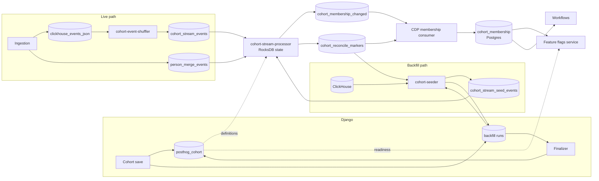

# Realtime cohorts

Realtime cohorts compute dynamic cohort membership continuously from the event stream, one person at a time, instead of recomputing whole cohorts on a schedule.
Membership changes land in a Postgres table that feature flags and workflows read per person.

This directory explains the whole pipeline at a level that should stay true as the code evolves.
Each page covers one part, and links to the others where they meet.

## Why a streaming pipeline

The batch path recalculates a cohort by querying ClickHouse for everyone who matches.
Its cost grows with persons times cohorts, whether or not anything changed, and a person who stops matching only leaves at the next recalculation.

The streaming pipeline keeps a small piece of state per person per criterion, updates it as events arrive, and recomposes a cohort for a person only when one of that person's criteria changes its answer.
Its cost follows the events that matter, and it can say "left because time passed" by tracking when each criterion expires.

The batch path still runs for every dynamic cohort.
Insights, person counts and person lists come from it.

## The system at a glance

| Component                 | Language   | Role                                                                                                                                           |
| ------------------------- | ---------- | ---------------------------------------------------------------------------------------------------------------------------------------------- |
| Cohort API and models     | Python     | Compile each criterion, decide whether a cohort is realtime, create and finalize backfill runs, write readiness stamps                         |
| `cohort-core`             | Rust       | The shared evaluation kernel: parsing, classification, state keys, eligibility, HogVM setup, time math, partitioning, the backfill wire format |
| `cohort-event-shuffler`   | Rust       | Re-keys the ingestion firehose by person                                                                                                       |
| `cohort-stream-processor` | Rust       | Keeps per-person state and emits membership changes                                                                                            |
| `cohort-seeder`           | Rust       | Replays history from ClickHouse into the processor, and drives backfill completion                                                             |
| CDP membership consumer   | TypeScript | Writes membership changes to Postgres and sweeps stale rows                                                                                    |
| Feature flags service     | Rust       | Reads membership for realtime cohorts during flag evaluation                                                                                   |

## The two paths

**Live evaluation.**
Ingestion writes every event to the firehose.
The shuffler forwards events from enabled teams to `cohort_stream_events`, keyed by person, so all of a person's events reach one partition.
The processor gives each partition to one worker.
The worker folds each event into the person's state for every criterion the event can affect, and when a criterion flips, it recomposes the cohorts that use it and emits `entered` or `left`.
A sweep expires criteria whose window has passed.

**Backfill.**
When a cohort is created, or edited in a way that changes what it matches, Django creates a backfill run and pins the definition.
It does so only for teams where automatic runs are enabled and every gate is open, and operators create the other runs.
The seeder scans ClickHouse history for that definition and sends it to the processor as seeds, which merge into the same state the live path maintains.
Then every partition re-emits the cohort's full membership, a step called reconcile, and reports completion.
When all partitions have reported, Django stamps the cohort ready, and feature flags may read it from the membership table.

## Three things to know first

- **Live output is at most once, and the next reconcile repairs it.**
  The live paths commit state before they produce a membership change, so a failed produce loses the change for good on that path.
  Every backfill ends with a reconcile that re-emits the cohort's full membership, and the downstream sweep deletes rows the reconcile did not re-assert.
  Reconcile runs only inside a backfill, and nothing schedules one, so a change lost on a cohort nobody edits stays lost until an edit or an operator starts a run.
  Reconcile re-emits from the state the processor holds, so it repairs lost output, not lost state.
  [Processor runtime](processor-runtime.md#delivery-semantics) lists each path's guarantee.
- **The processor runs as a single pod.**
  Its state lives in a local RocksDB store that never moves between pods, so a second replica would corrupt state without any error.
- **Most of the pipeline is off by default.**
  The processor writes to a shadow output topic unless configured otherwise, and seed apply, reconcile, cascades, durable restore, the seeder's completion driver and Django's finalizer each have their own switch.
  The pages name the switch where each behavior is described.

## Reading order

1. [Definitions and eligibility](definitions-and-eligibility.md): the cohort filter tree, what Django compiles, condition hashes and leaf state keys, which cohorts the processor can evaluate.
2. [Event routing](event-routing.md): the shuffler, and the partitioning rule every topic shares.
3. [Processor runtime](processor-runtime.md): consumers, workers, lanes, offsets, and what each path guarantees about delivery.
4. [Live evaluation](live-evaluation.md): Stage 1 and Stage 2, a traced event, and the hot-path optimizations.
5. [Time and eviction](time-and-eviction.md): windows, deadlines and the sweep.
6. [Merges and cascades](merges-and-cascades.md): person merges, cohorts that reference cohorts, and Stage 2 cleanup.
7. [State store and durability](state-store-and-durability.md): the RocksDB layout, atomic writes, durability and restart.
8. [Backfill overview](backfill-overview.md): why backfill exists, its correctness model, and one run end to end.
9. [Backfill coordination](backfill-coordination.md): how Django decides a run is owed, pins it and supersedes it.
10. [The seeder](seeder.md): planning, claiming, scanning and producing seeds.
11. [Seed apply and reconcile](seed-apply-and-reconcile.md): the processor's side of backfill.
12. [Completion and readiness](completion-and-readiness.md): how a run finishes and what its stamp unlocks.
13. [Membership output and readers](membership-output-and-readers.md): the consumer, the Postgres table, mark-and-sweep, feature flags and workflows.
14. [Invariants](invariants.md): the rules the whole system depends on, in one place.

## Where the code lives

| Area                                       | Location                              |
| ------------------------------------------ | ------------------------------------- |
| Cohort model and save path                 | `products/cohorts/backend/models/`    |
| Backfill runs, pinning, finalizer, stamps  | `products/cohorts/backend/backfill/`  |
| Filter validation and bytecode compilation | `posthog/api/cohort.py`               |
| Shared evaluation kernel                   | `rust/cohort-core/`                   |
| Shuffler                                   | `rust/cohort-event-shuffler/`         |
| Processor                                  | `rust/cohort-stream-processor/`       |
| Seeder                                     | `rust/cohort-seeder/`                 |
| Membership consumer and sweeper            | `nodejs/src/cdp/`                     |
| Membership table migrations                | `rust/behavioral_cohorts_migrations/` |
| Flags read path                            | `rust/feature-flags/src/cohorts/`     |

## Examples in these pages

The pages share one invented setup: team 7, cohort 42, persons p-1 and p-2, and p-1's partition 26.
Cohort 42 is usually "3 or more `/pricing` pageviews in the last 7 days", sometimes with "email is set" added.
Each page states the setup its example needs, and the details differ where a page needs them to.

## Glossary

| Term                 | Meaning                                                                                                           |
| -------------------- | ----------------------------------------------------------------------------------------------------------------- |
| Leaf                 | One criterion of a cohort: a behavioral condition, a person-property condition, or a reference to another cohort  |
| Condition hash       | A 16-character hash of a leaf's compiled matcher. Leaves that match the same events share it                      |
| Leaf state key (LSK) | The identity of one leaf's per-person state: the condition hash plus the window and count settings                |
| Catalog              | An immutable per-team index of parsed realtime cohorts, rebuilt periodically from Postgres                        |
| Eligibility class    | Whether and how the processor composes a cohort: single leaf, composable, composable with references, or excluded |
| Stage 1              | Folding an event into per-person leaf state and detecting flips                                                   |
| Stage 2              | Recomposing a cohort from its leaves when one of them flips                                                       |
| Person record        | One row per person holding which person conditions match, plus fingerprints that skip unchanged work              |
| Replay marks         | Per row, the highest firehose offset applied from each firehose partition. Used to skip redelivered events        |
| Firehose             | The ingestion topic `clickhouse_events_json`, which the shuffler reads                                            |
| Eviction deadline    | The earliest time a leaf's answer can change without a new event                                                  |
| Sweep                | The periodic pass that applies eviction deadlines                                                                 |
| Tombstone            | A forwarding address from a merged-away person to the survivor                                                    |
| Cascade              | Recomposing cohorts that reference a cohort whose membership flipped                                              |
| Tenure               | The time one worker owns a partition, from assignment to the next revoke or restart                               |
| Run                  | One backfill of one kind, for one cohort or a whole team                                                          |
| Participation        | One cohort's membership in a run, with its pinned definition and outcome                                          |
| Pinning              | Freezing the definition a run replays                                                                             |
| Shape hash           | A fingerprint of a cohort's behavioral or person leaves, used to invalidate readiness when they change            |
| Boundary (`B`)       | The instant that splits a run's history: seeded before its day, live from then on                                 |
| Chunk                | One unit of seeder work: a day and band, or a person id range                                                     |
| `S_chunk`            | The instant a chunk was claimed. The scan counts only events that arrived before it                               |
| Day tile             | A seed carrying the absolute count of one condition's matches for one person on one day                           |
| Person seed          | A seed carrying which pinned person conditions a person was evaluated against and which matched                   |
| Fence                | The rule that a day tile applies only after the live path has passed its `S_chunk` plus a margin                  |
| Live watermark       | The newest broker timestamp the live path has folded on a partition                                               |
| Reconcile            | Re-emitting every Stage 2 row of a cohort, on every partition, after a run's seeds                                |
| Marker               | The message a partition produces when it finishes reconciling a cohort for a run                                  |
| Readiness stamp      | A timestamp on the cohort saying a backfill of its current definition completed, per kind                         |
| Mark-and-sweep       | Deleting membership rows that a completed reconcile did not re-assert                                             |
