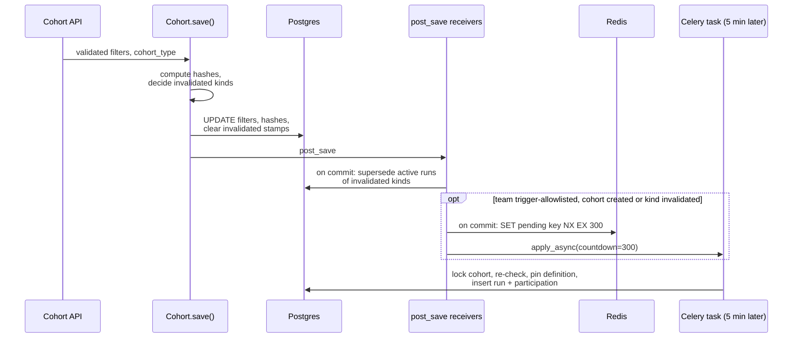

# Backfill coordination in Django

Django decides when a backfill is owed, freezes what it must replay, and at the end decides whether the finished run may open the cohort to feature flags.
It never turns history into seeds, never produces to Kafka and never reconciles.
Its one ClickHouse query is the size estimate for person runs.
This page covers the run tables, the save path that triggers runs, pinning, supersession, the gates, and what happens when things go wrong.
The last step, finalization and readiness stamps, is in [completion and readiness](completion-and-readiness.md).
[Backfill overview](backfill-overview.md) explains what a run does and its lifecycle.

## The tables

Three Postgres tables in the cohorts product hold all backfill coordination.

| Table                         | One row per                                 | Main contents                                                                                                                                       |
| ----------------------------- | ------------------------------------------- | --------------------------------------------------------------------------------------------------------------------------------------------------- |
| `cohort_backfill_runs`        | run                                         | Kind, scope, trigger, status, the team's timezone, the boundary, the pinned payload, operator attestations, and the seeder's completion bookkeeping |
| `cohort_backfill_run_cohorts` | cohort in a run, called a **participation** | The cohort's pinned filters and hashes, and the per-cohort outcome: reconcile markers seen, completed, superseded, stamped                          |
| `cohort_backfill_chunks`      | unit of seeder work                         | A day and band for behavioral runs, or a person id range for person runs, plus claim, lease and progress columns                                    |

Django creates runs and participations, and writes their final outcomes: supersession, cancellation, stamps, and `completed` or `superseded`.
The seeder writes the in-flight run columns and the participations' reconcile outcomes, and it alone writes chunks.

A cohort-scoped run has one participation.
A team-scoped run has one participation for each eligible cohort of the team, or of the subset an operator names.

A run in `awaiting_boundary`, `blocked`, `seeding` or `reconciling` is **active**.
A participation is **open** until it is superseded.
Two partial unique indexes enforce the basic exclusivity:

- at most one active cohort-scoped run per cohort and kind,
- at most one active team-scoped run per team and kind.

A cohort can sit in a team-scoped run and a cohort-scoped run of the same kind at once.
So the creators also check, under a row lock on the cohort, that the cohort has no open participation of that kind in any active run.
The readiness stamp must come from exactly one backfill of the current definition.

## When a run is owed

A run is owed when the cohort's current definition has state or downstream rows that no backfill has built yet.

| Trigger             | Created by                                                                       | Scope  |
| ------------------- | -------------------------------------------------------------------------------- | ------ |
| `cohort_created`    | Saving a new realtime cohort                                                     | Cohort |
| `cohort_edited`     | An edit that invalidates a kind, see below                                       | Cohort |
| `team_enablement`   | An operator command, to backfill every eligible cohort of a team, or chosen ones | Team   |
| `disaster_recovery` | An operator command after a store loss                                           | Team   |

A disaster-recovery run needs the operator to pass the boundary where live coverage restarted.
The command does not require it, and without it the run waits in `awaiting_boundary` forever while holding the team's slot.
Nothing checks that the boundary is in the past.

### Which edits invalidate which kind

Each kind of run is tied to one shape hash on the cohort row.
[Definitions and eligibility](definitions-and-eligibility.md#shape-hashes) describes them.

- The **behavioral** kind is invalidated when the behavioral shape hash moves: a behavioral leaf was added, removed, or changed its matcher, window, operator or threshold.
- The **person** kind is invalidated when the person shape hash moves: a person condition was added, removed or changed.

Composition edits move neither hash.
Switching AND and OR, flipping a leaf's negation, or adding a cohort reference keeps every leaf.
But the live path recomposes a person only when one of their leaves flips, so persons whose leaf answers stay the same keep the old composition.
A run is still owed.

So on every save that moves the whole-definition fingerprint, Django adds repair runs to whatever the kind hashes already invalidated:

- **Behavioral**, when the cohort has a behavioral leaf and neither kind's own hash moved.
  Behavioral leaf state survives a composition change, so the run only has to reconcile again.
  Clearing the events stamp is also what takes the cohort out of flag routing until the run completes.
- **Person**, when the cohort has a person leaf and no `person_metadata` leaf, the person hash did not move, and either the **person view** of the tree moved, or no behavioral run re-walks the tree.

The person view is the tree with its person leaves and their negation kept, and every other leaf replaced by one anonymous placeholder.
Depending on a seeder setting, person runs may emit seeds only for persons whose person-leaf values can change some cohort's answer, and that pruning is computed against the pinned tree.
When the tree around the person leaves changes, the earlier pruning no longer holds, so the person seeds must be recomputed.

Two examples:

- `AND[person P, in cohort C]`, with the reference's negation flipped: the person view does not move, but no behavioral run exists to re-walk the tree, so a person run is owed.
- `AND[behavioral B over 7 days, person P]` edited to `OR[B over 14 days, P]`: the behavioral hash moves, and the person view moves too, so both kinds are owed.

## The save path

Everything starts inside `Cohort.save()` and its `post_save` receivers.

1. **Hashes and stamps.**
   For a realtime, non-static, non-deleted cohort on a realtime-allowlisted team, on a save that includes `filters`, `save()` computes the new fingerprints and compares them with the stored ones.
   For each invalidated kind, it clears that kind's readiness stamp, and the legacy `last_realtime_cohort_calculation_at`, in the same `UPDATE` that stores the new definition.
   While the cohort stays realtime and this maintenance succeeds, no committed state pairs a new definition with a stamp earned by the old one.
   Maintenance is best effort: an error is logged and the save goes ahead.
2. **Supersede, on commit.**
   Active cohort-scoped runs of an invalidated kind move to `superseded`.
   In a team-scoped run, only this cohort's participation is superseded, and the team run carries on for the other cohorts.
3. **Debounce, on commit.**
   For a team in both the realtime and the trigger allowlists, when the save created the cohort or invalidated a kind, and the cohort has leaves of that kind to backfill, Django sets a Redis key per cohort and kind with `SET NX` and a 5-minute expiry, and schedules a Celery task 5 minutes out.
   If the key already exists, a task is already pending, and this save adds nothing.
   Saves within five minutes of the first one produce one run, pinned to the definition current when the task fires.
4. **Create, 5 minutes later.**
   The task re-checks the trigger allowlist and the [attestations](#gates), then calls the run creator.
   The creator locks the cohort row, re-checks eligibility and exclusivity, pins the current definition, and inserts the run in `awaiting_boundary` with its participation.
   A person creator first estimates the run's size against ClickHouse without holding the lock, and under the lock refuses if the person conditions changed in the meantime.

From there the seeder takes over.
[The seeder](seeder.md) describes the rest.

## Pinning

A run replays a frozen definition and never switches to the live one.

The creator pins:

- on each participation: the cohort's full `filters` JSON, its definition hash, and the shape hash of the run's kind,
- on a behavioral run: every behavioral condition to replay, with its condition hash, window fields, operator, threshold, window in days and event name, plus the union of event names to scan,
- on a person run: every person condition hash to evaluate, and a **horizon**: only persons whose record changed within the last N days are scanned.

The seeder builds its catalog from these pinned filters with the same `cohort-core` code the processor uses.
The finalizer later compares the pinned hash, and the pinned filters, with the cohort's current ones.

An edit that invalidates the run's kind supersedes it.
A cohort-scoped run then stops at the seeder's next lease renewal.
In a team-scoped run, the seeder drops the edited cohort's conditions and carries on for the rest.

## Gates

Several independent gates decide whether anything happens.
Missing one of them fails quietly, so they are worth knowing.

| Gate                                     | Effect                                                                                                                                                                                                                                                                                                            |
| ---------------------------------------- | ----------------------------------------------------------------------------------------------------------------------------------------------------------------------------------------------------------------------------------------------------------------------------------------------------------------- |
| `REALTIME_COHORT_TEAM_ALLOWLIST`         | Teams whose cohorts get hash maintenance, stamp invalidation, supersession and any run at all. Unset means no teams. Set but empty means **all** teams. Must match the value the Rust services use                                                                                                                |
| `COHORT_BACKFILL_TRIGGER_TEAM_ALLOWLIST` | Teams whose saves create runs automatically. Unset or empty means **no** teams                                                                                                                                                                                                                                    |
| Operator attestations                    | Settings an operator sets to declare that prerequisites hold. They are declarations, not live checks. Behavioral runs need `BEHAVIORAL_BACKFILL_MERGE_GATE_ATTESTED` and `BEHAVIORAL_BACKFILL_DURABILITY_ATTESTED`. Person runs also need the person TTL and sizing attestations and a positive seed-bytes budget |
| Person sizing budget                     | A cohort-scoped person run is refused when the team's active person-run estimates plus its own would exceed the budget. A team run checks only its own estimate. Hitting the size estimate's scan cap, or the cap on pinned conditions, also refuses                                                              |

The difference between the two allowlists matters.
On a team that is realtime-allowlisted but not trigger-allowlisted, an edit clears the readiness stamp and supersedes the run, but nothing creates a replacement.
The cohort stays unavailable to flags until an operator runs a team backfill.

A run created while an attestation is missing is recorded as `blocked`, and nothing ever moves a run out of `blocked` except an edit, for a cohort-scoped run, or cancellation.
So the save path and the operator command both refuse when an attestation is missing, instead of creating one.
Only a direct call to a creator function, for example from a shell, writes a `blocked` run.

## Operator tools

Two management commands cover operator work.

- `create_cohort_backfill_run` creates team-scoped runs, behavioral or person, including disaster-recovery runs with a pinned boundary.
  It can narrow the run to chosen cohorts, which is how an operator re-drives one cohort whose trigger was lost.
  It refuses when an attestation is missing or when a target cohort already has an open participation, and it supports a dry run.
- `manage_cohort_backfill_runs inventory` lists and classifies active runs.
  `manage_cohort_backfill_runs terminalize` cancels chosen runs.
  It is a dry run unless told otherwise, and it never cancels a run that already stamped.

## When things go wrong

Run creation is at most once per save.
The task retries exceptions a few times, but nothing re-drives:

- a lost enqueue, because Redis or the Celery broker was down at save time,
- a skipped attestation,
- a refusal: a run slot occupied, a budget or cap exceeded, or an ineligible cohort.

Each case is counted, and the save itself always succeeds.
There is no periodic sweep that finds eligible cohorts without a stamp and without a run.
A cohort created before its team was trigger-allowlisted also gets no run on its own.

Other cases to know:

- **A run never ends.**
  A run stuck in `awaiting_boundary`, `seeding` or `reconciling` holds its slot, and its cohorts stay unstamped.
  Examples: a disaster-recovery run without a boundary, a run whose cohort has no condition the seeder can replay, or a run parked in `reconciling` by a shortfall or a disabled finalizer.
  Nothing times these out.
  An edit clears a cohort-scoped one, and a team-scoped one needs `terminalize`.
- **Supersession fails.**
  A failed supersession is only logged.
  The replacement task then finds the stale run's participation still open and refuses, and the stale run later fails its stamp check, so the cohort ends up with neither run nor stamp.
- **An edit races the finalizer.**
  The cohort row lock serializes them.
  If the edit commits first, the stamp's hash check fails and the run is superseded.
  If the stamp commits first, the edit clears it.
  Either way no stamp survives over the new definition.
- **An edit is reverted.**
  Editing A to B and back to A restores the old hashes, but the participation superseded during B can never stamp.
  The state it seeded went stale while B was live.
  The revert's own save schedules a fresh run.
- **A cohort leaves the realtime set mid-run.**
  A soft delete, a switch to static, or losing realtime support skips hash maintenance, so nothing supersedes the run.
  The finalizer does not re-check `deleted` or `cohort_type`, so the run can still stamp.
- **A cohort re-enters the realtime set without a leaf change.**
  An undelete, a static-to-dynamic switch, or regained realtime support leaves the hashes as they were, so no run is owed, and the cohort keeps whatever stamps it had.
- **A save from a stale copy of the row.**
  The API saves the whole row, so a rename that read the cohort before the finalizer stamped can write the empty stamp back.
  The cohort loses readiness until the next invalidating edit or an operator run.
- **A seeder-side failure.**
  A run the seeder fails keeps its stamp empty and frees its slot.
  Nothing re-creates it.

## Worked example

Team 7 is in both allowlists and every attestation is set.
Cohort 42 has one behavioral leaf, "performed `$pageview` in the last 30 days", and a stamped, completed earlier run.
No active feature flag uses cohort 42, since the API would refuse the edit otherwise.

**10:00, the user changes the window to 7 days.**

1. `save()` sees the behavioral shape hash move, because the window is part of the leaf's identity.
   The condition hash does not change, because the matcher is the same.
2. The same `UPDATE` stores the new filters and hashes and clears `last_backfill_events_at`.
   Cohort 42 stops being flag-compatible, so the flag editor refuses it until a new run stamps.
3. On commit, supersession finds no active run.
   Redis `SET NX` succeeds and a task is scheduled for 10:05.
4. At 10:05 the task creates run R1 pinned to the 7-day window.

**Variant: a second edit at 10:03**, from 7 days to 14.
The hashes move again and the stamp stays cleared.
The Redis key from 10:00 still exists, so no second task is scheduled.
The 10:05 task pins the 14-day definition.
One run.

**Variant: a second edit at 10:12, while R1 is seeding.**
On commit, R1 is superseded.
The 10:00 key expired at 10:05, so a new task is scheduled for 10:17.
The seeder notices at its next lease renewal that R1 is no longer `seeding` and stops its chunks.
Tiles R1 already produced still apply harmlessly.
Tiles are keyed by condition hash, which the window edit did not change, so they max-merge into the 14-day leaf.
They hold absolute counts for days that R2 re-seeds anyway.
A tile whose condition hash no longer maps to any leaf would be dropped.
At 10:17 the task creates R2 for the 14-day window, and R2 seeds all 14 days.

## Things that surprise people

- A save that does not change the definition, such as a rename, triggers nothing.
- Readiness stamps are written with a queryset update that bypasses model signals, so the finalizer invalidates the flags cache explicitly after it stamps.
- A `PATCH` that leaves any behavioral leaf in a cohort used by an active feature flag, directly or through a nested cohort, is refused.
  That covers every filter edit of a behavioral or mixed cohort, not only behavioral edits, and it keeps a live flag out of the window where the stamp is cleared.
  Only `PATCH` is checked.
- Copying a cohort to another project drops its stamps.
  The copy gets a run on its own only if the target team is trigger-allowlisted.
