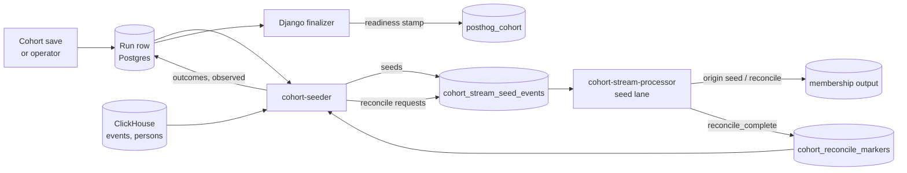
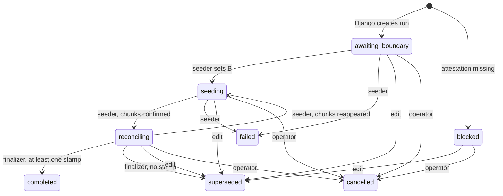

# Backfill overview

Live evaluation only knows about events it has seen.
Backfill fills in everything else: it replays history from ClickHouse into the processor's state, and then re-tells downstream the full membership of the cohort.
This page explains why backfill exists, the correctness model that lets it run alongside live traffic, the run lifecycle, and one run end to end.

It assumes [definitions and eligibility](definitions-and-eligibility.md), for condition hashes, leaf state keys, shape hashes and the catalog, and [live evaluation](live-evaluation.md), for leaf state and Stage 2 rows.
The details of each part of backfill are in:

- [backfill coordination](backfill-coordination.md), for how Django creates and pins runs,
- [the seeder](seeder.md), for scanning ClickHouse and producing seeds,
- [seed apply and reconcile](seed-apply-and-reconcile.md), for what the processor does with them,
- [completion and readiness](completion-and-readiness.md), for how a run finishes and what it unlocks.

## Why live evaluation is not enough

- **A new leaf usually starts empty.**
  A new cohort, or an edit that changes a leaf's matcher, window, operator or threshold, gets a new leaf state key with no history, unless another cohort of the team already has the identical leaf.
  "3 or more pageviews in the last 7 days" needs the last 7 days of pageviews, and the processor has none.
- **Persons are recomposed only when a leaf flips.**
  The live path recomposes a person's cohort only when one of that person's leaves changes its answer, on an event or at the sweep.
  After a composition edit, or a person condition removed from the catalog, persons whose leaf answers do not change keep their old membership forever.
- **Live output is at most once.**
  A membership change lost to a failed produce is never retried on the live path.
- **Stores get lost.**
  A schema change, a wiped volume or a cold start leaves the processor with no history at all.

Backfill answers all four.
It **seeds** leaf state from history, and it **reconciles**: for each cohort, every partition re-emits the current membership of every person it holds a Stage 2 row for, so the downstream table can be corrected and stale rows removed.

## The moving parts



1. Django creates a **run** row and **pins** the definition it must replay.
2. The **seeder** picks up the run, sets its boundary and plans chunks of work.
   Its workers claim the chunks, scan ClickHouse, evaluate each row with the same HogVM code the processor uses, and produce **seeds** to `cohort_stream_seed_events`, keyed like the event stream so each seed reaches the worker that owns the person.
   A chunk is **confirmed** once Kafka has acknowledged all its seeds.
3. The **processor** folds each seed into the same leaf state the live path writes, recomposes cohorts, and emits changes tagged `origin: seed`.
4. When every chunk is confirmed, the seeder sends a **reconcile request** for each cohort to every partition, on the same seed topic.
   On each partition the request waits behind that partition's earlier seeds.
   Each partition then re-emits the cohort's membership, tagged `origin: reconcile`, and produces a **completion marker**.
5. The seeder collects markers.
   When every cohort of the run has either all 64 markers or a settled shortfall, it records each cohort's outcome and marks the run **observed**.
6. Django's **finalizer** closes the run and writes the cohort's **readiness stamp** for that kind.
   For a cohort with behavioral leaves, that stamp is what lets feature flags read its membership from the membership table.

## Two kinds of run

| Kind              | Replays | Seed message                                                                                                       | Applied to                                           |
| ----------------- | ------- | ------------------------------------------------------------------------------------------------------------------ | ---------------------------------------------------- |
| `behavioral`      | Events  | A **day tile**: the absolute count of matching events for one person, one condition hash and one team-timezone day | Every behavioral leaf that shares the condition hash |
| `person_property` | Persons | A **person seed**: for one person, which pinned person conditions were evaluated and which matched                 | The person record                                    |

A cohort that mixes behavioral and person leaves can need both kinds.
Each kind has its own run, its own readiness stamp and its own shape hash.
An edit invalidates a kind when that kind's shape hash moves, or when a composition-only edit owes that kind a repair run.

A run is either **cohort-scoped**, for one cohort, or **team-scoped**, covering every eligible cohort of a team at once.
Save-triggered runs are cohort-scoped.
Operators create team-scoped runs to enable a team, and disaster-recovery runs after a store loss.

## The correctness model

Backfill writes into the same state that live events are updating at the same moment.
Rules 1 to 3 below cover behavioral runs, and rule 4 covers person runs.
Together they let the two writers agree without coordination.

### Rule 1: split days at a boundary

When the seeder first picks up a run, it sets the run's **boundary** `B` to the current time.
Seeding covers whole team-timezone days strictly before the day of `B`.
The live path owns the day of `B` onward, starting from the moment the processor loaded the leaf.

```text
                        day(B)
  ... | d-3 | d-2 | d-1 |  d  | d+1 ...
  <---- seeded by the run --->|<------ live path ------>
                              ^ B, somewhere inside day d
```

The boundary day itself is never seeded.
On that day the live counter holds the events the live path saw, and a seed would hold events that arrived before it was scanned.
Two partial counts of one day cannot be combined correctly by either `max` or `+`, so the day is left to live.

The split holds in one direction only.
Seeds never cover the boundary day or later days, but the live path counts every event it receives inside a leaf's window.
So a seeded day can already hold live counts: events live folded after it loaded the leaf, and late events for old days.
Rules 2 and 3 make that overlap safe.
Events on day `d` that the processor received before it loaded the leaf are in neither domain.
That gap is accepted.
It affects every behavioral leaf: a matching event in the gap is missing from the person's state until its day leaves the window.

For a disaster-recovery run the operator must pin `B`, at the point where live coverage restarted after the store loss.
Without it the run waits in `awaiting_boundary`.

### Rule 2: tiles are absolute counts, merged with max

A day tile says "person p-1 matched condition H **4 times** on 2026-03-05".
It is not "add 4".
For a count leaf, the processor merges it into that day's bucket with `bucket = max(bucket, tile)`.
For a `performed_event` leaf, a tile simply records that the person matched on that day.

`max` is what makes backfill safe to repeat.
Applying a tile twice, applying two tiles in either order, or applying a tile from a retried chunk all give the same result.
The seeder's produce is at least once, and the processor's apply can be replayed after a crash, so this matters constantly.

`max` is also correct next to live counts, as long as every event live counted for that day is also in the tile.
Rule 3 provides that for events that reached ClickHouse before the scan.
Later arrivals are the residue described there.

### Rule 3: the arrival bound and the apply fence

Each claim of a chunk stamps an instant, `S_chunk`, and a retried chunk gets a new one.
The seeder's ClickHouse query counts only events that **arrived** in ClickHouse before `S_chunk`, whatever their event time.
So a tile is fixed by the pinned definition, the day and band, and `S_chunk`.

The processor holds each tile until its partition's **live watermark** has passed `S_chunk` plus a margin.
The live watermark is the newest broker timestamp the live path has folded on that partition, or the current time when the partition has folded everything available.
By then, provided the live topic trails ClickHouse by less than the margin, every event the tile counted has also reached the live path.
So every event in the tile that live will ever count is already counted, and `max` cannot count it twice.

Without the fence, a tile could apply while an event it already counted is still waiting in the live topic.
When that event arrived, live would add 1 on top of the tile and double count it.
A shuffler stall longer than the margin can still cause that.

One residue remains.
A late event that reaches ClickHouse after `S_chunk` is not in the tile.
If live folds it before the tile applies, `max` takes the larger of two disjoint counts instead of their sum, so the day is under-counted.
If live folds it after the tile applies, live adds it on top of the tile, which is correct.
That is bounded to late arrivals on old days.
It can drop a person out of a `gte` or `gt` cohort, and wrongly keep one in an `lt`, `lte`, `eq` or negated one.

### Rule 4: person seeds apply only when fresher than live, with a margin

A person seed lists every pinned person condition the seeder evaluated and the subset that matched.
A condition that was evaluated and did not match retracts a stored match.

The seed was computed from the person's properties as ClickHouse had them when the chunk was scanned.
Live person evaluation may have seen newer properties since.
So the processor applies a person seed only when:

- the person has no usable record, or
- the scan instant is later than the record's stamp, the event time of the newest change live applied, by more than a margin, or
- the record was evaluated live against a different set of person conditions, and the scan is not older than its stamp.

Otherwise the live answer stands.
Applying a seed never touches the replay marks of the live path.

This is not last-write-wins between seeds.
A seed that changes nothing writes nothing, so it leaves no stamp for a later seed to compare against.
When two runs share a person condition, the newer scan can arrive first, change nothing, and leave an older scan free to apply after it.
Each seed is safe to apply twice, but seeds from different runs are not ordered by scan time.

### Reconcile: tell everyone again

Seeding fixes state.
Reconcile fixes what downstream was told.

After every chunk of a run is confirmed, the seeder sends one reconcile request per cohort to each of the 64 partitions.
Each request waits behind that partition's earlier tiles, so it runs only after that partition applied the run's seeds.
The processor then walks every Stage 2 row of the cohort on the partition, recomputes it from stored leaf state, and emits it, `entered` or `left`, whether or not it changed.
Rows whose stored bit was wrong are corrected.
When the walk is done, the partition produces a completion marker for the cohort and the run.

Reconcile works only from the state the store holds.
It cannot bring back an event that live failed to fold, and it cannot find a person whose first Stage 2 row for the cohort was never written.
[Seed apply and reconcile](seed-apply-and-reconcile.md#the-walk) says what repairs those.

Reconcile emits every row, not only changes, because live output is at most once.
Comparing state to state cannot find an emission that was lost on the wire.
Downstream, the membership consumer also uses the full snapshot to find and delete rows that no reconcile asserted.
[Membership output and readers](membership-output-and-readers.md) explains that sweep.

A reconcile request carries the pinned shape hash of the run's kind.
A processor whose catalog holds a different hash for that kind discards the request without a marker.
That hash is the processor's only check on the definition.
The walk composes the cohort's current tree, so an edit that leaves this kind's hash alone does not stop it.
The final guard against stamping a stale definition is Django's: supersession on edit, and the finalizer's hash and composition checks.

When a cohort's markers come up short, the seeder settles it anyway.
If the shape hash of the run's kind moved or cannot be read, or the cohort was deleted, its participation is superseded.
Otherwise it is a retryable shortfall, even after an edit that left that hash alone, and the run waits in `reconciling` until an operator dispatches reconcile again.
[Completion and readiness](completion-and-readiness.md#deciding-the-outcome) explains this.

## Run lifecycle



- Django owns creation, supersession, cancellation and the final `completed` or `superseded`.
- The seeder owns the boundary, `seeding`, `reconciling`, `failed`, and the observation that the finalizer waits for.
- At most one active cohort-scoped run may exist per cohort and kind, and one active team-scoped run per team and kind.
  On top of that, the creators refuse a cohort that already has an open participation of that kind in any active run.
- An edit supersedes a cohort-scoped run.
  In a team-scoped run, only the edited cohort's participation is superseded, and the run continues for the others.

## One run, end to end

Team 7 uses UTC.
At 10:00:00 on 2026-03-10 a user creates cohort 42: "3 or more `/pricing` pageviews in the last 7 days".
Person p-1, who hashes to partition 26, made 4 matching pageviews on 2026-03-05.
Every backfill gate is on, and the default timings apply: a 5-minute save debounce, a 10-minute fence margin, and a finalizer every 2 minutes.

1. **10:00:00, save.**
   Django compiles the cohort, marks it `realtime`, stores its shape hashes, and schedules a backfill task 5 minutes out.
   Within a few minutes the processor loads the new definition, and live `/pricing` pageviews start counting into the new leaf.
2. **10:05:00, run created.**
   The task pins cohort 42's definition into run R, status `awaiting_boundary`.
3. **10:05:10, boundary.**
   The seeder picks up R and sets `B` to 10:05:10.
   It plans one chunk per day from 2026-03-03 through 2026-03-09.
4. **10:05:25, scan.**
   Workers claim chunks oldest day first.
   The 2026-03-05 chunk is claimed at 10:05:25, so its `S_chunk` is 10:05:25.
   ClickHouse returns p-1's 4 pageviews, all of which arrived long ago.
   The seeder produces a tile: p-1, condition H, 2026-03-05, count 4.
   Kafka acknowledges it, and the chunk is confirmed.
5. **10:05:45, reconcile dispatch.**
   All seven chunks are confirmed, so on its next tick the seeder moves R to `reconciling` and sends a reconcile request for cohort 42 to all 64 partitions.
6. **10:05:50, most partitions reconcile.**
   The 63 partitions with no held tile walk their Stage 2 rows for cohort 42 within seconds, re-emit them with `origin: reconcile`, and produce markers.
7. **10:15:30, apply on partition 26.**
   On partition 26 the tile has been waiting for the live watermark to pass 10:15:25, and the reconcile request waits behind it.
   The fence opens.
   The processor slides the leaf's window to today, merges `max(0, 4) = 4` into the 2026-03-05 bucket, and the leaf flips to true.
   It emits `entered` for cohort 42 and p-1, with `origin: seed`.
8. **10:15:35, reconcile on partition 26.**
   The request runs, re-emits p-1's row as `entered`, and produces the 64th marker.
9. **10:15:45, observed.**
   The seeder's marker watcher has all 64 markers for cohort 42, so the next tick marks the participation complete and the run observed.
10. **10:16:00, stamp.**
    The finalizer checks that cohort 42's behavioral shape hash still equals the pinned one, stamps `last_backfill_events_at`, moves R to `completed`, and triggers a rebuild of the flags cache.
    Feature flags can now read cohort 42 from the membership table.

The fence dominates a small run.
In this example, save to readiness takes about 16 minutes, and up to about 18 depending on the finalizer's schedule.
A backlog, a failure or a slow catalog refresh makes it longer.

## What backfill does not fix

- The part of the boundary day the processor received before it loaded the leaf.
- History older than the seeder's lookback cap.
  Longer windows are truncated and the run records a warning.
- History for `performed_event` leaves with an hour or minute window.
  Only live events fill them.
- Leaves the pipeline cannot represent at all, such as count windows under a day.
- Events for a seeded day that reach ClickHouse after the chunk's scan and that live folds before the tile applies, the under-count of Rule 3.
- A person condition's stale match for a person the person run pruned or did not scan.
  Person runs scan only persons updated within a horizon.
- State left under a merged-away person after a lost merge event.

## Things that surprise people

- A chunk is confirmed when Kafka acknowledges its seeds, not when the processor applies them.
  So reconcile is dispatched long before most seeds apply, and the ordering on each partition is what keeps a reconcile behind its run's seeds.
- Reconcile requests are not fenced.
  A request that reaches a partition before the processor has loaded the cohort's current definition is discarded without a marker, and the run ends with a retryable shortfall.
- Every chunk of every run is claimed oldest day first, so a small new cohort's recent days wait behind a large team run's older days.
