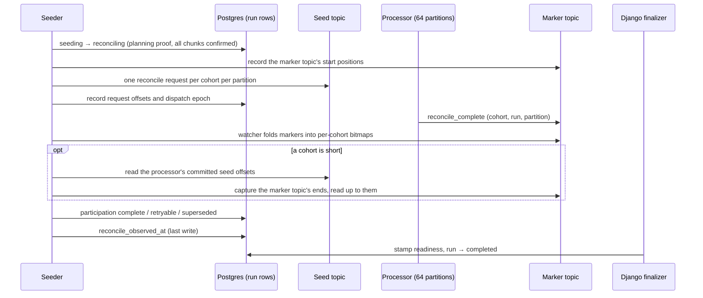

# Completion and readiness

A backfill run is only useful if something can tell, safely, that it finished and that its result still matches the cohort's definition.
This page covers the completion protocol between the seeder, the processor and Django, the readiness stamps it produces, and what a stamp does and does not unlock.

It uses terms from [backfill overview](backfill-overview.md) and [backfill coordination](backfill-coordination.md): a run pins a cohort's definition into a **participation**, one per cohort, and each kind of run is tied to one **shape hash**, a fingerprint of the cohort's leaves of that kind.

## The question completion answers

"Every chunk was produced" is not enough to call a run done.
The processor may still be holding tiles behind the fence, and reconcile may not have re-told downstream yet.
A run is complete for a cohort only when **every one of the 64 processor partitions** has finished reconciling that cohort for this run.
Each partition proves it by producing a `reconcile_complete` marker.

Completion is split three ways:

- the **seeder** dispatches reconcile, watches markers, and records each cohort's outcome in Postgres,
- the **processor** walks each cohort and produces the markers,
- **Django's finalizer** reads only Postgres, closes the run, and writes the readiness stamp.



## Gates

Every stage of completion is off by default.

| Setting                                        | Stage                                                                                                                                                                    |
| ---------------------------------------------- | ------------------------------------------------------------------------------------------------------------------------------------------------------------------------ |
| `SEEDER_RECONCILE_AUTO_DISPATCH_ENABLED`       | The seeder dispatches reconcile on its own. It also requires `SEEDER_CONFIRM_REGISTER_BACKFILLED`. Without it, an operator dispatches with the `reconcile_dispatch` tool |
| `SEEDER_RECONCILE_OBSERVER_ENABLED`            | The seeder watches markers and records outcomes                                                                                                                          |
| `SEEDER_PERSON_RECONCILE_DISPATCH_ENABLED`     | Completion also covers person runs                                                                                                                                       |
| `BEHAVIORAL_BACKFILL_FINALIZER_ENABLED`        | Django finalizes observed runs and writes stamps                                                                                                                         |
| `BEHAVIORAL_BACKFILL_FINALIZER_RUN_ALLOWLIST`  | Which observed runs the finalizer may close                                                                                                                              |
| `BEHAVIORAL_BACKFILL_PERSON_READINESS_ENABLED` | Whether person runs are finalized at all                                                                                                                                 |

## Dispatch

The seeder dispatches reconcile for a run when its planning proof is stamped and every chunk is confirmed.

1. A compare-and-set moves the run from `seeding` to `reconciling`.
   It requires the planning proof and no unconfirmed chunk, and planning locks the run row, so no chunk can appear between the check and the move.
2. The seeder records the current end of each marker-topic partition as the watcher's **start positions**.
   Markers already on the topic before this dispatch are not counted.
3. It produces one reconcile request per participating cohort to each of the 64 seed partitions, and records the highest offset it produced on each partition.
4. In one transaction it stores those offsets, the start positions, and a **dispatch epoch**.
   For every participation that is not superseded, it clears the marker bitmap, the completion time and any error.
   It also clears `reconcile_observed_at`, which is how a dispatch reopens a run that was held on a shortfall.

Every later write for this dispatch is conditioned on the dispatch epoch, so a newer dispatch of the same run makes an older one's writes miss.
Markers themselves carry no epoch.
A marker from an earlier dispatch of the same run that lands after the start positions still counts, which is harmless because it certifies a walk of the same run and pinned hash.

If every participation was superseded while the run was seeding, the seeder marks the run observed without dispatching, and the finalizer moves it to `superseded`.

## Watching markers

A single watcher task in the seeder tails the marker topic.
For each marker it sets the partition's bit in the matching participation's 64-bit bitmap.
Setting a bit twice changes nothing, so duplicate markers are harmless.
When a cohort reaches 64 of 64, the watcher writes its bits to Postgres at once instead of waiting for its timer.
The next observation pass marks the participation complete.

## Deciding the outcome

When all 64 bits are set, the participation is **complete**, and no further check is needed.

Deciding that a cohort is **short** is harder: the seeder must be sure no more markers are coming.
It proves that in two steps.

1. **Liveness.**
   The processor's seed consumer must have committed past every reconcile request on all 64 partitions.
   The processor produces a partition's marker, and waits for its acknowledgment, before it lets that request's offset be committed.
   A request the processor discarded, or skipped because reconcile is disabled, is committed with no marker.
   So after this point every marker of the dispatch is already on the marker topic.
2. **Read to the end.**
   The seeder records the marker topic's current end, and waits until the watcher has read that far.

Only then does it settle each short participation:

| Participation                                                                                  | Outcome written                                                             |
| ---------------------------------------------------------------------------------------------- | --------------------------------------------------------------------------- |
| Markers missing, and the cohort's current shape hash for this kind still equals the pinned one | Retryable shortfall: an error is recorded, and the participation stays open |
| Markers missing, and this kind's shape hash moved or cannot be read, or the cohort is deleted  | Superseded                                                                  |

Missing markers with an unchanged hash usually mean the processor discarded or skipped the request, for example because reconcile was disabled on it.
An edit that moved only the other kind's hash, or only the composition, also leaves this kind's hash unchanged and gives a retryable shortfall.
A retryable shortfall needs an operator to dispatch the run again.
Until then the run keeps the cohort's run slot for that kind, and the automatic driver never retries an observed run.

The seeder writes `reconcile_observed_at` **last**, after every participation's outcome.
Django never sees an observed run with an undecided participation.

## Finalization in Django

A Celery beat task runs every two minutes, when finalization is enabled.
It picks up runs in `reconciling` with `reconcile_observed_at` set, for each kind that may be finalized, and handles each run in its own transaction:

1. Lock the run row, skipping it if another worker holds it.
2. For each participation:
   - superseded: count it as superseded,
   - already stamped: count it as stamped,
   - complete: try to stamp, below,
   - otherwise: hold the run for a later pass.
3. When every participation is decided, move the run to `completed` if at least one stamped, or to `superseded` if none did.
4. After the transaction commits, invalidate the team's cached cohort data and trigger a rebuild of the flags cache.
   Stamps are written with a queryset update that bypasses model signals, so the finalizer has to do this itself.

### The stamp

Each kind has its own stamp column on the cohort:

| Kind            | Stamp                                |
| --------------- | ------------------------------------ |
| Behavioral      | `last_backfill_events_at`            |
| Person property | `last_backfill_person_properties_at` |

Stamping is a compare-and-set, under a lock on the cohort row:

```sql
UPDATE posthog_cohort
SET <stamp> = now()
WHERE id = <cohort> AND team_id = <team>
  AND <kind shape hash> = <hash pinned on the participation>
  AND <stamp> IS NULL
```

together with marking the participation `stamped_at` in the same transaction.

- If the cohort's shape hash for this kind has moved since pinning, the update matches nothing, and the participation is superseded, as is a cohort-scoped run.
- A composition edit moves no kind hash, so before the update the finalizer also compares the pinned filters with the current filters.
  If the edit owes a repair run of this kind, or either definition cannot be parsed, the stamp is refused and the participation superseded.
- A participation that was ever superseded never stamps, even if the definition was later edited back to the pinned one.
- If the stamp is already set and the hash still matches, the participation is ratified without changing the timestamp.

Stamps are written once.
A stamp is cleared only by a save that invalidates its kind, and only while the cohort is realtime, not static and not deleted, on an allowlisted team.

Keying the stamp on the kind's own shape hash, not on the whole definition, means a person-only leaf edit does not invalidate a still-valid behavioral backfill, and the reverse.
A structural edit can still owe both kinds a run.

### Why person readiness has its own gate

Person runs are finalized only when person readiness is enabled.
Until then they wait, observed, in `reconciling`.

The reason is the flags service's stamp policy.
Under the default policy, `any_backfill_stamp`, either stamp routes a cohort with behavioral conditions to the membership table.
A person stamp alone would then route a mixed cohort whose behavioral half was never backfilled: "in cohort" would match nobody, and "not in cohort" would match everybody.
The other policy, `events_or_calculation_stamp`, requires the events stamp, or the legacy calculation stamp on a `realtime` cohort.
Person readiness may be enabled only once every region's flags service runs that policy.

## What readiness unlocks

### In Django

`Cohort.is_flag_compatible` is true when the cohort is realtime and **every** stamp its filters need is set, and they need at least one:

- a behavioral leaf needs the events stamp,
- a person leaf needs the person stamp,
- a mixed cohort needs both.

A `person_metadata` leaf makes a cohort non-realtime in the first place, so such a cohort is never compatible.
A cohort made only of references needs no stamp, so it is never compatible either.

The flag API accepts a cohort with event-based criteria, or one that depends on such a cohort, only when the realtime targeting rollout flag is on for the user and every such cohort is flag-compatible.
The same rollout flag lets the flag editor's cohort picker list these cohorts.

Behind the same rollout flag, for allowlisted teams, the cohort API's `realtime` field reports one state per cohort that has event or person criteria: `static`, `person_properties`, `daily`, `building`, `rebuilding`, `ready`, or `needs_attention`.

### In the feature flags service

The Rust flags service reads cohorts from the flags cache, or from Postgres through a short-lived cache when the flags cache has none.
It routes a cohort to the membership table when all of these hold:

- the team is in `REALTIME_COHORT_EVALUATION_TEAM_IDS`,
- the cohort's type is `realtime`, or the legacy `behavioral` type,
- its `condition_type` marks a behavioral or lifecycle condition,
- its stamps satisfy the configured stamp policy.

Otherwise the cohort is evaluated dynamically from person properties, where behavioral leaves can never match.
[Membership output and readers](membership-output-and-readers.md#feature-flags) describes the read path.

The Django rule and the Rust rule are separate predicates.
Django decides whether a flag may be **saved** with the cohort.
Rust decides, on every request, where to **read** membership from.
They diverge in both directions.
The stamp policy can accept fewer stamps than Django requires, so an existing flag can keep reading the table in a state where Django would refuse a new one.
And Django can accept a flag that Rust then evaluates dynamically, for example when the team is not in the flags service's list.

## What a stamp does not mean

- **It does not mean downstream has caught up.**
  The finalizer trusts the seeder's observation of markers.
  Neither checks how far the membership consumer has applied the reconcile rows, or whether the stale-row sweep has run.
- **It does not mean fresh.**
  A stamp says a backfill of the current definition completed once.
  Live changes lost afterwards are repaired only by a later reconcile.
- **It does not mean complete history.**
  A person stamp covers persons updated since the run's horizon.
  A behavioral stamp covers history only up to the seeder's lookback cap.
- **It does not cover leaving the realtime set.**
  The finalizer does not check whether the cohort was deleted, made static or stopped being realtime while the run was in flight.

## Worked example

Run R for cohort 42 on team 7 has one participation, pinned with behavioral shape hash `B7`.

1. **10:05:45.**
   All 7 chunks are confirmed.
   The seeder moves R to `reconciling`, records the marker topic's start positions, produces 64 reconcile requests for cohort 42, and records their offsets and dispatch epoch E1.
2. **10:05:50 to 10:15:35.**
   Partitions finish their walks at different times, the last ones only after their held tiles apply.
   The watcher sets bits as markers arrive.
3. **10:15:35.**
   The last marker arrives.
   The bitmap reads 64 of 64, and the watcher writes it.
4. **10:15:45.**
   The seeder's next pass finds every participation complete, marks it complete without any liveness check, and writes `reconcile_observed_at`.
5. **10:16:00.**
   The finalizer locks R, finds the participation complete, locks cohort 42, confirms the current filters owe no repair, and runs the stamp update with `behavioral_filters_shape_hash = 'B7'`.
   One row matches.
   It marks the participation stamped, moves R to `completed`, and after commit triggers the flags cache rebuild for team 7.

**Variant: an edit at 10:10.**
The user changes the cohort's window, which moves the behavioral hash to `B14`.
When the edit commits, its supersede hook marks the participation and R superseded.
The finalizer never sees R.
The stamp's hash check is only the backstop for an edit that commits before that hook runs.
The edit's own run will build readiness for the new definition.

**Variant: one processor had reconcile disabled.**
Every partition that processor owns skips the request, so markers for those partitions never arrive.
The seeder waits for the liveness proof, reads the marker topic to its end, and finds partitions missing.
The hash still matches, so it records a retryable shortfall and marks the run observed.
The finalizer holds R on every pass until an operator dispatches it again.
