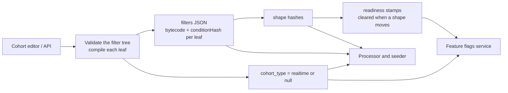

# Cohort definitions and the realtime catalog

This page explains how a cohort definition saved in Django becomes something the Rust services can evaluate.
It covers the cohort filter tree, what the cohort API compiles on save, the two identities every leaf gets, how the Rust services load and classify definitions, and what each kind of edit changes.

Every other page in this directory builds on the vocabulary introduced here.
Read it first.

## A cohort is a boolean tree of leaves

A dynamic cohort stores its criteria in the `filters` JSON column.
The root is always a group, and groups nest.

```json
{
  "properties": {
    "type": "OR",
    "values": [
      {
        "type": "AND",
        "values": [
          { "type": "behavioral", "value": "performed_event_multiple", "key": "$pageview", "...": "..." },
          { "type": "person", "key": "email", "operator": "is_set", "...": "..." }
        ]
      }
    ]
  }
}
```

A group is `{"type": "AND" | "OR", "values": [...]}`.
Everything else is a **leaf**, one criterion of the cohort.
Groups carry no negation.
Negation lives on each leaf as `negation: true`.

The realtime pipeline understands three types of leaf, one of them in two variants.

| Leaf                                                | What it asks                                                                                      | Example                                              |
| --------------------------------------------------- | ------------------------------------------------------------------------------------------------- | ---------------------------------------------------- |
| `behavioral` with `value: performed_event`          | Did the person perform this event at least once inside the window?                                | Viewed `/pricing` in the last 30 days                |
| `behavioral` with `value: performed_event_multiple` | Did the person perform this event a number of times inside the window, compared with an operator? | Viewed `/pricing` 3 or more times in the last 7 days |
| `person`                                            | Does a person property match?                                                                     | `email` is set                                       |
| `cohort`                                            | Is the person in another cohort?                                                                  | In cohort 17                                         |

Every other behavioral value, such as `performed_event_first_time`, `performed_event_sequence`, `performed_event_regularly`, `stopped_performing_event` and `restarted_performing_event`, is not supported in realtime.
Neither are behavioral leaves keyed on an action instead of an event name, and `person_metadata` leaves, which read top-level person columns such as "first seen".
One unsupported leaf makes the whole cohort non-realtime.

## What the cohort API compiles on save

The cohort API validates the filter tree and compiles each leaf before the row is written.
The Rust services never call Django.
They read the columns Django writes, so everything they need has to be derived at save time.
A cohort created directly through the ORM, bypassing the API serializer, gets no bytecode and no `cohort_type`.



### Bytecode and the condition hash

Each supported leaf gets two fields written into the stored `filters` JSON.

- `bytecode` is a HogVM program that answers the leaf's matcher.
  For a behavioral leaf the matcher is `event = <key> AND <event property filters>`.
  For a person leaf it is the property predicate, including its operator.
  For a cohort reference it is `inCohort` or `notInCohort`.
- `conditionHash` is the first 16 hex characters of a SHA-256 over the bytecode serialized as JSON with sorted keys.

The condition hash names the matcher and nothing else.
The window, the count operator, the count threshold, the cohort id and the team id are all outside it.
A person or behavioral leaf's negation is outside it too, because negation is not compiled into those leaves' bytecode.
Two leaves that match the same events with the same property filters share one condition hash, even when their windows differ and even across cohorts.

The Rust services treat the hash as 16 opaque ASCII bytes.
They never hex-decode it and never recompute it from the bytecode.
A hash that is not exactly 16 bytes makes its leaf unusable.

### The realtime decision

The API serializer sets `cohort_type = 'realtime'` when all of the following hold:

- every leaf compiled to bytecode without an error,
- no leaf is `person_metadata`,
- every cohort reference points to a cohort that is itself realtime at the moment of this save,
- the cohort does not use `filterTestAccounts`, because the test-account filters are added at query time and the realtime evaluator cannot see them,
- on edits, the last known person count is under a size cap.

The rule reads the criteria only.
No team allowlist or rollout flag is involved, so any project can hold `realtime` cohorts, and the Rust services choose which teams they actually process.
The rule also checks no composition, which matters later on this page.

Other writers can take `realtime` away after a save.
The batch recalculation clears it when a cohort's count grows past the size cap, and a resave management command clears it for some nested references.

Legacy ClickHouse recalculation keeps running for every dynamic cohort, realtime or not.
Insights, person counts and person lists still come from that path.
The realtime membership serves two readers: feature flags on teams enabled in the flags service, and workflow conditions that check cohort membership.
[Membership output and readers](membership-output-and-readers.md) covers both.

### Shape hashes

For realtime, non-static, non-deleted cohorts on teams in `REALTIME_COHORT_TEAM_ALLOWLIST`, every save that includes `filters` also maintains three hash columns on the cohort row.

| Column                          | What it fingerprints                                                                           | Read by                                                                                                                      |
| ------------------------------- | ---------------------------------------------------------------------------------------------- | ---------------------------------------------------------------------------------------------------------------------------- |
| `behavioral_filters_shape_hash` | The behavioral leaves, each identified by its condition hash plus every window and count field | The processor, to reject reconcile work for a stale definition. Django's finalizer, as the key of the events readiness stamp |
| `person_filters_shape_hash`     | The person leaves, each identified by its condition hash                                       | The same, for the person readiness stamp                                                                                     |
| `filters_shape_hash`            | The whole definition, including AND/OR structure, leaf negation and cohort references          | Django only                                                                                                                  |

The two kind hashes ignore the order of leaves, where a leaf sits in the tree, and whether it is negated.
Duplicate leaves still count.
The definition hash sees composition.
A fourth fingerprint, the person view of the tree, is computed on the fly and never stored.
[Backfill coordination](backfill-coordination.md) explains how Django uses the definition hash and the person view to decide which backfill an edit owes.
Backfill runs pin a copy of the kind hashes when they are created.
[Reconcile](seed-apply-and-reconcile.md#reconcile) and the finalizer compare that pinned copy with the current one.

When a kind hash moves, the same `UPDATE` that stores the new definition also clears that kind's readiness stamp.
A composition-only edit, which moves no kind hash, clears the stamp of each kind Django decides to re-run.
While the cohort stays realtime and the maintenance succeeds, a stamp therefore never outlives the definition it was earned for.
The maintenance is best effort: if hashing raises an error, Django logs it, saves the new definition anyway, and leaves the old stamps in place.
An edit that takes the cohort out of realtime, a soft delete, a switch to static, or the size-cap clear skips this maintenance and leaves the stamps in place.
[Completion and readiness](completion-and-readiness.md) covers the stamps.

## Two identities per leaf: condition hash and leaf state key

The pipeline keeps per-person state for each behavioral and person leaf.
The condition hash cannot be the key for that state, because two leaves with the same matcher but different windows need different state.
"Viewed pricing 3 or more times in 7 days" and "viewed pricing in the last 30 days" match exactly the same events, yet one needs 8 daily counters and the other needs one boolean.

So every behavioral and person leaf has two identities.
A cohort reference has neither: it keeps no state of its own, and Stage 2 reads the referenced cohort's membership instead.

- The **condition hash** identifies the matcher.
  The processor runs each condition hash's program once per event.
- The **leaf state key** (LSK) identifies one leaf's state.
  For a behavioral leaf it is a SHA-256 over the condition hash plus the leaf's `value`, `time_value`, `time_interval`, `explicit_datetime`, `explicit_datetime_to`, `operator` and `operator_value`, truncated to 16 bytes.
  For a person leaf it is the condition hash itself, because a person predicate has no window.

```text
          condition hash H  (event = '$pageview' AND url ILIKE '%/pricing%')
                 |
       evaluated once per event
                 |
      +----------+-----------+
      |                      |
   LSK A                   LSK B
   multiple, gte 3, 7 days  single, 30 days
      |                      |
   cohorts 42, 51          cohort 60
```

Three consequences follow.

- **Evaluate once, fan out.**
  One VM run per condition hash per event, however many windows, operators or cohorts use it.
  The result fans out to every LSK that shares the hash.
- **Cohorts share state.**
  Two cohorts on the same team with an identical leaf get the same LSK and share one row of state per person.
  Teams never share state, because every store key includes the team.
- **Negation and the event name are not in the key.**
  The event name is already inside the condition hash.
  Negation lives only in the tree, so `A` in one cohort and `NOT A` in another share state.

The LSK derivation is frozen.
A golden vector test in Rust pins the bytes, and Django's behavioral shape hash normalizes exactly the same eight fields the same way.
Changing the derivation would re-key every behavioral state row in every store, orphaning all of it.

## How the Rust services load definitions

Every Rust service that needs definitions builds a **catalog**: an immutable, per-team index of parsed cohorts.
The shared `cohort-core` crate owns the parsing, classification and indexing, so the processor and the seeder interpret a definition with the same code.

- The **processor** loads every row with `cohort_type = 'realtime' AND deleted = false AND filters IS NOT NULL`, joined to the team's timezone.
  It keeps only teams in its own copy of `REALTIME_COHORT_TEAM_ALLOWLIST`, builds the catalog off the async runtime, and swaps it in atomically.
  It refreshes every few minutes with jitter.
  A failed refresh keeps the previous catalog, so a database outage freezes definitions instead of emptying them.
- The **seeder** never loads the live definitions.
  It builds a catalog from the filters Django pinned into each backfill run, so a run's seeds replay exactly the definition it was created for.
  That catalog holds only the run's cohorts, and it always has cascades off.
  A run's reconcile is different, because it runs on the processor against the processor's live catalog.
  See [the seeder](seeder.md).
- The **shuffler** only needs to know which teams have realtime cohorts.
  It keeps a team index from the same predicate.
  See [event routing](event-routing.md).

Definitions do not travel through Kafka.
Each service polls Postgres, so an edit reaches the processor within one refresh interval.

### Parsing

The parser turns the JSON tree into groups and leaves exactly as written.
It never merges siblings, flattens groups or simplifies the tree.
When a leaf is dropped, its group stays in place, possibly empty.

### Leaf classification

Each leaf is kept, dropped with a reason, or recorded as a cohort reference.
A kept behavioral leaf also gets a **state variant**, which decides how its state is stored and counted.

| Leaf                       | Window                                                                                      | State variant                                                              |
| -------------------------- | ------------------------------------------------------------------------------------------- | -------------------------------------------------------------------------- |
| `performed_event`          | Any window that resolves, including sub-day ones                                            | `BehavioralSingle`: remembers whether it matched and the most recent match |
| `performed_event`          | No window at all                                                                            | Dropped                                                                    |
| `performed_event_multiple` | A sliding window of 1 to 180 whole days                                                     | `BehavioralDailyBuckets`: one counter per team-timezone day                |
| `performed_event_multiple` | A sliding window of more than 180 days                                                      | `BehavioralCompressedHistory`: a compact per-day history                   |
| `performed_event_multiple` | Anything else: no window, an absolute date range, or an hour or minute window of any length | Dropped                                                                    |
| `person`                   | None                                                                                        | `PersonProperty`: a bit in the person's record                             |

A few window rules are worth knowing.

- A month is 30 days and a year is 365 days.
  The batch ClickHouse query uses calendar months and years instead, so month and year windows differ from it at the edges.
  The gap grows with the window: one month can be a day or two off, and 12 months are 360 days here against 365 or 366 in the batch query.
- `explicit_datetime` and `explicit_datetime_to` take precedence over `time_value` and `time_interval`.
  Absolute dates are calendar days in the team's timezone, not instants.
  A `performed_event` leaf with absolute dates has a fixed window, so its membership never expires.
- A relative upper bound, an unparseable bound, or a mix of relative lower bound and absolute upper bound drops the leaf.
- Operators other than `gte`, `lte`, `gt` and `lt` behave as equality.
  A count of zero is never a match, even for `lt 1`.

A leaf is also dropped when its behavioral value is unsupported, when it is keyed on an action, when its condition hash or bytecode is missing or malformed, or when its type is unknown.
Every drop is counted by reason.

## Eligibility: which cohorts the processor composes

After classification, each cohort gets an **eligibility class**.
The class decides whether the processor emits membership for the cohort and how it computes it.
Stage 1 and Stage 2 below are the two halves of live evaluation: Stage 1 keeps each leaf's state, and Stage 2 combines leaves into a cohort.
[Live evaluation](live-evaluation.md) explains both.

| Class                 | Meaning                                                                                                                                                                                                                                       |
| --------------------- | --------------------------------------------------------------------------------------------------------------------------------------------------------------------------------------------------------------------------------------------- |
| `SingleLeaf`          | Exactly one leaf. The leaf's own state is the membership, so no composition is needed                                                                                                                                                         |
| `Stage2Composable`    | Two or more leaves under a root that is not negated. Membership is the tree folded over the leaf answers                                                                                                                                      |
| `Stage2ComposableRef` | The cohort references other cohorts, and cascades are enabled. Every positively referenced cohort must be in the team's catalog and eligible itself, as a single-leaf, composable or referencing cohort, and there must be no reference cycle |
| `Excluded(reason)`    | Nothing is emitted for this cohort                                                                                                                                                                                                            |

The exclusion checks run in a fixed order, and the first match wins.

1. **Dropped leaf.** Any dropped leaf excludes the whole cohort, even when other leaves are fine.
   A cohort evaluated without one of its leaves would produce wrong members.
   A missing cohort is the safe failure.
2. **Empty group.** Any group with no children.
3. **Negated root.** An `AND` group is negated when all its children are negated.
   An `OR` group is negated when any child is.
   So `AND[A, NOT B]` is composable, while `OR[A, NOT B]` and a lone `NOT A` are excluded.
   A negated root would match every person with no state at all, and the processor has no way to enumerate those persons.
4. **Cohort reference.** Excluded unless cascades are enabled, which they are not by default.
   [Merges and cascades](merges-and-cascades.md#cascades-cohorts-that-reference-cohorts) explains cascades, cycle detection and why a negated reference to an untracked cohort does not block.

Excluded cohorts still cost work.
Their valid leaves stay in the index, so the processor keeps maintaining that leaf state even though it emits nothing for the cohort.

The processor and the seeder reach the same class for every cohort without references.
For a cohort with references, the processor may compose it through cascades while the seeder, which never enables cascades, excludes it.

### Where Django and Rust disagree

Django's realtime rule is looser than Rust's eligibility.
Django marks these shapes `realtime`, and Rust excludes them:

- a negated root, such as a cohort whose only criterion is "did not perform event X",
- an empty group,
- any behavioral leaf whose window Rust cannot represent, such as a `performed_event` with no window or a `performed_event_multiple` over less than a day,
- a cohort reference when cascades are disabled.

Such a cohort gets `cohort_type = 'realtime'`, is loaded into the catalog, and produces no membership.
Keep this in mind when a realtime cohort appears to match nobody.
The `cohort_eligibility_total{class}` metric counts every loaded cohort by class, and an excluded class names its reason, for example `excluded_top_level_negation`.
Both the processor and the seeder emit it, so filter by job.

## The reverse index

The frozen catalog for a team is a set of lookup maps built once per refresh.
The processor's hot path never walks all cohorts.
It goes from an event to the few map entries that matter.

| Map                                 | From → to                                                        | Used for                                                                                             |
| ----------------------------------- | ---------------------------------------------------------------- | ---------------------------------------------------------------------------------------------------- |
| Behavioral candidates by event name | event name → the condition hashes whose leaf `key` is that event | The event-name gate. An event whose name no behavioral condition mentions runs no behavioral program |
| Condition → program                 | condition hash → decoded HogVM program                           | The program to run, decoded once per catalog build                                                   |
| Condition → leaf state keys         | condition hash → every LSK that shares it                        | Fan-out after a match, and when applying a backfill tile                                             |
| Leaf state metadata                 | LSK → variant, window, count operator                            | The parameters of the Stage 1 update                                                                 |
| Single-leaf cohorts                 | LSK → cohorts whose only leaf this is                            | A leaf flip is the cohort flip                                                                       |
| Composable cohorts                  | LSK → cohorts that contain this leaf                             | Which cohorts Stage 2 recomposes when the leaf flips                                                 |
| Referencing cohorts                 | cohort → cohorts that reference it                               | Cascades                                                                                             |
| Person conditions, ordered          | sorted list of person condition hashes                           | The person evaluation order                                                                          |
| Catalog fingerprint                 | digest of the sorted person condition hashes                     | Skipping person re-evaluation while nothing changed                                                  |
| Eligibility and trees               | cohort → class, cohort → parsed tree                             | Stage 2 composition                                                                                  |
| Shape hashes                        | cohort → behavioral and person shape hash                        | Rejecting reconcile work for a stale definition                                                      |
| Timezone                            | the team's IANA timezone                                         | Every calendar-day computation                                                                       |

The catalog build is deterministic.
Conditions are sorted, teams freeze in id order, and a shared static-analysis budget is spent in that order, so every replica derives the same catalog from the same rows.

## The HogVM evaluation contract

Leaves are evaluated with the Rust HogVM, configured the same way in every process that links `cohort-core`.

- The stored bytecode has no trailing `RETURN`, so the loader appends one before decoding.
  Each program is decoded once per catalog build.
- The cohort evaluator enables type-coercing comparisons, as the Python and TypeScript HogVMs do, and orders dates by their instant, as ClickHouse does.
  A string compares as a number only when the other side is a number, and `1 == 1.0` is true.
- A program that fails at runtime, calls an unknown function, or returns a non-boolean counts as `false`.
  Failures are counted by reason.
- An event with malformed `properties` JSON skips only the behavioral side.
  Malformed `person_properties` skips the whole event when the person side has to evaluate.
  An event with an unparseable timestamp is skipped.

The processor builds two kinds of globals for the VM.
Behavioral globals mirror what the Node CDP filters see: the event name, uuid, distinct id, timestamp, properties, and the person with its properties.
Person globals hold only the person id, the person properties and the project id.

### Static analysis of conditions

At catalog build, `cohort-core` analyzes each behavioral program without running it.
The analysis computes the set of globals and property paths the program can read.
Two consumers use it.

- The processor builds only the globals an event's candidate conditions can read, and parses a JSON payload only when some behavioral condition of the team can read it.
  On a team whose behavioral conditions read only `event` and `properties.$current_url`, the behavioral side never parses person properties.
- The seeder asks ClickHouse only for the columns and property keys its conditions read.

The analysis fails wide.
Any construct it does not model, and any program that exceeds its budget, falls back to "reads everything".
A read set that is too small would silently change answers, while one that is too wide only costs time.
Property-based tests check that evaluating on the pruned globals always matches evaluating on the full globals.

## What an edit changes

Because state is keyed per LSK and the kind hashes follow the LSK fields, the effect of an edit follows directly from which identity it moves.

| Edit                                                      | Condition hash | LSK  | Kind hash        | Definition hash                                                 | Effect on live state                                                                                                        |
| --------------------------------------------------------- | -------------- | ---- | ---------------- | --------------------------------------------------------------- | --------------------------------------------------------------------------------------------------------------------------- |
| Change a behavioral leaf's event or event property filter | New            | New  | Behavioral moves | Moves                                                           | The new leaf starts empty, unless another cohort on the team already uses it                                                |
| Change a behavioral leaf's window, operator or threshold  | Same           | New  | Behavioral moves | Moves                                                           | Same as above                                                                                                               |
| Change a person leaf's property, operator or value        | New            | New  | Person moves     | Moves                                                           | The new leaf starts empty                                                                                                   |
| Toggle a person or behavioral leaf's negation             | Same           | Same | Same             | Moves                                                           | State is reused. Composition changes, and eligibility can too: negating the only leaf excludes the cohort                   |
| Switch AND and OR, or regroup                             | Same           | Same | Same             | Moves, unless the group has one child or only the order changed | State is reused. Composition changes, and eligibility can too                                                               |
| Add or remove a cohort reference                          | n/a            | n/a  | Same             | Moves                                                           | With cascades off, adding a reference excludes the cohort. Referencing a non-realtime cohort makes this cohort non-realtime |
| Rename the cohort                                         | Same           | Same | Same             | Same                                                            | Nothing                                                                                                                     |

A new LSK has no history.
Live events fill it from the moment the processor sees the new definition, and a backfill run fills the past.
Rows of an LSK that no cohort uses any more stay on disk, and nothing reclaims them.

A composition-only edit keeps every leaf's state.
But the live path recomposes a person only when one of their leaves flips, so a person whose leaf answers do not change keeps the old composition.
That is why Django owes a repair run even for composition-only edits.
[Backfill overview](backfill-overview.md) explains how that repairs them.

## Worked example

Team 7 is in `REALTIME_COHORT_TEAM_ALLOWLIST`.
It saves cohort 42, "Pricing regulars":
viewed a page whose URL contains `/pricing` 3 or more times in the last 7 days, and has an email.

### What Django stores

The stored filters after validation, trimmed:

```json
{
  "properties": {
    "type": "OR",
    "values": [
      {
        "type": "AND",
        "values": [
          {
            "type": "behavioral",
            "value": "performed_event_multiple",
            "key": "$pageview",
            "event_filters": [{ "type": "event", "key": "$current_url", "operator": "icontains", "value": "/pricing" }],
            "time_value": 7,
            "time_interval": "day",
            "operator": "gte",
            "operator_value": 3,
            "negation": false,
            "bytecode": ["_H", 1, 32, "$pageview", 32, "event", 1, 1, 11, "..."],
            "conditionHash": "b938e32d52f73122"
          },
          {
            "type": "person",
            "key": "email",
            "operator": "is_set",
            "negation": false,
            "bytecode": ["_H", 1, 31, 32, "email", 32, "properties", 32, "person", 1, 3, 12],
            "conditionHash": "b165e0485bac04e7"
          }
        ]
      }
    ]
  }
}
```

- The behavioral bytecode encodes `event = '$pageview' AND toString(properties.$current_url) ILIKE '%/pricing%'`.
  The 7-day window and `gte 3` are not in it.
- The person bytecode encodes `person.properties.email != null`.
- `cohort_type` is `realtime`.
  Both kind hashes are set, because team 7 is allowlisted, and both readiness stamps are empty until a backfill completes.

### What the catalog builds

```text
cohort 42, team 7
  OR
  └── AND
      ├── behavioral  H_b = "b938e32d52f73122"  variant BehavioralDailyBuckets
      │               window 7 days, gte 3       LSK_b = sha256(H_b ‖ fields)[..16]
      └── person      H_p = "b165e0485bac04e7"  variant PersonProperty
                                                 LSK_p = H_p
eligibility: Stage2Composable  (two leaves, root not negated)
```

The index entries for team 7:

```text
behavioral candidates by event name  "$pageview" → [H_b]
condition → leaf state keys          H_b → [LSK_b]      H_p → [LSK_p]
leaf state metadata                  LSK_b → daily buckets, 7 days, gte 3
                                     LSK_p → person property
composable cohorts                   LSK_b → [42]       LSK_p → [42]
person conditions, ordered           [H_p]
```

A `$pageview` event from any person on team 7 runs one behavioral program, `H_b`.
A `$autocapture` event runs no behavioral program and parses no event properties.
Because team 7 has a person condition, any event that carries person properties still has them fingerprinted.
They are parsed and `H_p` runs when the person has no record yet or the properties changed since the last evaluation.

### Two edits

- The user changes "3 or more" to "5 or more".
  `H_b` stays the same, because the bytecode did not change.
  `LSK_b` changes, because `operator_value` is part of it.
  The new leaf starts empty, the behavioral shape hash moves, the events readiness stamp is cleared, and a behavioral backfill is owed.
- The user changes the inner `AND` to `OR`.
  No condition hash, LSK or kind hash moves, so every leaf keeps its state.
  The definition hash moves.
  Django clears both readiness stamps and owes repair runs, so that every person's membership is recomposed under `OR`.

## Invariants on this page

- A condition hash is a pure function of the compiled matcher, and every service treats it as the same 16 bytes.
- The LSK derivation is frozen, and Django's behavioral shape hash moves whenever the LSK fields of the cohort's leaves change.
- The processor and the seeder parse and classify through the same `cohort-core` code.
  Composition is not shared: the processor folds the tree in its own crate, and the seeder's relevance pruning runs a separate three-valued fold that only inspection keeps in agreement with it.
- A cohort with any leaf the pipeline cannot represent emits nothing, rather than emitting a wrong answer.
- While a cohort stays realtime and its hash maintenance succeeds, a readiness stamp is cleared in the same write that changes the definition it vouches for.

[Invariants](invariants.md) collects these with the rest of the system's invariants.
