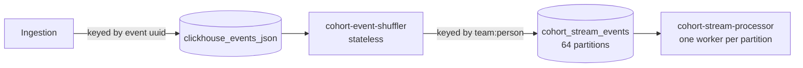

# Event routing and partition affinity

This page explains how events get from ingestion to the stream processor, and the partitioning rule that the whole pipeline depends on.
It covers the shuffler, the envelope it writes, and every topic that must share its partitioning.

## Why events are re-keyed

The processor keeps state per person: counters for each behavioral criterion, a record of which person-property criteria match, and the last computed membership of each cohort.
[Live evaluation](live-evaluation.md) describes that state.
To update it without locks, one worker must own everything about a given person.

Ingestion's firehose topic, `clickhouse_events_json`, is keyed by event UUID.
A person's events are spread across all of its partitions.
The **shuffler** (`cohort-event-shuffler`) fixes that.
It reads the firehose, keeps only the events the pipeline can use, and republishes them to `cohort_stream_events` keyed by `"{team_id}:{person_id}"`.
After the re-key, every event of one person lands on one partition, and the processor assigns each partition to one worker.



The shuffler is stateless and can run many replicas.
The processor is stateful, which is why routing matters so much.

## The shuffler

### Which events it keeps

Most firehose events are irrelevant to realtime cohorts, so the shuffler filters before it does any expensive work.
It parses every message in two phases.

1. **A cheap gate.**
   The first parse reads only `team_id` and whether `person_id` is present.
   Large fields such as `properties` and `person_properties` are skipped without being allocated.
2. **A full parse for survivors.**
   Only events that pass the gate are parsed completely and turned into the output envelope.

An event passes the gate when it has a person id and its team is in the **team index**.
The team index is the set of teams that have at least one realtime cohort, intersected with `REALTIME_COHORT_TEAM_ALLOWLIST`.
The shuffler rebuilds it from Postgres every few minutes and swaps it in atomically.

Apart from the person id check, the gate looks at the team only.
It cannot filter by event name: person-property criteria are re-evaluated from every event that carries person properties, whatever the event is called.
So every event from an enabled team with a person id is forwarded.

The shuffler consumes nothing until the team index has loaded once.
If Postgres is down when it boots, the shuffler lags and loses nothing, and it retries on its refresh interval.

### The envelope

Each forwarded event becomes a slim JSON record on `cohort_stream_events`.

```json
{
  "team_id": 7,
  "person_id": "0192f3a0-7c1e-7d2a-9b3c-000000000001",
  "distinct_id": "anon-7f3e",
  "uuid": "0192f3a1-0000-7000-8000-00000000abcd",
  "event": "$pageview",
  "timestamp": "2026-09-24 14:03:05.120000",
  "properties": "{\"$current_url\":\"/pricing\"}",
  "person_properties": "{\"email\":\"a@example.com\"}",
  "elements_chain": null,
  "source_partition": 3,
  "source_offset": 9870001
}
```

- `properties` and `person_properties` stay as raw JSON strings.
  The processor parses them only when a criterion needs them.
- `person_properties` is the person's properties as ingestion saw them for this event, including anything the event itself sets with `$set`.
  A change made any other way, such as an API edit or a person merge, is seen on the person's next event.
- Events ingested **without person processing** still carry a real `person_id` when the distinct id has a person, but their `person_properties` is an empty object.
  The envelope does not say which kind of event it is, so the processor evaluates those events as a person with no properties.
- `source_partition` and `source_offset` are the event's coordinates in the firehose.
  The processor uses them to recognize an event it already applied.
- Events that the processor re-keys after a person merge also carry `redirected_from` and `redirect_hops`.
  The shuffler never sets them.

### Delivery and commits

The shuffler sends forwards without waiting for each acknowledgment, and keeps a per-partition ledger of forwards still in flight.
The offset it commits for a firehose partition is the oldest offset still in flight, or one past the highest offset seen when nothing is in flight.
It commits every few seconds.

Across crashes and rebalances this is at least once: a restart replays the uncommitted tail, and the processor discards what it already applied.
But a forward that is not acknowledged within the producer's delivery timeout, for any reason, is **abandoned** and committed past.
During a broker or network outage, that is every forwarded event.
Other losses:

- a message that cannot be parsed,
- a forward the producer rejects outright, for example because it is too large,
- an event for a team that has just gained its first realtime cohort and is not yet in the team index.
  These are counted together with every other out-of-scope team, so they are not separately visible.

The consumer group starts at the tail of the firehose when it has no committed offset, or when its committed offset has aged out of the firehose's retention.
A shuffler outage longer than the retention silently skips the gap.
History is the backfill's job, not the shuffler's.

## Partition affinity

Partition affinity is the invariant everything else rests on.

> Every message about one person that can change that person's state is on partition `murmur2("{team_id}:{person_id}") mod 64` of a topic that shares this partitioning, and one worker owns that partition number on every such topic.

The partition function is Kafka's Java-client `murmur2`, masked to a positive number, modulo the partition count.
Because the same key and function are used everywhere, the processor can also compute where any person lives.
Person merges depend on that.

These topics must share the partitioning:

| Topic                         | Key                                               | Producers                                                                                                                                                      |
| ----------------------------- | ------------------------------------------------- | -------------------------------------------------------------------------------------------------------------------------------------------------------------- |
| `cohort_stream_events`        | `team:person`                                     | Shuffler. The processor also re-keys an event for a merged person to the survivor's partition                                                                  |
| `person_merge_events`         | `team:old_person`                                 | Node ingestion's Postgres-backed merge path, for teams in its own allowlist, after the merge commits                                                           |
| `cohort_merge_state_transfer` | `team:new_person`                                 | Processor, when a merge moves state to another partition                                                                                                       |
| `cohort_cascade_events`       | `team:person`                                     | Processor, for membership flips, when cascades are enabled                                                                                                     |
| `cohort_stream_seed_events`   | `team:person` for backfill tiles and person seeds | Seeder, and the processor when it re-keys a seed for a merged person. Reconcile requests are the exception: the seeder sends one to every partition explicitly |

[Merges and cascades](merges-and-cascades.md) covers merges and cascades.
[Backfill overview](backfill-overview.md) covers seeds and reconcile requests.

Two output topics are deliberately not co-partitioned.
The membership output topic is keyed by `person_id` alone and has its own partition count.
The reconcile marker topic is keyed per run and partition.
Neither is read back by the processor.

librdkafka's default partitioner is not `murmur2`, so every producer sets it explicitly.
The Rust producers configure `murmur2_random`.
The Node merge producer computes the partition itself, because the Node client ignores a global partitioner setting.
Test fixtures in Rust and Node pin the same key to the same partition.

### The partition count

The count is 64.
It is configured in three places: `COHORT_PARTITION_COUNT` on the processor and on the seeder, and `PERSON_MERGE_EVENTS_PARTITION_COUNT` on Node.
All of them must equal the topics' partition count.

Two of those are checked.
At startup the processor reads broker metadata and refuses to run unless the stream topic has `COHORT_PARTITION_COUNT` partitions and the merge and transfer topics match it.
It checks the cascade and seed topics the same way when those consumers are enabled.
The seeder refuses to produce to a seed topic with any other count.
Node's modulus is not checked against anything, so a mismatch there would misroute merges silently.

The processor runs one worker per partition, so 64 is also the pipeline's parallelism ceiling.
Changing the count would move almost every person to a different partition, and each worker's state would belong to someone else.
A change means wiping every store and rebuilding from backfills.
Treat the count as a constant of the system, not a tuning knob.

### What breaks if affinity breaks

If one producer computed partitions differently, a person's merge, cascade or seed would reach a worker that does not hold the person's state.
That worker would build state for the person from nothing, and the real owner would never see the message.
There is no error to catch.
Membership would silently diverge.

## Worked example

Team 7 has realtime cohorts and is allowlisted.
Person p-1 is `0192f3a0-7c1e-7d2a-9b3c-000000000001`.

1. Ingestion writes a `$pageview` from p-1 to firehose partition 3, at offset 9870001.
2. The shuffler's cheap gate reads `team_id: 7` and sees a `person_id`.
   Team 7 is in the team index, so the event passes.
3. The full parse builds the envelope with `source_partition: 3, source_offset: 9870001`.
4. The key is `"7:0192f3a0-7c1e-7d2a-9b3c-000000000001"`.
   `murmur2` of it, masked and taken modulo 64, is 26.
5. The shuffler sends to `cohort_stream_events` partition 26 and records offset 9870001 as in flight for firehose partition 3.
   Until the forward resolves, acknowledged or abandoned, the shuffler will not commit partition 3 past it.
6. The acknowledgment arrives.
   On the next commit tick, the shuffler commits partition 3 at 9870002, or later if it has read further and nothing older is in flight.
7. The processor's worker for partition 26 receives the event.
   Every later event, cascade and backfill seed for p-1 also arrives at worker 26.
   If another person is later merged into p-1, that merge message lands on the other person's partition, and the state it transfers comes to worker 26.

If the shuffler crashes after the acknowledgment in step 6 but before its commit, the new owner replays from the last commit and forwards the event again.
The processor sees firehose offset 9870001 from partition 3 for p-1 a second time and skips it.

## Optimizations

- **Two-phase parsing.**
  The gate parses two fields, and only survivors pay for a full parse.
  Most firehose events are discarded at the gate.
- **Pipelined forwarding.**
  Consuming, producing and committing run independently.
  Thousands of forwards can be in flight at once, so slow broker acknowledgments do not throttle consumption.
  For typical event sizes, the in-flight cap sits below the producer's byte queue, so the shuffler pauses cleanly instead of churning on a full queue.
- **Lock-free team index.**
  The refresh builds a new set and swaps a pointer.
  The hot path never waits on it.

## Things that surprise people

- The processor's event-name gate only skips behavioral evaluation, after the event is already on `cohort_stream_events`.
- The shuffler and the processor each read their own copy of `REALTIME_COHORT_TEAM_ALLOWLIST` at startup, and each polls Postgres on its own schedule.
  Only teams in both are processed, and a newly enabled team can lose a few minutes of events until both have refreshed.
  Merges also need the team in Node's merge allowlist, and backfills need it in the seeder's copy.
- The processor recognizes applied events with a high-water mark per firehose partition, not a set of offsets.
  The shuffler's producer does not guarantee ordering on retries, so an event that is overtaken by a later event from the same firehose partition is skipped as if it were a replay.
- The broker timestamp on `cohort_stream_events` is the shuffler's send time, not the event's time.
  The processor's live watermark, which paces backfill, is built from these timestamps.
  [Seed apply and reconcile](seed-apply-and-reconcile.md) explains why that matters.
- Person merge events from Node are best effort.
  They are produced after the Postgres transaction commits, and a failed send is logged and dropped.
