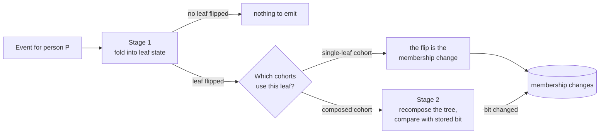

# Live membership evaluation

This page follows one event through the processor and explains how it turns into `entered` and `left` changes.
It covers the two stages of evaluation, behavioral leaves, person-property leaves, composition, replay safety, what a catalog edit does to live state, and the optimizations on the hot path.

Read [definitions and eligibility](definitions-and-eligibility.md) first for leaves, condition hashes, leaf state keys and eligibility classes.
Time windows and the sweep that produces "left because time passed" are in [time and eviction](time-and-eviction.md).

## The core idea: keep leaf state, compose on change

A batch system answers "who is in this cohort" by recomputing the whole cohort for every person on a schedule.
Its cost grows with the number of persons times the number of cohorts, whether or not anything changed.

The processor instead keeps a small piece of state for each person and each leaf.
That state answers the leaf without looking at any other person or at the person's event history.
Events update it, and the processor recomposes a cohort for a person only when one of that person's leaves changes its answer.
The work is proportional to the events that matter, not to the size of the cohort.

Evaluation happens in two stages.

- **Stage 1** folds an event into the person's leaf state and reports which leaves **flipped**, from false to true or from true to false.
- **Stage 2** recomposes each cohort that contains a flipped leaf and compares the result with the membership it stored last time.
  A difference becomes a membership change.



## The state a worker keeps

The processor's RocksDB store is divided into column families, separate keyspaces with their own settings.
Three of them hold the evaluation state.

| State                 | One row per               | Holds                                                                                                            |
| --------------------- | ------------------------- | ---------------------------------------------------------------------------------------------------------------- |
| Behavioral leaf state | person and leaf state key | The leaf's counters or last match, its eviction deadline, and replay marks                                       |
| Person record         | person                    | Which person conditions currently match, the fingerprints used to skip work, a freshness stamp, and replay marks |
| Stage 2 membership    | cohort and person         | The membership bit the processor last decided for the pair                                                       |

Behavioral rows and person records are keyed by partition, team and person first, so one person's Stage 1 state sits together on disk.
Stage 2 rows are keyed by partition, team, cohort and then person, so one cohort's rows sit together for reconcile to walk.
A fourth column family, the merge tombstones, is checked on every event.
[State store and durability](state-store-and-durability.md) has the key layouts.

A missing behavioral row reads as false.
Either the person never matched the leaf, or the sweep deleted the row after the match aged out.
A missing Stage 2 row means the processor holds no decision for that cohort and person.

## Life of an event

Each worker handles its partition's events one at a time, in offset order.
For one event the steps are:

1. **Find the team's definitions.**
   The worker takes one snapshot of the catalog for the whole event.
   An event for a team with no definitions is skipped.
2. **Follow merges.**
   The worker looks up the person in the merge tombstones.
   If the person was merged into another person, the event is redirected to the survivor.
   [Merges and cascades](merges-and-cascades.md) explains how.
3. **Plan, without touching the rest of the store.**
   - The event-name gate picks the behavioral conditions whose leaf names this event.
     If there are none, the behavioral side is done and its payloads are not parsed.
   - Otherwise the worker builds only the HogVM globals those conditions read, and parses each JSON payload that any behavioral condition of the team can read.
   - It runs each candidate condition once.
     Each condition that matches fans out to every leaf state key that shares its condition hash.
   - If the team has person conditions and the event carries person properties, the worker fingerprints the raw person properties for the person side.
4. **Read once.**
   One batched read fetches every behavioral row the plan needs and the person record.
5. **Fold, as a pure function.**
   The person side runs first, then each behavioral row.
   Each fold returns the new row and, if the leaf flipped, a transition.
6. **Write once.**
   All Stage 1 rows, the person record, and the Stage 2 rows of any single-leaf cohort whose leaf flipped go into one atomic RocksDB write batch.
   The section on Stage 2 below explains why single-leaf cohorts get Stage 2 rows too.
   The next event on the partition reads this write.
7. **Map single-leaf transitions.**
   A flip of a leaf that is the whole cohort becomes a membership change directly.
8. **Compose.**
   For each composed cohort containing a flipped leaf, Stage 2 recomputes the cohort for this person, and commits any changed bit in a second write batch.
9. **Buffer the changes, then schedule expiry.**
   The event's changes join the sub-batch's output buffer.
   Each behavioral row with a finite deadline is placed in the worker's eviction queue at its new deadline.
10. **Produce at the end of the sub-batch.**
    The worker produces the buffered changes and, with cascades enabled, one cascade message per change, then marks the offsets.
    [Processor runtime](processor-runtime.md#the-worker-loop) describes this step.

## Behavioral leaves

A behavioral leaf's state depends on its variant.

| Variant                       | Used for                                                  | State                                           | Member when                                                                                                                                                     |
| ----------------------------- | --------------------------------------------------------- | ----------------------------------------------- | --------------------------------------------------------------------------------------------------------------------------------------------------------------- |
| `BehavioralSingle`            | `performed_event`                                         | Whether it matched, and the newest match's time | It matched and the sweep has not yet deleted the row. The sweep deletes it after the newest match leaves the window. A window with absolute dates never expires |
| `BehavioralDailyBuckets`      | `performed_event_multiple` with a window of 1 to 180 days | One counter per team-timezone day in the window | The window's total is at least 1 and satisfies the operator, such as `gte 3`                                                                                    |
| `BehavioralCompressedHistory` | `performed_event_multiple` with a longer window           | A sparse list of days and counts                | Same as daily buckets                                                                                                                                           |

For windows counted in days, the window includes today.
"The last 7 days" is today plus the 7 days before it, which is 8 calendar days in the team's timezone.

Stage 1 never reads the wall clock.
A daily window's "today" is the later of the newest event day folded into it and the day of the last sweep that touched it.
When an event lands on a later day, the window slides forward to that day first, and then the event is counted.
For a row that already exists, an event older than the window's first day is recorded as seen but not counted.
With no row yet, such an event anchors a new window at its own day and is counted.
On the live path, only the sweep moves a window forward without an event.
Backfill tiles and merges also slide windows.
This keeps a replay deterministic: folding the same events in the same order always gives the same state.

A daily or compressed leaf can flip either way on an event.
With `gte 3`, the third matching event makes it true.
With `lte 2`, the third makes it false.
A `performed_event` leaf only flips to true on an event.
It becomes false only when the sweep deletes its row.

## Person-property leaves

Person conditions are evaluated from the `person_properties` snapshot that ingestion attaches to each event.
The processor never reads a `$set` payload.
It re-evaluates person conditions against the properties the event carries.
[Event routing](event-routing.md#the-envelope) explains what that snapshot holds, including the empty snapshot on events ingested without person processing.

Each person has one **person record**.
It stores the set of person condition hashes that currently match, plus:

- a **properties fingerprint**, a digest of the raw `person_properties` string last evaluated,
- a **catalog fingerprint**, a digest of the team's distinct person condition hashes when last evaluated,
- a **stamp**, the event time and firehose offset of the newest event applied.

For each event with person properties, the worker makes one of four decisions.

| Decision        | When                                                                                          | What happens                                                                                                                                        |
| --------------- | --------------------------------------------------------------------------------------------- | --------------------------------------------------------------------------------------------------------------------------------------------------- |
| Replay          | The record's replay mark for the event's firehose partition is at or above the event's offset | Nothing                                                                                                                                             |
| Stale           | The event is not newer than the stamp, comparing event time and then firehose offset          | Record the event as seen. Membership does not change                                                                                                |
| Skip evaluation | Both fingerprints match the record                                                            | Adopt the new stamp. No HogVM runs                                                                                                                  |
| Evaluate        | Either fingerprint changed, or there is no record                                             | Parse the properties, run every person condition of the team, diff against the stored set, and emit a transition for each hash that entered or left |

Most events run no person condition, because they are either stale or have unchanged fingerprints.
When something does change, the worker evaluates the team's whole set of person conditions, not only the ones touching the changed key.
There is no index from a property key to the conditions that read it.

The stamp makes person state converge to the newest event by event time.
A backdated event cannot overwrite properties that a newer event already applied.

If the person side must evaluate and `person_properties` does not parse, the whole event is skipped, behavioral leaves included.
On the other decisions the behavioral side still folds.

A condition removed from the catalog stays in a person's matched set without a `left`.
If the same condition returns later, even in a new cohort, persons still holding it get no `entered` from the live path.
Reconcile and backfill clean up membership for cohorts whose definitions changed.

## Replay safety

Events arrive at least once.
A crash, a rebalance or a shuffler retry can deliver the same event twice.
Counting it twice would corrupt a daily counter, so every behavioral row and every person record keeps **replay marks**: for each partition of the ingestion topic the shuffler reads, called the firehose in [event routing](event-routing.md), the highest offset folded into this row.
An event whose offset is at or below the mark for its firehose partition is a replay and changes nothing.

The marks are per row, not global.
Two leaves of the same person each know independently which events they already counted.
Rows that absorbed a merged person also keep that person's marks under the merged-away person's id, so a late event for the merged-away person is still recognized.

This check relies on one ordering property: events from one firehose partition for one person reach the processor in offset order.
If that breaks, an event that arrives after a higher offset from its firehose partition is dropped as a replay.
The marks also live inside their row, so when the sweep deletes a row, a redelivered old event is folded again.

## Stage 2: composing cohorts

On the event path, Stage 2 runs only when a Stage 1 leaf flips.
An event that changes counters without flipping any leaf never reaches Stage 2.
Cascades, backfill and reconcile also recompose cohorts, through the same code.

For each composed cohort that contains a flipped leaf, Stage 2:

1. reads the person's state for every leaf in the cohort's tree, and for a referenced cohort, its leaf state if it is single-leaf or its stored bit if it is composed,
2. folds the tree: `AND` needs every child, `OR` needs any child, and a negated leaf inverts its answer,
3. compares the result with the stored Stage 2 bit for this cohort and person,
4. on a difference, writes the new bit and emits `entered` or `left`.

Stage 2 recomputes the whole tree from stored leaf state every time.
So it is idempotent: running it twice gives the same bit, and a flip is emitted only when the stored bit changes.

A missing Stage 2 row reads as "not in the cohort".
A `left` writes an explicit `false` instead of deleting the row.
That way reconcile can later enumerate every person the store holds a decision for, including the ones it decided should leave.
Single-leaf cohorts get the same kind of row, written in Stage 1's batch, for the same reason.

The stored bit is the processor's decision, not proof that downstream received it.
On the live path the bit commits before the change is produced.

## Output

Each change is a small JSON message on the membership output topic, keyed by `person_id`.

```json
{
  "team_id": 7,
  "cohort_id": 42,
  "person_id": "0192f3a0-...",
  "last_updated": "2026-09-14 14:00:03.512344",
  "status": "entered"
}
```

- `status` is `entered` or `left`.
- `last_updated` is the processing time.
  Each step of a partition worker gets a stamp strictly newer than the previous one, and all changes caused by one input message share it.
  The downstream consumer uses it as the row version, so the newest change for each cohort and person wins.
  The order is guaranteed only within one worker's tenure on a partition.
  A new worker keeps no floor from the old one, so its stamps follow the wall clock.
- Backfill paths add `origin` and `run_id`.
  Live changes carry neither.

Live output is at most once.
State commits before the change is produced.
If the produce fails, the next successful batch commits past it, and a replay finds nothing left to emit.
The pipeline accepts this and relies on reconcile to repair the downstream table.
[Processor runtime](processor-runtime.md#delivery-semantics) lists every path's guarantee.

## What a catalog edit does to live state

The processor picks up a new catalog every few minutes and swaps it in.
It does not re-evaluate anything at that moment.
Every change applies lazily, person by person, on their next relevant event, flip, sweep, backfill or reconcile.

- **A leaf with a new leaf state key**, from a changed window, threshold or matcher, starts with no state unless another cohort of the team already uses it.
  Live events fill it from now on.
  Unless another cohort still uses the old key, its rows become orphans: never deleted, with their eviction entries dropped by the sweep.
  If the edit is reverted, those stale rows are read again.
- **The swap itself retracts no member the edit disqualifies.**
  Take `gte 3` edited to `gte 5` on a single-leaf cohort: a member with 4 events starts counting from zero on the new key, never flips, and stays in the cohort until reconcile corrects them.
  This holds whether or not the person sends events.
  In a composed cohort, the next flip of another of the person's leaves recomposes the new tree, which reads the empty new key as false, so the member can leave before reconcile.
- **A composition edit** keeps every leaf's state.
  A person is recomposed under the new tree when one of their leaves next flips, or, with cascades on, when a cohort it references flips for them.
- **A change to the set of distinct person conditions** changes the catalog fingerprint, so every person in the team is re-evaluated on their next event with person properties.
  A new cohort that reuses a person condition the team already has does not change the fingerprint, so the reused condition makes no transition.
  Its current matchers enter a single-leaf cohort only through the backfill, and a composed cohort through the backfill or the next flip of one of its other leaves.
- **A cohort that is deleted, stops being realtime, or becomes excluded** stops producing output.
  No `left` is emitted, and Stage 2 garbage collection later deletes its rows silently.

That is why every definition change owes a backfill run, which includes a reconcile.
Django creates it automatically only for teams on the backfill trigger allowlist.
[Backfill coordination](backfill-coordination.md) explains when runs are created, and [backfill overview](backfill-overview.md) how they repair membership.

## Worked example

Team 7 uses UTC.
Cohort 42 is `AND[A, B]`:

- A: performed `$pageview` where the URL contains `/pricing`, 3 or more times in the last 7 days.
  Daily buckets, 8 buckets.
- B: person property `email` is set.

Cohort 43 is `AND[B]`, a single-leaf cohort on the same person condition.
Person p-1 lives on partition 26.

### The third pageview

Before, on 2026-09-14 at 14:00 UTC:

- A's row for p-1 counts 2 pageviews today, and its buckets are `[0,0,0,0,0,0,0,2]`.
- p-1's person record has `B` in its matched set, and its fingerprints match the current properties and catalog.
- Stage 2 has a `true` row for cohort 43 and no row for cohort 42.
  When B matched earlier, cohort 42 composed to false, so nothing was written.

A third `/pricing` pageview arrives.

1. The tombstone lookup finds no merge for p-1.
2. The `$pageview` bucket holds A's condition hash.
   The worker builds globals with only `event` and `properties`, and the condition matches.
3. One batched read fetches A's row and the person record.
4. Person side: the event is newer than the stamp and both fingerprints match, so the decision is "skip evaluation".
   The record takes the new stamp.
5. A's fold: today is still the window's last day, so the last bucket goes from 2 to 3.
   `gte 3` was false and is now true, so A flips.
6. One write batch commits A's row and the person record.
7. No single-leaf cohort uses A.
8. Stage 2 recomposes cohort 42: A is true, B is true, so `AND` is true.
   The stored bit is absent, which reads as false, so this is a flip.
   A second batch writes `true` for cohort 42.
9. The change is buffered, and A's eviction deadline is rescheduled, unchanged because the oldest counted day did not change.
10. At the end of the sub-batch, the worker produces `entered` for cohort 42 and p-1.

If the same event is redelivered, A's row and the person record both see its offset at or below their marks, and nothing happens.

### Email is removed

Two days later, p-1 sends an event whose `person_properties` no longer contain `email`.

1. The event name matches no behavioral condition, so the behavioral side parses nothing.
2. The properties fingerprint differs from the record, so the decision is "evaluate".
3. The worker parses the person properties and runs every person condition of team 7.
   B is now false.
   The diff against the stored set emits a `left` transition for B.
4. One write batch commits the new person record and an explicit `false` Stage 2 row for cohort 43.
5. Cohort 43 is a single-leaf cohort, so its `left` is emitted directly.
6. Stage 2 recomposes cohort 42: A is still true from its stored buckets, and B is false, so `AND` is false.
   The stored bit was true, so this is a flip.
7. The worker produces two `left` changes, for cohorts 43 and 42.

### Why a composed cohort can lag

Suppose p-1's pageviews age out while p-1 sends no events.
Nothing in Stage 1 runs until the sweep reaches A's deadline.
[Time and eviction](time-and-eviction.md#worked-example) continues from "the third pageview", with p-1 keeping their email.

## Optimizations on the hot path

- **One Stage 1 read and one Stage 1 write per event.**
  A person's Stage 1 state is clustered under one key prefix, so the snapshot is one batched read of a few adjacent blocks, after one tombstone lookup.
  A flip that recomposes a cohort adds a few reads and a second write batch per cohort.
  In a same-load comparison, clustering the keys this way and folding all person-property state into one record with fingerprints cut reads and CPU per event by more than an order of magnitude.
- **The event-name gate.**
  Conditions are bucketed by the event their leaf names.
  An event only runs the conditions in its bucket, and an event with an empty bucket parses nothing for the behavioral side.
- **Evaluate once per condition, then fan out.**
  Cohorts and windows that share a matcher share one VM run per event.
- **Programs decoded once per catalog.**
  Swapping programs between conditions costs two reference-count bumps instead of a decode.
- **Globals built by move.**
  Parsed payloads move into the globals map without a second copy.
  In a benchmark on a large event, that roughly halved the cost of building globals.
- **Globals built by plan.**
  Static analysis of the team's conditions decides which globals to build and which payloads to parse.
  An event whose candidate conditions read only `properties.$current_url` never materializes the person object.
- **Fingerprints skip person evaluation.**
  An event whose person properties and team person conditions are unchanged runs no person condition.
- **No match, little work.**
  An event with no matching condition and no person side skips the snapshot read and the write, after its tombstone lookup.
  Stage 2 writes only on a flip, so persons who were never members leave no Stage 2 rows.

## Things that surprise people

- A catalog refresh does not re-evaluate anyone.
- Person conditions update only from events that carry person properties, and only when the event is the newest one seen for that person.
- Events ingested without person processing carry empty person properties, so they can flip person conditions off until the person's next normal event.
- A HogVM error reads as false.
  For a person condition that was true, that emits `left`.
- A late event older than a window, for a person with no row for the leaf, creates state anchored at that old day.
  It can emit `entered`, and the next sweep emits `left` shortly after.
  This applies to both `performed_event` and count leaves.
- Excluded cohorts still cost Stage 1 work, because their valid leaves are indexed and maintained.
- One event can cause two write batches, one for Stage 1 and one for Stage 2.
  A crash between them, or a store error in Stage 2, loses the composed flip.
  A later flip repairs it, and so does reconcile if the person already had a Stage 2 row for the cohort.
  A store error in Stage 1 drops the event entirely, and reconcile cannot bring it back.
