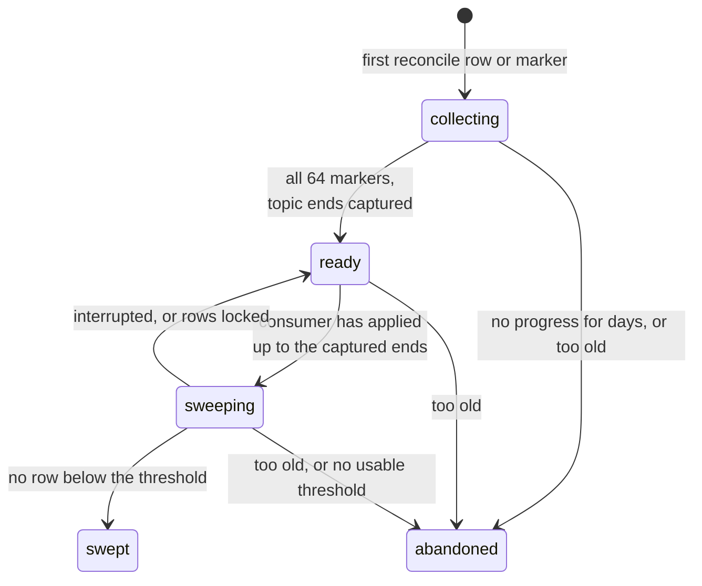

# Membership output and its readers

The processor's output is a stream of per-person `entered` and `left` changes.
This page follows those changes to where they are used: a Node consumer writes them into a Postgres table, a mark-and-sweep removes rows no reconcile vouches for, and feature flags and workflows read the table.
It uses terms from [live evaluation](live-evaluation.md), notably the processor's Stage 2 rows, one membership decision per cohort and person, and from [completion and readiness](completion-and-readiness.md), notably readiness stamps.

## What the processor emits

Most of the processor's topics are internal to the pipeline.
Two of them are read outside it.

**Membership changes**, one message per person, cohort and change, keyed by `person_id`:

```json
{
  "team_id": 7,
  "cohort_id": 42,
  "person_id": "0192f0a1-...",
  "last_updated": "2026-09-20 10:15:03.123456",
  "status": "entered",
  "origin": "reconcile",
  "run_id": "01928c3e-..."
}
```

- `status` is `entered` or `left`.
- `last_updated` is the change's **version**: processing time with microseconds.
  Each step of a partition's worker gets a stamp strictly newer than that worker's previous one.
  All changes caused by one input message, and all rows of one reconcile page, share a stamp.
  The worker keeps its last stamp only in memory.
  After a restart or a partition move, the new worker's stamps follow the wall clock, so a clock that went back can stamp a newer change below an older one.
- `origin` and `run_id` are set only by backfill: `seed` for seed apply, `reconcile` for reconcile.
  Live changes carry neither.

The processor's output topic is configured by `COHORT_MEMBERSHIP_CHANGED_TOPIC`.
Its compiled default is `cohort_membership_changed_shadow`, which only a parity diagnostic reads, so a deployment must point it at `cohort_membership_changed` for the table to fill.

**Reconcile markers**, on `cohort_reconcile_markers`, one per cohort, run and processor partition, produced after that partition's reconcile rows were all acknowledged:

```json
{
  "type": "reconcile_complete",
  "team_id": 7,
  "cohort_id": 42,
  "partition": 17,
  "run_id": "01928c3e-...",
  "last_updated": "..."
}
```

The seeder reads markers to decide run completion.
The membership consumer reads them to decide when stale rows may be deleted.

The 64 processor partitions that markers count are unrelated to the partitions of the membership topic, which has its own count.

## The `cohort_membership` table

The table lives in a dedicated Postgres database for behavioral cohorts, separate from the main PostHog database.
If the Node service has no URL for that database, it silently writes to the main Postgres instead.

```text
cohort_membership
  team_id, cohort_id, person_id   unique together
  in_cohort                       true after entered, false after left
  version                         the producer's last_updated; '-infinity' for a row no versioned write has touched
  last_updated                    when the consumer wrote the row
```

The table holds `in_cohort = false` rows as well as members.
Reconcile writes a `left` row for every person the processor holds a Stage 2 row for and who is not a member, so row count is not member count.
Readers only trust `in_cohort = true`, and a missing row means "not a member".

## The membership consumer

A Node service in the CDP plugin server consumes `cohort_membership_changed` in batches.

Two settings, both off by default, decide how much of what follows runs:

- `COHORT_MEMBERSHIP_VERSION_WRITES_ENABLED` turns on the versioned, transactional write described below.
  Without it, the consumer does one plain upsert per batch, and the last message in Kafka order wins.
- `COHORT_MEMBERSHIP_SWEEP_ENABLED` turns on the marker consumer and the sweep.
  It requires version writes and the marker topic.

With version writes on, for each batch the consumer:

1. parses and validates every message,
2. keeps one change per `(team, cohort, person)`: the highest version, with Kafka order breaking ties,
3. runs one transaction that
   - upserts the rows, applying a change only if its version is at least the stored version,
   - for reconcile rows, records the lowest version each `(run, cohort)` wrote, its **snapshot minimum**,
   - records, per topic partition, how far the consumer has applied,
4. commits the Kafka offsets after the transaction.

The version guard makes the consumer idempotent and safe against reordering.
A replayed or late change cannot overwrite a newer one, and a crash only replays batches whose rows are already applied or rolled back.
Recording progress in the same transaction as the rows means progress never claims rows that rolled back.

A change with no `last_updated`, or with one that does not match the producer's fixed-width format, is still applied, but without ordering: it overwrites the row whatever its version, and an off-format value is counted.
A reconcile row like that also drags its run's snapshot minimum to the lowest possible value, so that run sweeps nothing.
The consumer checks only the format.
A value in the right format that Postgres cannot read as a timestamp, such as one with a thirteenth month, or an empty string, reaches the database and fails the whole batch.

A message that fails validation fails the whole batch every time.
There is no dead-letter queue, so a malformed message stops the feed until it is skipped or the code is fixed.

## Mark and sweep

Live output is at most once, and a cohort edit or a person merge can leave rows that no longer match.
Reconcile re-emits every person the processor holds a Stage 2 row for, but re-emitting only overwrites rows.
It cannot remove a row for a person the processor no longer holds any row for, such as a person merged away.
The sweep does that.

The idea: every row a reconcile wrote carries a version at least as new as the oldest row that reconcile wrote.
Any row of the cohort with an older version was not written by that reconcile, nor by anything since, so it is stale.



A ledger row per `(run, cohort)` tracks the process.

1. **Collecting.**
   The consumer records the snapshot minimum as reconcile rows arrive.
   A separate marker consumer sets one bit per processor partition as markers arrive, and records the lowest marker version.
2. **Ready.**
   When all 64 bits are set, the sweeper records the current end of every partition of the membership topic.
   Every reconcile row was produced before its partition's marker, so every row of this snapshot sits below those ends.
3. **Gate.**
   The sweeper waits until the consumer fleet has applied the membership topic up to those ends.
   Sweeping earlier would delete rows whose reconcile copies are still queued.
4. **Sweep.**
   The **threshold** is the lower of the snapshot minimum and the marker minimum.
   The sweeper deletes the cohort's rows with a version below the threshold, in small pages, skipping rows another writer has locked.
   A row the consumer refreshed in the meantime has a newer version and survives.
5. **Swept.**
   When no row below the threshold remains, the run is done.

The threshold needs the snapshot minimum.
Each partition stamps its marker after its own rows, so any marker, even the earliest, is newer than rows the run wrote.
A threshold built from markers alone would delete rows the run had just re-asserted.
Taking the lower of the two can only make the sweep delete less.

The consumer knows nothing about Django's supersession.
A run that an edit superseded after its reconcile was dispatched can still collect all 64 markers.
The processor discards the remaining requests only when the edit moved the shape hash of the run's kind, and it cannot take back markers it already produced.
A run with every marker sweeps like any other run.
A run whose markers stay incomplete never leaves `collecting`, and it is abandoned after a few days.

### What the table converges to

After a swept reconcile, the table holds the processor's Stage 2 state for the cohort, plus any row written at or after the reconcile began.
It converges to what the processor believes, not to the cohort's definition.
A true member for whom the processor holds no Stage 2 row gets no reconcile row, and the sweep deletes their old row.

Some rows are never swept:

- when the sweep is disabled,
- rows of a cohort that was never reconciled, or whose reconcile emitted nothing,
- rows of a cohort whose run never completed its markers, for example because an edit moved its kind's shape hash before every partition reconciled, or a marker was lost,
- rows of a cohort whose reconcile included a change with no usable version,
- rows of a cohort that was deleted, made static, or left the realtime pipeline, once any run that already had every marker has swept,
- rows of a team that is no longer enabled.

## Feature flags

The Rust flags service reads the table when a flag condition targets a realtime cohort.

### When a cohort is read from the table

For each request on a team in `REALTIME_COHORT_EVALUATION_TEAM_IDS`, the flags service routes a cohort to the table only if:

- the cohort's type is `realtime`, or the legacy `behavioral` type,
- its `condition_type` marks a behavioral or lifecycle condition,
- its [readiness stamps](completion-and-readiness.md#what-readiness-unlocks) satisfy the configured stamp policy.

`condition_type` is derived by Django on save.
A cohort whose `condition_type` is empty is never routed, and resaving it fills the column.

Every other non-static cohort is evaluated dynamically from the person's properties, where a behavioral condition can never match.

### How it reads

1. The service collects every routed cohort among the cohorts in the team's flags payload, or among all the team's cohorts when the payload carries none.
2. It makes at most one query per request for the person, for the routed cohorts its cache does not already hold: which of them have an `in_cohort = true` row.
3. Answers are cached per pod, per team and person, for about a minute.
   Adding a cohort to an existing entry restarts the timer for the whole entry, so an older answer can outlive that minute.
4. The routed cohorts' answers are merged into the cohort matches before flag conditions are evaluated.

Because the routed set comes from every flag in the team's payload, one flag on a routed cohort adds this lookup to every request of the team that evaluates person properties.

### When the read fails

A query error, a timeout, or a person with no known id makes every routed cohort **false** for that request.
A condition "in cohort 42" then fails, and a condition "not in cohort 42" **passes**.
The error is counted and logged, and not cached.

If the team list is set but the read database is not configured, the service installs a provider that answers false for every routed cohort on every request.

### Authoring versus reading

Django decides whether a flag may be saved with a realtime cohort.
Behind the realtime targeting rollout flag, it accepts a cohort with event-based criteria only when the cohort is flag-compatible, meaning every readiness stamp its filters need is set.

The flags service never reads that rollout flag.
It decides, per request, where to read membership from, using its own routing rules.
An existing flag keeps being evaluated whatever the rollout flag says, and the stamp policy can accept fewer stamps than Django requires.

## Workflows

The workflows executor reads the table from `conditional_branch` and `wait_until_condition` actions whose compiled condition calls `inCohort` or `notInCohort`.
When evaluation reaches such a condition, it loads the person's full set of `in_cohort = true` cohorts once per action and passes it to the condition.
An invocation with no person is a non-member of every cohort.

A failed lookup fails the action.
With the default error handling, the run then takes the branch's fall-through edge, the same edge it takes when no condition matches.
With `abort`, the run stops.
The lookup is not retried.

No workflow save path compiles a cohort condition yet: the compiler rejects cohort filters in workflow conditions.
This read path is therefore dormant.

## Worked example

Team 7 has cohort 42, "performed `$pageview` in the last 30 days", with its events readiness stamp set.
The flags service has team 7 in its reader list, and flag `new-checkout` targets cohort 42.
The table starts with:

| person | in_cohort | version             | how it got there                                                                                                                              |
| ------ | --------- | ------------------- | --------------------------------------------------------------------------------------------------------------------------------------------- |
| p-2    | true      | 2026-08-10 09:00:00 | a live `entered`. On 2026-09-10 the sweep expired p-2 and wrote `false` in the processor, but the `left` produce failed, so this row is stale |
| p-3    | true      | 2026-08-20 08:00:00 | a live `entered`. On 2026-09-15 p-3 was merged into p-1, and the merge deleted p-3's Stage 2 rows without emitting anything                   |

**A live change.**
On 2026-09-20 at 10:15 p-1 enters cohort 42.
The consumer upserts `(7, 42, p-1, true, version 10:15:03.123456)` and records its progress on the topic partition, in one transaction.

**A reconcile.**
On 2026-09-21 at 03:00 a reconcile runs for cohort 42.

1. The processor re-emits every Stage 2 row of the cohort:
   p-1 `entered` at 03:00:00.514002, and p-2 `left` at 03:00:00.214331 from its stored `false`.
   The processor holds no row for p-3, so nothing is emitted for p-3.
2. The consumer applies both rows.
   p-2's row becomes `in_cohort = false`.
   The ledger row for the run records a snapshot minimum of 03:00:00.214331.
3. All 64 markers arrive.
   At its next tick, the sweeper records the membership topic's ends and waits until the consumer has applied up to them.
4. Assuming no marker is older, the threshold is 03:00:00.214331.
   The sweeper deletes cohort 42's rows with an older version: p-3's row goes.
   p-1 and p-2 are newer and stay.

**A flag request.**
At 03:05, `/flags` for p-1 routes cohort 42 to the table.
The query finds `in_cohort = true` for cohort 42, so the condition matches.
The same request for p-2 finds `in_cohort = false`, and for p-3 finds no row, so neither is in cohort 42.
Before the reconcile, both p-2 and p-3 would have matched.

## Things that surprise people

- `cohort_membership.last_updated` is when the consumer wrote the row.
  The producer's version is in `version`.
- A table in ClickHouse is also named `cohort_membership`.
  It is a separate, legacy copy, and the flags service does not read it.
- The processor's changes reach flags through several hops: Kafka, the consumer's batch, the database through the flags service's read connection, and the flags pod's cache.
  Workflows read through the Node services' read-write pool for that database and do not cache.
- A readiness stamp does not mean the consumer has applied the reconcile or that the sweep has run.
- The partition count, 64, is also a constant in the Node consumer.
  If the processor ran fewer partitions, no run would ever complete its bitmap, and no sweep would ever run.
- A cohort that references a realtime cohort and is itself evaluated dynamically does not use the table answer for the referenced cohort.
  The referenced cohort is recomputed dynamically, where its behavioral leaves are false.
  Django still lets such a flag be saved, because it checks the referenced cohort's readiness, not how it will be read.
