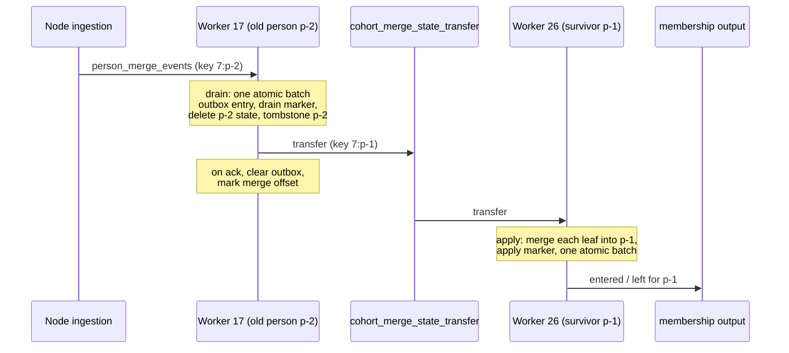

# Person merges, cascades and Stage 2 cleanup

This page covers three mechanisms that change membership without a plain event for the person:

- **person merges**, when ingestion merges one person into another and the processor must move the merged-away person's state onto the survivor,
- **cascades**, when a cohort references another cohort and the referenced cohort's membership flips,
- **Stage 2 garbage collection**, when a cohort leaves the catalog and its stored membership rows must go.

It assumes [live evaluation](live-evaluation.md), especially leaf state, replay marks and Stage 2 rows, and the offset tracking in [processor runtime](processor-runtime.md#offset-tracking).

## Person merges

### Why the processor must handle merges

When ingestion identifies two persons as the same user, it merges the old person into a new one in Postgres.
From then on, every event of that user carries the new person id.
But the processor keyed all the old person's history under the old id, and possibly on another partition.
Without help, the survivor would be missing everything the old person did.
A survivor with one `/pricing` pageview would stay out of "3 or more pageviews" even though the user made three.

So the processor moves the old person's leaf state onto the survivor and folds it in.

### Where merges come from

After a person merge commits in Postgres, Node ingestion produces a message to `person_merge_events`.
In this example `p-2` and `p-1` stand for person UUIDs:

```json
{ "team_id": 7, "old_person_uuid": "p-2", "new_person_uuid": "p-1", "merged_at_ms": 1789912800000, "schema_version": 1 }
```

The key is `"{team_id}:{old_person_uuid}"`, so the message lands on the old person's partition.
The producer is gated per team and best effort.
A failed send is logged and dropped.

### The protocol

A merge runs in two phases, one on each person's partition.



**Drain, on the old person's worker.**

1. Check the drain marker, keyed by the merge message's partition and offset.
   If this merge was already drained, skip the drain, and if its outbox entry is still there, produce it again.
2. Read all of the old person's behavioral rows with one prefix scan, and the replay marks from its person record.
3. Work out where the survivor lives.
   The processor computes the survivor's partition with the same partitioner everything else uses.
4. Commit one atomic batch that removes the old person and leaves a forwarding address:
   - delete the old person's leaf rows and person record, and the Stage 2 rows of every cohort the current catalog tracks,
   - write a **tombstone** that maps the old person to the survivor,
   - write the drain marker,
   - if the survivor is on another partition and the old person has state to move, write an **outbox** entry holding that state.
5. If the survivor is on the same partition, the same batch also merges the state into the survivor directly.
   This is the fast path: no transfer and no apply marker.
   The worker then produces the survivor's membership changes, as in apply step 4.
6. Otherwise, produce the outbox entry to `cohort_merge_state_transfer`, keyed by the survivor.
   After the acknowledgment, clear the outbox and mark the merge offset.
   If there was nothing to move, mark the offset without producing.
   If the produce keeps failing, the outbox entry stays and a periodic redrive retries it.

Stage 2 rows of cohorts no longer in the catalog are left for Stage 2 garbage collection.

**Apply, on the survivor's worker.**

1. Skip if this transfer was already applied on this partition.
   An apply marker keyed by the original merge message's coordinates records that, so duplicates produced by redelivery, redrive or a retried send are all recognized.
2. If the survivor was itself merged away in the meantime, follow its tombstone.
   Apply to the final survivor on this partition, or forward the transfer to the next survivor's partition, which keeps resolving, up to a hop limit.
3. Read the survivor's rows for every transferred leaf in one batched read, merge each pair, and commit the result with the apply marker in one atomic batch.
4. Map any leaf flips to membership changes, run Stage 2 for composed cohorts, and produce the changes.

Apply markers are local to a partition.
If a chain later grows onto another partition, a duplicate that follows it there can apply twice.

### How two states merge

Each leaf merges according to its variant.

| Variant            | Merge rule                                                                                  |
| ------------------ | ------------------------------------------------------------------------------------------- |
| `BehavioralSingle` | Matched if either matched. Keep the newer match time and the later deadline                 |
| Daily buckets      | Slide both windows to the more recent window start, then add the counts day by day          |
| Compressed history | Slide both to the more recent window start, then combine counts by day                      |
| Replay marks       | The survivor keeps its own marks. The old person's marks are kept under the old person's id |

A daily window starts N days before the newest day it has counted, so the two persons' windows can start on different days.
Aligning them first is what makes the day-by-day sum line up.

Adding counts is right because each live event was folded into exactly one of the two persons.
One narrow race breaks that: a backfill tile scanned after the merge, which already counts the old person's events under the survivor, can land on the survivor before the transfer does.

The replay-marks rule matters for late events.
An event for the old person that is re-addressed to the survivor keeps its own firehose coordinates, the event's partition and offset on the ingestion topic.
The survivor checks them against the marks kept under the old person's id.
An event the old person already counted is skipped, and a new one is counted.

A leaf that the survivor's current catalog no longer knows is dropped.
The person record does not travel: the survivor's matched person conditions follow its own person properties on its next event.
When register transfer is enabled, the old person's Stage 2 rows ride along too, but they only fill rows the survivor lacks.

### Stragglers and tombstones

Events for the old person keep arriving for a while after the merge.
Every event first checks for a tombstone on its person.

- If the survivor is on the same partition, the worker rewrites the event to the survivor and folds it in place.
- If the survivor is on another partition, the worker re-produces the event to `cohort_stream_events` keyed by the survivor.
- Chains such as `A → B → C` are followed through successive tombstones, with a hop limit that stops a corrupt cycle.

Drain and apply markers are kept one day longer than the merge and transfer topics' retention, measured from the merge time, so a redelivered merge still finds its marker.
Tombstones are kept one day longer than a late event can take to arrive.
Both are settings sized to the topic retentions, and nothing checks that they still match.

The outbox is never garbage-collected.
Until the transfer is acknowledged, it is the only copy of the old person's state.
A partition revoke still deletes it with the rest of the slice.

### Worked example

Cohort 44 on team 7 is a single leaf: 3 or more `/pricing` pageviews in the last 30 days.
Single-leaf cohorts also keep a Stage 2 row, the processor's last decision for the person.
Person p-2 lives on partition 17 and made two matching pageviews, on 2026-09-18 and 2026-09-19.
Person p-1 lives on partition 26 and made one, on 2026-09-20.
Neither is a member.

1. On 2026-09-20, ingestion merges p-2 into p-1 and produces the merge message to partition 17.
2. Worker 17 drains p-2.
   p-1 is on partition 26, so this is the slow path.
   One batch writes the outbox entry, the drain marker and a tombstone `p-2 → p-1`, and deletes p-2's rows.
3. Worker 17 produces the transfer to partition 26, then clears the outbox and marks the merge offset.
4. Worker 26 applies it.
   p-2's window starts one day earlier than p-1's, so p-2's buckets slide by one day.
   The counts add up to 3 across 2026-09-18, 2026-09-19 and 2026-09-20.
5. `gte 3` flips to true.
   The batch writes p-1's merged row, a Stage 2 row for cohort 44 and the apply marker.
   The row's new deadline comes from its oldest counted day, 2026-09-18.
6. Worker 26 produces `entered` for cohort 44 and p-1.

A few seconds later a p-2 pageview that was in flight reaches worker 17.
The tombstone points to p-1 on partition 26, so worker 17 re-produces the event keyed by p-1.
Worker 26 checks it against p-2's marks, finds it new, counts it, and p-1's total becomes 4 without a flip.

### What merges do not do

- **No `left` for the old person.**
  The drain deletes the old person's state silently.
  Downstream rows for the old person stay until the next backfill of that cohort.
  Its reconcile does not re-tell the old person, because the drain deleted the old person's Stage 2 rows, so the downstream sweep deletes those rows.
  Reconcile runs only as part of a backfill.
- **Merge output is at most once.**
  Merge state is applied once and survives failures, but membership changes are produced after the state commits.
  A lost change is repaired only by reconcile.
  [Processor runtime](processor-runtime.md#delivery-semantics) explains what at most once does and does not rule out.
- **A lost merge message is never detected.**
  The old person's state stays under the old id, the survivor under-counts, and stragglers keep folding into the old person.
  A backfill gives the survivor the right counts, because the seeder resolves persons through the merge overrides in ClickHouse.
  The old person's leftover state is not removed by it.
- **A cross-partition transfer that keeps failing blocks the old person's worker**, and so every event on that partition, for up to about half a minute of inline retries, before the redrive takes over.

## Cascades: cohorts that reference cohorts

A cohort can include another cohort as a leaf: "in cohort 51 and email is set".
Its membership depends on the referenced cohort's membership, which the processor also computes.
When cohort 51 flips for a person, every cohort that references 51 must be recomposed for that person.

Cascades are disabled by default.
With cascades off, a cohort that holds any cohort reference is excluded and emits nothing.
With cascades on, the catalog promotes a referencing cohort to `Stage2ComposableRef` when every cohort it references positively is in the team's catalog and itself single-leaf or composable, and there is no reference cycle.

A reference reached only through negation never blocks promotion.
A missing referenced cohort reads as "not a member", and negated that is "true".
That answer is wrong for anyone who really is in the untracked cohort.
"Email is set and not in cohort X", with X static or not realtime, matches every person with an email, including X's real members.

### How a cascade flows

1. With cascades on, every membership flip produces a **cascade message** keyed `"{team}:{person}"` to `cohort_cascade_events`, whether or not any cohort references the flipped one.
   This applies to flips on the live, merge, sweep, seed-apply and reconcile paths.
   The sweep and reconcile send them only for recomposed cohorts.
   The message carries the flipped cohort, a depth, and the chain of cohorts visited so far.
2. The topic is co-partitioned with the event stream, so the message comes back to the same worker, the one that owns the person's state.
3. The worker finds every cohort that references the flipped cohort and recomposes each referrer that composes.
   It reads a single-leaf referenced cohort from its leaf state, a composed one from its Stage 2 row, and an untracked one as not a member.
4. For each referrer that flips, it produces the membership change and, if the chain may continue, a further cascade message.
5. Only after both produces are acknowledged does it write the referrers' new Stage 2 bits and mark the offset.
   A failure pins the partition's cascade commit at that message.
   Kafka redelivers it after the next restart or rebalance, and the redelivered message recomputes the same flip.
   Until then, cascade commits for that partition stall.

Three limits bound the work:

- a **depth cap** on onward hops,
- a **cycle check**: a hop to a cohort already in the message's chain is dropped,
- a **fan-out cap** on how many referrers one message considers.
  Referrers past the cap are not recomposed.

Cycles are also removed at catalog build, where any cohort in a reference cycle is excluded.

### Cascade caveats

- First cascades on the live, merge and sweep paths are produced after the flip is committed, so a lost one is not retried.
  Seed apply and reconcile produce before they write state, so theirs are retried.
- A sweep expiry of a single-leaf cohort produces no cascade.
- A referrer that missed a cascade catches up only when one of its own leaves flips.
- A cohort built only from references has no leaves of its own.
  It is recomposed only by cascades.
  Django never creates a backfill run for it, so no reconcile covers it either.

## Stage 2 garbage collection

When a cohort is deleted, stops being realtime, or becomes excluded, its Stage 2 rows are useless.
Once an hour each worker scans a bounded slice of its Stage 2 rows and deletes rows whose cohort no longer registers membership in the current catalog.
It resumes from a cursor, so large partitions are covered over several runs.

Rows received through a merge are the exception.
With register transfer enabled, a merge records a person-first inventory entry for each row it moves onto the survivor, and the collection never deletes a row that still has one.
The protection ends when the row is deleted, when a local evaluation overwrites it, or when the current catalog registers the cohort with the same register kind the transfer carried.
A catalog that registers the cohort with a different kind, for example after an edit from one leaf to two, does not end it, and only a local evaluation does.
Absence from the catalog alone does not end it either, so a transferred row for a cohort that never comes back stays, with its inventory entry.

Two gates protect it.
It never runs before the first catalog load, and it never runs when the catalog is empty, because an empty catalog after a database hiccup would otherwise wipe everything.

The collection deletes rows without producing `left`.
Downstream rows for a deleted cohort are not retracted by the processor.

Behavioral leaf rows orphaned by an edit are not collected.
They stay until a merge drain or a partition wipe removes them.
