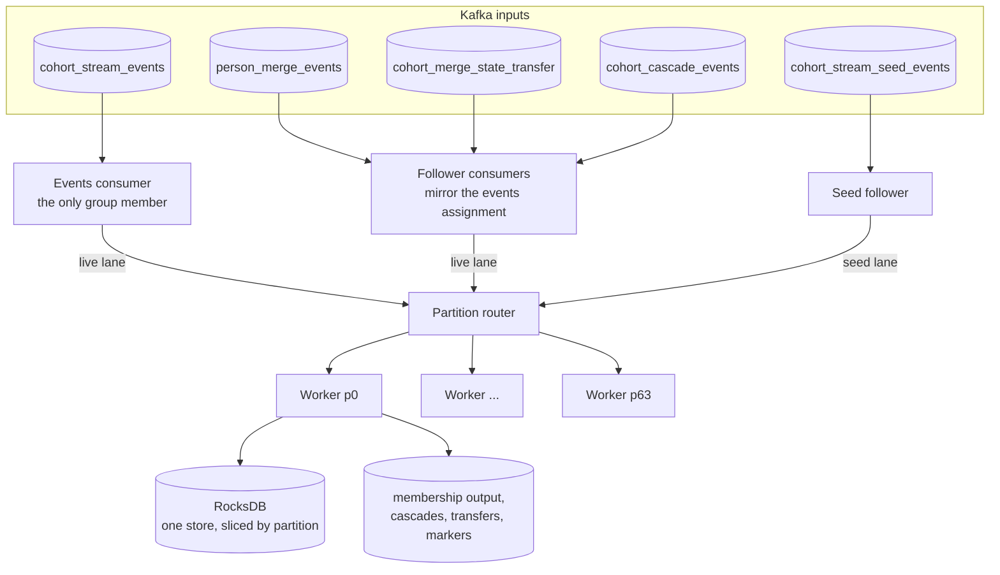

# Processor runtime

This page describes the skeleton of `cohort-stream-processor`: how it consumes its topics, how work reaches the per-partition workers, how offsets are tracked and committed, and what each path guarantees about delivery.
What a worker does with one event is in [live evaluation](live-evaluation.md).
How state is stored is in [state store and durability](state-store-and-durability.md).

## The shape of the process

The processor is deployed as one pod, which owns every partition, 64 by default.
Inside it, one worker task per partition owns that partition's slice of an embedded RocksDB store.
Everything that can change a person's state reaches that person's worker, in order, through two queues called lanes.

Timers feed the same workers.
The eviction sweep, the pending-transfer redrive, merge garbage collection and the reconcile drain all send messages through the router instead of touching the store themselves.
So while a worker runs, it is the only writer of its partition, and nothing needs a lock.
Boot recovery and revoke cleanup are the only code that touches a slice from outside its worker, and they do so when no worker is writing it.

## Consumers and ownership

The **events consumer** is the only consumer that joins a Kafka consumer group with a real assignment.
It reads `cohort_stream_events` with cooperative-sticky assignment and static membership, so a quick restart reclaims the same partitions without a rebalance.

**Follower consumers** read the other co-partitioned topics.
Merges and merge transfers always have one.
Cascades and seeds have one when those features are enabled.
Followers never subscribe.
Whenever the events consumer is assigned or revoked a partition, the followers are assigned or unassigned the same partition number, resuming at their group's committed offsets.
One rebalance decides ownership of partition N on every input topic at once, which is what [partition affinity](event-routing.md#partition-affinity) needs.

The merge, transfer, cascade and seed followers start only after the first catalog load.
The events consumer does not wait.

Workers spawn lazily, on the first message for an owned partition.
A **tenure** is the time a worker owns a partition, from an assignment to the next revoke or restart.

## From a Kafka batch to a worker

The events consumer reads batches of up to a thousand messages.
It splits each batch by partition and offers each sub-batch to that partition's live lane without waiting.

Each partition has an **intake budget**, a cap on events sitting in its live lane.
When a partition is over budget or its lane is full, the sub-batch goes into a holdover, and a separate task pauses fetching for that partition in the Kafka client.
Held sub-batches are retried first on every cycle, so a newer message never overtakes an older one.
When the holdover drains, the partition resumes.

The consume loop never waits on a worker.
A slow partition turns into lag on that partition only.
The consumer keeps polling and keeps reporting itself alive, other partitions keep flowing, and the pod does not look stalled to its liveness check.
A blocking send on a full lane would stop that liveness report and get the pod restarted in a loop.

Merge, transfer and cascade followers also use the live lane, but they do not count toward the intake budget, and their dispatch waits when the lane is full.
Their topics carry little traffic.
Waiting there cannot block the events consumer, but one full lane stalls that follower topic, and its commits, on every partition until the lane drains.

The seed follower uses the separate **seed lane** and never waits.
A full seed lane holds the seeds and pauses that partition, like the events consumer does.
[Seed apply and reconcile](seed-apply-and-reconcile.md) describes the seed follower's admission rules.

## The worker loop

Each worker drains two lanes:

- the **live lane**, carrying events, merges, transfers, cascades and timer messages in partition order,
- the **seed lane**, carrying backfill tiles, person seeds and reconcile requests.

On every turn the worker picks one unit of work in this priority order:

1. a batch of the eviction sweep, if a live batch ran since the last sweep batch,
2. the next live sub-batch,
3. a sweep batch, when there is no live work,
4. the next run of the current seed quantum,
5. a new seed quantum, only when no run is pending.

Seed runs wait behind live work, and live work waits at most one seed run.
Reconcile is the exception: a reconcile request only queues a job, and the job's page walks run as a timer message on the live lane, one bounded page per tick.
The sweep alternates with live batches, so a large wave of expirations at midnight cannot starve live events, and a flood of live events cannot starve expirations.
[Time and eviction](time-and-eviction.md) explains the sweep.

Each live sub-batch holds one topic's messages, or one timer tick, in offset order.
As a guard, before any merge, transfer, cascade, sweep or reconcile message, the worker first produces the membership changes it has buffered, so the order of output matches the order of state changes.
It yields to the async runtime every few milliseconds, so a CPU-heavy backlog cannot starve other tasks.

At the end of an events sub-batch the worker:

1. produces its membership changes and waits for every acknowledgment,
2. produces first-hop cascade messages, when cascades are enabled,
3. re-keys events for merged persons to their survivor's partition,
4. marks the events tracker at the highest event offset of the sub-batch,
5. advances the partition's live watermark to the newest broker timestamp it folded.

If any produce fails, the worker skips the mark.
Merge, transfer and cascade messages settle their own trackers as each one is handled.

## Offset tracking

Each input topic has its own offset tracker with five values per partition.

| Value      | Meaning                                                                                                                                                                              |
| ---------- | ------------------------------------------------------------------------------------------------------------------------------------------------------------------------------------ |
| dispatched | The ceiling: one past the highest offset handed to the worker. For events and seeds it counts only what landed in the lane                                                           |
| processed  | One past the highest offset a handler marked finished. It is a running maximum that never passes dispatched, so an earlier offset that failed without setting a floor is passed over |
| held       | A sticky floor at a failed message's own offset. Used by the merge, cascade and seed paths                                                                                           |
| deferred   | Releasable floors, used for reconcile requests, which finish long after they arrive                                                                                                  |
| committed  | The next offset to consume, as last sent to Kafka                                                                                                                                    |

The committable offset is the lowest of processed, held and every deferred floor.
A later success can never commit past an earlier failure that set a floor.

Every few seconds, each consumer snapshots its committable offsets, forces the RocksDB write-ahead log to disk, and commits the snapshot only if the flush succeeded.
The events consumer does this on its own task, and the followers do it in their consume loops.
This is the durability invariant: **a committed offset never runs ahead of state that is on disk**.
Hot-path writes do not wait for the disk, so this one flush per commit is what makes them durable.

## Delivery semantics

Different paths make different promises.
This table is worth knowing before you debug a missing or duplicated membership change.

| Path                                  | Guarantee                                                                                                                                                                                      | Why                                                                                                                                                       |
| ------------------------------------- | ---------------------------------------------------------------------------------------------------------------------------------------------------------------------------------------------- | --------------------------------------------------------------------------------------------------------------------------------------------------------- |
| Events into Stage 1 state             | At least once across restarts, applied once. Within a tenure, an event whose fold fails on a store error, or whose re-key to a survivor's partition fails, is skipped and later committed past | Offsets commit after the work. A redelivered event is recognized by its replay marks. Only the merge, cascade and seed paths hold a failed offset         |
| Event to membership change            | At most once                                                                                                                                                                                   | State commits inside the fold, before the produce. If the produce fails, the next clean sub-batch marks past it, and a replay finds no transition to emit |
| First-hop cascade messages            | At most once                                                                                                                                                                                   | Produced after the flip is committed, on every path that produces them                                                                                    |
| Sweep expiry of a single-leaf cohort  | At least once                                                                                                                                                                                  | The sweep produces before it writes, and reschedules the keys on failure                                                                                  |
| Sweep expiry that recomposes a cohort | At most once                                                                                                                                                                                   | The composed result is written before it is produced                                                                                                      |
| Cascade messages consumed             | At least once                                                                                                                                                                                  | Produce before state, and a failure holds the offset                                                                                                      |
| Merge state                           | At least once, applied once                                                                                                                                                                    | Drain and apply markers keyed by the original merge message                                                                                               |
| Merge state transfer                  | At least once                                                                                                                                                                                  | An outbox row survives until the transfer is acknowledged, and a timer redrives it                                                                        |
| Merge membership output               | At most once                                                                                                                                                                                   | State commits before the produce, and a failed produce is dropped                                                                                         |
| Backfill seed runs                    | At least once                                                                                                                                                                                  | A failure holds the run's first offset, and the seed replays on the next tenure. A redelivered seed re-emits a change that was lost                       |
| Reconcile                             | At least once                                                                                                                                                                                  | A failed page retries on the next tick, and a deferred floor keeps the request uncommitted until the job completes                                        |

So live, merge, sweep-recompose and cascade output can all lose a membership change, and nothing on those paths puts it back.
The pipeline accepts that and relies on reconcile, run as part of every backfill, to re-emit the full membership of a cohort.
[Backfill overview](backfill-overview.md) covers reconcile, and [membership output and readers](membership-output-and-readers.md) explains how the consumer tolerates duplicates.

## Rebalance and the single-pod constraint

When the events consumer loses a partition, the processor:

1. stops routing to the partition and unassigns the followers,
2. lets the worker drain both lanes and exit,
3. forgets every tracker's progress for the partition without committing it,
4. deletes the partition's slice of the store.

If a cooperative rebalance hands the partition straight back, the cleanup is skipped and the slice is kept.

State never moves with a partition.
Whoever owns the partition next, even the same pod later, starts from an empty slice at the last committed offset.
It rebuilds no history, so every cohort on that partition is wrong until a backfill runs.
That is why the processor runs as a single pod that owns every partition.
Nothing moves state between pods, so more than one replica is unsupported, and running two would corrupt state without any error.

## Startup

At boot the processor:

1. validates its configuration and refuses unsafe combinations,
2. loads the catalog once,
3. decides where the store comes from: with durable restore enabled, the live store on disk or a checkpoint, otherwise an empty store,
4. checks the partition counts of the co-partitioned topics against broker metadata,
5. starts the timer loops, the followers once the catalog has loaded, and the events consumer.

By default the store is wiped at boot.
With durable restore enabled, a restart reopens the same local store instead, and a worker that spawns rebuilds its in-memory eviction queue by scanning its slice of behavioral state.
[State store and durability](state-store-and-durability.md) covers the restore order.

## Store access lanes

By default workers reach RocksDB through a handle that runs blocking I/O on a thread pool, so RocksDB calls never block the async runtime.
Store operations take permits from two pools, which cap how many run at once per kind of work:

- the **maintenance** pool covers the sweep's state reads, merge drain and apply, garbage collection, reconcile pages and backfill seed runs,
- the **event** pool covers live-path reads, and Stage 2 recomposition on every path, including sweeps, merges and cascades.

The maintenance pool is smaller, so background work cannot take all store concurrency away from live traffic.
Plain writes and the write-ahead-log flush take no permit.
A maintenance section's writes run while it holds its maintenance permit.

## Worked example: one event's offset

Partition 26's events tracker reads `dispatched 1204560, processed 1204560, committed 1204501`.
Durable restore is enabled.

1. The consumer reads a batch that holds offsets 1204560 to 1204567 for partition 26.
2. The intake budget admits the 8 events.
   The lane accepts the sub-batch, and dispatched becomes 1204568.
3. The worker folds the 8 events.
   The last one, 1204567, is a `$pageview` from p-1.
   Its fold commits the new leaf state to RocksDB without waiting for the disk.
   The leaf flips, so cohort 42 gets an `entered` change for p-1.
4. At the end of the sub-batch, the worker produces the change and waits for the acknowledgment.
   Processed becomes 1204568.
5. On the next commit tick, the task flushes the write-ahead log and commits 1204568.

Three variations show the edges.

- **Backpressure.** If partition 26 already held more than 1,016 events, the default budget of 1,024 would refuse these 8.
  The sub-batch would go to the holdover and fetching for the partition would pause.
  Dispatched would stay at 1204560 until the worker caught up.
- **Produce failure.** If the produce in step 4 failed, processed would not move.
  But the leaf state is already committed.
  When the next sub-batch succeeds, processed jumps past 1204567, and the `entered` is never emitted on the live path.
  A restart before that would replay 1204567 against the reopened store, see it as a duplicate, and still emit nothing.
  Only reconcile repairs it.
- **Revoke.** If partition 26 were revoked between steps 4 and 5, the commit would never happen.
  The slice would be deleted, and the next owner would start empty and replay from 1204501.

## Optimizations

- **Non-blocking dispatch with per-partition pause.**
  Backpressure becomes lag on one partition instead of a stalled consumer.
- **An intake budget counted in events.**
  Lane capacity counts sub-batches of any size, so the event budget is what bounds memory on a busy partition.
- **A separate seed lane with live priority.**
  Backfill work gets its own bounded queue, and each worker checks live work first.
  Together with batched seed apply, this keeps live freshness close to real time while a large backfill is applying.
- **A bounded, interleaved sweep.**
  Expirations run in small batches that alternate with live batches, instead of one pass that holds the worker and a large working set in memory.
- **I/O on a thread pool, with two permit pools.**
  RocksDB calls never block the async runtime, and background work cannot use up all store concurrency.
- **One WAL flush per commit, not per write.**
  Writes stay fast, and the durability invariant still holds at every commit.

## Things that surprise people

- Log lines on a failed produce say the offset is held for replay.
  On the event path it is not.
  Only the merge, cascade and seed paths hold.
- The events consumer does not wait for the catalog.
  If the first catalog load fails, events are consumed, skipped for lack of definitions, and committed.
- A revoke does not commit.
  Anything processed since the last commit replays on the next owner.
- A held offset stays held for the rest of the partition's tenure.
  With one pod, that means until the next restart, and the symptom is growing lag on that topic and partition.
- A timer message does not spawn a worker.
  After a restart, a partition's overdue evictions wait until its first message arrives.
