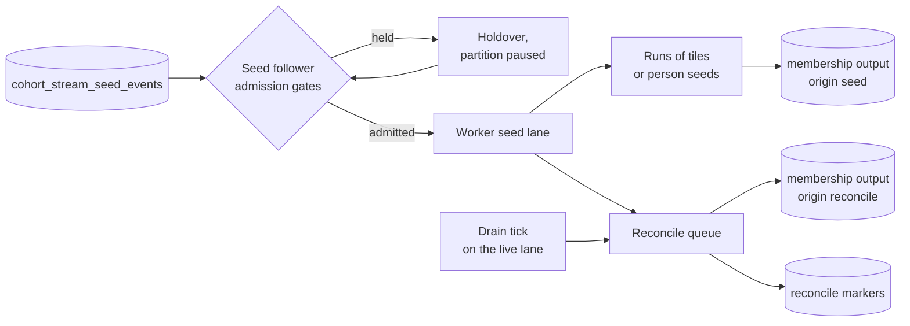

# Seed apply and reconcile

This page covers the processor's side of backfill: how seeds get from `cohort_stream_seed_events` into leaf state without disturbing live traffic, how their membership changes are emitted, and how reconcile re-tells downstream the full membership of a cohort.
Read [backfill overview](backfill-overview.md) first for the boundary, max-merge and fence rules this page implements.
In short: `S_chunk` is the instant a seeder chunk was claimed, and the scan counts only events that reached ClickHouse before it.
A shape hash fingerprints a cohort's leaves of one kind, and a reconcile request carries the pinned one.

Three kinds of message arrive on the seed topic:

- **day tiles** from behavioral runs,
- **person seeds** from person runs,
- **reconcile requests**, one per cohort per partition, sent after a run's seeds.

Messages the processor cannot decode, of an unknown kind, or with a newer schema are counted and skipped in order, so they never stall a partition.

## Admission: the seed consumer

The seed consumer is a follower of the events consumer.
It is assigned exactly the partitions the events consumer owns, so every seed reaches the worker that owns its person.
It starts only after the first catalog load.

Each poll, it decides per partition which seeds may go to the worker now.

- **The fence.**
  A day tile may apply only when the partition's **live watermark** is past the tile's `S_chunk` plus a margin, 10 minutes by default.
  The live watermark is the newest broker timestamp of a live event the worker has folded and marked processed.
  It is reset whenever the partition is assigned, and a partition with no watermark keeps its fence closed.
  Person seeds and reconcile requests have no fence of their own.
- **The idle probe.**
  A quiet partition may receive no live events for a long time, and its watermark would never move.
  Every 30 seconds a probe checks whether the worker has folded, and marked processed, every message on that partition of the live events topic.
  If it has, the probe moves the watermark to now, so the fence can open.
- **The live-lag gate.**
  If the live watermark is falling behind real time, seeds for that partition pause until live catches up.
  Live freshness always wins over backfill.
- **A full seed lane.**
  When the worker's seed lane is full, the rest of the partition's seeds go back to the holdover.
  An optional disk-usage gate, off by default, can hold every partition.
- **No leapfrogging.**
  From the first held message on a partition, everything after it on that partition waits too, including reconcile requests and skips.
  A reconcile request must not run before the tiles of its run on that partition, or its marker would certify an incomplete snapshot.

Held messages sit in a holdover, and fetching for the partition is paused.
Admitted seeds go onto the worker's **seed lane**.

## The worker's seed lane

Each worker takes seeds in **quanta** of up to a few hundred, and only when the live lane is empty, no sweep work is pending, and the previous quantum has fully applied.
It splits a quantum into **runs**: groups of seeds of one kind, sized by a row budget.
The budget weighs each seed by the leaves and Stage 2 rows it can touch, and a run closes before a seed that would push it over.
A seed heavier than the whole budget still applies, in a run of its own, so the budget sizes runs but does not cap the work of one run.
A reconcile request always forms a group of its own.

The worker applies one run per turn, checking the live lane first on every turn, so live events wait behind at most one run.

## Applying a run of day tiles

1. **Follow merges.**
   The run's persons are checked for tombstones in one batched read.
   A tile for a person merged on this partition applies to the survivor.
   A tile for a person merged onto another partition is re-produced to the seed topic, keyed by the survivor, with the same `S_chunk`.
2. **Fan out.**
   Each tile's condition hash maps to every leaf state key that shares it, through the current catalog.
   A tile whose hash no longer maps to any leaf is dropped, which is expected after an edit.
3. **Read** every leaf row the run can touch, in one batched read on the maintenance I/O lane.
4. **Fold**, per tile and per leaf.
   Later tiles in the same run fold onto the result of earlier ones.
   - **"Performed N times" leaves**, stored as daily buckets or compressed history.
     Slide the window forward to today, or to the tile's day if that is later.
     A tile for a day that is already outside the window is dropped without a write.
     Otherwise set that day's count to `max(stored, tile)`.
   - **"Performed at least once" leaves.**
     A tile means "matched on that day".
     The row's newest match time becomes the end of that day in the team's timezone, unless it was already later.
     A tile whose day would already have expired, or that falls outside the leaf's explicit date range, is dropped.
     Leaves with sub-day windows are never seeded.
   - The row's replay marks, the record of which live-topic messages were already applied, are copied through untouched.
     Seed-topic offsets would collide with them.
5. **Find the net flip** of each leaf over the whole run, by comparing its membership before the run with its membership after.

Sliding before evaluating matters.
Applying an expired day would resurrect a row, emit `entered`, and let the next sweep emit `left`: a flap downstream.

## Applying a run of person seeds

A person seed says which pinned person conditions were evaluated for the person and which matched.

1. Conditions the team's catalog no longer has are removed from the seed.
2. Merges are followed as for tiles.
3. Each person record is read and compared with the seed.
   The seed applies if the person has no readable record, or if the scan instant minus a margin is later than the record's **stamp**.
   The stamp is the event time of the record's newest evaluation, or the floor an earlier seed left.
   Only a seed that changed the record leaves a floor.
   It also applies if the record was evaluated live against a different set of person conditions and the scan is not older than the stamp.
   Otherwise the stored answer stands.
4. An applied seed sets the matched set to: the seed's matches, plus any stored match the seed did not evaluate.
   A condition that was evaluated and did not match is removed, which emits `left` for a stale match.

A person with no record who matches nothing costs one read and no write.
A skipped seed still re-checks what downstream was told, in the next section.

Because a seed that changes nothing writes nothing, it leaves no stamp behind.
So seeds from two runs that share a person condition are not ordered by scan time.
Suppose the newer scan says "no match", reaches a person with no record first, and writes nothing.
The older scan says "match" and arrives later.
It still finds no record, so it applies, and the older answer wins.
Each seed on its own is safe to apply twice.

## After the fold: the shared pipeline

Both kinds finish the same way, in an order the code enforces with types.

1. **Decide single-leaf emissions.**
   For each single-leaf cohort backed by a folded leaf, emit when the run flipped the leaf, or when the stored Stage 2 row disagrees with the truth.
   A missing row counts as "never told", so a member with no row is emitted.
2. **Stage 1 commit.**
   One write batch holds the new leaf rows or person records and, for each single-leaf cohort about to be emitted, a Stage 2 row set to the value being **replaced**.
3. **Schedule** eviction deadlines for the changed leaf rows.
4. **Recompose** composed cohorts, reading each person's state once for all their cohorts, and decide their emissions.
5. **Produce**, in parallel: the membership changes tagged `origin: seed` with the run id, first-hop cascades if enabled, and re-keyed seeds for merged persons.
6. **Stage 2 commit.**
   Write the new truth into the Stage 2 rows.
7. **Mark** the run's offsets, published once the whole quantum has applied, or **hold** the first offset at once if any step failed.

This order is what makes seed output self-healing.
If the produce in step 5 fails, the offset is held, and the seed is redelivered at the next rebalance or restart.
On redelivery the fold changes nothing: for a tile, `max` of the same count is the same count, and for a person seed, its own earlier write makes the verdict a skip.
But the single-leaf Stage 2 rows still hold the replaced value, and the composed cohorts' Stage 2 bits were never written, so both disagree with the truth and the change is emitted again.
Live output has no such repair, which is why live is at most once and seeds are at least once.

## Reconcile

A reconcile request names a cohort, a run, and the shape hash the run was pinned to.
The seeder sends one to every partition after all of the run's tiles.

### Admission

The request's own offset is **deferred**: the partition cannot commit past it until the reconcile finishes, so a crash replays the request and restarts the walk.
Seeds after it keep applying.
If a request with a lower offset for the same cohort and kind is still queued, even one in the middle of a walk, it is dropped and the new one joins the back of the queue.
A replayed older request never displaces a newer one.

### The walk

Each worker keeps a queue of reconcile jobs.
A timer sends a drain message down every worker's live lane every couple of seconds while any job exists, and each drain advances the head job by one page.

1. **Guard**, checked on every drain.
   The job is discarded without a marker if the team or cohort left the catalog, if the cohort no longer emits membership, or if its current shape hash for the run's kind is missing or differs from the pinned one.
   Before the first catalog load, the job waits.
   The guard checks only that one hash.
   The walk composes the cohort's tree from the processor's current catalog, so an edit that changes only the composition, or only the other kind's leaves, does not stop it.
2. **Scanning.**
   Read the next page of the cohort's Stage 2 rows on this partition.
   Recompute each row from stored leaf state and emit it, `entered` or `left`, tagged `origin: reconcile` with the run id, whether or not it changed.
   Correct any stored bit that was wrong.
3. **Draining dirty rows.**
   While the job is at the head of the queue, every write to one of the cohort's Stage 2 rows on this partition also leaves a **dirty marker**, whichever path wrote it.
   Each settled page clears its own rows' markers.
   After the last page, the markers that remain name the rows changed behind the cursor, and the worker re-settles them and clears their markers.
4. **Marker ready.**
   When no dirty marker is left, the worker produces a `reconcile_complete` marker for the cohort, run and partition.
   Once the marker is acknowledged, the job is done and the deferred offset is released.

The walk re-tells every person this store holds a Stage 2 row for, members and explicit non-members alike.
Live, sweep and merge paths write a row on every transition, including an explicit `false` on a `left`.
Seed paths write rows only for persons they emit.

Persons that downstream still holds but this store has no row for are not re-told.
Examples are a merged-away person, whose rows the merge drain deleted, and a member from before a store loss.
The downstream sweep removes their rows, because this run's snapshot did not re-assert them.

Reconcile re-tells what the store holds, and it cannot bring back what the store lost.
An event that Stage 1 skipped on a store error is missing from the leaf state, so the walk recomputes the same wrong answer.
A person whose first Stage 2 row for the cohort was never written, for example after a crash between a Stage 1 batch and its Stage 2 batch, is not in the walk at all.
Seeds from a later run that cover the missed event repair the first case.
A seed or a leaf flip that touches the person repairs the second.

### Why every row is emitted

Live and merge output are at most once, so a lost `entered` or `left` leaves state and downstream disagreeing with no trace in the state itself.
Only re-telling everything repairs that.
Downstream, once the run completes, the consumer deletes the cohort's rows that nothing has written since the run's snapshot.
[Membership output and readers](membership-output-and-readers.md#mark-and-sweep) explains that sweep.

## Commits

The seed consumer commits on the same cadence as the other consumers, after forcing the write-ahead log to disk.
The committable offset is the lowest of the processed offset, any held offset, and any deferred reconcile.

## Failure behavior

| Failure                                                                                                        | Result                                                                                                                                                                                                                                                                                                                                                                                                                        |
| -------------------------------------------------------------------------------------------------------------- | ----------------------------------------------------------------------------------------------------------------------------------------------------------------------------------------------------------------------------------------------------------------------------------------------------------------------------------------------------------------------------------------------------------------------------- |
| A store read or write fails during a run                                                                       | The run's first offset is held for the rest of the partition's tenure. Later runs still apply, but the commit stays at the hold until a restart or rebalance replays from it                                                                                                                                                                                                                                                  |
| A run fails before its Stage 1 commit, and a reconcile request for the same cohort follows it on the partition | The reconcile still completes and produces its marker, so the partition is certified without that tile. The tile applies, and emits its change, only when the next tenure replays from the hold                                                                                                                                                                                                                               |
| A membership produce fails                                                                                     | Hold. At the next rebalance or restart the redelivered seed emits the change again, through the pre-written row for single-leaf cohorts and the unwritten Stage 2 bit for composed ones                                                                                                                                                                                                                                       |
| The processor crashes mid-run                                                                                  | Nothing was committed past the run, so it replays. Every step is idempotent                                                                                                                                                                                                                                                                                                                                                   |
| A tile is redelivered                                                                                          | `max` of the same count changes nothing                                                                                                                                                                                                                                                                                                                                                                                       |
| The cohort is edited mid-run                                                                                   | Old tiles whose hash still maps to a leaf are max-merged into the current leaves, harmlessly. Old reconcile requests are discarded if the edit changed the shape hash for their kind. Otherwise they walk the current definition                                                                                                                                                                                              |
| A restart interrupts a reconcile                                                                               | The job's cursor lives in memory, so the replayed request walks the cohort again from the start                                                                                                                                                                                                                                                                                                                               |
| A reconcile page's produce or commit fails                                                                     | The same page retries on the next drain, and its rows are emitted again                                                                                                                                                                                                                                                                                                                                                       |
| A marker produce fails                                                                                         | The worker retries on the next drain                                                                                                                                                                                                                                                                                                                                                                                          |
| A restart after the marker is acknowledged but before the commit                                               | The request replays and produces a second marker for the same run and partition, which the seeder counts once                                                                                                                                                                                                                                                                                                                 |
| The reconcile gate is off on the processor                                                                     | Requests are skipped and committed, so the run never completes until reconcile is dispatched again                                                                                                                                                                                                                                                                                                                            |
| The person apply gate is off on the processor                                                                  | Person seeds are skipped and committed, but reconcile still walks and produces every marker. With person completion and person readiness on, the run completes and Django stamps the cohort ready over state the seeds never wrote. Turn person apply on everywhere before any person run is dispatched. A cohort already stamped this way keeps its stamp, so run a new person backfill for it after turning person apply on |

## Optimizations

- **Batched apply.**
  A run of seeds pays one tombstone read, one leaf read, one Stage 2 diff, one commit per stage and one parallel produce.
  Batched apply keeps up with the seeder's production rate.
  Its limit is the membership produce acknowledgment for each run.
- **A separate seed lane with live priority.**
  Live events wait behind at most one seed run.
- **Shared Stage 2 inputs.**
  Recomposition reads each person's leaves, person record and Stage 2 rows once for all of that person's cohorts, in bounded sections, instead of once per cohort.
- **A bounded page reader for reconcile.**
  One read plan serves the whole page.
  Rows are read and evaluated in bounded blocking sections, and the store permit is released between sections, so a page costs a few thread handoffs instead of one or more per row.
- **The maintenance I/O lane.**
  Seed and reconcile reads never take permits from the live read pool.
- **Dirty markers instead of a second full walk.**
  Only rows changed behind the cursor are revisited.
- **Drain ticks only while work exists.**

Reconcile throughput is at most the page size times the partition count per tick interval.
The work per row matters only once one page takes longer than a tick.

## Worked example

Team 7 uses UTC.
Cohort 45 is a single leaf: "2 or more `$pageview` in the last 30 days".
Person p-1 lives on partition 26.

p-1 viewed a page at 10:00 on 2026-03-08, which reached ClickHouse normally, and again at 23:30 on 2026-03-08 from a client that was offline, which reached ingestion at 08:30 on 2026-03-10.
A backfill run has boundary `B` = 08:00 on 2026-03-10.
The live path folded only the late pageview, because it arrived after live coverage began, so the 2026-03-08 bucket holds 1 and p-1 is not a member.

1. **The tile.**
   The seeder claims the 2026-03-08 chunk at 09:00 on 2026-03-10.
   Both pageviews reached ClickHouse before then, so the tile says count 2, with `S_chunk` = 09:00.
2. **The fence.**
   With the default 10-minute margin, the tile may apply once partition 26's watermark passes 09:10.
   At first the watermark reads 09:05, so the tile and everything after it on partition 26 are held and fetching pauses.
   When the worker folds live events stamped 09:11, the fence opens.
3. **The fold.**
   The leaf's window slides to today, 2026-03-10.
   2026-03-08 is still inside it.
   The bucket becomes `max(1, 2) = 2`, and `gte 2` flips to true.
4. **Emit.**
   Cohort 45 has no Stage 2 row for p-1, so the Stage 1 batch writes a row holding `false`, the value being replaced.
   The worker produces `entered` with `origin: seed`, then writes `true`, then marks the offset.
   Had the produce failed, the redelivered tile would change nothing in the leaf, but the row's `false` would disagree with the truth and `entered` would be emitted again.
5. **Reconcile.**
   A reconcile request for cohort 45 arrives on partition 26 behind the tile.
   Its offset is deferred.
6. **The walk.**
   The first page returns three rows:
   - p-1, stored `true`, recomputed `true`: emits `entered`,
   - p-2, stored `false` from an earlier expiry: emits `left`,
   - p-3, stored `true` from before an earlier edit, but its leaf under the current definition has no state: recomputes `false`, emits `left` and corrects the row.
7. **Dirty rows.**
   Between drains, a live pageview makes p-4 enter cohort 45.
   The live path writes p-4's row and a dirty marker.
   The next drain re-settles p-4, emits `entered`, and clears the marker.
8. **Marker.**
   No dirty markers remain, so the worker produces `reconcile_complete` for cohort 45, run R and partition 26.
   When it is acknowledged, the deferred offset is released.
   The seeder now holds 1 of the 64 markers it needs.

If p-1's late pageview had instead reached ClickHouse after 09:00, the tile would have said 1, live would also hold 1 for a different event, and `max(1, 1) = 1` would under-count.
That is the accepted residue of the arrival bound.

## Things that surprise people

- The fence reads broker timestamps of the live topic, which are the shuffler's send times.
  A lagging shuffler holds seeds back even when the processor is healthy.
- The idle probe trusts that the live topic is complete.
  A silent shuffler stall longer than the margin lets it open a fence early.
- A partition whose live lane never empties makes no seed progress.
  That is deliberate: live comes first.
- Reconcile pages run on the live lane, so they add a little latency to that partition's live events.
- An unchanged tile still costs Stage 2 work.
  Re-running a backfill over already-seeded state is not free.
- A run's changes carry the id of the last seed that touched each leaf, so two interleaved runs are not cleanly separated in `run_id`.
- A tile handed to a merge survivor on another partition joins the back of that partition, so it can apply after that partition's reconcile marker.
- A person-kind reconcile still recomposes the whole cohort, behavioral leaves included.
  The kind only selects which shape hash guards it.
- Reconcile cost grows with Stage 2 rows, not with members.
  The rows include every person who has left the cohort since the store was built, not only current members.
