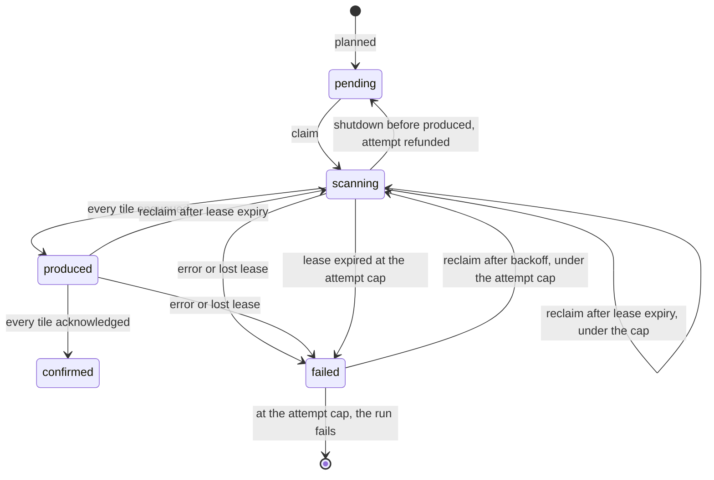

# The seeder

`cohort-seeder` turns a backfill run into seeds.
It claims units of work from Postgres, scans ClickHouse, evaluates every row with the same `cohort-core` code the processor runs, and produces idempotent seeds to `cohort_stream_seed_events`.
It also drives the seeder half of completion.

It never creates runs and never sets a run to `completed` or `superseded`.
It does fail runs, and it can mark a participation superseded when it settles completion.
It never touches the processor's state directly.
[Backfill overview](backfill-overview.md) explains the correctness model this page implements.

## The poll loop

The seeder is a set of replicas polling Postgres, every 15 seconds by default.
Each tick it:

1. discovers runs in `awaiting_boundary` or `seeding` for allowlisted teams and enabled kinds, where person runs need `SEEDER_PERSON_SEEDS_ENABLED`,
2. sets the boundary on newly discovered runs,
3. validates each run's pinned payload and plans its chunks,
4. fails chunks abandoned at the attempt cap, and fails runs that hold an exhausted chunk,
5. fills its free claim slots with chunks,
6. if completion is enabled, dispatches reconcile for fully confirmed runs and observes runs already reconciling.

Claims are also refilled whenever a chunk finishes.
Planning and validation repeat on every tick.
Both are idempotent, so any replica can do them and a restart loses nothing.

## Behavioral runs

### Boundary

The first time the seeder picks up a run, it moves the run from `awaiting_boundary` to `seeding` with a compare-and-set that sets `boundary_at` to the Postgres clock.
A disaster-recovery run instead waits for Django to have pinned `boundary_at`, and the compare-and-set only changes the status.

### Validation against a frozen catalog

The seeder builds a catalog from the run's pinned filters, one per active participation, with the same builder the processor uses.
Cascades are always off in this catalog.
Each pinned condition is then looked up by its leaf state key:

- a condition of a superseded participation is skipped,
- a condition keyed on an action is dropped,
- a condition whose leaf the catalog refused, or cannot find, is dropped,
- every other condition gets a **lookback**: a sliding window of N days, a sub-day window, or a fixed date range.

Dropped conditions add a warning to the run's error column.

### Planning

The days to seed are the union, over surviving conditions, of each condition's window ending the day before the boundary:

- a sliding window of N days plans `day(B) - N` through `day(B) - 1`,
- a sub-day window plans only `day(B) - 1`, although the processor drops sub-day tiles, so this day costs a scan and seeds nothing,
- a fixed date range plans its days, clamped to the lookback cap.

No day before `day(B)` minus the lookback cap is ever planned.
A longer window is truncated, and the run records a warning.

Each day becomes one or more chunks, `(run, day, band)`.
With more than one band per day, a chunk takes only the persons whose hashed id falls in its band, so one chunk's in-memory aggregate stays bounded.
The band count a scan divides by is the number of chunk rows its day has when the chunk is claimed.
The insert is `ON CONFLICT DO NOTHING`, so replanning on every tick is safe while the band setting stays the same.
Raising the lookback cap mid-run is safe too, because it only adds chunks for older days.

Raising the band count while a run is seeding is not safe.
Replanning adds the new bands to days that already have chunks, and it does not re-scan the bands already confirmed.
Take a day planned with two bands, where band 0 is confirmed: it covered every person whose hash is even.
The setting goes to three, so the day's remaining scans take hash `% 3 = 1` and hash `% 3 = 2`.
A person whose hash is 9 is odd, so band 0 skipped them, and `9 % 3 = 0`, so neither new scan takes them either.
Every chunk still confirms, and the run completes with those persons never seeded.
Lowering the setting changes nothing for days already planned, because their chunk rows stay.
Change the band count only while no behavioral run is seeding.

Once every active participation has at least one surviving condition, the seeder stamps `chunks_planned_at`.
That stamp is the **planning proof**: completion refuses to move a run to `reconciling` without it, so a run can never be certified over days that were never planned.
The proof covers days, not persons, so it does not catch the band change above.

If an active participation has no surviving condition, for example because all its behavioral leaves are keyed on actions, or the catalog refused one of them, the proof is withheld.
Nothing fails the run.
It stays in `seeding`, holding the cohort's run slot, until an operator cancels it.

### Claiming and fencing

A worker claims the next chunk with one statement using `FOR UPDATE SKIP LOCKED`.
It picks the oldest day first across all seeding runs, and admits:

- pending chunks and failed chunks past their backoff, both under the attempt cap,
- `scanning` chunks whose lease expired, under the attempt cap,
- `produced` chunks whose lease expired, at any attempt count.

The claim:

- sets the chunk to `scanning`,
- charges one attempt,
- increments its **claim epoch**,
- sets a lease, renewed in the background at a third of its length,
- stamps **`S_chunk`**, the claim instant, which becomes the scan's arrival bound.

Every later write to the chunk is conditioned on its claim epoch and a live status, so a worker that lost its lease cannot write over a chunk another worker now owns.
The lease renewal also requires the run to still be `seeding`, so a worker whose run was superseded or cancelled stops at its next renewal.
Any failed renewal, even one caused by a Postgres error, cancels the scan and the produce, and fails the chunk.

`S_chunk` is stamped again on every claim, including retries.
A retried chunk therefore counts a slightly wider arrival window and waits for a later fence on the processor.
Max-merge makes that harmless.

### Scanning

One chunk is one streaming ClickHouse query:

```text
SELECT <projected columns>, canonical person_id
FROM events
LEFT JOIN (latest person override per distinct_id for the team) ON distinct_id
WHERE team_id = <team>
  AND timestamp in [start of day, start of next day) in the run's timezone
  AND event IN (<event names of the conditions whose window still covers this day>)
  AND coalesce(inserted_at, _timestamp) < S_chunk
  [AND hash(person) % bands = band]
```

- **Canonical persons.** The join maps each distinct id through the latest person override, so events of merged persons count toward the survivor.
- **Timezone days.** The day's bounds are computed in the run's pinned timezone.
- **Arrival bound.** Only events that reached ClickHouse before `S_chunk` count.
- **Active conditions.** Conditions whose window has slid past this day by scan time are left out.
  If none remain, the chunk is done without a query.

### Evaluating and producing

For each row, the seeder builds the same behavioral globals the processor would build and runs every active condition for the row's event name through the HogVM.
Each match increments a count for `(person, condition hash)`.
At the end of the chunk, each count becomes one **day tile**:

```json
{
  "schema_version": 1,
  "kind": "behavioral_tile",
  "team_id": 7,
  "person_id": "...",
  "condition_hash": "b938e32d52f73122",
  "day_idx": 20517,
  "count": 4,
  "run_id": "...",
  "s_chunk_ms": 1773154820000,
  "claim_epoch": 1
}
```

Tiles are keyed `"{team_id}:{person_id}"`, so each lands on the partition of the worker that owns the person.
A shared rate limiter paces production, and a cap bounds the tiles in flight.

The chunk then moves to `produced`, which means every tile was handed to the producer, waits for every acknowledgment, and moves to `confirmed`.

### Chunk states and retries



A failed chunk backs off exponentially with jitter before it can be claimed again.
A chunk that fails at the attempt cap, or whose `scanning` lease expires at the cap, fails the whole run, which frees the cohort's run slot.
A `produced` chunk whose lease expires is reclaimed at any attempt count, so a chunk whose worker keeps dying after `produced` never fails the run.
A reclaimed chunk is scanned and produced again from scratch.
The duplicate tiles are absorbed by max-merge.
A graceful shutdown before a chunk is marked produced returns it to `pending`, even if some of its tiles already reached Kafka.

## Person-property runs

A person run seeds the person record instead of behavioral leaves.
It scans persons whose record changed within the run's **horizon**, a pinned number of days.

### Planning by person id range

Planning a person run needs a scan, so it runs off the poll loop, one at a time per replica, under a cluster-wide advisory lock per run.
The seeder streams the ids of the team's persons that changed within the horizon, keeps every Nth id as a boundary, and inserts chunks that tile the whole id space.
The insert is all or nothing.

Person chunks have their own claim slots, so they run alongside behavioral work.
If a person run has no surviving condition at all while a participation is active, the seeder fails it.

### Scanning and evaluating

Each chunk reads the latest properties of every person in its id range who changed within the horizon.
For each person the seeder evaluates every surviving pinned person condition and builds a **person seed**: the conditions it evaluated, and the subset that matched.
A condition the VM could not answer is left out of `evaluated`.
The seed's scan time, which the processor compares with live updates, is the chunk's claim instant.
Seeds are produced as the scan streams, never buffered, so memory stays constant.

One optimization applies to every person run:

- **The vacuous-key shortcut.**
  A condition that reads only certain property keys has a fixed answer for a person who has none of those keys.
  That answer is computed once per run, and a row without the keys skips the VM for that condition.

### Which persons get a seed

A process-wide setting chooses between two modes.

- **Every scanned person**, the code default.
  This is the only mode that retracts stale matches for persons who now match nothing.
- **Only persons whose seed can change a participating cohort's answer.**
  Persons who match nothing are skipped, and so are persons whose results cannot change any cohort.

The second mode adds two optimizations.

- **Relevance pruning.**
  For each participating cohort, the seeder evaluates the cohort's tree with the person's condition results as known values and every other leaf as unknown, in three-valued logic.
  It emits the person only if some cohort's answer differs from its answer for a person matching nothing.
  A person with an unanswered condition is emitted without judging.
  If some cohort's answer for a person matching nothing is already unknown, pruning is off for the whole run.
- **The key-presence filter.**
  When every condition is decidable by keys, every such answer is a real verdict, and a person without the keys is never relevant, the ClickHouse query itself filters out persons whose properties contain none of the keys.
  Those persons never leave ClickHouse.
  Properties that are not a JSON object always come through, and the filter is dropped if it would make the query too long.

These matter for broad conditions.
"Email does not contain `@example.com`" is true for every person with no email, so without pruning an `AND` of "email is set" and that condition would seed every person of the team.

## Completion

Automatic reconcile dispatch and observation are separate gates, off by default.
Without the dispatch gate, an operator dispatches reconcile with the `reconcile_dispatch` command-line tool.
The tool only dispatches, so the seeder records an outcome only while the observer gate is on.

When every chunk of a run is confirmed and the planning proof is stamped, the seeder:

1. moves the run to `reconciling` with a compare-and-set,
2. records where the reconcile marker topic currently ends,
3. produces one reconcile request per participating cohort to each of the 64 seed partitions,
4. records the high-water mark of those requests per partition.

If unconfirmed chunks show up after the move anyway, it reverts the run to `seeding`.

A watcher then tails the marker topic and records, per participation, which partitions have reported.
When every cohort of the run has all 64 markers, the seeder marks them all complete at once, with no further check.
To call a cohort short, the seeder first needs proof that no more markers are coming: the processor's seed consumer must have committed past every reconcile request, and the watcher must have read the marker topic to the end captured after that.
Until that proof arrives, the run's complete cohorts wait with the short ones.
Then each participation is marked complete, retryable, or superseded, and the run is marked observed.
[Completion and readiness](completion-and-readiness.md) covers this protocol and what Django does next.

## Optimizations

- **Column projection.**
  Static analysis of the run's conditions decides, per chunk, which columns and property keys to read.
  A column no condition reads comes back empty and is never parsed.
  A property blob comes back rebuilt with only the keys the conditions read.
  Without projection, most of the seeder's CPU goes to parsing JSON and assembling globals.
  In local measurements, a chunk ran about 3 times faster with keys rebuilt and about 60 times faster when no blob was needed.
  Rebuilding keys costs ClickHouse more, so the gain is on the seeder's side.
  On real data, projection raised client throughput per core by more than an order of magnitude.
  One side effect: a row whose skipped blob is malformed, which the live path would drop, is still evaluated here on its other fields.
- **Shadow compare.**
  A mode that re-scans each projected chunk at full width and diffs the tiles, to prove projection changes nothing.
  It is on by default in code, adds a full-width query per chunk and roughly doubles scan memory, so it is meant to be turned off once projection is proven.
- **Scan-time window gate.**
  A chunk whose day has slid out of every active window issues no query.
- **Bands.**
  Splitting a day by person hash bounds one chunk's memory, at the cost of reading the day once per band.
- **Pacing.**
  One rate limiter per kind per process, shared by all chunks, protects the seed topic and the processor's apply rate.
- **Backoff and attribution.**
  Failed chunks back off with jitter instead of being retried every tick.
  Every query carries a structured log comment with the team, the run and the scan phase, so ClickHouse cost can be attributed.
  A chunk scan also names the chunk and its band, and a behavioral chunk scan names its day.
- **Person-run pruning.**
  In a synthetic test where few persons carried the relevant key, the key-presence filter cut rows returned 200 times and bytes sent about 156 times.
  In a micro-benchmark where every condition was answered from the cached value, the vacuous-key shortcut cut VM time per row about 17 times.

## Worked example

For this example team 7 uses `America/Sao_Paulo`, three hours behind UTC, to show the timezone math.
Cohort 42 is "3 or more `$pageview` with `$pathname = /pricing` in the last 7 days".
Person p-1 has two distinct ids, `d-1` and `anon-9`, and `anon-9` was merged into p-1.
p-1 hashes to partition 26.

1. **Boundary.**
   At 15:00:00 UTC on 2026-03-10 the seeder picks up run R and sets `B` to that instant.
   Local time is 12:00, so `day(B)` is 2026-03-10.
2. **Validate and plan.**
   The pinned condition resolves to a 7-day sliding window.
   The seeder plans 7 chunks, for 2026-03-03 through 2026-03-09, one band each, and stamps the planning proof.
3. **Claim.**
   Workers claim chunks oldest day first.
   At 15:00:20 one of them claims the 2026-03-05 chunk.
   `S_chunk` is 15:00:20 and the claim epoch is 1.
4. **Scan.**
   The day's bounds are 03:00 UTC on 03-05 to 03:00 UTC on 03-06.
   Projection reads only `properties.$pathname`, and the other blobs come back empty.
   The query returns four `/pricing` pageviews for p-1: three from `d-1`, and one from `anon-9` that the override join resolves to p-1.
   A fifth pageview for 03-05, sent late by an offline client, reached the live path at 15:00:10, but ClickHouse stored it only at 15:00:40, after `S_chunk`, so the scan does not return it.
5. **Tile.**
   The seeder produces `{p-1, H, day 03-05, count 4}` to the partition of `"7:p-1"`, then marks the chunk produced and, after the acknowledgments, confirmed.
6. **Processor, for context.**
   With the default 10-minute margin, the tile waits until partition 26's live watermark passes 15:10:20.
   The live path folded the late fifth pageview at 15:00:10, so the bucket holds 1.
   The apply takes `max(1, 4) = 4`.
   The true count is 5, which is the bounded under-count from a late arrival, and p-1 still enters.
7. **Completion.**
   When the other six chunks confirm, the seeder moves R to `reconciling` and sends 64 reconcile requests for cohort 42.

## Things that surprise people

- `B` is the moment the seeder first saw the run, not when the run was created, except for disaster-recovery runs, whose `B` Django pins.
- Claims take the oldest day first across every run, so a small new cohort's recent days wait behind a large team run's older days.
- A chunk in `produced` has enqueued its tiles but may not have all acknowledgments yet.
- The seeder writes the claim epoch into every tile, but the processor ignores it.
  Fencing is purely a Postgres concern, and duplicates are absorbed by max-merge.
- The seeder evaluates every row through the VM, even for conditions that only test the event name.
- Person runs scan only persons whose record changed within the horizon.
  A dormant person with a stale match outside the horizon keeps it.
- The seeder has no merge repair of its own.
  It resolves canonical persons at scan time, and the processor redirects tiles for persons merged after the scan.
