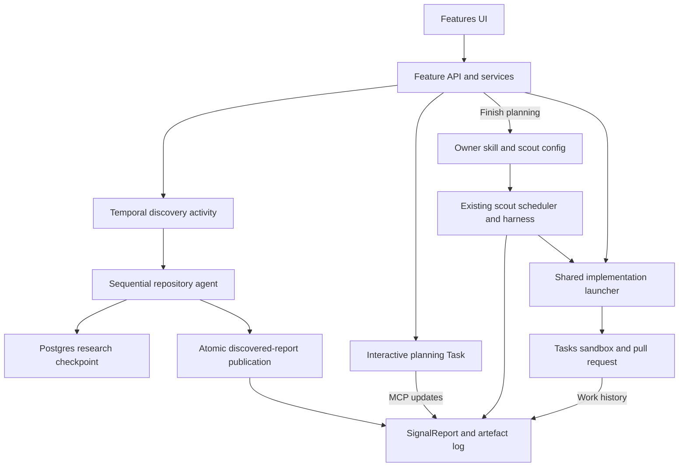

# Self-driving features: paused draft handoff

Status: paused draft, not ready to merge. Updated 15 September 2026.

This document records the implementation goals, current architecture, and remaining decisions. It describes the branch implementation, not a released product contract. Read [the product design](../../products/signals/backend/features.md) and [the internal testing walkthrough](self-driving-features.md) alongside it.

## Goal

Give each software feature a durable home that survives individual agent conversations and implementation passes. PostHog supplies the toolbox for understanding adoption, reliability, user experience, and opportunities for improvement.

The feature report is the long-lived object. Planning is an activity on that object, not its identity. Discovery describes existing functionality; planning establishes intended functionality and future direction; an owner scout revisits the feature over time.

The report summary is a concise living overview: purpose, current status, user journey, implementation boundary, active work, measurement and health, and next steps. It must not read like a reactive incident report or claim impact without evidence.

## Current architecture

### Durable records

- `SignalReport` provides the stable feature ID, title, and living summary. Feature membership stays outside signal grouping.
- The latest `feature_lifecycle` artefact records `staged`, `planning`, or `managed`, plus manual/discovery origin. The UI calls staged reports "discovered features".
- Existing artefacts hold repository selection, suggested owners, priority, questions, code references, notes, and task history.
- `FeatureDiscoveryRun` holds tenant-scoped status, focus, current task, final count, diagnostic details, and a JSON research checkpoint.
- The owner uses an `LLMSkill` and `SignalScoutConfig` named with the complete report UUID. The platform owns core instructions; a report playbook supplies feature-specific direction.

Lifecycle describes ownership activation, not deployment or health. Questions are updated in place, so the artefact log is not an immutable event-sourcing implementation.

### Discovery

The UI selects a connected repository and optional hard scope constraint. Discovery uses the report-research sandbox machinery with read-only PostHog MCP access and no pull requests or owner activation.

The initial turn maps the repository, related codebases when necessary, canonical upstream work for forks, and an ordered feature-candidate ledger. Subsequent turns emit one bounded structured document and then answer "is there more?". There is no fixed feature-count ceiling.

The current draft defaults to `claude-opus-5`, with overrides through the `signals-pipeline-models` payload's `feature_discovery` step. Research is sequential in one session. Prompts favor shared evidence reuse, compact summaries, normally two verbatim source excerpts, reusable JSON validation, and material questions rather than a question quota.

Each accepted document is checkpointed in Postgres. A retry creates a fresh sandbox, supplies the saved checkpoint, and continues after completed candidates. Reports become visible only after complete discovery succeeds and the batch publishes atomically. The activity returns a count rather than document bodies across Temporal.

The workflow still wraps the whole run in one activity, with a six-hour timeout, five-minute heartbeat timeout, and two attempts. Output-validation exhaustion is nonretryable. Retryable failures remain running until the workflow exhausts retries.

### Planning and promotion

Creating a feature starts its first planning task and opens the Planning tab. Opening that tab on an existing feature does not start a task. Users can start or restart planning for discovered, new, or managed features without changing lifecycle or losing ownership.

Planning tasks retain the no-PR posture on interactive continuation. The agent reads the report and outstanding questions, checks current code, clarifies intended behavior, and records durable decisions through MCP. Question artefacts supply multiple-choice answers and an inline custom answer.

The backend readiness contract checks title, summary, usable repository and owner values, priority, and unresolved agent questions. Finish planning activates a deterministic owner and attempts the first implementation pass. Repeated completion repairs legacy short-name owners without launching another initial pass.

### Ownership and implementation

Manual starts, finish-planning kickoff, and the internal scout tool share one implementation launcher. It serializes launches on the report, records the task association, and dispatches after commit. Manual execution uses the authenticated caller; scheduled execution uses the owner config creator with current project access. Suggested reviewers do not determine execution identity.

Scouts read decisions and questions, inspect implementation and release context, use available PostHog evidence, link related signals, and update the living report. Monitoring and optimization remain agent-driven, not a deterministic release controller.

### Rollout boundary

The organization-targeted `self-driving-features` flag gates both inbox layouts, feature APIs, discovery startup, and owner loading. Keep it off by default. Disabling it blocks new launches but does not cancel running Tasks. API clients and MCP contracts derive from DRF schemas.

## Where to start reading

| Area                                           | Entry point                                                                      |
| ---------------------------------------------- | -------------------------------------------------------------------------------- |
| Discovery schemas, prompts, loop, publication  | `products/signals/backend/features/discovery.py`                                 |
| Discovery activity, checkpoints, failures      | `products/signals/backend/temporal/feature_discovery.py`                         |
| Readiness, planning, ownership, implementation | `products/signals/backend/features/service.py`                                   |
| Agent operating contracts                      | `products/signals/backend/features/prompts.py`                                   |
| Membership and independent pagination          | `products/signals/backend/features/queries.py`                                   |
| API and rollout gating                         | `products/signals/backend/features/views.py`, `access.py`                        |
| UI planning workspace and artefacts            | `products/signals/frontend/inbox/components/detail/feature/FeatureDetail.tsx`    |
| UI state, question answers, task continuation  | `products/signals/frontend/inbox/logics/featureDetailLogic.ts`                   |
| Discovery modal and polling                    | `FeatureDiscoveryModal.tsx`, `featureDiscoveryLogic.ts` under the inbox frontend |
| Shared response assembly                       | `products/tasks/backend/logic/services/custom_prompt_internals.py`               |

## Outstanding before merge

1. Integrate newer master changes, reconcile migration tips and source contracts, and regenerate API/MCP outputs where inputs changed. The paused snapshot is not guaranteed current with master.
2. Run a fresh end-to-end sandbox trial of the current direct-research prompts and model default. Check GitHub access, focus compliance, source fidelity, questions, and actual run cost and duration.
3. Harden discovery recovery. Persist stable candidate identities and preserve the original ledger instead of relying on an agent to re-emit it consistently. Checkpoint size and restart context grow with every document.
4. Decide partial publication and cancellation semantics. Research survives retry, but terminal failure publishes nothing and cancellation still follows generic failure handling.
5. Validate citations against an identified repository revision. Line-count arithmetic alone cannot establish that the excerpt exists at those lines. Record evidence freshness and distinguish fork implementation from canonical active work.
6. Define repeatable large-repository evaluations for coverage, duplicates, feature boundaries, unsupported claims, instrumentation accuracy, question usefulness, schema repairs, latency, and cost. Keep prompts generalized.
7. Evaluate structurally bounded per-candidate research and limited concurrency only after measuring the direct-research baseline. Prompt-level subagent delegation is not an orchestration guarantee.
8. Validate the full planning-to-ownership loop: answer questions, finish planning, inspect implementation PRs, run scouts, and verify measured outcomes and bounded subsequent work.
9. Complete rendered browser QA, accessibility checks, and before/after screenshots for both inbox layouts, question inputs, scrolling, pagination, task restart, and terminal failures.
10. Run current frontend type generation/typecheck, repo-wide Python typecheck when required, the full relevant CI matrix, and patch-coverage review. Focused tests are not release certification.

## Resuming safely

1. Check the current branch, PR state, dirty worktree, and fetched master before changing anything. Do not assume this dated document matches later edits.
2. Start with `features.md`, this handoff, and the rollout walkthrough. Inspect the current implementation before acting on an outstanding item.
3. Keep credentials in `.env.local`; never copy keys, raw agent logs, local task IDs, or private test data into public commits or PR descriptions.
4. Inspect the saved discovery checkpoint and task history before clearing test state. Cleanup is a separate explicit action and should use scoped Django models.
5. Test a narrow discovery before a large run. Verify migrations and generated contracts first, then monitor the live sandbox and durable task log.
6. Keep the PR draft until the outstanding validation and design decisions are resolved. Merge or queue approval requires a separate explicit human instruction.

The local `output/` audit notes are diagnostic continuity material, not committed fixtures or authoritative product documentation. They may describe older implementations and must not be copied into public artifacts.
