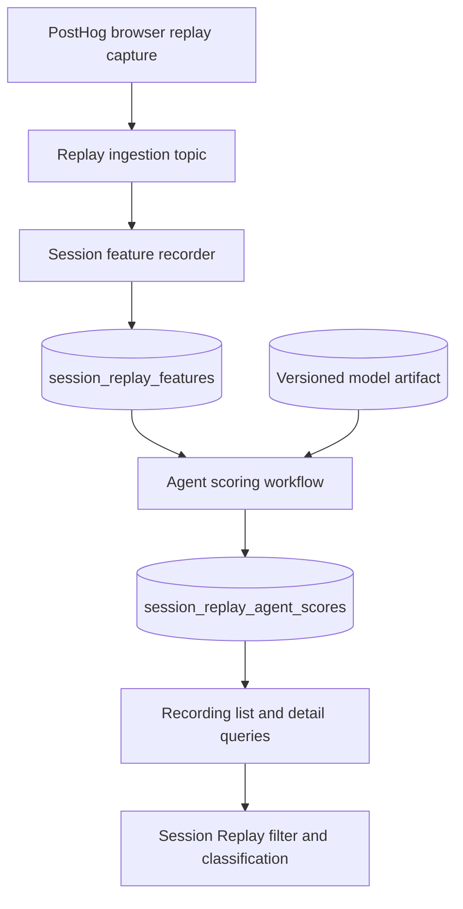
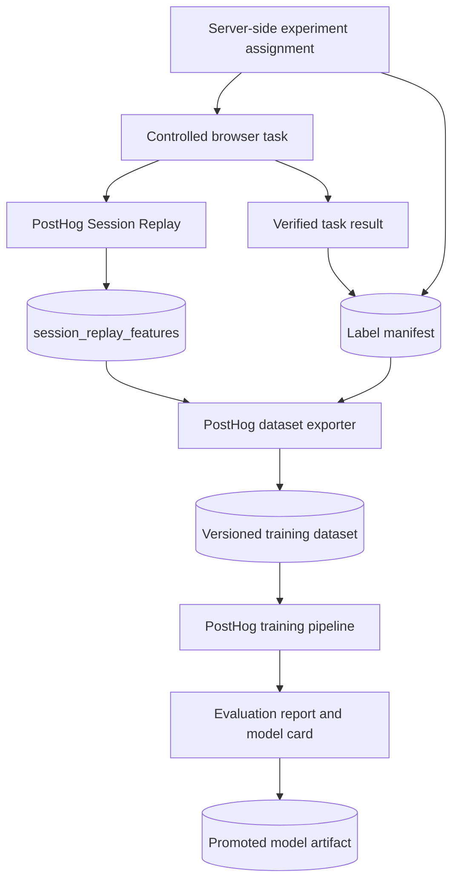

# Session Replay agent detection implementation plan

Status: proposed

Last updated: July 20, 2026

## Summary

Build an experimental Session Replay capability that identifies sessions with interaction patterns associated with computer-use agents.

The first product surface is a recording-level classification and filter:

- likely agent
- likely human
- unknown
- unsupported

The classification is probabilistic analytics, not proof that an AI system controlled the browser, attribution to a particular vendor, or a security signal.

All production code, feature definitions, model training, evaluation, storage, scoring, and product surfaces live in PostHog.
External playgrounds may generate controlled sessions and labels, but PostHog must not import their code, packages, contracts, fixtures, or model artifacts.

The implementation should start with PostHog's existing replay feature pipeline.
New browser capture or ingestion features should be added only when controlled experiments demonstrate that the existing feature set cannot meet the precision target.

## Goals

1. Identify high-confidence computer-use sessions without requiring customers to install another SDK.
2. Let users filter and inspect likely agent sessions in Session Replay.
3. Help users find agent-specific friction such as dead clicks, retries, repeated navigation, validation failures, and abandonment.
4. Reuse the existing Session Replay ingestion, feature storage, Temporal scoring, and recording query infrastructure.
5. Train and validate the model on features produced by the same PostHog pipeline used in production.
6. Keep the model versioned, auditable, replaceable, and safe to run in shadow mode.
7. Preserve privacy by deriving aggregate behavioral features without adding text, field values, screenshots, or stable cross-session selectors.

## Non-goals

The MVP does not:

- identify the exact agent, model, or vendor
- block, rate-limit, or challenge suspected automation
- automatically remove likely agent sessions from analytics
- change the customer's application while a session is active
- display a live detection badge to the visitor
- require application-authored task markers
- use customer production recordings as training data without explicit approval
- support native mobile session replay
- provide a public model-training API
- share runtime code or model artifacts with an external research repository

## Product contract

Each supported recording may have an active-model result with:

```text
score: 0.0 to 1.0
classification: likely_agent | likely_human | unknown | unsupported
model_version: string
feature_schema_version: string
reason_codes: string[]
scored_at: timestamp
```

The score represents similarity to the controlled agent sessions used to train the active model.
It is not an identity probability.

The classification policy is versioned separately from the raw score.
The initial policy should have a deliberately wide unknown region and optimize the likely-agent threshold for precision.

Example reason codes:

- `clicks_without_recent_pointer_movement`
- `highly_regular_action_timing`
- `low_pointer_path_variation`
- `repeated_target_interactions`
- `insufficient_pointer_evidence`
- `unsupported_input_modality`

Reason codes are non-causal summaries of model inputs.
They must not claim that a particular behavior proves computer use.

## Existing PostHog infrastructure

Session Replay ingestion already extracts per-block behavioral features in `nodejs/src/ingestion/pipelines/sessionreplay/sessions/session-feature-recorder.ts`.
The current feature set includes:

- click, keypress, and mouse activity counts
- pointer position sufficient statistics
- pointer distance and direction changes
- pointer velocity sufficient statistics
- scroll magnitude and reversal counts
- rage and dead clicks
- interaction gap statistics
- navigation and quick-back counts
- console and network failures
- mutation, viewport, touch, and text-selection activity
- unique click targets, fields, and visited URLs

`SessionFeatureStore` writes these blocks to `session_replay_features` when `SESSION_RECORDING_FEATURES_ENABLED` is active.
The table is already registered in HogQL.

The replay surfacing-score workflow provides a reference for:

- selecting unscored sessions in deterministic chunks
- aggregating `session_replay_features`
- validating model feature alignment
- loading a versioned model from object storage
- scoring in Temporal activities
- publishing results through Kafka
- monitoring backlog and scoring failures

Agent detection should reuse these patterns but use an independent feature contract, model, workflow, metrics, and storage path.

## Proposed architecture



Controlled experiments use the same capture and feature path:



Ground-truth labels must remain server-side.
The browser should not capture cohort, runner identity, prompt, participant identity, or dataset split as event or replay properties.

## Phase 0: Replay signal spike

Before changing schemas, run a short technical spike using existing replay data from a controlled PostHog project.

### Tasks

1. Confirm `SESSION_RECORDING_FEATURES_ENABLED` is active in the controlled environment and verify end-to-end population of `session_replay_features` for the research project.
2. Run a small set of real computer-use sessions and controlled human sessions through the same tasks.
3. Export the existing session-level feature vectors.
4. Train a disposable baseline model using only existing columns.
5. Inspect the most important features and errors by input modality.
6. Confirm that late replay blocks, short recordings, touch sessions, and keyboard-heavy sessions behave as expected.

### Exit criteria

- Controlled session IDs can be reliably joined to server-side labels.
- Existing features show measurable separation on held-out tasks.
- The team understands which high-value signals are missing from current replay ingestion.
- No browser SDK change is proposed without evidence from this spike.

If the existing feature set already supports a high-precision likely-agent threshold, proceed without adding capture fields.

## Phase 1: PostHog-owned feature schema

Create a versioned feature contract under:

```text
posthog/session_recordings/agent_detection/feature_schema.py
```

The contract defines:

- ordered model input names
- source ClickHouse expressions
- value types and ranges
- aggregation behavior across replay blocks
- derived ratios and sufficient-statistic formulas
- missing-value defaults
- modality support requirements
- minimum evidence requirements
- feature schema version

The feature schema must be the source of truth for both dataset export and production scoring.
The trainer must not define a second independent feature list.

### Initial feature groups

Use existing features first:

- action rates per active second
- pointer sample rate
- pointer position variance
- pointer distance per active second
- pointer direction-change rate
- pointer velocity mean and variance
- inter-action gap mean and variance
- scroll magnitude and reversal rates
- repeated target activity
- dead and rage click rates
- keyboard, touch, and viewport activity
- navigation, error, and network-failure rates

Add new raw ingestion features only when required:

- clicks with and without a recent pointer sample
- click-to-last-pointer time sufficient statistics
- pointer teleport count based on a fixed distance and time threshold
- pointer acceleration sufficient statistics
- quantized pointer direction and speed histograms
- repeated quantized click-coordinate count
- first meaningful interaction delay

Every new field must be additive, bounded, independently aggregatable, and safe when replay blocks arrive out of order.

## Phase 2: Controlled experiment and labels

Use an external playground only to run controlled browser tasks.
PostHog remains responsible for capture, feature extraction, dataset export, training, and evaluation.

### Label manifest

The trusted experiment runner produces a manifest containing:

```text
attempt_id
posthog_session_id
cohort
runner_cluster
human_participant_cluster
task_family
scenario_revision
browser_family
input_configuration
dataset_split
task_success
started_at
completed_at
```

`cohort` is `agent` or `human`.
The manifest must not contain customer data.

### Experiment design

Collect real agent sessions across independent configurations:

- multiple computer-use tools
- multiple versions where possible
- coordinate-based and DOM-assisted interaction modes
- cursor simulation enabled and disabled
- different browsers, viewports, network conditions, and task families
- successful, failed, abandoned, and recovered attempts

Collect controlled human sessions across:

- mouse and trackpad
- keyboard-heavy navigation
- touch-capable devices where replay is supported
- accessibility tools
- remote desktop or virtualized environments
- fast and slow interaction styles

Playwright and synthetic traces may be used as positive controls and regression fixtures.
They must not be the only evidence used to promote a model.

Assign dataset splits before collection.
Split by runner configuration for agents and participant for humans so closely related sessions cannot leak across train and test sets.
Hold out complete task families and at least one agent configuration for final evaluation.

## Phase 3: Dataset export

Create a PostHog-owned export command, initially as a management command and later through `hogli` if it becomes a repeated workflow.
Keep this as a trusted operator workflow rather than adding a public or broadly callable internal API.

Suggested interface:

```text
python manage.py export_agent_detection_dataset \
    --manifest manifest.json \
    --team-id <research-team-id> \
    --feature-schema-version 1 \
    --output dataset.parquet \
    --audit-output dataset-audit.json
```

The exporter:

1. validates the manifest schema
2. rejects duplicate or cross-team session IDs
3. aggregates `session_replay_features` using the production feature contract
4. applies support and minimum-evidence rules
5. joins labels only after feature calculation
6. preserves preassigned train, calibration, and test splits
7. records code revision, feature schema, query checksum, and source manifest checksum
8. writes an immutable Parquet or JSONL dataset
9. writes a dataset audit report with included and excluded session counts and reasons

The dataset must not include raw replay snapshots, DOM text, form values, screenshots, customer properties, or person profiles.
Every source query must be scoped to the explicitly configured research team.

## Phase 4: Training and evaluation

Add a PostHog-owned offline package under:

```text
posthog/session_recordings/agent_detection/training/
```

The training entry point should compare:

1. an explainable weighted-rule baseline
2. regularized logistic regression
3. a small XGBoost model if it materially improves held-out performance

The production model should be the simplest candidate that meets the launch gates.

### Required evaluation

- precision and recall for likely-agent classification
- false-positive rate for likely-agent classification
- likely-human performance
- unknown and unsupported rates
- probability calibration or score reliability
- confusion matrices
- results by browser, operating system, input modality, task family, and session length
- results on held-out runner configurations
- results with environment features removed
- sensitivity to missing pointer samples and partial recordings
- comparison against simple heuristics such as clicks without pointer movement

The likely-agent launch threshold should optimize for precision.
The model may miss many agent sessions in the first release rather than confidently misclassifying humans.

### Model artifact

The promoted artifact contains:

```text
model_version
feature_schema_version
ordered_feature_names
model_type
model_parameters or object-storage model reference
calibration parameters
classification thresholds
minimum evidence policy
supported modalities
training dataset checksum
evaluation report checksum
created_at
```

Store the artifact in object storage under a versioned, immutable key.
Production startup and worker boot must fail closed for scoring if the artifact feature list does not exactly match the code-defined contract.

## Phase 5: Versioned score storage

Create a dedicated ClickHouse table rather than adding a single mutable score to `session_replay_events`.

Suggested logical schema:

```text
session_replay_agent_scores
    team_id
    session_id
    model_version
    feature_schema_version
    score
    classification
    support_status
    reason_codes
    scored_at
```

The physical engine and materialized-view design should support idempotent replacement for the same `(team_id, session_id, model_version)` key.

A dedicated table is preferred because:

- new model versions can score the same recording without overwriting history
- shadow and active models can coexist
- rollbacks only require selecting a different active version
- a later score must be able to replace an earlier score even when it is lower
- classification policy changes remain auditable

Register the table in HogQL, but do not expose unrestricted model internals as a public product contract.

The active model version should initially be controlled by server configuration and a feature flag.
A model registry UI is outside the MVP.

## Phase 6: Production scoring workflow

Create an independent Temporal package:

```text
posthog/temporal/session_replay/agent_detection/
    activities.py
    constants.py
    features.py
    metrics.py
    model.py
    sql.py
    types.py
    workflow.py
```

Reuse the operational patterns from the replay surfacing-score sweep without coupling the two models.

### Eligibility

A recording is eligible when:

- it belongs to a team enabled for shadow or product scoring
- it has no result for the active model version
- it falls within the configured lookback
- it has replay feature rows
- it has been quiet for a maturity window, initially proposed as 15 minutes
- it has not been deleted

The maturity window prevents scoring an active session once and then retaining a stale result when later replay blocks arrive.

### Activity flow

1. List deterministic hash-partitioned chunks of eligible sessions.
2. Aggregate feature rows by `(team_id, session_id)`.
3. Derive the exact feature vector from the versioned contract.
4. Validate finite values, bounds, support, and minimum evidence.
5. Load the active model artifact once per worker process.
6. Score supported sessions.
7. Derive classification and non-causal reason codes.
8. Write idempotent score rows.
9. Emit backlog, latency, support, classification, and failure metrics.

### Failure behavior

- Missing or invalid model artifact: skip scoring and emit an error metric.
- Feature schema mismatch: fail closed and do not write results.
- Insufficient evidence: write `unknown` with an explicit support reason.
- Unsupported modality: write `unsupported` rather than forcing a score.
- Invalid feature row: isolate the session and continue the chunk.
- Duplicate activity execution: produce the same logical score row.

## Phase 7: Session Replay query and API support

Join the active model result into recording list and detail queries using both `team_id` and `session_id`.

Add recording filter keys for:

- agent classification
- agent score range
- support status

The first API should return:

```text
agent_classification
agent_score
agent_model_version
agent_support_status
agent_reason_codes
```

Any serializer or viewset change must include OpenAPI annotations and regenerate frontend API types.

Query work must include performance testing over realistic recording list windows.
If a direct join is too expensive, add a current-active-model projection optimized for recording list queries while retaining the versioned source table.

## Phase 8: Session Replay UI

Ship behind a feature flag.

### Recording list

- Add a filter for likely agent, likely human, unknown, and unsupported.
- Add a small experimental badge for likely-agent recordings.
- Do not change default sorting or hide recordings.

### Recording detail

- Show the classification, score, model version, support status, and up to three reason codes.
- Link to a concise methodology explanation.
- Explain that the classification describes interaction patterns and does not identify a specific tool.

Suggested copy:

> This recording has interaction patterns associated with computer use. This experimental classification may be incorrect and does not identify a specific tool.

### Feedback

Feedback controls are useful during alpha but are not required for the first shadow release.

When added, support:

- this was an agent
- this was a person
- not sure

Store corrections separately from replay scores.
Do not automatically train on them.

## Phase 9: Agent friction report

After recording filters are reliable, add a report focused on likely-agent sessions:

- likely-agent sessions over time
- conversion or completion differences for existing funnels
- dead and rage click rates
- validation and console errors
- network failures after actions
- quick backs and repeated navigation
- repeated target interactions
- abandonment and recovery patterns
- representative recordings

The MVP should use existing PostHog events and funnel definitions.
Application-authored task markers can be explored later as an optional enhancement.

## Phase 10: General analytics integration

Expose active-model results as virtual session properties only after replay query performance and model quality are understood:

```text
$session_agent_score
$session_agent_classification
$session_agent_support_status
```

Potential consumers:

- Trends breakdowns
- funnels
- cohorts
- retention
- Web Analytics

Do not copy the classification onto every event.
Resolve it through the session relationship so model changes do not rewrite historical event rows.

## Testing strategy

### Replay feature extraction

- hand-authored rrweb streams for human-like and automation-like patterns
- clicks with and without recent pointer samples
- block-boundary pointer and action state
- out-of-order and duplicate replay blocks
- touch, keyboard-heavy, and missing-pointer sessions
- bounded histograms and payload size
- deletion markers

### Feature schema and dataset export

- exact ordered feature names
- parity between export and production scoring queries
- cross-team session rejection
- manifest checksum and duplicate validation
- fixed dataset split preservation
- exclusion reason reporting

### Model and workflow

- model artifact validation
- feature schema mismatch
- deterministic predictions
- classification thresholds
- unsupported and insufficient-evidence behavior
- idempotent score writes
- late replay blocks and maturity windows
- deleted sessions
- chunk retry and partial failure

### Queries and UI

- tenant-isolated joins
- recording filters for every classification
- behavior when no score exists
- active model version switching
- generated API types
- badge and methodology copy
- loading and empty states

### Privacy

Add negative tests proving that new feature and score payloads do not contain:

- DOM text
- input values
- clipboard data
- screenshots
- raw selectors
- accessible names
- experiment labels
- runner or participant identities

## Observability

Track:

- eligible and scored session counts
- scoring backlog and age
- scoring duration by chunk
- model load and validation failures
- feature extraction and schema failures
- score distribution
- classification distribution
- unknown and unsupported rates
- distribution by browser and input modality
- model version in use
- recording query latency with score filters
- feedback disagreement rate when feedback is enabled

Alert on sudden changes in support rate, score distribution, feature availability, or query cost.

## Rollout plan

### Stage 1: Controlled experiments

- Run the replay signal spike.
- Lock the feature schema and evaluation protocol.
- Train a baseline from controlled real-agent and human sessions.

### Stage 2: Production shadow mode

- Deploy feature changes and score storage.
- Score selected internal or research teams.
- Do not expose classifications in the product.
- Inspect score distributions, unsupported sessions, and operational cost.

### Stage 3: Internal Replay UI

- Enable filters and detail explanations for internal users.
- Review high, low, and threshold-adjacent recordings.
- Validate keyboard, touch, accessibility, and automated-test edge cases.

### Stage 4: Opt-in alpha

- Enable a small set of teams that knowingly receive browser-agent traffic.
- Add feedback controls.
- Keep the likely-agent threshold conservative.
- Do not automatically exclude agent sessions from analytics.

### Stage 5: Beta

- Publish methodology and limitations.
- Enable the Replay filter more broadly.
- Add the agent friction report.
- Evaluate virtual session properties separately.

## Milestones and acceptance criteria

### Milestone 0: Signal feasibility

- Existing PostHog replay features separate controlled cohorts better than chance on held-out tasks.
- Missing high-value signals are documented.
- No unnecessary browser capture work is planned.

### Milestone 1: Reproducible model

- Dataset export is deterministic and audited.
- Training and scoring use one feature contract.
- Held-out runner and human-participant results meet the precommitted precision gate.
- Environment ablation does not collapse performance.

### Milestone 2: Reliable shadow scoring

- Scoring is idempotent and tenant isolated.
- Backlog stays within the intended freshness window.
- Unknown and unsupported results behave as designed.
- Model upgrades and rollbacks work without rewriting replay events.

### Milestone 3: Replay alpha

- Users can filter and inspect likely-agent recordings.
- Query latency remains acceptable.
- Copy communicates uncertainty.
- Internal review finds no unacceptable input-modality false-positive cluster.

### Milestone 4: Product validation

- Alpha users can identify actionable agent friction.
- Feedback supports the expected precision level.
- The team has evidence for or against adding general analytics integration.

## Suggested implementation sequence

1. Replay signal spike using existing features.
2. Feature schema and controlled dataset exporter.
3. Minimal ingestion feature additions justified by the spike.
4. Training and evaluation pipeline.
5. Versioned score table and HogQL schema.
6. Temporal shadow scoring workflow.
7. Recording query and API fields.
8. Replay filter and recording detail UI.
9. Feedback controls and methodology documentation.
10. Agent friction report.
11. Virtual session properties for general analytics.

Keep the early pull requests independently deployable.
Feature extraction and score generation should land behind disabled configuration before any user-facing surface.

## Open questions

1. Which existing replay features are enabled and retained consistently across Cloud regions and self-hosted deployments?
2. What is the correct session maturity window for one-time scoring?
3. Should self-hosted deployments receive the model artifact and scorer in the first release?
4. Which ClickHouse engine provides the simplest idempotent replacement semantics for versioned scores?
5. Is a direct score-table join fast enough for recording list queries, or is a current-model projection required?
6. Which browser-side geometry signals are unavailable from current rrweb payloads, and do they materially improve held-out performance?
7. What minimum controlled human coverage is required for keyboard and accessibility use before alpha?
8. Should likely-human classification ship with the first UI, or should the MVP expose only likely agent and unknown?
9. How should model artifacts be approved, promoted, and rolled back operationally?
10. Which team owns ongoing model quality and drift review after launch?

## Risks

### Learning the harness

A model can learn runner, browser, timing, or environment details instead of general computer-use behavior.
Mitigate this with runner-cluster splits, held-out tools, environment ablation, and controlled variation.

### Human false positives

Keyboard users, accessibility tools, remote desktops, stationary cursors, and power users may resemble automation.
Mitigate this with a wide unknown region, explicit unsupported modes, conservative thresholds, and dedicated evaluation slices.

### Agent behavior changes

Computer-use tools can add cursor smoothing or change interaction strategies.
Treat the model as versioned and monitor drift rather than assuming a permanent fingerprint.

### Partial replay data

Sampling, dropped blocks, privacy settings, and late delivery can remove important evidence.
Use minimum evidence rules, a maturity window, and unknown results instead of filling missing signals with agent evidence.

### Query cost

Joining model results into recording lists and general analytics may be expensive.
Ship Replay filtering first, measure it, and add optimized projections before broader analytics integration.

### Misuse as a security signal

Users may interpret the classification as proof of bot or AI identity.
Use careful copy, avoid vendor attribution, and do not connect the MVP to enforcement or automatic filtering.

### Model governance

An inaccurate or stale active model can affect every enabled team.
Require immutable artifacts, explicit active versions, shadow deployment, model cards, and rollback support.
