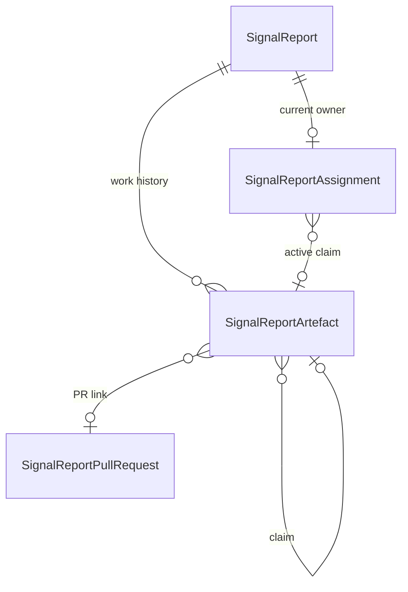

# Signals work claims and pull requests

A report has one current owner, an append-only history of work attempts, and any
number of linked GitHub pull requests. Internal tasks and external agents use the
same claim and linking operations. External agents do not need a task record.

`SignalReportAssignment` retains ownership fields and gains `claim_id`. This
points to a `work_claim` artefact; its UUID identifies a work attempt. There is no
separate session table. `work_release` records release or takeover, and notes,
commits, task runs, and PR links can reference their claim. Claim and release
history and PR links cannot be edited or deleted through the artefact API.

`SignalReportPullRequest` stores one PR per `(team, repository, number)`, with URL,
state, and last verification time. Repository identity is case-insensitive.
`pull_request` artefacts connect reports and claims to these records. Multiple
reports can share a PR, and a report can link a stack spanning repositories.
PR attribution belongs to the link, independently of the current owner.

## Caller contract

`POST /api/projects/{team_id}/signals/reports/{report_id}/claim/` and the
`inbox-reports-claim` MCP tool perform the whole interaction:

| Request                                                                      | Effect                                                          |
| ---------------------------------------------------------------------------- | --------------------------------------------------------------- |
| `{}`                                                                         | Start or resume this actor's claim; return `assignee.claim_id`. |
| `{"claim_id":"…","pull_requests":["https://github.com/example/app/pull/1"]}` | Validate ownership and add PR links atomically.                 |
| `{"takeover":true}`                                                          | Release the current claim and begin a new one.                  |
| `{"claim_id":"…","release":true}`                                            | Release ownership; retain all work and PR history.              |

An initial request can include the whole PR list. Subsequent lists are additive,
and retries do not duplicate links. Send the entire known stack together so an
already-merged first PR cannot complete the report before its siblings are linked.
Another actor receives a conflict unless takeover is explicit. A stale claim ID
cannot attach work or release a newer claim. Claims have no timeout or heartbeat.
The authenticated caller determines attribution; supplied actor identities are
not accepted. A terminal report accepts an identical retry by its existing owner,
but cannot acquire a new claim or new PR links.

Internal implementation creation claims the report in the task-creation
transaction. Task-run output imports every `pr_urls` entry, including the legacy
`pr_url`, before evaluating completion. Failed implementations with no remaining
live run or PR can release their claim when a replacement is started. Quota
cancellation releases the task's ownership along with its existing gate records.
Automatic implementation cannot take an existing owner's claim.

## State and callers

GitHub webhooks update the team-scoped shared PR and evaluate every linked report.
Merges are terminal and cannot be downgraded by a late open or close event.
A report completes only when it has at least one PR and every PR is closed or
merged. At least one merge resolves it; an entirely unmerged closed set suppresses
it. Open, draft, or unknown state prevents automatic completion. A resolved report
is never suppressed by a later close event.

List/detail responses expose `pull_requests`, including `attached_by` (actor kind,
user, agent name, task ID), `claim_id`, and `attached_at`. These describe the first
attachment to this report, not the GitHub author. Later attachments remain in the
artefact log. A takeover never rewrites attribution. Imported timestamps identify
the backfill time. Task-output links identify the originating task, with null
claim and attachment time because no attachment event was recorded.

Existing `implementation_pr_*` fields retain a deterministic representative:
unfinished PRs first, then merged, then closed, with URL ordering within each group. Existing
compact cards use that representative. Web and desktop details select a linked PR explicitly.
Batch CI rolls up every active PR: any failure wins; missing answers cannot yield a passing report. PR
checks and review endpoints accept `pull_request_id` to address any linked PR;
the server verifies that it belongs to the requested report and team. Outcome
metrics count distinct linked PRs. Billing and refunds retain report-level rules.

Dismissal, snoozing, or manual resolution considers every linked PR. Only links
attributed to an internal task or system process permit automatic closure.
Changing ownership cannot grant that permission. A PR stays open while another
unfinished report needs it, and GitHub must confirm it is open before closure.
Reviewer assignment is queued after commit for newly linked PRs and reviewer edits.

## Rollout and backfill

1. Apply the additive migration: new PR table, nullable references, and concurrent
   indexes. Deploy the new readers and writers and drain old workers before using
   multiple PRs; old workers still implement single-PR completion.
2. Run `uv run manage.py backfill_report_pull_requests --team-id <id>`. It imports
   only assignment PRs and ownership, recording migration provenance. Historical
   task-output PRs remain in place and are read directly; they are not backfilled.
   Repeat per team; `--batch-size` and the printed `--after` cursor bound/resume work.
3. The backfill locks one report at a time and is safe to rerun. It does not call
   GitHub, change report status, or enqueue reviewers. Imported snapshots have no
   verification timestamp and cannot overwrite a subsequently verified PR state.
   A released legacy assignment has unknown PR attribution and cannot authorize
   automatic closure.
4. Validate links and ownership before removing compatibility code. Assignment PR
   columns and task-run output remain available during rollout. New PR writes fill
   an empty legacy primary, and webhooks keep its state synchronized. Reads always combine artefact links, assignment PRs, and all eligible task-output
   PRs, deduplicated by repository and PR number. Artefact links take precedence.
5. Remove assignment PR fields and assignment fallback reads in a later deployment after all
   teams are backfilled and old callers are retired. Keep assignment ownership and
   task-output reads. Task-only PRs have deterministic selection IDs; a webhook
   persists only its matching PR link, without importing unrelated task history.

Backfill does not recover missed webhook states. Unknown or stale PRs require a
subsequent GitHub event or explicit state reconciliation before auto-completion.

## PR consumer map

| Consumer                                                      | PR source and scope                                                                                  |
| ------------------------------------------------------------- | ---------------------------------------------------------------------------------------------------- |
| Report serializers, REST and MCP                              | Canonical collection; compatibility fields select the same deterministic primary.                    |
| Inbox filters, counts, analytics, kickoff and refund controls | Linked PR collection, with legacy fallback only when the server omits it.                            |
| Web and desktop detail, comments, checks and review actions   | Selected linked PR; request and cache scope follow its identity.                                     |
| Desktop/mobile cards and canvas previews                      | Deterministic primary from the collection.                                                           |
| Batch CI and desktop diff prefetch                            | All active PRs for CI; all visible linked URLs for diff prefetch.                                    |
| Task continuation                                             | Active linked PR attribution identifies the originating task; running task state remains task-owned. |
| Task output receiver                                          | Imports every PR URL through the shared linking service before completion.                           |
| GitHub webhooks                                               | Reverse lookup of every linked report, including secondary stack PRs.                                |
| Dismissal and reviewer assignment                             | Every linked PR, with ownership and shared-report safeguards.                                        |
| Notification timing                                           | Canonical links attributed to the implementation task being awaited.                                 |
| Outcome metrics                                               | Distinct linked PRs.                                                                                 |
| Billing eligibility and spend gates                           | Immutable implementation task/run evidence, never externally attached PRs.                           |
| Refund merge state                                            | Canonical state of the particular billed PR; task-output fallback for unmigrated evidence.           |
| Agent instructions and validation scout                       | Full collection and each PR's state; claims and attachment use one interaction.                      |

The web detail view discards superseded checks and comments responses, including
failures, after PR selection changes. Only current requests can set errors or
advance the checks retry counter; selection survives virtual PR ID replacement.
