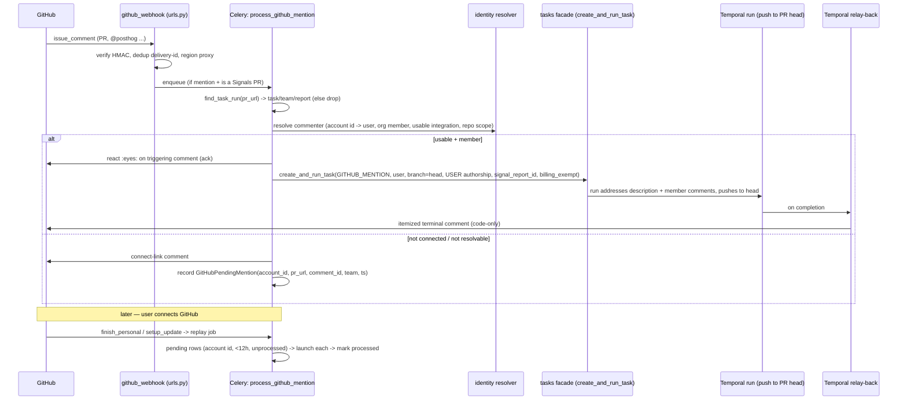

# feat: GitHub @-mention → agent task trigger (Signals PRs)

## Overview

Let a reviewer @-mention the PostHog bot in a conversation comment on a Signals-created PR to
launch a follow-up agent run that addresses the feedback and pushes commits **to that same PR**,
without leaving GitHub.
The project, repo, and report context are **inherited** from the task that opened the PR — no
repo→project guessing.
The commit author is the mentioning user (when they've connected GitHub); un-connected users get a
one-click connect link and their mention is replayed automatically once they connect.

This is "new front door, same engine": the mention path ends in the same
`tasks_facade.create_and_run_task(...)` call every other trigger surface uses.

## Problem Frame

Signals opens autonomous PRs. When a human wants changes, they comment and nothing happens — to
get the agent to act they must leave GitHub and go back to PostHog. This closes that loop on
GitHub. See origin: `docs/brainstorms/2026-07-15-github-mention-agent-trigger-requirements.md`.

## Requirements Trace

Carried from the origin document (R1–R14):

- R1. Eligible commenter @-mentions the bot on a Signals PR → follow-up task for that PR's project.
- R2. Routing inherited from the PR's task (PR URL → `TaskRun` → `Task` → team + report), no repo→project inference.
- R3. Runs as the commenter with real attribution: requires a usable personal GitHub connection (repo-write), active org member of the PR's org, keyed on the **immutable GitHub account id** (never login string). `origin_product=GITHUB_MENTION`, `interaction_origin="github"`.
- R4. Connect-gate: un-connected (or under-scoped, or fully-unresolvable) commenter → bot posts a connect link + records a **pending-mention** row keyed by GitHub account id.
- R5. Replay on connect / scope-upgrade: launch pending mentions from the last 12 h matched by account id; older ignored; processed rows never re-run.
- R6. Feedback scope = PR description + triggering comment + **org-member** conversation comments. Non-member comments are untrusted context. No inline review comments in v1.
- R7. Untrusted input: comment/description text is data, not instructions; mention runs execute with constrained tool/egress scope.
- R8. Push to the existing PR head branch; no new/stacked PR.
- R9. Loop always closes: one reaction ack + one terminal comment (itemized: addressed / skipped-with-reason / needs-clarification / failed / connect-required).
- R10. Summary describes code changes only — no project/customer data (PR comments may be public).
- R11. Volume guards: per-PR/user debounce; mid-run re-mentions **queue**; org-level kill switch.
- R12. On by default for Signals PRs; the kill switch is the off-switch.
- R13. Record the follow-up run against the linked report (`record_implementation_task`), no status change.
- R14. Never change the PR's draft/ready state.

## Scope Boundaries

- Only Signals-opened PRs (resolved via PR URL → task). Mentions on human PRs / bare issues are ignored — general "mention anywhere" + repo→project routing is **phase 2**.
- Only `issue_comment` events (conversation comments). No `pull_request_review_comment` / inline threads.
- Push to existing head branch only; never opens a PR or changes draft/ready state.
- Non-member comment text is never actionable.
- Replay is bounded to recorded pending rows (≤12 h); no "scan all of a user's GitHub comments" backfill.

## Context & Research

### Relevant Code and Patterns

- **Webhook entry / dispatch:** `posthog/urls.py::github_webhook` (~L112–156); `issue_comment` branch ~L141–144. Verifies HMAC once via `products/tasks/backend/webhooks.py::verify_github_signature` (**use this one**, not `posthog/api/github.py`), then `dispatch_github_event`.
- **Conversations dispatcher (pattern to mirror, not reuse):** `products/conversations/backend/api/github_events.py::dispatch_github_event` — installation→team, `delivery_id = X-GitHub-Delivery or sha256(body)[:32]`, Celery `.delay`, returns 202; multi-region via `proxy_to_secondary_region`. Handler `products/conversations/backend/tasks.py::process_github_event` (~L1737) `@shared_task` with Redis dedup; `_handle_github_comment_event` (~L1856) skips `action != "created"` and `performed_via_github_app` (bot-echo guard).
- **Multi-region:** `products/conversations/backend/services/region_routing.py` (`is_primary_region`, `proxy_to_secondary_region`) — **raw-body gotcha:** forward `request.body` before anything touches `request.POST/FILES`.
- **PR → task binding (R2):** `products/tasks/backend/webhooks.py::find_task_run(pr_url, ...)` — matches `TaskRun.output.pr_url`, repo-scoped, prefers non-terminal runs. `Task.signal_report` FK → team + report.
- **Launch interface:** `products/tasks/backend/facade/api.py::create_and_run_task(*, team, title, description, origin_product, user_id, repository=None, create_pr=True, branch=None, signal_report_id=None, start_workflow=True, **extra)`. `**extra` forwards `interaction_origin`, `pr_authorship_mode`, `github_user_token`. **Call through the facade only** (product isolation).
- **Authorship decision:** `OriginProduct` (`products/tasks/backend/models.py` ~L113–137); `get_pr_authorship_mode` / `_resolve_cloud_pr_authorship_mode` (`facade/api.py` ~L2785). `SIGNAL_REPORT` → forced `BOT`; `USER_CREATED`/`SLACK` → `USER` if a usable personal integration resolves, else `BOT`. USER-without-token requires `task.created_by_id == request_user_id`.
- **Identity resolution:** `products/signals/backend/report_generation/resolve_reviewers.py::resolve_org_github_login_to_users` (~L304) + `get_org_member_github_login_to_user_map`; `products/tasks/backend/temporal/process_task/utils.py::user_github_integration_is_usable` (~L672) and `resolve_user_github_integration_for_task` / `_user_integration_has_repository` (~L621). Personal record: `posthog/models/user_integration.py::UserIntegration` (kind=github), login/account-id + user-to-server tokens in `config["github_user"]`.
- **Connect hooks (R5):** `posthog/api/github_callback/personal_finish.py::finish_personal` (~L188) and `finish_personal_setup_update` (~L252) — enqueue replay inline (no Django signal exists).
- **Slack analog (mirror for mapping + relay):** `products/slack_app/backend/models.py::SlackThreadTaskMapping`; relay via `products/tasks/backend/temporal/slack_relay/activities.py::relay_slack_message` keyed off the mapping row (idempotent via run state); facade entry `relay_task_run_message` (`facade/api.py` ~L2703). `interaction_origin` lives in run `extra_state` (`models.py` ~L560), not a column.
- **Report artefact log (R13):** `products/signals/backend/task_run_artefacts.py::record_implementation_task(*, team_id, report_id, task_id, run_id=None, billing_exempt_reason=None)` — dual-writes `SignalReportTask` gate + `task_run` artefact; call inside the task-creation transaction. `SignalReportTask` at `products/signals/backend/models.py` ~L927.
- **Comment helper:** `posthog/models/github_integration_base.py::comment_on_pull_request` / `comment_on_pull_request_from_url` (~L784–812), installation token, top-level issue comment.
- **Second GitHub-triggered-agent reference:** `products/review_hog/backend/api/trigger.py` — repo-allowlist gating + Temporal kickoff (good for R11 guard shape).

### Institutional Learnings

- No `docs/solutions/` tree exists; the origin brainstorm is the source of truth (confirmed by learnings research).
- Prompt-injection guidance lives in `.agents/security.md` + origin R6/R7 — treat comment text as data; only org-member comments actionable; constrained tool/egress for mention runs; code-only summaries.
- Empirical split: GitHub webhooks → Celery; agent runs + relay-back → Temporal.

### External References

- None gathered — the codebase already has the full blueprint (Slack app, Conversations webhook, tasks facade). External research skipped deliberately.

## Key Technical Decisions

- **New `OriginProduct.GITHUB_MENTION` + `pr_authorship_mode=USER`, still passing `signal_report_id`.** Reusing `SIGNAL_REPORT` would force bot-authored commits (defeating R3 attribution). The new origin gets USER authorship while `signal_report_id` preserves the report link. _(Deferred verify: confirm passing `signal_report_id` alone does not set `run_source=SIGNAL_REPORT` and re-force BOT.)_
- **Identity keyed on immutable GitHub account id** (`payload.comment.user.id`), not login; the connect OAuth proves account control, making the pending-row→user binding verified (kills spoofing).
- **Team is always known at gate time** (we only gate on PRs that resolve to a Signals task), so the pending-mention table is team-scoped even for an "unknown" commenter — "unknown" means we can't resolve the _person_, not the project.
- **Mirror Slack for mapping + relay-back:** a `GitHubMentionTaskMapping` row drives an idempotent Temporal relay activity that posts results to the PR — same shape as `relay_slack_message`.
- **R9 realized within GitHub's limits:** conversation comments aren't threadable, so acknowledgement = an `eyes` reaction on the triggering comment + one itemized terminal comment that references each addressed comment (author + short quote) with commit links. True inline per-comment replies would need review-comment threads (out of v1 scope).
- **Billing-exempt follow-ups:** mention runs record against the report with `billing_exempt_reason` so an existing report's PR isn't re-billed.
- **Thin Celery receiver → Temporal run → Temporal relay-back**, mirroring the established webhook/agent split.
- **On by default, no per-project toggle; org-level kill switch is the off-switch** (origin R12/R11).

## Open Questions

### Resolved During Planning

- _Does the identity mapping exist?_ — Yes. `resolve_org_github_login_to_users` + `UserIntegration` already map GitHub → org-member user with tokens. No new linking flow; reuse them. The real gap is push-capability, which the connect-gate secures.
- _How to author as the commenter?_ — New `GITHUB_MENTION` origin + `pr_authorship_mode=USER` + usable personal `UserIntegration` covering the repo (see Key Decisions).
- _Where does replay trigger?_ — Inline in `finish_personal` and `finish_personal_setup_update`.
- _Reply-under-each-comment?_ — Not possible for `issue_comment`; realized as reaction + itemized summary (see Key Decisions).
- _Celery or Temporal?_ — Receiver/replay = Celery; run + relay-back = Temporal.

### Deferred to Implementation

- Exact `create_and_run_task` param set that yields "check out existing PR head + push, no new PR" — whether `create_pr=False` + `branch=<head ref>` suffices or a new run mode/flag is required (Unit 6 is the spike).
- Whether `signal_report_id` implicitly forces `run_source=SIGNAL_REPORT` (would re-force BOT) — verify against `bootstrap_task_run` (`facade/api.py` ~L2880) at implementation time.
- Installation-token refresh/expiry semantics for posting ack/terminal comments (no documented learning; confirm against `Integration`/`GitHubIntegration` token refresh).
- Exact debounce/rate-limit thresholds and the kill-switch storage (org setting vs team flag) — pick during Unit 5.
- Whether the relay-back rides a dedicated Temporal relay workflow (Slack shape) or a run-completion hook.

## High-Level Technical Design

> _This illustrates the intended approach and is directional guidance for review, not implementation specification. The implementing agent should treat it as context, not code to reproduce._

## Implementation Units

Grouped into three phases. Dependency order within each.

### Phase 1 — Foundations

- [ ] **Unit 1: Data layer — origin value + two models + migration**

**Goal:** Add the `GITHUB_MENTION` origin and the two persistence tables the flow needs.

**Requirements:** R3, R4, R5, R11, R13.

**Dependencies:** None.

**Files:**

- Modify: `products/tasks/backend/models.py` (add `OriginProduct.GITHUB_MENTION = "github_mention"`)
- Create: model `GitHubPendingMention` and model `GitHubMentionTaskMapping` (in the owning product — `products/signals/backend/models.py` for the pending table since it is a Signals-domain concern; `GitHubMentionTaskMapping` alongside it or under tasks — decide by ownership, mirror `SlackThreadTaskMapping` placement)
- Create: Django migration for both models + the enum value
- Test: `products/signals/backend/test/test_github_mention_models.py`

**Approach:**

- `GitHubPendingMention` (team-scoped via `TeamScopedRootMixin`): `team` FK, `github_account_id` (BigInteger, immutable id), `github_login` (display only), `pr_url`, `pr_number`, `repository`, `comment_id`, `installation_id`, `created_at`, `processed_at` (nullable). Lookup index on `(github_account_id, processed_at, created_at)`. Team is always set (gate only fires on resolved Signals PRs).
- `GitHubMentionTaskMapping` (mirror `SlackThreadTaskMapping`, `TeamScopedRootMixin`): `team`, `integration` FK, `task` FK, `task_run` FK, `repository`, `pr_url`, `pr_number`, `triggering_comment_id`, `commenter_github_account_id`, cursor fields for relay idempotency, `UniqueConstraint(pr_url, task_run)` (one mapping per run per PR).

**Execution note:** New team-scoped models must start on a fail-closed manager (`TeamScopedRootMixin`) per repo IDOR rules; add to scoping baseline if required.

**Patterns to follow:** `products/slack_app/backend/models.py::SlackThreadTaskMapping`; `posthog/models/scoping/README.md`.

**Test scenarios:**

- Pending row uniqueness + the `(account_id, processed_at, created_at)` lookup returns only unprocessed rows within a window.
- Mapping row round-trips `task_run` ↔ PR.
- Team-scoping manager blocks cross-team access.

**Verification:** Migration applies cleanly; models importable; scoping check passes.

---

- [ ] **Unit 2: GitHub API helpers — reaction + feedback gathering**

**Goal:** Post an `eyes` reaction on a comment and gather the feedback corpus (description + member comments).

**Requirements:** R6, R9.

**Dependencies:** None.

**Files:**

- Modify: `posthog/models/github_integration_base.py` (add `add_reaction_to_comment(repository, comment_id, content)`; add `list_pr_issue_comments(repository, pr_number)` if not present)
- Test: `posthog/models/test/test_github_integration_base.py` (or existing test module)

**Approach:**

- Reaction: POST `/repos/{owner}/{repo}/issues/comments/{comment_id}/reactions` with `content="eyes"` via the installation token. No such helper exists today.
- Comment gathering: PR body from existing `get_pull_request`; conversation comments via a list helper; org-member filtering happens in Unit 3/5, not here.

**Patterns to follow:** existing `comment_on_pull_request` (installation-token request shape).

**Test scenarios:** reaction request shape/headers; comment listing paginates; installation-token auth path.

**Verification:** Helpers return structured success/failure like the existing comment helper.

---

- [ ] **Unit 3: Commenter → PostHog user identity resolution**

**Goal:** Resolve a GitHub commenter to an eligible, push-capable PostHog user for a given PR's team, or a precise ineligibility reason.

**Requirements:** R3, R4, R6.

**Dependencies:** Unit 1.

**Files:**

- Create: `products/signals/backend/github_mention/identity.py`
- Test: `products/signals/backend/github_mention/test/test_identity.py`

**Approach:**

- Input: PR's team/org + `payload.comment.user.id` (immutable) + login. Resolve to org-member `User` (reuse `resolve_org_github_login_to_users`), but **verify by account id**, treating login only as a hint.
- Check `user_github_integration_is_usable` + repo coverage (`_user_integration_has_repository`).
- Return an outcome enum: `ELIGIBLE(user)` / `NOT_MEMBER` / `NOT_CONNECTED` / `NO_REPO_SCOPE` / `UNRESOLVABLE`.

**Execution note:** Test-first — this is the security boundary; write the eligibility matrix as failing tests first.

**Patterns to follow:** `resolve_reviewers.py`, `process_task/utils.py` usability checks.

**Test scenarios:** member+usable+repo → ELIGIBLE; member+no integration → NOT_CONNECTED; member+integration-without-repo → NO_REPO_SCOPE; non-member → NOT_MEMBER; login match but account-id mismatch → not treated as eligible (spoof guard); unknown account → UNRESOLVABLE.

**Verification:** Every branch of the matrix is covered and account-id is the trust anchor.

---

### Phase 2 — Trigger path

- [ ] **Unit 6: Push-to-existing-PR-branch run mode (facade capability)**

**Goal:** Enable a run that checks out an existing remote PR head branch and pushes commits to it without opening a new PR. _(Sequenced early — it is the riskiest unknown and gates the feature's value.)_

**Requirements:** R8, R14.

**Dependencies:** Unit 1.

**Files:**

- Modify: `products/tasks/backend/facade/api.py` and the run bootstrap/workflow (`products/tasks/backend/temporal/process_task/…`) to support an "existing head branch, push-only" mode
- Test: `products/tasks/backend/test/…` (facade + workflow-config level)

**Approach:**

- Spike first: determine empirically whether `create_and_run_task(create_pr=False, branch=<PR head ref>)` already clones + checks out the head and pushes, or whether a new mode/flag (e.g. an `existing_pr_url` / `push_to_branch` extra) is required. The sandbox currently assumes it creates a branch and opens a draft PR.
- Must not flip draft/ready state (R14) and must not open a second PR.

**Execution note:** Characterization-first — capture current create-PR behavior before adding the push-only path.

**Patterns to follow:** `bootstrap_task_run`, `_resolve_cloud_pr_authorship_mode`, the Signals autostart run config.

**Test scenarios:** run configured with an existing head ref pushes commits there; no new PR object created; draft/ready unchanged; USER authorship attaches the commenter as git author when a token is present, falls back to BOT otherwise.

**Verification:** A configured run appends commits to a designated existing branch and opens nothing new.

---

- [ ] **Unit 4: Webhook receiver — dispatcher wiring, mention detection, dedup, region proxy**

**Goal:** Detect a bot @-mention on a Signals PR comment and enqueue processing, coexisting with the Conversations handler.

**Requirements:** R1, R2, R11.

**Dependencies:** Units 1, 3.

**Files:**

- Modify: `posthog/urls.py` (`github_webhook` `issue_comment` branch — add a sibling mention dispatch alongside `dispatch_github_event`)
- Create: `products/signals/backend/github_mention/webhook.py` (mention detection + enqueue)
- Test: `products/signals/backend/github_mention/test/test_webhook.py`

**Approach:**

- Reuse `verify_github_signature` (already done upstream in `github_webhook`).
- Detect `@<GITHUB_APP_SLUG bot login>` in `payload.comment.body`; ignore `action != "created"` and `performed_via_github_app` (bot-echo/loop guard).
- Extract PR URL from `payload.issue.pull_request.html_url`; `find_task_run` → if not a Signals PR, drop silently (v1 scope).
- Dedup on `X-GitHub-Delivery` (mirror Conversations Redis dedup). Per-PR/per-user debounce here.
- Region: if this region doesn't own the PR's team, `proxy_to_secondary_region(request.body, …)` (raw-body gotcha).
- Enqueue Celery `process_github_mention`.

**Patterns to follow:** `dispatch_github_event`, `region_routing.py`, `review_hog/backend/api/trigger.py` (guards).

**Test scenarios:** mention on a Signals PR enqueues; non-mention ignored; bot's own comment ignored; comment on a non-Signals PR dropped; duplicate delivery id deduped; wrong-region request proxied with intact raw body; edited comment (`action=edited`) ignored.

**Verification:** Only genuine bot mentions on Signals PRs enqueue exactly once; Conversations routing still fires for its teams.

---

- [ ] **Unit 5: Mention orchestration — launch-or-gate**

**Goal:** The core Celery task: acknowledge, gather feedback, and either launch the follow-up run or trigger the connect-gate; enforce concurrency + kill switch.

**Requirements:** R1, R3, R4, R6, R7, R9, R11, R12, R13, R14.

**Dependencies:** Units 1, 2, 3, 4, 6.

**Files:**

- Create: `products/signals/backend/github_mention/process.py` (Celery `process_github_mention`)
- Test: `products/signals/backend/github_mention/test/test_process.py`

**Approach:**

- Re-resolve PR → task → team + report; short-circuit if org kill switch is on.
- Resolve commenter identity (Unit 3).
- **ELIGIBLE:** react `eyes` (ack); gather description + member comments (Unit 2), filtering non-member comments to untrusted context; in one transaction call `create_and_run_task(origin_product=GITHUB_MENTION, user_id=<commenter>, repository, branch=<PR head ref>, create_pr=False + push-mode (Unit 6), pr_authorship_mode=USER, signal_report_id, interaction_origin="github", constrained scope, **extra)` + write `GitHubMentionTaskMapping` + `record_implementation_task(billing_exempt_reason=…)`.
- **Concurrency (R11):** if a non-terminal mapping run exists for this PR, record the mention as queued and process after the active run finishes (do not spawn a parallel run).
- **Not ELIGIBLE:** post the connect/re-scope link comment and upsert a `GitHubPendingMention` row (keyed by account id) — including the `UNRESOLVABLE` case (row claimed on later connect).
- Constrained tool/egress scope (R7) passed through to the run config.

**Execution note:** Start with a failing integration test for the ELIGIBLE happy path (mention → run created with USER authorship + report link + mapping row).

**Patterns to follow:** Slack `task_creation.py` (ack + connect/recovery strategies); `auto_start.py::maybe_autostart_implementation_task` (facade call + `record_implementation_task` in one transaction).

**Test scenarios:** eligible → run created (GITHUB_MENTION, USER authorship, signal_report_id set, billing-exempt), mapping + report artefact written, reaction posted; not-connected → connect comment + pending row, no run; unresolvable → generic connect comment + pending row keyed by account id; mid-run re-mention queues (no parallel run); kill switch on → nothing happens; non-member comments excluded from the actionable corpus.

**Verification:** Each identity outcome produces the right side effects; no double-run; report stays in sync; no draft/ready change.

---

### Phase 3 — Feedback & recovery

- [ ] **Unit 7: Relay-back — post results to the PR**

**Goal:** On run completion, post the itemized terminal comment (and progress ack lifecycle) to the PR, code-only.

**Requirements:** R9, R10.

**Dependencies:** Units 1, 2, 5.

**Files:**

- Create: GitHub relay activity/path mirroring `products/tasks/backend/temporal/slack_relay/activities.py::relay_slack_message` (GitHub analogue keyed off `GitHubMentionTaskMapping`)
- Modify: the facade relay entry (analogue of `relay_task_run_message`) to route `interaction_origin="github"` runs to the GitHub relay
- Test: `products/signals/backend/github_mention/test/test_relay.py`

**Approach:**

- On completion, load the mapping row, build the terminal comment: itemize each addressed comment (author + short quote + commit ref), list skipped items with reasons, or the failure/needs-clarification variant. Post via `comment_on_pull_request_from_url`.
- Idempotency via run state (mirror `slack_sent_relay_ids`).
- **R10 guard:** the summary is derived from code diffs/commit metadata only — never echoes queried project/customer data.

**Patterns to follow:** `relay_slack_message`, `relay_task_run_message`, run-state idempotency window.

**Test scenarios:** completion posts one itemized comment; re-delivery doesn't double-post; failed run posts the failure variant; summary contains no project/customer data (assert on a run whose context included such data).

**Verification:** Exactly one terminal comment per run outcome; content is code-only.

---

- [ ] **Unit 8: Connect-gate replay job**

**Goal:** When a user connects GitHub or upgrades scopes, replay their pending mentions from the last 12 h.

**Requirements:** R5.

**Dependencies:** Units 1, 3, 5.

**Files:**

- Modify: `posthog/api/github_callback/personal_finish.py` (`finish_personal` ~L188; `finish_personal_setup_update` ~L252 — enqueue replay inline)
- Create: Celery `replay_github_pending_mentions(user_id, github_account_id)` (co-located with `process.py`)
- Test: `products/signals/backend/github_mention/test/test_replay.py`

**Approach:**

- On connect/scope-upgrade, resolve the connected GitHub account id; enqueue the replay task.
- Replay: select `GitHubPendingMention` where `github_account_id == …`, `processed_at is null`, `created_at >= now-12h`; for each, re-run the Unit 5 eligibility + launch path (org membership + repo scope re-checked at replay time against the PR's team); mark `processed_at`. Rows older than 12 h are marked skipped/ignored.
- Idempotent: the `processed_at` guard prevents double-processing across duplicate connect callbacks.

**Execution note:** Test-first for the 12 h window + idempotency.

**Patterns to follow:** `record_implementation_task` transaction discipline; Celery sweep tasks in the tasks facade.

**Test scenarios:** connect replays an in-window unprocessed row → run launched, row marked processed; row >12 h ignored; already-processed row not re-run; connect by an account matching a pending row on a PR outside the user's orgs → dropped at re-check; duplicate connect callbacks don't double-launch.

**Verification:** A gated mention resolves into a run after the user connects, exactly once, within the window.

---

## System-Wide Impact

- **Interaction graph:** new branch in `github_webhook` runs alongside Conversations' `issue_comment` handling — both must fire for their respective teams; the mention path must not swallow or block `dispatch_github_event`. Connect callbacks (`personal_finish.py`) gain a side effect (replay enqueue).
- **Error propagation:** webhook receiver must always return 2xx quickly (GitHub retries on non-2xx → duplicate deliveries); all heavy work is in Celery/Temporal. Identity/eligibility failures are user-facing GitHub comments, not 5xx.
- **State lifecycle risks:** duplicate deliveries (delivery-id dedup), bot-comment loops (`performed_via_github_app` guard + reaction/summary idempotency), pending-row double-processing (`processed_at` guard), mid-run re-mentions (queue, not parallel).
- **API surface parity:** none new external; reuses the existing webhook endpoint. MCP/OpenAPI unaffected (no new DRF surface) — confirm the models don't need serializer exposure.
- **Integration coverage:** end-to-end (webhook → run → relay) needs an integration test the unit tests won't prove; the eligibility matrix and dedup are the highest-value unit coverage.

## Risks & Dependencies

- **Push-to-existing-branch (Unit 6) is the load-bearing unknown.** If the sandbox can't be configured to push to an arbitrary existing head, the whole feature stalls — spike it first.
- **Authorship regression:** if `signal_report_id` implicitly forces `run_source=SIGNAL_REPORT`, commits go bot-authored despite `GITHUB_MENTION`. Verify early (Unit 5/6 boundary).
- **Prompt injection (R7):** the constrained-scope run mode is new; if the run inherits full tool/egress it's an exploitable confused-deputy. Treat the scope constraint as a hard requirement, not a nice-to-have.
- **Region routing:** mis-routing creates the run in the wrong region (wrong team) — the raw-body proxy gotcha must be handled exactly as Conversations does.
- **Billing:** forgetting `billing_exempt_reason` double-charges the report; covered by Unit 5 tests.
- **Cross-product ownership:** Units 1/6 touch `products/tasks` (facade + workflow) — coordinate with the Tasks owners; call only through `facade/api.py`.

## Documentation / Operational Notes

- Update product docs for Signals PR review (how to @-mention, connect requirement, 12 h replay window).
- Ensure the production GitHub App is subscribed to `issue_comment` webhook events (it is, for Conversations — confirm scope covers Signals-only teams).
- Add monitoring: mention-received / eligible / gated / replayed / run-launched counters; alert on webhook 5xx and relay failures.
- Kill switch (R11/R12) documented for support/ops as the off-switch.

## Alternative Approaches Considered

- **Trust repo access, run as PR owner** (rejected in brainstorm): loses attribution, fails open on public repos. See origin Key Decisions.
- **Reuse `SIGNAL_REPORT` origin:** forces bot-authored commits — rejected for R3.
- **Fetch all of a user's past GitHub comments on connect** (via search `commenter:` qualifier): rate-limited + eventually consistent; the pending-mention table is the reliable mechanism.
- **True per-comment inline replies:** not available for `issue_comment`; would require inline review-comment threads (phase 2 / out of scope).

## Phased Delivery

- **Phase 1 (Foundations):** Units 1–3 — data + helpers + identity. Independently testable, no user-visible behavior.
- **Phase 2 (Trigger path):** Units 6, 4, 5 — the end-to-end happy path (mention → attributed commits on the PR). Ship behind the kill switch defaulted off until validated, then flip default-on.
- **Phase 3 (Feedback & recovery):** Units 7, 8 — relay-back polish + connect-gate replay. Phase 2 is usable without 8 (gated users just re-mention after connecting), so 8 can trail if needed.

## Sources & References

- **Origin document:** [docs/brainstorms/2026-07-15-github-mention-agent-trigger-requirements.md](../brainstorms/2026-07-15-github-mention-agent-trigger-requirements.md)
- Webhook/dispatch: `posthog/urls.py`, `products/conversations/backend/api/github_events.py`, `products/conversations/backend/tasks.py`, `products/conversations/backend/services/region_routing.py`
- Tasks facade/authorship: `products/tasks/backend/facade/api.py`, `products/tasks/backend/models.py`, `products/tasks/backend/temporal/process_task/utils.py`, `products/tasks/backend/webhooks.py`
- Identity: `products/signals/backend/report_generation/resolve_reviewers.py`, `posthog/models/user_integration.py`, `posthog/api/github_callback/personal_finish.py`
- Slack analog: `products/slack_app/backend/models.py`, `products/tasks/backend/temporal/slack_relay/activities.py`
- Report artefacts: `products/signals/backend/task_run_artefacts.py`, `products/signals/backend/models.py`
- GitHub client: `posthog/models/github_integration_base.py`
- Second reference: `products/review_hog/backend/api/trigger.py`
