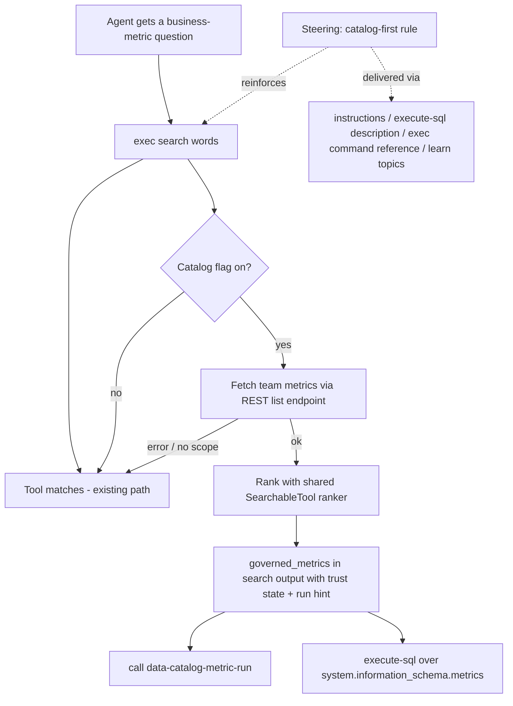

# MCP data catalog discovery overhaul - Plan

## Goal Capsule

- **Objective:** Agents answering data questions through the PostHog MCP server reliably discover and use governed data catalog metrics — via keyword search, prompt steering, and run ergonomics — instead of answering from plausible raw warehouse tables.
- **Authority hierarchy:** Repo conventions (`CLAUDE.md`, mandatory skills such as `/writing-tests` and `/writing-evals`) override this plan on mechanics; this plan overrides ad-hoc judgment on scope and approach; Product Contract requirements override Implementation Unit details when they conflict.
- **Execution profile:** TypeScript in `services/mcp` (U1–U4), Python evals in `products/data_catalog/evals` (U5). No Django backend, frontend, or `ee/hogai` changes.
- **Stop conditions:** Stop and surface to the user if (a) the metrics list REST endpoint cannot be called from the MCP server's request context (auth/scope shape prevents it), or (b) making search async-fetching requires restructuring the exec dispatch in a way that touches unrelated verbs.
- **Tail ownership:** The implementer owns lint/typecheck/test green, `hogli ci:preflight` before push, and removal of abandoned experimental code.

---

## Product Contract

### Summary

Make governed data catalog metrics discoverable end-to-end through the MCP server: `exec search` surfaces matching metrics with trust state and a run hint, catalog-first steering reaches every client mode, and an eval guards the discovery-first behavior against regression.

### Problem Frame

The PostHog Slack app (and every other MCP consumer) answers data questions through the MCP server's single-exec `exec` tool. When asked for "top customers by revenue", the Slack agent ran `search revenue`, got only tool-name matches, fell back to raw schema discovery, and answered from an uncertified warehouse table — even though a governed metric (`top_customers_mrr_by_business_model`) existed whose name and description matched the question almost exactly. The agent's own retro identified the root cause: MCP search indexes only tool names/titles/descriptions (`services/mcp/src/tools/tool-search.ts`), so the catalog is invisible at the exact moment discovery happens. The existing metric-discovery steering (spliced into the `execute-sql` prompt) is passive and arrives too late in the workflow to redirect an agent that already found a plausible table.

### Requirements

**Search**

- R1. `exec search <words>` returns governed metrics whose name, display name, or description match the query, ranked, when the `product-data-catalog` flag is enabled for the org.
- R2. Each metric result carries its trust state (approved vs proposed, drifted or not) so the agent can distinguish canonical metrics from unreviewed ones.
- R3. Metric search results include the next step: run the metric via `data-catalog-metric-run`, or inspect it via `system.information_schema.metrics`.
- R4. Any failure in the metrics lookup (API error, missing `data_catalog:read` scope, timeout) degrades to today's tools-only search result; search never errors because of the catalog.
- R5. Orgs without the flag get byte-identical search output to today.

**Steering**

- R6. Catalog-first guidance reaches every client mode that can query data — single-exec CLI consumers (Slack, PostHog Code, Claude Code), tools-mode clients, and Claude chat hosts — and states the workflow rule explicitly: for revenue/MRR/ARR/customer-ranking and similar business-metric questions, consult the metrics catalog before raw schema discovery.
- R7. Steering and search reinforce each other: the guidance mentions that `search` surfaces governed metrics, and empty search results point at the catalog when the flag is on.

**Regression protection**

- R8. A sandboxed eval grades discovery-first behavior: seeded with a governed metric and a tempting raw warehouse table, an agent asked a matching business-metric question is scored on whether it consulted the catalog before answering.

**Non-regression (search quality and latency)**

- R9. With the flag on, the tool `matches` list and its ranking are byte-identical to today's output for any query — governed metrics are purely additive in their own section, and a tool-discovery task is not degraded by their presence.
- R10. The metrics lookup is bounded by an explicit short timeout (~2s) and instrumented (duration and failure class), so the latency overhead it adds to `exec search` is both capped and observable; a timed-out lookup degrades to tools-only results per R4.

### Scope Boundaries

- Table certifications and relationship proposals stay out of search results — they already surface through `system.information_schema.tables`/`relationships` enrichment.
- No new backend search API; discovery reads the existing `data_catalog/metrics` REST list endpoint and `system.information_schema`.
- No Max (`ee/hogai`) wiring, no frontend UI, no changes to the Slack app's own prompting.

#### Deferred to Follow-Up Work

- Trust marks for certified tables in search results (revisit if metric search proves the pattern).
- Indexing other catalog-adjacent entities (insights, dashboards) in `exec search`.

---

## Planning Contract

### Key Technical Decisions

- KTD1. **Live fetch + rank inside the MCP server**, reading the existing REST metrics list endpoint (`GET /api/projects/{id}/data_catalog/metrics/`) and ranking client-side. (session-settled: user-approved — chosen over hint-only steering and over a new backend search API: the feedback named searchability the highest-leverage fix, a team's governed-metric count is small enough to rank in-process, and the REST endpoint keeps team scoping and `data_catalog:read` enforcement server-side.)
- KTD2. **Metrics only in search.** (session-settled: user-approved — chosen over also surfacing certifications/trusted joins: those already reach agents through information-schema enrichment, and mixing entity kinds into one result list dilutes the ranking.)
- KTD3. **Reuse the existing field-weighted ranker.** Metrics map onto the structural `SearchableTool` shape (`name`, `title` ← display name, `description`) so `searchToolsRanked`/`searchToolsRegex` in `services/mcp/src/tools/tool-search.ts` serve both entity kinds — no second ranking implementation.
- KTD4. **Hook injection, not direct coupling.** The `search` verb takes an optional metrics-search hook via `ExecToolOptions`; `services/mcp/src/hono/tool-executor.ts` constructs it only when `state.toolFeatureFlags[PRODUCT_DATA_CATALOG_FLAG] === true`. `exec.ts` stays ignorant of the API client, and flag-off behavior is a structural no-op (R5) rather than a runtime branch.
- KTD5. **Steering strengthened inside the existing template system** — `services/mcp/src/templates/sections/metric-discovery.md`, the instructions formatter, and the exec help catalog — not a new prompt channel. The section already renders into all three delivery paths (instructions, `execute-sql` description, Claude exec command reference); the change is content (catalog-first workflow rule, search mention), not plumbing.
- KTD6. **Evals extended on the existing sandboxed harness** in `products/data_catalog/evals` (seeders + scorers pattern already established there). (session-settled: user-approved — CI cost of live-agent evals accepted for this regression class.)

### High-Level Technical Design

The discovery journey after this plan, and where each surface delivers it:

Request-time state that makes this work is already resolved per request in `services/mcp/src/hono/request-state-resolver.ts`: the `product-data-catalog` flag is force-joined into the evaluated flag set, and `state.context` exposes the authenticated API client the generated data-catalog tools already use.

### Sequencing

U1 → U2 → U3 form the search chain. U4 (steering) depends on U2 only for the "search surfaces metrics" sentence. U5 (evals) runs last — it exercises the shipped search behavior against a local stack.

---

## Implementation Units

### U1. Governed-metrics search module

- **Goal:** A self-contained searcher that fetches a team's governed metrics and returns ranked matches for a query.
- **Requirements:** R1, R2, R4, R10
- **Dependencies:** none
- **Files:** `services/mcp/src/tools/metric-search.ts` (new), `services/mcp/tests/unit/metric-search.test.ts` (new; the package's vitest include is `tests/**/*.test.ts`)
- **Approach:** Export a factory that takes the request context and returns `(query) => Promise<GovernedMetricMatch[]>`. Fetch via `context.api.request` against the metrics list path (same pattern as `services/mcp/src/tools/generated/data_catalog.ts`), map rows to the `SearchableTool` shape, route regex-shaped queries through `searchToolsRegex` and plain words through `searchToolsRanked`, cap results (~5), truncate descriptions (~200 chars). A match carries `name`, `display_name`, `description`, `status`, `is_drifted`. Every failure path resolves to `[]`. Bound the fetch with an explicit ~2s timeout (`context.api.request` exposes no timeout/AbortSignal option, so race the request against a timer or extend the client) that resolves to `[]` — R4's timeout degradation has no mechanism otherwise. Instrument the lookup: record duration and failure class (HTTP status / error name only, never response bodies) following the prometheus metrics pattern in `services/mcp/src/hono/tool-executor.ts` (`toolCallDurationSeconds`), so capped latency and silent degradation are observable (R10).
- **Patterns to follow:** `services/mcp/src/tools/tool-search.ts` (SearchableTool contract), `services/mcp/src/tools/generated/data_catalog.ts` (API request shape).
- **Test scenarios:**
  - Query "revenue customers" against a mocked metric list containing a matching and a non-matching metric returns only the match, name-field hits ranked above description-only hits.
  - Regex-metacharacter query (e.g. `mrr.*`) routes through the regex predicate and matches on name.
  - API request rejection (403, network error) resolves to an empty array without throwing.
  - A never-settling request resolves to an empty array within the timeout bound.
  - More matches than the cap returns only the cap, best-ranked first.
- **Verification:** Unit tests pass; module has no imports from `exec.ts` (dependency direction stays hook-shaped).

### U2. `search` verb returns governed metrics

- **Goal:** `exec search` output includes a `governed_metrics` section with trust state and a run hint when the hook is present.
- **Requirements:** R1, R2, R3, R4, R5, R7, R9
- **Dependencies:** U1
- **Files:** `services/mcp/src/tools/exec.ts`, the package's existing exec tests (extend)
- **Approach:** Add `searchGovernedMetrics?` to `ExecToolOptions`. In the `search` case, after tool matching, await the hook inside try/catch. Non-empty results add `governed_metrics` (name, display name, truncated description, status, drifted flag) plus a hint distinguishing canonical (approved and not drifted) from unreviewed metrics and naming the two consumption paths (`data-catalog-metric-run`, `system.information_schema.metrics`). When zero tools match but the hook exists, extend the existing "No tools matched" hint with a pointer at the metrics catalog. Hook absent → output identical to today.
- **Test scenarios:**
  - Hook returning matches: output JSON contains `governed_metrics` with status/drift fields and the run hint; the tool `matches` array is byte-identical to the hookless output for the same query (guards R9 — metrics are additive, never re-rank or displace tool results).
  - Hook rejecting: output equals the hookless output byte-for-byte (guards R4).
  - No hook configured: existing search tests still pass unchanged (guards R5).
  - Zero tool matches with hook present: hint mentions the metrics catalog.
- **Verification:** Extended exec tests pass; existing search tests unmodified except where output additively grew.

### U3. Flag-gated wiring in the tool executor

- **Goal:** The hook exists only for catalog-enabled orgs, on every exec entry path.
- **Requirements:** R1, R5
- **Dependencies:** U1, U2
- **Files:** `services/mcp/src/hono/tool-executor.ts`, `services/mcp/src/cli/index.ts`
- **Approach:** In `createResolvedExecTool`, construct the U1 searcher from `state.context` when `state.toolFeatureFlags?.[PRODUCT_DATA_CATALOG_FLAG] === true` and pass it through `ExecToolOptions`. Mirror the wiring in the CLI harness's `createExecTool` call sites if the context there supports it; otherwise pass nothing (CLI keeps current behavior).
- **Test scenarios:**
  - Resolved exec tool with flag on: search output contains `governed_metrics` (integration-level test with mocked API).
  - Flag off/undefined: hook is not constructed; no metrics fetch occurs (assert no API call).
- **Verification:** `pnpm --filter=@posthog/mcp run typecheck` clean; integration test proves the flag gate.

### U4. Catalog-first steering across client modes

- **Goal:** Every data-querying client mode receives the explicit catalog-first workflow rule, and steering references search.
- **Requirements:** R6, R7
- **Dependencies:** U2 (for the search mention)
- **Files:** `services/mcp/src/templates/sections/metric-discovery.md`, `services/mcp/src/lib/instructions-formatter.ts` (only if a delivery path lacks the section), `services/mcp/src/tools/exec-help.ts` / instructions builder learn-topic entries (Claude chat hosts)
- **Approach:** Rewrite `metric-discovery.md` from passive description to an ordered workflow rule: for business-metric questions (revenue, MRR/ARR, customer rankings, conversion/retention KPIs), query or search the metrics catalog **before** raw schema discovery; treat only approved, non-drifted metrics as canonical; report trust state in answers. Add one sentence that `search <keywords>` surfaces governed metrics. Audit the three delivery paths (instructions payload, `execute-sql` description via `formatExecuteSqlDescription`, Claude exec command reference / help catalog) to confirm each renders the updated section when the flag is on — the formatter already gates all three on `dataCatalogEnabled`, so this is expected to be content-only.
- **Execution note:** Verify delivery by rendering, not by reading the formatter: snapshot or string-assert each built payload with the flag on and off.
- **Test scenarios:**
  - Formatter output with `dataCatalogEnabled: true` contains the catalog-first rule in instructions mode, exec-description mode, and the Claude command-reference path.
  - With `dataCatalogEnabled: false`, none of the payloads mention the catalog (existing byte-identical guarantee preserved).
- **Verification:** Existing instructions-formatter tests extended and green.

### U5. Discovery-first eval

- **Goal:** A regression gate that fails when an agent answers a business-metric question from raw tables while a matching governed metric exists — and a control gate that fails if metric results degrade ordinary tool discovery.
- **Requirements:** R8, R9
- **Dependencies:** U1–U4 (runs against the implemented behavior)
- **Files:** `products/data_catalog/evals/` — new cases in the existing suite (alongside `eval_governed_metrics.py` / `eval_semantic_discovery.py`), extending `seeders.py` and `scorers.py`
- **Approach:** Seeder creates an approved, non-drifted metric whose name/description match the question (e.g. a top-customers-by-MRR metric) plus a plausible uncertified warehouse table covering the same domain. The case asks the revenue-ranking question. Scorer passes when the transcript shows catalog consultation (metric search hit, `system.information_schema.metrics` query, or `data-catalog-metric-run` call) before the final answer, and the answer is derived from the metric. Add a tool-discovery control case guarding R9: with the same metrics seeded, ask a task whose right move is a tool, not a metric (e.g. create a dashboard or fetch a feature flag); the scorer passes when the agent selects the correct tool without detouring through catalog metrics — this catches metric results distracting agents even though the `matches` list itself is untouched. Follow `/writing-evals` for suite/case/scorer mechanics.
- **Execution note:** Invoke the `/writing-evals` skill before writing; the harness and datastore preconditions are documented there.
- **Test scenarios:**
  - Scorer unit test: transcript with catalog-first behavior scores pass; transcript answering from the raw table scores fail (scorer tests live beside the harness per `products/posthog_ai/eval_harness/test/test_data_catalog_scorers.py` precedent).
  - Full eval run against the local stack passes with U1–U4 in place.
- **Verification:** Scorer unit tests green; one local eval run recorded as passing.

---

## Verification Contract

| Gate                       | Command                                                              | Applies to |
| -------------------------- | -------------------------------------------------------------------- | ---------- |
| Typecheck                  | `pnpm --filter=@posthog/mcp run typecheck`                           | U1–U4      |
| Lint/format                | `pnpm --filter=@posthog/mcp run fix`                                 | U1–U4      |
| MCP unit/integration tests | `hogli test services/mcp`                                            | U1–U4      |
| Eval scorer tests          | `hogli test products/posthog_ai/eval_harness/test/`                  | U5         |
| Discovery eval (local)     | `hogli evals` targeting the data_catalog suite, local stack up first | U5         |
| Pre-push                   | `hogli ci:preflight --fix`                                           | all        |

End-to-end proof (required before done): start the local stack and MCP dev server, seed one governed metric with a revenue-flavored name/description, issue `exec search revenue` against the local MCP, and confirm the metric appears in `governed_metrics` with trust state and run hint; confirm a plain tool query's output is unchanged with the catalog flag off. Latency check (R10): time `exec search` with the flag on against the flag-off baseline over a handful of runs and confirm the added overhead stays within the metrics-lookup timeout bound — the search must not get materially slower. Local dev force-enables the flag (`isLocalApi()` path in `services/mcp/src/hono/request-state-resolver.ts`), so flag-off verification happens via the U3 integration test rather than the live local server.

---

## Definition of Done

- All five units implemented with their test scenarios covered; every gate in the Verification Contract green.
- End-to-end proof performed and observed, not inferred from unit tests.
- Flag-off output byte-identical to pre-change behavior (U2/U3 tests demonstrate it).
- Steering content renders in all three delivery paths with the flag on.
- Discovery eval and the tool-discovery control case both pass locally at least once.
- Flag-on vs flag-off latency comparison performed and within the timeout bound (R10).
- No abandoned or experimental code in the diff; comments follow repo conventions (why-only).
- `services/mcp` contributor docs updated only if they document the `search` output shape (check `services/mcp/CONTRIBUTING.md`; skip if silent on it).
