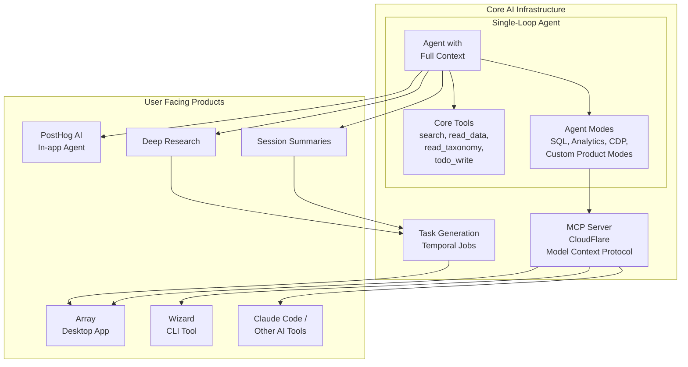
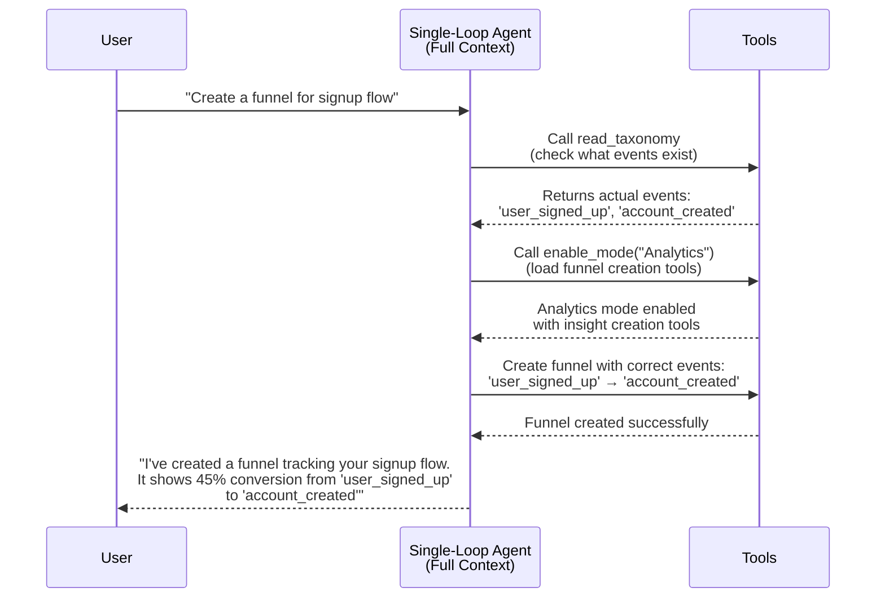
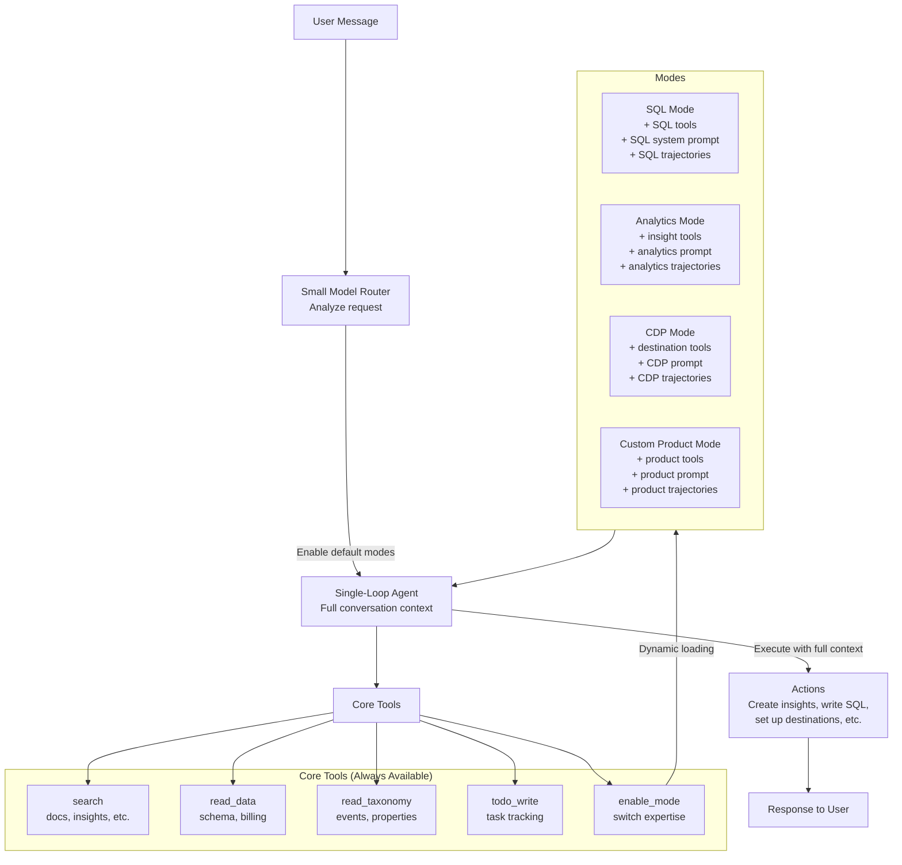

This page provides a technical deep dive into the PostHog AI platform architecture. For a high-level overview, see the [AI platform overview](/handbook/engineering/ai/ai-platform).

## AI platform architecture overview

The following diagram shows how all components of the AI platform work together:

### Key integration points

1. **The agent uses dynamic modes**: The single-loop agent architecture uses dynamically loadable modes that expose PostHog capabilities.

2. **MCP provides universal access**: The MCP server makes agent features accessible to any MCP-compatible client, including Array, Wizard, and third-party tools like Claude Code.

3. **Task generation feeds Array**: Signals from PostHog data, PostHog AI conversations, and Deep Research investigations are processed into structured tasks that Array can execute automatically.

4. **Shared features**: Array, Wizard, and external tools all consume the same agent features through the MCP, ensuring consistency across the platform.

## Single-loop agent architecture

### Mode switching

PostHog AI is based on a single-loop agent architecture, heavily inspired by Claude Code, with some PostHog unique flavour. The core insight is simple: instead of routing between multiple specialized agents that act as black boxes, we have one agent that maintains full conversation context and can dynamically load expertise as needed.

The single-loop agent has direct access to all tools, uses a todo-list pattern to track progress across long-running tasks (just like Claude Code), and provides complete visibility into every step it takes. When it needs specialized knowledge, it doesn't delegate to a sub-agent — it switches its own mode to become an expert in that domain.

### How the single-loop agent works

The key differences from older architectures:
- **No hallucination**: Agent checks `read_taxonomy` before assuming event names exist
- **Full visibility**: All tool calls are visible to the agent throughout the conversation
- **Maintained context**: The agent remembers every decision it made and can build on them
- **Explainable**: The agent can justify every choice because it has complete visibility

### Core tools: Always available

No matter what mode the agent is in, it always has access to a core set of tools:

The **search** tool is unified search with a `kind` discriminator. You can search documentation (`kind=docs`), search existing insights (`kind=insights`), or search other resources as we add them. This replaced having separate `search_docs` and `search_insights` tools.

The **read_data** tool lets the agent read database schema and billing information. The **read_taxonomy** tool is how the agent explores your events, entities, actions, and properties. These are crucial for avoiding hallucination problems we had before — the agent can always check what data actually exists before making assumptions.

The **enable_mode** tool is how the agent switches between different areas of expertise, which we'll discuss in detail next.

Finally, **todo_write** is the tool that lets the agent manage long-running tasks. When you ask for something complex, the agent can write out a plan, track its progress, and make sure it doesn't lose context.

### Agent modes: Dynamic expertise

Here's the key innovation: instead of having specialized sub-agents, we have a single agent that can "switch gear" by switching modes. Each mode gives the agent new tools, a new system prompt with domain expertise, and example workflows (which we call "trajectories") to follow.

It works in two stages. First, a small model router analyzes the user's request and enables some default modes. Then, during the conversation, the agent can call `enable_mode("SQL")` to switch into SQL expert mode, gaining SQL-specific tools and knowledge. The agent knows which tools it had before, which new ones it gained, and can switch back or switch to a completely different mode at any time.

Each mode is defined by three things:

A **routing prompt** that explains when to activate this mode and lists the available tools. This is what the small model router and the main agent use to decide when to switch modes.

A **system prompt** that contains expert instructions for this domain. When the agent switches to CDP mode, for example, it gets a system prompt explaining how CDP destinations work, what Hog functions are, and how transformations should be structured.

**Workflow trajectories** that give the agent examples of how to accomplish tasks. We inject example workflows into the `todo_write` tool description. For instance, the CDP mode might include a trajectory like: "Setting up CDP destination: 1. Write HogQL transformation code, 2. Define input variables, 3. Set event/property filters, 4. Test with sample data before activating."

This architecture allows product teams to create their own modes without touching the core agent. Modes can be composed and nested. Think of it as "thousands of agents" through mode combinations, rather than a fixed set of AI products.

### When do black-box sub-agents still make sense?

There are exceptions. Some processes benefit from being hidden from the main agent — usually when the logic is completely detached from the conversation context, or when you want to use strategies or optimizations that would confuse the main agent if exposed. Our agentic RAG system for insight search is a good example: it iteratively searches through insights and cherry-picks the best ones using a complex scoring system. The main agent doesn't need to see all that — it just needs the final result.

### Architecture diagram

## How PostHog AI and MCP share the same features

The problem we needed to solve: PostHog AI and the MCP server were developed by different teams, didn't offer the same tools, and had completely different architectures. Users would find features in PostHog AI that didn't exist in the MCP, and vice versa.

The solution is an abstraction layer. Agent modes expose both high-level LLM tools (like "create a funnel with these parameters") and low-level API endpoint tools (like "call POST /api/projects/{id}/insights"). Both PostHog AI and the MCP have access to the same features, just through different interfaces.

## How Array and Wizard Fit In

Both Array and the Wizard currently consume the MCP. This integration gives them access to all the agent modes we're building. If Claude Code (which Array uses for code generation) ever becomes a bottleneck, we could swap in PostHog's own single-loop agent since they share the same mental model. We'd need to copy over Claude Code's terminal and file system tools (bash, grep, etc.) and add them as core tools.

We could also tag modes for specific interfaces. For example, a `CodingMode(tags=["array"])` would only be exposed to the Array agent, not to PostHog AI, because it's specific to code generation workflows.

## Glossary

**Agent**: An autonomous AI process that can reason about what to do, plan multiple steps, and take actions by calling tools. PostHog is an agent. Claude is an agent.

**Single-loop architecture**: An agent architecture that maintains full context throughout a conversation without delegating to black-box sub-agents. The agent can see all tools, all previous messages, and all decisions it's made.

**Feature**: Any Agent capability we expose to the user. Creating insights, summarizing sessions, performing a Deep research, all of these are features. 

**Tool**: A capability the agent can call to perform actions — search docs, create insights, write SQL queries, etc.

**Agent mode**: A specialized configuration of an agent that gives it domain-specific tools, expert knowledge (via system prompts), and workflow examples. When PostHog AI switches to "SQL mode," it becomes an expert in writing and debugging SQL queries.

**Trajectory**: An example workflow showing the sequence of steps to accomplish a specific task. We use trajectories instead of the heavier "jobs-to-be-done" framework to teach agents how to use tools together effectively.

**MCP (Model Context Protocol)**: A standard protocol for connecting AI models to external tools and data sources in a structured, secure way. Think of it like an API, but specifically designed for AI agents.

**MCP Server**: The component that exposes tools and data sources following the MCP specification. PostHog's MCP server makes our analytics data available to any MCP-compatible client.

**MCP Client**: The component that connects to MCP servers to discover and use tools. Claude Code, VS Code with AI extensions, and other tools can act as MCP clients.
