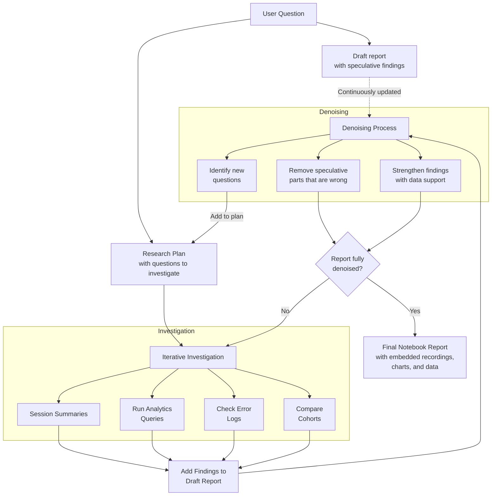
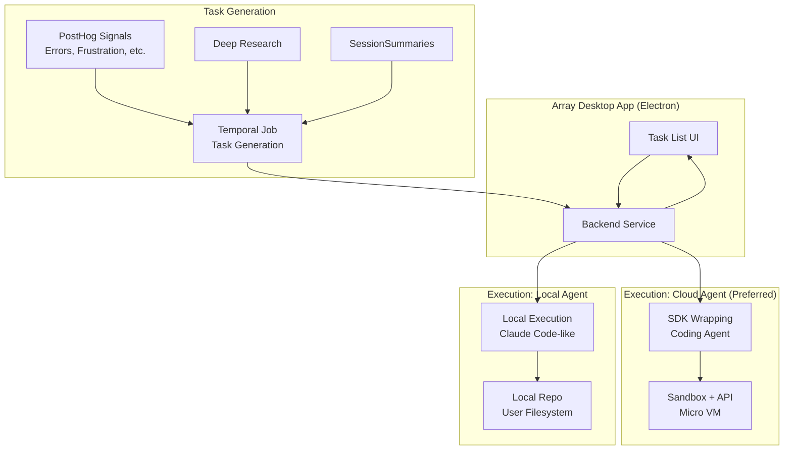

This page provides detailed information about each user-facing product in the PostHog AI platform. For a high-level overview, see the [AI platform overview](/handbook/engineering/ai/ai-platform).

## PostHog AI [Beta]

PostHog AI is our primary in-app agent, accessible through a chat interface embedded directly into the product. Think of PostHog AI as a fundamentally different way to interact with PostHog — instead of clicking buttons and filling out forms, you ask questions and make requests in natural language.

### The problem we're solving

PostHog has grown incredibly powerful, but that power comes with complexity. New users face a learning curve: Which insight type should I use? How do I filter for the data I need? What's the right SQL syntax for this query? Even experienced users spend time navigating through menus and forms to accomplish what they already know they want to do.

PostHog AI eliminates this friction. You don't need to know where a feature lives or how to configure it — you just describe what you want, and PostHog AI handles the details.

### Who uses PostHog AI

Everyone. PostHog AI is designed to be useful whether you're:
- A new user learning PostHog for the first time (PostHog AI explains terminology and walks you through setup)
- An engineer who knows exactly what they want and just wants to say it instead of clicking through the UI
- A product manager who wants quick answers without learning technical details
- A data analyst who needs to write complex SQL queries with help

### How it works

PostHog AI is built on a single-loop agent architecture with dynamic mode switching. When you send a message, PostHog AI analyzes your request, determines which specialized "modes" it needs to activate, and dynamically loads the appropriate tools and expertise. For example, if you ask PostHog AI to "create a funnel tracking the signup flow," it might:

1. Use the `read_taxonomy` tool to check which events actually exist
2. Switch to Analytics mode to access insight creation tools
3. Switch to SQL mode if you need custom transformations
4. Switch to CDP mode if you want to set up a destination based on the funnel results

Throughout this entire process, PostHog AI maintains full context — it can see all previous messages, all decisions it's made, and all tools it's used. This is fundamentally different from older architectures we implemented where specialized sub-agents worked in isolation.

For a technical deep dive on how this works, see the [Architecture page](/handbook/engineering/ai/architecture).

### Key capabilities

PostHog AI can do most things you can do through the PostHog UI:

- **Search and filter**: Find insights, filter session recordings, search documentation
- **Create and modify**: Build dashboards, create insights, set up surveys
- **Write SQL**: Generate and debug HogQL queries for custom analysis
- **Learn PostHog**: Ask how features work, get recommendations on best practices, understand terminology
- **Work with data**: Read your taxonomy (events, properties, actions), check database schema, access billing information

PostHog AI is powered by Inkeep for documentation search, which means it can pull from PostHog's entire doc library to answer questions about how to use the platform.

### Pricing

PostHog AI is paid platform, with a generous free tier (see [Pricing](/handbook/engineering/ai/implementation#pricing-and-product-positioning)).

### Current status & ownership

PostHog AI is currently in beta as we migrate to the new single-loop architecture. Early results show significant improvements in reliability and capability, but we're still ironing out edge cases before moving to general availability.

The PostHog AI team owns the architecture, performance, and UX/UI. Product teams are responsible for adding their product-specific tools and capabilities, with the PostHog AI team providing reviews and guidance (see [Team Structure](/handbook/engineering/ai/team-structure) for details on collaboration).

## Deep research [Under development]

Deep Research is PostHog AI's bigger sibling — where PostHog AI gives you quick answers, Deep Research digs deep to understand complex, open-ended problems.

### The problem we're solving

Product analytics often requires real investigative work. You don't just want to know "what's my conversion rate?" — you want to understand *why* it's dropping, *which* user segments are affected, *where* in the flow they're getting stuck, and *what* patterns exist across multiple data sources. This kind of research is time-consuming. You might spend hours jumping between dashboards, filtering recordings, cross-referencing error logs, and synthesizing findings.

Deep Research automates this investigative work. It can spend minutes or hours (depending on complexity) systematically exploring your data, following leads, and producing a comprehensive research report that would take a human analyst half a day or more.

### Who uses Deep research

Deep research is designed for anyone who needs to understand complex problems:
- Founders trying to understand why growth is stalling
- Engineers debugging issues that span multiple systems
- Product managers investigating why a feature isn't performing
- Data analysts exploring patterns across customer segments

If you have a vague question that requires digging through multiple data sources to answer, Deep Research is the right tool.

### How it works: Test-time diffusion

Deep research's architecture is based on Google's [test-time diffusion researcher framework](https://research.google/blog/deep-researcher-with-test-time-diffusion/). Here's the high-level flow:

1. **Input**: You either start with a templated research notebook (for common research patterns) or describe your question and Deep Research generates a custom notebook structure.

2. **Parallel initialization**: Deep research simultaneously creates a draft report (outlining what it expects to find) and a research plan (what questions to investigate).

3. **Iterative research**: The agent systematically investigates each part of the research plan. It might filter session recordings, run analytics queries, check error logs, compare cohorts, and more. Each investigation adds findings to the draft report.

4. **Denoising**: As research progresses, Deep research "denoises" the draft report — removing speculative parts that turned out to be wrong, strengthening findings that are supported by data, and identifying new questions to investigate.

5. **Loop**: Research continues until the draft report is fully denoised — meaning all sections are supported by actual findings rather than speculation.

6. **Final report**: Once complete, you get a structured notebook with the findings, including embedded session recordings, charts, and data that support each conclusion.

### Architecture diagram

### Why notebooks?

Notebooks are the perfect format for research because they combine narrative explanation with data visualization. You can see not just the conclusions ("conversion drops 40% at the payment step") but the evidence (charts showing the drop, session recordings showing users struggling, error logs showing timeouts).

We're building customizable notebook templates similar to what [Granola](https://help.granola.ai/article/customise-notes-with-templates) does. You'll be able to pick a template or modify one ahead of time, so research results come back in exactly the format you need. This is especially useful for recurring research tasks where you want consistency.

### Key differences from PostHog AI

While both PostHog AI and Deep research can answer questions about your data, they're optimized for different use cases:

- **PostHog AI** is fast (seconds to minutes), conversational, and best for specific questions with clear answers
- **Deep research** is thorough (minutes to hours), systematic, and best for open-ended problems that require synthesizing multiple data sources

Think of PostHog AI as your coworker who can quickly pull up data, and Deep Research as the analyst who will spend the afternoon really digging into a problem.

### Access and pricing

Access Deep Research by toggling "Research" mode in PostHog AI, or via the dedicated Deep Research UI. It's a paid feature with a generous free tier (see [Pricing](/handbook/engineering/ai/implementation#pricing-and-product-positioning)).

### Current status & ownership

Deep Research is under active development. The PostHog AI team owns Deep Research. The architecture is implemented but we're still refining the research strategies and denoising algorithms. Early results show it can find patterns and insights that human analysts miss, but it occasionally goes down rabbit holes or misinterprets data — we're working on improving these edge cases.

## Session summaries [Alpha]

Session summaries solves a specific but painful problem: you have dozens or hundreds of session recordings, and you don't have time to watch them all. Instead of spending hours scanning through recordings one by one, Session Summaries analyzes them all at once and gives you a structured report of what it found.

### The problem we're solving

Session recordings are incredibly valuable — they show you exactly what users are experiencing. But they're also time-consuming to review. If you have 100 recordings from users reporting checkout issues, do you really want to watch all 100? Most people watch a few, spot some patterns, and hope they caught the important stuff. This means you miss edge cases, low-frequency issues, and patterns that only emerge across many sessions.

Session summaries changes this calculus. You can analyze hundreds of recordings in minutes, with confidence that you're seeing all the significant patterns, not just the ones that happened to appear in the first few recordings you watched.

### Who uses session summaries

Session summaries is designed for anyone who needs to understand patterns across multiple user sessions:
- Engineers debugging problems that only some users experience
- Product managers investigating UX issues
- Customer success teams diagnosing why users are struggling
- Researchers trying to understand how different cohorts use a feature

If you find yourself thinking "I need to watch a bunch of recordings to understand this," Session Summaries is the right tool.

### How it works

You can trigger Session summaries in three ways:
1. Ask PostHog AI directly: "Summarize the last 50 sessions from company X"
2. Trigger Session summaries from the Session Replay UI or from other products
3. Let Deep research invoke it as part of a larger investigation

Here's what happens under the hood:

1. **Collection**: Session summaries retrieves all the recordings matching your criteria (time range, company, feature area, etc.)

2. **Analysis**: An AI agent "watches" a session recording (right now, analyzing the stream of metadata, and soon enough, by watching video clips), noting significant events: errors, timeouts, rage clicks, confusion indicators (rapid back-and-forth navigation), unexpected user paths, and other behavioral signals.

3. **Clustering**: Instead of giving you 50 individual summaries, Session summaries clusters similar issues together. For example, if 15 users all experience timeout errors at checkout, these get grouped into a single issue: "Timeout errors during payment processing (affects 15/50 users)."

4. **Report generation**: You get a notebook with:
   - Issue clusters ranked by frequency and severity
   - Representative video clips showing each issue
   - Context about which users/cohorts are affected
   - Patterns that might not be obvious from individual sessions

### What Session summaries finds

Currently, Session Summaries is trained to identify:
- **Errors**: JavaScript errors, failed API calls, broken images
- **Timeouts**: Long loading states, hanging requests
- **Frustration signals**: Rage clicks, rapid refreshes, abandonment
- **UX issues**: Confusing flows, unexpected navigation patterns
- **Performance problems**: Slow page loads, laggy interactions

### Future capabilities

We're expanding Session summaries beyond just finding problems. Future capabilities include:

- **Creative usage patterns**: "Show me where users are using the product in ways we didn't expect"
- **Workarounds**: "Find sessions where users had to work around a limitation"
- **Feature discovery**: "Which features do power users rely on that casual users don't know about?"
- **Delight moments**: "Find sessions where users had a particularly smooth experience"

The underlying technology is the same — watch many recordings, find patterns, cluster similar behaviors — but the training and prompts can be tuned for different objectives.

### Access and pricing

Access Session Summaries through PostHog AI, Deep Research, or its dedicated UI entry points. It's a paid feature with a generous free tier (see [Pricing](/handbook/engineering/ai/implementation#pricing-and-product-positioning)).

### Current status & ownership

Session summaries is in alpha. The PostHog AI team owns Session summaries. It's working well for error and frustration detection, and early users report finding issues they would have missed. We're refining the clustering algorithms (sometimes it groups issues too broadly or too narrowly) and integrating video and GIF analysis to support findings with visual confirmation.

## Array: PostHog in action [Under development]

Array is our most ambitious bet: a desktop agent that automatically turns PostHog data into shipped code. The vision is to free product engineers from distractions so they can focus on what they love — building great features — by automating all the chores that eat up their day.

### The problem we're solving

Today, product engineers spend most of their day managing random inputs: Slack messages, GitHub notifications, tickets, emails, and alerts from various monitoring tools. This work is essential but time-consuming. Experienced AI-native engineers have already evolved a workaround — they practice "structured development," creating PRDs, breaking work into tasks, and shipping incrementally. Tools like [Claude Code](https://www.claude.com/product/claude-code) or [Cursor](https://cursor.com/) only work well when given clean context and well-defined tasks.

Array aims to productize that discipline, turning chaos into structured, buildable work.

### Who we're building for

Array is designed for experienced product engineers who already use AI coding tools regularly. We're explicitly not targeting non-technical "vibe coders" or hobbyist users. Our initial customer profile is early-stage startups with 2-10 engineers and hundreds to low thousands of users. We'll expand to larger startups later as internal workflows and scale requirements become more complex.

### How it works: From Signals to shipped code

The core insight is that PostHog collects massive amounts of data across all our products — analytics, session recordings, error tracking, surveys, experiments. All of this data can be transformed into actionable "tasks" that describe real problems to fix or opportunities to pursue.

Here's the flow:

1. **Signal generation**: Something happens in PostHog that indicates work needs to be done. This could be a recurring error pattern, frustration signals from session recordings, a survey response indicating a missing feature, or experiment results suggesting an optimization. The PostHog AI team focuses on surfacing this data in useful ways.

2. **Task creation**: An LLM-based system receives these signals, deduplicates them across data types, and translates them into concrete tasks with appropriate context. This uses a non-deterministic approach — we use a document store and LLMs to judge how to structure tasks. A vague signal like "users seem frustrated during checkout" becomes a specific task: "Investigate and fix timeout issues in payment processing, affecting 15% of transactions from company X."

3. **Task execution**: Once a task is defined, it gets assigned to a workflow. Different tasks need different approaches — a well-defined bug fix might be a one-shot fix with human QA, while a vague feature request might need definition, breaking into chunks, gradual shipping behind a flag, and automated feedback collection.

4. **Coding**: Array uses an agent running in a cloud sandbox (though we support local execution too). The agent clones your repo, reads your codebase for context, makes changes, writes tests, and opens a pull request. Changes are automatically wrapped in feature flags when appropriate.

5. **Human oversight**: You're always in control. The desktop app shows you what Array is working on, lets you review and edit tasks, and requires your approval before shipping. This "human-in-the-loop" approach means you can trust Array to work in the background while you sleep, but nothing ships without your sign-off.

### Why a desktop app?

This is a crucial design decision. We could have built Array directly into the PostHog web app, and it would work. But it wouldn't generate the adoption we need.

Desktop apps win because of bottom-up adoption. Individual engineers can choose tools that make them more productive in a permissionless, frictionless way. A desktop app feels like a personal tool — like VS Code, Cursor, or your terminal — rather than a team product that requires management buy-in. Engineers already make personal choices about vim vs VSCode, which terminal to use, which AI coding assistant to try. Array slots into that category.

The UX also matters more for tools you use all day, not just a few times a week. Array is designed to feel like something between Warp, Ghostty, and Cursor: super fast, keyboard-first with lots of shortcuts, easy to navigate with tabs and split windows. Think of it as having the directness of a CLI but with the richness of a UI when you need it.

### The interface

Array is tab-based with the home tab being a task list. You navigate with arrow keys, click a task to open it in a new tab with a two-pane view: task details on the left (title, description, tags, origin, PR link) and a live log of activities on the right. When a task is in progress, it streams output to this log so you can watch the agent work. There's also a workflow builder view where you can see tasks moving through stages kanban-style.

### Technical architecture

Array is built as an Electron app for speed, familiarity (React), and cross-platform ease. When a task kicks off, we have two execution options:

**Cloud agent** (preferred): Tasks execute in a cloud sandbox. The agent runs in an isolated environment, clones the repo, does its work, and pushes to a branch. The downside is you need to grant GitHub app access. The upside is truly magical — Array can work on tasks while you sleep, and you wake up to PRs ready for review.

**Local agent** (more permissionless): We spin up Claude Code-like execution in the background on your local filesystem. This is the most permissionless version, closest to how developers use Claude Code today. We still give it access to the MCP and PostHog tools, and we likely need to proxy through our infrastructure to maintain control and provide a smooth experience.

We support both modes, but push for cloud execution as the optimal experience.

### Architecture diagram

### What kinds of tasks?

Array isn't just for data-driven bug fixes. The system for shipping a fix is the same as the system for shipping any feature. A vague task needs definition, then breaking into chunks, then shipping with proper releases planned. A small, well-defined task just needs a one-shot fix and QA.

Even inspiration-driven features (not from user data) benefit from Array's workflow: add event tracking, ship behind a flag, automatically message users for feedback, set up an experiment to measure impact. Array productizes best practices for shipping features, not just fixing bugs.

### Current status

Right now we're focused on dogfooding — getting the Array team to build everything using Array itself. This lets us refine product quality and identify friction fast. The PostHog AI team is supporting this by focusing on surfacing useful data that can be converted into Array tasks.

### For engineers not using Array

When Array isn't the right fit (maybe you don't trust AI to ship code automatically, or your workflow is very particular), we offer "copy prompt" features throughout PostHog. In error tracking, for example, you can generate an AI prompt to fix an error and paste it into your own code editor. This bridges the gap for engineers who want AI assistance but prefer to maintain manual control.

### Ownership

The dedicated Array team owns the product. See [Team Structure](/handbook/engineering/ai/team-structure) for collaboration details.

## Wizard: AI-powered onboarding [General availability]

The Wizard is PostHog's AI-powered installation assistant that gets you from zero to collecting data in minutes instead of hours. Instead of reading documentation, finding the right SDK, figuring out configuration, and manually integrating PostHog into your codebase, you run one command and the Wizard handles everything.

### The problem we're solving

Setting up analytics is tedious. You need to pick the right SDK for your tech stack, install dependencies, configure authentication, add initialization code in the right place, set up your first events, and verify everything works. For a developer who just wants to start tracking user behavior, this feels like unnecessary friction before you even get value from the product.

Even experienced developers waste 15-30 minutes on setup. For new developers or teams trying PostHog for the first time, it can take much longer — and if anything goes wrong, they might give up entirely.

The Wizard eliminates this friction. You run a single command, answer a few questions, and the Wizard writes all the integration code for you.

### Who uses Wizard

The Wizard is designed for:
- New PostHog users getting started for the first time
- Teams trying PostHog on a new project or codebase
- Developers who want to add PostHog to an existing application quickly
- Anyone who prefers automated setup over manual integration

Basically, anyone who would rather spend time using PostHog than setting it up.

### How it works

The Wizard is a CLI tool that runs locally in your development environment. Here's the flow:

1. **Detection**: The Wizard scans your codebase to detect your tech stack (React, Next.js, Python, etc.), framework version, and project structure.

2. **Configuration**: It asks you a few questions — which PostHog project to connect to, whether you want autocapture enabled, any custom configuration. The questions are contextual based on what it detected.

3. **Code generation**: The Wizard writes the integration code. This includes:
   - Installing the appropriate PostHog SDK via your package manager
   - Adding initialization code in the right location for your framework
   - Setting up configuration with your project API key
   - Optionally adding example event tracking code

4. **Verification**: The Wizard verifies the integration works by sending a test event to PostHog and confirming it arrives.

5. **Next steps**: It suggests what to do next — track your first custom event, set up a dashboard, or explore session recordings.

The entire experience uses Clack.cc for a polished CLI interface with clear prompts, progress indicators, and helpful error messages.

### Current capabilities

Right now, the Wizard handles installation and basic setup across PostHog's supported SDKs. It's particularly good at:
- Detecting complex framework setups (like Next.js with app router vs pages router)
- Handling different package managers (npm, yarn, pnpm)
- Placing initialization code in the right location based on framework conventions
- Configuring autocapture and basic options

### Future direction

The Wizard's long-term vision is much broader than one-time setup. Imagine:
- **Continuous instrumentation**: The Wizard could watch your codebase and suggest event tracking for new features. "I noticed you added a new checkout flow — want me to add tracking events?"
- **Instrumentation improvements**: "Your signup flow isn't tracking all the steps — I can add events to fill the gaps."
- **Best practices**: "You're tracking events in 5 different ways. I can standardize this for you."
- **Integration with Array**: When Array generates code that needs PostHog instrumentation (feature flags, experiments, custom events), the Wizard could handle that automatically.

This would turn the Wizard from a one-time setup tool into an ongoing assistant that keeps your PostHog instrumentation clean and comprehensive.

### Current status & ownership

The Wizard is in general availability and actively used during customer onboarding. It's currently owned by the Growth team.

The Wizard's future direction — particularly whether it should integrate with Array for continuous instrumentation or remain a standalone onboarding tool — is being evaluated as part of the broader AI platform strategy.

## MCP: PostHog for third-party tools [General availability]

The MCP (Model Context Protocol) server is PostHog's way of meeting engineers where they already are. Not everyone wants to switch to the PostHog UI to analyze data — many prefer to stay in their code editor, terminal, or favorite AI tool. The MCP server makes that possible.

### The problem we're solving

Context switching is expensive. If you're deep in debugging code in VS Code and need to check PostHog analytics, opening a browser, navigating to PostHog, finding the right insight, and coming back to your editor breaks your flow. It's even worse when you're using an AI coding assistant — you want to ask "which error is affecting the most users?" or "create a funnel for the checkout flow" without leaving your development environment.

The MCP server solves this by bringing PostHog directly into the tools engineers already use. No context switching, no mental overhead.

### Who uses MCP

MCP is designed for engineers who prefer working in their development environment:
- Developers using Claude Code or VS Code with AI extensions
- Engineers who want PostHog data combined with other data sources (GitHub, Zendesk, Hubspot)
- Teams with custom workflows or tooling that can consume MCP servers
- Anyone who prefers command-line or editor-based workflows over web UIs

### How it works

The [Model Context Protocol (MCP)](/handbook/engineering/ai/architecture#glossary) is a standard for connecting AI assistants to external services. Here's what happens when you use PostHog via MCP:

1. **Connection**: Your MCP client (like Claude Code) connects to `https://mcp.posthog.com/mcp` with your PostHog API key for authentication.

2. **Tool discovery**: The client asks the MCP server what tools are available. The server returns a list of about 30 tools covering PostHog's API surface — everything from creating insights to filtering session recordings to managing feature flags.

3. **Dynamic filtering**: You can control which tools load using query parameters: `https://mcp.posthog.com/mcp?features=flags,insights,workspace`. This keeps context windows small by only loading relevant tools.

4. **Execution**: When you ask the AI assistant to do something with PostHog, it calls the appropriate MCP tools. These tools interface with PostHog's APIs (and eventually dedicated `/ai` endpoints, under development) to accomplish the task.

5. **Mode switching**: The MCP server is being aligned with our mode switching framework. This means AI agents can dynamically enable and disable different modes during a conversation, loading only the expertise they need when they need it. This solves the context window problem — currently, loading all tools takes up about 14% of Claude Code's context window, which we're reducing through dynamic tool discovery.

### Key architectural decisions

The MCP server is deployed independently on CloudFlare. This gives us fast iteration, proven reliability, and excellent developer UX with quick deployments. We dogfood PostHog's customer-facing API wherever possible, which gives us good incentive to take care of it.

The MCP server also supports session state (active project ID, org ID, distinct ID), so it can fingerprint sessions and maintain context across multiple requests.

### PostHog AI vs. MCP: When to use each

Both PostHog AI and MCP give you access to the same features, but they serve different workflows:

**Use PostHog AI when:**
- You want the best possible UX with sharing, navigation, and linking between AI results and PostHog artifacts
- You're doing exploratory analysis and want to iterate quickly
- You need Deep Research or Session Summaries features
- You want AI specifically trained on PostHog patterns and your actual usage data

**Use MCP when:**
- You prefer to stay in your code editor or terminal
- You're combining PostHog data with other MCP servers (GitHub, Zendesk, etc.)
- You have custom tooling that can consume MCP servers
- Your workflow is already centered around a third-party AI tool

Our goal is to make PostHog AI so good that users want to "own" their workflow in PostHog, while still supporting MCP for engineers who prefer different tools or need to combine multiple data sources.

### Current Status & Ownership

MCP is in general availability. The PostHog AI team owns the MCP server, with Josh Snyder as the primary support contact. We're actively working on dynamic tool discovery to reduce context window usage and aligning the server with our mode switching framework to share features with PostHog AI.
