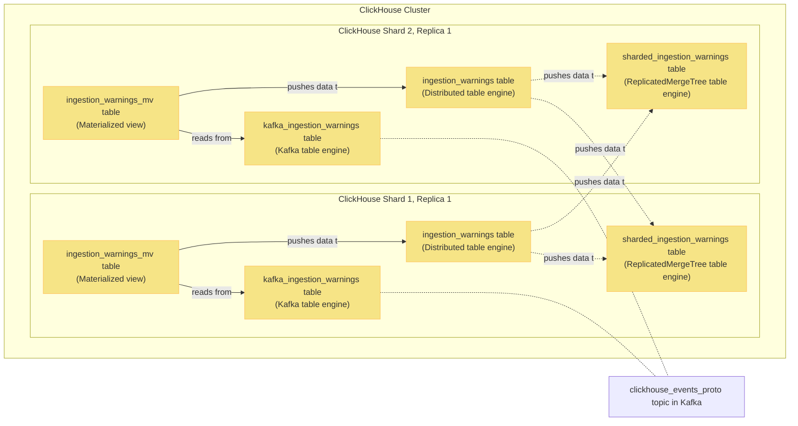

This document covers:
- Different options for ingesting data into MergeTree tables and trade-offs involved
- How the Kafka table engine works
- What are materialized views?
- Examples of a full schema setup

## Using `INSERT`s for ingestion

As any database system, ClickHouse allows using `INSERT`s to load data.

Each `INSERT` creates a new part in ClickHouse, which
comes with a lot of overhead and, in a busy system, will lead to errors due to exceeding
[`parts_to_throw` MergeTree table setting](https://clickhouse.com/docs/en/operations/settings/merge-tree-settings/#parts-to-throw-insert) (default 300).

ClickHouse provides a bunch of options to make `INSERT`s still work. For example:
- Batch inserts
- [`async_insert` setting](https://clickhouse.com/docs/en/operations/settings/settings/#async-insert)
- [Buffer table engine](https://clickhouse.com/docs/en/engines/table-engines/special/buffer/)

These come with their own trade-offs, consistency problems, and require the ClickHouse cluster to always be accessible.

## Why we ingest via Kafka tables

We instead rely on the [Kafka table engine](https://clickhouse.com/docs/en/engines/table-engines/integrations/kafka/) to handle ingestion
into ClickHouse.

The benefits are:
- Resiliency: Kafka handles sudden spikes in traffic and ClickHouse cluster unavailability gracefully
- PostHog already uses Kafka throughout the app, making it a safe technical choice

It also has minimal overhead in terms of memory used and allows us to always temporarily stop ingestion by removing the tables in question.

## How Kafka tables work

Kafka engine tables act as Kafka consumers in a given [consumer group](https://docs.confluent.io/platform/current/clients/consumer.html#concepts).
Selecting from that table advances the consumer offsets.

A Kafka table on its own does nothing beyond allowing querying data from Kafka - it needs to be paired with other tables for ingestion
to work.

> **Important note:** Given Kafka engine tables operate like consumers, querying data from them moves the offsets for the consumer group forward. Doing this while ingesting data may cause data loss, and has been disallowed by default on the latest ClickHouse versions.

Example kafka engine table:

```sql runInPostHog=false
CREATE TABLE kafka_ingestion_warnings
(
    team_id Int64,
    source LowCardinality(VARCHAR),
    type VARCHAR,
    details VARCHAR CODEC(ZSTD(3)),
    timestamp DateTime64(6, 'UTC')
)
ENGINE = Kafka('kafka:9092', 'clickhouse_ingestion_warnings_test', 'group1', 'JSONEachRow')
```

It is important to send correctly formatted messages to the topic you're selecting from.  When selecting from a Kafka table,
ClickHouse assumes messages in the topic are formatted correctly. If not, this may stall the consumer depending on the value
of `kafka_skip_broken_messages`, breaking ingestion.

> Beyond just skipping broken messages, it's also possible to set up a dead letter queue system for these in ClickHouse. You can read more about doing so in [this Altinity blog post](https://kb.altinity.com/altinity-kb-integrations/altinity-kb-kafka/error-handling/).

## Materialized views

[Materialized views](https://clickhouse.com/docs/en/sql-reference/statements/create/view/#materialized-view) in ClickHouse
can be thought of as triggers - they react to new blocks being INSERTed into source tables and allow transforming and piping
that data to other tables.

Materialized views come with a lot of gotchas. A great resource for learning more about them is [this presentation](https://den-crane.github.io/Everything_you_should_know_about_materialized_views_commented.pdf).

## Example schema - reading and writing ingestion events

Consider the following sharded table schema together with `kafka_ingestion_warnings`:

```sql runInPostHog=false
CREATE TABLE sharded_ingestion_warnings
(
    team_id Int64,
    source LowCardinality(VARCHAR),
    type VARCHAR,
    details VARCHAR CODEC(ZSTD(3)),
    timestamp DateTime64(6, 'UTC'),
    _timestamp DateTime,
    _offset UInt64,
    _partition UInt64
)
ENGINE = ReplicatedMergeTree('/clickhouse/tables/{shard}/posthog.sharded_ingestion_warnings', '{replica}')
PARTITION BY toYYYYMMDD(timestamp)
ORDER BY (team_id, toHour(timestamp), type, source, timestamp)

CREATE TABLE ingestion_warnings ON CLUSTER 'posthog'
(
    team_id Int64,
    source LowCardinality(VARCHAR),
    type VARCHAR,
    details VARCHAR CODEC(ZSTD(3)),
    timestamp DateTime64(6, 'UTC'),
    _timestamp DateTime,
    _offset UInt64,
    _partition UInt64
)
ENGINE = Distributed('posthog', 'posthog', 'sharded_ingestion_warnings', rand())

CREATE MATERIALIZED VIEW ingestion_warnings_mv
TO posthog.ingestion_warnings
AS SELECT
    team_id,
    source,
    type,
    details,
    timestamp,
    _timestamp,
    _offset,
    _partition
FROM posthog.kafka_ingestion_warnings
```

In this schema:
- `sharded_ingestion_warnings` MergeTree is responsible for storing the ingested data
- `ingestion_warnings` table is responsible for fielding queries and distributing writes to `sharded_ingestion_warnings` tables across shards
- `ingestion_warnings_mv` regularly polls `kafka_ingestion_warnings` and pushes the data to `ingestion_warnings` distributed table
    - **Note**: it also forwards `_timestamp`, `_offset`, and `_partition` virtual columns containing Kafka message metadata so they can be stored and used during debugging.

### Example schema visualized

This is the same schema visualized in a ClickHouse cluster with 2 shards and 1 replica each:



## Further reading

- [Performance Considerations ClickHouse docs](https://clickhouse.com/docs/en/sql-reference/statements/insert-into/#performance-considerations)
- [Using the Kafka table engine](https://clickhouse.com/docs/en/integrations/kafka/kafka-table-engine)
- [Kafka ClickHouse docs](https://clickhouse.com/docs/en/engines/table-engines/integrations/kafka/)
- [Confluent concepts (Zookeeper)](https://docs.confluent.io/platform/current/clients/consumer.html#concepts)
- [ClickHouse Materialized Views Illuminated, Part 1](https://altinity.com/blog/clickhouse-materialized-views-illuminated-part-1)
- [ClickHouse's not so secret weapon... Materialized Views](/blog/clickhouse-vs-postgres#clickhouses-not-so-secret-weapon-materialized-views)
- [Everything you should know
about materialized views.](https://den-crane.github.io/Everything_you_should_know_about_materialized_views_commented.pdf)

Next in the ClickHouse manual: [Working with JSON](/handbook/engineering/clickhouse/working-with-json)