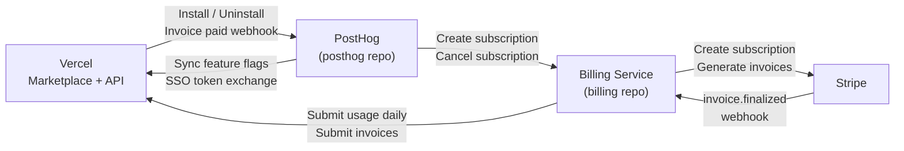
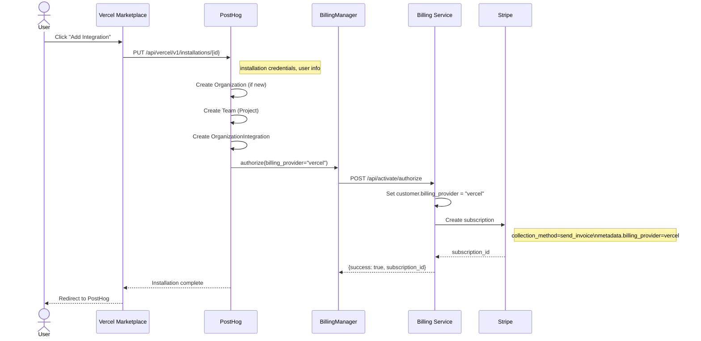
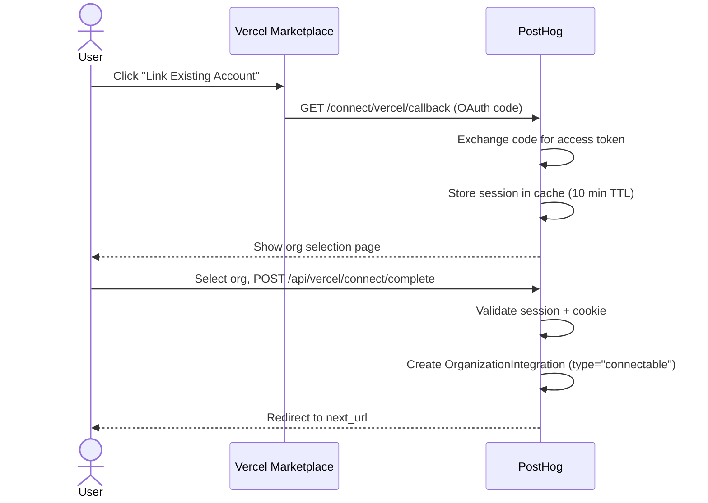
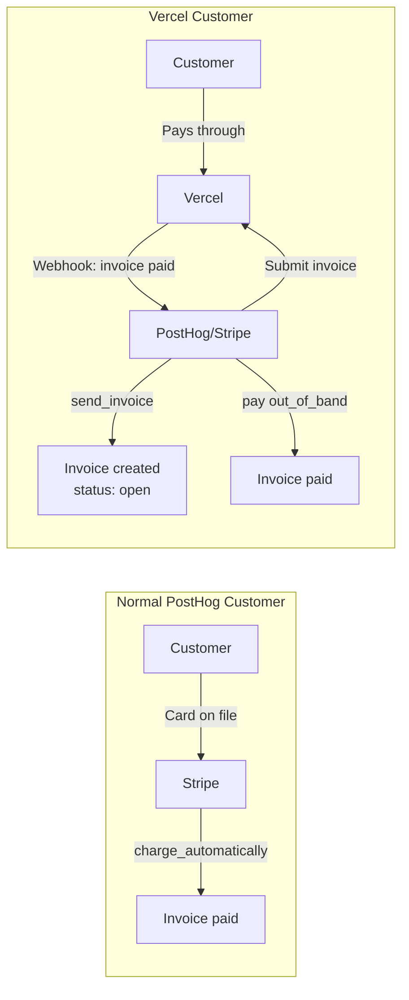
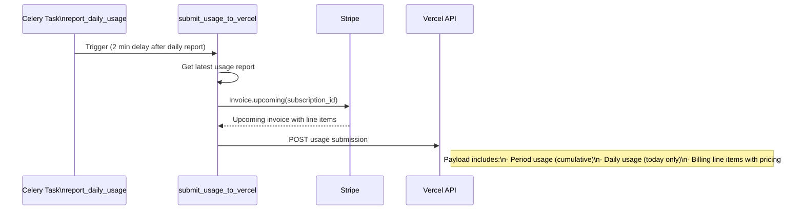
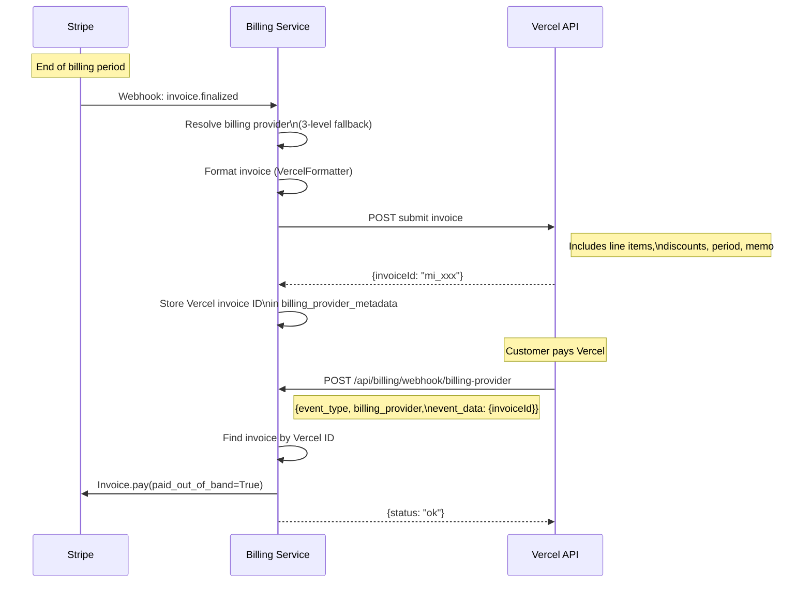
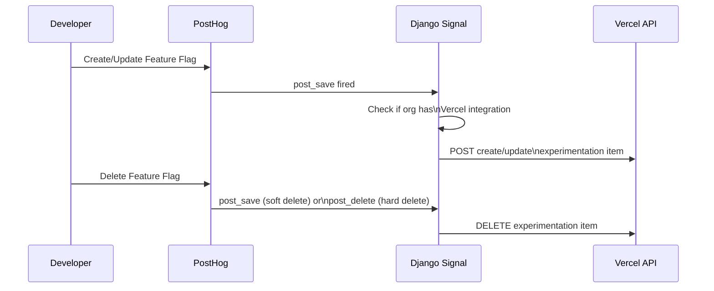
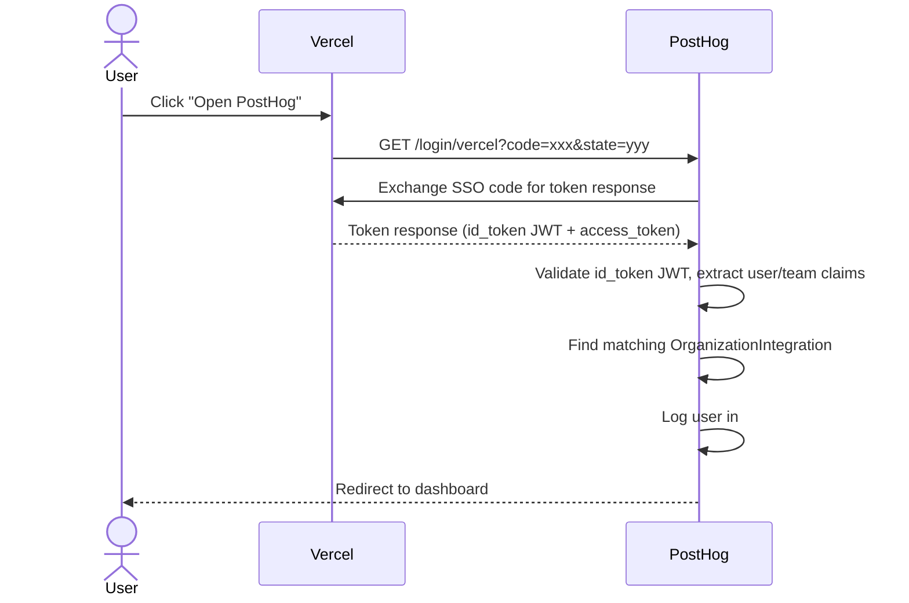
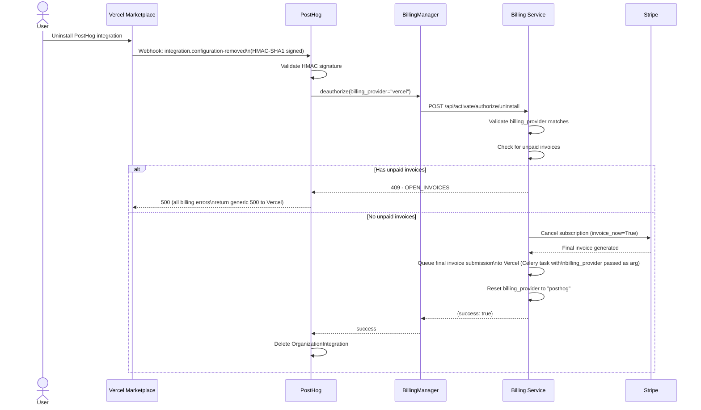

A reference for understanding how the PostHog + Vercel Marketplace integration works end-to-end. Covers installation, billing, usage reporting, feature flag sync, SSO, and uninstall.

### Key concepts

Before diving in, a few PostHog data model basics:

- **Organization** contains one or more **Teams** (called "Projects" in the UI)
- **`OrganizationIntegration`** stores Vercel credentials (access tokens, installation ID) scoped to the org. One per Vercel installation.
- **`Integration`** is a per-team/project record for resource-level config (environment variables, product settings). Created when a Vercel resource is provisioned for a specific project.
- **`BillingManager`** (`ee/billing/billing_manager.py`) is the intermediary PostHog uses to talk to the Billing service. It handles license validation, org syncing, and the actual HTTP calls.

---

## Table of Contents

1. [High-level architecture](#1-high-level-architecture)
2. [Installation flows](#2-installation-flows)
3. [Billing & subscriptions](#3-billing--subscriptions)
4. [Usage reporting](#4-usage-reporting)
5. [Invoice lifecycle](#5-invoice-lifecycle)
6. [Feature flag & experiment sync](#6-feature-flag--experiment-sync)
7. [SSO (single sign-on)](#7-sso-single-sign-on)
8. [Uninstall flow](#8-uninstall-flow)
9. [Contacting Vercel support](#9-contacting-vercel-support)
10. [Key files reference](#10-key-files-reference)

---

## 1. High-level architecture



The PostHog repo handles installation, SSO, feature flag sync, and webhooks from Vercel. The Billing repo handles subscription management, usage reporting to Vercel, and invoice submission. They communicate via internal HTTP APIs through `BillingManager`.

---

## 2. Installation flows

There are two ways a customer gets the Vercel integration:

### A. Marketplace install (new customer)

A brand new user clicks "Add" in the Vercel Marketplace. PostHog creates everything from scratch.



**Key endpoint:** `PUT /api/vercel/v1/installations/{installation_id}` in `ee/api/vercel/vercel_installation.py`

### B. Connectable account (link existing PostHog org)

An existing PostHog customer links their org via OAuth. Billing stays with PostHog (no `billing_provider` change).



**Key endpoints:**

- `GET /connect/vercel/callback` - OAuth callback (`ee/api/vercel/vercel_connect.py`)
- `GET /api/vercel/connect/session` - Available orgs for linking
- `POST /api/vercel/connect/complete` - Finalize the link

**Note:** Connectable installs do NOT call the billing service. The customer keeps their existing PostHog billing. On uninstall, the `OrganizationIntegration` record is simply deleted with no billing side effects.

---

## 3. Billing & subscriptions

### How Vercel billing differs

Vercel acts as the **payment collector**. PostHog still uses Stripe to track usage and generate invoices, but Stripe never charges the customer directly.



### How Vercel customers differ from regular customers

| Aspect                          | Vercel customer                        | Regular PostHog customer |
| ------------------------------- | -------------------------------------- | ------------------------ |
| **Signs up via**                | Vercel Marketplace                     | posthog.com              |
| **Pays through**                | Vercel                                 | Stripe (card on file)    |
| **Stripe `collection_method`**  | `send_invoice`                         | `charge_automatically`   |
| **`days_until_due`**            | 30                                     | N/A                      |
| **`metadata.billing_provider`** | `"vercel"`                             | Not set                  |
| **Invoice status**              | "open" until Vercel webhook            | "paid" after card charge |
| **Customer email**              | `noreply+vercel-{org_id}@posthog.com`  | Real email               |
| **Communications**              | Vercel handles                         | PostHog sends            |
| **Daily usage**                 | Reported to Vercel + Stripe            | Stripe only              |
| **Invoice submission**          | Submitted to Vercel after finalization | Not needed               |
| **Feature flags**               | Synced to Vercel Experimentation       | PostHog only             |
| **SSO**                         | Via Vercel (`/login/vercel`)           | PostHog login            |
| **Uninstall**                   | Resets to `billing_provider=posthog`   | N/A                      |

### The `billing_provider` field

On the Customer model (`billing/models/customer.py`):

- Default: `"posthog"`
- Set to `"vercel"` during marketplace installation
- Reset to `"posthog"` on uninstall
- Also stored in Stripe subscription metadata (survives provider reset for final invoice handling)

---

## 4. Usage reporting

PostHog reports usage to Vercel daily so it appears in the Vercel dashboard.



### Usage payload structure

```json
{
  "timestamp": "2025-01-15T14:30:00Z",
  "eod": "2025-01-14T23:59:59Z",
  "period": { "start": "...", "end": "..." },
  "billing": [
    {
      "billingPlanId": "price_xxx",
      "name": "Product Analytics",
      "price": "0.000025",
      "quantity": 123456,
      "units": "events",
      "total": "3.09"
    }
  ],
  "usage": [
    {
      "name": "Events",
      "type": "interval",
      "units": "events",
      "dayValue": 456,
      "periodValue": 12345
    }
  ]
}
```

**Task location:** `billing/tasks/usage.py` - `submit_usage_to_vercel()`

---

## 5. Invoice lifecycle



### Billing provider resolution (`_resolve_billing_provider`)

When an invoice is finalized, the system needs to determine which billing provider it belongs to. This uses a 3-level fallback chain:

1. **`customer.billing_provider`** - the live value on the customer model
2. **`subscription_details.metadata.billing_provider`** - snapshot from Stripe subscription metadata (set at subscription creation time)
3. **`billing_provider_metadata.billing_provider`** - stored on the local Invoice model

This fallback chain is what makes the uninstall flow resilient. After uninstall, `customer.billing_provider` is already reset to `"posthog"`, but the subscription metadata still says `"vercel"`, so the final invoice is still submitted correctly.

### Skipped invoices

Invoices with `billing_reason == "subscription_create"` are silently skipped. These are $0 setup invoices generated when the Stripe subscription is first created. If you're debugging why the "first invoice" never appeared in Vercel, this is why.

### Webhook payload structure

The "invoice paid" webhook from Vercel:

```json
{
  "event_type": "marketplace.invoice.paid",
  "billing_provider": "vercel",
  "event_data": {
    "invoiceId": "mi_xxx"
  }
}
```

### Invoice submission data

```json
{
  "externalId": "in_xxx",
  "invoiceDate": "2024-01-01T00:00:00Z",
  "period": { "start": "...", "end": "..." },
  "items": [
    {
      "billingPlanId": "price_xxx",
      "name": "PostHog - Product Analytics",
      "price": "0.000025",
      "quantity": 1000000,
      "units": "events",
      "total": "25.00"
    }
  ],
  "discounts": [{ "billingPlanId": "discount", "name": "Coupon: SAVE20", "amount": "5.00" }]
}
```

**Key files:**

- `billing/webhooks/stripe.py` - `submit_invoice_to_billing_provider()` (triggered on `invoice.finalized`)
- `billing/billing_providers/clients/vercel_formatter.py` - formats line items, discounts
- `billing/api/billing_provider_webhook.py` - receives "invoice paid" from Vercel

---

## 6. Feature flag & experiment sync

PostHog automatically syncs feature flags and experiments to Vercel's experimentation platform via Django signals.



- **Sync on save:** `VercelIntegration.sync_feature_flag_to_vercel()` / `sync_experiment_to_vercel()`
- **Sync on delete:** `VercelIntegration.delete_feature_flag_from_vercel()` / `delete_experiment_from_vercel()`
- **Soft deletes:** The `post_save` handler checks `instance.deleted` and calls the delete method if the flag was soft-deleted. Hard deletes go through `post_delete`.
- **Safety:** Wrapped in `_safe_vercel_sync()` to prevent DB transaction failures
- **Client:** `VercelAPIClient` in `ee/vercel/client.py` with exponential backoff retry

---

## 7. SSO (single sign-on)

Vercel users can SSO into PostHog without a separate login.



**Endpoints:**

- `GET /login/vercel` - SSO entry point (`ee/api/vercel/vercel_sso.py`)
- `GET /login/vercel/continue` - For already-logged-in users

**Multi-region:** If the resource doesn't exist in the current region (e.g. US), PostHog proactively redirects to the other region (EU). This is a region check, not a failure fallback.

---

## 8. Uninstall flow

There are two uninstall paths depending on how the integration was installed:

### Marketplace uninstall (billing involved)



**Critical detail:** The final invoice Celery task receives `billing_provider` as an explicit string argument at queue time (when it's still `"vercel"`). It does NOT read `customer.billing_provider` at execution time. This is why the reset to `"posthog"` doesn't break final invoice submission. As an additional safety net, the [billing provider resolution fallback chain](#billing-provider-resolution-_resolve_billing_provider) also protects against this — even if the Celery argument were lost, the subscription metadata still retains the original billing provider value.

### Connectable uninstall (no billing)

For connectable integrations (linked existing accounts), the webhook handler simply deletes the `OrganizationIntegration` record. No billing service call is made since these customers keep their existing PostHog billing.

**Key files:**

- `ee/api/vercel/vercel_webhooks.py` - Webhook handler
- `ee/vercel/integration.py` - `VercelIntegration.delete_installation()`
- `billing/api/billing.py` - Uninstall endpoint
- `billing/models/customer.py` - `cancel_billing_provider_subscription()`

---

## 9. Contacting Vercel support

For integration or billing issues that need Vercel's involvement, post in the shared Slack channel [#posthog-vercel](https://posthog.slack.com/archives/C08LYBQ58N5) with a :ticket: reaction on the message. This flags it for the Vercel team to pick up.

---

## 10. Key files reference

### PostHog repo (`posthog/`)

| File                                         | Purpose                                                                |
| -------------------------------------------- | ---------------------------------------------------------------------- |
| `ee/api/vercel/vercel_installation.py`       | Installation CRUD (`PUT /api/vercel/v1/installations/{id}`)            |
| `ee/api/vercel/vercel_connect.py`            | Connectable account OAuth flow                                         |
| `ee/api/vercel/vercel_sso.py`                | SSO endpoints (`/login/vercel`)                                        |
| `ee/api/vercel/vercel_webhooks.py`           | Webhook handler (`/webhooks/vercel`)                                   |
| `ee/api/vercel/vercel_resource.py`           | Resource management (Vercel projects)                                  |
| `ee/api/vercel/vercel_product.py`            | Product plans                                                          |
| `ee/vercel/client.py`                        | `VercelAPIClient` - HTTP client for Vercel APIs                        |
| `ee/vercel/integration.py`                   | `VercelIntegration` class - core logic (upsert, delete, sync flags)    |
| `ee/billing/billing_manager.py`              | `BillingManager` - intermediary for all billing service calls          |
| `posthog/models/organization_integration.py` | `OrganizationIntegration` model (org-level, stores Vercel credentials) |
| `posthog/models/integration.py`              | `Integration` model (team/project-level resource record)               |

### Billing repo (`billing/`)

| File                                            | Purpose                                                               |
| ----------------------------------------------- | --------------------------------------------------------------------- |
| `api/activate.py`                               | `BillingAuthorizeViewSet` - authorize + deprecated uninstall redirect |
| `api/billing.py`                                | Canonical uninstall endpoint (`/api/billing/uninstall`)               |
| `api/billing_provider_webhook.py`               | Receives "invoice paid" webhook from Vercel                           |
| `billing_providers/clients/vercel.py`           | `VercelClient` - submits usage & invoices to Vercel                   |
| `billing_providers/clients/vercel_api.py`       | Low-level API calls via PostHog proxy                                 |
| `billing_providers/clients/vercel_formatter.py` | Formats invoices/usage for Vercel's API                               |
| `models/customer.py`                            | `billing_provider` field, `cancel_billing_provider_subscription()`    |
| `tasks/usage.py`                                | `submit_usage_to_vercel()` daily task                                 |
| `webhooks/stripe.py`                            | `submit_invoice_to_billing_provider()` on `invoice.finalized`         |
| `constants/billing_provider.py`                 | `BillingProvider` enum, webhook event constants                       |
