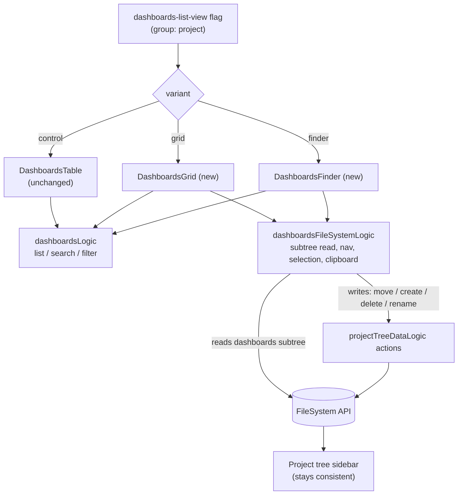

# Dashboards list: Finder/grid experiment — design

Status: draft (brainstorm output, pending review)
Date: 2026-06-17
Area: product analytics — dashboards list

## Problem

Teams accumulate dashboards faster than they organize them.
Today the dashboards list ([Dashboards.tsx](../../../frontend/src/scenes/dashboard/dashboards/Dashboards.tsx))
is a single flat table: name, tags, owner, last-viewed, and a `…` menu.
Organizing is possible — every dashboard already has a `FileSystem` entry and the `…` menu has a "Move to folder" —
but the affordance is buried, so for larger teams the list becomes a long scroll where finding the right dashboard is slow.

The bet: a more spatial, file-manager-style presentation makes dashboards faster to _find and open_,
and lowers the friction of organizing them in the first place.

## Hypothesis and primary goal

If we present dashboards as a navigable, folder-aware grid instead of a flat list,
users will **find and open the dashboard they want faster**.

Primary goal: **find & open faster.**
Organization (folder moves, folder creation) is the _mechanism_, not the primary outcome —
we measure whether the mechanism actually translates into faster finding, not just whether the new affordance gets used.

## Key prior-art finding (reframes scope)

Folders are not new. The project-tree `FileSystem` system already ships, in production:

- folders (create / rename / delete / move) — [file_system.py](../../../posthog/api/file_system/file_system.py)
- drag-a-dashboard-into-a-folder — [ProjectDragAndDropContext.tsx](../../../frontend/src/layout/panel-layout/ProjectTree/ProjectDragAndDropContext.tsx)
- multi-select with shift-range and bulk move — [projectTreeLogic.tsx](../../../frontend/src/layout/panel-layout/ProjectTree/projectTreeLogic.tsx)
- every dashboard auto-syncs a `FileSystem` entry (default path `Unfiled/Dashboards`) via `FileSystemSyncMixin`

So this experiment is **not** "build folders."
It is "does surfacing the existing folder structure as a Finder-grid _on the dashboards page_ beat the flat list?"
The only genuinely net-new UI primitives are the grid/Finder rendering itself and the clipboard state machine.

## Experiment design

### Arms (one multivariate flag)

Flag: `dashboards-list-view`, variants `control` | `grid` | `finder`.

| Arm | Variant   | What it is                                                                                                                                                 | Role                         |
| --- | --------- | ---------------------------------------------------------------------------------------------------------------------------------------------------------- | ---------------------------- |
| A   | `control` | Today's flat list, unchanged                                                                                                                               | Control                      |
| C   | `grid`    | Card grid, dashboards grouped under collapsible folder headers, drag-a-card-to-a-folder. No drill-in navigation, no clipboard.                             | Cheap "is it the cards?" arm |
| B   | `finder`  | Full navigable Finder: open folders to drill in, breadcrumb back, cut/copy/paste, rename-in-place, right-click menu. Defaults to an "All dashboards" view. | The full hypothesis          |

What is held identical across all three arms (experiment hygiene):
the tab bar (All / Yours / Pinned / Templates), search, filters, "New dashboard", and the underlying dashboard data.
Only the body presentation differs.

The format is **fixed per arm for the duration of the test** — no user-facing list/grid toggle.
A toggle would let a user leave their assigned arm and blur exposure.
A toggle is in scope only when shipping the winner.

### Decomposition the three arms buy

- A → C isolates **cards + drag-to-folder** (visual format plus light organization).
- C → B isolates **drill-in navigation + clipboard** (the expensive part of the Finder).

The most actionable result this yields: _do we need to build the full Finder, or does a card grid with simple drag-to-folder already capture the win?_

### Randomization unit

**Group-level on the `project` group type.**
Folders are project-scoped shared state: if a `finder` user files the team's dashboards into folders,
those folders exist for everyone on that project.
The flat-list control is insulated (the list ignores folders), but the C-vs-B decomposition is not —
a Finder user tidying the shared tree would also improve a Grid teammate's experience, leaking treatment from B into C.
Randomizing by project keeps every member of a project in the same arm and removes the within-team leak.

Cost: projects (not users) are the unit and they vary in size, so per-unit variance is higher.
The dashboards list is a very high-traffic surface, so a group-level three-arm test is comfortably powered;
confirm exact power when configuring.

### Population and rollout (staged)

1. **Dogfood**: enable the flag for the PostHog org (and optionally a small set of friendly accounts) to shake out the full-Finder UX and clipboard edge cases _before_ the experiment clock starts.
2. **Experiment**: start the group-level A/C/B experiment enrolling all projects.
3. **Analysis**: slice the primary metric by dashboard-count bucket (e.g. 1–5 / 6–20 / 21+) to test the "bigger teams benefit more" hypothesis — enrollment stays broad; segmentation happens in analysis, so no special targeting property is required.
4. **Ship the winner** per the success criteria below.

### Metrics

Primary — **time to open**:
average elapsed time from landing on the dashboards list to opening a dashboard within the same session. Lower is better.
Conversion rate alone is a poor primary here (almost everyone who lands eventually opens something, so it ceilings and goes insensitive); the _effort/speed_ to get there is the real signal.

Guardrail — **find conversion (non-bounce)**:
share of list visits where the user opens at least one dashboard in-session. Must not drop —
this guards against "faster because they gave up."

Secondary, mechanism — **organization adoption**:
folder moves and folder creations per user, and the share of users who perform any organizing action.
Expected to rise C < B; confirms the mechanism is actually being exercised.

Secondary, north-star — **dashboard engagement**:
dashboards opened per active user per week, and return visits to the list. Reuses existing events.

### Reading the result (ship/no-ship)

- B beats A on time-to-open (group-level significance) and does not regress the find-conversion guardrail → ship B.
- C is statistically indistinguishable from B on the primary → ship C instead (same win, far cheaper to maintain).
- C beats A but B does not improve on C → the cards carry the value; ship C, drop the Finder.
- Nothing beats A → keep the list; bank the learning that presentation was not the lever.

## UX design

The three layouts are mocked in the brainstorm session.
Summary of the load-bearing UX decisions:

- **Icons**: generic dashboard type-icon for v1 (no thumbnail render pipeline exists; that is deferred — see future work).
- **Cold-start default for B**: the Finder opens on an "All dashboards" view rather than forcing folder navigation.
  Most projects start with everything in `Unfiled/Dashboards`; defaulting to a flat "all" view means a day-one,
  un-organized user is no worse off than the list, while organized users get the drill-in benefit.
  This directly protects the primary metric during the cold-start window.
- **C's folder representation**: collapsible folder section headers with all cards visible at once (no drill-in),
  drag a card onto a header to file it.

## Architecture

Approach: **hybrid — focused read logic, shared writes.**

- A small variant registry resolves the flag to a component, mirroring [authFlowVariants.ts](../../../frontend/src/scenes/authentication/authFlowVariants.ts).
- A `DashboardsContent` switch renders `DashboardsTable` (control, unchanged) / `DashboardsGrid` (new) / `DashboardsFinder` (new).
- All three reuse [dashboardsLogic.ts](../../../frontend/src/scenes/dashboard/dashboards/dashboardsLogic.ts) for list/search/filter.
- A new `dashboardsFileSystemLogic` owns the view state that is genuinely new: the scoped Dashboards-subtree load, Finder navigation, selection, and the clipboard buffer.
- Mutations (move / create / delete / rename) are **delegated to the existing `projectTreeDataLogic` actions** rather than re-implemented, so writes stay DRY and undoable and the sidebar project tree stays consistent.

Single source of truth: every arm reads and writes the same `FileSystem` rows that back the sidebar tree,
so "organize in the Finder" and "organize in the sidebar" can never diverge — there is no second folder model to sync.
C is a strict subset of B (same data path, drill-in and clipboard simply not wired up), which is what keeps the C-vs-B decomposition honest.

### Clipboard is mostly a UI state machine over existing primitives

The "full Finder + clipboard" scope is less net-new than it sounds:

- **cut → paste = move** — reuses the existing `/file-system/{id}/move/` endpoint.
- **copy → paste = create shortcut** — reuses the existing `/link/` (shortcut) endpoint, matching the Finder "alias" mental model. True dashboard duplication is deferred.

The genuinely new part is only the cut/copy buffer and paste-target resolution, not the underlying mutations.

## Instrumentation

Reuse (already captured): the dashboards-list `$pageview`, `viewed dashboard` / `dashboard analyzed`, `dashboard pin toggled`.

New events (frontend, via `eventUsageLogic`):

- `dashboard opened from list` — props: `ms_since_list_loaded`, `used_search`, `clicks_before_open`, `open_source` (root | folder | grouped | search). Powers the primary metric and effort secondaries.
- `dashboard moved to folder` — props: `method` (drag | menu | clipboard), `multi_select_count`.
- `dashboard folder created` / `dashboard folder renamed` / `dashboard folder deleted`.
- `dashboards clipboard action` — props: `action` (cut | copy | paste), `item_count`.

Exposure and attribution:

- Exposure via PostHog's standard experiment mechanism (`$feature_flag_called`); analytics events carry `$feature/dashboards-list-view`.
- Because this is a group-level experiment, events must be associated with the `project` group so metrics aggregate at the group level.
  Confirm the frontend sets the `project` group on captured events during setup — this is a setup dependency, not an assumption.

## Risks and mitigations

| Risk                                                                            | Mitigation                                                                                              |
| ------------------------------------------------------------------------------- | ------------------------------------------------------------------------------------------------------- |
| Shared-folder treatment leaks across arms (contaminates C-vs-B)                 | Group-level randomization on `project`                                                                  |
| Cold-start: un-organized projects forced through empty folders, slowing finding | B defaults to "All dashboards"; guardrail watches the un-organized segment                              |
| Conversion ceilings and hides the real effect                                   | Primary is time-to-open, not conversion; conversion is a guardrail                                      |
| Clipboard is the most novel surface                                             | Gate behind the dogfood phase; map cut/copy to existing move/link primitives; defer true-duplicate      |
| Big UI change ships on conviction                                               | The whole point of the experiment — ship only on a significant primary win without guardrail regression |

## Out of scope / future work

- Live dashboard thumbnail previews (needs a render/snapshot pipeline).
- Colorable icon / emoji per dashboard (cheap personalization; good fast-follow if generic glyphs read too samey).
- True dashboard duplication via copy/paste (v1 copy = shortcut/link).
- Keyboard shortcuts for clipboard.
- A user-facing list/grid toggle — only when shipping the winner.

## Decisions log

1. Primary metric: find & open faster (time-to-open).
2. Variant B: full Finder + clipboard.
3. Third arm C: flat visual grid (cards + folder grouping + drag-to-folder), kept as a strict subset of B.
4. Population: staged — internal dogfood, then enroll all, segment by dashboard-count in analysis.
5. Randomization: group-level on `project`.
6. Architecture: hybrid — `dashboardsFileSystemLogic` reads + delegate writes to `projectTreeDataLogic`.
7. Icons: generic type icon for v1.
8. Format fixed per arm for the experiment; no user-facing toggle during the test.

## Success criteria

- A live group-level A/C/B experiment on `dashboards-list-view` with the primary, guardrail, and secondary metrics instrumented.
- A clear ship/no-ship decision per the reading rules above, with the analysis sliced by dashboard-count.
- New presentation code isolated behind the variant switch; control path untouched; folders consistent between the new views and the sidebar tree.
