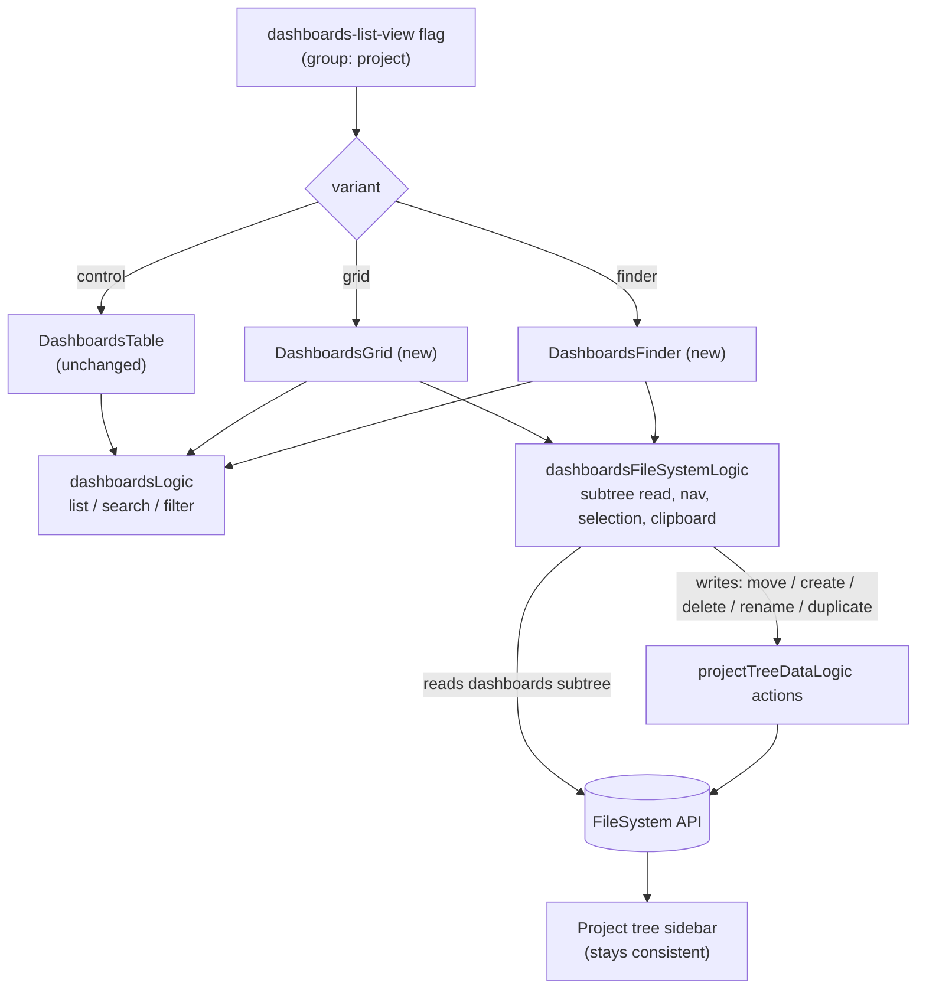

# Dashboards list: Finder/grid experiment — design

Status: draft (brainstorm + inverse pass resolved, pending review)
Date: 2026-06-17
Area: product analytics — dashboards list

## Problem

Teams accumulate dashboards faster than they organize them.
Today the dashboards list ([Dashboards.tsx](../../../frontend/src/scenes/dashboard/dashboards/Dashboards.tsx))
is a single flat table: name, tags, owner, last-viewed, and a `…` menu.
Organizing is possible — every dashboard already has a `FileSystem` entry and the `…` menu has a "Move to folder" —
but the affordance is buried, so for larger teams the list becomes a long scroll where finding the right dashboard is slow.

The bet: a more spatial, file-manager-style presentation makes dashboards faster to _find and open_,
and lowers the friction of organizing them in the first place.

## Hypothesis and primary goal

If we present dashboards as a navigable, folder-aware grid instead of a flat list,
users will **find and open the dashboard they want faster**.

Primary goal: **find & open faster.**
Organization (folder moves, folder creation) is the _mechanism_, not the primary outcome —
we measure whether the mechanism actually translates into faster finding, not just whether the new affordance gets used.

## Key prior-art finding (reframes scope)

Folders are not new. The project-tree `FileSystem` system already ships, in production:

- folders (create / rename / delete / move) — [file_system.py](../../../posthog/api/file_system/file_system.py)
- drag-a-dashboard-into-a-folder — [ProjectDragAndDropContext.tsx](../../../frontend/src/layout/panel-layout/ProjectTree/ProjectDragAndDropContext.tsx)
- multi-select with shift-range and bulk move — [projectTreeLogic.tsx](../../../frontend/src/layout/panel-layout/ProjectTree/projectTreeLogic.tsx)
- every dashboard auto-syncs a `FileSystem` entry (default path `Unfiled/Dashboards`) via `FileSystemSyncMixin`

So this experiment is **not** "build folders."
It is "does surfacing the existing folder structure as a Finder-grid _on the dashboards page_ beat the flat list?"
The genuinely net-new UI primitives are the grid/Finder rendering, the clipboard state machine, and dashboard duplication on paste.

## Experiment design

### Arms (one multivariate flag)

Flag: `dashboards-list-view`, variants `control` | `grid` | `finder`.

| Arm | Variant   | What it is                                                                                                                              | Role                         |
| --- | --------- | --------------------------------------------------------------------------------------------------------------------------------------- | ---------------------------- |
| A   | `control` | Today's flat list, unchanged                                                                                                            | Control                      |
| C   | `grid`    | Card grid, dashboards grouped under collapsible folder headers, drag-a-card-to-a-folder. No drill-in navigation, no clipboard.          | Cheap "is it the cards?" arm |
| B   | `finder`  | Full navigable Finder: **folder-first by default** (drill into folders), breadcrumb, cut/copy/paste, rename-in-place, right-click menu. | The full hypothesis          |

What is held identical across all three arms (experiment hygiene):
the tab bar (All / Yours / Pinned / Templates), search, filters, "New dashboard", and the underlying dashboard data.
Only the body presentation differs.

The format is **fixed per arm for the duration of the test** — no user-facing list/grid toggle (a toggle would let a user leave their assigned arm and blur exposure). Instead, each non-control arm carries a lightweight "not a fan? tell us" feedback affordance for qualitative signal without leaking exposure. A user-facing toggle is in scope only when shipping the winner.

### Decomposition the three arms buy

- A → C isolates **cards + drag-to-folder** (visual format plus light organization).
- C → B isolates **drill-in navigation + clipboard** (the expensive part of the Finder).

The most actionable question: _do we need to build the full Finder, or does a card grid with simple drag-to-folder already capture the win?_
Per the power analysis below, A-vs-B and A-vs-C are the **gating** comparisons; C-vs-B is a **directional** read (unbiased but wide), combined with build-cost and dogfood feedback rather than used as a hard statistical gate.

### Randomization unit

**Group-level on the `project` group type.**
Folders are project-scoped shared state: if a `finder` user files the team's dashboards into folders,
those folders exist for everyone on that project. At group level every member of a project is in the same arm,
so there is **no within-project spillover anywhere** — every comparison stays unbiased. (Person-level would buy more
units but would bias exactly the C-vs-B comparison via shared folders; unbiased-but-wide beats biased-but-narrow.)

### Power (the real constraint)

Empirically (pre-launch sizing on the existing pageview stream): the number of projects using the list is **not** the
constraint — there are tens of thousands of qualifying projects. The binding constraint is **between-project variance**:
a session-level time-to-open proxy is heavily right-skewed (idle tabs / distractions), so the coefficient of variation
of a naive per-project _mean_ is large enough that a naive-mean primary is underpowered at a single month's volume.

Consequences, baked into the design:

- **Variance-robust primary metric** — per-project _median_ (or winsorized / log-scaled) time-to-open with an idle-tab cap, not a raw mean. This is the single biggest power lever.
- **CUPED variance reduction** — use each project's pre-experiment time-to-open as a covariate (~30–50% variance cut).
- **Longer run** — target ~8–12 weeks so per-project session counts and qualifying-project counts climb well past a single-month snapshot.
- Power the experiment to detect a **~15% relative** change on the gating comparisons (A-vs-B, A-vs-C); treat C-vs-B as directional.
- **Equal-weight projects** as the unit of analysis (each project = one data point), the standard choice for group-level randomization; a user-weighted view is a secondary lens only, never the gate.

### Population and rollout (staged)

1. **Dogfood**: enable the flag for the PostHog org (and optionally a small set of friendly accounts) to shake out the full-Finder UX, duplication, and clipboard edge cases _before_ the experiment clock starts. Also the window to **validate the new primary metric behaves sanely** before trusting it.
2. **Experiment**: start the group-level A/C/B experiment enrolling all projects; run to the power target above.
3. **Analysis**: pre-registered segments only (no post-hoc fishing) — **pre-exposure** dashboard-count buckets (1–5 / 6–20 / 21+), organization-state (has real folders vs not), and the cold-start segment (projects with ~no folders). Dashboard count is pinned to its pre-exposure value because the treatment can move it (see duplication, below).
4. **Ship the winner** per the success criteria below.

### Metrics

Primary — **time to open (robust)**:
per-project median (winsorized, idle-tab-capped, CUPED-adjusted) elapsed time from landing on the dashboards list to opening a dashboard in the same session. Lower is better. Conversion rate alone is a poor primary (it ceilings — almost everyone who lands eventually opens something); the _effort/speed_ is the signal. The metric depends on new instrumentation, so it is **validated during dogfood** before being trusted.

Quality guardrail — **first-open success (anti-pogo-stick)**:
a find only "succeeds" if the first dashboard opened is the one the user stays on — i.e. they did **not** bounce back to the list and open a _different_ dashboard within the session window. This guards against "found the WRONG dashboard faster" reading as a win. Derivable from existing pageview sequences (no new event) and therefore **backtestable on today's data** — a deliberate anchor against the un-backtestable primary. Pogo-stick rate must not rise in C/B vs A.

Guardrail — **find conversion (non-bounce)**:
share of list visits where the user opens at least one dashboard in-session. Must not drop — guards against "faster because they gave up." First-class for the cold-start segment, since B is folder-first by default (below).

Secondary, mechanism — **organization adoption**:
folder moves and folder creations per user, and the share of users who perform any organizing action. Expected to rise C < B; confirms the mechanism is exercised.

Secondary, north-star — **dashboard engagement**:
dashboards opened per active user per week, and return visits to the list. Reuses existing events.

### Reading the result (ship/no-ship)

- B beats A on the robust primary (group-level significance) without regressing first-open success or find-conversion → ship B.
- C is statistically indistinguishable from B on the primary (directional) → ship C (same win, far cheaper) — corroborated by build-cost and dogfood feedback.
- C beats A but B does not improve on C → the cards carry the value; ship C, drop the Finder.
- **Cold-start contingency**: if B regresses find-speed / find-conversion specifically in the cold-start (un-organized) segment — an expected risk given folder-first-by-default — that is a pre-registered signal to **ship C instead of B**, or to gate B behind an auto-organize onboarding before it is worth shipping.
- Nothing beats A → keep the list; bank the learning that presentation was not the lever.

## UX design

The three layouts are mocked in the brainstorm session. Load-bearing UX decisions:

- **Icons**: generic dashboard type-icon for v1 (no thumbnail render pipeline exists; deferred — see future work).
- **B is folder-first by default, always**: the Finder opens into the folder hierarchy rather than a flat "all" view. This maximizes B's separation from C and is the more faithful Finder experience. It is a **deliberate, measured risk**: for the un-organized majority (everything in `Unfiled`) it adds a navigation step that should slow first finds — so the find-conversion guardrail and the cold-start segment are first-class, and the cold-start contingency above is pre-registered.
- **C's folder representation**: collapsible folder section headers with all cards visible at once (no drill-in), drag a card onto a header to file it.
- **Feedback affordance**: a "not a fan? tell us" control in the non-control arms — qualitative dissatisfaction signal without an exposure-leaking toggle.

## Architecture

Approach: **hybrid — focused read logic, shared writes.**

- A small variant registry resolves the flag to a component, mirroring [authFlowVariants.ts](../../../frontend/src/scenes/authentication/authFlowVariants.ts).
- A `DashboardsContent` switch renders `DashboardsTable` (control, unchanged) / `DashboardsGrid` (new) / `DashboardsFinder` (new).
- All three reuse [dashboardsLogic.ts](../../../frontend/src/scenes/dashboard/dashboards/dashboardsLogic.ts) for list/search/filter.
- A new `dashboardsFileSystemLogic` owns the view state that is genuinely new: the scoped Dashboards-subtree load, Finder navigation, selection, and the clipboard buffer.
- Mutations (move / create / delete / rename) are **delegated to the existing `projectTreeDataLogic` actions** rather than re-implemented, so writes stay DRY and undoable and the sidebar project tree stays consistent.

Single source of truth: every arm reads and writes the same `FileSystem` rows that back the sidebar tree,
so "organize in the Finder" and "organize in the sidebar" can never diverge — there is no second folder model to sync.
C is a strict subset of B (same data path, drill-in and clipboard simply not wired up), which is what keeps the C-vs-B decomposition honest.

### Clipboard over existing primitives, plus duplication

- **cut → paste = move** — reuses the existing `/file-system/{id}/move/` endpoint.
- **copy → paste = true duplicate** — paste creates a real copy of the dashboard (reuses `duplicateDashboard`) placed in the target folder, matching the file-manager mental model. Duplication semantics (tiles, sharing, subscriptions) must be handled correctly.

The cut/copy buffer and paste-target resolution are new; the underlying move is reused; duplication reuses existing dashboard-duplication logic.

> Confound note: copy=duplicate creates new dashboards, so it makes a project's dashboard count **endogenous to the treatment**. The dashboard-count segmentation is therefore pinned to **pre-exposure** count.

## Instrumentation

Reuse (already captured): the dashboards-list `$pageview`, `viewed dashboard` / `dashboard analyzed`, `dashboard pin toggled`.

Derived from existing pageview sequences (no new event, backtestable): the **first-open success / pogo-stick** quality guardrail.

New events (frontend, via `eventUsageLogic`):

- `dashboard opened from list` — props: `ms_since_list_loaded`, `used_search`, `clicks_before_open`, `open_source` (root | folder | grouped | search). Powers the primary metric.
- `dashboard moved to folder` — props: `method` (drag | menu | clipboard), `multi_select_count`.
- `dashboard folder created` / `dashboard folder renamed` / `dashboard folder deleted`.
- `dashboards clipboard action` — props: `action` (cut | copy | paste), `result` (move | duplicate), `item_count`.
- `dashboards view feedback` — the "not a fan?" affordance.

Exposure and attribution:

- Exposure via PostHog's standard experiment mechanism (`$feature_flag_called`); analytics events carry `$feature/dashboards-list-view`.
- Group-level experiment: events must be associated with the `project` group so metrics aggregate at the group level.

### Platform validation (do before building the measurement)

- Confirm the frontend sets the `project` group on captured events (group-level aggregation depends on it).
- Confirm PostHog experiments support a **group-level** experiment with a **winsorized/median custom-property** metric **plus CUPED**. If any of these don't hold cleanly, the measurement plan needs rework — surface before implementation.

## Risks and mitigations

| Risk                                                                                     | Mitigation                                                                                                                                                            |
| ---------------------------------------------------------------------------------------- | --------------------------------------------------------------------------------------------------------------------------------------------------------------------- |
| Between-project variance makes the naive metric underpowered                             | Robust primary (median/winsorized + idle cap) + CUPED + ~8–12 week run; power for ~15%                                                                                |
| Primary metric is novel and un-backtestable                                              | Validate in dogfood; pair with the backtestable first-open-success guardrail as an anchor                                                                             |
| Folder-first B slows finding for un-organized projects                                   | Deliberate, measured: find-conversion guardrail + cold-start segment first-class; pre-registered cold-start contingency (ship C / gate B on auto-organize onboarding) |
| Fast-but-wrong find reads as a win                                                       | First-open-success (anti-pogo-stick) quality guardrail                                                                                                                |
| copy=duplicate inflates dashboard count (and is in tension with the anti-clutter thesis) | Segment on pre-exposure dashboard count; track duplication rate                                                                                                       |
| Post-hoc segment fishing                                                                 | Pre-register all segments before launch                                                                                                                               |
| Big UI change ships on conviction                                                        | Ship only on a significant gating-comparison win without guardrail regression                                                                                         |

## Out of scope / future work

- Live dashboard thumbnail previews (needs a render/snapshot pipeline).
- Colorable icon / emoji per dashboard (cheap personalization; good fast-follow if generic glyphs read too samey).
- Keyboard shortcuts for clipboard.
- A user-facing list/grid toggle — only when shipping the winner.

## Decisions log (incl. inverse-pass resolutions)

1. Primary metric: find & open faster, measured as a **variance-robust** time-to-open (per-project median / winsorized + idle-tab cap, CUPED-adjusted), validated in dogfood. Conversion is a guardrail, not the primary.
2. Variant B: full Finder + clipboard, **folder-first by default**.
3. Third arm C: flat visual grid (cards + folder grouping + drag-to-folder), a strict subset of B.
4. Population: staged — internal dogfood, then enroll all; pre-registered segments (pre-exposure dashboard-count, organization-state, cold-start); equal-weight projects.
5. Randomization: group-level on `project`. Gating comparisons A-vs-B and A-vs-C powered for ~15%; C-vs-B directional (unbiased, wide).
6. Architecture: hybrid — `dashboardsFileSystemLogic` reads + delegate writes to `projectTreeDataLogic`.
7. Icons: generic type icon for v1.
8. Format fixed per arm; no user-facing toggle during the test; "not a fan?" feedback affordance instead.
9. Quality guardrail: first-open success / anti-pogo-stick (backtestable, no new event).
10. Clipboard copy/paste = **true duplicate** (cut/paste = move).
11. Power package: robust metric + CUPED + ~8–12 week run; the binding constraint is between-project variance, not unit supply.

## Open validation items (carry into the plan)

- Platform plumbing: `project` group on events; group-level experiment + winsorized/median metric + CUPED support.
- Dogfood validation of the new primary metric before trusting it.

## Success criteria

- A live group-level A/C/B experiment on `dashboards-list-view` with the robust primary, the first-open-success and find-conversion guardrails, and the secondary metrics instrumented.
- A clear ship/no-ship decision per the reading rules above, on pre-registered segments, with the cold-start contingency honored.
- New presentation code isolated behind the variant switch; control path untouched; folders consistent between the new views and the sidebar tree.
