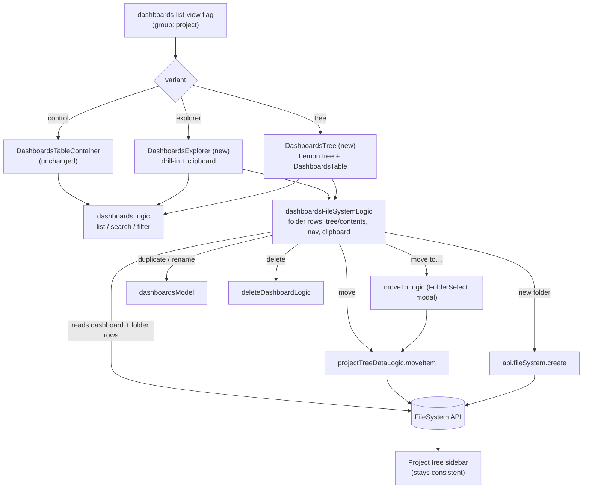

# Dashboards list: control/explorer/tree experiment — design

Status: draft (brainstorm + inverse pass resolved; arms reframed control/explorer/tree, pending review)
Date: 2026-06-17
Area: product analytics — dashboards list

> **Reframe note (supersedes the original three-arm finder/grid design):** the experiment was reframed from `control` / `grid` / `finder` to a **paradigm test** — `control` / `explorer` / `tree`. The flat-card **grid arm was dropped**; the two treatment arms are now two genuinely different folder-navigation paradigms (drill-in vs persistent tree). The flag key (`dashboards-list-view`) is unchanged; its variants are now `control,explorer,tree`. Everywhere below, **explorer** is the arm formerly called "finder". The experiment goal, primary/secondary metrics, power analysis, guardrails, and randomization are unchanged — only the arms and their affordances changed.

## Problem

Teams accumulate dashboards faster than they organize them.
Today the dashboards list ([Dashboards.tsx](../../../frontend/src/scenes/dashboard/dashboards/Dashboards.tsx))
is a single flat table: name, tags, owner, last-viewed, and a `…` menu.
Organizing is possible — every dashboard already has a `FileSystem` entry and the `…` menu has a "Move to folder" —
but the affordance is buried, so for larger teams the list becomes a long scroll where finding the right dashboard is slow.

The bet: a more spatial, folder-aware presentation makes dashboards faster to _find and open_,
and lowers the friction of organizing them in the first place.

## Hypothesis and primary goal

Today only a single-digit percentage of dashboard users organize their dashboards into folders at all — the project tree is used overwhelmingly for product navigation, not organizing. The bet: if we surface folder-aware navigation **on the dashboards page itself**, more people will organize, and better-organized dashboards are easier to find and open.

Primary goal: **get more people to organize their dashboards** — the leading behavior the UI directly changes, on the path to the ultimate value of finding and opening faster. So the primary metric is folder-organization adoption; find-and-open speed is a secondary value-check, and guardrails ensure organizing never comes at the cost of finding.

## Key prior-art finding (reframes scope)

Folders are not new. The project-tree `FileSystem` system already ships, in production:

- folders (create / rename / delete / move) — [file_system.py](../../../posthog/api/file_system/file_system.py)
- drag-a-dashboard-into-a-folder — [ProjectDragAndDropContext.tsx](../../../frontend/src/layout/panel-layout/ProjectTree/ProjectDragAndDropContext.tsx)
- multi-select with shift-range and bulk move — [projectTreeLogic.tsx](../../../frontend/src/layout/panel-layout/ProjectTree/projectTreeLogic.tsx)
- every dashboard auto-syncs a `FileSystem` entry (default path `Unfiled/Dashboards`) via `FileSystemSyncMixin`

So this experiment is **not** "build folders."
It is "does surfacing the existing folder structure _on the dashboards page_ — as a drill-in explorer or a persistent tree — beat the flat list?"
The genuinely net-new UI is two folder-navigation paradigms over the existing FileSystem rows, a clipboard state machine (cut=move, copy=duplicate), and inline rename — almost all of which composes existing ProjectTree / FileSystem infrastructure (`LemonTree`, `projectTreeDataLogic.moveItem`, the `moveToLogic` FolderSelect modal, `dashboardsModel` duplicate/rename, `deleteDashboardLogic`).

## Experiment design

### Arms (one multivariate flag)

Flag: `dashboards-list-view`, variants `control` | `explorer` | `tree`. The resolver defaults any missing, unknown, boolean, or empty value to `control` — a project is never silently enrolled in a treatment arm.

| Arm | Variant    | What it is                                                                                                                                                                                                                                                                                                           | Role                                                              |
| --- | ---------- | -------------------------------------------------------------------------------------------------------------------------------------------------------------------------------------------------------------------------------------------------------------------------------------------------------------------- | ----------------------------------------------------------------- |
| A   | `control`  | Today's flat list, byte-for-byte unchanged.                                                                                                                                                                                                                                                                          | Control                                                           |
| B   | `explorer` | Drill-in folder navigation: breadcrumb with sibling-folder dropdowns, compacted single-child folder chains, folder + dashboard cards, drag-to-folder, per-card actions menu, clipboard (cut=move, copy=duplicate) with a paste affordance, "New folder", and a global name search that flips to a flat results grid. | Drill-in paradigm                                                 |
| C   | `tree`     | Persistent folder tree on the **left** (reusing the sidebar's `LemonTree`) beside the familiar dashboards table on the **right**. Clicking a folder shows every dashboard at or below it **recursively** (root = all). The table brings its own row actions + search/filters bar; "New folder" sits atop the tree.   | Persistent-tree paradigm (the "C" idea, validated by a colleague) |

What is held identical across all arms (experiment hygiene):
the tab bar (All / Yours / Pinned / Templates), search, filters, "New dashboard", and the underlying dashboard data.
Only the body presentation differs.

The format is **fixed per arm for the duration of the test** — no user-facing list/explorer/tree toggle (a toggle would let a user leave their assigned arm and blur exposure). Instead, each non-control arm carries a lightweight "not a fan? tell us" feedback affordance for qualitative signal without leaking exposure. A user-facing toggle is in scope only when shipping the winner.

### Decomposition the arms buy

- A → B isolates **drill-in folder navigation** (the spatial, file-manager paradigm) plus the full organizing toolkit (drag, menu, clipboard, rename).
- A → C isolates **a persistent folder tree beside the familiar table** — organizing stays in the table's own row actions; the tree adds folder scoping without changing the row presentation.
- B vs C is the **paradigm comparison**: does drilling into folders (explorer) or keeping the whole table visible under a tree (tree) better drive organizing?

The most actionable question: _which folder paradigm best moves organizing without hurting finding?_
All comparisons are clean (group-level → no spillover). With folder-organization adoption as the well-powered primary, A-vs-B, A-vs-C, **and** B-vs-C can all be real reads — B-vs-C answers "drill-in explorer vs persistent tree" for organizing, combined with build-cost and dogfood feedback.

### Randomization unit

**Group-level on the `project` group type.**
Folders are project-scoped shared state: if an `explorer` user files the team's dashboards into folders,
those folders exist for everyone on that project. At group level every member of a project is in the same arm,
so there is **no within-project spillover anywhere** — every comparison stays unbiased. (Person-level would buy more
units but would bias exactly the explorer-vs-tree comparison via shared folders; unbiased-but-wide beats biased-but-narrow.)

### Power

The primary (folder-organization adoption) is a **project-level proportion at a low single-digit baseline** — well-behaved variance, highly sensitive, group-level-native. Pre-launch sizing shows tens of thousands of qualifying projects, so detecting a meaningful lift (a low-single-digit baseline rising by roughly half) needs only ~1–2k projects per arm — comfortably powered even three ways. Choosing adoption as the primary is what sidesteps the power problem described next; the run can be sized to a realistic adoption lift rather than dragged out for a noisy duration.

The **secondary** time-to-open metric is the variance-cursed one: a session-level proxy is heavily right-skewed (idle tabs / distractions), so a naive per-project mean is underpowered at a single month's volume. We measure it robustly (per-project median, winsorized, idle-capped, optionally CUPED) and read it as a **directional value-check, not a gate** — so it can never block a decision on power grounds.

- **Equal-weight projects** as the unit of analysis (each project = one data point), the standard for group-level randomization; a user-weighted view is a secondary lens only, never the gate.

### Population and rollout (staged)

1. **Dogfood**: enable the flag for the PostHog org (and optionally a small set of friendly accounts) to shake out the explorer + tree UX, duplication, and clipboard edge cases _before_ the experiment clock starts. Also the window to **validate the new primary metric behaves sanely** before trusting it.
2. **Experiment**: start the group-level control/explorer/tree experiment enrolling all projects; run to the power target above.
3. **Analysis**: pre-registered segments only (no post-hoc fishing) — **pre-exposure** dashboard-count buckets (1–5 / 6–20 / 21+), organization-state (has real folders vs not), and the cold-start segment (projects with ~no folders). Dashboard count is pinned to its pre-exposure value because the treatment can move it (see duplication, below).
4. **Ship the winner** per the success criteria below.

### Metrics

Primary — **folder-organization adoption**:
the share of exposed projects that perform at least one organizing action — creating a real folder (not the auto-created `Unfiled`) or moving a dashboard into a non-`Unfiled` folder — within the experiment window. A project-level proportion at a low single-digit baseline (today only a single-digit percentage of dashboard users organize at all; the project tree is used overwhelmingly for product navigation, not organizing). This is the leading behavior the intervention is designed to move; as a low-baseline proportion it is highly sensitive and group-level-native. Ship/no-ship is gated on this metric **plus** the guardrails below. It depends on new instrumentation, so it is **validated during dogfood** before being trusted.

Why adoption and not "find faster" as primary: time-to-open is the value we ultimately want, but (a) it is variance-cursed at the project level and hard to power, and (b) adoption is the behavior the UI directly changes. So time-to-open becomes a secondary value-check, and the guardrails below are what stop a hollow adoption win (the affordance being used without helping) from shipping.

> **Instrumentation note (current branch):** adoption is measured by the arm-agnostic `dashboard moved to folder` event fired once on the shared `projectTreeDataLogic` move path — so every move (drag, menu, "Move to…", clipboard) and every arm count toward it identically. The full prop contract (`method`, `multi_select_count`) and undo net-out are deferred to the measurement increment; the shared move path can't attribute them. See **Known limitations**.

Hard guardrails — a ship requires **no regression vs control** on every one:

- **First-open success (anti-pogo-stick)**: a find only "succeeds" if the first dashboard opened is the one the user stays on — they did **not** bounce back and open a _different_ dashboard within the session window. Backtestable from existing pageview sequences (no new event). Catches "organized more but finding got worse" — load-bearing because the explorer arm is folder-first by default.
- **Find conversion (non-bounce)**: share of list visits that open at least one dashboard in-session. First-class for the cold-start segment.
- **Dashboard engagement**: dashboards opened per active user per week + return visits, from existing events. The folder-first explorer must not depress overall engagement.

Secondary, value check (not a gate) — **time to open**:
per-project median (winsorized, idle-tab-capped) elapsed time from landing on the list to opening a dashboard. Tells us whether an adoption lift actually translates into faster finding. Read directionally, never as a gate — so the variance problem can't block a decision.

Secondary — **organizing depth**:
folder moves and folder creations per organizing project (how _much_ they organize, beyond the binary). Compared across explorer and tree to see which paradigm drives deeper organizing.

### Reading the result (ship/no-ship)

Primary = folder-organization adoption. Every rule also requires **no regression on the guardrails** (first-open success, find-conversion, engagement). The winning treatment arm — explorer or tree — is the one shipped.

- A treatment arm lifts adoption over A (group-level significance) and holds the guardrails → ship that arm.
- Both explorer and tree lift adoption and are statistically indistinguishable → ship the cheaper / better-liked paradigm (the tree reuses far more existing UI). Because adoption is well-powered, this explorer-vs-tree comparison can now be a real read, not just directional.
- One paradigm lifts adoption but the other does not → ship the one that does.
- **Cold-start contingency**: if the explorer arm lifts adoption but regresses find-conversion / first-open success in the cold-start (un-organized) segment — an expected risk given its folder-first-by-default drill-in — that is a pre-registered signal to **ship tree instead**, or to gate the explorer behind an auto-organize onboarding. The tree arm keeps the full table visible (root = all dashboards), so it is the lower-risk paradigm for cold-start finding.
- Nothing lifts adoption over A → keep the list; bank the learning that surfacing organizing on the page wasn't enough.

## UX design

Two layouts (beside the unchanged control table). Load-bearing UX decisions:

- **Icons**: generic dashboard / folder type-icons for v1 (no thumbnail render pipeline exists; deferred — see future work). The explorer cards use `IconDashboard` / `IconFolder`; the tree uses `LemonTree`'s folder rendering.
- **Explorer is folder-first by default, always**: it opens into the folder hierarchy rather than a flat "all" view. This maximizes its separation from the tree arm and is the more faithful file-manager experience. It is a **deliberate, measured risk**: for the un-organized majority (everything in `Unfiled`) it adds a navigation step that should slow first finds — so the find-conversion guardrail and the cold-start segment are first-class, and the cold-start contingency above is pre-registered. Two affordances soften the cost: **compacted single-child folder chains** (a pass-through chain of one-child folders collapses to a single card, one click to a buried dashboard) and a **global name search** that flips the explorer to a flat results grid.
- **Explorer breadcrumb**: each crumb navigates to that ancestor; crumbs with siblings carry a **jump-to-sibling dropdown** so a user can switch folders without drilling back up.
- **Explorer organizing toolkit**: drag a dashboard card onto a folder card to file it; a **per-card actions menu** (Open / Rename / Move to… / Cut / Copy / Delete); a **clipboard** (cut = move on paste, copy = duplicate on paste) surfaced as a "Paste into this folder" button when the buffer is non-empty; inline rename; and a **"New folder"** button that creates a folder inside the current folder.
- **Tree's representation**: a persistent folder tree on the left (the sidebar's `LemonTree`), an "All dashboards" root above it, and the familiar dashboards table on the right scoped to **everything at or below the selected folder, recursively** (root = all). The whole table — including its own search/filters bar and row actions (move / rename / delete) — stays visible, so the tree is a _scope selector_, not a drill-in. Organizing happens in the table's existing row actions; a **"New folder"** button sits atop the tree.
- **Feedback affordance**: a "not a fan? tell us" control in the non-control arms — qualitative dissatisfaction signal without an exposure-leaking toggle. _(Deferred on the current branch — see Known limitations.)_

## Architecture

Approach: **hybrid — focused read logic, shared writes; heavy reuse of existing ProjectTree / FileSystem infra.**

- A small variant registry ([dashboardsListViewVariants.ts](../../../frontend/src/scenes/dashboard/dashboards/dashboardsListViewVariants.ts)) resolves the flag to an arm, mirroring [authFlowVariants.ts](../../../frontend/src/scenes/authentication/authFlowVariants.ts), defaulting unknown → `control`.
- A [`DashboardsContent`](../../../frontend/src/scenes/dashboard/dashboards/DashboardsContent.tsx) switch renders `DashboardsTableContainer` (control, unchanged) / `DashboardsExplorer` (new) / `DashboardsTree` (new).
- All arms reuse [dashboardsLogic.ts](../../../frontend/src/scenes/dashboard/dashboards/dashboardsLogic.ts) for list/search/filter, and the control table component ([`DashboardsTable`](../../../frontend/src/scenes/dashboard/dashboards/DashboardsTable.tsx)) is reused verbatim by the tree arm's content pane.
- A new [`dashboardsFileSystemLogic`](../../../frontend/src/scenes/dashboard/dashboards/dashboardsFileSystemLogic.ts) owns the genuinely-new view state: it loads the FileSystem rows, builds the folder tree + folder contents, tracks folder navigation/collapse, and holds the clipboard buffer.

### Folder-rows data layer

`dashboardsFileSystemLogic` loads **two** kinds of FileSystem row, so the picture is complete:

- `type=dashboard` rows — index each dashboard to its folder path (`ref` = dashboard id), so dashboards group under their folder; dashboards with no row fall back to `Unfiled/Dashboards`.
- `type=folder` rows — so **empty folders** (and ones the user just created) appear as navigable, droppable targets, not just folders inferred from dashboard paths.

From those it derives, in [dashboardsFileSystemUtils.ts](../../../frontend/src/scenes/dashboard/dashboards/dashboardsFileSystemUtils.ts): the nested `folderTree` (the tree arm's `LemonTree` data, with ancestors + empty folders), `folderContents` and `compactedSubfolders` (the explorer's current-folder view + single-child chain collapse), `subtreeDashboards` (the tree arm's recursive scope), and the `breadcrumb` / sibling-folder helpers. Reads are a single 500-entry page per type (no pagination yet; warns when the cap is hit).

### Delegated writes (the reuse map)

Every mutation is **delegated** to existing infrastructure rather than re-implemented, so writes stay DRY and undoable and the sidebar project tree stays consistent:

- **Drag-to-folder / cut-paste move** → `projectTreeDataLogic.moveItem` (which itself uses the `/file-system/{id}/move/` endpoint and fires the arm-agnostic `dashboard moved to folder` event).
- **"Move to…"** (per-card menu) → `moveToLogic.openMoveToModal` — the canonical searchable FolderSelect modal.
- **Copy-paste duplicate / inline rename** → `dashboardsModel` (`duplicateDashboard` / `updateDashboard` with undo).
- **Delete** → `deleteDashboardLogic.showDeleteDashboardModal` — the canonical confirm + "also delete insights" modal.
- **New folder** → `api.fileSystem.create({ type: 'folder', ... })`, then refetch folder rows.

So the only genuinely custom pieces are the folder-structure derivation (the utils above), the clipboard state machine, and the explorer's drill-in/breadcrumb/compaction — the rest composes shipped UI. The tree panel is `LemonTree` reused verbatim.

Single source of truth: every arm reads and writes the same `FileSystem` rows that back the sidebar tree,
so "organize in the explorer/tree" and "organize in the sidebar" can never diverge — there is no second folder model to sync.

### Clipboard over existing primitives, plus duplication

- **cut → paste = move** — delegates to `moveDashboardToFolder` → `projectTreeDataLogic.moveItem`.
- **copy → paste = true duplicate** — paste reuses `duplicateDashboard` so the copy inherits exactly the established Duplicate behavior (no new sharing/subscription handling). The cut buffer is just intent — a cut item is **never deleted** if the tab closes before paste resolves (CH-02).

The cut/copy buffer is new; the underlying move and duplication reuse existing logic.

> Confound note: copy=duplicate creates new dashboards, so it makes a project's dashboard count **endogenous to the treatment**. The dashboard-count segmentation is therefore pinned to **pre-exposure** count.

> Known v1 limitation (CH-03 honored, placement deferred): copy=paste lands the duplicate in its **default (Unfiled)** folder, not the paste-target folder — placing it needs the new FileSystem entry after duplication, deferred as a follow-up. See **Known limitations**.

## Instrumentation

Reuse (already captured): the dashboards-list `$pageview`, `viewed dashboard` / `dashboard analyzed`, `dashboard pin toggled`.

Derived from existing pageview sequences (no new event, backtestable): the **first-open success / pogo-stick** quality guardrail.

**Shipped on the current branch — the load-bearing primary-metric event:**

- `dashboard moved to folder` — props: `from_path`, `to_path`. Fired **once on the shared, arm-agnostic `projectTreeDataLogic` move path**, so every move (drag, per-card menu, "Move to…", clipboard) and every arm count toward folder-organization adoption identically. This is the load-bearing instrumentation now that adoption is the primary.

**Deferred to the measurement increment (documented in Known limitations):**

- `dashboard moved to folder` props `method` (drag | menu | clipboard) and `multi_select_count`, plus undo net-out — the shared move path can't attribute the interaction.
- `dashboard opened from list` — props: `ms_since_list_loaded`, `used_search`, `clicks_before_open`, `open_source`. The secondary time-to-open / opened-from-list metric; not instrumented on this branch.
- `dashboard folder created` / `dashboard folder renamed` / `dashboard folder deleted`.
- `dashboards clipboard action` — props: `action`, `result`, `item_count`.
- `dashboards view feedback` — the "not a fan?" affordance.

Exposure and attribution:

- Exposure via PostHog's standard experiment mechanism (`$feature_flag_called`); analytics events carry `$feature/dashboards-list-view`.
- Group-level experiment: events must be associated with the `project` group so metrics aggregate at the group level.

### Platform validation (do before building the measurement)

- Confirm the frontend sets the `project` group on captured events (group-level aggregation depends on it).
- Confirm PostHog experiments support a **group-level** experiment with a **winsorized/median custom-property** metric **plus CUPED**. If any of these don't hold cleanly, the measurement plan needs rework — surface before implementation.

## Risks and mitigations

| Risk                                                                                     | Mitigation                                                                                                                                                                                                                                                 |
| ---------------------------------------------------------------------------------------- | ---------------------------------------------------------------------------------------------------------------------------------------------------------------------------------------------------------------------------------------------------------- |
| Between-project variance cursed the old (time-to-open) primary                           | Primary is now a low-baseline adoption proportion (well-powered); time-to-open is a robust secondary, not a gate                                                                                                                                           |
| New events (adoption, opened-from-list) are novel                                        | Validate in dogfood; the first-open-success guardrail is backtestable from existing pageviews as an anchor                                                                                                                                                 |
| Folder-first explorer slows finding for un-organized projects                            | Deliberate, measured: find-conversion guardrail + cold-start segment first-class; pre-registered cold-start contingency (ship tree / gate explorer on auto-organize onboarding); tree keeps the full table visible (root = all) as the lower-risk paradigm |
| Fast-but-wrong find reads as a win                                                       | First-open-success (anti-pogo-stick) quality guardrail                                                                                                                                                                                                     |
| copy=duplicate inflates dashboard count (and is in tension with the anti-clutter thesis) | Segment on pre-exposure dashboard count; track duplication rate                                                                                                                                                                                            |
| Post-hoc segment fishing                                                                 | Pre-register all segments before launch                                                                                                                                                                                                                    |
| Big UI change ships on conviction                                                        | Ship only on a significant adoption lift with no guardrail regression                                                                                                                                                                                      |

## Known limitations (current branch — deferred to the measurement increment)

The arms (control / explorer / tree) and the shared folder-data layer ship on this branch behind the flag. These are honestly-deferred gaps, mostly belonging to the measurement increment:

- **Move event prop contract**: `dashboard moved to folder` carries `from_path` / `to_path` only. `method` (drag | menu | clipboard), `multi_select_count`, and undo net-out (EC-28d) are deferred — the shared arm-agnostic move path can't attribute them.
- **Copy=paste placement**: copy=duplicate honors the canonical-duplicate reuse (CH-03 — sharing/subscriptions are not silently inherited), but the duplicate lands in the **default (Unfiled)** folder, not the paste-target folder. Placing it needs the new FileSystem entry after duplication — deferred.
- **Page cap, no pagination**: the FileSystem reads take a single 500-entry page per type (`dashboard`, `folder`). Beyond that, surplus dashboards fall back to Unfiled; the logic `console.warn`s when the cap is hit so the truncation is detectable rather than silent. Pagination is deferred.
- **`dashboard opened from list` (REQ-16) not instrumented**: the secondary time-to-open / opened-from-list metric is deferred to the measurement increment.
- **Multi-select / bulk actions (REQ-09) not built**: organizing is one item at a time.
- **Feedback affordance (REQ-14) and the remaining folder-lifecycle / clipboard analytics events (REQ-18, REQ-19, REQ-20) not built**: deferred to later increments.

## Out of scope / future work

- Live dashboard thumbnail previews (needs a render/snapshot pipeline).
- Colorable icon / emoji per dashboard (cheap personalization; good fast-follow if generic glyphs read too samey).
- Keyboard shortcuts for clipboard.
- A user-facing list/explorer/tree toggle — only when shipping the winner.

## Decisions log (incl. inverse-pass resolutions)

0. **Reframe (2026-06-17): arms are control/explorer/tree, not control/grid/finder.** The flat-card grid arm was dropped; the two treatments are now two folder-navigation paradigms — `explorer` (drill-in finder, formerly "finder") and `tree` (persistent `LemonTree` panel + recursive table, the colleague-validated "C" idea). Flag key unchanged; variants now `control,explorer,tree`.
1. Primary metric: **folder-organization adoption** — share of exposed projects that create a real folder or move a dashboard into a non-`Unfiled` folder within the window; a low-baseline project-level proportion, well-powered. Hard guardrails: first-open success, find-conversion, engagement. Time-to-open (robust) and organizing depth are secondaries. (Revised 2026-06-17 after prod data showed only a single-digit percentage of dashboard users organize today.)
2. Explorer arm: drill-in finder + clipboard, **folder-first by default**, with compacted single-child chains, breadcrumb sibling dropdowns, per-card actions menu, and a search that flips to a flat results grid.
3. Tree arm: persistent folder tree (sidebar's `LemonTree`) on the left beside the familiar dashboards table on the right, scoped recursively to the selected folder (root = all); organizing via the table's own row actions.
4. Population: staged — internal dogfood, then enroll all; pre-registered segments (pre-exposure dashboard-count, organization-state, cold-start); equal-weight projects.
5. Randomization: group-level on `project` (every comparison unbiased, no within-project spillover). With adoption as primary, A-vs-explorer, A-vs-tree, and explorer-vs-tree can all be real reads.
6. Architecture: hybrid — `dashboardsFileSystemLogic` reads both dashboard + folder rows; writes delegate to `projectTreeDataLogic.moveItem`, `moveToLogic`, `dashboardsModel`, `deleteDashboardLogic`, and `api.fileSystem.create`.
7. Icons: generic type icons for v1 (`IconDashboard` / `IconFolder`; `LemonTree` for the tree).
8. Format fixed per arm; no user-facing toggle during the test; "not a fan?" feedback affordance instead (deferred on the current branch).
9. Quality guardrail: first-open success / anti-pogo-stick (backtestable, no new event).
10. Clipboard copy/paste = **true duplicate** (cut/paste = move); duplicate placement in the paste-target folder is deferred (lands in Unfiled for now).
11. Power: the adoption-proportion primary is well-powered at a low baseline (~1–2k projects/arm suffices); robust median + CUPED apply to the time-to-open **secondary**, which is read directionally, not as a gate.

## Open validation items (carry into the plan)

- Platform plumbing: `project` group on events; group-level experiment + winsorized/median metric + CUPED support.
- Dogfood validation of the new primary metric before trusting it.

## Success criteria

- A live group-level control/explorer/tree experiment on `dashboards-list-view` with the folder-organization-adoption primary, the first-open-success / find-conversion / engagement guardrails, and the time-to-open + organizing-depth secondaries instrumented.
- A clear ship/no-ship decision per the reading rules above, on pre-registered segments, with the cold-start contingency honored.
- New presentation code (explorer + tree) isolated behind the variant switch; control path untouched; folders consistent between the new views and the sidebar tree.
