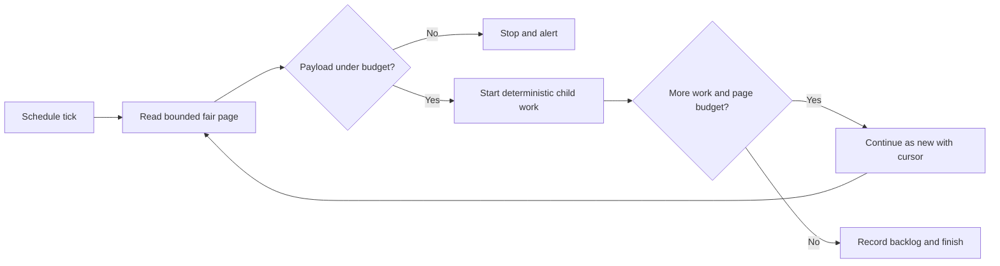

# Temporal scheduler resilience design

**Status:** Proposed

## Goal

Recurring Temporal coordinators must recover from backlogs without creating oversized payloads, unbounded workflow histories, or unbounded downstream concurrency.

Capacity should grow automatically inside a safe operating envelope. When the envelope is exhausted, the system must notify responders before customer-visible work becomes stale.

## Scope

This design covers the recurring coordinators with the clearest backlog and fan-out risks:

- subscriptions;
- logs alerts;
- AI evaluation reports;
- experiment metric recalculation;
- Error Tracking weekly digests;
- health checks;
- Replay Vision reconciliation; and
- AI-observability clustering and summarisation.

The first implementation wave covers Python Temporal schedules. Celery Beat, Kubernetes CronJobs, and user-created per-resource schedules remain a follow-up inventory.

## Non-goals

- Raising Temporal payload or gRPC limits.
- Allowing a controller to remove a hard safety limit automatically.
- Replacing Temporal task queues with an application-managed queue.
- Guaranteeing that every backlog drains within one schedule interval.
- Introducing tenant identifiers as metric labels.

## Design principles

### Fixed containment boundaries

The following limits are safety boundaries and never grow automatically:

- serialized activity input and output size;
- workflow activation command count;
- items returned by one discovery activity;
- child starts emitted by one workflow run or continuation;
- aggregate downstream concurrency per coordinator;
- retries for one deterministic item; and
- maximum worker replica count.

The internal operating budget for a serialized activity input, activity output, or workflow activation is 512 KiB. This stays materially below Temporal's transport limits and leaves room for metadata.

### Elastic throughput inside the boundaries

The system may increase throughput by:

- processing more bounded pages;
- running more independent partitions;
- increasing worker replicas; and
- reducing idle time between pages while task-queue health remains acceptable.

It must not increase the size of an individual payload or activation to gain throughput.

### Backpressure remains visible

Temporal can buffer work, but a growing queue is not a recovery strategy. Every coordinator exposes deferred work and oldest-due age. Capacity exhaustion creates an alert instead of silently accumulating work.

## Scheduler safety contract

Every recurring coordinator defines and tests these values:

| Control                | Purpose                                                 |
| ---------------------- | ------------------------------------------------------- |
| `page_size`            | Maximum items returned by one discovery activity        |
| `max_pages_per_tick`   | Maximum pages admitted by one scheduled invocation      |
| `max_concurrent_pages` | Maximum pages creating downstream load together         |
| `max_concurrent_items` | Maximum aggregate item work across all pages            |
| `payload_budget_bytes` | Internal serialized payload operating budget            |
| `execution_timeout`    | Maximum coordinator lifetime                            |
| `overlap_policy`       | Intentional behavior when a prior run is open           |
| `catchup_window`       | Maximum schedule backlog Temporal may replay            |
| `retry_policy`         | Bounded retries that cannot occupy the full worker pool |

Each coordinator must also answer:

1. How does it fairly select work across teams or organisations?
2. How does it prevent one poison item from consuming all capacity?
3. How does it make child starts idempotent?
4. How does it advance past obsolete missed slots when only current-state evaluation matters?
5. How does it expose backlog age, deferral, payload size, and dispatch failures?

## Coordinator flow

### Before

This topology lets backlog size determine payload size, command count, workflow history, and downstream pressure.

### After

Discovery returns only the identifiers and primitive fields required to start child work. Child activities hydrate large configuration fields when they run.

Each continuation handles at most one bounded page. This bounds activation size and workflow history even when one schedule tick admits multiple pages.

## Discovery and fairness

Discovery queries apply limits before model hydration or Temporal serialization.

For global coordinators, selection uses round-robin tenant ordering:

1. rank due items within each tenant by due time and stable identifier;
2. order globally by tenant rank, due time, tenant identifier, and item identifier; and
3. apply the page limit to that ordered result.

This selects one item per tenant before selecting a second item for any tenant. A large tenant cannot indefinitely consume the whole page.

Cursors contain stable scalar fields only. If a manifest can exceed the payload budget even after pagination, discovery stores it outside Temporal and returns a reference.

## Dispatch and idempotency

Coordinators use deterministic child workflow IDs derived from the logical occurrence, not from the parent run ID.

Fire-and-forget dispatch uses `start_child_workflow` with `ParentClosePolicy.ABANDON`. The parent waits for Temporal to accept the child start, but does not wait for the child result.

`ABANDON` lets accepted children continue after the short-lived coordinator completes or is terminated. Deterministic IDs turn coincident parent runs into harmless duplicate-start responses.

A coordinator attempts the remainder of its bounded page after one child fails to start. It reports all start failures after the page has been processed.

Workflows that must aggregate child results keep `execute_child_workflow`, but enforce both page-level and item-level concurrency limits.

## Adaptive capacity

Capacity grows in two independent layers.

### Admission capacity

Every scheduler has a bounded page size and a hard per-tick maximum:

- the page size fits the item, byte, and activation-command budgets;
- the coordinator reads another page only when due work remains;
- normal traffic therefore consumes one page while a backlog automatically uses more pages;
- the per-tick maximum covers forecast demand plus recovery headroom; and
- admission never exceeds `max_pages_per_tick`.

The recovery envelope uses the larger of the trailing high-percentile demand and the near-term growth forecast. Hourly coordinators provision enough admission capacity for the current interval plus at least two missed intervals. This lets one healthy run make material progress after an outage instead of waiting several hours to catch up.

The coordinator does not prefetch those pages. It follows the cursor one page at a time and stops as soon as discovery reports no deferred work. Higher configured headroom therefore does not enlarge steady-state payloads or histories.

### Worker capacity

The analytics worker deployment scales horizontally from Temporal task-queue pressure and worker saturation:

- scale out when schedule-to-start latency or task backlog breaches its target for two windows;
- scale in only after a longer stable window;
- retain enough spare slots that one retrying item cannot occupy the fleet; and
- cap replicas at an operator-reviewed maximum.

The worker autoscaler absorbs additional bounded pages through the Temporal task queue. The per-tick and concurrency maxima prevent the coordinator from producing unlimited pressure while the autoscaler catches up.

### Capacity exhaustion

Automatic growth stops at the fixed safety boundaries. Responders are notified when any of these conditions persists:

- oldest-due age exceeds the workload's freshness objective;
- deferred work remains non-zero while admission is at its maximum;
- task-queue latency remains high while worker replicas are at their maximum;
- available worker slots remain below 10%; or
- payload-budget, timeout, or resource-exhausted errors occur.

This is the explicit hand-off from automatic recovery to human capacity planning.

## Initial configuration

Production event distributions determine the initial page and recovery envelopes. Defaults remain configurable so they can be reduced during an incident without a database change.

The initial subscription page boundary is 300 items. The scheduled invocation may process multiple pages up to a separate reviewed maximum, sized to absorb current demand and at least two missed intervals.

Other coordinators derive their per-tick maximum from the same recovery rule. A coordinator without production volume telemetry ships instrumentation and a conservative reviewed envelope before multi-page recovery is enabled.

No coordinator enables automatic growth based only on CPU. CPU does not distinguish useful processing from a poison item that blocks a worker process.

## Observability

Every coordinator emits low-cardinality metrics with `scheduler` and `region` labels:

- due items observed;
- items selected;
- items deferred;
- oldest-due age;
- discovery payload bytes;
- pages admitted;
- child starts accepted, deduplicated, and failed;
- schedule-to-start latency;
- workflow and activity timeouts;
- resource-exhausted failures; and
- worker slots available and used.

Dashboards show current values, high-percentile values, and growth over time. Capacity planning compares trailing seven-day demand with the prior seven days.

The service also runs an independent synthetic check that proves a known scheduled item moves from due to completed. This signal does not depend on the coordinator's own success logs.

## Alerts

The initial alert set covers:

1. a synthetic scheduled item misses its freshness objective;
2. oldest-due age breaches the objective for three consecutive intervals;
3. a coordinator defers work while running at maximum admission;
4. task-queue schedule-to-start latency breaches its target;
5. worker replicas reach their maximum while backlog grows;
6. worker slot availability stays below 10%;
7. coordinator timeouts repeat; and
8. any payload-budget or resource-exhausted failure occurs.

The alerts route to the owning product team and the shared worker platform owner. They include the scheduler name, region, current limit, current backlog age, and the first remediation link.

## Failure containment

- Retry attempts must remain below the number of independently isolated worker processes available to the workload.
- Repeatedly timing-out logical items move to a quarantine path after the retry budget is exhausted.
- Quarantined work records a bounded error summary and does not retain a large input payload.
- Shared task queues reserve capacity for coordinator work so child activities cannot starve discovery and dispatch.
- CPU-bound or non-interruptible transformations must run in an interruptible process boundary or a dedicated task queue.

## Schedule policies

All schedule registrations set overlap, catch-up, execution timeout, and pause behavior explicitly.

- Short fire-and-forget coordinators may use `ALLOW_ALL` when deterministic child IDs make overlap safe.
- Result-aggregating or state-mutating coordinators use `SKIP` or `BUFFER_ONE` according to their recovery semantics.
- Catch-up windows prevent obsolete schedule ticks from replaying after a long outage.
- Execution timeouts exceed a healthy coordinator run but remain below the interval where a new run should take over.

The policy is tested as part of schedule creation. SDK defaults are not accepted as implicit design decisions.

## Implementation stacks

The work is split into three shallow native GitHub stacks. Each layer has focused regression tests and can merge independently after the layer below it.

### Stack A: customer-facing scheduled work

1. Subscriptions: fair paged discovery, minimal inputs, deterministic fire-and-forget dispatch, explicit policy, and backlog metrics.
2. Logs alerts: identifier-only discovery, bounded pages, activity-side hydration, explicit policy, and backlog metrics.
3. AI evaluation reports: bounded report discovery and count-trigger checks, deterministic dispatch, explicit policy, and backlog metrics.

### Stack B: batch analytics

1. Experiment metric recalculation: cursor discovery, bounded history, continue-as-new, and explicit policy.
2. Error Tracking weekly digest: global page concurrency and explicit downstream load metrics.

### Stack C: estate-scale coordinators

1. Health checks: paged team discovery and bounded batch dispatch.
2. Replay Vision reconciliation: paged scanner and schedule inventories with bounded drift operations.
3. AI-observability clustering and summarisation: identifier-only team discovery and bounded continuation state.

Worker autoscaling and alerts land after the common metrics are available. They may require separate deployment-configuration changes, but they use the same reviewed operating envelope.

## Testing strategy

Every coordinator adds regression coverage for:

- a backlog at ten times the baseline admission target;
- one tenant owning more work than the global page size;
- maximum-size supported item configuration;
- child work taking longer than the schedule interval;
- one deterministic poison item exhausting its retry budget;
- a worker outage followed by catch-up;
- lowering the configured limit while a backlog exists;
- duplicate schedule starts; and
- automatic admission reaching its hard maximum without exceeding payload or concurrency budgets.

Tests assert exact selected identifiers, payload size boundaries, peak concurrency, deterministic child IDs, continuation inputs, schedule policy, and emitted metrics.

## Rollout

1. Ship common metrics and dashboards without adaptive behavior.
2. Enable bounded discovery and dispatch with conservative static targets.
3. Enable worker autoscaling and validate queue-latency response.
4. Enable automatic multi-page admission per coordinator behind configuration.
5. Raise each coordinator from baseline to its reviewed maximum in production.
6. Remove legacy unbounded paths after one stable observation period.

Rollback lowers admission to one page and disables adaptive growth. The bounded path remains active because restoring unbounded discovery is not a safe rollback.

## Acceptance criteria

- No discovery activity or coordinator activation can grow with total backlog size.
- No single tenant can consume every slot indefinitely.
- No coordinator can exceed its global downstream concurrency limit.
- A ten-times backlog drains without exceeding the payload budget.
- Worker capacity scales automatically while the queue remains within its operating envelope.
- Capacity exhaustion notifies responders before the workload misses its freshness objective.
- Coincident schedule runs do not duplicate customer-visible effects.
- One poison item cannot occupy every worker process.
