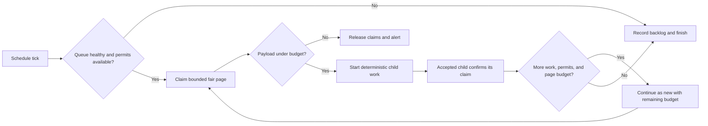

# Temporal scheduler resilience design

**Status:** Proposed

## Goal

Recurring Temporal coordinators must recover from backlogs without creating oversized payloads, unbounded workflow histories, or unbounded downstream concurrency.

Capacity should grow automatically inside a safe operating envelope. When the envelope is exhausted, the system must notify responders before customer-visible work becomes stale.

## Scope

This design covers the recurring coordinators with the clearest backlog and fan-out risks:

- subscriptions;
- logs alerts;
- AI evaluation reports;
- experiment metric recalculation;
- Error Tracking weekly digests;
- health checks;
- Replay Vision reconciliation; and
- AI-observability clustering and summarisation.

The first implementation wave covers Python Temporal schedules. Celery Beat, Kubernetes CronJobs, and user-created per-resource schedules remain a follow-up inventory.

## Non-goals

- Raising Temporal payload or gRPC limits.
- Allowing a controller to remove a hard safety limit automatically.
- Replacing Temporal task queues with an application-managed queue.
- Guaranteeing that every backlog drains within one schedule interval.
- Introducing tenant identifiers as metric labels.

## Adversarial review decisions

| Challenge                                                             | Decision                                                                                  |
| --------------------------------------------------------------------- | ----------------------------------------------------------------------------------------- |
| Fair ranks change as rows leave the due set                           | Use durable claims and a fixed due cutoff; do not paginate on recalculated ranks          |
| A parent cannot atomically update Postgres and start a Temporal child | Let the child confirm a pre-existing claim; recover unconfirmed claims by expiry          |
| Deterministic child IDs do not cap overlapping parent load            | Enforce durable admission permits and claims before allowing overlap                      |
| Continue-as-new can accidentally reset a per-tick limit               | Carry the original tick ID and remaining page budget through every continuation           |
| More worker replicas can amplify a poison item                        | Quarantine bounded retries and isolate non-interruptible work at the process level        |
| Captured starts include retries and recovery traffic                  | Size from unique demand, due-item snapshots, queue rates, and encoded payload samples     |
| Autoscaling can lag while coordinators keep admitting work            | Gate every extra page on queue health and available admission permits                     |
| Internal monitoring can fail with the monitored queue                 | Run the freshness probe and notification path outside that queue                          |
| Lowering limits cannot recall accepted Temporal work                  | Stop new admission, drain accepted work, and use schedule pause for immediate containment |

## Options considered

| Option                                                             | Complexity | Growth behavior                                   | Failure containment                                             | Decision |
| ------------------------------------------------------------------ | ---------- | ------------------------------------------------- | --------------------------------------------------------------- | -------- |
| Static item cap per tick                                           | Low        | Requires manual increases and catches up slowly   | Bounds one payload but not overlapping work                     | Reject   |
| Unlimited paging with worker autoscaling                           | Medium     | Absorbs growth until worker capacity is exhausted | Can flood Temporal faster than workers scale                    | Reject   |
| Bounded pages, durable claims and permits, plus worker autoscaling | High       | Grows automatically inside a reviewed envelope    | Bounds payloads, duplicate selection, and global in-flight work | Adopt    |

The adopted option adds database writes and operational state. It is justified for global schedulers because neither deterministic workflow IDs nor Temporal retries provide global admission control.

## Design principles

### Fixed containment boundaries

The following limits are safety boundaries and never grow automatically:

- serialized activity input and output size;
- workflow activation command count;
- items returned by one discovery activity;
- child starts emitted by one workflow run or continuation;
- aggregate downstream work in flight across overlapping runs;
- retries for one deterministic item; and
- maximum worker replica count.

The internal operating budget for a serialized activity input, activity output, or workflow activation is 512 KiB. This stays materially below Temporal's transport limits and leaves room for metadata.

Payload tests and activity-side guards use the same configured Temporal data converter as the production client and count encoded payload data plus metadata. Workflow tests also cap command count because activation size is not fully observable before the SDK sends it.

Activity-side guards measure the serialized hydrated configuration, not Python object memory. CPU-complexity controls remain separate because a small input can still trigger pathological computation.

### Elastic throughput inside the boundaries

The system may increase throughput by:

- processing more bounded pages;
- running more independent partitions;
- increasing worker replicas; and
- admitting more work while task-queue health and durable capacity permits remain available.

It must not increase the size of an individual payload or activation to gain throughput.

### Backpressure remains visible

Temporal can buffer work, but a growing queue is not a recovery strategy. Every coordinator exposes deferred work and oldest-due age. Capacity exhaustion creates an alert instead of silently accumulating work.

## Scheduler safety contract

Every recurring coordinator defines and tests these values:

| Control                        | Purpose                                                                |
| ------------------------------ | ---------------------------------------------------------------------- |
| `page_size`                    | Maximum items returned by one discovery activity                       |
| `max_pages_per_tick`           | Maximum pages admitted by one scheduled invocation                     |
| `max_concurrent_pages`         | Maximum pages creating downstream load together                        |
| `max_in_flight_items`          | Durable aggregate cap across ticks; `not_enforced` until permits exist |
| `max_in_flight_per_tenant`     | Maximum permits one tenant can hold                                    |
| `payload_budget_bytes`         | Internal serialized payload operating budget                           |
| `hydrated_config_budget_bytes` | Maximum serialized configuration after activity-side hydration         |
| `dispatch_lease_timeout`       | Time before an unconfirmed item can be selected again                  |
| `execution_timeout`            | Maximum coordinator lifetime                                           |
| `overlap_policy`               | Intentional behavior when a prior run is open                          |
| `catchup_window`               | Maximum schedule backlog Temporal may replay                           |
| `retry_policy`                 | Bounded retries that cannot occupy the full worker pool                |
| `freshness_objective`          | Maximum acceptable oldest-due age                                      |

Each coordinator must also answer:

1. How does it fairly select work across teams or organisations?
2. How does it prevent one poison item from consuming all capacity?
3. How does it make child starts idempotent?
4. How does it advance past obsolete missed slots when only current-state evaluation matters?
5. How does it expose backlog age, deferral, payload size, and dispatch failures?

## Coordinator flow

### Before


This topology lets backlog size determine payload size, command count, workflow history, and downstream pressure.

### After



Discovery returns only claim tokens, identifiers, and primitive fields required to start child work. Child activities hydrate large configuration fields when they run.

Each continuation handles at most one bounded page. It carries the original tick identifier and remaining page budget so `continue_as_new` cannot reset the per-tick maximum.

## Discovery and fairness

Discovery queries apply limits before model hydration or Temporal serialization.

A final SQL `LIMIT` is not sufficient when an earlier window function still scans or sorts the full overdue set. Each implementation must bound candidate work with indexed due-time predicates, tenant cursors or shards, and a limited candidate subquery before expensive ranking.

For global coordinators, selection uses round-robin tenant ordering:

1. rank due items within each tenant by due time and stable identifier;
2. order globally by tenant rank, due time, tenant identifier, and item identifier; and
3. apply the page limit to that ordered result.

This selects one item per tenant before selecting a second item for any tenant. A large tenant cannot indefinitely consume the whole page.

The first query gives each selected tenant a bounded share of the remaining page. When sparse tenants do not use their share, bounded follow-up rounds transfer the unused capacity to tenants that filled theirs. Discovery stops when the page is full or every selected tenant is exhausted, so fairness does not reduce backlog drain rate and database work remains bounded by the page envelope. A durable tenant cursor or equivalent fixed round state carries rotation between pages and ticks, so every page does not restart at the same tenant.

The rollout records `EXPLAIN ANALYZE` evidence against a ten-times backlog fixture. Query time and rows examined must remain within the scheduler's database budget.

Cursors contain stable scalar fields only. If a manifest can exceed the payload budget even after pagination, discovery stores it outside Temporal and returns a reference.

Fair ranks are mutable when previously selected rows leave the due set. A cursor must therefore not depend on a rank recalculated from the remaining rows.

Discovery claims rows transactionally before returning them. A claim records the scheduler, logical occurrence, source due time, claim token, workflow ID, and expiry. Later pages exclude active claims and use a fixed due-time cutoff from the first page. Retaining the source due time lets freshness monitoring continue after an item leaves the eligible queue.

The parent cannot atomically start a Temporal child and update a database claim. The parent therefore passes the claim token to the child, and the child confirms ownership idempotently before doing work.

A start failure releases the claim. If the parent terminates before releasing it, the claim expires. If the child starts first, the child confirms and renews the claim while work remains active.

Recovery of every expired active claim, including a reserved claim whose parent may have been terminated after Temporal accepted the start, checks the deterministic Temporal workflow ID before selecting the item again. Recovery branches on the execution status, not on existence. Temporal keeps closed executions and returns their terminal status for the whole retention period, so an execution that exists is not necessarily live. A `RUNNING` execution preserves the claim token and renews or confirms the lease rather than starting a replacement. This prevents a slow but live child from overlapping its replacement. A terminal execution is a closed child whose release step did not run. Recovery finalizes that claim through the matching terminal transition, which returns the permit to the pool. Durable source state selects the transition: `completed` for finished work, `available` for work that must be retried, and `quarantined` for work that exhausted its retry budget. An execution that Temporal reports as not found is reclaimable, and recovery releases the claim for a later attempt. A renewal never returns a permit, so a recovery pass that renews a closed claim holds its global and tenant permits until the execution leaves Temporal retention.

If Temporal execution state cannot be read, recovery retains the claim and alerts. It never assumes that an unreachable workflow is finished.

Coordinators without a durable claim mechanism use `SKIP` and one page per tick until claims exist. This is a transitional rate bound, not an aggregate concurrency bound: `SKIP` serializes coordinator runs only, while `ABANDON` children can continue after the coordinator closes and accumulate across ticks. Such a coordinator records `max_in_flight_items` as `not_enforced`, cannot enable multi-page admission or `ALLOW_ALL`, and must either keep child execution below its schedule interval or accept the explicitly monitored interim risk. Deterministic child IDs are a second idempotency layer, not a replacement for admission ownership.

External manifests use encrypted storage, bounded retention, and idempotent cleanup. A manifest reference does not grant broader access than the workflow already has.

### Claim storage

Claims live beside the source model when that model already has delivery state. Other coordinators use a shared, indexed lease table keyed by scheduler and logical occurrence.

The shared table partitions cleanup by expiry and never stores source payloads. The rollout benchmarks claim write rate, index growth, and cleanup lag before multi-page admission is enabled.

The claim transaction acquires permits from a scheduler-and-region capacity row. It enforces both global and per-tenant in-flight ceilings.

Confirmed children renew their claims and release permits on terminal completion. Expiry recovery releases abandoned permits only after checking Temporal execution state.

A cache may accelerate health reads, but it is not the source of ownership or capacity. A cache restart can reduce throughput; it cannot make an item eligible twice or exceed the durable in-flight limit.

Claim cleanup and expiry recovery run outside the child-work capacity reservation. Cleanup lag has its own alert so a failed cleanup path cannot silently leak every permit.

## Dispatch and idempotency

Coordinators use deterministic child workflow IDs derived from the logical occurrence, not from the parent run ID. The logical occurrence includes the source item and schedule slot, while the claim token remains separate.

Fire-and-forget dispatch uses `start_child_workflow` with `ParentClosePolicy.ABANDON`. The parent waits for Temporal to accept the child start, but the child owns claim confirmation.

`ABANDON` lets accepted children continue after the short-lived coordinator completes or is terminated. A coincident parent treats an already-running child as an accepted transfer, not as a generic success.

A completed or failed child cannot permanently block the same source item. The child either advances the source schedule or records a terminal quarantine outcome before releasing its claim.

Retries for one logical occurrence stay inside the original workflow execution and retry budget. A new workflow ID represents a new occurrence or an explicit recovery generation, not an accidental reuse of a failed ID.

A coordinator attempts the remainder of its bounded page after one child fails to start. It reports all start failures after the page has been processed.

Workflows that must aggregate child results keep `execute_child_workflow`, but enforce both page-level and item-level concurrency limits.

## Adaptive capacity

Capacity grows in two independent layers.

### Admission capacity

Every scheduler has a bounded page size and a hard per-tick maximum:

- the page size fits the item, byte, and activation-command budgets;
- the coordinator reads another page only when due work remains;
- normal traffic therefore consumes one page while a backlog automatically uses more pages;
- the per-tick maximum covers forecast demand plus recovery headroom; and
- admission never exceeds `max_pages_per_tick`.

The recovery envelope uses the larger of the trailing high-percentile demand and the near-term growth forecast. Hourly coordinators provision enough admission capacity for the current interval plus at least two missed intervals. This lets one healthy run make material progress after an outage instead of waiting several hours to catch up.

For an hourly workload, the minimum item envelope is:

```text
max_items_per_tick >= 3 × max(clean trailing p99, forecast p99)
```

The worker service-rate target must also complete that envelope inside the recovery objective. Admission headroom without execution headroom only moves the backlog into Temporal.

The coordinator does not prefetch those pages. It requests another fair page with the original tick and due-time cutoff, then stops as soon as discovery reports no deferred work. Higher configured headroom therefore does not enlarge steady-state payloads or histories.

Before each page, discovery acquires durable admission permits scoped by scheduler and region. Each claimed item holds one permit, which caps aggregate work across overlapping schedule runs.

A non-replayed activity reads Temporal task-queue health or a control-plane snapshot before granting permits. Missing or stale health data permits only the baseline page when capacity remains available. Failure of the permit store stops dispatch and alerts rather than bypassing the global bound.

The subscription implementation uses `SKIP`, one page, and durable claims and permits. Other first-wave coordinators stay on one page without permits until they adopt the same ownership model. `ALLOW_ALL` and multi-page recovery remain disabled until the overlap tests have passed in production.

### Subscription sizing evidence

The first subscription rollout uses a 300-item baseline page and a code-owned 1,000-item hard ceiling. Production sampling shows that the default covers a typical cadence window while keeping each activation bounded. Payload measurement can reduce even that page when unusual identifiers would exceed 512 KiB.

The 300 default is an operating page, not a recovery envelope. Durable claims and the rotating tenant cursor prevent running work from consuming the next page. The adaptive follow-up must admit multiple independent pages behind the same permits to cover the three-interval recovery target without raising the per-page payload or command limit.

### Logs-alert sizing evidence

The first logs-alert rollout uses the same 300-item baseline page and 1,000-item code-owned hard ceiling. Production sampling shows that the page covers current steady-state high-percentile demand, while bursts and sustained growth can exceed one page.

Recovery therefore needs multiple bounded pages behind admission rather than a larger discovery payload. The hard ceiling leaves immediate operator headroom while the shared multi-page controller is rolled out.

### Evaluation-report sizing evidence

The scheduled and count-triggered report coordinators have different shapes and use separate envelopes. Time-based report discovery is sparse relative to its 300-report operating page and 1,000-report hard ceiling, leaving substantial outage-recovery headroom while retaining the shared 512 KiB wire budget.

Count-triggered discovery checks the full eligible inventory every five minutes. Its 1,500-report default and hard ceiling provide substantial current headroom based on production sampling while reserving 500 slots below Temporal's default 2,000 pending-child limit. The payload selector measures the duplicated legacy ID list and grouped batch representation together, so both compatibility forms must fit the 512 KiB budget.

The count-triggered path reports inventory and page-saturation gauges rather than overdue-age metrics: every configured report is a candidate at every poll, so calling deferred candidates a time-based backlog would be misleading. Saturation is the signal to add capacity or raise the reviewed envelope before a full scan takes more than one schedule cycle.

### Worker capacity

The analytics worker deployment scales horizontally from Temporal task-queue pressure and worker saturation:

- scale out when schedule-to-start latency or task backlog breaches its target for two windows;
- scale in only after a longer stable window;
- retain enough spare slots that one retrying item cannot occupy the fleet; and
- cap replicas at an operator-reviewed maximum.

Schedule-to-start latency is the primary demand signal. Per-pod available slots and CPU are corroborating signals, because summing available slots changes when the autoscaler adds replicas and CPU can represent either useful work or a poison item.

Workflow-task pollers and activity-task pollers scale from their own queue signals. The coordinator task queue keeps a non-zero minimum so queued child activities cannot starve discovery and dispatch.

The worker autoscaler absorbs additional bounded pages through the Temporal task queue. The permit ceiling contracts admission while the autoscaler catches up.

CPU-bound or non-interruptible activities run in a dedicated process pool or deployment. A separate task queue alone is insufficient when the same Python process executes both queues.

### Capacity exhaustion

Automatic growth stops at the fixed safety boundaries. Responders are notified when any of these conditions persists:

- oldest-due age exceeds the workload's freshness objective;
- deferred work remains non-zero while admission is at its maximum;
- task-queue latency remains high while worker replicas are at their maximum;
- available worker slots remain below 10%; or
- payload-budget, timeout, or resource-exhausted errors occur.

This is the explicit hand-off from automatic recovery to human capacity planning.

## Initial configuration

Production event distributions help determine the initial page and recovery envelopes. Captured operation events measure attempts, so retries and recovery traffic must not be treated as independent customer demand.

Sizing combines unique logical occurrences, database due-item snapshots, Temporal task-queue rates, retry counts, and serialized payload samples. It compares a clean trailing period with the prior period and excludes known replay or recovery windows.

The initial subscription page boundary is at most 300 items, subject to the serialized byte budget. The scheduled invocation may process multiple pages up to a separate reviewed maximum, sized to absorb current demand and at least two missed intervals.

Other coordinators derive their per-tick maximum from the same recovery rule. A coordinator without production volume telemetry ships instrumentation and a conservative reviewed envelope before multi-page recovery is enabled.

Temporal schedule inputs carry the runtime page target and recovery-page target. Code owns those inputs. Every deploy reconciles the schedules, and reconciliation replaces the whole schedule, including its action arguments. A control-plane or UI edit of a target therefore holds only until the next deploy. Use that edit for immediate containment, and a release to change a target durably. Code also owns a higher hard maximum, which the discovery activity enforces, so no input can remove the safety boundary.

Demand calculations use complete schedule buckets, including zero-demand intervals. They deduplicate logical occurrences and report retry volume separately.

No coordinator enables automatic growth based only on CPU or captured operation events. Neither signal distinguishes useful demand from retries or a poison item that blocks a worker process.

## Observability

Every coordinator emits low-cardinality metrics with `scheduler` and `region` labels:

- due items observed;
- items selected;
- items deferred;
- oldest-due age;
- discovery payload bytes;
- hydrated configuration bytes;
- pages admitted;
- active dispatch claims and admission permits;
- oldest source-due age across admitted but unfinished claims;
- current quarantined occurrences and quarantine transitions;
- claim cleanup and renewal lag;
- child starts accepted, deduplicated, and failed;
- schedule-to-start latency;
- workflow and activity timeouts;
- resource-exhausted failures; and
- worker slots available and used.

Permit, claim-health, and backlog values are authoritative snapshots written by whichever worker ran the latest
database activity. Companion snapshot-time gauges identify that writer: dashboards select the
newest live target for each scheduler and region and reject samples older than the coordinator's
freshness interval. They must not sum identical queue-wide snapshots across worker replicas.

Freshness is the greater of the oldest eligible due-item age and the oldest admitted-but-unfinished
source-due age. A child that renews its claim therefore remains visible after discovery excludes it.
Quarantine has both a transition counter for immediate paging and a current-item gauge for detecting
missed notifications or unresolved terminal work.

Dashboards show current values, high-percentile values, and growth over time. Capacity planning compares trailing seven-day demand with the prior seven days.

An external monitor runs a synthetic check that proves a known scheduled item moves from due to completed. Its evaluator and notification path do not use the monitored task queue.

The synthetic item belongs to an internal project, cannot notify an external destination, and uses deterministic cleanup. The monitor measures the customer-visible state transition rather than the presence of a running worker or schedule.

## Alerts

The initial alert set covers:

1. a synthetic scheduled item misses its freshness objective;
2. oldest-due age consumes half of the freshness objective and rises, or breaches the objective;
3. a coordinator defers work while running at maximum admission;
4. task-queue schedule-to-start latency breaches its target;
5. worker replicas reach their maximum while backlog grows;
6. worker slot availability stays below 10%;
7. coordinator timeouts repeat; and
8. claim cleanup or renewal lag approaches the lease timeout;
9. any payload-budget or resource-exhausted failure occurs; and
10. a new quarantine transition occurs or quarantined work remains unresolved.

A capacity forecast also alerts before saturation when projected high-percentile demand will consume the recovery envelope within the planning horizon.

The alerts route through infrastructure that does not depend on the monitored task queue. They notify the owning product team and the shared worker platform owner.

Each notification includes the scheduler name, region, current limit, current backlog age, and the first remediation link. Quarantine notifications link to a bounded error-summary lookup and the owning team's remediation runbook.

## Failure containment

- Retries use exponential backoff, jitter, a bounded attempt count, and a bounded concurrent retry budget.
- Repeatedly timing-out logical items move to a quarantine path before they can rotate through the general worker fleet.
- Quarantined work records a bounded error summary and does not retain a large input payload.
- Coordinator and child work use separate poller capacity, with a non-zero coordinator reservation.
- CPU-bound or non-interruptible transformations run in an interruptible process boundary and a dedicated task queue.

## Schedule policies

All schedule registrations set overlap, catch-up, execution timeout, and pause behavior explicitly.

- Short fire-and-forget coordinators may use `ALLOW_ALL` only when durable claims and admission permits make overlap safe.
- Result-aggregating or state-mutating coordinators use `SKIP` or `BUFFER_ONE` according to their recovery semantics.
- Catch-up windows prevent obsolete schedule ticks from replaying after a long outage.
- Execution timeouts exceed a healthy coordinator run. When rolling-deploy compatibility requires a longer server safety net, the versioned workflow enforces an internal phase deadline below the scheduling interval.

The policy is tested as part of schedule creation. SDK defaults are not accepted as implicit design decisions.

## Ownership

- Each product team owns its freshness objective, logical occurrence semantics, fair tenant key, and quarantine remediation.
- The analytics worker platform owns the claim and permit primitives, payload instrumentation, reserved coordinator capacity, and worker autoscaling contract.
- Infrastructure owners own the external dashboards, alerts, and synthetic monitor execution path.
- Multi-page recovery cannot be enabled until all three owners have an actionable dashboard and runbook.

## Implementation stacks

One foundation PR adds reusable claim, permit, payload-measurement, and metric primitives without changing scheduler admission. Three shallow native GitHub stacks branch from that foundation.

Each scheduler layer has focused regression tests and can merge independently after the layer below it. Every PR receives the `reviewhog` label only after its focused checks and adversarial self-review pass.

### Stack A: customer-facing scheduled work

1. Subscriptions: fair paged discovery, minimal inputs, deterministic fire-and-forget dispatch, explicit policy, and backlog metrics.
2. Logs alerts: identifier-only discovery, bounded pages, activity-side hydration, explicit policy, and backlog metrics.
3. AI evaluation reports: bounded report discovery and count-trigger checks, deterministic dispatch, explicit policy, and backlog metrics.

### Stack B: batch analytics

1. Experiment metric recalculation: cursor discovery, bounded history, continue-as-new, and explicit policy.
2. Error Tracking weekly digest: global page concurrency and explicit downstream load metrics.

### Stack C: estate-scale coordinators

1. Health checks: paged team discovery and bounded batch dispatch.
2. Replay Vision reconciliation: paged scanner and schedule inventories with bounded drift operations.
3. AI-observability clustering and summarisation: identifier-only team discovery and bounded continuation state.

Worker autoscaling and alerts land after the common metrics are available. They may require separate deployment-configuration changes, but they use the same reviewed operating envelope.

### Platform deployment changes

Application metrics land before separate deployment-configuration changes add queue-driven worker autoscaling, coordinator capacity reservation, and external alerts. These changes cannot share a GitHub stack with application PRs when they live in another repository.

## Testing strategy

Every coordinator adds regression coverage for:

- a backlog at ten times the baseline admission target;
- one tenant owning more work than the global page size;
- maximum-size supported item configuration;
- child work taking longer than the schedule interval;
- one deterministic poison item exhausting its retry budget;
- a worker outage followed by catch-up;
- lowering the configured limit while a backlog exists;
- duplicate schedule starts; and
- automatic admission reaching its hard maximum without exceeding payload or concurrency budgets.

The suite also covers mutable due-set ordering, overlapping parents claiming concurrently, a parent terminating after child acceptance, claim expiry, a child closing before its release step runs, recovery for each Temporal execution status, stale queue-health data, and an autoscaler at its maximum.

Tests assert exact selected identifiers, encoded payload size boundaries, peak concurrency, deterministic child IDs, continuation inputs, schedule policy, and emitted metrics.

Continue-as-new tests prove that the original tick identifier and remaining page budget decrease across the full chain. Concurrency tests run separate parent workflows against the same claim store.

## Rollout

1. Ship common metrics and dashboards without changing admission.
2. Enable claims and bounded one-page dispatch behind configuration.
3. Canary one coordinator and one region, then validate lease recovery and idempotency.
4. Enable worker autoscaling and validate queue-latency response.
5. Enable automatic multi-page admission per coordinator behind configuration.
6. Raise each coordinator from baseline to its reviewed maximum in production.
7. Remove legacy unbounded paths after one stable observation period.

Rollback first stops new multi-page admission, then allows accepted children and leases to drain. Lowering a limit does not cancel work already accepted by Temporal.

If immediate containment is required, responders pause the schedule, wait for or terminate coordinators according to their parent-close policy, and resume with one-page admission. The bounded path remains active because restoring unbounded discovery is not a safe rollback.

## Acceptance criteria

- No discovery activity or coordinator activation can grow with total backlog size.
- No single tenant can consume every slot indefinitely.
- No coordinator can exceed its global downstream concurrency limit.
- Overlapping parents cannot select the same unclaimed logical occurrence.
- A ten-times backlog drains without exceeding the payload budget.
- Worker capacity scales automatically while the queue remains within its operating envelope.
- Capacity exhaustion notifies responders before the workload misses its freshness objective.
- Coincident schedule runs do not duplicate customer-visible effects.
- One poison item cannot occupy every worker process.
- Monitoring and notification remain functional when the monitored task queue is unavailable.
