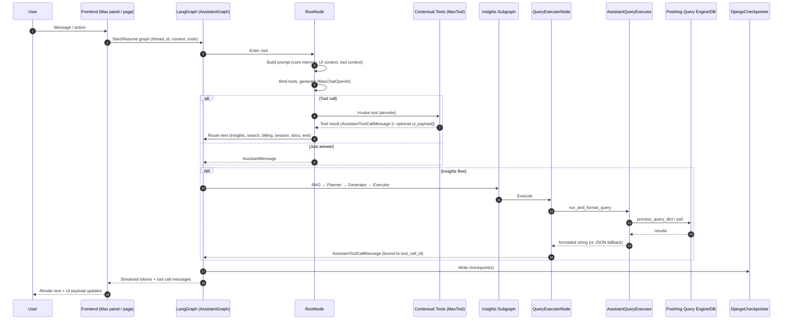
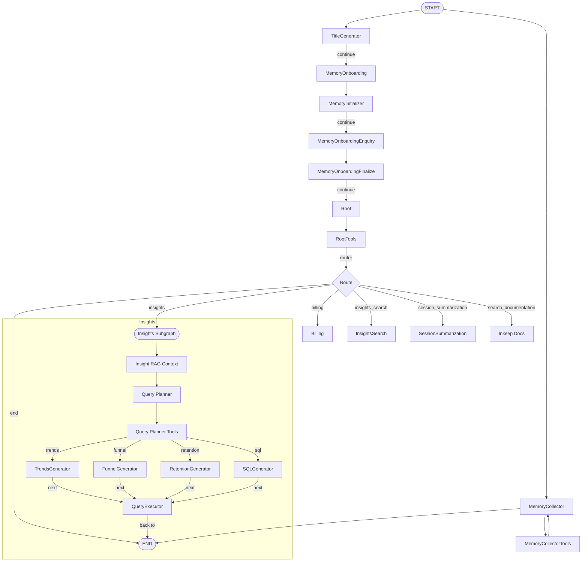
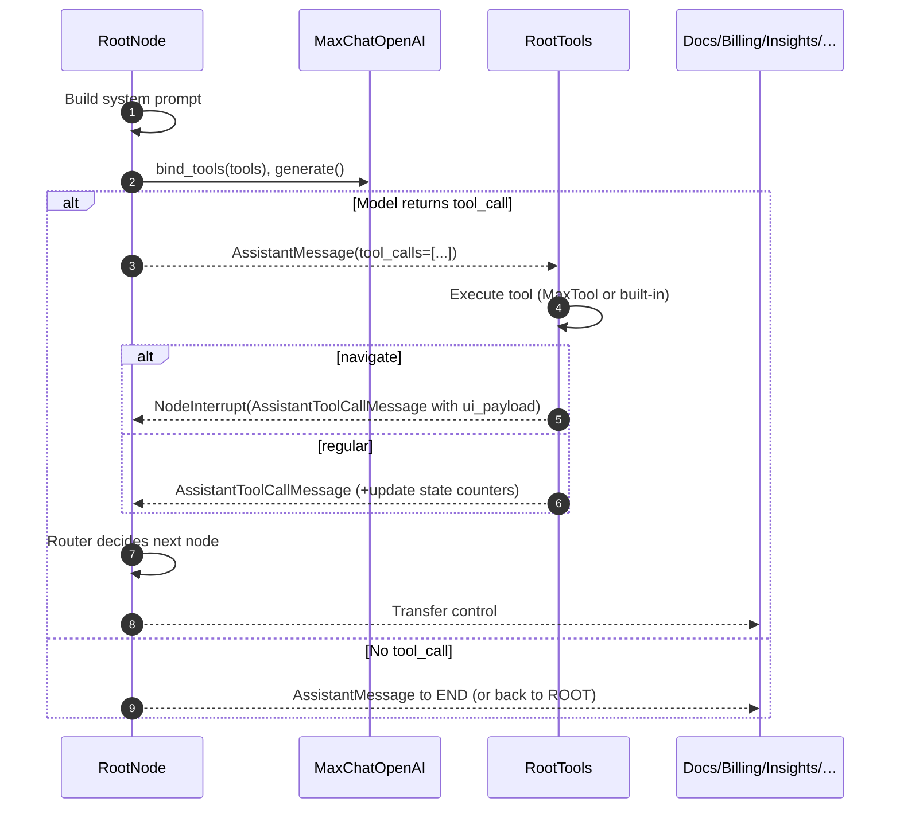
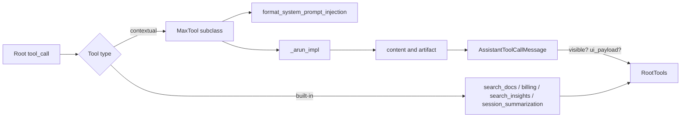
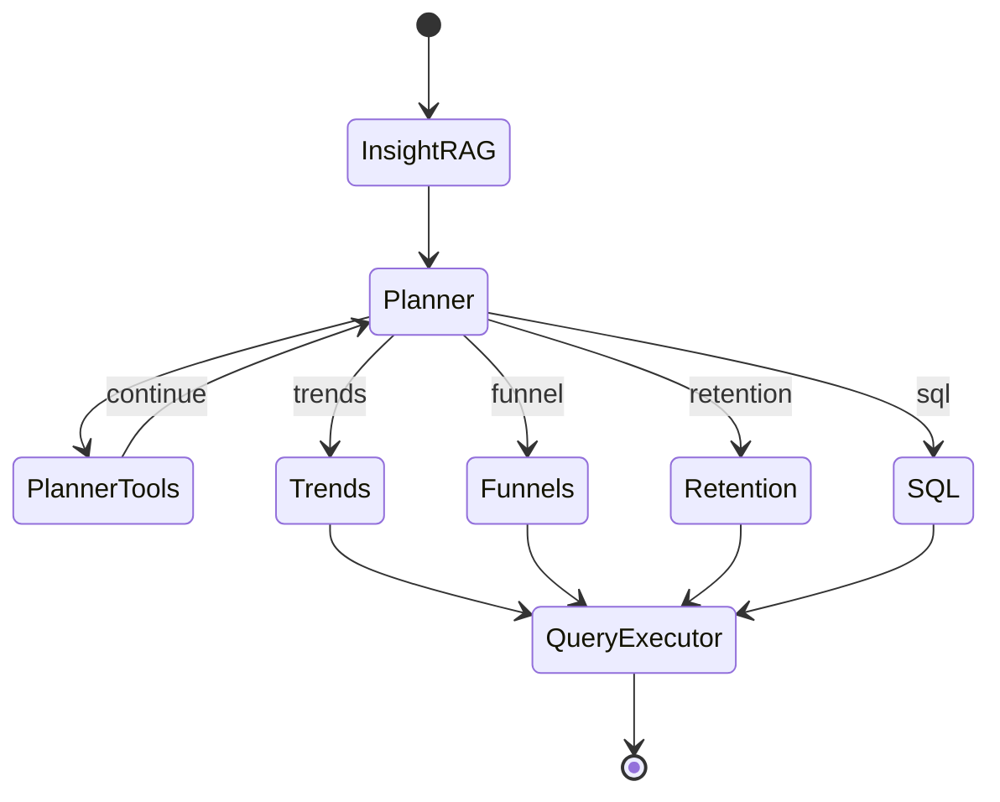
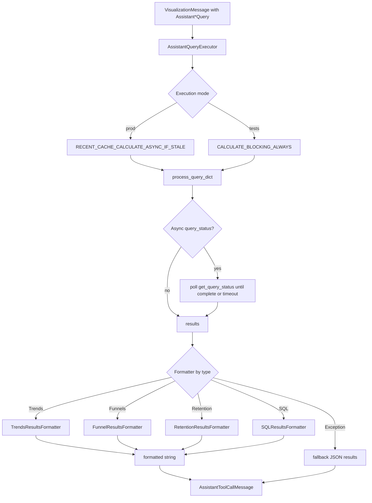
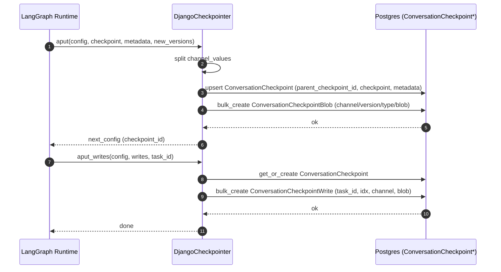
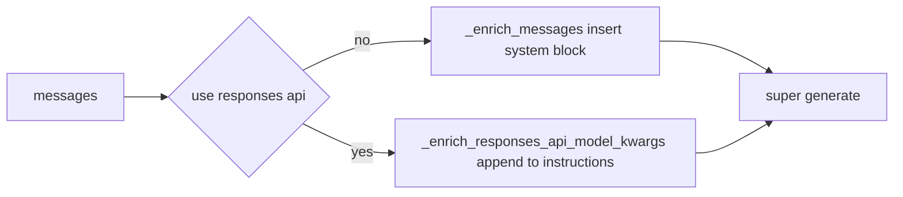
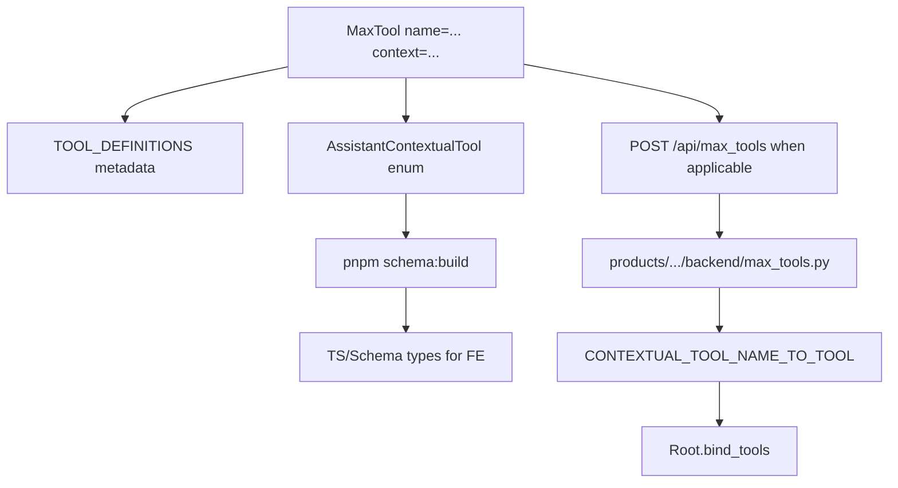

## Max AI Architecture

This document explains how Max AI is wired in PostHog. It focuses on the runtime graph, routing, tool calls, query execution and formatting, memory/checkpointing, the LLM wrapper, and frontend integration points.

### Table of Contents

- [Overview](#overview)
- [Runtime Graph (high-level)](#runtime-graph-high-level)
- [Root Orchestration and Routing](#root-orchestration-and-routing)
- [Contextual Tools and MaxTool](#contextual-tools-and-maxtool)
- [Insights Subgraph (RAG → Planner → Generators → Executor)](#insights-subgraph-rag--planner--generators--executor)
- [Query Execution and Formatting](#query-execution-and-formatting)
- [Memory and Checkpointing](#memory-and-checkpointing)
- [LLM Wrapper (MaxChatOpenAI)](#llm-wrapper-maxchatopenai)
- [Frontend Integration (mounting tools)](#frontend-integration-mounting-tools)
- [Tracing, Feature Flags, and Limits](#tracing-feature-flags-and-limits)
- [Key Files](#key-files)

---

### Overview

Show overview sequence

---

### Runtime Graph (high-level)

Backed by LangGraph’s `StateGraph`. The assembled graph adds nodes in this order and compiles with a Django-backed checkpointer.

Files: [graph/graph.py](graph/graph.py), [utils/types/base.py](utils/types/base.py) (node names), [django_checkpoint/checkpointer.py](django_checkpoint/checkpointer.py).

Show state graph layout

---

### Root Orchestration and Routing

Files: [graph/root/nodes.py](graph/root/nodes.py), [llm.py](llm.py), [tool.py](tool.py), [graph/query_executor/nodes.py](graph/query_executor/nodes.py).

What Root does each turn:

- Builds system prompt: base root prompt (feature-flag-trimmed), core memory, contextual tool injections, UI context summary (dashboards, insights, events/actions), billing context.
- Binds tools to the model (`parallel_tool_calls=False`), generates a single step.
- Emits `AssistantMessage` possibly with one `tool_call`.
- `RootNodeTools` executes that tool, appends an `AssistantToolCallMessage`, increments `root_tool_calls_count`, and routes.

Routing decisions (simplified):

- If `root_tool_insight_plan`: go to Insights subgraph
- Else if `search_insights_query`: go to InsightsSearch
- Else if `session_summarization_query`: go to SessionSummarization
- Else if tool was `retrieve_billing_information`: go to Billing
- Else: Inkeep Docs

Show root sequence (prompt building → tool → route)

---

### Contextual Tools and MaxTool

Files: [tool.py](tool.py), examples of product tools: [products/replay/backend/max_tools.py](../../products/replay/backend/max_tools.py), [products/data_warehouse/backend/max_tools.py](../../products/data_warehouse/backend/max_tools.py), frontend: [frontend/src/scenes/max/MaxTool.tsx](../../frontend/src/scenes/max/MaxTool.tsx), [frontend/src/scenes/max/max-constants.tsx](../../frontend/src/scenes/max/max-constants.tsx).

- `MaxTool` is a LangChain tool base with PostHog context and typed args. It returns both textual content and an artifact (`ui_payload`).
- The root injects each mounted tool’s `root_system_prompt_template` with the frontend-provided context, making the LLM “aware” of which tools are available and when to use them.
- Backend discovery dynamically imports `products/**/backend/max_tools.py` and registers classes in `CONTEXTUAL_TOOL_NAME_TO_TOOL`.
- Special tool: `navigate`. It raises a `NodeInterrupt` to pause the graph so the frontend can remount with a different tool set.

Show tool invocation path

---

### Insights Subgraph (RAG → Planner → Generators → Executor)

Files: [graph/graph.py](graph/graph.py), directories: [graph/query_planner/](graph/query_planner/), [graph/trends/](graph/trends/), [graph/funnels/](graph/funnels/), [graph/retention/](graph/retention/), [graph/sql/](graph/sql/), [graph/rag/](graph/rag/).

- RAG: retrieves local insight context to ground generation.
- Planner: iterates a plan; tools can refine the plan.
- Generators: produce `Assistant*Query` types (Trends, Funnels, Retention, HogQL).
- Executor: runs and formats the query, responding as a tool result so the original tool call chain stays consistent.

Show insights subgraph orchestration

---

### Query Execution and Formatting

Files: [graph/query_executor/nodes.py](graph/query_executor/nodes.py), [graph/query_executor/query_executor.py](graph/query_executor/query_executor.py), [graph/query_executor/format.py](graph/query_executor/format.py).

Key points:

- Executes via `process_query_dict` (blocking or async-polled) with product tag `MAX_AI`.
- Formats with type-specific formatters: Trends, Funnels (time-aware), Retention, SQL (uses `columns`).
- If formatting raises, falls back to compact JSON of `results`.
- `QueryExecutorNode` crafts a single `AssistantToolCallMessage` addressed to the original `tool_call_id`.

Show execution flow

---

### Memory and Checkpointing

Files: [graph/memory/](graph/memory/), [django_checkpoint/checkpointer.py](django_checkpoint/checkpointer.py), [ee/models/assistant.py](../models/assistant.py) (DB models referenced).

- Memory nodes handle onboarding Q&A and collection of user facts. They can write messages with tool calls to staged memory.
- `DjangoCheckpointer` persists LangGraph checkpoints and channel blobs into Postgres, keyed by `thread_id` and `checkpoint_ns`. It supports list/get/put/put_writes.
- Checkpoints store `pending_sends`, `channel_versions` and per-channel serialized blobs.

Show checkpoint write path

---

### LLM Wrapper (MaxChatOpenAI)

Files: [llm.py](llm.py).

- Injects project/org/user/datetime/region into the system instructions.
- Works for both classic Chat Completions message lists and the Responses API (`instructions`).
- Ensures consistent retries and context for every generation across nodes.

Show message enrichment

---

### Frontend Integration (mounting tools)

Files: [README.md](README.md) (MaxTool how-to), frontend: [frontend/src/scenes/max/MaxTool.tsx](../../frontend/src/scenes/max/MaxTool.tsx), [frontend/src/scenes/max/max-constants.tsx](../../frontend/src/scenes/max/max-constants.tsx), [frontend/src/queries/schema/schema-assistant-messages.ts](../../frontend/src/queries/schema/schema-assistant-messages.ts), product tools examples: [products/replay/backend/max_tools.py](../../products/replay/backend/max_tools.py), [products/data_warehouse/backend/max_tools.py](../../products/data_warehouse/backend/max_tools.py).

- Frontend mounts a `MaxTool` React component around UI, passing `context` and `callback`.
- The backend tool’s `root_system_prompt_template` is injected at root time, and the tool’s args schema governs how the LLM calls it.
- Only tools mounted in the current scene are bound, so availability is scene-aware by design.

Show FE ↔ BE tool wiring

---

### Tracing, Feature Flags, and Limits

- Tracing: local LLM analytics at `http://localhost:8010/llm-analytics/traces`.
- Feature flags gate optional capabilities in the root prompt and tool set (e.g. `max-ai-insight-search`, `max-session-summarization`).
- Limits: token window trimming to ~32k when >64k, and `MAX_TOOL_CALLS=4` to break loops.

---

### Key Files

- Graph composition: [graph/graph.py](graph/graph.py)
- Root and routing: [graph/root/nodes.py](graph/root/nodes.py)
- Query execution: [graph/query_executor/nodes.py](graph/query_executor/nodes.py), [graph/query_executor/query_executor.py](graph/query_executor/query_executor.py), [graph/query_executor/format.py](graph/query_executor/format.py)
- Memory: [graph/memory/](graph/memory/)
- Checkpointing: [django_checkpoint/checkpointer.py](django_checkpoint/checkpointer.py)
- LLM wrapper: [llm.py](llm.py)
- Tools: [tool.py](tool.py), examples: [products/replay/backend/max_tools.py](../../products/replay/backend/max_tools.py), [products/data_warehouse/backend/max_tools.py](../../products/data_warehouse/backend/max_tools.py)
- Frontend: [frontend/src/scenes/max/](../../frontend/src/scenes/max/), [frontend/src/queries/schema/schema-assistant-messages.ts](../../frontend/src/queries/schema/schema-assistant-messages.ts), [frontend/src/scenes/max/max-constants.tsx](../../frontend/src/scenes/max/max-constants.tsx)

---

If you need more depth on prompts or adding new query types, see [README.md](README.md) and [PROMPTING_GUIDE.md](PROMPTING_GUIDE.md).

