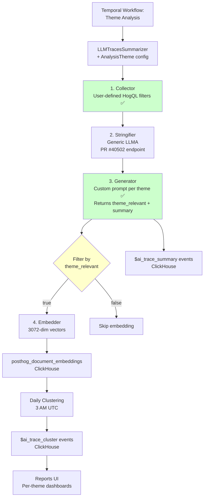

# LLM Traces Summarization - Generalization Architecture

## Status: Draft - For Discussion

This document describes the technical architecture for generalizing the LLM traces summarization system.

## Architecture

### Core Principles

1. **Universal Stringifier**: All traces use generic LLMA stringifier - domain expertise comes from custom analysis prompts
2. **Configurable Analysis**: Users define filters and prompts per theme
3. **Multi-Perspective Insights**: 6 built-in themes + unlimited custom themes
4. **Flexible Architecture**: Designed for extensibility while maintaining simplicity

### Data Flow



## Analysis Themes: Multi-Dimensional Architecture

### Core Concept

**Analysis Themes** provide different analytical lenses for examining traces from multiple perspectives:

```python
# One trace can be analyzed by multiple themes
trace_123 = {
    "unhappy_users": "User frustrated by confusing checkout flow",
    "errors_and_failures": "Payment API timeout after 30s",
    "feature_gaps": "User requested Apple Pay support",
    "performance_cost_hotspots": "Checkout took 3.2s (2x average, 8000 tokens)",
    "happy_users": null  # Had errors, so not applicable
}
```

### Theme Architecture


### Key Benefits

1. **Efficiency**: Only collect relevant traces per theme (70%+ cost reduction)
2. **Quality**: Theme-specific prompts extract better insights
3. **Separation**: Each theme has independent embeddings/clusters
4. **Caching**: Stringified traces reused across themes
5. **Parallelism**: Themes can run in separate Temporal workers

### Cost Comparison

**Naive Approach** (collect all, analyze all):

```text
10,000 traces × 6 themes = 60,000 LLM calls + embeddings = $600
```

**Theme-Filtered Approach (with theme_relevance)**:

```text
Theme                    | HogQL Filter   | Analyzed | theme_relevant | Embedded | Cost
-------------------------|----------------|----------|----------------|----------|------
Unhappy Users            | none           | 5,000    | 1,250 (25%)   | 1,250    | $51.25
Errors & Failures        | $ai_error SET  |   500    |   400 (80%)   |   400    | $5.40
Feature Gaps             | input patterns | 1,500    |   900 (60%)   |   900    | $15.90
Performance/Cost         | latency/tokens |   500    |   350 (70%)   |   350    | $5.35
Happy Users              | no errors      | 2,000    |   800 (40%)   |   800    | $20.80
------------------------------------------------------------
Total LLM calls: 9,500 traces × $0.01 = $95
Total embeddings: 3,700 traces × $0.001 = $3.70
Total cost: $98.70 (80% savings vs naive $500 approach)
```

**Key Insight**: theme_relevance filtering reduces embedding costs by 61% (3,700 vs 9,500 traces),
while maintaining high signal-to-noise ratio in clusters.

### Two-Tier Filtering: HogQL + theme_relevance

To optimize costs and signal quality, we use a two-stage filtering strategy:

**Stage 1: HogQL Filters (Coarse, Cheap)**

- Pre-filter at query time based on properties
- Fast, deterministic filtering
- Casts wide net (some false positives acceptable)

**Stage 2: LLM theme_relevance (Fine, Expensive)**

- Post-filter after summarization using semantic understanding
- LLM returns structured output: `{"theme_relevant": true/false, "summary": "..."}`
- Only embed traces where `theme_relevant=true`
- Filters out false positives before expensive embedding/clustering


**Benefits:**

- **Cost savings**: Only embed relevant traces (50-90% reduction)
- **Quality**: Higher signal-to-noise ratio in clusters
- **Metrics**: Relevance rate per theme useful for tuning filters
- **Universal**: Works across all theme types

**Example - Unhappy Users Theme:**

```text
Stage 1 (HogQL): No filter → 5000 traces analyzed
Stage 2 (LLM):   theme_relevant=true → 1250 traces (25% relevance rate)
Result:          Only 1250 embeddings created (75% cost savings)
```

### Component Designs

#### 1. Analysis Theme Configuration

```python
# ee/hogai/llm_traces_summaries/config.py

from dataclasses import dataclass
from posthog.schema import HogQLPropertyFilter, DateRange

@dataclass
class ClusteringConfig:
    """Configuration for clustering step"""
    enabled: bool = True
    min_traces_per_cluster: int = 25
    max_traces_per_cluster: int = 100
    cosine_similarity_threshold: float = 0.72
    max_recursions: int = 3

@dataclass
class ThemeSummaryResult:
    """Result from theme-specific trace summarization"""
    theme_relevant: bool          # LLM's binary relevance assessment
    summary: str                  # Detailed explanation or "Not relevant to {theme}"

@dataclass
class AnalysisTheme:
    """
    Configuration for an analysis theme.

    A theme defines a specific analytical perspective to apply to traces.
    Each theme collects its own subset of traces and generates independent summaries.
    """

    # Identification
    theme_id: str                      # Unique ID (e.g., "payment_errors")
    name: str                          # Display name (e.g., "Payment Errors")
    description: str                   # User-facing description

    # Collection: Two-tier filtering for efficiency
    base_filters: list[HogQLPropertyFilter]    # Applied first (e.g., "checkout traces")
    theme_filters: list[HogQLPropertyFilter]   # Applied second (e.g., "has error")
    date_range: DateRange

    # Sampling: Cost control via random sampling
    sample_rate: float = 1.0           # 0.0 to 1.0 (0% to 100% of traces)
    sample_seed: int = 42              # For reproducible sampling

    # Analysis
    prompt: str                        # Theme-specific LLM prompt (must output JSON with theme_relevant)
    llm_model: str = "gemini-2.5-flash-lite-preview-09-2025"
    filter_by_relevance: bool = True   # Enable theme_relevance filtering (default: True)

    # Clustering
    clustering_config: ClusteringConfig | None = None

    # Execution
    enabled: bool = True
    max_traces: int | None = None      # Limit for testing
    batch_size: int = 100              # LLM batch size

# Built-in themes shipped with PostHog (6 core themes)
BUILTIN_THEMES = {
    "general_usage_patterns": AnalysisTheme(
        theme_id="general_usage_patterns",
        name="General Usage Patterns",
        description="Discover common workflows, interaction patterns, and how users actually use the system",
        base_filters=[],  # Apply to all traces
        theme_filters=[],  # No filters - broad discovery across all usage
        date_range=DateRange(date_from="-7d"),
        sample_rate=1.0,
        max_traces=10000,  # Large sample for pattern discovery
        filter_by_relevance=True,
        prompt="""
Analyze this trace to identify the primary usage pattern or workflow.

Focus on:
- What task or goal is the user trying to accomplish?
- What workflow or interaction pattern are they following?
- What features or capabilities are they using?
- Is this a common, everyday usage or something specialized?
- How are they navigating through the system?

Return ONLY valid JSON with no additional text:
{
  "theme_relevant": true/false,
  "summary": "description of usage pattern OR 'Not relevant to General Usage Patterns'"
}

Set theme_relevant=true for traces that show clear, identifiable usage patterns or workflows.
Set theme_relevant=false for incomplete traces, test data, or system noise.
If theme_relevant=false, summary should be exactly: "Not relevant to General Usage Patterns"
If theme_relevant=true, describe the usage pattern in maximum 10 sentences - focus on WHAT they're doing, not evaluating success/failure.
"""
    ),

    "unhappy_users": AnalysisTheme(
        theme_id="unhappy_users",
        name="Unhappy Users",
        description="Identify frustration, pain points, and user dissatisfaction expressed in any way",
        base_filters=[],  # Apply to all traces
        theme_filters=[],  # No filters - analyze all traces for signs of unhappiness
        date_range=DateRange(date_from="-7d"),
        sample_rate=1.0,  # Analyze all traces (broad perspective)
        max_traces=5000,
        filter_by_relevance=True,
        prompt="""
Analyze this trace for any signs of user frustration, dissatisfaction, or pain points.

Look for:
- Explicit complaints or negative sentiment
- Confusion, difficulty, or struggle completing tasks
- Repeated failed attempts or errors
- User expressing disappointment or unmet expectations
- Any indication the user is having a poor experience

Return ONLY valid JSON with no additional text:
{
  "theme_relevant": true/false,
  "summary": "detailed explanation of unhappiness OR 'Not relevant to Unhappy Users'"
}

Set theme_relevant=true ONLY if there are clear signs of user dissatisfaction.
If theme_relevant=false, summary should be exactly: "Not relevant to Unhappy Users"
If theme_relevant=true, explain what the user is struggling with in maximum 10 sentences.
"""
    ),

    "errors_and_failures": AnalysisTheme(
        theme_id="errors_and_failures",
        name="Errors and Failures",
        description="Surface technical errors, exceptions, and failure modes in your LLM application",
        base_filters=[],
        theme_filters=[
            HogQLPropertyFilter(
                key="properties.$ai_error IS NOT NULL OR properties.$ai_exception IS NOT NULL",
                type="hogql"
            )
        ],
        date_range=DateRange(date_from="-7d"),
        sample_rate=1.0,
        max_traces=5000,
        filter_by_relevance=True,
        prompt="""
Analyze this trace for technical errors, failures, and exceptions.

For each issue found, identify:
- What went wrong technically (error type, failure mode)
- Root cause if apparent from the trace
- Impact on the user experience
- Any patterns or context around the failure

Return ONLY valid JSON with no additional text:
{
  "theme_relevant": true/false,
  "summary": "detailed error explanation OR 'Not relevant to Errors and Failures'"
}

Set theme_relevant=true ONLY if there are actual technical errors or failures.
If theme_relevant=false, summary should be exactly: "Not relevant to Errors and Failures"
If theme_relevant=true, explain the error in maximum 10 sentences.
"""
    ),

    "feature_gaps": AnalysisTheme(
        theme_id="feature_gaps",
        name="Feature Gaps",
        description="Discover where users ask for capabilities your application doesn't support",
        base_filters=[],
        theme_filters=[
            HogQLPropertyFilter(
                key="properties.$ai_input ILIKE '%can you%' OR properties.$ai_input ILIKE '%is it possible%' OR properties.$ai_input ILIKE '%would be great%' OR properties.$ai_input ILIKE '%wish%' OR properties.$ai_input ILIKE '%need%'",
                type="hogql"
            )
        ],
        date_range=DateRange(date_from="-7d"),
        sample_rate=1.0,
        max_traces=5000,
        filter_by_relevance=True,
        prompt="""
Extract any feature requests, capability gaps, or unmet user needs from this trace.

Focus on:
- Explicit feature requests ("I need X", "Can you do Y")
- Implied needs (user trying to accomplish something the app can't do)
- Workaround attempts (user struggling due to missing feature)
- Enhancement suggestions from the user

Return ONLY valid JSON with no additional text:
{
  "theme_relevant": true/false,
  "summary": "detailed feature gap explanation OR 'Not relevant to Feature Gaps'"
}

Set theme_relevant=true ONLY if the user is requesting missing capabilities or encountering feature limitations.
If theme_relevant=false, summary should be exactly: "Not relevant to Feature Gaps"
If theme_relevant=true, explain what capability the user needs in maximum 10 sentences.
"""
    ),

    "performance_cost_hotspots": AnalysisTheme(
        theme_id="performance_cost_hotspots",
        name="Performance/Cost Hotspots",
        description="Identify high latency, expensive operations, and optimization opportunities",
        base_filters=[],
        theme_filters=[
            HogQLPropertyFilter(
                key="properties.$ai_latency_ms > 2000 OR properties.$ai_total_tokens > 5000 OR properties.$ai_cost_usd > 0.10",
                type="hogql"
            )
        ],
        date_range=DateRange(date_from="-7d"),
        sample_rate=1.0,
        max_traces=5000,
        filter_by_relevance=True,
        prompt="""
Analyze this trace for performance problems and cost drivers.

Look for:
- High latency (slow responses, long processing times)
- Excessive token usage (verbose outputs, over-contextualization)
- Expensive operations (high cost per interaction)
- Inefficient patterns (retries, redundant calls, poor caching)

Return ONLY valid JSON with no additional text:
{
  "theme_relevant": true/false,
  "summary": "detailed performance/cost analysis OR 'Not relevant to Performance/Cost Hotspots'"
}

Set theme_relevant=true ONLY if there are significant performance or cost issues worth optimizing.
If theme_relevant=false, summary should be exactly: "Not relevant to Performance/Cost Hotspots"
If theme_relevant=true, explain the issue and optimization opportunities in maximum 10 sentences.
"""
    ),

    "happy_users": AnalysisTheme(
        theme_id="happy_users",
        name="Happy Users",
        description="Identify success patterns, satisfaction signals, and what's working well",
        base_filters=[],
        theme_filters=[
            HogQLPropertyFilter(
                key="properties.$ai_error IS NULL",
                type="hogql"
            )
        ],
        date_range=DateRange(date_from="-7d"),
        sample_rate=1.0,
        max_traces=5000,
        filter_by_relevance=True,
        prompt="""
Identify what's working well in this trace and any signs of user satisfaction.

Look for:
- Successful task completion
- Positive sentiment or appreciation
- Smooth user experience without friction
- Features working as expected
- User achieving their goal efficiently

Return ONLY valid JSON with no additional text:
{
  "theme_relevant": true/false,
  "summary": "detailed success pattern explanation OR 'Not relevant to Happy Users'"
}

Set theme_relevant=true ONLY if there are clear signs of user satisfaction or success.
If theme_relevant=false, summary should be exactly: "Not relevant to Happy Users"
If theme_relevant=true, explain what made the experience successful in maximum 10 sentences.
"""
    ),
}
```

#### 2. Trace Stringification

The system uses a **Generic LLMA Stringifier** for all themes and traces. Domain expertise comes from custom analysis prompts rather than specialized stringifiers. This design provides:

- **Consistency**: All users leverage the same proven stringification logic
- **Simplicity**: Clean architecture without stringifier selection complexity
- **Maintainability**: Single stringifier to validate, improve, and debug
- **Extensibility**: Architecture supports pluggable stringifiers if needed in the future

**Implementation**: Leverages the general-purpose stringification endpoint from PR #40502.

```python
# ee/hogai/llm_traces_summaries/tools/stringify_trace.py

def stringify_trace(trace: LLMTrace) -> str | None:
    """
    Generic stringifier for standard LLMA traces.
    Uses the general-purpose stringification endpoint from PR #40502.

    Converts trace events ($ai_generation, $ai_span) into readable text:
    - Formats input/output messages (supports OpenAI, Anthropic, LangChain)
    - Includes tools, errors, latency
    - Handles nested spans and state transitions
    """
    # Call the general-purpose stringification endpoint
    response = requests.post(
        f"/api/projects/{team_id}/llm_traces/{trace_id}/stringify",
        json={"rendering": "generic_llma"}
    )
    return response.text

# See PR #40502 for full implementation details
```

**Future Extensions**: The architecture supports pluggable stringifiers for potential future use cases (custom trace formats, domain-specific stringification), though these capabilities are not currently exposed to users.

#### 3. Theme-Based Collection with Caching

```python
# ee/hogai/llm_traces_summaries/tools/theme_collector.py

from typing import Dict
import redis
import json

class ThemeBasedCollector:
    """
    Collects traces for a specific theme with intelligent caching.

    Key features:
    - Combines base + theme filters for efficient collection
    - Caches stringified traces to avoid duplication
    - Returns cached text if available
    """

    def __init__(
        self,
        team: Team,
        theme: AnalysisTheme,
        cache: redis.Redis
    ):
        self._team = team
        self._theme = theme
        self._cache = cache
        self._cache_ttl = 86400  # 24 hours

    def _get_cache_key(self, trace_id: str) -> str:
        """Generate cache key for stringified trace"""
        # Uses generic LLMA stringifier for all traces
        return f"trace_text:{self._team.id}:generic_llma:{trace_id}"

    def collect_and_stringify(self) -> Dict[str, str]:
        """
        Collect traces for this theme and return stringified results.
        Uses cache to avoid re-stringifying existing traces.

        Returns:
            Dict[trace_id, stringified_text]
        """
        # Combine base + theme filters
        combined_filters = self._theme.base_filters + self._theme.theme_filters

        # Collect traces from ClickHouse
        collector = LLMTracesSummarizerCollector(
            team=self._team,
            filters=combined_filters
        )

        stringified_traces = {}
        cache_hits = 0
        cache_misses = 0
        offset = 0

        while True:
            response = collector.get_db_traces_per_page(
                offset=offset,
                date_range=self._theme.date_range
            )

            # Apply sampling if configured
            traces_to_process = response.results
            if self._theme.sample_rate < 1.0:
                traces_to_process = self._sample_traces(traces_to_process)

            for trace in traces_to_process:
                cache_key = self._get_cache_key(trace.id)

                # Try cache first
                cached_text = self._cache.get(cache_key)
                if cached_text:
                    stringified_traces[trace.id] = cached_text.decode('utf-8')
                    cache_hits += 1
                else:
                    # Cache miss - stringify and store
                    try:
                        stringified = stringify_trace(trace)  # Uses generic LLMA stringifier
                        if stringified:
                            stringified_traces[trace.id] = stringified
                            # Store in cache with TTL
                            self._cache.setex(
                                cache_key,
                                self._cache_ttl,
                                stringified.encode('utf-8')
                            )
                            cache_misses += 1
                    except Exception as e:
                        # Skip failed traces, log warning
                        logger.warning(
                            f"Failed to stringify trace {trace.id} for theme "
                            f"{self._theme.theme_id}: {e}"
                        )
                        continue

            if not response.hasMore:
                break
            offset += len(response.results)

        # Log cache performance
        total = cache_hits + cache_misses
        if total > 0:
            hit_rate = (cache_hits / total) * 100
            sample_info = f", sampled at {self._theme.sample_rate * 100}%" if self._theme.sample_rate < 1.0 else ""
            logger.info(
                f"Theme {self._theme.theme_id}: Collected {total} traces{sample_info}, "
                f"cache hit rate: {hit_rate:.1f}% ({cache_hits}/{total})"
            )

        return stringified_traces

    def _sample_traces(self, traces: list[LLMTrace]) -> list[LLMTrace]:
        """Apply deterministic random sampling to traces"""
        import random
        random.seed(self._theme.sample_seed)
        sample_size = int(len(traces) * self._theme.sample_rate)
        if sample_size == 0:
            return []
        return random.sample(traces, k=min(sample_size, len(traces)))
```

#### 7. Updated Summarizer (Theme-Based)

```python
# ee/hogai/llm_traces_summaries/summarize_traces.py

class LLMTracesSummarizer:
    """
    Theme-based trace summarizer.

    Orchestrates multiple theme analyses in parallel, allowing each theme
    to apply its own filters, prompts, and clustering configuration.
    """

    def __init__(
        self,
        team: Team,
        themes: list[AnalysisTheme],
        cache: redis.Redis
    ):
        self._team = team
        self._themes = themes
        self._cache = cache

    async def summarize_all_themes(self, date_range: DateRange):
        """
        Run analysis for all enabled themes.

        For efficiency:
        - Each theme collects only its filtered traces
        - Stringified traces are cached (shared across themes)
        - Themes can run in parallel (future: separate Temporal workers)

        Returns:
            Dict[theme_id, ThemeResults]
        """
        results = {}

        # For now, run themes sequentially (Phase 2)
        # Phase 4: Run in parallel via separate Temporal workers
        for theme in self._themes:
            if not theme.enabled:
                continue

            logger.info(f"Analyzing theme: {theme.theme_id}")
            theme_results = await self._analyze_theme(theme, date_range)
            results[theme.theme_id] = theme_results

        return results

    async def _analyze_theme(
        self,
        theme: AnalysisTheme,
        date_range: DateRange
    ) -> Dict:
        """Analyze traces for a single theme"""

        # 1. Create stringifier for this theme
        stringifier = StringifierFactory.create(
            stringifier_type=theme.stringifier_type,
            team=self._team,
            params=theme.stringifier_params
        )

        # 2. Collect and stringify traces (with caching)
        collector = ThemeBasedCollector(
            team=self._team,
            theme=theme,
            stringifier=stringifier,
            cache=self._cache
        )
        stringified_traces = await database_sync_to_async(
            collector.collect_and_stringify
        )()

        logger.info(
            f"Theme {theme.theme_id}: Collected {len(stringified_traces)} traces"
        )

        if not stringified_traces:
            return {"traces_analyzed": 0, "summaries_generated": 0}

        # 3. Generate summaries using theme-specific prompt
        generator = LLMTraceSummarizerGenerator(
            team=self._team,
            theme_id=theme.theme_id,  # ← New: theme_id for storage
            prompt=theme.prompt,
            model=theme.llm_model
        )
        summaries = await generator.summarize_stringified_traces(stringified_traces)

        # 4. Store summaries with theme_id
        await database_sync_to_async(generator.store_summaries_in_db)(summaries)

        # 5. Embed summaries with theme-scoped rendering
        embedder = LLMTracesSummarizerEmbedder(team=self._team)
        embedder.embed_summaries(
            summarized_traces=summaries,
            theme_id=theme.theme_id,  # ← New: theme-scoped embeddings
            rendering=f"llm_traces_summary_{theme.theme_id}"
        )

        # 6. Optional: Cluster if configured
        cluster_results = None
        if theme.clustering_config and theme.clustering_config.enabled:
            clusterizer = KmeansClusterizer(
                team=self._team,
                theme_id=theme.theme_id,
                config=theme.clustering_config
            )
            cluster_results = await clusterizer.cluster_summaries(summaries)

        return {
            "traces_analyzed": len(stringified_traces),
            "summaries_generated": len(summaries),
            "clusters": cluster_results
        }

    @staticmethod
    def get_default_themes() -> list[AnalysisTheme]:
        """Get default PostHog AI theme for backward compatibility"""
        return [
            AnalysisTheme(
                theme_id="posthog_ai_issues",
                name="PostHog AI Issues",
                description="Issues from PostHog AI chat",
                base_filters=[
                    HogQLPropertyFilter(
                        key="properties.$ai_span_name = 'LangGraph'",
                        type="hogql"
                    )
                ],
                theme_filters=[],
                date_range=DateRange(date_from="-7d"),
                stringifier_type=StringifierType.POSTHOG_AI,
                prompt="""
Analyze this conversation and list all pain points, frustrations, and feature limitations.
If no issues - return only "No issues found".
Provide output as plain English text in maximum 10 sentences.
"""
            )
        ]
```

#### 8. Batching Strategy: Temporal Workflow

**Approach:** Run analysis in scheduled batches (every 10 minutes) rather than real-time.

**Benefits:**

- Cost efficient (batch LLM calls)
- Predictable load on infrastructure
- Allows graceful failure handling
- Can optimize for off-peak processing

```python
# ee/hogai/llm_traces_summaries/workflows/batch_analyze_themes.py

from temporalio import workflow
from datetime import timedelta

@workflow.defn
class BatchAnalyzeThemesWorkflow:
    """
    Temporal workflow that runs every 10 minutes to analyze traces for all themes.

    This batched approach:
    - Collects traces from last 10 minutes
    - Analyzes all enabled themes
    - Handles failures gracefully (skips failed traces)
    - Batches LLM calls for efficiency
    """

    @workflow.run
    async def run(self, team_id: int):
        # Get date range: last 10 minutes
        now = datetime.now()
        date_range = DateRange(
            date_from=(now - timedelta(minutes=10)).isoformat(),
            date_to=now.isoformat()
        )

        # Get all enabled themes for this team
        themes = await workflow.execute_activity(
            get_enabled_themes,
            team_id=team_id,
            start_to_close_timeout=timedelta(seconds=30)
        )

        logger.info(f"Analyzing {len(themes)} themes for team {team_id}")

        # Analyze each theme
        for theme in themes:
            try:
                await workflow.execute_activity(
                    analyze_theme,
                    team_id=team_id,
                    theme_config=theme,
                    date_range=date_range,
                    start_to_close_timeout=timedelta(minutes=5)
                )
            except Exception as e:
                # Log error but continue with other themes
                logger.error(f"Failed to analyze theme {theme.theme_id}: {e}")
                continue

        logger.info(f"Completed batch analysis for team {team_id}")


@activity.defn
async def analyze_theme(team_id: int, theme_config: dict, date_range: DateRange):
    """
    Activity to analyze a single theme.

    Steps:
    1. Collect and stringify traces (with caching + sampling)
    2. Batch summarize (100 traces at a time to LLM)
    3. Store summaries as $ai_trace_summary events
    4. Batch embed summaries (send to Kafka)
    """
    team = Team.objects.get(id=team_id)
    theme = AnalysisTheme(**theme_config)
    cache = redis.Redis(...)  # Redis connection for caching

    # 1. Collect traces
    collector = ThemeBasedCollector(team=team, theme=theme, cache=cache)
    stringified_traces = collector.collect_and_stringify()

    if not stringified_traces:
        logger.info(f"No traces to analyze for theme {theme.theme_id}")
        return

    logger.info(f"Collected {len(stringified_traces)} traces for theme {theme.theme_id}")

    # 2. Batch summarize (100 at a time)
    summaries = {}
    batch_size = theme.batch_size  # e.g., 100
    trace_items = list(stringified_traces.items())

    for i in range(0, len(trace_items), batch_size):
        batch = dict(trace_items[i:i + batch_size])
        try:
            batch_summaries = await generate_summaries_batch(
                stringified_traces=batch,
                prompt=theme.prompt,
                model=theme.llm_model
            )
            summaries.update(batch_summaries)
        except Exception as e:
            logger.error(f"Failed to summarize batch {i}-{i+batch_size}: {e}")
            # Continue with next batch

    logger.info(f"Generated {len(summaries)} summaries for theme {theme.theme_id}")

    # 3. Store as $ai_trace_summary events
    store_summary_events(
        team=team,
        theme_id=theme.theme_id,
        summaries=summaries
    )

    # 4. Batch embed summaries
    embed_summaries_batch(
        team=team,
        theme_id=theme.theme_id,
        summaries=summaries
    )


def store_summary_events(team: Team, theme_id: str, summaries: dict):
    """Store summaries as PostHog events"""
    events = []
    for trace_id, summary_text in summaries.items():
        events.append({
            "event": "$ai_trace_summary",
            "distinct_id": "system",
            "properties": {
                "$trace_id": trace_id,
                "$analysis_theme_id": theme_id,
                "$summary": summary_text,
                "$summary_metadata": {
                    "timestamp": datetime.now().isoformat()
                }
            }
        })

    # Batch ingest events
    capture_events(team=team, events=events)


def embed_summaries_batch(team: Team, theme_id: str, summaries: dict):
    """Send summaries to Kafka for embedding"""
    embedder = LLMTracesSummarizerEmbedder(team=team)

    for trace_id, summary_text in summaries.items():
        try:
            embedder.embed_summary(
                content=summary_text,
                document_id=trace_id,
                rendering=f"llm_traces_summary_{theme_id}"
            )
        except Exception as e:
            # Skip failed embeddings
            logger.warning(f"Failed to embed summary for trace {trace_id}: {e}")
            continue
```

**Scheduling:**

```python
# Schedule workflow to run every 10 minutes for each team
schedule = workflow.schedule(
    id=f"batch-analyze-themes-team-{team_id}",
    workflow=BatchAnalyzeThemesWorkflow,
    args=[team_id],
    cron="*/10 * * * *",  # Every 10 minutes
)
```

#### 9. Clustering: Theme-Based Issue Discovery

**Overview**

Clustering groups similar summaries together to identify common patterns, issues, and trends. In the theme-based architecture, each theme gets its own independent clustering:

- **Error Analysis Theme** → Clusters of similar errors
- **UX Issues Theme** → Clusters of similar UX problems
- **Feature Requests Theme** → Clusters of similar feature requests

**Trigger: Scheduled Only (Keep It Simple)**

```python
# Daily at 3 AM UTC:
# - For each enabled theme with clustering enabled
# - Dynamically fetch embeddings (expand date range until min_n_traces met)
# - Run KMeans clustering
# - Generate cluster names + descriptions via LLM (one call per cluster)
# - Store as $ai_trace_cluster events
```

**Dynamic Date Range (Handle Low-Volume Teams)**

Not all teams have high trace volume. We dynamically expand the date range to ensure we have enough data:

```python
# Configuration
min_n_traces = 100   # Minimum for meaningful clustering
max_n_traces = 5000  # Cap to prevent OOM
max_n_days = 30      # Don't look back too far (data gets stale)

# Algorithm: Try progressively larger windows
days_to_try = [3, 7, 14, 30]

for days in days_to_try:
    traces = fetch_embeddings(theme, days, limit=max_n_traces)

    if len(traces) >= min_n_traces:
        # Success! We have enough data
        return cluster_theme(traces, actual_days=days)

    if days >= max_n_days:
        # Exhausted search window - skip clustering
        logger.info(
            f"Not enough traces for theme {theme.theme_id}: "
            f"{len(traces)} < {min_n_traces} (searched {max_n_days} days)"
        )
        return None  # No clustering result
```

**Example Scenarios:**

| Team Volume       | 3 days | 7 days | 14 days | 30 days | Outcome                         |
| ----------------- | ------ | ------ | ------- | ------- | ------------------------------- |
| High (PostHog AI) | 5000+  | -      | -       | -       | ✅ Cluster 5000 traces (3 days) |
| Medium            | 50     | 150    | -       | -       | ✅ Cluster 150 traces (7 days)  |
| Low               | 5      | 15     | 40      | 60      | ⚠️ Skip clustering (< 100)      |

**Key Insight: Embeddings are the Durable Asset**

Embeddings are stored permanently and reused across features:

```text
Trace → Summary → Embedding [STORED IN CLICKHOUSE]
                      ↓
                  (reusable)
                      ↓
    ┌─────────────────┼─────────────────┐
    ↓                 ↓                 ↓
Clustering    Similarity Search    Future Features
```

Clustering just reads and groups existing embeddings. It's ephemeral - a means to surface insights.

**Cluster Storage: `$ai_trace_cluster` Events**

Following the `$ai_trace_summary` pattern, clusters are stored as PostHog events:

```python
# Regular cluster event
{
    "event": "$ai_trace_cluster",
    "distinct_id": f"theme:{theme_id}",
    "properties": {
        # Theme identification
        "$ai_theme_id": "error_analysis",

        # Cluster identification
        "$ai_cluster_id": "cluster_0",  # Within this theme
        "$ai_clustering_run_id": "2025-10-30T03:00:00Z",  # Groups clusters from same daily run

        # LLM-generated cluster explanation
        "$ai_cluster_name": "Payment Gateway Timeout Errors",
        "$ai_cluster_description": "Users experiencing 30-second timeouts during checkout payment processing, primarily with Stripe API. Affects approximately 3% of checkout attempts, typically during peak hours.",

        # Cluster metrics
        "$ai_cluster_avg_similarity": 0.85,  # Higher = tighter cluster
        "$ai_cluster_size": 47,  # Number of traces
        "$ai_is_unclustered": false,  # Regular cluster

        # Trace references (with 5000 max cap, storing all IDs is safe)
        "$ai_trace_ids": ["trace_123", "trace_456", ...],  # All traces in cluster

        # Metadata
        "$ai_date_range_start": "2025-10-27T00:00:00Z",  # Last 3 days
        "$ai_date_range_end": "2025-10-30T00:00:00Z"
    }
}

# Special "unclustered" virtual cluster (treated as regular cluster for simplicity)
{
    "event": "$ai_trace_cluster",
    "distinct_id": f"theme:{theme_id}",
    "properties": {
        "$ai_theme_id": "error_analysis",
        "$ai_cluster_id": "unclustered",  # ← Special reserved ID
        "$ai_clustering_run_id": "2025-10-30T03:00:00Z",

        "$ai_cluster_name": "Everything Else",
        "$ai_cluster_description": "Traces that didn't fit into any cluster. May contain novel edge cases, one-off issues, or insufficient similarity to form patterns.",

        "$ai_cluster_size": 30,
        "$ai_trace_ids": ["trace_x", "trace_y", ...],

        "$ai_is_unclustered": true,  # ← Flag for special UI handling
        "$ai_cluster_avg_similarity": null  # No similarity for unclustered
    }
}
```

**Benefits of Virtual Unclustered Cluster:**

- Uniform storage (same event type, same queries)
- Versioned history (unclustered traces preserved per run)
- Simple UI code (same modal, same interactions)
- Fast queries (no computation needed)
- Complete coverage (all traces accounted for)

**Simplified Clustering Flow with Dynamic Date Range**

```python
# ee/hogai/llm_traces_summaries/tools/theme_clusterer.py

class ThemeClusterer:
    """
    Clusters summaries for a specific theme.

    Simple daily workflow:
    1. Dynamically fetch embeddings (expand date range until min threshold met)
    2. Run KMeans clustering
    3. Generate cluster names + descriptions (one LLM call per cluster)
    4. Store as $ai_trace_cluster events
    """

    # Configuration constants
    MIN_TRACES_FOR_CLUSTERING = 100
    MAX_TRACES_FOR_CLUSTERING = 5000
    MAX_DAYS_LOOKBACK = 30
    DAYS_TO_TRY = [3, 7, 14, 30]

    def __init__(self, team: Team, theme: AnalysisTheme):
        self._team = team
        self._theme = theme
        self._rendering = f"llm_traces_summary_{theme.theme_id}"

    async def cluster_theme(self) -> ClusteringResult | None:
        """
        Run daily clustering for this theme.

        Returns None if insufficient data (< MIN_TRACES_FOR_CLUSTERING).
        """

        # 1. Dynamically fetch embeddings (expand date range as needed)
        embeddings_data = await self._fetch_embeddings_dynamic()

        if not embeddings_data:
            logger.info(
                f"Insufficient traces for clustering theme {self._theme.theme_id}: "
                f"< {self.MIN_TRACES_FOR_CLUSTERING} traces in last {self.MAX_DAYS_LOOKBACK} days"
            )
            return None  # Skip clustering

        actual_days = embeddings_data["actual_days_used"]
        trace_count = len(embeddings_data["trace_ids"])

        logger.info(
            f"Clustering theme {self._theme.theme_id}: "
            f"{trace_count} traces from last {actual_days} days"
        )

        # 2. Run KMeans clustering (uses existing algorithm)
        clusters_raw, unclustered = await database_sync_to_async(
            KmeansClusterizer.clusterize_traces
        )(
            embedded_traces=embeddings_data["trace_ids"],
            embeddings=embeddings_data["vectors"],
            max_tail_size=int(len(embeddings_data["trace_ids"]) * 0.5)
        )

        # 3. Generate cluster names + descriptions (one LLM call per cluster)
        explainer = ClusterExplainer(
            model_id=self._theme.llm_model,
            groups_raw=clusters_raw,
            summaries_to_trace_ids_mapping=embeddings_data["summaries_mapping"]
        )

        explained_clusters = await database_sync_to_async(
            explainer.explain_clusters  # ← Returns {name, description} per cluster
        )()

        # 4. Store as events (including unclustered)
        unclustered_trace_ids = [t.trace_id for t in unclustered.traces]
        await self._store_cluster_events(
            explained_clusters,
            unclustered_trace_ids,
            actual_days_used=actual_days
        )

        return self._build_result(explained_clusters, unclustered)

    async def _fetch_embeddings_dynamic(self) -> dict | None:
        """
        Dynamically fetch embeddings, expanding date range until we have enough data.

        Returns:
            {
                "trace_ids": [...],
                "vectors": [...],
                "summaries_mapping": {summary_text: trace_id},
                "actual_days_used": int
            }
            OR None if insufficient data even at max lookback
        """
        for days in self.DAYS_TO_TRY:
            embeddings_data = await self._fetch_embeddings_for_days(
                days=days,
                max_traces=self.MAX_TRACES_FOR_CLUSTERING
            )

            trace_count = len(embeddings_data["trace_ids"])

            if trace_count >= self.MIN_TRACES_FOR_CLUSTERING:
                # Success! We have enough data
                embeddings_data["actual_days_used"] = days
                logger.info(
                    f"Theme {self._theme.theme_id}: Found {trace_count} traces in {days} days"
                )
                return embeddings_data

            if days >= self.MAX_DAYS_LOOKBACK:
                # Exhausted search window
                logger.info(
                    f"Theme {self._theme.theme_id}: Only {trace_count} traces in {days} days "
                    f"(need {self.MIN_TRACES_FOR_CLUSTERING})"
                )
                return None

        return None

    async def _fetch_embeddings_for_days(self, days: int, max_traces: int) -> dict:
        """
        Fetch embeddings for this theme from ClickHouse for a specific date range.

        Returns:
            {
                "trace_ids": [...],
                "vectors": [...],  # 3072-dim
                "summaries_mapping": {summary_text: trace_id}
            }
        """
        query = f"""
        SELECT
            document_id as trace_id,
            content as summary,
            vector as embedding
        FROM posthog_document_embeddings
        WHERE team_id = {self._team.id}
          AND product = 'llm_traces_summaries'
          AND rendering = '{self._rendering}'
          AND timestamp >= now() - INTERVAL {days} DAY
        ORDER BY timestamp DESC
        LIMIT {max_traces}
        """

        results = await database_sync_to_async(execute_clickhouse_query)(query)

        trace_ids = [r["trace_id"] for r in results]
        vectors = [r["embedding"] for r in results]
        summaries_mapping = {r["summary"]: r["trace_id"] for r in results}

        return {
            "trace_ids": trace_ids,
            "vectors": vectors,
            "summaries_mapping": summaries_mapping
        }

    async def _store_cluster_events(
        self,
        explained_clusters: dict,
        unclustered_traces: list[str],
        actual_days_used: int
    ):
        """Store clustering results + unclustered as events"""
        events = []
        run_id = datetime.now().isoformat()
        date_range_start = f"-{actual_days_used}d"

        # Store regular clusters
        for cluster_id, cluster_data in explained_clusters.items():
            events.append({
                "event": "$ai_trace_cluster",
                "distinct_id": f"theme:{self._theme.theme_id}",
                "properties": {
                    "$ai_theme_id": self._theme.theme_id,
                    "$ai_cluster_id": cluster_id,
                    "$ai_clustering_run_id": run_id,
                    "$ai_cluster_name": cluster_data.name,
                    "$ai_cluster_description": cluster_data.description,
                    "$ai_cluster_avg_similarity": cluster_data.avg_similarity,
                    "$ai_cluster_size": len(cluster_data.suggestions),
                    "$ai_trace_ids": [s.trace_id for s in cluster_data.suggestions],
                    "$ai_is_unclustered": false,
                    "$ai_date_range_days": actual_days_used,  # Actual days used
                    "$ai_date_range_start": date_range_start,
                    "$ai_date_range_end": "now"
                }
            })

        # Store unclustered as special virtual cluster
        if unclustered_traces:
            events.append({
                "event": "$ai_trace_cluster",
                "distinct_id": f"theme:{self._theme.theme_id}",
                "properties": {
                    "$ai_theme_id": self._theme.theme_id,
                    "$ai_cluster_id": "unclustered",
                    "$ai_clustering_run_id": run_id,
                    "$ai_cluster_name": "Everything Else",
                    "$ai_cluster_description": "Traces that didn't fit into any cluster. May contain novel edge cases, one-off issues, or insufficient similarity to form patterns.",
                    "$ai_cluster_size": len(unclustered_traces),
                    "$ai_trace_ids": unclustered_traces,
                    "$ai_is_unclustered": true,
                    "$ai_cluster_avg_similarity": null,
                    "$ai_date_range_days": actual_days_used,
                    "$ai_date_range_start": date_range_start,
                    "$ai_date_range_end": "now"
                }
            })

        await database_sync_to_async(capture_events)(team=self._team, events=events)
        logger.info(
            f"Stored {len(events)} clusters for theme {self._theme.theme_id} "
            f"({actual_days_used} days of data)"
        )
```

**Updated ClusterExplainer: Generating Name + Description**

```python
# ee/hogai/llm_traces_summaries/tools/clustering/explain_clusters.py (updated)

CLUSTER_EXPLAIN_PROMPT = """
Analyze these summaries from similar user traces:

{summaries}

Generate a concise explanation of this cluster:

1. NAME: A short title (up to 10 words) describing the common issue or pattern
   - Focus on the specific problem, product, or feature
   - Use Title Case For Each Word

2. DESCRIPTION: A 2-3 sentence explanation including:
   - What the core issue or pattern is
   - How it affects users
   - Any notable patterns (frequency, severity, context)

Return ONLY valid JSON with no additional text:
{{"name": "...", "description": "..."}}
"""

@dataclass(frozen=True)
class ExplainedClusterizedSuggestionsGroup:
    suggestions: list[ClusterizedSuggestion]
    avg_similarity: float
    cluster_label: str
    name: str          # ← LLM-generated name
    description: str   # ← LLM-generated description (NEW)

class ClusterExplainer:
    def _generate_cluster_explanation(self, summaries: list[str]) -> dict:
        """
        Generate name + description for a cluster via LLM.

        One call per cluster (Option B) for better quality.
        """
        message = CLUSTER_EXPLAIN_PROMPT.format(
            summaries=json.dumps(summaries[:5])  # First 5 summaries
        )

        response = self.client.models.generate_content(
            model=self.model_id,
            contents=message,
            config=GenerateContentConfig(temperature=0)
        )

        # Parse JSON response
        try:
            result = json.loads(response.text)
            return {
                "name": result["name"],
                "description": result["description"]
            }
        except json.JSONDecodeError:
            # Fallback if LLM doesn't return valid JSON
            logger.warning(f"Failed to parse cluster explanation: {response.text}")
            return {
                "name": response.text[:100],
                "description": "Unable to generate description"
            }

```

**Daily Clustering Workflow**

```python
# ee/hogai/llm_traces_summaries/workflows/daily_clustering.py

from temporalio import workflow
from datetime import timedelta

@workflow.defn
class DailyClusteringWorkflow:
    """
    Simple daily clustering workflow.

    Schedule: Daily at 3 AM UTC
    For each theme: Cluster last 3 days (max 5000 traces)
    """

    @workflow.run
    async def run(self, team_id: int):
        logger.info(f"Starting daily clustering for team {team_id}")

        # Get all enabled themes with clustering enabled
        themes = await workflow.execute_activity(
            get_enabled_themes,
            team_id=team_id,
            start_to_close_timeout=timedelta(seconds=30)
        )

        # Cluster each theme
        for theme in themes:
            if not theme.clustering_config or not theme.clustering_config.enabled:
                continue

            try:
                await workflow.execute_activity(
                    cluster_theme_activity,
                    team_id=team_id,
                    theme_id=theme.theme_id,
                    start_to_close_timeout=timedelta(minutes=10)
                )
            except Exception as e:
                logger.error(f"Failed to cluster theme {theme.theme_id}: {e}")
                continue


@activity.defn
async def cluster_theme_activity(team_id: int, theme_id: str):
    """Cluster a single theme"""
    team = Team.objects.get(id=team_id)
    theme_config = AnalysisThemeConfig.objects.get(team=team, theme_id=theme_id)
    theme = AnalysisTheme(**theme_config.config)

    clusterer = ThemeClusterer(team=team, theme=theme)
    await clusterer.cluster_theme()  # Fetches, clusters, stores events


# Schedule: Daily at 3 AM UTC
schedule = workflow.schedule(
    id=f"daily-clustering-team-{team_id}",
    workflow=DailyClusteringWorkflow,
    args=[team_id],
    cron="0 3 * * *"
)
```

**Querying Latest Clusters**

```python
# Fetch latest clusters for a theme
def get_latest_clusters_for_theme(team: Team, theme_id: str) -> list[dict]:
    """
    Query $ai_trace_cluster events from ClickHouse.
    Returns clusters from the most recent run.
    """
    query = f"""
    SELECT
        properties.$ai_cluster_id as cluster_id,
        properties.$ai_clustering_run_id as run_id,
        properties.$ai_cluster_name as name,
        properties.$ai_cluster_description as description,
        properties.$ai_cluster_size as size,
        properties.$ai_cluster_avg_similarity as avg_similarity,
        properties.$ai_trace_ids as trace_ids,
        timestamp
    FROM events
    WHERE team_id = {team.id}
      AND event = '$ai_trace_cluster'
      AND properties.$ai_theme_id = '{theme_id}'
    ORDER BY timestamp DESC
    LIMIT 50  # Max clusters we'd ever have
    """

    results = execute_clickhouse_query(query)

    if not results:
        return []

    # Get clusters from latest run only
    latest_run_id = results[0]["run_id"]
    return [r for r in results if r["run_id"] == latest_run_id]
```

**Key Design Decisions**

1. **Scheduled Clustering**: Daily clustering at 3 AM UTC for all themes
2. **Event Storage**: `$ai_trace_cluster` events align with PostHog patterns
3. **Per-Theme Independence**: Each theme has separate clusters
4. **Embeddings as Durable Asset**: Clustering reuses existing embeddings
5. **LLM per Cluster**: One call per cluster for name + description (better quality)
6. **Hard Caps**: 3 days of data, max 5000 traces per theme (prevents OOM)
7. **Versioning**: `$ai_clustering_run_id` groups clusters from same daily run
8. **Unclustered Virtual Cluster**: Uniform storage and UI handling for unclustered traces

#### 10. Reports UI: Surfacing Cluster Insights

**Tab Structure**

```text
LLM Analytics:
├── Traces (existing - raw trace explorer)
└── Reports (NEW - cluster insights per theme)
```

**Reports Landing Page**

```text
┌─────────────────────────────────────────────────────────────┐
│ LLM Analytics > Reports                                      │
├─────────────────────────────────────────────────────────────┤
│                                                               │
│ Theme Reports                                    Last 24h ▼  │
│                                                               │
│ ┌───────────────────────────────────────────────────────┐   │
│ │ Error Analysis Report                    Updated 2h ago│   │
│ │ 12 clusters • 470 traces analyzed • 94% coverage      │   │
│ │ [View Report →]                                       │   │
│ ├───────────────────────────────────────────────────────┤   │
│ │ UX Issues Report                        Updated 2h ago│   │
│ │ 24 clusters • 3,000 traces analyzed • 87% coverage    │   │
│ │ [View Report →]                                       │   │
│ ├───────────────────────────────────────────────────────┤   │
│ │ Feature Requests Report                 Updated 2h ago│   │
│ │ 8 clusters • 1,500 traces analyzed • 78% coverage     │   │
│ │ [View Report →]                                       │   │
│ └───────────────────────────────────────────────────────┘   │
└─────────────────────────────────────────────────────────────┘
```

**Individual Report Detail View**

```text
┌─────────────────────────────────────────────────────────────┐
│ ← Back to Reports                                            │
│                                                               │
│ Error Analysis Report                                         │
│ Last updated: 2 hours ago • Last 3 days of data              │
├─────────────────────────────────────────────────────────────┤
│                                                               │
│ Overview                                                      │
│ ┌──────────────┬──────────────┬──────────────┬─────────────┐│
│ │ 500 traces   │ 12 clusters  │ 94% coverage │ 30 singles  ││
│ │ analyzed     │ found        │ (470 traces) │ (6%)        ││
│ └──────────────┴──────────────┴──────────────┴─────────────┘│
│                                                               │
│ Clusters                             Sort: Size ▼  Filter... │
│                                                               │
│ ┌───────────────────────────────────────────────────────┐   │
│ │ 1. Payment Gateway Timeout Errors                     │   │
│ │    87 traces (17.4%) • Similarity: 0.85              │   │
│ │                                                       │   │
│ │    Users experiencing 30-second timeouts during      │   │
│ │    checkout payment processing, primarily with Stripe│   │
│ │    API. Affects ~3% of checkout attempts.            │   │
│ │                                                       │   │
│ │    ▼ Sample Summaries (5 shown, 87 total)           │   │
│ │    • "Stripe payment timeout after 30s, user..."     │   │
│ │    • "Payment gateway returned 504 during..."        │   │
│ │    • "Checkout failed with timeout error..."         │   │
│ │    • "API timeout on payment confirmation..."        │   │
│ │    • "30 second wait then payment failed..."         │   │
│ │                                                       │   │
│ │    [View All 87 Traces →]  [Create Alert]  [Export] │   │
│ ├───────────────────────────────────────────────────────┤   │
│ │ 2. Card Declined Errors                               │   │
│ │    65 traces (13.0%) • Similarity: 0.78              │   │
│ │    ...                                                │   │
│ ├───────────────────────────────────────────────────────┤   │
│ │ ▶ Everything Else (30 traces, 6%)                    │   │
│ │   Traces that didn't fit any cluster. May contain    │   │
│ │   novel edge cases or one-off issues.                │   │
│ │   [View All 30 Traces →]                             │   │
│ └───────────────────────────────────────────────────────┘   │
└─────────────────────────────────────────────────────────────┘
```

**Key Interactions**

1. **"View All X Traces"** → Opens inline modal with paginated trace summaries
2. **Click summary** → Opens individual trace detail page
3. **Expandable clusters** → Show/hide sample summaries
4. **Sort/Filter** → By size, similarity, date
5. **Everything Else** → Collapsed by default, treated as special cluster

**Modal: View All Traces in Cluster**

```text
┌─────────────────────────────────────────────────────────────┐
│ Payment Gateway Timeout Errors - 87 Traces              × │
├─────────────────────────────────────────────────────────────┤
│                                                               │
│ ┌───────────────────────────────────────────────────────┐   │
│ │ trace_123 • 2h ago                                    │   │
│ │ Stripe payment timeout after 30s, user abandoned cart│   │
│ │ [View Trace →]                                        │   │
│ ├───────────────────────────────────────────────────────┤   │
│ │ trace_456 • 3h ago                                    │   │
│ │ Payment gateway returned 504 during checkout          │   │
│ │ [View Trace →]                                        │   │
│ ├───────────────────────────────────────────────────────┤   │
│ │ ...                                                    │   │
│ └───────────────────────────────────────────────────────┘   │
│                                                               │
│ Showing 1-20 of 87  [Load More]                              │
└─────────────────────────────────────────────────────────────┘
```

**API Endpoints**

```python
# List all theme reports (landing page)
GET /api/projects/{team_id}/llm_traces/reports

Response:
{
  "reports": [
    {
      "theme_id": "error_analysis",
      "theme_name": "Error Analysis",
      "last_updated": "2025-10-30T01:00:00Z",
      "stats": {
        "total_traces": 500,
        "clusters_found": 12,
        "coverage_pct": 94.0
      }
    },
    ...
  ]
}

# Get detailed report for a theme
GET /api/projects/{team_id}/llm_traces/reports/{theme_id}

Response:
{
  "theme": {
    "id": "error_analysis",
    "name": "Error Analysis",
    "description": "..."
  },
  "last_updated": "2025-10-30T01:00:00Z",
  "stats": {
    "total_traces_analyzed": 500,
    "clusters_found": 12,
    "traces_clustered": 470,
    "coverage_pct": 94.0,
    "unclustered_count": 30
  },
  "clusters": [
    {
      "id": "cluster_0",
      "name": "Payment Gateway Timeout Errors",
      "description": "Users experiencing...",
      "size": 87,
      "coverage_pct": 17.4,
      "avg_similarity": 0.85,
      "is_unclustered": false,
      "sample_summaries": [
        {"trace_id": "trace_123", "summary": "..."},
        ...  // First 5
      ]
    },
    ...
    {
      "id": "unclustered",
      "name": "Everything Else",
      "description": "Traces that didn't fit...",
      "size": 30,
      "coverage_pct": 6.0,
      "avg_similarity": null,
      "is_unclustered": true,
      "sample_summaries": [...]
    }
  ]
}

# Get all summaries for traces in a cluster (for modal)
GET /api/projects/{team_id}/llm_traces/summaries?trace_ids=id1,id2&theme_id=error_analysis&limit=20&offset=0

Response:
{
  "summaries": [
    {
      "trace_id": "trace_123",
      "summary": "Stripe payment timeout after 30s...",
      "timestamp": "2025-10-30T14:23:00Z",
      "trace_url": "/project/123/llm-analytics/traces/trace_123"
    },
    ...
  ],
  "total": 87,
  "has_more": true
}
```

**Backend Implementation**

```python
# ee/api/llm_traces_reports.py

@router.get("/api/projects/{team_id}/llm_traces/reports/{theme_id}")
def get_theme_report(team_id: int, theme_id: str):
    """
    Get detailed report for a theme.

    Steps:
    1. Query latest $ai_trace_cluster events for this theme
    2. Group by clustering_run_id to get latest run
    3. Separate regular clusters vs unclustered
    4. Fetch sample summaries (first 5 trace IDs per cluster)
    5. Calculate coverage stats
    """
    team = Team.objects.get(id=team_id)

    # Fetch latest clusters
    clusters = get_latest_clusters_for_theme(team, theme_id)

    if not clusters:
        return {"error": "No clustering results found"}

    # Separate regular vs unclustered
    regular_clusters = [c for c in clusters if not c["is_unclustered"]]
    unclustered = next((c for c in clusters if c["is_unclustered"]), None)

    # Fetch sample summaries for each cluster
    for cluster in regular_clusters:
        sample_trace_ids = cluster["trace_ids"][:5]  # First 5
        cluster["sample_summaries"] = fetch_summaries(team, theme_id, sample_trace_ids)

    if unclustered:
        sample_trace_ids = unclustered["trace_ids"][:5]
        unclustered["sample_summaries"] = fetch_summaries(team, theme_id, sample_trace_ids)

    # Calculate stats
    total_traces = sum(c["size"] for c in clusters)

    return {
        "theme": get_theme_config(team, theme_id),
        "last_updated": clusters[0]["timestamp"],
        "stats": {
            "total_traces_analyzed": total_traces,
            "clusters_found": len(regular_clusters),
            "traces_clustered": sum(c["size"] for c in regular_clusters),
            "coverage_pct": (sum(c["size"] for c in regular_clusters) / total_traces * 100) if total_traces else 0,
            "unclustered_count": unclustered["size"] if unclustered else 0
        },
        "clusters": regular_clusters + ([unclustered] if unclustered else [])
    }


def fetch_summaries(team: Team, theme_id: str, trace_ids: list[str]) -> list[dict]:
    """Fetch summaries for specific trace IDs"""
    query = f"""
    SELECT
        properties.$trace_id as trace_id,
        properties.$summary as summary,
        timestamp
    FROM events
    WHERE team_id = {team.id}
      AND event = '$ai_trace_summary'
      AND properties.$analysis_theme_id = '{theme_id}'
      AND properties.$trace_id IN ({','.join(f"'{tid}'" for tid in trace_ids)})
    ORDER BY timestamp DESC
    """

    results = execute_clickhouse_query(query)

    return [
        {
            "trace_id": r["trace_id"],
            "summary": r["summary"],
            "timestamp": r["timestamp"],
            "trace_url": f"/project/{team.id}/llm-analytics/traces/{r['trace_id']}"
        }
        for r in results
    ]
```

**UI Component Structure**

```typescript
// frontend/src/scenes/llm-analytics/Reports/
├── ReportsScene.tsx              // Landing page with all theme reports
├── ThemeReportScene.tsx          // Individual theme report detail
├── ClusterCard.tsx               // Expandable cluster card
├── ViewAllTracesModal.tsx        // Modal for viewing all traces in cluster
└── types.ts                      // TypeScript types

// Example component hierarchy:
<ReportsScene>
  <ThemeReportCard theme="error_analysis" onClick={→ navigate} />
  <ThemeReportCard theme="ux_issues" onClick={→ navigate} />
</ReportsScene>

<ThemeReportScene theme="error_analysis">
  <StatsOverview stats={...} />
  <ClusterCard cluster={cluster1} expanded={false}>
    <SampleSummaries summaries={[...]} />
    <Button onClick={→ openModal}>View All Traces</Button>
  </ClusterCard>
  <ClusterCard cluster={unclusteredCluster} expanded={false} isSpecial />
</ThemeReportScene>

<ViewAllTracesModal traceIds={[...]} themeId="error_analysis">
  <TraceSummaryList summaries={[...]} pagination={...} />
</ViewAllTracesModal>
```

**Design Decisions**

1. **Inline Modal**: Simpler than modifying Traces tab, reuses existing trace detail pages
2. **First 5 Samples**: Simple, fast, no complex selection logic needed
3. **Unclustered at Bottom**: Collapsed by default, less visual clutter
4. **Uniform Treatment**: Unclustered is just another cluster with special flag
5. **Pagination**: Load 20 summaries at a time in modal
6. **Direct Links**: Each summary links to existing trace detail page

#### 11. Prompt Templates

```python
# ee/hogai/llm_traces_summaries/prompts.py

PROMPT_TEMPLATES = {
    SummaryType.ISSUES_SEARCH: """
Analyze this trace and list all pain points, frustrations, and feature limitations.
Focus on specific issues the user experienced when interacting with the system.
If no issues - return only "No issues found" without additional comments.
Provide output as plain English text in maximum 10 sentences.

{stringified_trace}
""",

    SummaryType.ERROR_ANALYSIS: """
Analyze this trace for errors, failures, and exceptions.
For each error found, identify:
- What went wrong
- Root cause if apparent
- Impact on the user experience

If no errors - return only "No errors found".
Provide output as plain English text in maximum 10 sentences.

{stringified_trace}
""",

    SummaryType.FEATURE_REQUESTS: """
Extract all feature requests, suggestions, and improvement ideas from this trace.
Focus on explicit user requests and implied needs.
If no feature requests - return only "No feature requests found".
Provide output as plain English text in maximum 10 sentences.

{stringified_trace}
""",

    SummaryType.SUCCESS_PATTERNS: """
Identify what went well in this trace.
Look for successful interactions, good UX moments, and features that worked as expected.
If nothing particularly successful - return only "No clear success patterns found".
Provide output as plain English text in maximum 10 sentences.

{stringified_trace}
""",

    SummaryType.PERFORMANCE_ISSUES: """
Analyze this trace for performance problems.
Look for high latency, excessive costs, token usage, or slow operations.
Identify bottlenecks and areas for optimization.
If no performance issues - return only "No performance issues found".
Provide output as plain English text in maximum 10 sentences.

{stringified_trace}
"""
}

def get_prompt_for_summary_type(
    summary_type: SummaryType,
    custom_prompt: str | None = None
) -> str:
    """Get prompt template for a summary type"""
    if custom_prompt:
        return custom_prompt

    return PROMPT_TEMPLATES.get(summary_type, PROMPT_TEMPLATES[SummaryType.ISSUES_SEARCH])
```

## Storage Strategy: Native PostHog Events

### Summary Storage as `$ai_trace_summary` Events

**Approach:** Store each trace summary as a PostHog event - the native PostHog pattern.

**Benefits:**

- ✅ Uses existing event ingestion pipeline
- ✅ Standard PostHog event (can query like any LLMA event)
- ✅ No new tables needed
- ✅ Scales automatically with ClickHouse
- ✅ Easy to join with traces and other events
- ✅ Supports full-text search via ClickHouse
- ✅ Can be queried using standard PostHog event queries

**Event Schema:**

```python
# Each summary is stored as an event
{
    "event": "$ai_trace_summary",
    "distinct_id": "system",
    "properties": {
        # Core identification
        "$trace_id": "trace_123",
        "$analysis_theme_id": "error_analysis",

        # Summary content
        "$summary": "Payment timeout after 30s during checkout. Stripe API returned 504 gateway timeout.",

        # Metadata
        "$summary_metadata": {
            "llm_model": "gemini-2.5-flash-lite",
            "prompt_tokens": 850,
            "completion_tokens": 45,
            "total_cost": 0.0001,
            "timestamp": "2025-01-30T12:34:56Z"
        },

        # Original trace reference
        "$original_trace_span_name": "checkout",
        "$original_trace_error_present": true,

        # Theme configuration
        "$theme_sample_rate": 0.1,  # If sampling was used
    },
    "timestamp": "2025-01-30T12:34:56Z"
}
```

**Querying Summaries:**

```python
# Get all error summaries for a date range
events = query_events(
    event="$ai_trace_summary",
    properties=[
        {"key": "$analysis_theme_id", "value": "error_analysis", "operator": "exact"}
    ],
    date_from="-7d"
)

# Join with original traces
SELECT
    summaries.properties.$trace_id as trace_id,
    summaries.properties.$summary as summary,
    traces.properties.$ai_error as error,
    traces.properties.$ai_latency_ms as latency
FROM events summaries
INNER JOIN events traces
    ON summaries.properties.$trace_id = traces.properties.$trace_id
WHERE summaries.event = '$ai_trace_summary'
  AND summaries.properties.$analysis_theme_id = 'error_analysis'
  AND traces.event = '$ai_generation'
```

**De-duplication:**

```sql
-- Use ReplacingMergeTree on (team_id, $trace_id, $analysis_theme_id)
-- Latest summary replaces old ones automatically

CREATE TABLE events (
    ...
)
ENGINE = ReplacingMergeTree(timestamp)
ORDER BY (team_id, event, properties.$trace_id, properties.$analysis_theme_id)
```

**Migration from PostgreSQL:**

```python
# Phase 1: Dual-write (PostgreSQL + ClickHouse events)
def store_summary(trace_id: str, theme_id: str, summary: str):
    # Legacy: PostgreSQL
    LLMTraceSummary.objects.create(
        team=team,
        trace_id=trace_id,
        analysis_theme_id=theme_id,
        summary=summary
    )

    # New: ClickHouse event
    capture_event(
        event="$ai_trace_summary",
        distinct_id="system",
        properties={
            "$trace_id": trace_id,
            "$analysis_theme_id": theme_id,
            "$summary": summary,
            ...
        }
    )

# Phase 2: Read from both, write to events only
# Phase 3: Read from events only, deprecate PostgreSQL table
```

### Phase 2: Add Theme Configs Table

```python
# ee/models/llm_traces_analysis_themes.py

class AnalysisThemeConfig(UUIDTModel):
    """Stored configuration for analysis themes"""

    team = models.ForeignKey(Team, on_delete=models.CASCADE)
    theme_id = models.CharField(max_length=100, db_index=True)
    name = models.CharField(max_length=255)
    description = models.TextField(null=True, blank=True)

    # Config as JSON (serialized AnalysisTheme)
    config = models.JSONField()

    # Execution
    enabled = models.BooleanField(default=True)
    schedule = models.CharField(max_length=100, null=True)  # Cron expression
    last_run_at = models.DateTimeField(null=True)
    last_run_status = models.CharField(max_length=50, null=True)  # success, error, running

    # Built-in vs. custom
    is_builtin = models.BooleanField(default=False)

    # Metadata
    created_by = models.ForeignKey(User, on_delete=models.CASCADE)
    created_at = models.DateTimeField(auto_now_add=True)
    updated_at = models.DateTimeField(auto_now=True)

    class Meta:
        indexes = [
            models.Index(fields=["team", "enabled"]),
            models.Index(fields=["team", "theme_id"]),
        ]
        unique_together = [("team", "theme_id")]
```

### Embeddings and the `rendering` Field

**What is `rendering`?**

`rendering` is a field in the ClickHouse `posthog_document_embeddings` table that acts as a **namespace** for scoping similarity searches. It's part of the existing PostHog document embeddings infrastructure.

**ClickHouse Schema:**

```sql
CREATE TABLE posthog_document_embeddings (
    team_id UInt64,
    product String,           -- "llm_traces_summaries"
    document_type String,     -- "llm_trace_summary"
    rendering String,         -- ← NAMESPACE (scopes similarity searches)
    document_id String,       -- trace_id
    content String,           -- The summary text
    vector Array(Float32),    -- 3072-dim embedding
    model String,             -- "text-embedding-3-large-3072"
    timestamp DateTime64
)
ENGINE = MergeTree()
ORDER BY (team_id, product, document_type, rendering, document_id)
```

**How It's Used:**

```python
# When searching for similar summaries
similarity_query = DocumentSimilarityQuery(
    renderings=["llm_traces_summary_error_analysis"],  # ← Filter by rendering
    # This ensures we only compare within this theme's embedding space
)

# ClickHouse query effectively becomes:
SELECT document_id, distance(vector, query_vector) as dist
FROM posthog_document_embeddings
WHERE team_id = ?
  AND product = 'llm_traces_summaries'
  AND rendering = 'llm_traces_summary_error_analysis'  -- ← Key filter
ORDER BY dist ASC
LIMIT 100
```

**For Themes: Separate Embedding Spaces**

Each theme gets its own `rendering` namespace:

```python
# Old (single space - all summaries mixed together):
rendering = "issues_search"

# New (per-theme - separate spaces):
rendering = f"llm_traces_summary_{theme_id}"

# Examples:
# - "llm_traces_summary_error_analysis"     → Error theme embeddings
# - "llm_traces_summary_ux_issues"          → UX theme embeddings
# - "llm_traces_summary_feature_requests"   → Feature theme embeddings
```

**Why Separate Spaces?**

```python
# Same trace, different summaries per theme:
trace_123 = "User checkout flow with payment timeout"

# Error theme prompt → Summary 1
error_summary = "Payment gateway timeout after 30s, Stripe 504 error"
error_embedding = embed(error_summary)
# Stored with rendering="llm_traces_summary_error_analysis"

# UX theme prompt → Summary 2
ux_summary = "User confused by timeout message, no retry button visible"
ux_embedding = embed(ux_summary)
# Stored with rendering="llm_traces_summary_ux_issues"

# Different embeddings, different similarity spaces!
# When searching errors, we only match against other error summaries
# When searching UX issues, we only match against other UX summaries
```

**Benefits:**

- ✅ Prevents cross-contamination between themes
- ✅ Error clusters contain only errors (not mixed with UX issues)
- ✅ Each theme has independent similarity space
- ✅ Can tune clustering parameters per theme
- ✅ Reuses existing PostHog infrastructure

### Phase 4: ClickHouse for Summaries (Optional)

```sql
CREATE TABLE posthog_llm_trace_summaries (
    team_id UInt64,
    trace_id String,
    summary_type String,
    summary String,
    created_at DateTime64(3, 'UTC'),

    -- For full-text search
    INDEX summary_text summary TYPE tokenbf_v1(32768, 3, 0) GRANULARITY 1
)
ENGINE = ReplacingMergeTree(created_at)
ORDER BY (team_id, trace_id, summary_type)
```

## Theme Configuration and Management

### Built-in Theme Initialization

**Approach: Django Migration + Feature Flag**

When the generalization feature launches, all teams automatically receive the 6 built-in themes via a Django migration. Access is controlled by a feature flag for gradual rollout.

**Migration: Create Built-in Themes**

```python
# ee/migrations/XXXX_create_builtin_analysis_themes.py

from django.db import migrations
from ee.models.llm_traces_analysis_themes import AnalysisThemeConfig

BUILTIN_THEMES = [
    {
        "theme_id": "general_usage_patterns",
        "name": "General Usage Patterns",
        "description": "Discover common workflows, interaction patterns, and how users actually use the system",
        "config": {
            "base_filters": [],
            "theme_filters": [],
            "date_range": {"date_from": "-7d"},
            "sample_rate": 1.0,
            "max_traces": 10000,
            "filter_by_relevance": True,
            "prompt": """Analyze this trace to identify the primary usage pattern or workflow.
Focus on what task the user is accomplishing and how they're navigating.
Return ONLY valid JSON:
{"theme_relevant": true/false, "summary": "..."}"""
        },
        "schedule": "0 3 * * *",  # Daily at 3 AM UTC
    },
    {
        "theme_id": "unhappy_users",
        "name": "Unhappy Users",
        "description": "Identify frustration, pain points, and user dissatisfaction",
        "config": {
            "base_filters": [],
            "theme_filters": [],
            "date_range": {"date_from": "-7d"},
            "sample_rate": 1.0,
            "max_traces": 5000,
            "filter_by_relevance": True,
            "prompt": """Analyze this trace for any signs of user frustration...
Return ONLY valid JSON:
{"theme_relevant": true/false, "summary": "..."}"""
        },
        "schedule": "0 3 * * *",  # Daily at 3 AM UTC
    },
    {
        "theme_id": "errors_and_failures",
        "name": "Errors and Failures",
        "description": "Surface technical issues, exceptions, and failure modes",
        "config": {
            "base_filters": [],
            "theme_filters": [{"key": "$ai_error", "operator": "is_set"}],
            "date_range": {"date_from": "-7d"},
            "sample_rate": 1.0,
            "max_traces": 500,
            "filter_by_relevance": True,
            "prompt": """Analyze this trace for errors and failures...
Return ONLY valid JSON:
{"theme_relevant": true/false, "summary": "..."}"""
        },
        "schedule": "0 3 * * *",
    },
    {
        "theme_id": "feature_gaps",
        "name": "Feature Gaps",
        "description": "Identify unmet user needs and product roadmap opportunities",
        "config": {
            "base_filters": [],
            "theme_filters": [],  # Will use prompt patterns
            "date_range": {"date_from": "-7d"},
            "sample_rate": 1.0,
            "max_traces": 1500,
            "filter_by_relevance": True,
            "prompt": """Analyze this trace for feature requests...
Return ONLY valid JSON:
{"theme_relevant": true/false, "summary": "..."}"""
        },
        "schedule": "0 3 * * *",
    },
    {
        "theme_id": "performance_cost_hotspots",
        "name": "Performance/Cost Hotspots",
        "description": "Find optimization opportunities for latency and token usage",
        "config": {
            "base_filters": [],
            "theme_filters": [
                {"key": "$ai_latency_ms", "operator": "gt", "value": 2000},
                {"key": "$ai_total_tokens", "operator": "gt", "value": 10000},
            ],
            "date_range": {"date_from": "-7d"},
            "sample_rate": 1.0,
            "max_traces": 500,
            "filter_by_relevance": True,
            "prompt": """Analyze this trace for performance or cost issues...
Return ONLY valid JSON:
{"theme_relevant": true/false, "summary": "..."}"""
        },
        "schedule": "0 3 * * *",
    },
    {
        "theme_id": "happy_users",
        "name": "Happy Users",
        "description": "Validate success patterns and positive user experiences",
        "config": {
            "base_filters": [],
            "theme_filters": [{"key": "$ai_error", "operator": "is_not_set"}],
            "date_range": {"date_from": "-7d"},
            "sample_rate": 1.0,
            "max_traces": 2000,
            "filter_by_relevance": True,
            "prompt": """Analyze this trace for positive signals...
Return ONLY valid JSON:
{"theme_relevant": true/false, "summary": "..."}"""
        },
        "schedule": "0 3 * * *",
    },
]

def create_builtin_themes(apps, schema_editor):
    """Create built-in analysis themes for all teams"""
    Team = apps.get_model("posthog", "Team")
    AnalysisThemeConfig = apps.get_model("ee", "AnalysisThemeConfig")

    for team in Team.objects.all():
        for theme_data in BUILTIN_THEMES:
            AnalysisThemeConfig.objects.get_or_create(
                team=team,
                theme_id=theme_data["theme_id"],
                defaults={
                    "name": theme_data["name"],
                    "description": theme_data["description"],
                    "config": theme_data["config"],
                    "schedule": theme_data["schedule"],
                    "enabled": True,  # ← Enabled by default
                    "is_builtin": True,
                    "created_by": None,  # System-created
                }
            )

class Migration(migrations.Migration):
    dependencies = [
        ("ee", "XXXX_previous_migration"),
    ]

    operations = [
        migrations.RunPython(create_builtin_themes),
    ]
```

**Feature Flag Gating**

```python
# ee/api/llm_traces_analysis_themes.py

from posthog.models import FeatureFlag

def check_llm_traces_analysis_access(team: Team) -> bool:
    """Check if team has access to LLM traces analysis themes"""
    return posthoganalytics.feature_enabled(
        "llm-traces-analysis-themes",
        team.uuid,
        groups={"organization": str(team.organization.id)},
        group_properties={
            "organization": {
                "id": str(team.organization.id),
                "created_at": team.organization.created_at,
            }
        },
    )

# Usage in API endpoints
@router.get("/api/projects/{team_id}/llm_traces/analysis_themes")
def list_themes(request, team_id: int):
    team = request.user.team

    if not check_llm_traces_analysis_access(team):
        return Response(
            {"error": "LLM traces analysis not available for this team"},
            status=403
        )

    # Continue with endpoint logic...
```

**Rollout Strategy**

```text
Phase 1: Internal dogfooding (PostHog org only)
  - Feature flag: llm-traces-analysis-themes = True for org=posthog
  - Validate built-in themes, gather feedback

Phase 2: Beta customers (opt-in)
  - Feature flag: llm-traces-analysis-themes = True for beta_orgs list
  - Monitor costs, performance, cluster quality

Phase 3: Gradual rollout (all cloud customers)
  - Feature flag: llm-traces-analysis-themes = 10% → 50% → 100%
  - Ramp up based on success metrics

Phase 4: Self-hosted
  - Include in next major release after cloud validation
```

### Built-in vs Custom Themes

**Rules**

| Capability         | Built-in Themes        | Custom Themes          |
| ------------------ | ---------------------- | ---------------------- |
| **View**           | ✅ All users           | ✅ All users           |
| **Enable/Disable** | ✅ Toggle on/off       | ✅ Toggle on/off       |
| **Edit**           | ❌ Read-only           | ✅ Full edit           |
| **Delete**         | ❌ Cannot delete       | ✅ Can delete          |
| **Clone**          | ✅ Clone to custom     | ✅ Clone to new custom |
| **Schedule**       | ✅ Can change schedule | ✅ Can change schedule |

**Rationale**

- Built-in themes are **curated and maintained** by PostHog - users benefit from improvements over time
- Users who want customization can **clone built-in themes** to create custom variants
- Custom themes are **fully owned** by the team - edit/delete as needed

**Clone Flow**

```python
# When user clicks "Clone" on a built-in theme
@router.post("/api/projects/{team_id}/llm_traces/analysis_themes/{theme_id}/clone")
def clone_theme(request, team_id: int, theme_id: str):
    """Clone a theme (built-in or custom) to create a new custom theme"""

    source_theme = AnalysisThemeConfig.objects.get(
        team_id=team_id,
        theme_id=theme_id
    )

    # Create new custom theme with copied config
    new_theme = AnalysisThemeConfig.objects.create(
        team_id=team_id,
        theme_id=f"custom_{uuid.uuid4().hex[:8]}",  # Generate unique ID
        name=f"{source_theme.name} (Custom)",
        description=source_theme.description,
        config=source_theme.config,  # Deep copy the config
        schedule=source_theme.schedule,
        enabled=True,
        is_builtin=False,  # ← Custom theme
        created_by=request.user,
    )

    return Response(serialize_theme(new_theme), status=201)
```

**Example UX**

```text
User: "I want Unhappy Users but with my own prompt focused on checkout"

1. Navigate to Analysis Themes settings
2. Find "Unhappy Users" built-in theme
3. Click "Clone" button
4. System creates "Unhappy Users (Custom)" with same config
5. User edits prompt to focus on checkout
6. User saves → now has custom variant running alongside built-in
```

### Storage Model

Themes are stored in the `AnalysisThemeConfig` model:

```python
# ee/models/llm_traces_analysis_themes.py

class AnalysisThemeConfig(UUIDTModel):
    """Stored configuration for analysis themes (built-in and custom)"""

    team = models.ForeignKey(Team, on_delete=models.CASCADE)
    theme_id = models.CharField(max_length=100, db_index=True)
    name = models.CharField(max_length=255)
    description = models.TextField(null=True, blank=True)

    # Config as JSON (serialized AnalysisTheme dataclass)
    config = models.JSONField()

    # Execution
    enabled = models.BooleanField(default=True)
    schedule = models.CharField(max_length=100, null=True)  # Cron expression
    last_run_at = models.DateTimeField(null=True)
    last_run_status = models.CharField(max_length=50, null=True)  # success, error, running

    # Built-in vs. custom
    is_builtin = models.BooleanField(default=False)

    # Metadata
    created_by = models.ForeignKey(User, on_delete=models.CASCADE, null=True)  # Null for built-in
    created_at = models.DateTimeField(auto_now_add=True)
    updated_at = models.DateTimeField(auto_now=True)

    class Meta:
        indexes = [
            models.Index(fields=["team", "enabled"]),
            models.Index(fields=["team", "theme_id"]),
        ]
        unique_together = [("team", "theme_id")]
```

**Key Fields**

- `theme_id`: Unique identifier (e.g., `"unhappy_users"`, `"custom_abc123"`)
- `config`: Full theme configuration as JSON (filters, prompt, sampling, etc.)
- `enabled`: Whether theme is active for this team
- `is_builtin`: True for PostHog-managed themes, False for user-created
- `schedule`: Cron expression for clustering frequency (default: `"0 3 * * *"` = daily at 3 AM)

## API Endpoints (Phase 2)

### Theme Management

```python
# ee/api/llm_traces_analysis_themes.py

from rest_framework import routers, serializers, viewsets
from rest_framework.decorators import action
from rest_framework.response import Response

class AnalysisThemeConfigSerializer(serializers.ModelSerializer):
    """Serializer for analysis theme configurations"""

    can_edit = serializers.SerializerMethodField()
    can_delete = serializers.SerializerMethodField()

    class Meta:
        model = AnalysisThemeConfig
        fields = [
            "id",
            "theme_id",
            "name",
            "description",
            "config",
            "enabled",
            "schedule",
            "is_builtin",
            "last_run_at",
            "last_run_status",
            "can_edit",
            "can_delete",
            "created_at",
            "updated_at",
        ]
        read_only_fields = ["id", "theme_id", "is_builtin", "created_at", "updated_at"]

    def get_can_edit(self, obj):
        return not obj.is_builtin

    def get_can_delete(self, obj):
        return not obj.is_builtin

class AnalysisThemeConfigViewSet(viewsets.ModelViewSet):
    serializer_class = AnalysisThemeConfigSerializer

    def get_queryset(self):
        return AnalysisThemeConfig.objects.filter(
            team=self.request.user.team
        ).order_by("is_builtin", "name")

    def create(self, request):
        """Create a new custom analysis theme"""
        # Only allow creating custom themes
        data = request.data.copy()
        data["is_builtin"] = False
        data["theme_id"] = f"custom_{uuid.uuid4().hex[:8]}"

        serializer = self.get_serializer(data=data)
        serializer.is_valid(raise_exception=True)
        serializer.save(
            team=request.user.team,
            created_by=request.user,
        )
        return Response(serializer.data, status=201)

    def update(self, request, pk=None):
        """Update a theme (custom themes only)"""
        theme = self.get_object()

        if theme.is_builtin:
            # Can only update enabled/schedule for built-in themes
            allowed_fields = {"enabled", "schedule"}
            if not set(request.data.keys()).issubset(allowed_fields):
                return Response(
                    {"error": "Built-in themes can only toggle enabled/schedule"},
                    status=400
                )

        serializer = self.get_serializer(theme, data=request.data, partial=True)
        serializer.is_valid(raise_exception=True)
        serializer.save()
        return Response(serializer.data)

    def destroy(self, request, pk=None):
        """Delete a theme (custom themes only)"""
        theme = self.get_object()

        if theme.is_builtin:
            return Response(
                {"error": "Cannot delete built-in themes"},
                status=400
            )

        theme.delete()
        return Response(status=204)

    @action(detail=True, methods=["post"])
    def clone(self, request, pk=None):
        """Clone a theme to create a new custom variant"""
        source_theme = self.get_object()

        new_theme = AnalysisThemeConfig.objects.create(
            team=request.user.team,
            theme_id=f"custom_{uuid.uuid4().hex[:8]}",
            name=f"{source_theme.name} (Custom)",
            description=source_theme.description,
            config=copy.deepcopy(source_theme.config),
            schedule=source_theme.schedule,
            enabled=True,
            is_builtin=False,
            created_by=request.user,
        )

        serializer = self.get_serializer(new_theme)
        return Response(serializer.data, status=201)

    @action(detail=True, methods=["post"])
    def run(self, request, pk=None):
        """Manually trigger a theme analysis run"""
        theme = self.get_object()

        # Enqueue Temporal workflow
        from ee.hogai.llm_traces_summaries.workflows.theme_analysis import run_theme_analysis

        run_id = f"{theme.theme_id}_{int(time.time())}"
        workflow_handle = temporal_client.start_workflow(
            run_theme_analysis,
            args=[team_id, theme.theme_id, run_id],
            id=f"theme_analysis_{theme.theme_id}_{run_id}",
            task_queue="llm-traces-analysis",
        )

        return Response({
            "run_id": run_id,
            "status": "running",
            "workflow_id": workflow_handle.id
        })

# URL configuration
router = routers.DefaultRouter()
router.register(
    r"api/projects/(?P<team_id>\d+)/llm_traces/analysis_themes",
    AnalysisThemeConfigViewSet,
    basename="analysis_themes"
)
```

### Theme Results

```python
@router.get("/api/projects/{team_id}/llm_traces/analysis_themes/{theme_id}/results")
def get_theme_results(request, team_id: int, theme_id: str):
    """Get latest clustering results for a theme"""

    # Query latest clustering run from ClickHouse
    query = """
        SELECT
            cluster_id,
            cluster_name,
            cluster_description,
            trace_ids,
            coverage_percent,
            avg_similarity,
            created_at
        FROM events
        WHERE
            team_id = %(team_id)s
            AND event = '$ai_trace_cluster'
            AND properties['theme_id'] = %(theme_id)s
            AND properties['clustering_run_id'] = (
                SELECT properties['clustering_run_id']
                FROM events
                WHERE team_id = %(team_id)s
                  AND event = '$ai_trace_cluster'
                  AND properties['theme_id'] = %(theme_id)s
                ORDER BY timestamp DESC
                LIMIT 1
            )
        ORDER BY toFloat64(properties['avg_similarity']) DESC
    """

    clusters = execute_clickhouse_query(query, {
        "team_id": team_id,
        "theme_id": theme_id
    })

    return Response({
        "theme_id": theme_id,
        "clusters": clusters,
        "total_traces": sum(len(c["trace_ids"]) for c in clusters),
        "total_clusters": len(clusters),
    })

@router.get("/api/projects/{team_id}/llm_traces/analysis_themes/{theme_id}/traces")
def get_theme_traces(request, team_id: int, theme_id: str, cluster_id: Optional[str] = None):
    """Get traces for a theme, optionally filtered by cluster"""

    # If cluster_id provided, get traces from that cluster
    if cluster_id:
        cluster_event = get_cluster_event(team_id, cluster_id)
        trace_ids = cluster_event["properties"]["trace_ids"]
    else:
        # Get all traces with summaries for this theme
        query = """
            SELECT DISTINCT properties['trace_id'] as trace_id
            FROM events
            WHERE team_id = %(team_id)s
              AND event = '$ai_trace_summary'
              AND properties['theme_id'] = %(theme_id)s
              AND properties['theme_relevant'] = true
            ORDER BY timestamp DESC
            LIMIT 1000
        """
        trace_ids = execute_clickhouse_query(query, {
            "team_id": team_id,
            "theme_id": theme_id
        })

    # Fetch full trace details
    traces = fetch_traces(team_id, trace_ids)

    return Response({
        "traces": traces,
        "count": len(traces),
    })
```

## API Endpoints (Legacy/Deprecated)

```python
# ee/api/llm_traces_summarization.py

@router.get("/api/projects/{team_id}/llm_traces/summarization/configs")
def list_configs(team_id: int):
    """List all summarization configs for a team"""
    pass

@router.post("/api/projects/{team_id}/llm_traces/summarization/configs")
def create_config(team_id: int, config: TraceSummarizationConfig):
    """Create a new summarization config"""
    pass

@router.post("/api/projects/{team_id}/llm_traces/summarization/configs/{config_id}/run")
def run_config(team_id: int, config_id: str):
    """Manually trigger a summarization run"""
    pass

@router.get("/api/projects/{team_id}/llm_traces/summarization/results/{run_id}")
def get_results(team_id: int, run_id: str):
    """Get results of a summarization run"""
    pass
```

## User Interface Design (Phase 3)

### Theme Management Page

**Location**: Settings → LLM Analytics → Analysis Themes

```text
┌─────────────────────────────────────────────────────────────────┐
│ Analysis Themes                                      + New Theme │
├─────────────────────────────────────────────────────────────────┤
│                                                                   │
│ Built-in Themes                                                   │
│ ┌───────────────────────────────────────────────────────────┐   │
│ │ [✓] Unhappy Users                             Last: 2h ago │   │
│ │     Identify frustration, pain points, and dissatisfaction │   │
│ │     1,250 traces analyzed • 18 clusters • View Results →   │   │
│ │     Clone                                                  │   │
│ ├───────────────────────────────────────────────────────────┤   │
│ │ [✓] Errors and Failures                       Last: 2h ago │   │
│ │     Surface technical issues, exceptions, and failures     │   │
│ │     400 traces analyzed • 8 clusters • View Results →      │   │
│ │     Clone                                                  │   │
│ ├───────────────────────────────────────────────────────────┤   │
│ │ [✓] Feature Gaps                              Last: 2h ago │   │
│ │     Identify unmet user needs and roadmap opportunities    │   │
│ │     900 traces analyzed • 15 clusters • View Results →     │   │
│ │     Clone                                                  │   │
│ ├───────────────────────────────────────────────────────────┤   │
│ │ [✓] Performance/Cost Hotspots                 Last: 2h ago │   │
│ │     Find optimization opportunities for latency and cost   │   │
│ │     350 traces analyzed • 6 clusters • View Results →      │   │
│ │     Clone                                                  │   │
│ ├───────────────────────────────────────────────────────────┤   │
│ │ [ ] Happy Users                              Last: 3d ago  │   │
│ │     Validate success patterns and positive experiences     │   │
│ │     Disabled • Enable →                                    │   │
│ │     Clone                                                  │   │
│ └───────────────────────────────────────────────────────────┘   │
│                                                                   │
│ Custom Themes                                                     │
│ ┌───────────────────────────────────────────────────────────┐   │
│ │ [✓] Checkout Flow Issues                     Last: 30m ago │   │
│ │     Unhappy Users focused on checkout experience           │   │
│ │     187 traces analyzed • 7 clusters • View Results →      │   │
│ │     Edit • Clone • Delete                                  │   │
│ └───────────────────────────────────────────────────────────┘   │
└─────────────────────────────────────────────────────────────────┘
```

### Theme Configuration Form

**Create/Edit Theme**

```text
┌─────────────────────────────────────────────────────────────────┐
│ Create Analysis Theme                                        × │
├─────────────────────────────────────────────────────────────────┤
│                                                                   │
│ Name *                                                            │
│ ┌─────────────────────────────────────────────────────────────┐ │
│ │ Payment Errors                                              │ │
│ └─────────────────────────────────────────────────────────────┘ │
│                                                                   │
│ Description                                                       │
│ ┌─────────────────────────────────────────────────────────────┐ │
│ │ Analyze payment-related errors in checkout flow            │ │
│ └─────────────────────────────────────────────────────────────┘ │
│                                                                   │
│ Base Filters (optional)                                          │
│ Apply to all themes in this project                              │
│ ┌─────────────────────────────────────────────────────────────┐ │
│ │ + Add filter                                                │ │
│ │ ┌─────────────────────────────────────────────────────────┐ │ │
│ │ │ $ai_span_name     equals     checkout                   │ │ │
│ │ └─────────────────────────────────────────────────────────┘ │ │
│ └─────────────────────────────────────────────────────────────┘ │
│                                                                   │
│ Theme-Specific Filters                                           │
│ Narrow down to traces relevant for this theme                    │
│ ┌─────────────────────────────────────────────────────────────┐ │
│ │ + Add filter                                                │ │
│ │ ┌─────────────────────────────────────────────────────────┐ │ │
│ │ │ $ai_error     is set                                    │ │ │
│ │ └─────────────────────────────────────────────────────────┘ │ │
│ │ ┌─────────────────────────────────────────────────────────┐ │ │
│ │ │ $ai_output    contains     payment                      │ │ │
│ │ └─────────────────────────────────────────────────────────┘ │ │
│ └─────────────────────────────────────────────────────────────┘ │
│                                                                   │
│ ⚡ Preview: ~127 traces match                                      │
│                                                                   │
│ Sampling (optional)                                               │
│ Analyze a subset of traces for cost efficiency                    │
│ ┌─────────────────────────────────────────────────────────────┐ │
│ │ Sample rate: [10%  ▼]                                       │ │
│ │                                                             │ │
│ │ ⚡ With 10% sampling:                                        │ │
│ │   • ~13 traces will be analyzed (vs 127)                   │ │
│ │   • Estimated cost: $0.13 (vs $1.27)                       │ │
│ │   • 90% cost savings!                                       │ │
│ │                                                             │ │
│ │ 💡 Tip: 10% sampling is often sufficient to find patterns  │ │
│ └─────────────────────────────────────────────────────────────┘ │
│                                                                   │
│ Analysis Prompt                                                   │
│ ┌─────────────────────────────────────────────────────────────┐ │
│ │ ▼ Use template: Errors and Failures                        │ │
│ │                                                             │ │
│ │ Analyze this trace for payment errors in checkout flow.    │ │
│ │                                                             │ │
│ │ Look for:                                                   │ │
│ │ - Error type (timeout, decline, validation, etc.)          │ │
│ │ - Root cause and context                                    │ │
│ │ - Impact on checkout conversion                            │ │
│ │                                                             │ │
│ │ Return ONLY valid JSON with no additional text:            │ │
│ │ {                                                           │ │
│ │   "theme_relevant": true/false,                            │ │
│ │   "summary": "detailed explanation OR 'Not relevant'"      │ │
│ │ }                                                           │ │
│ │                                                             │ │
│ │ Set theme_relevant=true ONLY if payment errors exist.      │ │
│ │ If theme_relevant=false, summary: "Not relevant to theme"  │ │
│ └─────────────────────────────────────────────────────────────┘ │
│                                                                   │
│ Schedule                                                          │
│ ○ Manual   ● Daily at 2:00 AM   ○ Weekly   ○ Custom             │
│                                                                   │
│                                  [Cancel] [Test Theme] [Create] │
└─────────────────────────────────────────────────────────────────┘
```

### Theme Results Dashboard

**View Results for a Theme**

```text
┌─────────────────────────────────────────────────────────────────┐
│ Payment Errors Theme                         Last run: 30m ago   │
├─────────────────────────────────────────────────────────────────┤
│                                                                   │
│ Overview                                                          │
│ ┌─────────────┬─────────────┬─────────────┬─────────────┐      │
│ │ 127 traces  │ 5 clusters  │ 94% success │ $1.27 cost  │      │
│ └─────────────┴─────────────┴─────────────┴─────────────┘      │
│                                                                   │
│ Clusters                                    Sort: Size ▼         │
│ ┌───────────────────────────────────────────────────────────┐   │
│ │ Cluster 1: Stripe Timeout Errors (42 traces)             │   │
│ │ Payment gateway timeouts during checkout, typically      │   │
│ │ after 30s. Affects 3% of checkout attempts.              │   │
│ │ [View Traces] [Create Alert] [Export to Notebook]        │   │
│ ├───────────────────────────────────────────────────────────┤   │
│ │ Cluster 2: Card Declined Errors (35 traces)              │   │
│ │ Cards declined by issuer, mostly insufficient funds.     │   │
│ │ [View Traces] [Create Alert] [Export to Notebook]        │   │
│ └───────────────────────────────────────────────────────────┘   │
│                                                                   │
│ Trend (Last 7 days)                                               │
│ ┌─────────────────────────────────────────────────────────────┐ │
│ │     150│                                        ╭─╮           │ │
│ │     100│              ╭───╮       ╭──╮      ╭──╯ ╰╮          │ │
│ │      50│     ╭────╮╭──╯   ╰───╮╭──╯  ╰──╮╭──╯     ╰╮         │ │
│ │       0│─────╯    ╰╯          ╰╯        ╰╯         ╰─────   │ │
│ │        └──────────────────────────────────────────────────   │ │
│ │        Mon   Tue   Wed   Thu   Fri   Sat   Sun              │ │
│ └─────────────────────────────────────────────────────────────┘ │
│                                                                   │
│ Cross-Theme Insights                                              │
│ 23 traces also appear in "UX Issues" theme →                     │
│                                                                   │
└─────────────────────────────────────────────────────────────────┘
```

## Testing Strategy

### Unit Tests

- Each stringifier with various trace formats
- Theme-based collection with filter combinations
- Cache hit/miss scenarios
- Prompt template rendering
- Config validation
- Stringifier factory

### Integration Tests

- End-to-end pipeline with multiple themes
- Theme-specific trace filtering
- Cache reuse across themes
- Multiple stringifiers on same trace
- Backward compatibility (PostHog AI traces)
- Theme-scoped embeddings and clustering

### Performance Tests

- Cache performance (hit rate, latency)
- Cost comparison: naive vs. theme-filtered
- Parallel theme execution (Phase 4)
- Large-scale clustering per theme

### Test Data

```python
# ee/hogai/llm_traces_summaries/tests/fixtures.py

# OpenAI trace example
OPENAI_TRACE = LLMTrace(
    id="openai-123",
    events=[
        LLMTraceEvent(
            event="$ai_generation",
            properties={
                "$ai_input": [{"role": "user", "content": "Hello"}],
                "$ai_output_choices": [{"message": {"role": "assistant", "content": "Hi!"}}],
                "$ai_model": "gpt-4"
            }
        )
    ]
)

# Anthropic trace example
ANTHROPIC_TRACE = ...

# LangChain trace example
LANGCHAIN_TRACE = ...

# PostHog AI trace example (existing)
POSTHOG_AI_TRACE = ...
```

## Performance Considerations

### Bottlenecks

1. **Stringification**: Iterate 100s-1000s of traces
2. **LLM calls**: Parallel async requests (rate limited)
3. **Embeddings**: Kafka throughput, ClickHouse writes
4. **Clustering**: CPU-intensive (KMeans on large datasets)

### Optimizations

1. **Batch processing**: 100 traces at a time
2. **Parallel LLM calls**: TaskGroup for async
3. **Caching**: Don't re-stringify/summarize existing traces
4. **Sampling**: For large datasets, sample before clustering
5. **Progressive results**: Stream results as they're available

## Migration Path

### Week 1-2: Port Formatters

- Port TS formatters to Python
- Unit tests for all trace formats
- Benchmark stringification performance

### Week 3: Stringifier Infrastructure

- Create base classes and factory
- Integrate with existing pipeline
- Feature flag for generic stringifier

### Week 4-5: Config System

- Define config schema
- Add config storage
- Update Temporal workflow

### Week 6-7: Testing & Refinement

- Integration tests
- User testing with real traces
- Performance optimization

### Week 8: Internal Rollout

- Deploy to staging
- Test with PostHog AI traces
- Gradual rollout to production

## Open Technical Questions

1. **Performance**: Can Python match TS formatter performance?
    - Benchmark needed
    - Consider Cython if too slow

2. **Format detection**: Auto-detect vs. explicit config?
    - Start with explicit, add auto-detect later
    - Cache detection results per trace

3. **Error handling**: What if stringifier fails mid-batch?
    - Skip trace and log warning
    - Don't fail entire pipeline

4. **Versioning**: How to handle formatter changes?
    - Version stringifiers (v1, v2, etc.)
    - Re-run summaries on new versions?

## Next Steps

1. Create proof-of-concept: Port one formatter to Python
2. Test with real OpenAI/Anthropic traces
3. Benchmark performance vs. existing stringifier
4. Finalize config schema with team
5. Create Phase 1 implementation tickets
