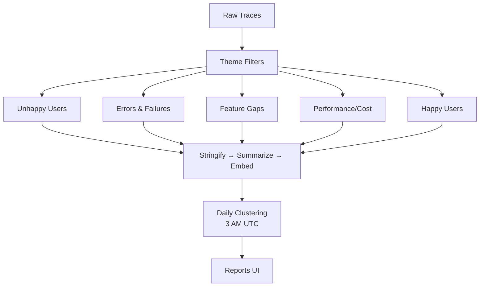

# LLM Traces Summarization - Generalization Summary

## Overview

This feature generalizes the prototype LLM traces summarization system (PR #40364) into a flexible, multi-perspective analysis framework for all PostHog LLM Analytics users.

**Original Feature**: Daily clustering of Max AI conversation traces to surface common user issues
**Generalized Feature**: Configurable analysis themes that can cluster any trace type from any analytical perspective

## Core Concept: Analysis Themes

Instead of one hardcoded "user issues" clustering, we introduce **Analysis Themes** - reusable analytical perspectives that can be applied to any subset of traces:

```text
┌──────────────────────────────────────────────────────────┐
│ Analysis Theme: "Unhappy Users"                          │
├──────────────────────────────────────────────────────────┤
│ • Filters: None (analyze all traces)                     │
│ • Prompt: "Identify frustration and pain points..."      │
│ • theme_relevance: Filter to only unhappy interactions   │
│ • Clustering: Daily at 3 AM UTC                          │
└──────────────────────────────────────────────────────────┘

┌──────────────────────────────────────────────────────────┐
│ Analysis Theme: "Performance/Cost Hotspots"              │
├──────────────────────────────────────────────────────────┤
│ • Filters: latency > 2s OR total_tokens > 10000          │
│ • Prompt: "Explain performance/cost issues..."           │
│ • theme_relevance: Filter to optimization opportunities  │
│ • Clustering: Daily at 3 AM UTC                          │
└──────────────────────────────────────────────────────────┘
```

**Shipped Themes** (out of the box):

1. **Unhappy Users**: Focus on frustration and pain points expressed across all traces - identifies where users are struggling
2. **Errors and Failures**: Traces with errors or failures - surfaces technical issues and failure modes
3. **Feature Gaps**: Where users ask for unsupported capabilities - drives product roadmap from real needs
4. **Performance/Cost Hotspots**: High latency or expensive traces - identifies optimization opportunities
5. **Happy Users**: Success patterns and satisfaction signals - validates what's working well

**Custom Themes**: Users can define their own filters + prompts for domain-specific analysis

## High-Level Architecture



## Pipeline Stages

### 1. **Theme Configuration** (One-time setup)

- Define filters (which traces to analyze)
- Define summary prompt (how to explain each trace)
- Set sampling/scheduling params

### 2. **Batch Processing** (Scheduled)

- **Stringify**: Convert spans/generations to text (via general-purpose endpoint)
- **Summarize**: Generate trace summary using theme prompt (via LLM)
  - Returns structured JSON: `{"theme_relevant": true/false, "summary": "..."}`
  - **theme_relevance filtering**: Only proceed if `theme_relevant=true` (50-90% cost savings)
- **Embed**: Create 3072-dim vector embedding for relevant traces only (stored permanently in ClickHouse)

### 3. **Daily Clustering** (3 AM UTC)

- **Fetch**: Dynamic date range (3→7→14→30 days) until ≥100 traces
- **Cluster**: KMeans with cosine similarity (25-100 traces per cluster)
- **Explain**: Generate name + description for each cluster (via LLM)
- **Store**: Save as `$ai_trace_cluster` events with trace IDs

### 4. **Reports UI** (User-facing)

- **Reports Tab**: One report per theme showing latest clusters
- **Cluster Cards**: Name, description, coverage %, sample summaries
- **View Traces**: Inline modal to explore all traces in a cluster
- **Everything Else**: Special cluster for unclustered traces

## Key Design Decisions

1. **Two-Tier Filtering**: HogQL pre-filters (coarse/cheap), then `theme_relevance` post-filters (fine/expensive) - only embed relevant traces
2. **Embeddings are Durable**: Stored permanently in ClickHouse, reused across features (clustering, similarity search)
3. **Clusters are Ephemeral**: Recomputed daily, versioned by `$ai_clustering_run_id`, serve as insights
4. **Per-Theme Independence**: Each theme operates in isolation with its own embeddings namespace
5. **Native PostHog Patterns**: Use events (`$ai_trace_summary`, `$ai_trace_cluster`) and document store
6. **Graceful Degradation**: If clustering fails, summaries still exist and are searchable

## Storage Model

```text
┌──────────────────────────────────────────────────────────┐
│ ClickHouse Events                                         │
├──────────────────────────────────────────────────────────┤
│ • $ai_trace_summary (one per trace per theme)            │
│   → Properties: theme_id, trace_id, summary text         │
│                                                           │
│ • $ai_trace_cluster (one per cluster per theme per day)  │
│   → Properties: cluster_id, name, description, trace_ids │
│                                                           │
│ Document Embeddings (posthog_document_embeddings)        │
│ • Rendering: llm_traces_summary_{theme_id}               │
│ • Vector: 3072 dimensions (text-embedding-3-large)       │
└──────────────────────────────────────────────────────────┘
```

## User Experience

### Admin/Power User

1. Navigate to LLM Analytics settings
2. Enable/disable shipped themes or create custom themes
3. Configure filters, prompts, sampling strategy
4. Schedule clustering frequency

### End User

1. Navigate to **LLM Analytics > Reports**
2. View theme reports with clustered insights
3. Click cluster to see sample summaries
4. Click "View All Traces" to explore inline modal
5. Click individual trace to see full detail

## Migration Path

The prototype (PR #40364) becomes the first shipped theme:

- Theme ID: `max_ai_user_issues`
- Filters: `generation_name = 'MaxAIAgent.generate'`
- Prompt: Original "explain user issues" prompt
- Existing summaries/clusters migrate to new schema

## Further Reading

- **[GENERALIZATION_PLAN.md](./GENERALIZATION_PLAN.md)**: Detailed migration plan, phases, and risk analysis
- **[GENERALIZATION_ARCHITECTURE.md](./GENERALIZATION_ARCHITECTURE.md)**: Complete technical design, code examples, and API specs
- **[PR #40364](https://github.com/PostHog/posthog/pull/40364)**: Original prototype implementation
- **[PR #40502](https://github.com/PostHog/posthog/pull/40502)**: General-purpose trace stringification endpoint

## Success Metrics

- **Coverage**: % of traces explained by clusters per theme
- **Cluster Quality**: Average cosine similarity within clusters
- **User Engagement**: Report views, trace explorations, custom theme creation
- **Cost Efficiency**: LLM token usage per trace vs insight value
