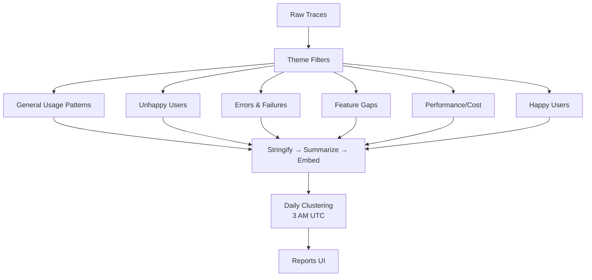

# LLM Traces Summarization - Generalization Summary

## Overview

This feature generalizes the prototype LLM traces summarization system (PR #40364) into a flexible, multi-perspective analysis framework for all PostHog LLM Analytics users.

**Original Feature**: Daily clustering of Max AI conversation traces to surface common user issues
**Generalized Feature**: Configurable analysis themes that can cluster any trace type from any analytical perspective

## Core Concept: Analysis Themes

Instead of one hardcoded "user issues" clustering, we introduce **Analysis Themes** - reusable analytical perspectives that can be applied to any subset of traces:

```text
┌──────────────────────────────────────────────────────────┐
│ Analysis Theme: "Unhappy Users"                          │
├──────────────────────────────────────────────────────────┤
│ • Filters: None (analyze all traces)                     │
│ • Prompt: "Identify frustration and pain points..."      │
│ • theme_relevance: Filter to only unhappy interactions   │
│ • Clustering: Daily at 3 AM UTC                          │
└──────────────────────────────────────────────────────────┘

┌──────────────────────────────────────────────────────────┐
│ Analysis Theme: "Performance/Cost Hotspots"              │
├──────────────────────────────────────────────────────────┤
│ • Filters: latency > 2s OR total_tokens > 10000          │
│ • Prompt: "Explain performance/cost issues..."           │
│ • theme_relevance: Filter to optimization opportunities  │
│ • Clustering: Daily at 3 AM UTC                          │
└──────────────────────────────────────────────────────────┘
```

**Shipped Themes** (out of the box):

1. **General Usage Patterns**: Discover common workflows and interaction patterns across all traces - understand how users actually use the system
2. **Unhappy Users**: Focus on frustration and pain points expressed across all traces - identifies where users are struggling
3. **Errors and Failures**: Traces with errors or failures - surfaces technical issues and failure modes
4. **Feature Gaps**: Where users ask for unsupported capabilities - drives product roadmap from real needs
5. **Performance/Cost Hotspots**: High latency or expensive traces - identifies optimization opportunities
6. **Happy Users**: Success patterns and satisfaction signals - validates what's working well

**Custom Themes**: Users can define their own filters + prompts for domain-specific analysis

## High-Level Architecture



## Pipeline Stages

### 1. **Theme Configuration** (One-time setup)

- Define filters (which traces to analyze)
- Define summary prompt (how to explain each trace)
- Set sampling/scheduling params

### 2. **Batch Processing** (Scheduled)

- **Stringify**: Convert spans/generations to text (via general-purpose endpoint)
- **Summarize**: Generate trace summary using theme prompt (via LLM)
  - Returns structured JSON: `{"theme_relevant": true/false, "summary": "..."}`
  - **theme_relevance filtering**: Only proceed if `theme_relevant=true` (50-90% cost savings)
- **Embed**: Create 3072-dim vector embedding for relevant traces only (stored permanently in ClickHouse)

### 3. **Daily Clustering** (3 AM UTC)

- **Fetch**: Dynamic date range (3→7→14→30 days) until ≥100 traces
- **Cluster**: KMeans with cosine similarity (25-100 traces per cluster)
- **Explain**: Generate name + description for each cluster (via LLM)
- **Store**: Save as `$ai_trace_cluster` events with trace IDs

### 4. **Reports UI** (User-facing)

- **Reports Tab**: One report per theme showing latest clusters
- **Cluster Cards**: Name, description, coverage %, sample summaries
- **View Traces**: Inline modal to explore all traces in a cluster
- **Everything Else**: Special cluster for unclustered traces

## Data Flow: Inputs and Outputs

### Complete Pipeline Overview

```text
┌─────────────────────────────────────────────────────────────────────┐
│ Stage 1: Theme Configuration (One-time User Setup)                  │
├─────────────────────────────────────────────────────────────────────┤
│                                                                       │
│ USER INPUTS (via Settings UI):                                       │
│   • Theme name & description                                         │
│   • HogQL filters (base + theme-specific)                            │
│   • Analysis prompt (with theme_relevance instructions)              │
│   • Sampling rate & max traces                                       │
│   • Schedule (cron expression)                                       │
│                                                                       │
│ SYSTEM CREATES:                                                      │
│   → Django record: AnalysisThemeConfig                               │
│     Fields: theme_id, config (JSON), enabled, schedule               │
│                                                                       │
└─────────────────────────────────────────────────────────────────────┘
                              ↓
┌─────────────────────────────────────────────────────────────────────┐
│ Stage 2: Batch Processing (Scheduled Daily)                         │
├─────────────────────────────────────────────────────────────────────┤
│                                                                       │
│ INPUTS:                                                              │
│   • Raw LLM traces (ClickHouse: llm_traces table)                    │
│   • Theme config (filters, prompt, sampling)                         │
│                                                                       │
│ PROCESSING:                                                          │
│   Step 2a: Query traces (HogQL filters)                              │
│   Step 2b: Stringify each trace → text representation                │
│   Step 2c: Summarize via LLM → JSON response                         │
│            {"theme_relevant": bool, "summary": "..."}                │
│   Step 2d: Filter where theme_relevant=true                          │
│   Step 2e: Embed summaries → 3072-dim vectors                        │
│                                                                       │
│ SYSTEM GENERATES (per trace):                                        │
│   → ClickHouse event: $ai_trace_summary                              │
│     Properties: {                                                    │
│       theme_id, trace_id, summary,                                   │
│       theme_relevant, timestamp                                      │
│     }                                                                 │
│                                                                       │
│   → ClickHouse embedding: posthog_document_embeddings                │
│     Fields: {                                                        │
│       team_id, product="llm_traces_summaries",                       │
│       rendering="llm_traces_summary_{theme_id}",                     │
│       document_id=trace_id, content=summary,                         │
│       vector=[3072 floats]                                           │
│     }                                                                 │
│                                                                       │
└─────────────────────────────────────────────────────────────────────┘
                              ↓
┌─────────────────────────────────────────────────────────────────────┐
│ Stage 3: Daily Clustering (Scheduled 3 AM UTC)                      │
├─────────────────────────────────────────────────────────────────────┤
│                                                                       │
│ INPUTS:                                                              │
│   • Embeddings (from posthog_document_embeddings)                    │
│   • Theme_id (determines which rendering to query)                   │
│   • Date range (dynamic: 3→7→14→30 days until ≥100 traces)          │
│                                                                       │
│ PROCESSING:                                                          │
│   Step 3a: Fetch embeddings for theme (100-10,000 traces)            │
│   Step 3b: KMeans clustering (cosine similarity)                     │
│            → 25-100 traces per cluster                               │
│   Step 3c: For each cluster, LLM generates name + description        │
│            (based on sample summaries)                               │
│   Step 3d: Calculate coverage metrics                                │
│                                                                       │
│ SYSTEM GENERATES (per cluster):                                      │
│   → ClickHouse event: $ai_trace_cluster                              │
│     Properties: {                                                    │
│       clustering_run_id,  ← versioning key                           │
│       theme_id,                                                      │
│       cluster_id,                                                    │
│       cluster_name,                                                  │
│       cluster_description,                                           │
│       trace_ids: [array],                                            │
│       avg_similarity,                                                │
│       coverage_percent                                               │
│     }                                                                 │
│                                                                       │
│   → Special "Everything Else" cluster for unclustered traces         │
│                                                                       │
└─────────────────────────────────────────────────────────────────────┘
                              ↓
┌─────────────────────────────────────────────────────────────────────┐
│ Stage 4: Reports UI (User-Facing Output)                            │
├─────────────────────────────────────────────────────────────────────┤
│                                                                       │
│ INPUTS (API queries):                                                │
│   • Latest $ai_trace_cluster events (by clustering_run_id)           │
│   • $ai_trace_summary events (for trace details)                     │
│   • Original llm_traces (for full trace view)                        │
│                                                                       │
│ USER SEES (Reports Tab):                                             │
│                                                                       │
│ ┌─────────────────────────────────────────────────────────────┐     │
│ │ Theme: Unhappy Users                    Last run: 2h ago     │     │
│ │ 1,250 traces analyzed • 18 clusters found                    │     │
│ │                                                              │     │
│ │ ┌─────────────────────────────────────────────────────────┐ │     │
│ │ │ Cluster 1: Confusing Error Messages (187 traces)       │ │     │
│ │ │ Users frustrated by unclear error messages during...   │ │     │
│ │ │ Coverage: 15% • Similarity: 0.82                       │ │     │
│ │ │ [View Traces] [View Summaries]                         │ │     │
│ │ └─────────────────────────────────────────────────────────┘ │     │
│ │                                                              │     │
│ │ ┌─────────────────────────────────────────────────────────┐ │     │
│ │ │ Cluster 2: Slow Response Times (142 traces)            │ │     │
│ │ │ Users complaining about laggy responses...             │ │     │
│ │ │ Coverage: 11% • Similarity: 0.78                       │ │     │
│ │ │ [View Traces] [View Summaries]                         │ │     │
│ │ └─────────────────────────────────────────────────────────┘ │     │
│ │                                                              │     │
│ │ ... 16 more clusters ...                                     │     │
│ │                                                              │     │
│ │ ┌─────────────────────────────────────────────────────────┐ │     │
│ │ │ Everything Else (321 traces)                           │ │     │
│ │ │ Traces that didn't cluster together                    │ │     │
│ │ └─────────────────────────────────────────────────────────┘ │     │
│ └─────────────────────────────────────────────────────────────┘     │
│                                                                       │
│ INTERACTIONS:                                                        │
│   • Click cluster → View sample summaries (inline)                   │
│   • Click "View Traces" → Modal with all trace_ids in cluster        │
│   • Click individual trace → Full trace detail view                  │
│                                                                       │
└─────────────────────────────────────────────────────────────────────┘
```

### Summary Table: Inputs, Processing, and Outputs

| Stage                   | User Inputs                                                                                            | System Inputs                                        | Processing                                                                                                                | Generated Datasets                                                                   | User-Facing Outputs                                                                       |
| ----------------------- | ------------------------------------------------------------------------------------------------------ | ---------------------------------------------------- | ------------------------------------------------------------------------------------------------------------------------- | ------------------------------------------------------------------------------------ | ----------------------------------------------------------------------------------------- |
| **1. Theme Config**     | • Theme name<br>• Description<br>• HogQL filters<br>• Analysis prompt<br>• Sampling rate<br>• Schedule | • Team ID<br>• User ID                               | Validate & store config                                                                                                   | **Django:**<br>`AnalysisThemeConfig` record                                          | Settings UI showing enabled themes                                                        |
| **2. Batch Processing** | (none - automated)                                                                                     | • Raw llm_traces<br>• Theme config                   | • Query traces (HogQL)<br>• Stringify traces<br>• Summarize (LLM)<br>• Filter by theme_relevance<br>• Generate embeddings | **ClickHouse:**<br>`$ai_trace_summary` events<br>`posthog_document_embeddings` table | (background - no direct UI)                                                               |
| **3. Clustering**       | (none - automated)                                                                                     | • Embeddings<br>• Summaries<br>• Theme config        | • Fetch embeddings<br>• KMeans clustering<br>• Generate cluster names (LLM)<br>• Calculate metrics                        | **ClickHouse:**<br>`$ai_trace_cluster` events                                        | (background - no direct UI)                                                               |
| **4. Reports UI**       | • Select theme<br>• Click clusters<br>• View traces                                                    | • Cluster events<br>• Summary events<br>• Raw traces | • Query latest clusters<br>• Fetch summaries<br>• Fetch traces                                                            | (none - read-only)                                                                   | **Reports Dashboard:**<br>• Cluster cards<br>• Sample summaries<br>• Trace explorer modal |

### Key Datasets Generated

**Permanent Storage (ClickHouse):**

```text
1. $ai_trace_summary events
   Purpose: Searchable summaries per theme per trace
   Retention: Permanent
   Volume: ~3,700 per theme per day (example)
   Properties: theme_id, trace_id, summary, theme_relevant

2. posthog_document_embeddings
   Purpose: Vector similarity search for clustering
   Retention: Permanent
   Volume: Same as summaries (only theme_relevant=true)
   Size: 3072 floats per trace = ~12KB per embedding
   Namespace: llm_traces_summary_{theme_id}
```

**Ephemeral Storage (ClickHouse):**

```text
3. $ai_trace_cluster events
   Purpose: Daily insights, versioned snapshots
   Retention: 90 days (configurable)
   Volume: ~15-25 clusters per theme per day
   Properties: clustering_run_id, cluster_name, trace_ids[], metrics
   Note: Recomputed daily, old versions kept for trends
```

**Configuration Storage (Django):**

```text
4. AnalysisThemeConfig records
   Purpose: User theme configurations
   Retention: Permanent (until user deletes)
   Volume: 5 built-in + N custom per team
```

## Key Design Decisions

1. **Two-Tier Filtering**: HogQL pre-filters (coarse/cheap), then `theme_relevance` post-filters (fine/expensive) - only embed relevant traces
2. **Embeddings are Durable**: Stored permanently in ClickHouse, reused across features (clustering, similarity search)
3. **Clusters are Ephemeral**: Recomputed daily, versioned by `$ai_clustering_run_id`, serve as insights
4. **Per-Theme Independence**: Each theme operates in isolation with its own embeddings namespace
5. **Native PostHog Patterns**: Use events (`$ai_trace_summary`, `$ai_trace_cluster`) and document store
6. **Graceful Degradation**: If clustering fails, summaries still exist and are searchable

## Storage Model

```text
┌──────────────────────────────────────────────────────────┐
│ ClickHouse Events                                         │
├──────────────────────────────────────────────────────────┤
│ • $ai_trace_summary (one per trace per theme)            │
│   → Properties: theme_id, trace_id, summary text         │
│                                                           │
│ • $ai_trace_cluster (one per cluster per theme per day)  │
│   → Properties: cluster_id, name, description, trace_ids │
│                                                           │
│ Document Embeddings (posthog_document_embeddings)        │
│ • Rendering: llm_traces_summary_{theme_id}               │
│ • Vector: 3072 dimensions (text-embedding-3-large)       │
└──────────────────────────────────────────────────────────┘
```

## User Experience

### Admin/Power User

1. Navigate to LLM Analytics settings
2. Enable/disable shipped themes or create custom themes
3. Configure filters, prompts, sampling strategy
4. Schedule clustering frequency

### End User

1. Navigate to **LLM Analytics > Reports**
2. View theme reports with clustered insights
3. Click cluster to see sample summaries
4. Click "View All Traces" to explore inline modal
5. Click individual trace to see full detail

## Migration Path

The prototype (PR #40364) becomes the first shipped theme:

- Theme ID: `max_ai_user_issues`
- Filters: `generation_name = 'MaxAIAgent.generate'`
- Prompt: Original "explain user issues" prompt
- Existing summaries/clusters migrate to new schema

## Further Reading

- **[GENERALIZATION_PLAN.md](./GENERALIZATION_PLAN.md)**: Detailed migration plan, phases, and risk analysis
- **[GENERALIZATION_ARCHITECTURE.md](./GENERALIZATION_ARCHITECTURE.md)**: Complete technical design, code examples, and API specs
- **[PR #40364](https://github.com/PostHog/posthog/pull/40364)**: Original prototype implementation
- **[PR #40502](https://github.com/PostHog/posthog/pull/40502)**: General-purpose trace stringification endpoint

## Success Metrics

- **Coverage**: % of traces explained by clusters per theme
- **Cluster Quality**: Average cosine similarity within clusters
- **User Engagement**: Report views, trace explorations, custom theme creation
- **Cost Efficiency**: LLM token usage per trace vs insight value
