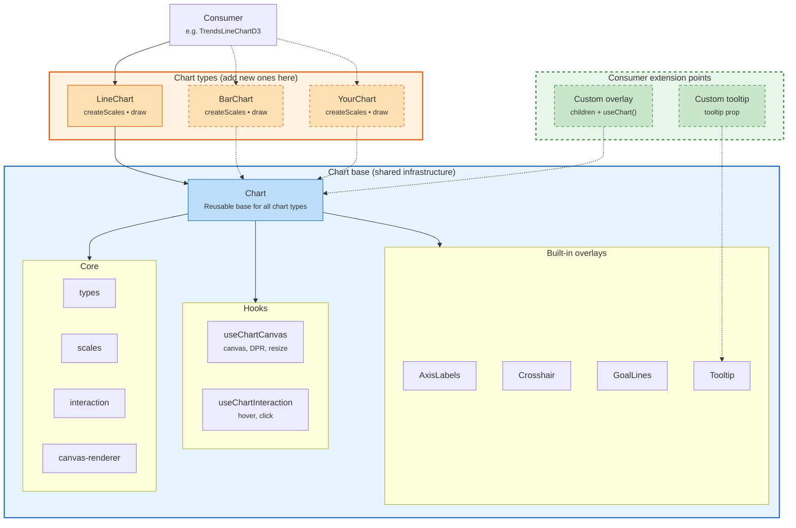

# hog-charts

PostHog's canvas-based charting library built on D3.
Designed for performance (canvas rendering) with React overlays for text and interaction.

## Architecture



## Layers

The library is split into distinct layers with clear responsibilities.
Code should go in the right layer — don't mix concerns across them.

### Chart-type components (`components/LineChart`, future `BarChart`, etc.)

Thin wrappers that provide two things to the base `Chart`:

1. **`createScales`** — a factory that builds `ChartScales` from data + dimensions
   using d3 scales internally
2. **`draw`** — a canvas rendering function called each frame

Chart types may also provide a `resolveValue` function
if they transform data (e.g. percent stacking).

Chart types own the d3 scale details internally (via a ref)
but must not leak d3 types through `ChartScales`.
The public `ChartScales` interface is `x(label) => px`, `y(value) => px`, `yTicks() => number[]`.

### `core/Chart.tsx` — the base component

Generic chart infrastructure shared by all chart types.
Handles:

- Canvas setup + DPR scaling (via `useChartCanvas`)
- The `requestAnimationFrame` draw loop
- Mouse interaction (via `useChartInteraction`)
- Rendering shared overlays (axes, crosshair, goal lines, tooltip)
- Providing `ChartContext` to children via `useChart()`
- Applying fallback series colors from `theme.colors`

**Do not add chart-type-specific logic here.**
If something only applies to line charts, it goes in `LineChart`.
If it applies to all chart types, it goes here.

### `core/canvas-renderer.ts` — drawing primitives

Pure functions that draw to a `CanvasRenderingContext2D`.
Each function takes a `DrawContext` (ctx, dimensions, d3 scales, labels) and draws one thing.

- `drawLine`, `drawArea`, `drawPoints` — series rendering
- `drawGrid` — horizontal grid lines
- `drawHighlightPoint` — hover dot with background halo

New canvas drawing goes here, not in chart-type components.
These functions must be stateless — no React, no hooks, no side effects.

### `core/scales.ts` — d3 scale factories

Creates d3 scales from data and dimensions.
This is the only file that should construct `d3.scaleLinear`, `d3.scalePoint`, etc.

Also contains `computePercentStackData` for stacking transforms.

### `core/interaction.ts` — hit testing and data builders

Pure functions for:

- Finding the nearest data point to a mouse position (`findNearestIndex`)
- Building tooltip context and click data from a hover index
- Testing if a point is inside the plot area

No React, no state — just geometry and data lookups.

### `core/types.ts` — all type definitions

Every interface and type for the library lives here.
Chart types, consumers, and overlays all import from this file.

### `overlays/` — DOM components rendered on top of the canvas

React components for things that need text rendering, accessibility, or CSS:
axis labels, crosshair line, tooltip, goal lines.

Overlays access chart state via `useChart()` — no prop drilling from Chart.
They render with `pointerEvents: 'none'` so they don't interfere with canvas interaction.

Shared overlays (used by all chart types) are rendered by `Chart.tsx`.
Chart-type-specific overlays can be passed as `children`.

## Rules

- **No kea, no PostHog imports.**
  This is a standalone React + d3 library.
  Theme, colors, and data are passed in as props.
  The consumer is responsible for building them from app state.
- **`ChartScales` must not expose d3 types.**
  Chart types use d3 internally, but the `ChartScales` interface
  seen by `Chart`, overlays, and consumers is plain functions:
  `x(label) => px`, `y(value) => px`, `yTicks() => number[]`.
- **Canvas functions are stateless.**
  Everything in `canvas-renderer.ts` is a pure function.
  It draws to a context and returns nothing.
- **Overlays use `useChart()`, not props from Chart.**
  This keeps the Chart component's JSX clean
  and lets custom overlays access the same data.

## Adding a new chart type

```tsx
import { Chart } from '../core/Chart'
import type { ChartDrawArgs, ChartScales, CreateScalesFn } from '../core/types'

export function BarChart({ series, labels, config, theme, ...props }: BarChartProps) {
  const createScales: CreateScalesFn = useCallback((coloredSeries, scaleLabels, dimensions) => {
    // Use d3.scaleBand for x-axis instead of scalePoint
    return { x, y, yTicks: () => yScale.ticks() }
  }, [])

  const draw = useCallback(({ ctx, dimensions, scales, series, labels, hoverIndex }: ChartDrawArgs) => {
    // Draw bars using canvas-renderer primitives or custom drawing
  }, [])

  return (
    <Chart
      series={series}
      labels={labels}
      config={config}
      theme={theme}
      createScales={createScales}
      draw={draw}
      {...props}
    >
      {/* Bar-chart-specific overlays as children */}
    </Chart>
  )
}
```

## File structure

```text
hog-charts/
  index.ts                  Public API exports
  components/
    LineChart.tsx            Line/area chart wrapper
  core/
    Chart.tsx                Reusable base component
    chart-context.ts         React context + useChart() hook
    types.ts                 All type definitions
    scales.ts                D3 scale creation + percent stacking
    interaction.ts           Hit testing, tooltip/click data builders
    canvas-renderer.ts       Canvas drawing primitives (line, area, points, grid)
    use-chart-canvas.ts      Canvas + ResizeObserver hook
    use-chart-interaction.ts Hover, click state + handlers
  overlays/
    AxisLabels.tsx           X/Y axis tick labels
    Crosshair.tsx            Vertical hover line
    DefaultTooltip.tsx       Built-in tooltip content
    Tooltip.tsx              Tooltip positioning wrapper
    GoalLines.tsx            Horizontal reference lines
```

## Public API

The public API is intentionally small. Consumers should only need:

```tsx
import { LineChart } from 'lib/hog-charts'
import type { LineChartConfig, Series, ChartTheme } from 'lib/hog-charts'
```

For custom overlays rendered as children, use `useChart()` to access scales, dimensions, and hover state.

For custom tooltip content, pass a component to the `tooltip` prop.
It receives `TooltipContext` as props. Omit to use the built-in `DefaultTooltip`.
