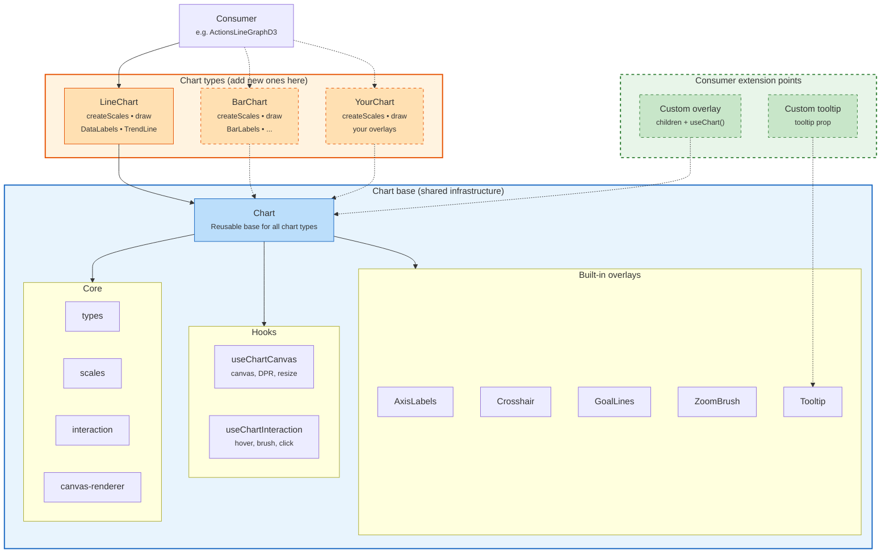

# hog-charts

PostHog's canvas-based charting library built on D3.
Designed for performance (canvas rendering) with React overlays for text and interaction.

## Architecture



## Key concepts

**Chart** is the reusable base.
It handles canvas setup, hover/brush interaction, shared overlays (axes, crosshair, tooltip, goal lines, zoom brush),
and provides `ChartContext` to all descendants via `useChart()`.

**Chart-type wrappers** (e.g. `LineChart`) are thin.
They provide three things:

1. `createScales` -- a factory that builds `ChartScales` from data + dimensions
2. `draw` -- a canvas rendering function called each frame
3. Chart-specific overlays as `children` (e.g. `<DataLabels/>`, `<TrendLine/>`)

**Overlays** are React components rendered as DOM on top of the canvas.
They access chart state via `useChart()` rather than prop drilling.

## Adding a new chart type

```tsx
import { Chart } from '../core/Chart'
import type { ChartDrawArgs, ChartScales, CreateScalesFn } from '../core/types'

export function BarChart({ series, labels, config, ...props }: BarChartProps) {
  const createScales: CreateScalesFn = useCallback(
    (coloredSeries, scaleLabels, dimensions) => {
      // Use d3.scaleBand for x-axis instead of scalePoint
      return { x, y, yAxes, yRaw }
    },
    [
      /* scale config deps */
    ]
  )

  const draw = useCallback(
    ({ ctx, dimensions, scales, series, labels, hoverIndex }: ChartDrawArgs) => {
      // Draw bars instead of lines
    },
    [
      /* draw deps */
    ]
  )

  return (
    <Chart series={series} labels={labels} config={config} createScales={createScales} draw={draw} {...props}>
      {/* Bar-chart-specific overlays */}
    </Chart>
  )
}
```

## File structure

```text
hog-charts/
  index.ts                  Public API exports
  components/
    LineChart.tsx            Line/area chart wrapper
  core/
    Chart.tsx                Reusable base component
    chart-context.ts         React context + useChart() hook
    types.ts                 All type definitions
    scales.ts                D3 scale creation + percent stacking
    interaction.ts           Hit testing, tooltip/click data builders
    canvas-renderer.ts       Canvas drawing primitives (line, area, points, grid)
    use-chart-canvas.ts      Canvas + ResizeObserver hook
    use-chart-interaction.ts Hover, brush, click state + handlers
  overlays/
    AxisLabels.tsx           X/Y axis tick labels
    Crosshair.tsx            Vertical hover line
    DefaultTooltip.tsx       Built-in tooltip content
    Tooltip.tsx              Tooltip positioning wrapper
    GoalLines.tsx            Horizontal reference lines
    DataLabels.tsx           Inline value labels (line-chart-specific)
    TrendLine.tsx            Linear regression overlay (line-chart-specific)
    ZoomBrush.tsx            Drag-to-select range highlight
```

## Public API

The public API is intentionally small. Consumers should only need:

```tsx
import { LineChart } from 'lib/hog-charts'
import type { LineChartConfig, Series } from 'lib/hog-charts'
```

For custom overlays rendered as children, use `useChart()` to access scales, dimensions, and hover state.

For custom tooltip content, pass a component to the `tooltip` prop.
It receives `TooltipContext` as props. Omit to use the built-in `DefaultTooltip`.
