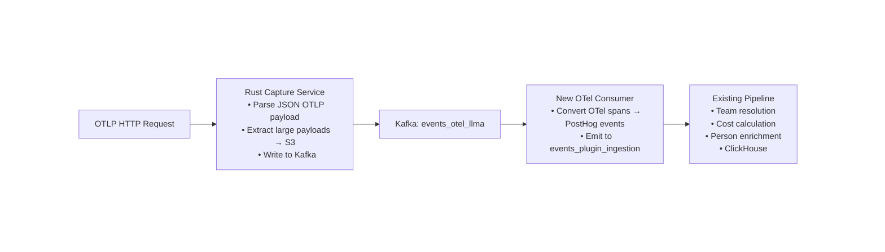

# OTLP Ingestion for PostHog LLM Analytics: Design Document

## Overview

Add native OTLP (OpenTelemetry Protocol) ingestion to PostHog so users with OpenLIT, OpenLLMetry, or other OTel-based LLM instrumentation can send observability data directly to PostHog without using our custom SDK.

## Architecture

## Design Decisions

### 1. Protocol: HTTP Only (MVP)

**Decision:** Support HTTP OTLP only, not gRPC.

**Rationale:** Research shows HTTP is universally supported:

- OpenLIT: HTTP only
- Langfuse: HTTP only ("does not support gRPC")
- LangSmith: Defaults to HTTP
- OpenLLMetry/Traceloop: Supports both, auto-detects

Users requiring gRPC can run OTel Collector as a sidecar for gRPC→HTTP translation.

**Alternative considered:** Supporting both protocols would increase complexity in Rust capture service (gRPC server) with minimal benefit for the primary use case (OpenLIT users).

### 2. Endpoint: `/i/v0/llma_otel`

**Decision:** Use PostHog convention (`/i/v0/llma_otel`) rather than standard OTel paths (`/otel/v1/traces`).

**Rationale:**

- Consistent with existing PostHog ingestion endpoints
- OTel spec explicitly allows custom paths
- Users configure endpoint URL anyway, so path doesn't matter

**Scope:** Traces only for MVP. Metrics and logs endpoints deferred.

### 3. Authentication: Bearer Token in Header

**Decision:** Use `Authorization: Bearer phc_xxx` header for project token.

**Rationale:**

- Standard HTTP auth pattern
- OpenLIT supports `otlp_headers` parameter and `OTEL_EXPORTER_OTLP_HEADERS` env var
- All major OTel SDKs support custom headers

**Error handling:** Missing or malformed token returns 401.

### 4. Processing Split: Rust for Protocol, Node for Transformation

**Decision:**

- Rust handles: JSON parsing, blob extraction to S3, Kafka write
- New OTel consumer: OTel → PostHog event conversion, emit to standard pipeline
- Existing pipeline: Team resolution, cost calculation, person enrichment

**Rationale:** Maintains existing separation of concerns. The new consumer only does the OTel-specific transformation; everything else reuses existing infrastructure.

### 5. Kafka: New Dedicated Topic

**Decision:** Create new topic `events_otel_llma` with dedicated consumer.

**Rationale:**

- Clean separation from existing ingestion paths
- Allows independent scaling and monitoring
- OTel payloads have different shape than current AI events
- Consumer can be optimized for batch processing (OTel batches spans)

**Alternative considered:** Reusing `events_plugin_ingestion` with a marker property would mix OTel-specific processing into the existing pipeline.

### 6. Blob Handling: Heuristic Detection

**Decision:** Use heuristics to identify large payloads for S3 upload:

- Size threshold (TBD, will tune based on real data)
- Deep inspection of `gen_ai.input.messages` and `gen_ai.output.messages` for base64-encoded content in JSON arrays

**Rationale:** OTel has no native blob concept. Message content in `gen_ai.*.messages` attributes can contain large prompts, completions, or base64-encoded images.

**Deferred:** Exact threshold and detection rules to be tuned during implementation based on real payloads.

### 7. Event Type Mapping

**Decision:** Map OTel spans to PostHog events based on `gen_ai.operation.name`:

| OTel `gen_ai.operation.name` | PostHog Event    |
| ---------------------------- | ---------------- |
| `chat`                       | `$ai_generation` |
| `embeddings`                 | `$ai_embedding`  |
| Other / not present          | `$ai_span`       |

**Trace handling:** Do not emit explicit `$ai_trace` events. PostHog's pseudo-trace feature automatically synthesizes trace groupings from child events sharing the same `$ai_trace_id`.

### 8. Attribute Mapping

**Core mappings:**

| OTel Attribute               | PostHog Property           |
| ---------------------------- | -------------------------- |
| `trace_id`                   | `$ai_trace_id`             |
| `parent_span_id`             | `$ai_parent_id`            |
| `span_id`                    | `$ai_span_id`              |
| `gen_ai.input.messages`      | `$ai_input`                |
| `gen_ai.output.messages`     | `$ai_output`               |
| `gen_ai.usage.input_tokens`  | `$ai_input_tokens`         |
| `gen_ai.usage.output_tokens` | `$ai_output_tokens`        |
| `gen_ai.request.model`       | `$ai_model`                |
| `gen_ai.provider.name`       | `$ai_provider`             |
| `user.id`                    | `distinct_id` (if present) |

**Resource attributes:** Pass through as normal event properties.

**Unmapped attributes:** Pass through with original OTel names as event properties.

### 9. Identity Handling

**Decision:** Map `user.id` → `distinct_id`. If not present, let existing pipeline handle it.

### 10. Cost Calculation

**Decision:** Map token/model attributes to PostHog properties; existing pipeline calculates costs.

### 11. Trace ID Format

**Decision:** Pass OTel trace IDs through as-is.

**Rationale:**

- OTel uses 128-bit hex strings, PostHog's `$ai_trace_id` is a string with no format restrictions
- Preserving original IDs allows correlation with other OTel backends
- Users are expected to pick one ingestion method; deduplication across methods is not our problem

### 12. Ingestion Source Tracking

**Decision:** Add `$ai_ingestion_source: 'otel'` property to all events from this path.

**Rationale:**

- Enables filtering/debugging in dashboards
- Consistent with SDK source tracking
- Helps users who accidentally send via both paths identify duplicates

### 13. Batching

**Decision:** Handle OTLP batch exports natively. Single request may contain hundreds of spans.

**Rationale:** OTLP exporters batch spans by default. Mirror existing batch handling for non-AI events.

### 14. Rate Limiting

**Decision:** Apply same rate limiting as existing batch endpoints.

**Rationale:** Consistent behavior, reuse existing infrastructure.

### 15. Error Responses

**Decision:** Follow OTel error semantics:

| Status      | Meaning                                 | Client Behavior                         |
| ----------- | --------------------------------------- | --------------------------------------- |
| 200         | Success (may include `partial_success`) | Done                                    |
| 400         | Malformed request                       | Do not retry                            |
| 401         | Auth failure                            | Do not retry                            |
| 429         | Rate limited                            | Retry with backoff, honor `Retry-After` |
| 502/503/504 | Server error                            | Retry with exponential backoff          |

## Out of Scope (MVP)

- gRPC support
- Metrics endpoint (`/v1/metrics`)
- Logs endpoint (`/v1/logs`)
- Server-side deduplication across ingestion paths
- Custom pricing via OTel attributes

## Open Questions (To Resolve During Implementation)

1. **Blob size threshold:** What byte size triggers S3 upload?
2. **Base64 detection:** Regex pattern vs content-type hints for identifying embedded images?
3. **Kafka message format:** Exact schema for messages on `events_otel_llma` topic
4. **Port configuration:** Same port as existing capture service or separate?
