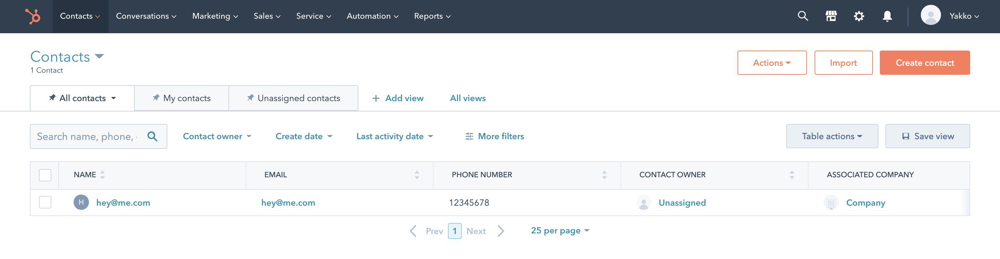

## Hubspot
## Category: Data out
## Status: Official PostHog plugin

A plugin to send contact data to Hubspot, from PostHog.



### What is Hubspot?
Hubspot is a full-featured marketing and CRM platform which includes tools for everything from managing inbound leads to building landing pages. As one of the world’s most popular CRM platforms, Hubspot is an essential PostHog integration for many organizations — and is especially popular with marketing teams. 

### How does Hubspot integrate with PostHog?
This PostHog plugin enables you to send user contact data to Hubspot whenever an ```$identify``` event occurs. That is, whenever PostHog detects the identity of a user, it can forward that identification information to Hubspot. 

Currently, this integration supports sending the following data to Hubspot:

- Email addresses
- First names
- Last names
- Phone numbers
- Company names
- Company website URLs

No other information can currently be sent to PostHog using this plugin. If this plugin exists in a [plugin chain](/docs/plugins/build#example-of-a-plugin-chain) where the above information would is filtered out (for example, by using the [Property Filter plugin](/integrations/property-filter)) then filtered information cannot be sent to Hubspot. 

## Use cases
This Hubspot integration is typically useful for keeping customer and lead data up-to-date and for centralizing information about users that interact with your product into Hubspot. 

Once this information is in Hubspot, you can take advantage of Hubspot’s many marketing and CRM capabilities — such as assigning users as leads to a salesperson. 

## How to install the Hubspot integration on PostHog
Plugins and integrations are currently only available for self-hosted deployments of PostHog and are not available for users on PostHog Cloud. 

Want to migrate from PostHog Cloud to a self-hosted deployment? Check out [the Migrator 3000 plugin](/integrations/migrator-3000-(beta))!

To install this plugin on a self-hosted deployment, simply follow these steps:

1. Visit 'Project Plugins' under 'Settings'
2. Enable plugins if you haven't already done so
3. Click the 'Repository' tab next to 'Installed'
4. Click 'Install' on this plugin
5. Add your [Hubspot API key](https://developers.hubspot.com/docs/api/overview) at the configuration step
6. Enable the plugin

## Open source license 
All PostHog plugins are open source and released under a permissive MIT license. This means you are free to make further contributions or changes to this plugin, so long as a copy of the license and copyright information is included with the software. 

## Contributors
This is an official PostHog plugin, which is maintained by the core PostHog team. 

The following people have contributed to the development of this plugin:

- [yakkomajuri](https://github.com/yakkomajuri)
- [marcushyett-ph](https://github.com/marcushyett-ph)
- [mariusandra](https://github.com/mariusandra)
- [oneshot-engineering](https://github.com/oneshot-engineering)
- [pauldambra](https://github.com/pauldambra)
- [kpthatsme](https://github.com/kpthatsme)

Interested in contributing? Check out [PostHog’s plugin docs](/docs/plugins) to get started. 

## Further reading
- [PostHog plugin documentation](/docs/plugins)
- [Hubspot API documentation](https://developers.hubspot.com/docs/api/overview)
- [Join the PostHog community Slack group](/slack)
