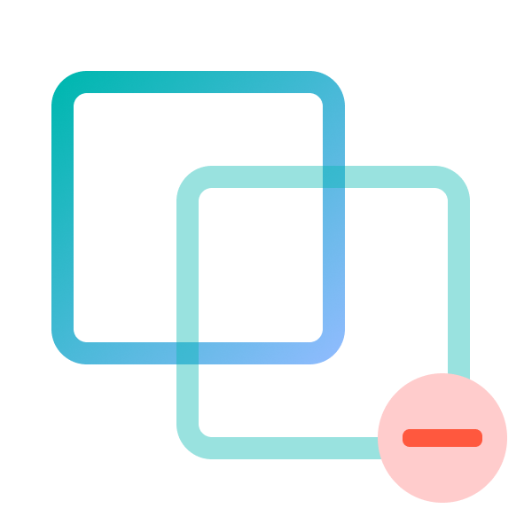

# PostHog Community App: Unduplicator

This app helps prevent duplicate events from being ingested into PostHog. It's particularly helpful if you're backfilling information while you're already ingesting ongoing events. The app crafts an event UUID based on key properties for the event so if the event is _the same_ (see below for definition) it'll end with the same UUID.

When events areprocessed by ClickHouse, the DB will automatically dedupe events which have the same `toDate(timestamp)`,
`event`, `distinct_id` and `uuid` combo, effectively making sure duplicates are not stored.

The app has two modes (which essentially define what's considered a duplicate event). Either mode will scope duplicates to a **each project**, duplicates across projects are still permitted.

-   **Event and Timestamp**. An event will be treated as duplicate if the timestamp, event name and user's distinct ID matches exactly, regardless of what internal properties are included.
-   **All Properties**. An event will be treated as duplicate only all properties match exactly, as well as the timestamp, event name and user's distinct ID.

## 🚀 Usage

To use it simply install the app from the repository URL: https://github.com/paolodamico/posthog-app-unduplicator or search for it in the PostHog App Library.

## 🧑‍💻 Development & testing

Contributions are welcomed! Feel free to open a PR or an issue. To develop locally and contribute to this package, you can simply follow these instructions after clonning the repo.

-   Install dependencies
    ```bash
    yarn install
    ```
-   Run tests
    ```bash
    yarn test
    ```
-   Install app in your local instance by going to `/project/apps` in your PostHog instance, clicking on the "Advanced" tab and entering the full path where you cloned the repo. Please note that running apps locally on PostHog is currently buggy (see [posthog#7170](https://github.com/PostHog/posthog/issues/7170)).

## 🧑‍⚖️ License

This repository is MIT licensed. Please review the LICENSE file in this repository.

Copyright (C) 2022 Paolo D'Amico.
