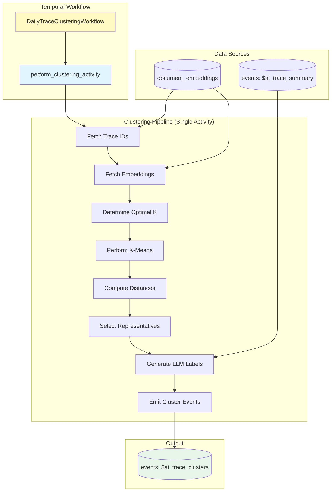

# Daily Trace Clustering

Automated workflow for clustering LLM traces based on their semantic embeddings, discovering patterns and grouping similar traces to help users understand their LLM application behavior.

## File Structure

```text
posthog/temporal/llm_analytics/trace_clustering/
├── workflow.py              # Temporal workflow definition (thin wrapper)
├── clustering.py            # Main orchestration (performs full clustering pipeline)
├── data.py                  # Data access layer (all ClickHouse queries)
├── clustering_utils.py      # K-means implementation and distance calculations
├── labeling.py              # LLM-based cluster labeling
├── event_emission.py        # Event building and emission to ClickHouse
├── models.py                # Data models (ClusteringInputs, ClusteringResult, etc.)
├── constants.py             # Configuration constants (timeouts, defaults, k range)
├── coordinator.py           # Coordinator workflow (discovers teams and spawns child workflows)
├── schedule.py              # Temporal schedule configuration
├── test_workflow.py         # Workflow and activity tests
└── README.md                # This file
```

## Overview

This workflow implements trace clustering for LLM analytics:

1. **Fetch trace IDs** - Query trace IDs from embeddings table for the time window
2. **Fetch embeddings** - Load embedding vectors for the trace IDs
3. **Determine optimal k** - Test k values and pick best using silhouette score
4. **Perform clustering** - Run k-means clustering with optimal k
5. **Compute distances** - Calculate distance from each trace to cluster centroids
6. **Select representatives** - Pick traces closest to each centroid for labeling
7. **Generate labels** - Use LLM to create human-readable titles and descriptions
8. **Emit events** - Store results as `$ai_trace_clusters` events in ClickHouse

The workflow is designed to run on a schedule (daily) and is **versioned** - each run creates a fresh clustering that can be tracked over time.

## Architecture



## Workflow Details

### Main Workflow

**Name**: `daily-trace-clustering`

**Inputs** (`ClusteringInputs`):

- `team_id` (required): Team ID to cluster traces for
- `current_time` (auto): Timestamp from workflow.now()
- `lookback_days` (optional): Days of trace history to analyze (default: 7)
- `max_samples` (optional): Maximum traces to sample (default: 2000)
- `min_k` (optional): Minimum number of clusters to test (default: 3)
- `max_k` (optional): Maximum number of clusters to test (default: 6)
- `window_start` (optional): Explicit window start in RFC3339 format (overrides lookback_days)
- `window_end` (optional): Explicit window end in RFC3339 format (overrides lookback_days)

### Single Activity Architecture

The workflow uses a **single activity** (`perform_clustering_activity`) that runs the entire clustering pipeline. This design:

- Avoids passing large embedding data through Temporal workflow history
- Keeps all data processing in a single execution context
- Uses `asyncio.to_thread()` to run synchronous code (Django ORM, ClickHouse queries) safely

The activity internally calls `perform_clustering()` which orchestrates:

1. **data.py** - `fetch_trace_ids_for_clustering()`, `fetch_embeddings_by_trace_ids()`, `fetch_trace_summaries()`
2. **clustering_utils.py** - `determine_optimal_k()`, `perform_kmeans_clustering()`, `calculate_trace_distances()`, `select_representatives_from_distances()`
3. **labeling.py** - `generate_cluster_labels()`
4. **event_emission.py** - `emit_cluster_events()`

### Module Responsibilities

**`workflow.py`** - Temporal workflow wrapper:

- Defines `DailyTraceClusteringWorkflow` class
- Single activity with 30-minute timeout
- Passes inputs with workflow.now() timestamp

**`clustering.py`** - Main orchestration:

- `perform_clustering()` - Runs the complete pipeline
- Computes distances once and passes downstream
- Handles window calculation from lookback_days

**`data.py`** - Data access layer:

- `fetch_trace_ids_for_clustering()` - Query trace IDs from embeddings table
- `fetch_embeddings_by_trace_ids()` - Fetch embedding vectors
- `fetch_trace_summaries()` - Fetch trace summaries for LLM labeling

**`clustering_utils.py`** - Clustering algorithms:

- `determine_optimal_k()` - Test k values using silhouette score
- `perform_kmeans_clustering()` - Run k-means with optimal k
- `calculate_trace_distances()` - Compute distances to all centroids
- `select_representatives_from_distances()` - Pick traces closest to centroids

**`labeling.py`** - LLM label generation:

- `generate_cluster_labels()` - Create titles and descriptions
- Uses trace summaries (title, flow_diagram, bullets, interesting_notes)
- Calls OpenAI with structured output for consistent formatting

**`event_emission.py`** - Event building and emission:

- `emit_cluster_events()` - Create and emit `$ai_trace_clusters` event
- Builds cluster data with traces sorted by distance rank

### Output Events

Each clustering run generates one `$ai_trace_clusters` event with native JSON structure:

```python
{
    "$ai_clustering_version": "v1",
    "$ai_clustering_run_id": "team_123_2025-01-23T00:00:00Z",
    "$ai_team_id": 123,
    "$ai_timestamp": "2025-01-23T00:00:00Z",

    # Window & parameters
    "$ai_window_start": "2025-01-16T00:00:00Z",
    "$ai_window_end": "2025-01-23T00:00:00Z",
    "$ai_total_traces_analyzed": 1847,
    "$ai_sampled_traces_count": 1847,
    "$ai_optimal_k": 4,

    # Quality metrics
    "$ai_silhouette_score": 0.42,
    "$ai_inertia": 1234.56,

    # Clusters array (native JSON, not string)
    "$ai_clusters": [
        {
            "cluster_id": 0,
            "size": 523,
            "title": "Weather Data Retrieval",
            "description": "Traces focusing on weather information queries...",
            "trace_ids": ["trace_1", "trace_2", ...],
            "traces": [
                {
                    "trace_id": "trace_1",
                    "distance_to_centroid": 0.38,
                    "rank": 0  # Closest to centroid
                },
                {
                    "trace_id": "trace_2",
                    "distance_to_centroid": 0.42,
                    "rank": 1
                },
                # ... all traces in cluster, sorted by distance
            ],
            "centroid": [0.123, -0.456, ...]  # 3072-dimensional vector
        },
        # ... more clusters
    ]
}
```

**Notes**:

- `$ai_clusters` is stored as **native JSON** (not a JSON string)
- Each trace includes `rank` (0-indexed position by distance to centroid)
- Traces are sorted by `distance_to_centroid` within each cluster
- Centroids enable assigning new traces to existing clusters

## Usage

### Manual Trigger (Development/Testing)

```bash
# Using Temporal CLI
temporal workflow start \
  --task-queue development-task-queue \
  --type daily-trace-clustering \
  --workflow-id "trace-clustering-test-$(date +%Y%m%d-%H%M%S)" \
  --input '{"team_id": 1, "current_time": "'$(date -u +%Y-%m-%dT%H:%M:%SZ)'", "lookback_days": 7, "max_samples": 500, "min_k": 3, "max_k": 6}'

# Check status
temporal workflow describe --workflow-id "trace-clustering-test-YYYYMMDD-HHMMSS"
```

### Query Results

```python
import os
os.environ.setdefault('DJANGO_SETTINGS_MODULE', 'posthog.settings')
import django
django.setup()

import json
from posthog.clickhouse.client.execute import sync_execute

results = sync_execute('''
    SELECT
        timestamp,
        JSONExtractInt(properties, '$ai_optimal_k') as optimal_k,
        JSONExtractFloat(properties, '$ai_silhouette_score') as silhouette_score,
        JSONExtractRaw(properties, '$ai_clusters') as clusters
    FROM events
    WHERE event = '$ai_trace_clusters'
    ORDER BY timestamp DESC
    LIMIT 1
''')

if results:
    clusters = json.loads(results[0][3])
    for c in clusters:
        print(f"Cluster {c['cluster_id']}: {c['title']} ({c['size']} traces)")
```

### Scheduled Execution

The coordinator workflow (`trace-clustering-coordinator`) runs on a schedule and:

1. Discovers teams with sufficient trace embeddings
2. Spawns clustering workflow for each team
3. Handles failures gracefully

Team allowlist in `constants.py`:

```python
ALLOWED_TEAM_IDS: list[int] = [
    1,      # Local development
    2,      # Internal PostHog project
    112495, # Dogfooding project
]
```

## Configuration

Key constants in `constants.py`:

| Constant | Default | Description |
|----------|---------|-------------|
| `DEFAULT_LOOKBACK_DAYS` | 7 | Days of trace history to analyze |
| `DEFAULT_MAX_SAMPLES` | 2000 | Maximum traces to sample |
| `DEFAULT_MIN_K` | 3 | Minimum clusters to test |
| `DEFAULT_MAX_K` | 6 | Maximum clusters to test |
| `MIN_TRACES_FOR_CLUSTERING` | 20 | Minimum traces required |
| `CLUSTERING_ACTIVITY_TIMEOUT` | 30 min | Activity timeout |
| `DEFAULT_TRACES_PER_CLUSTER_FOR_LABELING` | 7 | Representatives for LLM |
| `CLUSTERING_VERSION` | "v1" | Algorithm version |

## Processing Flow

1. **Fetch Data** (< 1 min)
   - Query trace IDs from `posthog_document_embeddings`
   - Fetch embeddings for those trace IDs
   - Sample if more than `max_samples`

2. **Determine Optimal K** (< 2 min)
   - Test k values from `min_k` to `max_k`
   - Calculate silhouette score for each
   - Pick k with highest score

3. **Cluster & Compute Distances** (< 1 min)
   - Run k-means with optimal k
   - Compute distance matrix (traces × centroids)
   - **Distances computed once and reused**

4. **Select Representatives** (< 1 sec)
   - For each cluster, pick N traces closest to centroid
   - Uses pre-computed distance matrix

5. **Generate Labels** (< 2 min)
   - Fetch trace summaries from `$ai_trace_summary` events
   - Build prompt with representative trace details
   - Call OpenAI to generate titles and descriptions

6. **Emit Events** (< 1 sec)
   - Build cluster data with traces sorted by distance
   - Emit single `$ai_trace_clusters` event

## Error Handling

- **Insufficient data**: Skip clustering if fewer than 20 traces
- **Activity retries**: 3 attempts with exponential backoff
- **Workflow timeout**: 30 minutes maximum
- **LLM fallback**: If label generation fails, use "Cluster N" as title

## Testing

```bash
pytest posthog/temporal/llm_analytics/trace_clustering/test_workflow.py -v
```

Test coverage:

- Optimal k selection with silhouette scores
- K-means clustering with reproducibility
- Distance calculations
- Representative selection from pre-computed distances
- Event emission with correct schema

## Dependencies

- **sklearn**: K-means clustering and silhouette score
- **numpy**: Vector operations and distance calculations
- **OpenAI**: LLM-based cluster labeling (gpt-4o-mini)
- **Temporal**: Workflow orchestration

## References

- Main clustering issue: [#40787](https://github.com/PostHog/posthog/issues/40787)
- Trace summarization workflow: `posthog/temporal/llm_analytics/trace_summarization/`
- Document embeddings: `products/error_tracking/backend/embedding.py`
